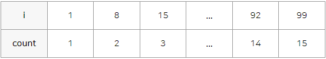
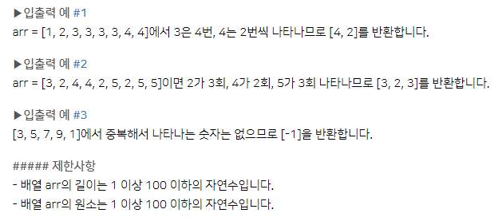
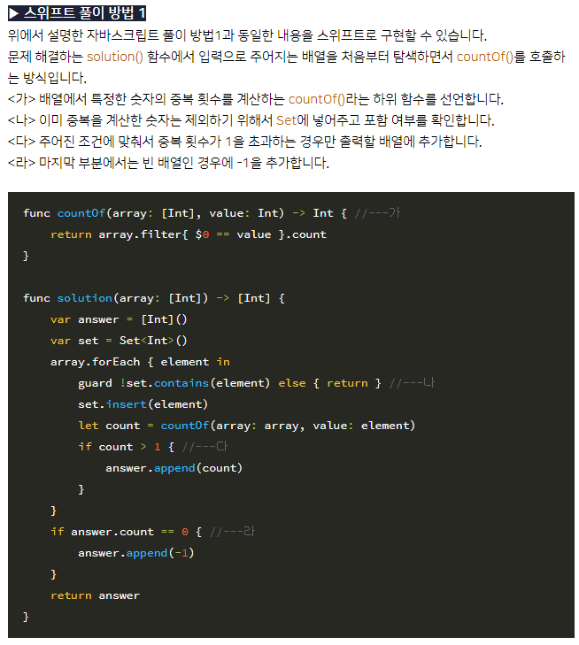
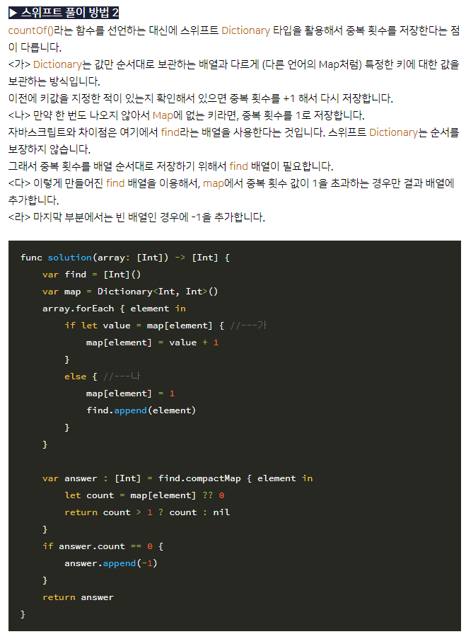
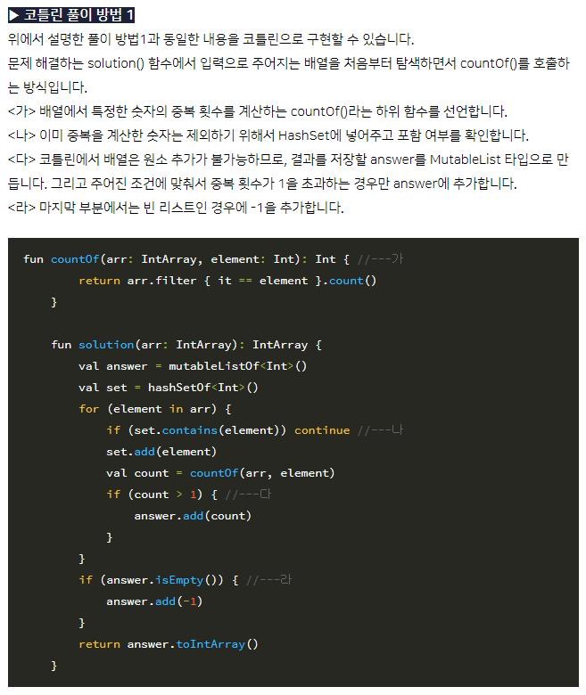
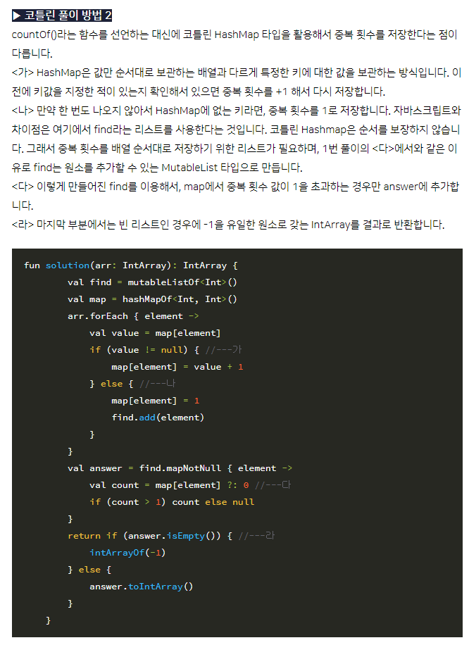

# 부스트캠프 웹, 모바일 자가진단
## **1) 논리적 추론**
### 문제) A, B, C 세 사람이 함께 있는 데 그 중 한명이 빵을 먹었다. 두 사람은 진실을 말하고, 다른 한 명은 거짓을 말한다. 거짓말을 한 사람과 빵을 먹은 사람은?
* 진술
  
  * A : 내가 빵을 먹었다.
  * B : A가 한 말을 거짓말이다.
  * C : B가 빵을 먹었다.

### 답) A, B
### 풀이설명) 
A와 C의 진술은 모순이므로 동시에 동일한 진리값(참/거짓)을 가질 수 없다.
즉 B의 진술은 진실이고 A, C중에 거짓말을 하였다.

만약 C가 거짓말을 했다면 A가 빵을 먹었다는 A의 진술과 A의 말이 거짓이라는 B의 진술이 모순되므로 이 경우는 틀렸다.

만약 A가 거짓말을 했다면 A는 거짓 B, C가 진실이므로 A, B가 답이고 어느 진술도 모순되지 않는다. 따라서 답은 A, B가 된다.

## **공식블로그 답**
### 문제의 해석
* 논리적 이해, 결과를 논리적으로 연역적으로 사고해서 추론할 수 있어야 한다.
### 문제의 풀이
* A말이 거짓이어야 B말도 참이고 C도 참이 될 수 있다. 따라서 A 거짓 B가 빵을 먹었다.

---
## **2) 패턴찾기**
### 문제) 다음 빈칸에 나올 수를 예상해보세요.
    1, 3, 6, 11, 19, 31, 48, (), ...
### 답) 71
### 풀이설명)
1,3,6,11,19,31,48의 차는
2,3,5,8,12,17

2,3,5,8,12,17의 차는
1,2,3,4,5

따라서 다음 올 수는 17+6+48=71 이다.

## **공식블로그 답**
### 문제의 해석
* 수열- 반복되는 규칙이나 패턴을 찾고 정의나 식으로 표현할 수 있어야
### 문제의 풀이
* 차이를 계산한 사이의 숫자가 규칙적으로 변하는지 확인
	```
	2-3-5-8-12-17-?
	```
* 1,2,3,4,5,...의 순서로 규칙적으로 변한다는 것을 예측하고 23을 유추(17+6), 71이 빈칸의 값(48+23)

---
## **3) 반복구조**
### 문제) 밑의 부분을 실행한 이후 count 값은 어떻게 될까요?
```javascript
count = 0;
for (int i = 1 ; i <= 100; i += 7) // i를 1부터 7씩 증가하면서 100보다 같거나 작은 동안만 반복
    count++;
```

### 답) 15
### 풀이설명)
i는 1, 8, 15, ..., 99로 for문이 반복될 때마다 7씩 증가한다. 그리고 반복될 때마다 count는 1씩 증가한다. 즉 i가 1부터 100보다 작거나 같은 동안 7씩 증가할 때 몇번 반복하였는지 for문 사용의 횟수(반복의 횟수)를 구한다. 100/7=14 따라서 count는 1에서 1씩 14번 증가하였으므로 14+1 = 15

## **공식블로그 답**
### 문제의 해석
* C언어로 표현한 반복문을 읽고, for 단순 반복 구조를 이해하며 한꺼번에 7씩 커지는 경우에 반복되는 흐름을 이해한다.
### 문제의 풀이
* 1부터 100보다 같거나 작을 때까지 7씩 증가시키는지 확인한다.


---
## **4) 조건식**
### 문제) 다음은 1부터 100까지 합을 구하는 프로그램의 일부입니다. 빈 칸에 들어갈 내용으로 가장 알맞는 것은 어떤 것일까요?보기 중에서 하나를 택하세요.
```javascript
int sum = 0;
int count = 1;

while (   ) // 빈칸이 조건에 해당될 동안 반복하기
{
    sum = sum + count;
    count++;
}
```
### 보기)
1. count < 99
2. count < 100
3. count == 100
4. count != 100
5. count < 101


### 답) 5번
### 풀이설명)
코드는 sum변수에 (조건)에 해당될 동안
count가 1, 2, 3, 4, ... 일 때 count를 더하는 반복문 이다.

1부터 100까지 합을 구하려면 반복문에 count = 1,2,3,...,100까지 라는 조건을 넣어줘야 하므로

count < 101 이 맞다.

## **공식블로그 답**
### 문제의 해석
* c언어로 표현한 조건식을 읽고, while 반복 구조를 이해하며 반복 조건이 끝나는 경계값을 찾아 낼 수 있어야
### 문제의 풀이
* count를 1부터 100까지 증가하면서 sum에 값을 누적하는 방식으로 계산한다고 가정. 
* count가 100까지 반복되는지 확인해야 한다. 
* 1번 - `count < 99`, 2번 - `count < 100`, 4번 `count != 100` 조건식은 100을 포함하지 않고 3번 `count == 100`일 경우는 반복 조건이 일치하지 않아서 반복 실행이 안된다. 따라서 답은 5번


---
## **5) 논리식**
### 문제) 년도를 4로 나누어서 나머지가 없으면 윤년입니다. 그러나 그 중에서 년도가 100으로 나누어지면 평년입니다. 그 중에서 다시 400으로 나누어지면 윤년입니다. 특정한 년도가 윤년인지 판단해서 평년이면 0을 리턴하고, 윤년이면 1을 리턴하는 함수를 다음과 같이 작성하려고 합니다. 빈 칸에 들어갈 내용으로 알맞은 것은 무엇일까요?

### 보기)
1. (year % 4 == 0 && year % 100 != 0)&& year % 400 == 0
2. (year % 4 == 0 && year % 100 != 0)|| year % 400 == 0
3. (year % 4 != 0 && year % 100 == 0)|| year % 400 != 0
4. (year % 4 != 0 || year % 100 == 0)|| year % 400 != 0
5. (year % 4 != 0 || year % 100 == 0)&& year % 400 != 0

### 코드)
```javascript
int foo(int year) {
    if (   )
        return 0;
    else
        return 1;
}
```

### 답) 5번
### 풀이설명)
코드는 ```if () return 0;```이므로 빈 칸에는 평년이 될 조건을 넣어야 한다.

평년이 될 조건을 구해보자. 먼저 문제를 평년 기준으로 바꿔 쓴다.

'4로 나누어서 나머지가 있으면 평년, 그중에서 년도가 100으로 나누어지면 평년 그중에서 다시 400으로 나누어지지 않으면 평년'

즉 평년은 4로 나누어 떨어지지 않는 년도(```year % 4 != 0```) 또는(```||```) 100으로 나눠 떨어지는 년도(```year % 100 == 0```)이면서 그리고(```&&```)
400으로 나누어 떨어지지 않는 년도(```year % 400 != 0```)이다.

따라서 5번```(year % 4 != 0 || year % 100 == 0)&& year % 400 != 0```이 맞다.

## **공식블로그 답**
### 문제의 해석
* C언어 기반 함수 만들기, 논리식을 이해할 수 있고, 주어진 상황에 맞는 노리식을 작성하는게 가능해야 한다.
### 문제의 풀이
* year를 나누기 연산으로 윤년을 계산.
* % 모듈러 연산자는 나누기 후 나머지를 구하는 연산자
* 평년을 찾아내면 되기 때문에 평년의 조건만 넣으면 된다.

---
## **6) 함수 구현**
### 문제) 자연수가 들어있는 배열 arr가 매개변수로 주어집니다. 배열 arr안의 숫자들 중에서 앞에 있는 숫자들부터 뒤에 중복되어 나타나는 숫자들 중복 횟수를 계산해서 배열로 return 하도록 solution 함수를 완성해주세요. 만약 중복되는 숫자가 없다면 배열에 -1을 채워서 return 하세요.




### 답) 
```java
import java.util.Arrays;

public class test {

	public static void main(String[] args) {

		// 입력 배열 예제
//		int[] arr = { 2, 2, 3, 3, 3, 4, 5, 5 };
//		int[] arr = { 1, 2, 3, 3, 3, 3, 4, 4 };
//		int[] arr = { 3, 2, 4, 4, 2, 5, 2, 5, 5 };
//		int[] arr = { 3, 5, 7, 9, 1 };
				
		StringBuilder sb = new StringBuilder();
		sb.append("[");
		int[] copy = Arrays.copyOf(arr, arr.length); // 중복 비교를 위한 배열 복제
		int count; // 중복 횟수 저장할 변수
		int chk = 0; // 중복 x 체크
		for (int i = 0; i < arr.length; i++) {
			count = 0; // count 초기화
			for (int j = i; j < arr.length; j++) {
				if (arr[i] == copy[j]) {
					count++;
					copy[j] = 0; // 중복이면 초기화
				}
			}
			if (count > 1) { // 1이상 값 저장
				sb.append(count).append(", ");
				chk++;
			} 
		}
		if (chk>0) {
			sb.deleteCharAt(sb.length()-2).deleteCharAt(sb.length()-1); // 맨 뒤(,  )제거
		} else {
			sb.append("-1"); // 중복되는 숫자가 없을 때
		}
		sb.append("]");	
		System.out.println(sb);		
	}
}
```

### 풀이설명)
예제 arr배열이 주어졌을 때 중첩for문을 사용해 중복을 검사 및 중복 횟수를 센다.
중복 비교를 위한 copy배열을 복제하여 비교한다.
count 변수에 중복 시 중복 횟수를 1씩 늘리며 인덱스별로 검사 한다.
중복이면 copy배열은 0으로 초기화해 검사의 중첩(중복)을 피한다.
arr배열의 인자 한개를 다 검사한 뒤 count > 1이면 값을 저장하고 chk 변수를 1 증가시킨다.
chk변수는 중복되는 숫자가 없을 경우를 체크한다.
이후 StringBuilder를 이용해 배열 형식으로 출력하였다.

## **공식블로그 답**
### 문제의 해석
* 코딩테스트에서 사용 가능한 프로그래밍 언어는 `c, c++, c#, java, javascript, kotlin, python2, python3, swift`
* 하나를 선택해 진행
* 모든 언어에서 공통적으로 사용하는 함수와 배열 정도를 다룰 수 있어야
  - 함수 선언할 수 있다
  - 함수 내부에서 배열을 탐색할 수 있다
  - 배열 앞뒤 값을 비교하고 중복되는 횟수를 카운트하면서 변경할 수 있다
  - 배열과 다른 `Set`, `Map(또는 Dictionary)`타입을 활용할 수 있다.
### 문제의 풀이
1. 자바스크립트 풀이 방법 1
   * 배열을 처음부터 탐색하면서 전체 숫자들의 중복 횟수를 카운트하는 방법
   * `solution()` 함수에서 입력으로 주어지는 배열을 처음부터 탐색하면서 `countOf()`를 호출하는 방식
   ```javascript
   // 배열에서 특정한 숫자의 중복 횟수를 계산하는 countOf()라는 하위 함수 선언
   function countOf(arr, value) {
	   var count = 0;
	   arr.forEach(element => {
		   if (element == value) count++;
	   });
	   return count;
   }

   function solution(arr) {
	   var answer = [];
	   var set = new Set([]);
	   arr.forEach( element => {
		   if (set.has(element)) return; // 이미 중복을 계산한 숫자는 제외하기 위해서 Set에 넣어주고 포함 여부를 확인
		   set.add(element);
		   count = countOf(arr, element);
		   if (count > 1) answer.push(count); // 주어진 조건에 맞춰서 중복 횟수가 1을 초과하는 경우만 출력할 배열에 추가
	   });
	   if (answer.length == 0) answer.push(-1); // 마지막 부분에서는 빈 배열인 경우에 -1을 추가
	   return answer;
   }
   ``` 
2. 자바스크립트 풀이 방법 2
   * 문제를 해결하는 `solution()` 함수에서 입력으로 주어지는 배열을 처음부터 탐색하면서 중복 횟수를 카운트하는 방식은 풀이 방법 1과 동일
   * `countOf()` 함수를 선언하는 대신 `Map`을 활용해 중복 횟수를 저장
	```Javascript
	function solution(arr) {
		var answer = [];
		var map = new Map());
		arr.forEach( element => { // Map은 값만 순서대로 보관하는 배열과 다르게 특정한 키에 대한 값을 보관하는 방식
			if (map.has(element)) {
				map.set(element, map.get(element) +1);
			}
			else { // 만약 한 번도 나오지 않아서 Map에 없는 키라면 중복 횟수를 1로 저장
				map.set(element, 1);
			}
		});
		map.forEach( (value) => {
			if (value > 1) { // 이렇게 만들어진 Map에서 value값을 확인해서 1을 초과하는 경우만 결과 배열에 추가
				answer.push(value);
			}
		});
		if (answer.length == 0) answer.push(-1); // 마지막 부분에서는 빈 배열인 경우에 -1을 추가
		return answer;
	```
3. 스위프트 풀이 방법 1
	* 
4. 스위프트 풀이 방법 2
	* 
5. 코틀린 풀이 방법 1
	* 
7. 코틀린 풀이 방법 2
	* 


# boostcamp 웹 모바일 자가 진단 링크
> [웹 모바일 자가 진단](https://m.blog.naver.com/boostcamp_official/221978031932)
 
> [웹 모바일 자가 진단 해석과 풀이 링크](https://m.blog.naver.com/boostcamp_official/222388429782)

