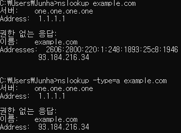

>> 생활코딩 WEB2-Domain Name System을 학습, 정리한 내용입니다.  (https://opentutorials.org/course/3276)
# DomainNameSystem

- 도메인 이름을 자신의 서버 컴퓨터에 부여하는 방법
    - ip 주소와 도메인 이름
    - 도메인 네임 시스템이 동작하는 방법
    - nslookup명령 자세한 이용법
    - github page, tistory와 같은 서비스에 도메인 붙이는 방법
    
# 목차
* chapter 1 ~ chapter n
    1. DNS
    2. ip주소와 hosts 1
    3. ip주소와 hosts 2
    4. 도메인 이름과 보안
    5. DNS의 태풍
    6. DNS의 원리
    7. public DNS의 사용
    8. 도메인 이름의 구조
    9. 도메인 이름 동록 과정과 원리
    10. nslookup
    11. 나의 도메인 이름 장만하기
    12. DNS record & CNAME
    13. githup pages에 도메인 연결하기
    14. 추가 학습 주제

# 수업소개

2021년 3월 27일 토요일
오후 6:18

## host
* 인터넷에 연결된 컴퓨터 한 대 한 대를 host라고함. 
* host가 통신하기 위해서 주소가 필요 
## ip address
* ip주소 덕분에 컴퓨터간 통신이 가능해짐.. 
* 한 대의 컴퓨터라는 한계를 넘어서는 위대한 순간

## DNS의 시작
* ip주소를 이용하다보니 불만족들이 생겨남. 
* ip주소를 기억하기 어렵다.
* 존 포스텔, 폴 모카페트리스 > DNS domain name system를 만듬
* dns의 핵심은 dns server
### DNS 서버
* 이 서버에는 수많은 도메인 이름이 저장되어있음. 
* 만약 어떤 웹사이트를 들어가려고 주소창에 주소를 입력하면 운영체제가 dns서버에 접속해서 주소의 ip주소를 물어보고 그 주소를 이용해서 해당 웹사이트에 접속할 수 있는 것.

# IP주소와 hosts 1

2021년 3월 27일 토요일
오후 6:24

## ip란
* 인터넷 프로토콜(Internet Protocol)의 약자로 흔히는 이 프로토콜에서 각 장치를 나타내는 IP 주소를 가리키는 말로 쓰인다.
* 각 장치들의 주민등록번호
>출처: <https://namu.wiki/w/IP> 

## host란
* 네트워크 호스트(network host)는 컴퓨터 네트워크에 연결된 컴퓨터나 기타 장치이다. 
* 네트워크 호스트는 정보 리소스, 서비스, 애플리케이션을 네트워크 상의 사용자나 기타 노드에 제공할 수 있다.
* 네트워크 호스트는 네트워크 주소가 할당된 네트워크 노드이다.
>출처: <https://ko.wikipedia.org/wiki/%ED%98%B8%EC%8A%A4%ED%8A%B8_(%EB%84%A4%ED%8A%B8%EC%9B%8C%ED%81%AC)> 

### **hosts file**
* 모든 운영체제에는 hosts라는 파일이 있고 
* 이 파일에 각 웹사이트의 ip주소를 적어놓으면 웹사이트에 접속할때 ip말고 url(또는 그 일부)을 입력하면 된다는 것이다.
* 이 hosts 파일을 이용하면 dns 서버를 통하지 않고도 자주 이용하는 사이트나 나만의 사이트에 도메인 주소와 같은 호스트의 이름을 부여할 수 있다.

# IP주소와 hosts 2

2021년 3월 27일 토요일
오후 6:36

## Location in the file system
The location of the hosts file in the file system hierarchy varies by operating system. It is usually named hosts, without an extension.

Operating System|Version(s)|Location
---|---|---
Unix, Unix-like, POSIX||/etc/hosts
Microsoft Windows|3.1|%WinDir%\HOSTS
|95, 98, ME|%WinDir%\hosts
|	NT, 2000, XP, 2003, Vista, 2008, 7, 2012, 8, 10	|%SystemRoot%\System32\drivers\etc\hosts
Windows Mobile, Windows Phone||		Registry key under HKEY_LOCAL_MACHINE\Comm\Tcpip\Hosts
Apple Macintosh|	9 and earlier|	Preferences or System folder
|	Mac OS X 10.0–10.1.5|	(Added through NetInfo or niload)
|	Mac OS X 10.2 and newer|	/etc/hosts (a symbolic link to /private/etc/hosts)

>출처: <https://en.wikipedia.org/wiki/Hosts_(file)> 

## hosts 실습
* hosts 파일을 메모장으로 열어서 내가 실습한 사이트의 ip주소를 입력하고 옆에 이름을 적어주었다. 
* 그리고 인터넷 창에서 web1.com을 치면 사이트가 나온다!
* 사실 web1.com은 따로 있겠지만 내 컴퓨터에서는 내가 우선권을 갖는다. 
* 전화번호부에 맘대로 이름을 등록할 수 있는 것처럼!

# 도메인 이름과 보안

2021년 3월 27일 토요일
오후 6:48

## 보안감수성
* 외부의 해커가 hosts파일의 ip주소를 바꾸면 내가 원하는 사이트로 가지 않고 다른 사이트로 갈것이다. 
  * 백신 사용하자. 백신은 예민하게 hosts파일을 감시하고 지킨다.

# DNS의 태동

2021년 3월 27일 토요일
오후 6:53

## hosts파일에 대한 고민
hosts 파일은 컴퓨터 1대에만 적용되는 것.
hosts 파일 처럼 한 개의 아이피를 한개의 url로 접속 하게 할 수 는 없을까 라는 고민.

## 스탠포드 리서치 기구가 관리하는 방식
처음에는 Stanford Research Institute라는 기구가 전세계의 hosts파일을 관리했었음 . 서버관리자가 요청하면 위 기구에서 파일에 주소를 추가해 주고 각 컴퓨터 사용자는 hosts 파일을 기관으로 부터 다운 받아 덮어쓰기하고 url을 이용하여 접속하는 방식.
아무튼 이런 방식을 통해 ip가 아닌 이름을 통해서 인터넷을 사용할 수 있게 됨.

## DNS의 태동
* 인터넷이 커짐에 따라서 이러한 방식에도 문제가 있음을 느끼게 됨. 수작업으로 hosts파일 관리해야되고 스탠포드 기관에 등록하기 전에는 주소 사용 x, 한개의 파일에 많아지는 주소를 계속해서 관리 힘듦

* 그래서 나온게 DNS.

# DNS의 원리

2021년 3월 27일 토요일
오후 7:45

dns 서버에 ip주소와 이름 정보가 저장되어 있고 host가 인터넷에 연결되는 순간 dns server에 연결됨 host가 이름을 입력하면 hosts파일을 먼저 확인하고 dns server에서 ip주소를 받아와서 해당 주소로 이동하게 됨.
이러한 과정을 통해 ip주소와 이름을 수정하면 dns server에 연결되어있는 모든 host들은 해당 정보를 따로 알거나 입력하는 과정이 없어도됨.

# public DNS의 사용

2021년 3월 27일 토요일
오후 7:54

## DNS서버 사용 매커니즘

* 인터넷 통신사들이 (isp : internet service provider) 컴퓨터에다가 
컴퓨터가 도메인을 물어봤을 때 DNS서버에서 사용할 ip를 자동으로 세팅하는 매커니즘을 가지고 있음. 인터넷을 연결하면 자동으로 dsn서버를 사용함.
* 그런데 때에 따라 한 DNS서버를 사용하고 싶지 않을 수도 있다. 성능이 느리다거나 프라이버시의 문제가 있다거나 할 수 있음. >> public DNS server 사용
ex)  google public DNS, **1.1.1.1**

### DNS서버 설정
* **네트워크 및 공유센터 > 연결된 인터넷(이더넷) > 속성 > ipv4속성 > 하단의 DNS서버 설정**

# 도메인 이름의 구조

2021년 3월 27일 토요일
오후 9:13

## DNS server의 역할
1. 서버로 사용할 컴퓨터가 자신의 이름과 ip를 제출해서 등록하는것 (도메인에 대한 ip를 기억하는 기능)
2. 클라이언트로 사용되는 컴퓨터가 어떤 이름을 물어보면 알려주는 것 (물어보면 알려주는 기능)

### DNS 서버 이모저모
* DNS server는 전세계에 수천~수만대의 서버가 분산되어 협력함.
* 도메인의 주소 뒤에는 점.이 생략되어 있다.
* 도메인에서 각각의 부분마다 이름이 있다.
  * root domain / Top-level~ / Second-level~ / sub~  
* 이 각각의 부분들에는 담당하는 DNS서버가 다르다. 
* 기능도 완전히 똑같은데 전담하는 파트만 다른 것.
* 그리고 각각의 서버들은 직속 하위 도메인 서버들의 목록과 ip주소를 알고 있어야 한다.
  * root는 top-level을 앎

### DNS 서버 과정
* 첫 번째로 root name 서버에게 특정 사이트를 물어보면 root는 top-level(com)서버에게 물어보고 
이렇게 하위 도메인에게 물어보는 과정 끝에 sub 도메인을 전담하는 서버가 ip를 알려줌. (계층적 협력구조)

# 도메인 이름 등록 과정과 원리

2021년 3월 27일 토요일
오후 9:33

## DNS register
1. DNS 시스템이 어떻게 동작?
2. 자신의 도메인 네임을 갖기 위해서 필요한 절차?
   * dns는 기술적인 것처럼 보이지만 사실 많은 부분이 실제로는 행정적인 것이고 
   * 그 행정적인 것들을 자동화하는 기술이 뒷받침 되어 있음. 
* 어떻게 행정적인 것과 기술적인 것들이 상호 조화를 하고 있나?

## ICANN 비영리단체 
* 전 세계 ip주소를 관리
* Root name server들에 대한 관리자. 
* 사실상 인터넷 체계의 관리자 
### Root name server
* Root name server는 a~m까지 총 13개의 서버가 전 세계에 흩어져 있음.
* 그리고 각각의 서버들은 다시 각각의 컴퓨터로 다시 쪼개져서 전 세계에 흩어져 있음. (수백대의 성능 좋은 컴퓨터들)
### 예제
a.root-servers.net

## registry
* 루트네임서버를 관리하는 아이캔 밑에는 레지스트리라고 하는 기관 또는 기업들이 있음.
* Registry(등록소) 는 .com, .net, co.kr과 같은 Top-level domain들을 관리.
### 예제
* .com을 사용하는 레지스트리를 예제로 사용
* a.gtld-servers.net.com.

## Registrar(등록대행자) 
* 네임 서버에 실제로 등록자의 등록작업을 대행해주는 업체나 기관이 등록대행자
* icann과 컴퓨터 사이에 등록소와 등록대행자가 있다.

## DNS record

* **dns4u.ga A 52.231.13.22** 이와 같은 서버에 저장되는 정보를 DNS 레코드라 함. 
* (DNS서버에 저장하는 도메인 이름에 대한 정보 1건)

# nslookup

2021년 3월 27일 토요일
오후 10:06

## 정보 수집 도구
* dns와 관련해서 여러 정보들을 수집하는 방법, 도구들을 알아보자
* nslookup, dig-window에서 지원 x  
* 기능적으로 비슷한 도구도 있음

## nslookup
### nslookup example.com

* 연결되어 있는 (1.1.1.1의 ip를 가지고 있는) DNS server를 통해서  필요한 DNS server를 조회하게 됨.
* **권한 없는 응답**:(non- authoritative answer): example.com 도메인에 대한 결정권 권한을 가지고 있는 서버는 

매번 ip주소를 요청할때마다 DNS 서버를 통해서 각 파트 서버에게 물어보는 과정은 비효율적 그래서
* DNS 시스템에서는 **캐시**(cache 저장한다는 뜻)라는 것이 있음. 예를 들면 어떤 사이트를 조회한 경험이 있으면 그 다음에 요청할 떄는 기억하고 있었던 ip를 돌려주는 것을 통해서 성능도 높이고 네트워크의 부하도 획기적으로 줄일 수 있음. (일의 결과를 기억하고 있다가 똑같은 요청이 들어오면 재사용)
* 캐시를 통해 ip를 응답 받았다면 `권한 없는 응답`이라는 결과가 나오는 것.
* example.com의 name server는 그림상으로 

### nslookup -type=ns example.com 
* -type=ns >>> nameserver 정보

* 사이트의 name server를 알려줌 (2대를 사용중)

### nslookup example.com a.iana-servers.net
* 만약 DNS server를 통하지 않고 직접 nameserver에 물어본다면?
  * cmd>nslookup example.com a.iana-servers.net

  * 권한 없는 응답하는 메세지가 없어짐.

### 비교
* nslookup -type=a example.com은 nslookup example.com 과 비슷한 결과를 보여줌

# 나의 도메인 이름 장만하기

2021년 3월 27일 토요일
오후 10:26

## freenom.com
* freenom.com에서 무료로 (12개월간) * 도메인 서비스를 이용해서 나의 도메인 이름을 장만하자~
  * Name: 도메인 앞에 붙음. ex) blog.dns4u.ga
  * TTL: 캐시가 얼마 동안 지속되는가  ip가 자주바뀌면 짧게 / 자주 안바뀌고 빠르면 길게
  * Target: public ip

# DNS record & CNAME

2021년 3월 27일 토요일
오후 10:37

* `dns4u.ga A 52.231.13.22` 이 하나를 DNS 레코드라고 함. (DNS서버에 저장하는 도메인 이름에 대한 정보 1건)
* A라고 하는 것은 웹사이트의 `ip주소`가 이것이다 라는 뜻. 
* NS는 `nameserver`가 이것이다 라는 뜻. 

### dns 레코드 타입 목록 -
> https://ko.wikipedia.org/wiki/DNS_%EB%A0%88%EC%BD%94%EB%93%9C_%ED%83%80%EC%9E%85_%EB%AA%A9%EB%A1%9D

### 레코드 설명
* A레코드는 최종적으로 필요한 ip주소를 가르쳐줌
* CNAME(canonical name) 레코드는 일종의 별명을 지어주는것. 도메인에 대한 또다른 도메인을 지정해 주는 것이다.
* 아래 그림에서 "www.example.com."을 주소창에 입력하면 CNAME레코드가 example.com.으로 바꿔주고 
* A레코드에 의해 ip로 연결 
* CNAME은 한 사이트가 여러 닉네임을 가지고 있을때 한 개의 A레코드로 연결해줌으로서 관리를 편하게 해줌.

# Github pages에 도메인 연결하기

2021년 3월 27일 토요일
오후 10:52

## 깃헙 페이지 설정
* github pages 설정> custom domain에서 도메인 주소를 입력. 
* learn more에서 setting up an apex domain 항목 확인.
  * apex는 example.com 과 같은 도메인 www없는
* (freenom사이트) 깃헙이 지정해준 ip를 A레코드로 타게팅해준다.
  * 2개해주면 안정성 올라간다.

# 추가 학습 주제

2021년 3월 27일 토요일
오후 11:02

## 공부해 볼만한 주제 

### BIND 9
   * 최초의 DNS서버. 
   * >https://www.isc.org/bind/
   * DNS서버를 **직접 운영**해보자.

### DNS 서비스
   * 직접 하지 않아도 DNS서버를 제공하는 여러 서비스들을 이용해 보자. 
   * 내 컴퓨터에 연결되는 DNS서버부터 서버의 ip를 알려주는 DNS서버까지 
1. Vultr DNS
      * (링크 : http://www.vultr.com/)
      * 가입 > My Server > DNS
2. ConoHa DNS
      * (링크 : https://www.conoha.jp/)
      * 가입 > Console > DNS
      * 주의 : GeoDNS 를 활성화하면 1일에    120원이 부과. 항상 비활성화.
3. Digital Ocean DNS
      * (링크 : https://www.digitalocean.com/)
4. Linode DNS
      * (링크 : https://www.linode.com/ )
5. DNSZI DNS
      * (링크 : https://dnszi.com/ )
6. Amazon Lightsail DNS
      * 3개 까지 무료. (그 이상은 생성불가)
      * (링크 : https://amazonlightsail.com/)
7. CloudFlare DNS
      * (링크 : https://www.cloudflare.com/ )
      * 원래는 DDOS 방어 및 CDN 서비스를 하는 업체이다.
      * 도메인 추가한 후에 Free Plan 을 선택하여야 한다.
      * 주소를 추가한 후에 회색 구름 아이콘으로 만들어야 한다.

### Dynamic DNS (**DDNS**)
* ip가 변경되었을때 변경된 ip가 도메인서버에 전송

### **HTTPS** 
* 피싱과 같은 나쁜 행위를 차단하는 보안이 좋은 SSL 인증서를 받아서 이용해보자
