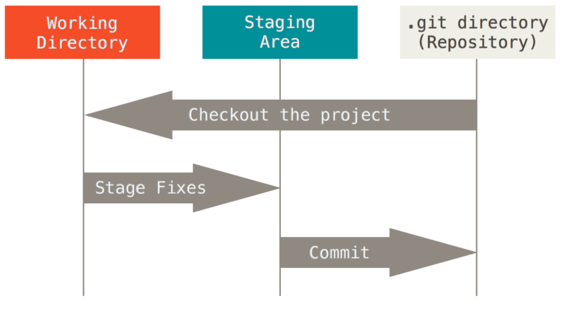

>> 생활코딩 'Git CLI - 버전관리'를 학습, 정리한 내용입니다. (https://opentutorials.org/course/3839)

- 21.04.28 write on notion
- 21.06.10 notion to git

# GIT CLI - 버전관리
- Git CLI 버전관리
    - version
    - version control
    - comparing versions
    - checkout
    - git reset
    - git revert

# 목차

- [GIT CLI - 버전관리](#git-cli---버전관리)
- [목차](#목차)
- [Why Git CLI?](#why-git-cli)
    - [git CLI를 사용하는 이유](#git-cli를-사용하는-이유)
- [설치 및 버전 관리의 시작](#설치-및-버전-관리의-시작)
- [버전 만들기](#버전-만들기)
    - [Working tree(directory)](#working-treedirectory)
    - [Staging Area (index)](#staging-area-index)
    - [Repository](#repository)
  - [실습](#실습)
  - [에러상황 1](#에러상황-1)
    - [해결](#해결)
  - [에러상황 2](#에러상황-2)
    - [해결](#해결-1)
    - [참조](#참조)
- [여러개의 파일을 버전으로 만들기](#여러개의-파일을-버전으로-만들기)
  - [여러개의 파일을 동시에 작업하면서 커밋하면?](#여러개의-파일을-동시에-작업하면서-커밋하면)
  - [실습](#실습-1)
- [버전간의 차이점 비교](#버전간의-차이점-비교)
    - [diff와 log를 사용하면 CRUD 중 Read에 해당하는 기능을 사용할 수 있다.](#diff와-log를-사용하면-crud-중-read에-해당하는-기능을-사용할-수-있다)
    - [수정 전 후를 비교해 문제점을 파악하고 해결하는데 도움을 준다.](#수정-전-후를-비교해-문제점을-파악하고-해결하는데-도움을-준다)
    - [reset을 명령어를 사용하면 diff로 확인된 빨간색의 삭제된 부분을 살리고 초록색의 추가된 부분을 삭제한다.](#reset을-명령어를-사용하면-diff로-확인된-빨간색의-삭제된-부분을-살리고-초록색의-추가된-부분을-삭제한다)
  - [실습](#실습-2)
    - [참조](#참조-1)
- [checkout과 시간여행](#checkout과-시간여행)
    - [버전관리는 파일을 수정할 때마다 의미있는 변경점들을 기록하는 것.](#버전관리는-파일을-수정할-때마다-의미있는-변경점들을-기록하는-것)
    - [즉, 과거로 돌아갔다가 다시 미래로 돌아오고 하는 시간을 탐색할 수 있다는 것.](#즉-과거로-돌아갔다가-다시-미래로-돌아오고-하는-시간을-탐색할-수-있다는-것)
  - [실습](#실습-3)
    - [그런데 과거의 버전으로 돌아가고 싶다면?](#그런데-과거의-버전으로-돌아가고-싶다면)
- [보충수업](#보충수업)
  - [사소한데 모르면 불편한 것들.](#사소한데-모르면-불편한-것들)
- [삭제 - git reset](#삭제---git-reset)
    - [reset명령어는 버전을 삭제하겠다는 것이 아니라 '해당 버전이 되겟다.' 라는 의미](#reset명령어는-버전을-삭제하겠다는-것이-아니라-해당-버전이-되겟다-라는-의미)
- [되돌리기 - git revert](#되돌리기---git-revert)
  - [revert](#revert)
- [수업을 마치며](#수업을-마치며)
    - [버전관리의 핵심적인 효용 : 비교. 지금의 작업을 과거의 작업과 비교해서 되돌아갈 수도 있고 특정 문제를 해결할 수도 있는 등 다양하게 활용할 수 있다.](#버전관리의-핵심적인-효용--비교-지금의-작업을-과거의-작업과-비교해서-되돌아갈-수도-있고-특정-문제를-해결할-수도-있는-등-다양하게-활용할-수-있다)
    - [살펴볼 만한 주제](#살펴볼-만한-주제)

<small><i><a href='http://ecotrust-canada.github.io/markdown-toc/'>Table of contents generated with markdown-toc</a></i></small>


# Why Git CLI?

### git CLI를 사용하는 이유
1. 모든 GIT 기반의 프로그램은 CLI를 기반으로 삼고 있다.
2. GUL를 쓸 수 없는 환경에서도 GIT을 사용할 수 있다. 
3. 명령어이므로 동시다발적인 작업이 한번에 가능하다.
4. 반복되는 패턴에 대한 자동화가 가능하다.
5. 여러 GUI 기반 GIT 프로그램을 굳이 익히지 않아도 된다.
6. 파일의 이름을 더럽히지 않으면서 모든 변경사항을 저장하고 풍부한 해설도 추가 가능하다.

# 설치 및 버전 관리의 시작

> 설치 : [git-scm.com](http://git-scm.com) (git 오리지널)

>실행 : gitbash(콘솔, 터미널)

>명령어 :  file:///C:/Program%20Files/Git/mingw64/share/doc/git-doc/git.html  (git help -a)

```bash
git                     // git 
git --version           // 버전 확인
git --help -a           // 모든 명령어
pwd                     // 위치
ls -al                  // 디렉토리 파일 리스트 (dir)
cd <location>           // 위치로 이동
cd ..                   // 상위 폴더로
mkdir <diretory>        // 디렉토리 생성
git init .              // . (현재 디렉토리) git 시작 
```
* .git 폴더의 데이터가 임의로 수정되거나 삭제되지 않도록 조심하자. (버전들의 저장소)

---

# 버전 만들기

### Working tree(directory)
* 버전만들기 전 단계. 수정한 파일들.

### Staging Area (index)
* 수정한 파일들 중 버전을 만들려고 하는 파일들.

### Repository
* git에서 버전이 저장되는 곳.( .git 폴더) 만들어진 버전.



```bash
nano <flie>                 // 파일 생성
cat <flie>                  // 파일 출력
git status                  // git 상태 (Working-tree status)
git add                     // 스테이징. 인덱스에 저장
git commit -m "message"     // 버전 생성
git log                     // 깃 로그(역사) 확인 (버전 보기)
```

## 실습

* 파일을 만들고 스테이징을 거쳐 commit을 해보며 git에서의 working tree, staging area, repository의 커밋 단계를 학습.

```bash
HOME@Junha-PC MINGW64 ~/desktop/git/hello-git-cli (master)
$ nano practice1.txt

HOME@Junha-PC MINGW64 ~/desktop/git/hello-git-cli (master)
$ ls -al
total 10
drwxr-xr-x 1 HOME 197608  0 Apr 26 16:07 ./
drwxr-xr-x 1 HOME 197608  0 Apr 26 14:23 ../
drwxr-xr-x 1 HOME 197608  0 Apr 26 15:54 .git/
-rw-r--r-- 1 HOME 197608  5 Apr 26 15:52 hello1.txt
-rw-r--r-- 1 HOME 197608 27 Apr 26 16:07 practice1.txt

HOME@Junha-PC MINGW64 ~/desktop/git/hello-git-cli (master)
$ cat practice1.txt
practice stages of commit.

HOME@Junha-PC MINGW64 ~/desktop/git/hello-git-cli (master)
$ git status
On branch master

No commits yet

Untracked files:
  (use "git add <file>..." to include in what will be committed)
        practice1.txt

nothing added to commit but untracked files present (use "git add" to track)

HOME@Junha-PC MINGW64 ~/desktop/git/hello-git-cli (master)
$ git add practice1.txt

HOME@Junha-PC MINGW64 ~/desktop/git/hello-git-cli (master)
$ git status
On branch master

No commits yet

Changes to be committed:
  (use "git restore --staged <file>..." to unstage)
        new file:   practice1.txt

HOME@Junha-PC MINGW64 ~/desktop/git/hello-git-cli (master)
$ git commit -m "git bash version-management practice1"
[master 70c617d] git bash version-management practice1
 1 file changed, 1 insertion(+)
 create mode 100644 practice1.txt

HOME@Junha-PC MINGW64 ~/desktop/git/hello-git-cli (master)
$ git status
On branch master
nothing to commit, working tree clean

HOME@Junha-PC MINGW64 ~/desktop/git/hello-git-cli (master)
$ git log
commit 70c617dcc5bba971822a53e374fe0e1b4510f172 (HEAD -> master)
Author: 김준하 <qufstar7@gmail.com>
Date:   Mon Apr 26 16:17:59 2021 +0900

    git bash version-management practice1

```

No commits yet : 아직 버전이 없다. 커밋된게 없다.

Untracked : 추적되지 않고 있는(버전관리목록에 등록되지 않은) 파일의 목록을 보여준다. ( tracking으로 git에게 버전관리를 할 파일이라는 것을 알려주는 것.)

git add <file> : staging area에 파일을 올린다. (커밋 후보자들)

Chasges to be committed : 커밋될 파일들(버전이 될 파일들)의 목록을 보여준다.

git commit <file> :  커밋. staging area의 파일을 repository에 저장.

## 에러상황 1

```bash
warning: LF will be replaced by CRLF in hello1.txt.
The file will have its original line endings in your working directory
```

### 해결

리눅스, 맥과 윈도우는 개행문자를 다르게 사용해서 나타나는 오류. (유닉스/리눅스 : LF , 윈도우 : CRLF)

```bash
git config --global core.autocrlf true // 윈도우+협업 ( autocrlf 기능 킴 )
git config --global core.autocrlf true input // 맥 ( crlf를 lf로 변환하도록 input로 설정)
git config core.autocrlf false // 윈도우만 쓸 때 ( autocrlf 기능 끔)
```

## 에러상황 2

```bash
$ git commit -m "Message 1"
Author identity unknown

*** Please tell me who you are.

Run

  git config --global user.email "you@example.com"
  git config --global user.name "Your Name"

to set your account's default identity.
Omit --global to set the identity only in this repository.

fatal: unable to auto-detect email address (got 'HOME@Junha-PC.(none)')
```

### 해결

```bash
git config --global user.email "이메일주소"
git config --global user.name "실명" (아마도 컴퓨터 계정 이름)
```

### 참조
>[https://stackoverflow.com/questions/5834014](https://stackoverflow.com/questions/5834014/lf-will-be-replaced-by-crlf-in-git-what-is-that-and-is-it-important)

---


# 여러개의 파일을 버전으로 만들기

## 여러개의 파일을 동시에 작업하면서 커밋하면?

* git은 모든 파일을 staging 하지 않는다. > 커밋하고자 하는 파일을 모두 add로 스테이징한다.

```bash
git commit --amend -m "message"     // 최근 커밋 메세지 수정
git log --stat                      // 로그 세부정보 확인(수정내용) 
```

## 실습

```bash
HOME@Junha-PC MINGW64 ~/desktop/git/hello-git-cli (master)
$ nano practice2.txt

HOME@Junha-PC MINGW64 ~/desktop/git/hello-git-cli (master)
$ git status
On branch master
Untracked files:
  (use "git add <file>..." to include in what will be committed)
        practice2.txt

nothing added to commit but untracked files present (use "git add" to track)

HOME@Junha-PC MINGW64 ~/desktop/git/hello-git-cli (master)
$ nano practice1.txt

HOME@Junha-PC MINGW64 ~/desktop/git/hello-git-cli (master)
$ git status
On branch master
Changes not staged for commit:
  (use "git add <file>..." to update what will be committed)
  (use "git restore <file>..." to discard changes in working directory)
        modified:   practice1.txt

Untracked files:
  (use "git add <file>..." to include in what will be committed)
        practice2.txt

no changes added to commit (use "git add" and/or "git commit -a")

HOME@Junha-PC MINGW64 ~/desktop/git/hello-git-cli (master)
$ git add practice1.txt

HOME@Junha-PC MINGW64 ~/desktop/git/hello-git-cli (master)
$ git add practice2.txt

HOME@Junha-PC MINGW64 ~/desktop/git/hello-git-cli (master)
$ git status
On branch master
nothing to commit, working tree clean

HOME@Junha-PC MINGW64 ~/desktop/git/hello-git-cli (master)
$ git commit --amend -m "git bash version-management practice2 'commit multiple files'"
[master 40c6d1c] git bash version-management practice2 'commit multiple files'
 Date: Mon Apr 26 18:53:58 2021 +0900
 2 files changed, 3 insertions(+)
 create mode 100644 practice2.txt

HOME@Junha-PC MINGW64 ~/desktop/git/hello-git-cli (master)
$ git log
commit 40c6d1c8a32a753df01bd7f88b524a817049cebd (HEAD -> master)
Author: 김준하 <qufstar7@gmail.com>
Date:   Mon Apr 26 18:53:58 2021 +0900

    git bash version-management practice2 'commit multiple files'
.
.
.

HOME@Junha-PC MINGW64 ~/desktop/git/hello-git-cli (master)
$ git log --stat
commit 40c6d1c8a32a753df01bd7f88b524a817049cebd (HEAD -> master)
Author: 김준하 <qufstar7@gmail.com>
Date:   Mon Apr 26 18:53:58 2021 +0900

    git bash version-management practice2 'commit multiple files'

 practice1.txt | 1 +
 practice2.txt | 2 ++
.
.
.
```

---

# 버전간의 차이점 비교

### diff와 log를 사용하면 CRUD 중 Read에 해당하는 기능을 사용할 수 있다.

### 수정 전 후를 비교해 문제점을 파악하고 해결하는데 도움을 준다.

### reset을 명령어를 사용하면 diff로 확인된 빨간색의 삭제된 부분을 살리고 초록색의 추가된 부분을 삭제한다.

```bash
git diff            // 수정 전후 비교
git reset --hard    // 직전으로 리셋 
git log -p          // (p는 patch의 약자) 각 버전의 diff결과
```

## 실습

```bash
HOME@Junha-PC MINGW64 ~/desktop/git/hello-git-cli (master)
$ nano practice1.txt

HOME@Junha-PC MINGW64 ~/desktop/git/hello-git-cli (master)
$ git diff
diff --git a/practice1.txt b/practice1.txt
index a634677..71fb12d 100644
--- a/practice1.txt
+++ b/practice1.txt
@@ -1,3 +1,4 @@
 practice stages of commit.
 stages of commit on git : working tree - staging area - repository
-revise version2
+revise version3
+revise version four

HOME@Junha-PC MINGW64 ~/desktop/git/hello-git-cli (master)
$ git reset --hard
HEAD is now at 40c6d1c git bash version-management practice2 'commit multiple files'

HOME@Junha-PC MINGW64 ~/desktop/git/hello-git-cli (master)
$ cat practice1.txt
practice stages of commit.
stages of commit on git : working tree - staging area - repository
revise version2

HOME@Junha-PC MINGW64 ~/desktop/git/hello-git-cli (master)
$ git log -p
commit 40c6d1c8a32a753df01bd7f88b524a817049cebd (HEAD -> master)
Author: 김준하 <qufstar7@gmail.com>
Date:   Mon Apr 26 18:53:58 2021 +0900

    git bash version-management practice2 'commit multiple files'

diff --git a/practice1.txt b/practice1.txt
index 249080c..a634677 100644
--- a/practice1.txt
+++ b/practice1.txt
@@ -1,2 +1,3 @@
 practice stages of commit.
 stages of commit on git : working tree - staging area - repository
+revise version2
diff --git a/practice2.txt b/practice2.txt
new file mode 100644
index 0000000..be47120
--- /dev/null
+++ b/practice2.txt
@@ -0,0 +1,2 @@
+practice2
+

commit a92c1f68b15bc3a3962c643c63c8fb98bc46ae30
Author: 김준하 <qufstar7@gmail.com>
Date:   Mon Apr 26 16:31:10 2021 +0900

    add stages of commit on git

diff --git a/practice1.txt b/practice1.txt
index 0eca60d..249080c 100644
--- a/practice1.txt
+++ b/practice1.txt
@@ -1 +1,2 @@
 practice stages of commit.
+stages of commit on git : working tree - staging area - repository

commit 70c617dcc5bba971822a53e374fe0e1b4510f172
Author: 김준하 <qufstar7@gmail.com>
Date:   Mon Apr 26 16:17:59 2021 +0900

    git bash version-management practice1

diff --git a/practice1.txt b/practice1.txt
new file mode 100644
index 0000000..0eca60d
:
commit 40c6d1c8a32a753df01bd7f88b524a817049cebd (HEAD -> master)
Author: 김준하 <qufstar7@gmail.com>
Date:   Mon Apr 26 18:53:58 2021 +0900

    git bash version-management practice2 'commit multiple files'

diff --git a/practice1.txt b/practice1.txt
index 249080c..a634677 100644
--- a/practice1.txt
+++ b/practice1.txt
@@ -1,2 +1,3 @@
 practice stages of commit.
 stages of commit on git : working tree - staging area - repository
+revise version2
diff --git a/practice2.txt b/practice2.txt
new file mode 100644
index 0000000..be47120
--- /dev/null
+++ b/practice2.txt
@@ -0,0 +1,2 @@
+practice2
+

commit a92c1f68b15bc3a3962c643c63c8fb98bc46ae30
Author: 김준하 <qufstar7@gmail.com>
Date:   Mon Apr 26 16:31:10 2021 +0900

    add stages of commit on git

diff --git a/practice1.txt b/practice1.txt
index 0eca60d..249080c 100644
--- a/practice1.txt
+++ b/practice1.txt
@@ -1 +1,2 @@
 practice stages of commit.
+stages of commit on git : working tree - staging area - repository

commit 70c617dcc5bba971822a53e374fe0e1b4510f172
Author: 김준하 <qufstar7@gmail.com>
Date:   Mon Apr 26 16:17:59 2021 +0900

    git bash version-management practice1

diff --git a/practice1.txt b/practice1.txt
new file mode 100644
index 0000000..0eca60d
--- /dev/null
+++ b/practice1.txt
@@ -0,0 +1 @@
+practice stages of commit.

commit 06277b0c4475fc245949daad538444b3a53f86b7
Author: 김준하 <qufstar7@gmail.com>
Date:   Mon Apr 26 15:54:46 2021 +0900

    Message 2

diff --git a/hello1.txt b/hello1.txt
index d474e1b..c47213d 100644
--- a/hello1.txt
+++ b/hello1.txt
@@ -1,2 +1,3 @@
 1
+2

commit f012c5354033bb8e616313e51049604a7541bf9d
Author: 김준하 <qufstar7@gmail.com>
Date:   Mon Apr 26 15:48:09 2021 +0900

    Message 1

diff --git a/hello1.txt b/hello1.txt
new file mode 100644
index 0000000..d474e1b
--- /dev/null
+++ b/hello1.txt
@@ -0,0 +1,2 @@
+1
+
(END)
```
### 참조 
[Git 커밋 히스토리 조회하기](https://git-scm.com/book/ko/v2/Git%EC%9D%98-%EA%B8%B0%EC%B4%88-%EC%BB%A4%EB%B0%8B-%ED%9E%88%EC%8A%A4%ED%86%A0%EB%A6%AC-%EC%A1%B0%ED%9A%8C%ED%95%98%EA%B8%B0)


# checkout과 시간여행

### 버전관리는 파일을 수정할 때마다 의미있는 변경점들을 기록하는 것. 

### 즉, 과거로 돌아갔다가 다시 미래로 돌아오고 하는 시간을 탐색할 수 있다는 것.

```bash
git check master        // master 버전으로 변경
git checkout 버전id     // id의 버전으로 변경
```

## 실습

* git log를 통해 디렉토리의 버전들을 확인 할 수 있다. 

### 그런데 과거의 버전으로 돌아가고 싶다면?

* `HEAD` 를 원하는 버전을 가리키게하면 버전관리를 하고 있는 디렉토리 전체가 그 버전으로 되돌아 간다. 
* `commit 40c6d1c8a32a753df01bd7f88b524a817049cebd (HEAD -> master)` 에서 커밋 id `40c6d1c8a32a753df01bd7f88b524a817049cebd` 를 ctrl+ins와 shift+ins로 복붙.
* git check master로 최근 버전이라고 할 수 있는 마스터 버전(브랜치)으로 되돌아 온다.

```bash
HOME@Junha-PC MINGW64 ~/desktop/git/hello-git-cli (master)
$ git checkout 70c617dcc5bba971822a53e374fe0e1b4510f172
Note: switching to '70c617dcc5bba971822a53e374fe0e1b4510f172'.

You are in 'detached HEAD' state. You can look around, make experimental
changes and commit them, and you can discard any commits you make in this
state without impacting any branches by switching back to a branch.

If you want to create a new branch to retain commits you create, you may
do so (now or later) by using -c with the switch command. Example:

  git switch -c <new-branch-name>

Or undo this operation with:

  git switch -

Turn off this advice by setting config variable advice.detachedHead to false

HEAD is now at 70c617d git bash version-management practice1

HOME@Junha-PC MINGW64 ~/desktop/git/hello-git-cli ((70c617d...))
$ ls -al
total 10
drwxr-xr-x 1 HOME 197608  0 Apr 26 19:50 ./
drwxr-xr-x 1 HOME 197608  0 Apr 26 14:23 ../
drwxr-xr-x 1 HOME 197608  0 Apr 26 19:50 .git/
-rw-r--r-- 1 HOME 197608  5 Apr 26 15:52 hello1.txt
-rw-r--r-- 1 HOME 197608 27 Apr 26 19:50 practice1.txt

HOME@Junha-PC MINGW64 ~/desktop/git/hello-git-cli ((70c617d...))
$ cat practice1.txt
practice stages of commit.

HOME@Junha-PC MINGW64 ~/desktop/git/hello-git-cli ((70c617d...))
$ git log
commit 70c617dcc5bba971822a53e374fe0e1b4510f172 (HEAD)
Author: 김준하 <qufstar7@gmail.com>
Date:   Mon Apr 26 16:17:59 2021 +0900

    git bash version-management practice1

commit 06277b0c4475fc245949daad538444b3a53f86b7
Author: 김준하 <qufstar7@gmail.com>
Date:   Mon Apr 26 15:54:46 2021 +0900

    Message 2

commit f012c5354033bb8e616313e51049604a7541bf9d
Author: 김준하 <qufstar7@gmail.com>
Date:   Mon Apr 26 15:48:09 2021 +0900

    Message 1

HOME@Junha-PC MINGW64 ~/desktop/git/hello-git-cli ((70c617d...))
$ git checkout master
Previous HEAD position was 70c617d git bash version-management practice1
Switched to branch 'master'

HOME@Junha-PC MINGW64 ~/desktop/git/hello-git-cli (master)
$ git log
commit 40c6d1c8a32a753df01bd7f88b524a817049cebd (HEAD -> master)
Author: 김준하 <qufstar7@gmail.com>
Date:   Mon Apr 26 18:53:58 2021 +0900

    git bash version-management practice2 'commit multiple files'

commit a92c1f68b15bc3a3962c643c63c8fb98bc46ae30
Author: 김준하 <qufstar7@gmail.com>
Date:   Mon Apr 26 16:31:10 2021 +0900

    add stages of commit on git

commit 70c617dcc5bba971822a53e374fe0e1b4510f172
Author: 김준하 <qufstar7@gmail.com>
Date:   Mon Apr 26 16:17:59 2021 +0900

    git bash version-management practice1

commit 06277b0c4475fc245949daad538444b3a53f86b7
Author: 김준하 <qufstar7@gmail.com>
Date:   Mon Apr 26 15:54:46 2021 +0900

    Message 2

commit f012c5354033bb8e616313e51049604a7541bf9d
Author: 김준하 <qufstar7@gmail.com>
Date:   Mon Apr 26 15:48:09 2021 +0900

    Message 1

HOME@Junha-PC MINGW64 ~/desktop/git/hello-git-cli (master)
$ cat practice1.txt
practice stages of commit.
stages of commit on git : working tree - staging area - repository
revise version2

HOME@Junha-PC MINGW64 ~/desktop/git/hello-git-cli (master)
$ ls -al
total 11
drwxr-xr-x 1 HOME 197608   0 Apr 26 19:50 ./
drwxr-xr-x 1 HOME 197608   0 Apr 26 14:23 ../
drwxr-xr-x 1 HOME 197608   0 Apr 26 19:50 .git/
-rw-r--r-- 1 HOME 197608   5 Apr 26 15:52 hello1.txt
-rw-r--r-- 1 HOME 197608 110 Apr 26 19:50 practice1.txt
-rw-r--r-- 1 HOME 197608  11 Apr 26 19:50 practice2.txt
```

---

# 보충수업

## 사소한데 모르면 불편한 것들.

1. `git add` 스테이징 할 때 파일하나하나 할 필요는 없다.

    `git add .` 현재 디렉토리 모든 파일.

    `git add <directory>` 특정 디렉토리안의 모든 파일.

2. `git commit -am "<Msg>"` (tracked인 파일들만) add와 commit을 한번에 할 수 있다.

    **untracked 상태의 파일을 git은 -am을 해도 add, 커밋 한번에 안한다.**

    **최초한번은 add가 되어서 tracked 상태가 되야 그 파일을 자동으로 추가해 준다. (실수, 사고 방지)**

3. `touch <file>` 파일 생성만
4. `git commit` + enter  = 기본에디터

    `git config —global core.editor "<editor>"` 에디터 변경

---

# 삭제 - git reset

### reset명령어는 버전을 삭제하겠다는 것이 아니라 '해당 버전이 되겟다.' 라는 의미

- `git reset --help`
    >https://git-scm.com/docs/git-reset

- `git reset`

* 현재 branch head를 `<commit>`로 재설정
* 가능하면 색인 (`<commit>` 트리로 재설정) 및 `<mode>`에 따라 working tree를 업데이트
* `<mode>`가 생략되면 기본값은 `--mixed`입니다. 

1. `git reset --hard` 
   * 인덱스 및 작업 트리를 재설정
   * `<commit>` 이후 작업 트리에서 추적 된 파일에 대한 모든 변경 사항은 무시(버전을 지울 뿐만 아니라 수정하고 있었던 것까지 지움.)
2. `git reset --soft` 
   * 인덱스 파일이나 작업 트리를 전혀 건드리지 않는다.(그러나 모든 모드와 마찬가지로 헤드를 `<commit>`로 재설정)
   * 이렇게 하면 git status가 표시하는 것처럼 변경된 모든 파일이 "Changes to be committed"상태가 된다.
3. `git reset —mixed` 
   * 인덱스를 재설정하지만 작업 트리는 재설정하지 않는다. (즉, 변경된 파일은 보존되지만 커밋으로 표시되지 않음)
   * 업데이트되지 않은 사항을 보고(defalut)
   * 만약 -N을 지정하면 제거 된 경로가 intent-to-add로 표시

# 되돌리기 - git revert

## revert
* revert를 사용하면 삭제와 보존을 동시에 할 수 있다.
* revert는 되돌리는 것 이라는 뜻
* 되돌리고자 하는 버전id를 revert해야된다. 
* 버전 1 부터 버전 5까지 다양하게 있을 때 버전 2로 돌아갈라면 버전5 ,4 ,3을 순서대로 리버트 해야 된다. 
* 즉 git revert는 해당 버전에서 추가된 내용만 되돌려 주는 것이다.
* 따라서 revert를 하려면 역순으로 하나씩 리버트를 해줘야 한다. 안그러면 error가 난다.

---

# 수업을 마치며

### 버전관리의 핵심적인 효용 : 비교. 지금의 작업을 과거의 작업과 비교해서 되돌아갈 수도 있고 특정 문제를 해결할 수도 있는 등 다양하게 활용할 수 있다.

### 살펴볼 만한 주제

- diff tool - 차이점을 보다 정교하게 비교하고 정확한 의사결정을 내리고 현재의 상황을 신속하게 파악하는데 많은 도움을 주는 tool이 있다
- .gitignore - 버전관리를 하지 말아야할 파일이 있으면 .gitignore폴더를 만들고 파일의 이름을 적으면 된다.
- branch - 마치 평행우주처럼 우리의 저장소를 여러가지 상태로 공존할 수 있게 해준다. 비슷하지만 다른 작업이 필요하면 branch 기능을 사용하면 편리하다.
- 각각의 버전을 식별하는 커밋id - 대신 tag를 사용하면 편리하게 중요한 버전을 찾아갈 수 있다.
- backup - git은 자체적으로 안전한 백업장치를 가지고 있다.