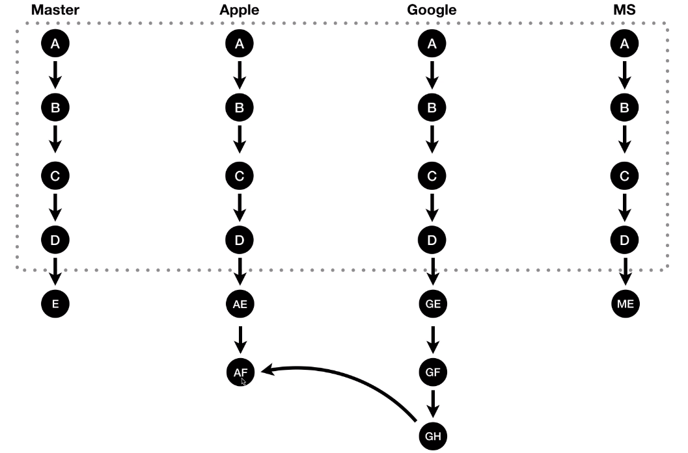
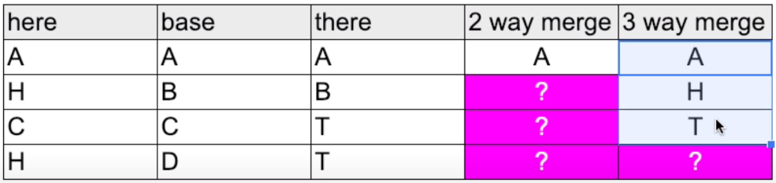

>> 생활코딩 'Git CLI - branch & conflict'를 학습, 정리한 내용입니다. (https://opentutorials.org/course/3840)

- 21.04.29 write on notion
- 21.06.10 notion to git

# GIT CLI - branch & conflict
- branch
    - how to use
        - 생성
        - 전환
        - 파일 작업
    - 구조
    - 내용 확인
- conflict
    - merge cases
        - 서로 다른 파일 병합
        - 같은 파일, 다른 부분 병합
        - 같은 파일, 같은 부분 병합
        - 3 way merge
        - 외부도구를 이용한 병합(p4Merge)
    - p4Merge를 이용한 해결

# 목차
- [GIT CLI - branch & conflict](#git-cli---branch--conflict)
- [목차](#목차)
- [수업 소개](#수업-소개)
  - [branch 가지](#branch-가지)
    - [예시 상황 설정](#예시-상황-설정)
  - [Branch](#branch)
  - [conflict 충돌](#conflict-충돌)
    - [학습목표](#학습목표)
- [실습 준비](#실습-준비)
- [branch의 기본사용법](#branch의-기본사용법)
  - [브랜치 생성 및 전환, 파일 작업 실습](#브랜치-생성-및-전환-파일-작업-실습)
    - [실습 전](#실습-전)
    - [실습 1 . 브랜치 생성](#실습-1--브랜치-생성)
    - [실습 2 . 브랜치 전환](#실습-2--브랜치-전환)
    - [실습 3 . 파일작업](#실습-3--파일작업)
    - [실습 4 . 브랜치 구조 및 내용 확인](#실습-4--브랜치-구조-및-내용-확인)
- [병합 (merge)](#병합-merge)
- [서로 다른 파일 병합](#서로-다른-파일-병합)
    - [합병 방법](#합병-방법)
    - [합병 되돌아 오는 방법](#합병-되돌아-오는-방법)
- [같은 파일, 다른 부분 병합](#같은-파일-다른-부분-병합)
  - [**work.txt of branches**](#worktxt-of-branches)
    - [로그 (log --all --graph --oneline)](#로그-log---all---graph---oneline)
- [같은 파일, 같은 부분 병합](#같은-파일-같은-부분-병합)
    - [work.txt(conflict)](#worktxtconflict)
    - [work.txt(수정)](#worktxt수정)
    - [commit 완료](#commit-완료)
    - [로그](#로그)
    - [work.txt(커밋 후)](#worktxt커밋-후)
- [3 way merge](#3-way-merge)
    - [예시](#예시)
  - [2 way merge](#2-way-merge)
  - [3 way merge](#3-way-merge-1)
- [외부도구를 이용한 병합](#외부도구를-이용한-병합)
  - [1. 실습 준비 -](#1-실습-준비--)
  - [2. merge → conflict 상황](#2-merge--conflict-상황)
  - [3. p4Merge 설치 및 설정](#3-p4merge-설치-및-설정)
    - [참고](#참고)
    - [p4Merge 프로그램 실행 화면](#p4merge-프로그램-실행-화면)
    - [참고](#참고-1)
    - [고려할만한 추가 설정](#고려할만한-추가-설정)
  - [4. conflict 해결](#4-conflict-해결)
    - [5. p4Merge에서 파일 수정](#5-p4merge에서-파일-수정)
    - [5. 상태확인](#5-상태확인)
    - [work.txt.orig](#worktxtorig)
    - [work.txt](#worktxt)
  - [6. commit](#6-commit)
    - [3 way merge compare tool](#3-way-merge-compare-tool)
- [수업을 마치며](#수업을-마치며)
    - [검색어](#검색어)
- [부록 1.1 HEAD branch commit](#부록-11-head-branch-commit)
    - [HEAD가 가르키는 방식 - 순서대로 cmd, TortoiseGit(토토이즈깃), sourcetree](#head가-가르키는-방식---순서대로-cmd-tortoisegit토토이즈깃-sourcetree)
- [부록 1.2 checkout vs reset](#부록-12-checkout-vs-reset)
    - [checkout은 주로 branch를 가르키고 reset은 (특정 브랜치인 상태에서) version을 가르킨다.](#checkout은-주로-branch를-가르키고-reset은-특정-브랜치인-상태에서-version을-가르킨다)

<small><i><a href='http://ecotrust-canada.github.io/markdown-toc/'>Table of contents generated with markdown-toc</a></i></small>


# 수업 소개

## branch 가지

### 예시 상황 설정
* 예를 들어 회사의 사용설명서를 만든다고 하자. 
* 먼저 제품을 출시하기전에 순차적으로 A → B → C → D 순으로 버전을 만들 것이다. 
* 그런데 제품이 출시되고 여러 고객사가 생겨서 고객사마다 요구사항이 다를 때 고객사마다 다른 기능을 납품하고 사용설명서도 조금씩 다를 것이다. 
* 이때 먼저 만들어 놓은 제품설명서 저장소를 master라고 이름 붙이고 각각의 고객사마다 master를 복사해서 각각에 필요한 부분을 추가할 것이다. 
* ### 하지만 이런 방식은 비효율적이다. 
* 고객사가 100개면 100개의 디렉토리가 필요할 것.
* 또한 고객사마다 이름을 붙이기 때문에 디렉토리의 이름을 더럽히고 있다. 
* 또 만약 Apple에게도 Google에 있는 기능이 필요하면 Google의 워킹카피를 애플의 저장소에 붙여넣기 하면 될 것이다. 
* 그리고 새로운 버전(AF)을 만들 것. 
* 이렇게 되면 구글의 전 버전들의 작업들은 애플쪽으로는 가지 않는다. 
* 최신 버전만 복제한 것이기 때문에 중간 과정은 유실되게 된다. 
* 또한 코드를 병합하는 과정에서 생기는 작업들을 수동으로 하나하나 처리해야 된다. 
* 또 실수로 코드를 덮어쓰기해서 과거의 작업을 날려버릴 수도 있고 등등 여러 문제가 발생할 수 있다. 
* 이런 지옥을 구원해 줄 도구가 branch

## Branch
* 브랜치란 같은 뿌리에서 나왔지만 서로 다른 역사를 써가는 버전들을 말한다. 
* 깃의 브랜치 기능을 이용하면 이런 브랜치를 이용하면서 생기는 문제들을 깔끔하게 해결할 수 있다.
* 한 가지 작업물을 여러 번 사용할 때 그리고 그것들이 조금씩 다를 때 branch기능을 사용하면 여러 문제들을 해결할 수 있다.



## conflict 충돌

브랜치 두 개를 병합할 때 

다른 파일 두 개를 합칠 때 자동으로 두 파일을 병합시켜 준다.


같은 파일인데 서로 다른 부분이 수정되었을 때 

자동으로 합쳐준다.


같은 파일인데 같은 부분이 수정되었을 때 

깃이 병합을 중지시키고 병합을 하는 사람한테 충돌이 난 부분을 수동으로 수정해달라고 요청한다.

### 학습목표

충돌이 왜 일어나고 충돌이 발생했을 때 어떻게 해결할 수 있는가를 살펴보자


# 실습 준비

"manual" 디렉토리 생성 후 work1, 2, 3 의 버전을 만듦

```bash
mkdir <directory>
rmdir <directory>
git log -p
	qq
```

```bash
디렉토리 생성
디렉토리 삭제
깃 로그를 펄 호환 정규 표현식(--perl-regexp)으로 제공
to exit git log
```


# branch의 기본사용법

branch를 만들고 사용하는 방법을 알아보자

1. 브랜치 생성  - 고객사마다 다른 내용을 추가해야 한다면 (애플, 구글, ms) 각 고객사마다 브랜치를 만들어서 관리한다. 이 때 현재 버전으로 브랜치가 만들어 진다. 
2. 브랜치 전환 - 체크아웃을 통해 Head가 가리키는 브랜치를 바꿀 수 있다. 이때 그 브랜치의 마지막 커밋 상태로 워킹카피가 바뀐다. *작업 디렉토리 (Working Copy) : 원본 저장소로부터 체크아웃을 통해 내려 받은 내 로컬 PC에 있는 작업 사본 디렉토리를 의미
3. 파일 작업 - 파일작업(파일 생성, 글 작성) 후 add, commit 하면 해당 브랜치에 버전이 추가 된다.

명령어
```bash
git commit -am ""
git log --all --graph --oneline
git branch <branch>
git branch
git checkout <branch>
git checkout master
```
설명
```bash
add, commit (untracked file)
log (모든브랜치 graph로 한 줄에)
브랜치 생성
브랜치 목록 확인
브랜치 전환(Head -> branch) 
Head -> master
```

## 브랜치 생성 및 전환, 파일 작업 실습

### 실습 전

manual 디렉토리에 work.txt파일이 있고 work1, 2, 3의 세 가지 버전이 있다.

```bash
HOME@Junha-PC MINGW64 ~/Desktop/LifeCoding/git/git3-branch-and-conflict/manual (master)
$  git log --all --graph --oneline
* 77b8d7e (master) master work 4
* 2da2611 (HEAD -> master) work 3
* d6d0bca work 2
* 6561102 work 1
```

### 실습 1 . 브랜치 생성

```bash
HOME@Junha-PC MINGW64 ~/Desktop/LifeCoding/git/git3-branch-and-conflict/manual (master)
$ git branch apple

HOME@Junha-PC MINGW64 ~/Desktop/LifeCoding/git/git3-branch-and-conflict/manual (master)
$ git branch ms

HOME@Junha-PC MINGW64 ~/Desktop/LifeCoding/git/git3-branch-and-conflict/manual (master)
$ git branch google

HOME@Junha-PC MINGW64 ~/Desktop/LifeCoding/git/git3-branch-and-conflict/manual (master)
$  git log --all --graph --oneline
* 77b8d7e (master) master work 4
* 2da2611 (HEAD -> ms, google, apple) work 3
* d6d0bca work 2
* 6561102 work 1
```

### 실습 2 . 브랜치 전환

```bash
HOME@Junha-PC MINGW64 ~/Desktop/LifeCoding/git/git3-branch-and-conflict/manual (master)
$ git checkout apple
Switched to branch 'apple'

HOME@Junha-PC MINGW64 ~/Desktop/LifeCoding/git/git3-branch-and-conflict/manual (apple)
$  git log --all --graph --oneline
* 77b8d7e (master) master work 4
* 2da2611 (HEAD -> apple, ms, google) work 3
* d6d0bca work 2
* 6561102 work 1
```

### 실습 3 . 파일작업

work.txt 파일에 "apple content 4" 내용을 추가하고 apple.txt파일을 생성


work.txt

```
content 1
content 2
content 3

apple content 4
```

apple.txt

```
apple content 4
```

```bash
HOME@Junha-PC MINGW64 ~/Desktop/LifeCoding/git/git3-branch-and-conflict/manual (apple)
$ nano apple.txt

HOME@Junha-PC MINGW64 ~/Desktop/LifeCoding/git/git3-branch-and-conflict/manual (apple)
$ git add .

HOME@Junha-PC MINGW64 ~/Desktop/LifeCoding/git/git3-branch-and-conflict/manual (apple)
$ git commit -m "apple work 4"
[apple e71def7] apple work 4
 2 files changed, 6 insertions(+), 4 deletions(-)
 create mode 100644 apple.txt

HOME@Junha-PC MINGW64 ~/Desktop/LifeCoding/git/git3-branch-and-conflict/manual (apple)
$  git log --all --graph --oneline
* e71def7 (HEAD -> apple) apple work 4
| * 77b8d7e (master) master work 4
|/
* 2da2611 (ms, google) work 3
* d6d0bca work 2
* 6561102 work 1
```
google, ms 브랜치도 비슷하게 파일 작업.

### 실습 4 . 브랜치 구조 및 내용 확인

work3 버전에서 뻗어나온 4개의 브랜치(master, apple, google, ms)를 확인할 수 있다.

```bash
HOME@Junha-PC MINGW64 ~/Desktop/LifeCoding/git/git3-branch-and-conflict/manual (ms)
$  git log --all --graph --oneline
* e103c25 (HEAD -> ms) ms work 4
| * 609ca95 (google) google work 4
|/
| * e71def7 (apple) apple work 4
|/
| * 77b8d7e (master) master work 4
|/
* 2da2611 work 3
* d6d0bca work 2
* 6561102 work 1
```

각 브랜치로 전환하면 각 브랜치의 버전에 맞게 파일과 파일의 데이터도 전환된다

파일 전환 : apple.txt → google.txt → ms.txt → x

파일 데이터 전환 : work.txt의 데이터 전환

```bash
HOME@Junha-PC MINGW64 ~/Desktop/LifeCoding/git/git3-branch-and-conflict/manual (ms)
$ git checkout apple
Switched to branch 'apple'

HOME@Junha-PC MINGW64 ~/Desktop/LifeCoding/git/git3-branch-and-conflict/manual (apple)
$ git checkout google
Switched to branch 'google'

HOME@Junha-PC MINGW64 ~/Desktop/LifeCoding/git/git3-branch-and-conflict/manual (google)
$ git checkout ms
Switched to branch 'ms'

HOME@Junha-PC MINGW64 ~/Desktop/LifeCoding/git/git3-branch-and-conflict/manual (google)
$ git checkout master
Switched to branch 'master'
```


---

# 병합 (merge)

merge는 합친다 병합한다는 뜻. 

커밋을 할때마다 버전이 만들어 진다.

그리고 특정 버전에서 브랜치들을 여러개 만들고 특정 브랜치의 특정 기능을 다른 브랜치에  합치고 싶으면 merge기능을 사용한다.

예를 들어  a 브랜치와 m브랜치를 병합해서 새로운 m브랜치를 만들 때 a와 m브랜치의 기준이 되었던 버전을 base라고 한다. 그리고 a와 m을 병합해서 새로운 m브랜치를 만드는 것을 merge commit이라고 한다.

합치려고 하는 버전들의 공통의 조상 : base


# 서로 다른 파일 병합

manual-merge 디렉토리 생성 → work.txt 파일 생성 및 작성 → add, commit "work 1"

master.txt 파일 생성 및 작성 → add, commit "master work 2"

o2 브랜치생성 → o2.txt 파일 생성 및 작성 "o2 2" → add, commit "o2 work 2"

```bash
* 36e0f4e (HEAD -> o2) o2 work 2
| * bdaba8f (master) master work 2
|/
* e253595 work 1
```

### 합병 방법

master에 o2브런치를 병합하고 싶다면 일단 master브랜치 상태가 되어야 한다.  

`git checkout master`

master 브랜치에서 `git merge o2` 하면 master, o2 브랜치를 부모로 하는 Merge branch 'o2'생성

```bash
*   dbe4d6d (HEAD -> master) Merge branch 'o2'
|\
| * 36e0f4e (o2) o2 work 2
* | bdaba8f master work 2
|/
* e253595 work 1
```

### 합병 되돌아 오는 방법

reset —hard 명령어 사용해서 합병하기 전 상태로 되돌아 온다.

```bash
git reset --hard <버전>
```


# 같은 파일, 다른 부분 병합

```bash
$ git init
Initialized empty Git repository in C:/Users...

$ nano work.txt

$ git add work.txt

$ git commit -m "work 1"
[master (root-commit) a342ad8] work 1
 1 file changed, 5 insertions(+)
 create mode 100644 work.txt

$ git branch o2

$ nano work.txt
 1 file changed, 1 insertion(+), 1 deletion(-)

$ git checkout o2

$ nano work.txt

$ git add work.txt

$ git commit -m "o2 work 2"
[o2 057a9ab] o2 work 2
 1 file changed, 1 insertion(+), 1 deletion(-)

$ git checkout master
Switched to branch 'master'

$ git merge o2
Auto-merging work.txt
Merge made by the 'recursive' strategy.
 work.txt | 2 +-
 1 file changed, 1 insertion(+), 1 deletion(-)

$ cat work.txt
# title
master content

# title
o2 content
```

## **work.txt of branches**

* work 1

    ```bash
    # title
    content

    # title
    content
    ```

* master work 2

    ```bash
    # title
    master content

    # title
    content
    ```

* o2 work 2

    ```bash
    # title
    content

    # title
    o2 content
    ```

* Merge branch 'o2'

    ```bash
    # title
    master content

    # title
    o2 content
    ```

### 로그 (log --all --graph --oneline)

```bash
*   fe51898 (HEAD -> master) Merge branch 'o2'
|\
| * 057a9ab (o2) o2 work 2
* | 5f2a923 master work 2
|/
* a342ad8 work 1
```


# 같은 파일, 같은 부분 병합

서로 다른 브랜치에서 같은 파일, 같은 부분을 병합하게 되면 conflict 충돌이 일어나게 된다.

이때 git은 사용자에게 conflict를 해결해달라고 알려줘 수정하기 편하다.

이러한 기능으로 파일의 내용이 사라지거나 하는 등의 문제를 회피 하고 편리하게 합병 가능하다. 

```bash
$ git init manual-merge3
$ cd manual-merge3
$ nano work.txt
$ git add work.txt

$ git commit -m "work 1"
[master (root-commit) 878f513] work 1
 1 file changed, 5 insertions(+)
 create mode 100644 work.txt

$ git branch o2

$ nano work.txt

$ git commit -am "master work 2"
[master 8e83da1] master work 2
 1 file changed, 1 insertion(+), 1 deletion(-)

$ git checkout o2
Switched to branch 'o2'

$ nano work.txt

$ git add work.txt

$ git commit -m "o2 work 2"
[o2 e6e3679] o2 work 2
 1 file changed, 1 insertion(+), 1 deletion(-)

$ git checkout master
Switched to branch 'master'

$ git merge o2
Auto-merging work.txt
CONFLICT (content): Merge conflict in work.txt
Automatic merge failed; fix conflicts and then commit the result.      

$ git status
On branch master
You have unmerged paths.
  (fix conflicts and run "git commit")
  (use "git merge --abort" to abort the merge)

Unmerged paths:
  (use "git add <file>..." to mark resolution)
        both modified:   work.txt

no changes added to commit (use "git add" and/or "git commit -a")      

$ nano work.txt
```

### work.txt(conflict)

```bash
GNU nano 5.6.1        work.txt
# title
content
<<<<<<< HEAD
master
=======
o2 content
>>>>>>> o2
# title
content
```

* 구분자를 기준으로 위아래 나눠 git이 내용 수정

    ```bash
    HEAD (master 브랜치)에서 conflict 부분은 
    master
    구분자 =======
    o2 content 
    o2 브랜치에서 conflict 부분은
    ```

### work.txt(수정)

충돌이 일어나지 않게 파일을 수정

```bash
GNU nano 5.6.1        work.txt                         
# title
content
master, o2 content
# title
content
```

```bash
$ git add work.txt

$ git status
On branch master
All conflicts fixed but you are still merging.
  (use "git commit" to conclude merge)

Changes to be committed:
        modified:   work.txt

$ git commit
[master dcb1cfd] Merge branch 'o2'
```

### commit 완료

```bash
Merge branch 'o2'

# Conflicts:
#       work.txt
#
# It looks like you may be committing a merge.
# If this is not correct, please run
#       git update-ref -d MERGE_HEAD
# and try again.

# Please enter the commit message for your changes. Lines starting     
# with '#' will be ignored, and an empty message aborts the commit.    
#
# On branch master
# All conflicts fixed but you are still merging.
#
# Changes to be committed:
#       modified:   work.txt
#
```

### 로그

```bash
*   dcb1cfd (HEAD -> master) Merge branch 'o2'
|\
| * e6e3679 (o2) o2 work 2
* | 8e83da1 master work 2
|/
* 878f513 work 1
```

### work.txt(커밋 후)

```bash
GNU nano 5.6.1                  work.txt                             Merge branch 'o2'
# title
content
master, o2 content
# title
content
```


# 3 way merge

충돌은 브랜치와 브랜치를 병합할 때 그리고 다른 사람과 협업할 때도 일어난다.

이러한 충돌을 당황하지 않고 해결할려면 충돌의 속성을 잘 이해할 필요가 있다.

깃은 어떻게 충돌을 파악하는가 3way merge

### 예시

* A, B, C, D를 내용으로 가지는 파일이 있다
(분단 4개 또는 함수 4개 등)


* here , there 2개의 브랜치를 만들었다

    

* here 브랜치의 2, 4 번째 부분과 there브랜치 3, 4 번째 부분을 수정하였다.

    

* 이 상황에서 자동으로 병합해야 하는 부분과 수동으로 병합해야 하는 부분은 어디일까

## 2 way merge


2 way merge는 내용이 다른 부분을 전부 충돌로 인식하여 작업의 양이 많을 수 밖에 없다.

## 3 way merge

- base는 브랜치가 아니다. 2개의 브랜치의 공통의 조상(수정 전 상태)을 의미



3 way merge는 base와 비교하여 수정된 내용을 채택하여 충돌을 해결해 준다.

따라서 훨씬 더 많은 부분을 자동화해서 병합해줄 수 있다.

git은 3 way merge를 자동적으로 해준다(base가 있어야 함)


# 외부도구를 이용한 병합

## 1. 실습 준비 -

3 way merge 상황 

```bash
$ git l
* 9342854 (there) ABTT
| * c6a814e (here) AHCH
|/
* b305708 (HEAD, master) ABCD

$ cat work.txt
A

B

C

D

$ git checkout here
Previous HEAD position was b305708 ABCD
Switched to branch 'here'

$ cat work.txt
A

H

C

H

$ git checkout there
Switched to branch 'there'

$ cat work.txt
A

B

T

T
```

## 2. merge → conflict 상황

그리고 당연하게도 here 브랜치에서 git merge there하면 충돌이 일어난다.

```bash
$ git checkout here
Switched to branch 'here'

$ git merge there
Auto-merging work.txt
CONFLICT (content): Merge conflict in work.txt
Automatic merge failed; fix conflicts and then commit the result.

$ cat work.txt
A

H

T

<<<<<<< HEAD
H
=======
T
>>>>>>> there
```

이때 git mergetool을 사용하면 병합을 전문적으로 해주는 도구가 실행되면서 편리하게 병합할 수 있다. 

## 3. p4Merge 설치 및 설정

무료이면서 유용한 merge 도구. 검색 → p4Merge

### 참고

>설치 사이트 : [https://www.perforce.com/downloads/visual-merge-tool](https://www.perforce.com/downloads/visual-merge-tool)

>매뉴얼 : [https://www.perforce.com/manuals/v21.1/p4v/Content/P4V/Home-p4v.html](https://www.perforce.com/manuals/v21.1/p4v/Content/P4V/Home-p4v.html)

### p4Merge 프로그램 실행 화면

Diff에서는 차이점 확인, Merge에서는 3 way merge 가능


우리는 프로그램에서 키지 않고 bash에서 conflict 상황에서 쓸 것이기 때문에 bash 에서 config를 세팅해 준다.

적용 명령어 검색 → p4Merge git config

```bash
// merge tool 지정
$ git config --global merge.tool p4merge
// tool path 지정
$ git config --global mergetool.p4merge.path 'C:\Program Files\Perforce\p4merge.exe'
```

```bash
$ cat ~/.gitconfig
[merge]
        tool = p4merge
[mergetool "p4merge"]
        path = C:\\Program Files\\Perforce\\p4merge.exe
```

### 참고

>[https://www.deviantdev.com/journal/setup-p4merge-as-mergediff-tool](https://www.deviantdev.com/journal/setup-p4merge-as-mergediff-tool)

>[https://teddylee777.github.io/git/study-git-2](https://teddylee777.github.io/git/study-git-2)

>https://git-scm.com/docs/git-mergetool

### 고려할만한 추가 설정

- mergetool.prompt

    병합 해결 프로그램을 호출 할 때마다 프롬프트합니다.

    사용 예시 : git config --global mergetool.prompt false

- mergetool.keepBackup

    병합을 수행 한 후 충돌 마커가있는 원본 파일을 .orig 확장자를 가진 파일로 저장할 수 있습니다. 이 변수가 false로 설정되면이 파일이 보존되지 않습니다. 기본값은 true입니다 (예 : 백업 파일 유지).

    사용 예시 : git config --global mergetool.keepBackup false

## 4. conflict 해결

p4Merge다운 및 세팅 후 mergetool명령어로 p4Merge 툴을 실행

```bash
$ git mergetool
Merging:
work.txt

Normal merge conflict for 'work.txt':
  {local}: modified file
  {remote}: modified file
```

### 5. p4Merge에서 파일 수정

p4Merge 프로그램 자동실행 화면

base, left, right로 구분해 conflict를 보여주고 있다. 

left는 REMOTE, there 브랜치의 상황이고 right는 LOCAL, here 브랜치의 상황을 보여준다.


work.txt

충돌의 부분을 원하는 방식대로 수정해주고 저장하고 프로그램을 저장하면 자동 적용된다.


### 5. 상태확인

```bash
$ git status
On branch here
Untracked files:
  (use "git add <file>..." to include in what will be committed)
        work.txt.orig

nothing added to commit but untracked files present (use "git add" to track)
```

### work.txt.orig

이전 상태를 백업해 놓은 것.

```bash
$ cat work.txt.orig
A

H

T

<<<<<<< HEAD
H
=======
T
>>>>>>> there
```

### work.txt

```bash
$ cat work.txt
A

H

T

D, T, H
```

## 6. commit

orig파일은 지우고 commit하면 끝난다.

```bash
$ rm work.txt.orig

$ git commit
[here 27d845d] Merge branch 'there' into here
```

nano 에디터에서 커밋메세지를 작성할 수 있다.


```bash
$ git l
*   27d845d (HEAD -> here) Merge branch 'there' into here
|\
| * 9342854 (there) ABTT
* | c6a814e AHCH
|/
* b305708 (master) ABCD
```

Merge branch here이 잘 생성되었다. 'AHCH'버전의 here 브랜치가 바꼈다.

### 3 way merge compare tool


>[https://www.slant.co/topics/286/~best-free-3-way-merge-tools-for-windows](https://www.slant.co/topics/286/~best-free-3-way-merge-tools-for-windows)


# 수업을 마치며

git branch를 어떻게 나의 생활속에서 사용할 것인가

### 검색어

- git workflow 
  - 사례들 중 개발자들에게 널리 채택된 모범사례들
- git flow   
  - git flow 프로그램


- cherry-pick - 병합과 관련된 기능


- rebase - merge와 비슷하지만 타임라인을 더 깔끔하게 할 수 있다.


# 부록 1.1 HEAD branch commit

git repo를 만들면 

1. .git 폴더가 생성되는데 안에 HEAD.txt 파일이 있다. master라고 적혀있다.
2. master브랜치가 생성된다.  git 작업을 하는 것은 기본적으로 master branch 위에서 버전을 만들어 가는 것
3. HEAD는 master 브랜치를 기본적으로 가르킨다. (HEAD는 master에 checkout 되어 있다.)
4. 최초로 만든 버전은 HEAD가 가르키고 있는 master 브랜치가 가르키고 있다. 
(HEAD → master → version1)
5. 그리고 또 버전(version2)을 만들게 되면 version1이 부모인데, 새로만들어진 version2는 master 브랜치가 가르키고 있다. 
 (HEAD→master→version2)
6. ### 따라서 HEAD → master 를 따라가면 현재 이 저장소의 버전이 무엇인지 알 수 있다.
7. 만약 여기서 새로운 branch(google)를 만들게 되면 이 브랜치는 version2으로 시작한다. (HEAD→master→version2→google)
8. 이상태에서 checkout을 통해서 google브랜치로 전환한다는 것은 HEAD가 가르키는 것을 google로 바꾸는 것. 
    ### 즉, HEAD를 보고 현재 우리의 위치가 어떤 브랜치 인지, 최신버전은 어떤 것인지 알 수 있다.
9. 이 상태에서 새로운 버전 version3을 만들면 부모는 version2이고 google브랜치인 상태에서 만들었기 때문에 google브랜치는 3번을 가르키게 된다. 
즉 이로써 master와 google은 다른 버전을 가르키게 된다.
10. ### 즉 checkout은 HEAD의 값을 바꾸는 것.
11. ### HEAD로 직접 버전을 가르킬 수 있다. 이런 상태를 detached(떨어져있는)상태라고 한다.


### HEAD가 가르키는 방식 - 순서대로 cmd, TortoiseGit(토토이즈깃), sourcetree


---

# 부록 1.2 checkout vs reset

checkout은 change 바꾸는 느낌

reset은 delete 지우는 느낌

checkout은 HEAD를 제어한다. 

reset은 HEAD가 브랜치를 가르키고 있는동안은 branch를 제어한다.


위 상태를 기본 상태라고 하자

- 기본 상태에서 checkout master를 하면 HEAD가 master를 가르키게되고 
현재 저장소의 상태는 master가 가르키는 version2로 바뀐다.
- 기본 상태에서 reset master를 하면 google 브랜치가 master가 가르키고있는 version2로 바뀐다.
- 기본 상태에서 reset version1하면 google 브랜치가 version1을 가르키게 된다.

### checkout은 주로 branch를 가르키고 reset은 (특정 브랜치인 상태에서) version을 가르킨다.

