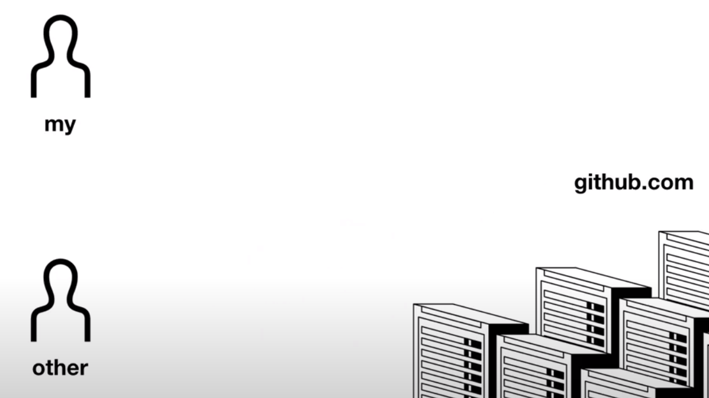
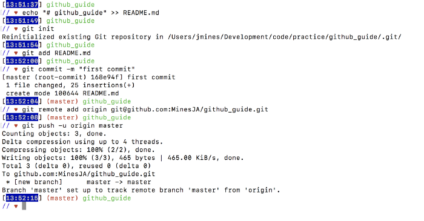
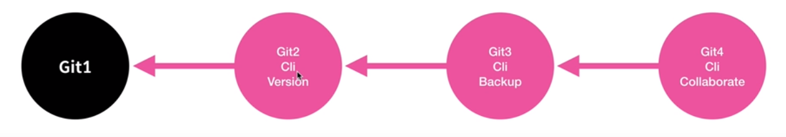
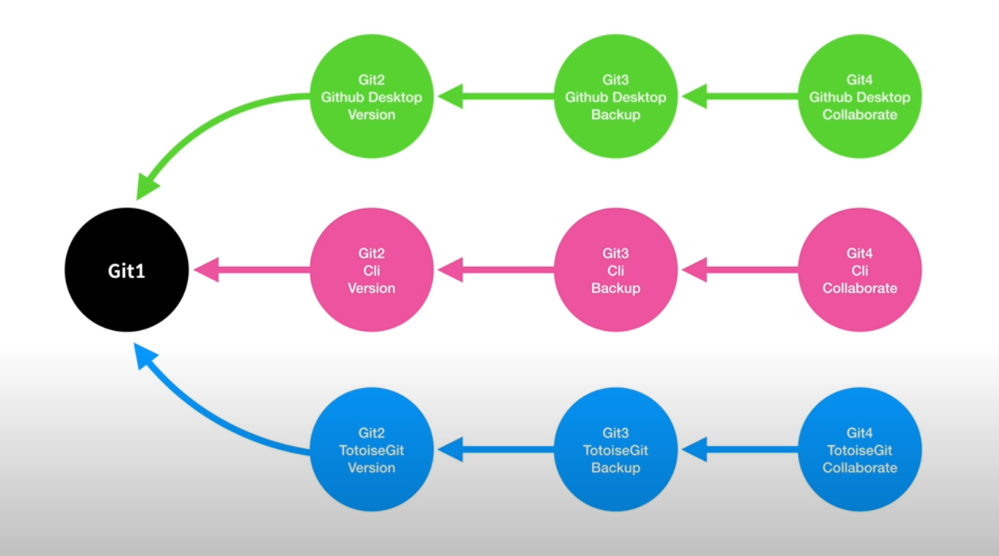

>> 생활코딩 -프로젝트 관리 - GIT1을 학습, 정리한 내용입니다. (https://opentutorials.org/course/3837)

# Git1.md
 **chapter 1. 제목**

- git
    - version control
    - backup
    - collaboration
    - git products

# 목차
* chapter 1 ~ chapter 6
    1. git
    2. 버전관리
    3. 백업
    4. 협업
    5. git의 종류
    6. 정리, 심화주제


# 수업소개

2021년 3월 31일 수요일
오후 9:15

## 지옥에서 온 정보관리자

* 2005년 리노스 토르발스 (리눅스개발자)가 깃을 세상에 처음 내놓으며 한 말 git은 정보와 데이터의 작업지옥에서 구제해주는 도구

## git
* 깃은 대표적인 분산 버전 관리 시스템
* 깃(Git)은 컴퓨터 파일의 변경사항을 추적하고 여러 명의 사용자들 간에 해당 파일들의 작업을 조율하기 위한 분산 버전 관리 시스템이다. 
* 소프트웨어 개발에서 소스 코드 관리에 주로 사용되지만 어떠한 집합의 파일의 변경사항을 지속적으로 추적하기 위해 사용될 수 있다. 
* 기하학적 불변 이론을 바탕으로 설계됐고, 분산 버전 관리 시스템으로서 빠른 수행 속도에 중점을 두고 있는 것이 특징이며 데이터 무결성, 분산, 비선형 워크플로를 지원한다.
    >출처: <https://ko.wikipedia.org/wiki/%EA%B9%83_(%EC%86%8C%ED%94%84%ED%8A%B8%EC%9B%A8%EC%96%B4)> 

### 이고잉님이 말하는 깃의 3대 목적
1. version 버전
2. backup 백업
3. collaborate 협업
* 3가지의 목적은 순서가 있다. (버전 > 백업 > 협업) 
* 앞에 것을 이해하지 못하면 뒤의 것을 이해할 수 없다.
* 앞의 것은 그것만으로도 할 수 있는 일이 많다. (뒤의 것은 앞의 것에 의존)
* 앞이 쉽고 뒤로 갈수록 기하급수적으로 어렵다.


# 버전관리

2021년 3월 31일 수요일
오후 9:23

## git 공식 웹사이트
> https://git-scm.com/

## git version control
* 깃 버전관리로 각각의 버전 간의 차이를 쉽게 볼 수 있다.
  
## git version control 과정(실습)
1. 깃에서 디렉토리를 만들고 path를 만들면 .git이라는 디렉토리가 생김.(숨겨져서 버전들이 저장됨)
2. 파일을 만들면 깃에 새로 만든 파일이 뜨고
3. 파일을 수정할 때마다 서모리를 적고 커밋을 하면 버전이 만들어진다.
4. 또 수정을 하고 파일을 저장하면 깃에 파일이 뜨고 파일 히스토리가 보인다
5. 새로운 파일을 저장하고 커밋을 하면 2개의 파일이 버전으로 등록되어있다. 
6. 이미지 파일은 이미지 미리보기를 통해 변한 것을 보여준다.
7. 클릭 1~2번으로 과거의 상태로 돌아갈 수 있다.


# 백업

2021년 3월 31일 수요일
오후 10:49

## 백업의 이유
* 귀중한 정보라면 백업을 해야한다 다른 컴퓨터에 복제하는것.
* 지구 곳곳의 컴퓨터들에다가 복제를 해놓으면 지구가 멸망하지 않는 한 괜찮을 것.
* 대표적인 git 서비스가 github

### github desktop, github.com에서 백업 실습
* github desktop에서 publish repository로 github.com에 백업할 수 있다
* 그리고 파일을 수정하고 커밋하면 새로운 버전을 pushing to origin을 눌러서 깃허브로 백업할 수 있다.
* 드랍박스나 구글드라이브 처럼 여러 컴퓨터를 동기화하는 효과를 낼 수 있다.


# 협업

2021년 3월 31일 수요일
오후 10:54

## collaborate
백업




## git collaborate의 간단한 원리
* 작업을 시작하기 전에 협업중인 팀원이 작업해 놓은게 있는지 pull하고 내 작업이 끝나면 push한다. 
* 심지어 같은 행을 두 사람이 수정했을 때는 깃이 교통정리를 잘해준다.
  
## git collaborate 과정
>출처 : https://medium.com/@jonathanmines/the-ultimate-github-collaboration-guide-df816e98fb67
1. New Project 생성
   * repo 생성 (public유지, README생성 uncheck)
   * setup page에서 repo(Remote와 terminal(Local)연결 
    
   * .git폴더 확인(연결, .gitignore확인)
   * first commit 확인(README.md파일)
   * repo up to date(terminal - add, commit,push)
2. 팀 설정. repo에 팀원들을 등록
    * Setting - Collaborators - Add Collaborator
    * 협업자 - Github Repo page에서 프로젝트 Git Clone(fork 하면 내 github.com으로 Repo 복사. 따라서 하면 안됨)
    ```bash
    $ git clone (SSH key)
    $ cd github_guide/
    ```
3. 협업
   * 협업 룰
     * master branch는 항상 배포 가능한 상태로 유지(deployable)
       * 새로운 기능을 위한 새 branch를 만들고 완료되면 Master에 merge
       1. Branches
          * branch는 항상 기능을 표시
            * ex) user_authentication(유저_인증)
            * branch에 필요한 항목만 업데이트
          * 코드가 겹치지 않게 작업 
            * 동시에 같은 branch에서 작업 x
          * branch로 만들고 checkout해서 새로운 branch에서 작업
          * 일반적으로 코드가 작동하는 수준의 작업을 했으면(method를 완료하고 코드베이스작업을 완료하면) 자주 add하고 commit해야 한다.(1시간에 2번 정도)
          ```bash
          $ git commit -m "Added function to allow Users to say 'Hello World'"
          ```
        2. Pull Request 제출
           * Git Flow 결정
             * ex) 
               1. merge master(reviewer) 한 명 결정(한 번에 한 개의 merge conflict만 처리하도록)
               2. 팀원들 branch push
               3. Github Repo page로 이동("Compare & pull request"버튼과 함께 페이지 상단의 노란색 막대에 밀어 올린 브랜치를 볼 수 있다.) 
               4. “Compare & pull request”를 클릭(“Open a pull request”페이지로 이동)
               5. 실제로 변경 한 내용에 대한 간략한 설명을 작성
               6. "Reviewers"탭을 클릭
               7. 팀이 "Merge Master"로 결정할 사람을 선택
               8. 완료되면“Create pull request”를 클릭
        3. Pull Request 병합
           * Merge Master는 github로그인시 팀원들이 자신을 reviewer로 할당했음을 알리는 알림이 뜬다.
           * 같이 일한다면 길고 상세한 Review Summaries를 작성할 필요없지만 원격으로 작업하는 경우 Review Summaries를 통해 requester에게 필요한 추가작업이 필요한지 알려주고 필요없다면 merge할지 안 할지 알려줄 수 있다.
             1. “Add your review”버튼 클릭(Pull REquest page로 이동)
             2. "Review changes"에서 "Submit review"를 클릭(리뷰가 풀 리퀘스트 스레드에 댓글로 표시)
             3. pull 요청에 만족하면 pull 요청의 맨 아래로 이동하여 "Merge pull request"를 클릭(그러면 "Pull request successfully merged and closed"메시지와 클릭해야하는 "지점 삭제"버튼이 표시)
        4. Rinse, Repeat
            * 계속해서 새로운 기능을 위해 branch를 추가하고 팀으로써 master에 merge.
            * master를 깨끗하고 배포가능한 상태로 유지하고 병합은 한 번에 한 개씩 해야 한다.

### github 협업 가이드
>(MinesJA / github_guide) https://github.com/MinesJA/github_guide


# git의 종류

2021년 3월 31일 수요일
오후 10:57

## git
* 깃은 제품이라기보다는 제품군을 뜻한다.
* 깃이 콜라라면 github는 코카콜라

### 깃 제품군에서 다양한 제품들
1. github.com에서 깃허브데스크탑을 다운받을 수 있다.
2. tortoiseGit (윈도우에서만 사용가능) 가볍고 간단
3. sourcetree 복잡하지만 강력
4. git git-scm.com 오리지널 프로그램 


# 정리, 심화주제

2021년 3월 31일 수요일
오후 11:03

## 깃, 버전관리가 무엇인지

## 심화학습
### 1. Git CLI
* 조금 어렵지만 더 빠르게 사용 할 수 있는 (개발자들에게 추천)
* 
```
* CLI = Command-Line Interface
  * 명령어(글자의 입출력)를 통해 사용자와 컴퓨터 간 소통하는 방식 
  * ex) terminal - cmd,bash등
```
### 2. GUI 환경의 GIT
* 비개발자들(일반사무원)도 쉽게 사용할 수 있는 git 서비스
* github Desktop, TotoiseGit 등

```
* GUI = Graphical User Interface
  * 그래픽 사용자 인터페이스. 
  * 사용자가 편리하게 사용할 수 있도록 기능을 아이콘 등의 그래픽으로 표시 
  * ex) 대부분의 모바일 장치에 사용되며 마우스와 키보드로 메뉴, 버튼, 아이콘, 단추등의 그래픽 요소를 직접 조작하는 현대의 컴퓨터들은 GUI를 사용하고 있다.
```

