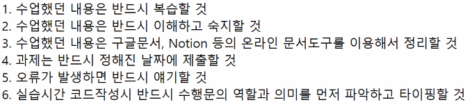
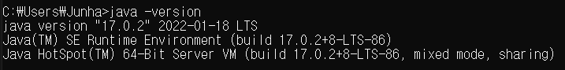
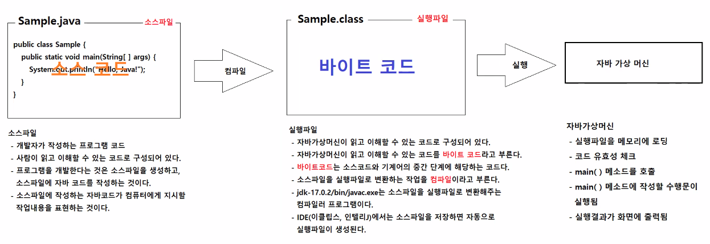

# 3/2

## 1교시
### 최종 학습목표
1. 자바
2. 자바스크립트
3. 데이터베이스(sql)
4. 스프링
* 위의 4가지 기술을 이용해서 어플리케이션을 만든다.
### UI/UX (커리큘럼에 있는 용어 설명)
* 학습목표
  - 고객의 요구사항에 맞는 어플리케이션을 만들기 위해 분석하고 실제로 개발할 내용들을 도출해 내는 것이 목표.

### 프로젝트 (2)
1. 세미 프로젝트 - 간단한 웹 어플리케이션
   - 6개의 조
   - 각 5명
   - 2주 정도 진행
   - 간단한 커뮤니티 사이트, SNS 사이트, 쇼핑몰과 같은 웹 어플리케이션을 만들게 된다.
       - ex) 인스타그램, 네이버 카페, 네이버 블로그, 디시인사이드 등.
   - 14개의 기수 동안 단 한번도 완성되지 않은 결과물이 나온적이 없다.

2. 파이널 프로젝트 - 좀 더 복잡한 웹 어플리케이션
   - 에어비앤비
   - 여행 예매 사이트(여행지 선택, 숙소 선택, 여행지 정보, 숙박시설 정보, 예매 , 취소 등의 기능)

### 학습에 필요한 의지, 노력, 방식
1. 복습 1
    1. 배운 모든 코드는 당일에 모두 이해한다.
2. 복습 2
    1. 배운 모든 코드를 한 번씩 직접 복습한다. (단순히 보고 베끼는 것이 아니라 한번 읽어보고 직접 생각하면서 코딩한다.)
3. 과제
    1. 기한 내에 반드시 제출
4. 수업시간동안 단순 받아쓰기를 하지 않는다.
    1. 코드의 의미를 이해하고 생각하면서 코딩한다.
    2. 강사님의 코딩이 끝나면 스스로 생각하면서 코딩한다.
    * 예시
        ```java
        public static void main(String[] args){
            String str = "Hello java";
        }
        // 퍼블릭 스태틱 보이드인 main 함수를 만든다. 
        // main 메서드는 String 타입의 args(아규먼츠)를 받는다.
        // String 타입의 'str' 변수에 'Hello java' 문자열을 대입한다.
        ```
    
        > [https://mozi.tistory.com/553](https://mozi.tistory.com/553) (자바 main 함수에 대한 이해)
        
## 2교시
### 수업지침

### 강의동영상 업로드
구글 드라이브에 매일 녹화된 강의 영상을 업로드해서 다시 볼 수 있다.
> https://drive.google.com/drive/folders/1Oq_HbUtmBzEOYWO6BpOYz6sCHHZ3kklU?usp=sharing
* 전 기수의 파이널 프로젝트 프레젠테이션 예시 시청.

## 3교시
### 프로그래밍 언어의 종류
* C, C#, C++, Perl, go, Python, Java, Javascript, Php, Ruby, Kotlin, R, Swift
### 한국의 웹 개발환경
* 전자정부표준프레임워크 
  - 자바, 스프링 기반 웹 애플리케이션 개발 프레임워크
  - 관공서, 국공기업체의 웹 애플리케이션 개발에 사용
* 삼성 SDS, LG CNS, SK C&C 외 다수의 대형 SI업체(시스템개발업체), 중견 SI업체들 
  - 자체 개발 프레임워크를 보유하고 있음
    (자바, 스프링 기반 개발 프레임워크)
### 프로그램이란?
> https://g.co/kgs/Hghttr
컴퓨터 프로그램은 컴퓨터에서 실행될 때 특정 작업을 수행하는 일련의 명령어들의 모음이다. 특정 문제를 해결하기 위해 처리 방법과 순서를 기술하여 컴퓨터에 입력되는 일련의 명령문 집합체이며 대부분의 프로그램은 실행 중에 사용자의 입력에 반응하도록 구현된 일련의 명령어들로 구성되어 있다. 위키백과
* 특별한 작업을 수행하는 것. 컴퓨터가 수행할 작업을 작성해 놓은 작업지시서
* 작업지시서, 레시피 => 작업 순서가 정해져 있음. 순서대로 작업을 진행해야 정상적인 결과가 출력됨.
* 정확, 명확, 명료해야 함. => 작업을 수행하는 것은 인간이 아닌 컴퓨터이기 때문
  * ex) 인스타그램 - 내가 팔로우한 친구들의 사진들을 보여준다.
    1. 앱이 실행됨.
    2. 시스템의 현재 날짜와 시간을 조회함.
    3. 사용자가 팔로우하는 계정의 사용자들이 현재 시간 기준으로 최근에 게시한 스토리, 게시글을 조회함.
    4. 조회된 스토리, 게시글을 게시된 날짜를 기준으로 정렬해서 화면에 출력함.
    5. 내가 다른 장치에서 이미 조회했거나, 좋아요, 저장하기 등을 했던 게시글들은 그 정보도 함께 표시함. 
### 프로그래밍 언어란?
* 작업지시서를작성할 때 사용되는 말(표현)
* 컴퓨터에게 작버을 지시하기 위해서 사용되는 말

## 4교시
> [복습용 자료] https://github.com/eungsu/documents/tree/master/01-java

### Java
* 제임스 고슬링 - 썬마이크로시스템즈 에서 개발
썬마이크로시스템즈는 오라클에 합병되었다. 오라클은 데이터베이스 소프트웨어를 개발하는 회사.
* 가장 최신의 자바 버전을 당장 사용하지는 않는다.
그 버전에 맞는 스프링 등의 주변 개발환경 등이 어울려야 하기 때문.
* 자바개발도구 (JDK) : java로 프로그램을 작성하고, JRE에서 실행가능한 상태로 만들어 주는 프로그램들
* 자바개발환경 (JRE) : java로 만든 프로그램을 컴퓨터에서 실행시킬 때 필요한 프로그램들

* JRE = 자바가상머신 + 라이브러리
* JDK = JRE + 개발도구
  
### Java Edition
* Java SE(Standard Edition) : Desktop에서 실행되는 자바프로그램 개발에 필요한 개발도구, 실행환경 제공
* Java EE(Enterprise Edition) : Server에서 실행된 자바프로그램에 대한 표준을 제공
* Java ME(Micro Edition) : 태블릿, 모바일 장치에서 실행되는 자바프로그램 개발에 필요한 개발도구

### Java 설치
1. java.sun.com으로 접속
   > [java.sun.com](https://www.oracle.com/java/technologies/)
2. java se 17.0.2 클릭 후 window에서 64비트 버전 다운로드 후 실행
   > https://www.oracle.com/java/technologies/downloads/#jdk17-windows
3. C:\Program Files\Java 파일탐색기 경로에 다운로드 받은 자바 버전확인 가능.
4. 환경변수 설정
   * 시스템 환경 변수 편집 - 환경변수 시스템 변수 - 시스템 변수 - 새로 만들기 - 변수이름 : 'JAVA_HOME' / 변수 값 : 'C:\Program Files\Java\jdk-11.0.10'
   * 시스템 변수 - Path - 환경 변수 편집 - .새로 만들기 : '%JAVA_HOME%\bin' - 제일 위로 올림. ( bin 폴더에는 다양한 자바 개발 도구들이 있는데 실습시 직접 실행시키지 않고 통합 개발 환경을 사용한다. )
5. CMD에서 버전 확인
   * 참고사항 - 명령 경로의 사용자명이 한글이면 Oracle이 설치가 안된다.
   * 버전확인 - 'java -version'  


## 5, 6교시
### **자바의 특징**
1. 자바는 자바가상머신위에서 실행된다.
2. 자바 프로그램은 플랫폼 독립적이다. 
3. 자바는 객체지향 프로그래밍 언어이다.
   * 고유한 기능을 갖는 객체들을 만들고 그 객체들을 조합해서 원하는 어플리케이션을 만든다.
4. 자바는 멀티스레드를 지원하고, 네트워크 기능을 언어 자체적으로 지원한다.
   * 실제 업무에서 자체적으로 멀티스레드나 네트워크 기능을 구현하지는 않는다.
5. 자바가상머신은 메모리 관리기능(가비지 컬렉션)을 제공한다.
   * 메모리 관리 업무 부담을 배제하므로 업무 로직에 집중할 수 있다.
#### 플랫폼 종속적인 프로그램
* 여기서 '플랫폼'은 하드웨어 및 운영체제를 통틀어 일컫는다.
* 각 운영체제 별로 해당 운영체제에 맞게 설계되어 있는 프로그램을 사용할 수 있다.
* 인터넷의 영향 - 인터넷 상의 어플리케이션을 어떤 플랫폼에 종속적으로 만들 것인가? 하는 문제가 발생.
#### 자바가상머신 JVM(Java Virtual machine)
* 위의 문제를 대처하기 위해 "번역기"가 필요 (어떤 프로그램이든 어떤 플랫폼에 종속적이든 상관없이 사용 가능하게 하는 도구)
* 자바가상머신이 번역기의 역할을 수행함.
* 자바가상머신은 번역기 이외의 다양한 역할을 수행함. 
#### 자바 애플릿 (Java Applet)
* 브라우저에서 돌아가는 작은 프로그램
* 플래시가 등장하기 전까지 대부분의 웹 상의 프로그램들은 애플릿으로 만들어졌었다.
* 인터넷이 점점 더 확장되면서 접속한 사람, 날짜와 같은 정보들에 따라 다른 컨텐츠가 표시되어야 하는 기능이 요구됨(동적 컨텐츠)
* 2000년대 초반부터 jsp로 대부분의 인터넷 앱을 만들기 시작함.(오랜 기간 독점)
#### 객체
* 고유한 특징을 가짐
* 설계도만 있으면 쉽게 여러 개를 만들 수 있음
* 재사용성이 높다.
#### 컴포넌트
* 하나 이상의 객체로 구성된 반제품
> 컴포넌트란? https://thefif19wlsvy.tistory.com/24

## 7, 8 교시
### 자바 프로그램 개발하기
* 자바 응용 프로그램
  * 데스크탑에서 실행되는 프로그램
  * 프로그램 개발 및 실행 순서
    1. 소스파일 작성 - 사람이 읽고 이해할 수 있는 코드를 포함하고 있는 파일
    2. 소스파일을 실행파일로 변환(컴파일) - 자바 가상머신이 읽고 이해할 수 있는 코드를 포함하고 있는 파일
    3. 자바 가상머신을 이용해서 실행파일 실행
* 자바 웹 프로그램
  * 웹 서버에서 실행되는 프로그램
    1. 소스파일 작성
    2. 소스파일을 실행파일로 변환(컴파일)
    3. 실행파일을 war파일로 패키징
    4. war파일을 웹서버에 배포
    5. 웹서버 실행
    6. 사용자 컴퓨터의 웹브라우저에서 URL을 입력해서 요청을 서버로 전송
    7. 웹서버가 URL에 해당하는 실행파일을 실행하고, 응답 컨텐츠(HTML)를 생성해서 사용자 컴퓨터의 웹브라우저에 응답으로 제공
    8. 사용자 컴퓨터의 웹브라우저가 응답컨텐츠를 화면에 표시
    * 3, 4과정은 자동화 되어있고 5 ~ 8과정은 웹서버, 사용자가 하는 과정

### 자바 프로그램 개발도구
1. JDK(자바 개발도구)와 JRE(자바실행환경)이 필요함 <-- jdk-17.0.2 설치할 때 이미 설치됨.
2. 통합개발환경(IDE) 필요함.
   * 통합개발환경은 코드 자동완성, 문법검사, 리팩토링, 코드 디버깅, 단위테스트, 소스코드 컴파일, 실행파일 실행 등의 기능을 제공하는 프로그램이다.
   * Eclipse(IBM, 대표적인 통합개발환경), IntelliJ(유료, 점유율 상승중), NetBeans(썬마이크로시스템즈 -> 오라클, 오픈소스), VScode(java전용 x)

### 이클립스 설치
1. 이클립스 사이트에서 Enterprise Java and web developer 버전 다운
2. C드라이브에 압축풀고 workspace-java폴더생성
3. 실행, workspace-java
4. window - preference - encoding "utf-8"로 수정 (workspace, css, html, jsp 모두 utf-8로 바꿔준다)
5. font 수정
6. ctrl+N - java - java project - 'java-basic' - module 체크해제
   * 대문자 사용 x, _언더바 사용 x

### 자바 프로그램 개발 및 실행하기
1. 새 자바 프로젝트 생성하기
2. 소스파일 정의 및 코딩
3. 실행

### 소스파일 만들기
1. 소스파일의 이름은 항상 대문자로 시작한다.
2. 소스파일의 확장자는 .java로 끝난다.
3. 소스파일의 이름이 두 단어 이상으로 구성되었을 때 두 번째 단어부터 첫 글자는 대문자로 적는다.(파스칼 표기법)
   * StudentScore.java
   * JwtAuthenticationToken.java
   * BookRepository.java
   * cf)jwt_authentication_token.cpp (파이썬, Php, peal 등에서 사용. 스네이크표기법)

### 소스파일
* 개발자가 작성하는 프로그램 코드
* 사람이 읽고 이해할 수 있는 코드로 구성되어 있다.
* 프로그램을 개발한다는 것은 소스파일을 생성하고, 소스파일에 자바 코드를 작성하는 것이다.
* 소스파일에 작성하는 자바코드가 컴퓨터에게 지시할 작업내용을 표현하는 것이다.

### 실행파일
* 자바가상머신이 읽고 이해할 수 있는 코드로 구성되어 있다.
* 자바가상머신이 읽고 이해할 수 있는 코드를 **바이트 코드**라고 부른다.
* **바이트 코드**는 소스코드와 기계어의 중간 단계에 해당한다.
* 소스파일을 실행파일로 변환하는 작업을 **컴파일**이라고 부른다.
* jdk-17.0.2/bin/javac.exe는 소스파일을 실행파일로 변환해주는 컴파일러 프로그램이다.
* IDE(이클립스, 인텔리J)에서는 소스파일을 저장하면 자동으로 실행파일이 생성된다.

### 자바가상머신
* 실행파일을 메모리에 로딩.
* 코드 유효성 체크.
* main() 메소드를 호출.
* main() 메소드에 작성할 수행문이 실행됨.
* 실행결과가 화면에 출력됨.

#### 소스파일 > 실행파일 > 자바가상머신의 동작


#### 소스파일의 구성
```java
public class Sample {
    public static void main(String[] args) { 
        System.out.println("Hello, java!"); 
    } 
}
```
```java
public class Sample { // 여는 괄호, 소스코드의 body부의 시작부분을 나타냄
/*
1. public : "공개된~" , 자바의 예약어
2. class : "설계도 혹은 프로그램" , 모든 자바 프로그램의 최소 작성단위, 자바의 예약어
3. Sample : 설계도 혹은 프로그램의 "이름"
*/ 
    public static void main(String[] args) { // 여는 괄호, main 메소드 body부의 시작부분을 나타냄
    /*
    프로그램 실행의 진입점이 되는 곳. 자바가상머신 실행파일을 읽어서 가장 먼저 실행되는 코드이다.
    1. public : "공개된~" , 자바의 예약어
    2. static : "정적인~, 공유되는~, 객체생성 없이도 사용할 수 있는~" , 자바의 예약어
    3. void : "반환값이 없는~" , 자바의 예약어
    */ 
        System.out.println("Hello, java!"); // 수행문 : 컴퓨터가 실제로 수행할 작업을 지시하는 문장, 수행문의 끝에는 ;(세미콜론)가 붙는다.
        // System.out은 표준출력장치(모니터)를 가르킨다. cf) System.in은 표준입력장치(키보드)를 가르킨다.
        // println("출력할 내용")은 문자열을 출력한다.

    } // 닫는 괄호,  main 메소드 body부의 끝부분을 나타냄

} // 닫는 괄호, 소스코드 body부의 끝부분을 나타냄

// 항상 여는 괄호 다음에 들여쓰기해서 내용을 구분할 수 있도록 한다. (필수)
```
* 코딩가이드에 맞게 띄어쓰기, 들여쓰기를 지킨다.
  * 네이버 코딩가이드, 자바 코딩가이드 등 검색가능
  * 유사 ex) 팔만대장경 - 한 사람이 만든 것처럼 통일된 양식.

#### Hello world! 실습
1. java-basic의 src 우클릭 후 New - Class - 'Sample'
2. 수행문 작성, 출력문 'Hello, java!' 작성
3. 저장 하면 C:\eclipse\workspace-java\java-basic\bin 경로에 class파일이 바이트 코드로 생성된다.