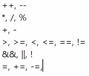
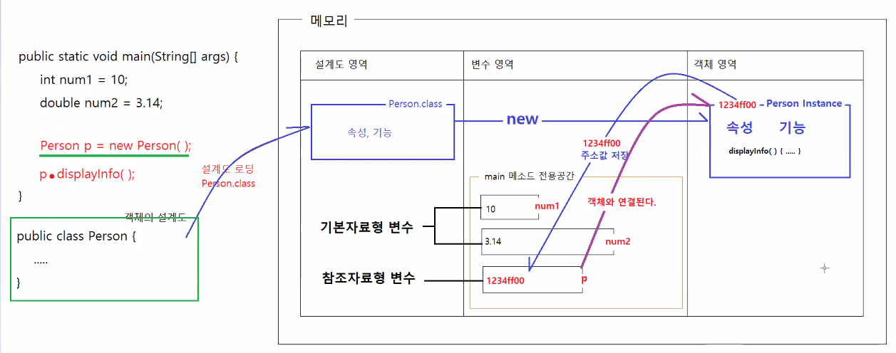
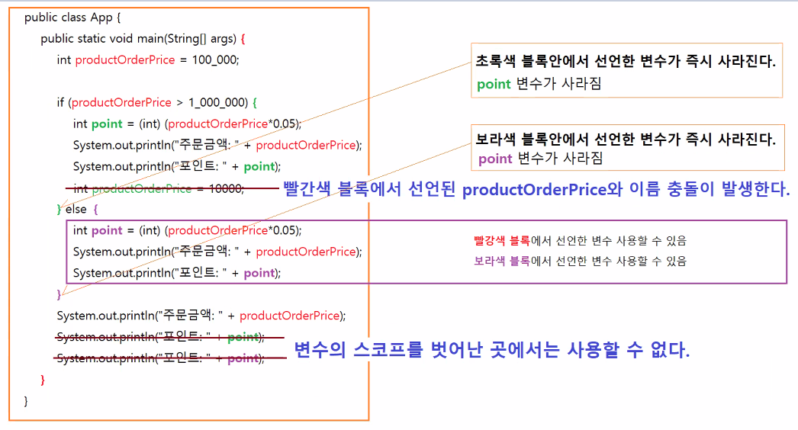
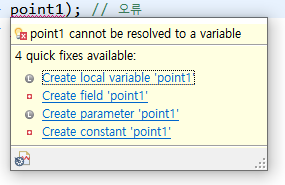
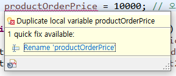
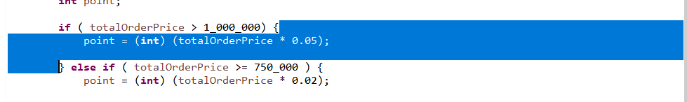
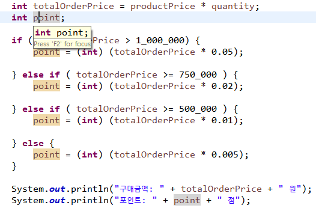
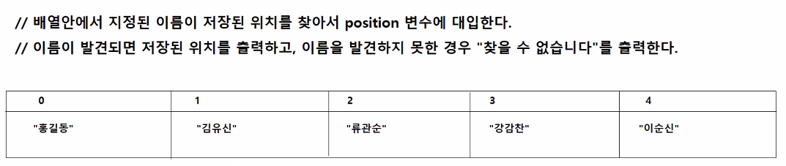

# 3/4

- [3/4](#34)
	- [1 ~ 2교시](#1--2교시)
		- [OperatorApp3.java](#operatorapp3java)
		- [OperatorApp4.java](#operatorapp4java)
		- [조건 연산자](#조건-연산자)
		- [OperatorApp5.java](#operatorapp5java)
		- [연산자 우선순위](#연산자-우선순위)
	- [3교시](#3교시)
		- [제어문과 반복문](#제어문과-반복문)
		- [자바의 메모리 구조](#자바의-메모리-구조)
			- [기본자료형 변수](#기본자료형-변수)
			- [참조자료형 변수](#참조자료형-변수)
		- [IfApp1](#ifapp1)
		- [IfApp2](#ifapp2)
		- [IfApp3.java](#ifapp3java)
		- [변수의 스코프(scope)](#변수의-스코프scope)
			- [변수의 스코프 실습 예제](#변수의-스코프-실습-예제)
			- [변수에 대한 꿀팁, 주의사항](#변수에-대한-꿀팁-주의사항)
		- [IfApp4.java](#ifapp4java)
		- [IfApp5.java](#ifapp5java)

<small><i><a href='http://ecotrust-canada.github.io/markdown-toc/'>Table of contents generated with markdown-toc</a></i></small>


## 1 ~ 2교시
### OperatorApp3.java
* 6개의 비교연산자 >, >=, <, <=, ==, != 를 이용해서 비교연산을 수행할 수 있다.
* 변수를 이용해 비교연산 조건식을 간편하게 만들 수 있다.
```java
public class OperatorApp3 {

	public static void main(String[] args) {
		// 비교연산자
		// > >= < <= == !=

		int number1 = 40; // 40점 이하면 낙제
		int number2 = 60; // 60점 미만이면 불합격
		int number3 = 90; // 90점 이상이면 장학금

		int score1 = 15;
		int score2 = 45;
		int score3 = 70;
		int score4 = 89;
		int score5 = 94;

		boolean result1 = score1 <= number1;
		System.out.println("첫번째 학생의 낙제여부: " + result1);

		boolean result2 = score2 <= number1;
		System.out.println("두번째 학생의 낙제여부: " + result2);
		result2 = score2 < number2;
		System.out.println("두번째 학생의 불합격여부: " + result2);

		boolean result3 = score3 <= number1;
		System.out.println("세번째 학생의 낙제여부: " + result3);
		result3 = score3 < number2;
		System.out.println("세번째 학생의 불합격여부: " + result3);
		result3 = score3 >= number3;
		System.out.println("세번째 학생의 장학금지급여부: " + result3);

		boolean result4 = score4 <= number1;
		System.out.println("네번째 학생의 낙제여부: " + result4);
		result4 = score4 >= number2;
		System.out.println("네번째 학생의 합격여부: " + result4);
		result4 = score4 >= number3;
		System.out.println("네번째 학생의 장학금지급여부: " + result4);
		
		boolean result5 = score5 <= number1;
		System.out.println("다섯번째 학생의 낙제여부: " + result5);
		result5 = score5 >= number2;
		System.out.println("다섯번째 학생의 합격여부: " + result5);
		result5 = score5 >= number3;
		System.out.println("네다섯번째번째 학생의 장학금지급여부: " + result5);
		
	}
}
```
### OperatorApp4.java
* 3개의 논리연산자 &&, ||, ! 를 사용해서 참, 거짓 여부를 판정하는 조건식을 만들 수 있다.
* 연산자 간의 우선순위와 실행순서를 이해할 수 있다.
```java
public class OeperatorApp4 {

	public static void main(String[] args) {		
		// 논리연산자
		// && || !
		// 연산결과는 항상 boolean형의 값이다.
		// 피연산자도 boolean형의 값이어야 한다. 연산결과가 boolean형인 표현식이어야 한다.
		// * 비교연산자는 제시된 한가지 조건 하나를 검사(판정)할 수 있다.
		// * 논리연산자는 제시된 여러 개의 조건을 조합해서 검사(판정)할 수 있다.
		
		// 자동차 무상수리 조건
		// 운행거래가 50000km 미만이고, 사용연수가 3년 이하여야 한다. (2개 이상의 조건을 조합해서 판정을 내릴 때 -> 논리연산자 사용)

		int distance = 50000;
		int year = 3;
		
		int inputDistance = 35000;
		int inputYear = 3;
		
		boolean result = inputDistance < distance && inputYear <= year; 
		// 비교연산자가 논리연산자보다 우선순위가 높다.
		// 연산 우선순위가 같을 경우에는 왼쪽부터 실행한다.
		// <와 <=가 우선순위 1이고 &&는 2, = 는 3이다.
		// 따라서 실행순서는 < , <= , && , = 이 순서대로 실행된다.
		
		System.out.println("무상수리 여부: " + result);
		
		// 지정된 구간내에 속하는지 판정하기
		// 구매금액이 10만원 이상 30만원 미만인 경우, 커피쿠폰을 제공한다.
		
		int orderAmount = 200000;
		
//		boolean couponResult = 100000 <= orderAmount < 300000; // 문법오류
		boolean couponResult = 100000 <= orderAmount && orderAmount < 300000;

		System.out.println("커피쿠폰 지급여부: " + couponResult);
		
		System.out.println(couponResult);
		System.out.println(!couponResult);
//		System.out.println(!orderAmount); // !연산자의 피연산자는 불린형의 값이어야 한다.
				
	}
}
```

### 조건 연산자
* 제시된 조건이 true/false 중에서 무엇으로 판정되느냐에 따라서 연산결과값이 달라지는 연산자.
```
  /* 
    조건 연산자
      변수 = 조건식 ? 값1 : 값2;
      * 조건식이 true으로 판정되면 변수에 값1이 대입된다.
      * 조건식이 false로 판정되면 변수에 값2가 대입된다.
  */   
      int score = 90;
      String result = score >= 60 ? "합격" : "불합격";   // result에는 "합격"이 대입된다.
      System.out.println("판정결과: " + result);
```
### OperatorApp5.java
```java

public class OperatorApp5 {

	public static void main(String[] args) {
		// 삼항연산자
		// 조건식 ? 표현식1 : 표현식2
		// 조건식의 연산결과는 boolean형의 값이어야 한다.
		// 표현식1과 표현식2는 같은 타입의 값이거나, 같은 타입의 값이 연산결과로 제공되는 표현식이어야 한다.
		// 조건식이 true로 판정되면 표현식1이, false로 판정되면 표현식2가 이 연산의 최종결과가 된다.

		// 구매금액에 따른 포인트 지급액 계산하기
		// 구매금액이 50만원 이상이면, 구매금액의 3%를 포인트 지급, 그 외는 1% 지급한다.

		int inputOrderAmount = 900000;		
		int point1 = inputOrderAmount >= 500000 ? (int)(inputOrderAmount * 0.03) : (int)(inputOrderAmount * 0.01);
		int point2 = (int)(inputOrderAmount >= 500000 ? inputOrderAmount * 0.03 : inputOrderAmount * 0.01);

		System.out.println("적립포인트 : " + point1);
		System.out.println("적립포인트 : " + point2);
	}
}
```
* 삼항연산자는 웹에서 자주 사용한다.
  * 여러 메뉴들 중에서 하나를 골라 체크하거나 active 상태로 만드는 경우 (포털 스포츠 메뉴 - 축구, 해외축구, 야구, 해외야구, ...)

### 연산자 우선순위
  
위에 있을수록 우선순위가 더 높다.

## 3교시
### 제어문과 반복문
* 특정 조건을 만족할 때(표현식이 true로 판정될 때) 수행문의 실행 흐름을 변경하거나, 수행문을 반복 실행하는 것
* 제어문
  * if문, switch문
* 반복문
  * for문, while문, do~while문
    * for문과 while문은 서로 상호 교체가 가능하지만 효율적으로 사용하는 경우가 나뉘어져 있다.

### 자바의 메모리 구조

* 자바에는 설계도영역, 변수 영역, 객체 영역이 있다.
* 사용자가 클래스를 작성하고 메인메소드에서 변수를 사용하는 등의 작업을 하면 JVM이 알아서 메모리 영역에서 작업을 실시한다.
* 변수 영역에 main 메소드 전용공간이 있다.
#### 기본자료형 변수
  * 설계도가 없다.
  * 변수 영역(main 메소드 전용공간)에 값이 저장된다.
#### 참조자료형 변수
  * 설계도 영역에 속성과 기능을 담은 설계도가 저장된다.
  * 객체 영역에 속성과 기능이 저장된다.
  * 변수 영역(main 메소드 전용공간)에 객체 영역의 주소값이 저장되어 있다.(참조되어 객체와 연결된다.)

### IfApp1
```java
public class IfApp1 {

	public static void main(String[] args) {
		/*
		 * if (조건식) {
		 * 		수행문;
		 * 		수행문;
		 * 		수행문;
		 * }
		 * + 조건식은 연산결과가 boolean형의 값을 제공하는 표현식이다.
		 * + 조건식의 최종 연산결과가 true로 판정될 때만 블록안에 위치한 수행문들이 실행된다.
		 */
		
		// 문제) 국어, 영어, 수학 점수의 평균이 60점 이상일 때 "합격"과 평균값을 출력하기
		// 1. 국어, 영어, 수학 점수를 입력받는다.
		// 2. 국어, 영어, 수학 점수에 대한 총점을 계산하고 변수에 저장한다.
		// 3. 총점을 과목수로 나눈 평균값을 계산하고 변수에 저장한다.
		// 4. if문을 이용해서 평균이 60점 이상인지 판정하고, true로 판정날 때 평균값과 "합격" 문자열을 화면에 출력한다.
		
		int korScore = 80;
		int engScore = 40;
		int mathScore = 50;
		
		int totalScore = korScore + engScore + mathScore; 
		int average = totalScore / 3;
		
		if (average >= 60) {
			System.out.println("합격입니다.");
			System.out.println("평균점수: " + average);
		} 
						
		System.out.println("프로그램을 종료합니다.");
	}
}
```

### IfApp2
```java
public class IfApp2 {

	public static void main(String[] args) {
		/*
		 * if (조건식) {
		 * 		수행문1;
		 * 		수행문2;
		 * 		수행문3
		 * } else {
		 * 		수행문4;
		 * 		수행문5;
		 * }
		 * 	+ 조건식이 true로 판정되면 수행문1, 2, 3이 실행된다.
		 * 	+ 조건식이 false로 판정되면 수행문4, 5가 실행된다.
		 */ 
		
		
		// 문제) 국어, 영어, 수학 점수를 입력받아서 평균을 계산하고, 평균이 60점 이상이면 합격, 그 외는 불합격을 출력한다.
		// 합격/불합격 여부와 상관없이 평균값은 출력한다.

		int korScore = 80;
		int engScore = 40;
		int mathScore = 100;
		
		int totalScore = korScore + engScore + mathScore; 
		int average = totalScore / 3;
				
		if (average >= 60) {
			System.out.println("합격입니다!!!");
		} else {
			System.out.println("불합격입니다ㅠ");
		}
		System.out.println("평균점수: " + average);
		
	}
}
```

### IfApp3.java
```java
public class IfApp3 {

	public static void main(String[] args) {
		
		/*
		 * if (조건식1) {
		 * 		수행문1;
		 * 
		 * } else if (조건식2) {
		 * 		수행문2;
		 * 
		 * } else if (조건식3) {
		 * 		수행문3;
		 * 
		 * } else {
		 * 		수행문 4;
		 * }
		 * 	+ 판정할 조건이 여러 개일 때 사용한다.
		 *  + 조건식1이 true로 판정되면 수행문1을 실행하고, 나머지 부분은 전부 skip 합니다.
		 *  + 조건식1이 false로 판정되면 조건식2를 검사하고, true로 판정되면 수행문2를 실행하고, 나머지 부분은 전부 skip합니다.
		 *  + 수행문4는 조건식1, 조건식2 , 조건식3이 전부 false로 판정났을 때 실행된다.
		 *  + 조건식들은 전부 같은 값을 대상으로 검사를 수행하는 표현식이어야 한다.
		 *  
		 */
		
		// 상품가격과 구매수량을 입력받아서 총구매가격에 대한 포인트를 출력하기
		// 포인트는 총구매가격에 따라서 다르게 계산한다.
		// 1_000_000 초과 : 구매금액을 5%,
		// 750_000원 이상: 구매금액의 2%,
		// 500_000이상 : 구매금액의 1%,
		// 그 외 구매금액은 0.5%를 적립한다.
		
		int productPrice = 350_000;
		int quantity = 2;
		int totalOrderPrice = productPrice * quantity;
		int point;
		
		if ( totalOrderPrice > 1_000_000) {
			point = (int) (totalOrderPrice * 0.05);
			
		} else if ( totalOrderPrice >= 750_000 ) {
			point = (int) (totalOrderPrice * 0.02);
			
		} else if ( totalOrderPrice >= 500_000 ) {
			point = (int) (totalOrderPrice * 0.01);
			
		} else {
			point = (int) (totalOrderPrice * 0.005);
		}

		System.out.println("구매금액: " + totalOrderPrice + " 원");
		System.out.println("포인트: " + point + " 점");
		
	}
}
```

### 변수의 스코프(scope)
* 스코프는 *변수의 사용범위*를 말한다.
* ***자바에서 변수의 스코프는 그 변수가 선언된 블록***이다.
* 같은 스코프내에 이름이 같은 변수를 선언할 수 없다.
* 메소드안에서 선언한 모든 변수는 그 변수가 선언된 블록의 닫는 괄호를 만나면 즉시 사라진다.
#### 변수의 스코프 실습 예제

```java
public class App {
    public static void main(String[] args) {
        int productOrderPrice = 100_000;
        if (productOrderPrice > 1_000_000) {
            int point1 = (int) (productOrderPrice*0.05);
            System.out.println("주문금액: " + productOrderPrice);
            System.out.println("포인트: " + point1);
            int productOrderPrice = 10000; // 오류

        } else if (productOrderPrice > 750_000) {
            int point2 = (int) (productOrderPrice*0.05);
            System.out.println("주문금액: " + productOrderPrice);
            System.out.println("포인트: " + point2);
        }

        System.out.println("주문금액: " + productOrderPrice);            
        System.out.println("주문금액: " + point1);  // 오류
        System.out.println("주문금액: " + point2);  // 오류
    }
}
```
 
* `productOrderPrice`변수는 main메소드 안에서 선언되었기 떄문에 main메소드 블록 안에서는 어디에서든 사용할 수 있다.
* `point1`변수는 if {} 블록안에서만 사용할 수 있다.
* `point2`변수는 else if {} 블록안에서만 사용할 수 있다.
* 즉 변수의 스코프를 벗어난 곳에서는 사용할 수 없다.

#### 변수에 대한 꿀팁, 주의사항
1. 더블클릭으로 블록 전체를 선택해 범위(스코프)를 알 수 있다.
  * 
2. 변수에 커서를 올리면 같은 변수들을 확인할 수 있다.
  * 
3. 변수의 네이밍은 최대한 좁게하되 효율성을 고려하여 적절하게 한다.
  * 넓은 범위의 스코프에서의 변수 선언은 최대한 조심한다.
  * 다른 스코프에서 해당 이름의 변수를 선언해 사용할 수 없기 때문이다.
4. 변수는 선언과 동시에 초기화 하는 것이 좋다.
   * 주로 정수는 '0', 실수는 '0.0', 불린은 'false'로 초기화한다.
   * cf) -1로 초기화
     * 
     * 초기화값을 0으로 하면 값을 찾지 못한 경우 홍길동이 나오므로 절대로 나올 수 없는 값(여기선 -1로 설정하였다.)을 초기화 값으로 지정한다. 
        ```java
        int position = -1;
        // 배열의 0번째부터 4번째까지 순회하면서 "안중근" 찾기
        // 발견되면 position에 그 위치를 저장하기
        if(position == -1) {
            System.out.println("찾을 수 없습니다.");
        } else {
            System.out.println("저장위치는 " + position + "번째입니다.")
        }
        ```

### IfApp4.java
* 내재된 if문 (중첩 if문)
```java
public class IfApp4 {

	public static void main(String[] args) {		
		// 내재된 if문

		// 국어, 영어, 수학점수를 입력받아서 평균을 계산하고, "합격"/"불합격"을 화면에 출력한다.
		// 평균점수가 60점 이상이면 합격이다.
		// 합격자 중에서 평균점수가 95점 이상인 경우 "장학금 지급"을 화면에 출력한다.

		int kor = 100;
		int eng = 90;
		int math = 97;
		
		int average = (kor +eng + math) / 3;
		System.out.println("평균점수: " + average);		
		
		if ( average >= 60 ) { 
			System.out.println("합격을 축하합니다.");
			
			// 합격자에 한해서 점수가 장학금 지급대상인지 확인한다. (코드 효율 증가)
			if ( average >= 95 ) {
				System.out.println("장학금 지급대상입니다.");
			}
		} else {
			System.out.println("불합격입니다.");
		}
		
		// 합격자, 불합격자 상관없이 장학금 지급대상인지 확인한다,
//		if ( average >= 95 ) {
//			System.out.println("장학금 지급대상입니다.");
//		}
		
	}
}
```
* debug 를 이용해 코드를 step별로 확인할 수 있다.
* 내재된 if문을 사용해 코드의 효율성을 높혔다.
* if문을 너무 많이 중첩해서 사용하면 코드의 가독성을 낮추고 코드의 복잡성을 높이므로 자주 사용하지 않는다.
* 내포된 if문을 배제하면서도 똑같이 효율을 높일 수 있는 방법이 있다.
  * 빠른 종료 `return;`

### IfApp5.java
* 빠른 종료 `return`
* 프로그램을 즉시 종료한다.
```java
public class IfApp5 {

	public static void main(String[] args) {		
		// 빠른 종료
		
		// 국어, 영어, 수학점수를 입력받아서 평균을 계산하고, "합격"/"불합격"을 화면에 출력한다.
		// 평균점수가 60점 이상이면 합격이다.
		// 한 과목이라도 점수가 40점 미만이면 과락 불합격이다.
		// 합격자 중에서 평균점수가 95점 이상인 경우 "장학금 지급"을 화면에 출력한다.

		int kor = 40;
		int eng = 60;
		int math = 60;
		
		if ( kor < 40 || eng < 40 || math < 40 ) {
			System.out.println("과락 불합격입니다.");
			System.out.println("종료1");
			return;
		}
		
		int average = (kor +eng + math) / 3;
		System.out.println("평균점수: " + average);		
		
		if ( average < 60 ) { 
			System.out.println("불합격입니다.");
			System.out.println("종료2");
			return; // 빠른 종료
		}
		
		System.out.println("합격입니다.");
		
		if( average >= 95 ) {
			System.out.println("장학금지급대상입니다.");
		}

	}
}
```
