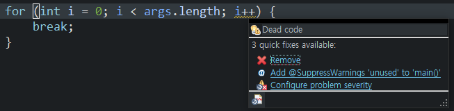
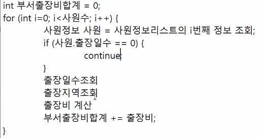
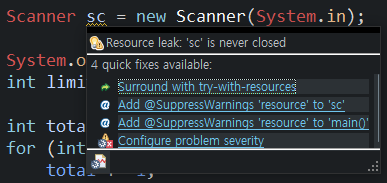
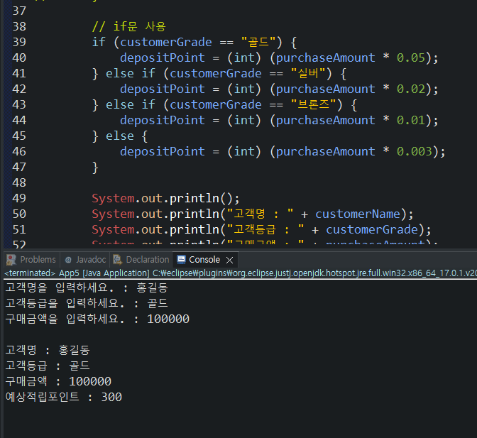
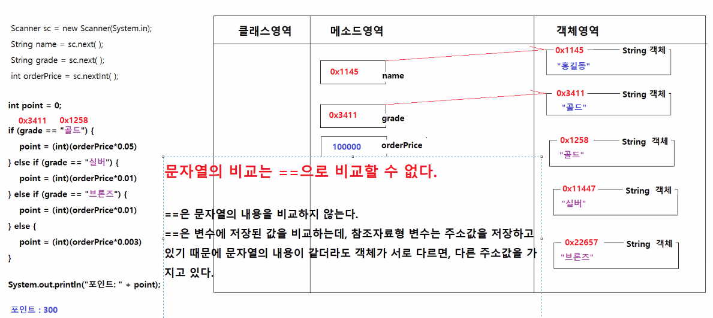

# 3/7

- [3/7](#37)
	- [1 ~ 2교시](#1--2교시)
	- [변수 선언 및 정보 저장, 계산 후 출력하기](#변수-선언-및-정보-저장-계산-후-출력하기)
		- [App1.java](#app1java)
		- [App2.java](#app2java)
		- [App3.java](#app3java)
	- [Switch 문](#switch-문)
		- [switch문의 제약조건](#switch문의-제약조건)
		- [SwitchApp1.java](#switchapp1java)
	- [3 ~ 4교시](#3--4교시)
	- [반복문](#반복문)
		- [for문](#for문)
		- [ForApp1.java](#forapp1java)
		- [ForApp2.java](#forapp2java)
		- [ForApp3.java](#forapp3java)
		- [ForApp4.java](#forapp4java)
		- [ForApp5.java](#forapp5java)
		- [ForApp6.java](#forapp6java)
	- [5 ~ 6교시](#5--6교시)
	- [break문](#break문)
		- [BreakApp1.java](#breakapp1java)
	- [continue문](#continue문)
		- [ContinueApp1.java](#continueapp1java)
		- [continue문 사용예시](#continue문-사용예시)
		- [ForApp7.java](#forapp7java)
		- [ForApp8.java](#forapp8java)
	- [7 ~ 8 교시](#7--8-교시)
	- [package 패키지](#package-패키지)
		- [java.lang](#javalang)
	- [java.util.scanner](#javautilscanner)
		- [ForApp10.java](#forapp10java)
			- [print vs println](#print-vs-println)
			- [warning](#warning)
		- [App4.java](#app4java)
		- [App5.java](#app5java)
			- [Sanner와 if문](#sanner와-if문)

<small><i><a href='http://ecotrust-canada.github.io/markdown-toc/'>Table of contents generated with markdown-toc</a></i></small>


## 1 ~ 2교시
## 변수 선언 및 정보 저장, 계산 후 출력하기
* 변수 선언시 요구사항에 맞는 타입과 변수명을 설정할 수 있다.
* 표준출력장치를 이용해 출력할 수 있다.
* 기본자료형변수와 참조자료형 변수를 이해하고 메모리 영역에서 저장되고 참조되는 것을 이해할 수 있다.
### App1.java
* 상품정보를 저장하는 변수를 생성하고 출력하기
```java
public class App1 {

	public static void main(String[] args) {
		
		/*
		 * 1.상품번호, 상품명, 제조사, 상품가격, 할인가격, 포인트적립비율, 현재재고량, 상품할인여부, 상품절판여부를 저장하는 변수를 생성하고,
		 *  각각의 변수에 상품정보를 저장하기
		 * 2. 변수에 저장된 값을 표준출력으로 출력하기
		 */
		
		int productNumber = 100;
		String productName = "pencil";
		String manufacturer = "MonAmi";
		int productPrice = 1000;
		int discountPrice = 800;
		double pointAccumulationRate = 0.005;
		int stock = 20;
		boolean isDiscount = true;
		boolean OutOfStock = false;
		
		System.out.println("상품번호 : " + productNumber);
		System.out.println("상품명 : "+productName);
		System.out.println("제조사 : "+manufacturer);
		System.out.println("상품가격 : "+productPrice);
		System.out.println("할인가격 : "+discountPrice);
		System.out.println("포인트적립비율 : "+pointAccumulationRate);
		System.out.println("현재재고량 : "+stock);
		System.out.println("상품할인여부 : "+isDiscount);
		System.out.println("상품절판여부 : "+OutOfStock);		
	}
	
}
```
### App2.java
```java
public class App2 {
	
	public static void main(String[] args) {
		
		/*
		 * 매달 10만원씩 적금하는 36개월짜리 정기적금을 가입하였다.
		 * 이자는 2%다. 36개월 경과후 적금만기일에 고객에게 지급되는 총 금액을 계산해서 출력하시오.
		 * 원금은 10만원*36이다.
		 * 이자는 원금의 2%다. 소수점이하는 버린다.
		 * 총 금액은 원금 + 이자다.
		 * 출력내용
		 * 	원금
		 * 	이자
		 * 	총금액
		 */
		
		int reserve = 100_000;
		int months = 36;
		double interestRate = 0.02;
		
		int principal = reserve * months;
		int interest = (int) (principal * interestRate);
		int totalAmount = principal + interest;
		
		System.out.println("원금 : " + principal);
		System.out.println("이자 : " + interest);
		System.out.println("총금액 : " + totalAmount);
		
	}
	
}
```
### App3.java
```java
public class App3 {
	
	public static void main(String[] args) {
		
		/* 
		 * 매달 10만원씩 적금하는 36개월짜리 정기적금을 가입하였다.
		 * 이자는 2%다. 36개월 경과후 적금만기일에 고객에게 지급되는 총 금액을 계산해서 출력하시오.
		 * 원금은 10만원 * 36이다.
		 * 이자는 원금의 2%다. 소수점이하는 버린다.
		 * 금여통장을 우리은행으로 개설한 경우 1% 우대금리를 적용한다.
		 * 총 금액은 원금 + 이자다.
		 * 
		 * 출력내용
		 * 	원금
		 * 	이자
		 * 	총금액
		 */
		
		int reserve = 100_000; //적립금
		int months = 36; // 계약개월수
		double interestRate = 0.02; // 금리
		double preferentialInterestRate = 0.01; // 우대금리
		boolean hasPayrollAccount = true; //급여계좌보유 여부
		
		// 방법 1 (우대금리 따로 계산)
//		int principal = reserve * months;
//		int interest = (int) (principal * interestRate);
//		int preferentialInterest = 0;
//		// if ~ else문을 사용해서 급여통장개설여부에 따라서 이자를 다르게 계산하기
//		if (hasPayrollAccount) {
//			preferentialInterest = (int) (principal * preferentialInterestRate);			
//		} 
//		int totalAmount = principal + interest + preferentialInterest;
//		// 계산결과 출력
//		System.out.println("원금 : " + principal);
//		System.out.println("이자 : " + interest);
//		System.out.println("우대금리 : " + preferentialInterest);
//		System.out.println("총금액 : " + totalAmount);
		
		// 방법 2
		int principal = reserve * months;
		int interest = 0;
		if(hasPayrollAccount) {
			interest = (int) (principal * (interestRate + preferentialInterestRate));
		} else {
			interest = (int) (principal * interestRate);
		}
		int totalAmount = principal + interest;
		// 계산결과 출력
		System.out.println("원금 : " + principal);
		System.out.println("이자 : " + interest);
		System.out.println("총금액 : " + totalAmount);
		
	}
}
```
## Switch 문
* 단 하나의 조건식으로 많은 경우의 수 처리 가능
* 경우의 수가 많은 경우 if문보다 유리(if문보다 상대적으로 많이 사용하지는 않는다.)
```java
switch (조건식) {
    case 값1 :
        조건식의 연산결과가 값1과 일치하는 경우 실행될 수행문;
        break;
    case 값2 :
        조건식의 연산결과가 값2과 일치하는 경우 실행될 수행문;
        break;
    case 값3 :
        조건식의 연산결과가 값3과 일치하는 경우 실행될 수행문;
        break;
    default :
        조건식의 연산결과와 일치하는 case문이 없을 때 실행될 수행문;
}
```
### switch문의 제약조건
* 조건식의 결과는 반드시 정수 또는 문자열
* case문의 값은 정수, 문자, 문자열만 가능하며 중복 불가
* break가 없으면 일치하는 case문과 그 다음에 정의된 모든 case문 default문이 실행된다.
* default문은 생략 가능
* `~이상 ~이하` 이런 조건문에는 사용할 수 없다. (값이 일치해야 case문이 실행되므로)

### SwitchApp1.java
```java
public class SwitchApp1 {

	public static void main(String[] args) {
		
		/* 
		 * switch(연상식 혹은 값) {
		 * 		case 값1:
		 * 			수행문1;
		 * 			수행문1;
		 *			break; 
		 *		case 값2:
		 *			수행문2;
		 *			수행문2;
		 *			break;
		 *		default:
		 *			수행문3;
		 *			수행문3;
		 *	}
		 *
		 * 	연산식 혹은 값이 값1과 일치하면 수행문1이 실행되고, break문을 만나서 switch문을 빠져나온다.
		 * 	연산식 혹은 값이 값2과 일치하면 수행문2이 실행되고, break문을 만나서 switch문을 빠져나온다.
		 * 	연산식 혹은 값이 값1, 값2와 모두 일치하지 않으면 수행문3이 실행되고 switch문을 빠져나온다.
		 */
		
		/*
		 * 고객의 등급에 따라서 구매 상품금액에 대한 적립포인트를 계산해서 출력하기
		 * 		고객등급은 "골드", "실버", "브론즈"가 있다.
		 * 		골드등급은 총구매금액의 3%, 실버등급은 총구매금액의 1%, 브론즈등급은 총구매금액의 0.4%를 포인트로 적립시킨다.
		 * 		등급이 없는 고객의 경우 총구매금액의 0.1%를 포인트로 적립시킨다.
		 */
		
		String customerGrade = "없음";
		int totalOrderPrice = 500_000;
		
		int depositPoint = 0;
		switch (customerGrade) {
		case "골드":
			depositPoint = (int) (totalOrderPrice * 0.03);
			break;
		case "실버":
			depositPoint = (int) (totalOrderPrice * 0.01);
			break;		
		case "브론즈":
			depositPoint = (int) (totalOrderPrice * 0.004);
			break;			
		default:
			depositPoint = (int) (totalOrderPrice * 0.001);
		}
		
		System.out.println("고객등급 : " + customerGrade);
		System.out.println("구매금액 : " + totalOrderPrice);
		System.out.println("적립금 : " + depositPoint);
	}
}
```

## 3 ~ 4교시
## 반복문
* 반복문은 특정한 수행문을 반복해서 실행하는 구문
* 대개 반복횟수를 알고 있을 때는 for문, 그렇지 않은 경우에는 while문을 사용한다.
### for문
* 초기화식, 조건식, 증감식, 코드블록으로 구성
  * 초기화식, 조건식, 증감식 모두 생략가능
  * 초기화식에서 선언한 변수는 조건식, 증감식 및 for문의 블록내에서만 사용가능
```java
for (초기화식; 조건식; 증감식) {
    수행문;
}
```
### ForApp1.java
```java
public class ForApp1 {

	public static void main(String[] args) {
		
		/*
		 * for (초기식; 조건식; 증감식) {
		 * 		수행문;
		 * }
		 * 		조건식의 연산결과가 true로 판정되는 경우 수행문이 실행된다.
		 * 		초기식은 딱 한번만 실행된다. 초기식에서는 변수를 정의하고, 시작값을 대입한다.
		 * 		증감식은 초기식에서 정의한 변수의 값을 변화시킨다.
		 * 		조건식은 초기식에서 정의한 변수값이 제시된 조건을 만족하는지 확인해서 true로 판정되면 수행문을 실행한다.
		 * 
		 * 	실행순서 : 초기식 -> 조건식 -> 수행문 -> 증감식
		 *                     ^                ㅣ
		 *                     ㅣ________________ㅣ
		 */
		
		// 수행문을 반복 수행하기
		for (int i = 0; i < 3; i++) {
			System.out.println("반복작업 수행 중...");
		}
	}
}
```
### ForApp2.java
```java

public class ForApp2 {

	public static void main(String[] args) {
		
		/*
		 * for문의 초기식에서 선언한 변수 num은 for문의 조건식, 증감식, 블록 내 수행문에서만 사용할 수 있다.
		 */
		
		for(int num = 1; num <= 10; num++) {
			System.out.println("num : " + num); // 블록의 수행문은 10번 실행될 때마다 num에 저장된 값은 매번 다르다.
		}
//		System.out.println(num); // 문법오류, for문의 초기식에서 선언한 변수는 다른 곳에서 사용할 수 없다.
	}
}
```
### ForApp3.java
```java
public class ForApp3 {

	public static void main(String[] args) {
		
		// 1~100까지 정수의 합을 계산하기
		int total = 0;
		for (int number = 1; number <= 100; number++) {
			total = total + number;
		}
		
		/*
	      total      number      수행문            증감식
	      0          1          total = 0 + 1        number = 2
	      1          2          total = 1 + 2        number = 3
	      3          3          total = 3 + 3        number = 4
	      6          4          total = 6 + 4        number = 5
	      10         5          total = 10 + 5       number = 6
	      15         6          total = 15 + 6       number = 7
	      21         7          total = 21+ 7        number = 8
	      28         8          total = 28 + 8       number = 9
	      36         9          total = 36 + 9       number = 10
	      45         10         total = 45 + 10      number = 11
	      55      
	    */
		
		System.out.println("1부터 100까지의 합은 : " + total);
	}
}
```
### ForApp4.java
* for문은 if문(제어문)이나 다른 for문(반복문)을 내포할 수 있다.
  * 스택, 큐, 리스트, 링크드리스트, 트리 등의 자료구조에서 특정 값만을 원할 때 조건문을 내포해 사용한다.
  * 목록 안에서 하위 목록을 보여줄 때 for문안에 for문을 내포해 사용한다.
```java
public class ForApp4 {

	public static void main(String[] args) {

		// for문은 if문(제어문)이나 다른 for문(반복문)을 내포할 수 있다.

		// 1 ~ 100까지 2의 배수들의 합계를 계산해서 출력하기
		int total = 0;
		for (int number = 1; number <= 100; number++) {
			if (number % 2 == 0) {
				total += number;
			}
		}
		System.out.println("1 ~ 100까지 짝수들의 합계 : " + total);

	}
}
```
### ForApp5.java
```java
public class ForApp5 {

	public static void main(String[] args) {
		
		// 두 수를 입력받아서 첫번째와 두번쨰 숫자 사이에 포함된 모든 수들의 합계를 계산하기
		int firstNumber = 233;
		int lastNumber = 761;
		
		int total = 0;
		for (int i = firstNumber; i <= lastNumber; i++) {
			total += i;
		}
				
		System.out.println(total);
		
	}
}
```
### ForApp6.java
```java
public class ForApp6 {

	public static void main(String[] args) {
		
		// 구구단 출력하기
		/*
		 * 2 * 1 = 2
		 * 2 * 2 = 4
		 * 2 * 3 = 6
		 * ...
		 * 2 * 9 = 18
		 */
		
		// 출력할 단을 입력받아서 구구단을 출력하기
		int dan = 17;
		System.out.println("구구단 " + dan + "단을 출력합니다.");
		for (int num = 1; num < 10; num++) {
			System.out.println(dan + " * " + num + " = " + dan * num);
		}

	}
}
```
## 5 ~ 6교시
## break문
* return문이 메서드 안의 어디에서나 사용가능한 반면 break문은 반복문 안에서만 사용가능하다.
* return문은 메서드를 즉시 종료시킨다.
* break문은 반복문을 탈출한다.
* break문은 제어문과 함께 사용된다.
### BreakApp1.java
```java
public class BreakApp1 {

	public static void main(String[] args) {
		
		/*
		 * break
		 * 		- 반복문을 탈출한다.
		 * 		- for, while, do ~ while의 블록내에서만 사용할 수 있다.
		 * 		- break문은 제어문과 함께 사용된다.
		 * 		- 반복작업을 수행할 때, 정해진 목표를 달성해서 더이상 반복을 수행할 필요가 없을 때 사용한다.
		 */
		
		// 1 ~ 100 까지 합계를 구할 때, 합계가 지정된 값을 초과했을 때의 숫자와 그 순간의 합계를 출력하시오.
		int max = 3000;
		int total = 0;
		for (int i = 1; i <= 100; i++) {
			total += i;
			if(total >= max) {
				System.out.println("i값 : " + i);	 // 변수 total의 값이 max값보다 크거나 같으면 현재 i값을 출력한다.
				System.out.println("합계 : " + total);
				break;		 						 // 변수 total의 값이 max값보다 크거나 같으면 반복문을 탈출한다.
			}
		}

	}
}
```

* Dead code : 한번도 사용되지 않는 코드
## continue문
### ContinueApp1.java
```java

public class ContinueApp1 {

	public static void main(String[] args) {
		
		
		
			/*
			 * continue
			 * 		- 반복문안에서 continue구문은 남아있는 수행문을 실행하지 않고, 
			 * 		  for문에서는 증감식으로, while문에서는 조건식으로 이동해서 다음번 반복을 수행하게 한다.
			 * 		- 반복문안에서만 사용할 수 있다.
			 * 		- continue문은 제어문과 함꼐 사용된다.
			 * 
			 * for (int i = 1; i <= 5; i++) {
			 * 		if (i == 2) {
			 * 			continue;
			 * 		}
			 * 		System.out.println(i);
			 * }
			 * 		int i = 1;
			 * 		i <= 5
			 * 		System.out.println(1)
			 * 		i++
			 * 		2 <= 5
			 * 		continue
			 * 		// 이 수행문을 실행하지 않고 증감식으로 이동한다. System.out.println(2)
			 * 		i++
			 * 		3<=5
			 * 		System.out.println(3)
			 * 		i++
			 * 		4<=5
			 * 		System.out.println(4)
			 * 		i++
			 * 		5<=5
			 * 		System.out.println(5)
			 * 		i++
			 * 		6<=5
			 */
		
		// 3의 배수만 출력하기, continue 사용
		for (int i = 1; i <= 30; i++) {
			if (i % 3 != 0) { // 3의 배수가 아니면 continue문이 실행되고, 45번째 수행문을 실행하지 않고, 증감식으로 이동한다.
				continue;
			}
			System.out.println(i);
		}
		
		// 3의 배수만 출력하기, continue 사용없이
		for (int i = 1; i <= 30; i++) {
			if (i % 3 == 0) { // 3의 배수 일때만 출력한다.
				System.out.println(i);
			}
		}
			
	}
}
```
### continue문 사용예시


### ForApp7.java
* 이중 for문
  * `수행문의 실행횟수 = 외부 for문 반복 횟수 * 내부 for문 반복 횟수`
```java

public class ForApp7 {

	public static void main(String[] args) {
		
		/*
		 * 이중 for문
		 * 		- for문 내부에 for문이 포함되어 있는 구문
		 * 		- 내부 for문의 수행문 실행횟수는 외부 for문의 반복횟수 * 내부 for문의 반복휫수 만큼 실행된다.
		 */
		
		for (int a = 1; a <= 3; a++) {
			System.out.println("a의 값: " + a);						// 3번 실행된다.
			for (int b = 1; b <= 2 ; b++) {							// 3번 실행된다.
				System.out.println("a와 b의 값: " + a + ", " + b);	// 6번 실행된다.
			}
		}
	}
}

```
### ForApp8.java
```java
import java.util.Scanner;

public class ForApp8 {

	public static void main(String[] args) {
		
		/*
		 * Scanner를 사용해서 키보드 입력을 읽어오기
		 * 		Scanner는 키보드 혹은 파일에서 기본자료형 값이나 문자열값을 읽어오는 기능을 제공하는 객체다.
		 * 
		 * 사용하기
		 * 	+ Scanner 설계도를 이 프로그램에 포함시키기
		 * 		- java.util 패키지에 정의된 Scanner.class 설계도를 이 프로그램에 포함시킨다.
		 * 		import java.util.Scanner;
		 * 
		 * 	+ Scanner객체 생성하기
		 * 		- new 키워드를 사용해서 Scanner 객체를 생성하고, 그 객체를 sc 참조변수와 연결한다.
		 * 		- sc는 참조자료형변수다. sc는 생성된 Scanner객체의 주소값을 가지고 있다. sc는 지정된 주소에 생성된 객체를 참조(접근)할 수 있다.
		 * 		- System.in은 표준입력장치를 나타낸다. 표준입력장치는 대체로 키보드를 말한다.
		 * 		- new Scanner(System.in)은 표준입력장치가 입력하는 내용을 읽어오는 Scanner객체를 생성하는 코드다.
		 * 		Scanner sc = new Scanner(System.in);
		 * 
		 * 	+ 값 읽어오기
		 * 		sc.nextInt()			- 키보드가 입력한 값을 정수로 읽어온다.
		 * 		sc.nextDouble()			- 키보드가 입력한 값을 실수로 읽어온다.
		 * 		sc.nextLong()			- 키보드가 입력한 값을 정수로 읽어온다.
		 * 		sc.nextBoolean()		- 키보드가 입력한 값을 boolean 값으로 읽어온다.
		 * 		sc.next()				- 키보드가 입력한 값을 문자열로 읽어온다.
		 * 		sc.nextLine()			- 키보드가 입력한 값을 문자열로 읽어온다.
		 * 		+ 위에 나열한 모든 메소드는 키보드 입력이 있을 때까지 실행이 지연된다. 
		 */
		
		// 키보드로 구구단을 입력받아서 구구단을 출력하기
				
		Scanner sc = new Scanner(System.in);
		
		System.out.println("출력할 단을 입력하세요.");
		// sc.nextInt()는 sc 참조변수와 연결된 Scanner객체의 nextInt()메소드를 실행시킨다.
		// nextInt()메소드는 키보드로 입력한 값을 정수로 변환해서 제공한다.
		// nextInt()메소드가 제공하는 값을 변수를 생성해서 저장한다.
		int dan = sc.nextInt();
		
		System.out.println("구구단 " + dan + "단을 출력합니다.");
		for (int i = 1; i < 10; i++) {
			System.out.println(dan + " * " + i + " = " + (dan * i));
		}
		System.out.println("구구단 " + dan + "단 출력완료");
	}
}

```

## 7 ~ 8 교시
## package 패키지
* 같은 패키지 안에 있지 않거나 java.lang 패키지에 있는 클래스가 아닐 경우 import해서 해당 패키지의 해당 클래스 기능을 사용할 수 있다.
### java.lang
* 예외적으로 import하지 않아도 사용할 수 있는 가장 기본적인 기능들을 담고 있다.
## java.util.scanner
* 사용자가 키보드를 통해 입력한 값들을 읽어와서 상호작용할 수 있게 만들어주는 기능이다.
* sc.nextInt()와 같은 메서드로 입력값을 사용할 수 있다.
### ForApp10.java
```java
import java.util.Scanner;

public class ForApp10 {

	public static void main(String[] args) {

		// 키보드 입력으로 정수를 입력받아서 1부터 그 숫자까지 합계를 계산하고 출력하기

		Scanner sc = new Scanner(System.in);
		
		System.out.print("숫자를 입력하세요 : ");
		int limit = sc.nextInt();
		sc.close();
		
		int total = 0;
		for (int i = 1; i <= limit; i++) {
			total += i;
		}
		System.out.println("합계 : " + total);
	}
}

```
#### print vs println
* println은 줄바꿈이 된다.(커서가 아래에 위치)
* print는 줄바꿈이 되지 않는다.(커서가 옆에 위치)
#### warning

* sc.close()를 통해 자원 누수 해결
* warning 표시 (자원 누수)
  * 변수 선언 사용 후 미사용, 객체를 닫지 않은 상황 등등의 경우에 발생.
  * 자원을 점유하고 있는 상태이기 때문에 사용이 끝나면 점유를 끊어줘야 한다.
  * 읽고, 쓰는 등의 모든 활동은 리소스(자원)을 사용하는 것이기 때문에 이런 리소스를 효율적으로 사용하기 위해 자원 누수 warning상황을 해결해준다.

### App4.java
* Scanner를 이용한 입력값 받고 값 출력하기 실습.
```java
import java.util.Scanner;

public class App4 {

	public static void main(String[] args) {

		// 키보드로 학생이름, 국어, 영어, 수학점수를 입력받는다.
		// 학생이름, 총점, 평균점수, 합격여부를 출력한다.
		// 평균점수가 60점 이상이면 "합격입니다.", 60점 미만이면 "불합격입니다."를 출력한다.

		Scanner sc = new Scanner(System.in);

		System.out.print("학생이름을 입력하세요. : ");
		String name = sc.next();

		System.out.print("국어점수를 입력하세요. : ");
		int korScore = sc.nextInt();

		System.out.print("영어점수를 입력하세요. : ");
		int engScore = sc.nextInt();

		System.out.print("수학점수를 입력하세요. : ");
		int mathScore = sc.nextInt();
		
		int totalScore = korScore + engScore + mathScore;
		int averageScore = totalScore / 3;
		
		System.out.println("------------------------");
		System.out.println("학생이름 : " + name);
		System.out.println("총   점 : " + totalScore);
		System.out.println("평균점수 : " + averageScore);
		if (averageScore >= 60) {
			System.out.println("합격여부 : 합격입니다.");
		} else {
			System.out.println("합격여부 : 불합격입니다.");
		}
		
		sc.close();
	}
}

```
### App5.java
* Scanner로 입력 후 계산 및 출력
* switch vs if
* == vs equals()
```java
import java.util.Scanner;

public class App5 {

	public static void main(String[] args) {
		
		// 고객명, 고객등급("골드", "실버", "브론즈", "없음"), 구매금액을 입력받는다.
		// 고객명, 고객등급, 구매금액, 예상적립포인트를 출력한다.
		// 포인트 적립률은 고객등급에 따라서 다르다. 골드: 5%, 실버: 2%, 브론즈: 1%, 없음: 0.3%다.
		// switch문을 사용해서 고객등급별 예상적립포인트를 계산하고 출력한다.
		
		Scanner sc = new Scanner(System.in);

		System.out.print("고객명을 입력하세요. : ");
		String customerName = sc.next();
		System.out.print("고객등급을 입력하세요. : ");
		String customerGrade = sc.next();		
		System.out.print("구매금액을 입력하세요. : ");
		int purchaseAmount = sc.nextInt();
		
		int depositPoint = 0;	
		
		// switch문 사용
//		switch (customerGrade) {
//		case "골드":
//			depositPoint = (int) (purchaseAmount * 0.05);
//			break;
//		case "실버":
//			depositPoint = (int) (purchaseAmount * 0.02);
//			break;
//		case "브론즈":
//			depositPoint = (int) (purchaseAmount * 0.01);
//			break;
//		default:
//			depositPoint = (int) (purchaseAmount * 0.003);
//		}		
		
		// if문 사용
		if (customerGrade == "골드") {
			depositPoint = (int) (purchaseAmount * 0.05);
		} else if (customerGrade == "실버") {
			depositPoint = (int) (purchaseAmount * 0.02);
		} else if (customerGrade == "브론즈") {
			depositPoint = (int) (purchaseAmount * 0.01);
		} else {
			depositPoint = (int) (purchaseAmount * 0.003);
		}
		
		System.out.println();
		System.out.println("고객명 : " + customerName);
		System.out.println("고객등급 : " + customerGrade);
		System.out.println("구매금액 : " + purchaseAmount);
		System.out.println("예상적립포인트 : " + depositPoint);
	}
}

```
#### Sanner와 if문
* 상황 : 
  * App5에서 switch문으로 고객등급에 따른 포인트를 계산했을 때와 달리 if문으로 계산시 제대로 포인트를 계산하지 못한다. "골드"등급임에도 else문에 해당되는 "없음" 으로 즉, 포인트 적립률을 0.3%로 계산한다.  

* 설명 :
  * Scanner를 통해 고객명, 고객등급에 해당하는 입력값을 입력하면 객체영역에 String 객체가 생성되고 입력값이 저장되는데 메소드 영역에서 이를 참조하는 name, customerGrade가 저장된다.
  * 즉, 메소드 영역에 저장된 name과 grade라는 변수 안에는 "홍길동", "골드"라는 사용자가 입력한 글자가 그 자체로 저장되어 있지는 않은 것이다.(주소값이 저장되어 있다.)
  * 결국 if문에서 사용한 "골드"와 사용자가 입력한 "골드"는 서로 다른 주소값을 가지는 서로 다른 객체이다.
  
* 결론 :
  * ***문자열의 비교는 ==으로 비교할 수 없다.***
  * ==은 문자열의 내용을 비교하지 않는다.
  * ==은 변수에 저장된 값을 비교하는데, 참조자료형 변수는 주소값을 저장하고 있기 때문에 문자열의 내용이 같더라도 객체가 서로 다르면, 다른 주소값을 가지고 있다.