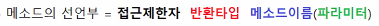
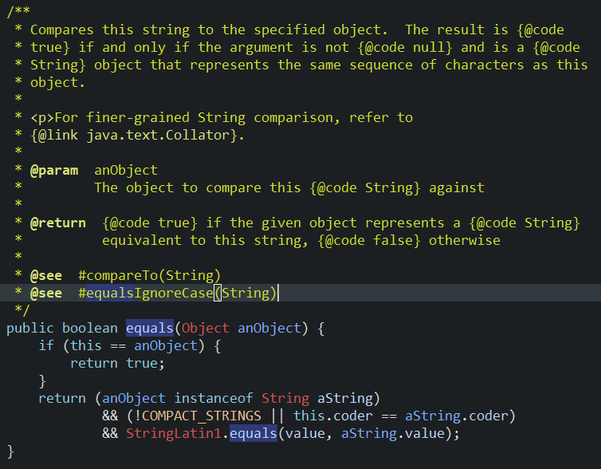
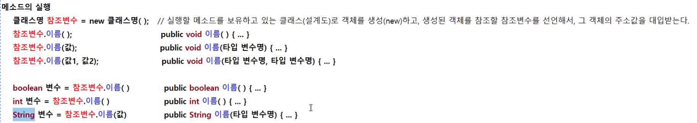
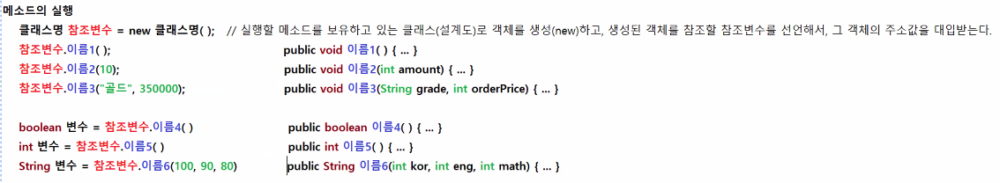
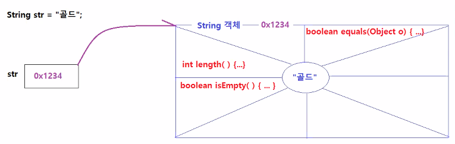
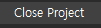
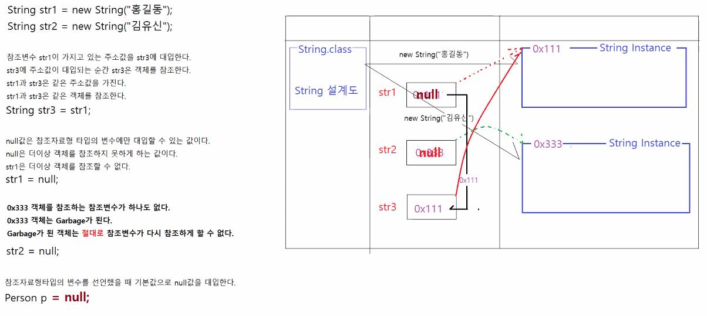

# 3/10

- [3/10](#310)
  - [1 ~ 2교시](#1--2교시)
  - [메소드](#메소드)
  - [메소드 선언부의 구성요소](#메소드-선언부의-구성요소)
    - [java.lang.String.equals()](#javalangstringequals)
  - [메소드의 실행](#메소드의-실행)
    - [Scanner 클래스에 정의된 메소드 실행하기](#scanner-클래스에-정의된-메소드-실행하기)
    - [String 클래스에 정의된 메소드 실행하기](#string-클래스에-정의된-메소드-실행하기)
    - [app5.java에서의 equals](#app5java에서의-equals)
  - [3 ~ 4교시](#3--4교시)
    - [java-array 프로젝트 생성](#java-array-프로젝트-생성)
  - [배열](#배열)
    - [변수, 배열의 선언과 메모리 구조](#변수-배열의-선언과-메모리-구조)
  - [null](#null)
    - [null의 용도](#null의-용도)
    - [Garbage, Garbage Collector](#garbage-garbage-collector)
    - [property](#property)
  - [5 ~ 6교시](#5--6교시)
  - [배열 실습](#배열-실습)
    - [ArrayApp1.java](#arrayapp1java)
    - [ArrayApp2.java](#arrayapp2java)
    - [ArrayApp3.java](#arrayapp3java)
  - [7교시](#7교시)
    - [ArrayApp4.java](#arrayapp4java)
  - [8교시](#8교시)
  - [자바에서 배열을 사용하지 않는 이유](#자바에서-배열을-사용하지-않는-이유)
    - [콜렉션 프레임워크](#콜렉션-프레임워크)
    - [자료구조](#자료구조)
    - [ArrayApp5.java](#arrayapp5java)
  - [강의후 실습](#강의후-실습)
    - [ArrayApp4_1.java](#arrayapp4_1java)

<small><i><a href='http://ecotrust-canada.github.io/markdown-toc/'>Table of contents generated with markdown-toc</a></i></small>


## 1 ~ 2교시
## 메소드
* 이름이 있는 코드블록이다.
* 메소드는 선언부와 구현부로 구성된다.
* 
* 메소드의 구현부는 여는괄호와 닫는 해당블록내에 수행문을 포함할 수 있다. 수행문이 하나도 없어도 상관없다.
* 객체가 가지고 있는 메소드를 사용할 때는 메소드의 선언부를 확인해보면 사용법을 파악할 수 있다.
> http://www.tcpschool.com/java/java_methodConstructor_method

## 메소드 선언부의 구성요소
* 접근제한자
  * 메소드의 공개범위를 지정한다. 
  * **public**, protected, default, **private**가 있다.
    * public : 전체 공개
    * private : 비공개
* 반환타입
  * 메소드 구현부의 실행이 완료되면 획득하게 되는 데이터의 타입을 지정한다.
  * 메소드가 반환하는 값이 없으면 반환타입은 **void**다. 그 외는 전부 메소드 실행 후 반환타입에서 지정한 타입의 값을 반환한다.
* 메소드 이름
  * 다른 메소드와 구별되는 이름이다.
  * 메소드를 실행할 때는 메소드의 이름으로 그 메소드를 실행한다.
* 파라미터(매개변수, 타입 + 이름)
  * 메소드를 실행하기 위해서 필요한 값의 정보를 정의한다.
  * 파라미터는 없을 수도 있고, 여러 개 있을 수도 있다. 
  * 각각의 파라미터는 매개변수타입 매개변수명으로 구성된다.
    * 메소드이름(매개변수타입 매개변수명, 매개변수타입 매개변수명, ..)

### java.lang.String.equals()
* String을 ctrl+좌클릭한 후 검색하여 equals()메서드를 살펴보자.

* 특정 객체와 문자열을 비교한다. 같을 경우(순서까지) true.

## 메소드의 실행
* 메소드의 선언부만 알면 이미 구현된 메소드의 구현부를 몰라도 실행할 수 있다.


```java
객체 참조변수 = new 클래스명(); // 실행할 메소드를 보유하고 있는 클래스(설계도)로 객체를 생성(new)하고, 생성된 객체를 참조할 참조변수를 선언해서, 그 객체의 주소값을 대입받는다.

참조변수.이름();              
public void 이름(){ ... }

참조변수.이름(값);            
public void 이름(타입 변수명){ ... }

참조변수.이름(값1, 값2);      
public void 이름(타입 변수명, 타입 변수명){ ... }

boolean 변수 = 참조변수.이름()        
public boolean 이름() { ... }

int 변수 = 참조변수.이름()
public int 이름() { ... }

String 변수 = 참조변수.이름(값)
public String 이름(타입 변수명) { ... }
```


### Scanner 클래스에 정의된 메소드 실행하기
```java
public class Scanner {
    // 키보드 입력을 읽어서 문자열을 반환한다.
    public String next() { ... }
    public int nextInt() { ... }
    public long nextLong() { ... }
    public double nextDouble() { ... }

}
```
1. 객체생성 
   * `Scanner sc = new Scanner(System.in);`
2. 메소드 실행
    ```java
    System.out.println("이름을 입력하세요: ");
    String name = sc.next(); // Scanner 클래스에 정의된 메소드 중에서 문자열을 획득할 수 있는 메소드를 선택해서 실행하였음.

    System.out.println("구매수량을 입력하세요");
    int quantity = sc.nextInt(); // Scanner 클래스에 정의된 메소드 중에서 정수를 획득할 수 있는 메소드를 선택해서 실행하였음.
    ```
### String 클래스에 정의된 메소드 실행하기
```java
public class String {
    // 문자열의 길이를 반환한다.
    public int length() { ... }
    // 문자열에 지정된 텍스트가 포함되어 있는지 여부를 반환한다. 
    public boolean contains(String text) { ... }
    // 문자열이 빈 문자열인지 여부를 반환한다.
    public boolean isEmpty() { ... }
    // 문자열과 지정된 텍스트가 서로 내용이 동일한지 여부를 반환한다.
    public boolean equals(Objext text) { ... }
    // 문자열에서 지정된 시작위치부터 문자열의 끝에 해당하는 문자열과 동일한 문자열을 반환한다.
    public String substring(int beginIndex) { ... }
    // 문자열에서 지정된 구간에 해당하는 문자열과 동일한 문자열을 반환한다.
    public String substring(int beginIndex, int endIndex) { ... }
}
```
```java
String S = "안전한 본인 확인을 위해 키보드 보안 프로그램을 설치해주세요";   // String s = new String("안전한 본인 확인을 위해 키보드 보안 프로그램을 설치해주세요");
s.length(); // 33
s.contains("보안"); // true 
s.equals("dddd"); // false
```
* 

```java
// 참조변수 str이 참조하고 있는  String객체의 문자열을화면에 출력시킨다.
System.out.println(str);
// 참조변수 str이 참조하고 있는 String객체는 빈 문자열인지 여부를 반환하는 메소드 실행
boolean a = str.isEmpty();
System.out.println(a); // false
// 참조변수 str이 참조하고 있는 String 객체의 문자열과 전달받은 문자열의 내용이 같은지 여부를 반환한다.
boolean b = str.equals("실버");
System.out.println(b); // false
```

### app5.java에서의 equals
* 지난 시간에 switch문에서 if문으로 바꿨을때 원하는 결과가 나오지 않았다.
* 그 이유는 ==는 문자를 비교하는 것이 아닌 참조하는 주소값을 비교하기 때문이다. 같은 문자가 여러 개 객체영역에 저장되어 있을 경우 다른 주소값을 가리키게 되고 결국 값이 같지 않다고  false라는 결과가 나온 것이다.
* 따라서 java에서는 equals()라는 메서드를 이용해 문자열을 비교해야 한다.

## 3 ~ 4교시
### java-array 프로젝트 생성
* 모듈생성 체크해제
* java-basic 프로젝트는 우클릭 > close project
  * 
  * 프로젝트 유효성 검사, 에러 검사 등에서 잡히지 않는다. (사용하지 않을 경우 close project)
## 배열
* 배열은 같은 타입의 값을 여러 개 저장하고 하나의 변수명으로 모두 관리하기 위해 사용한다.
* 형식
  * `데이터타입[] 변수명 = new 데이터타입[]{값, 값, 값, 값, ...};`
  * 값마다 0번부터 번호가 지정되고 인덱스라고 하고 이 인덱스로 해당 값에 접근할 수 있다.
* 자바의 배열
  * 일정한 크기를 가진다
  * 한 번 정해진 크기를 바꿀 수 없다.
  * 동일한 타입의 값만을 저장할 수 있다.
* 빈 배열의 정의
  ```java
  int[] arr = new int[5];
  ```
* 사실 자바의 경우 배열의 기능이 다른 언어에 비해 부족하여 배열 대신 **Collection 프레임워크**를 거의 항상 사용한다.


### 변수, 배열의 선언과 메모리 구조
```java
//값 하나 다루기
자료형 변수명 = 값;

//객체하나 다루기
클래스 참조변수명 = new 클래스();

//같은 타입의 값 여러 개 다루기 - 배열을 생성한다.(콜렉션을 생성한다.)
자료형[] 참조변수명 = new 자료형[크기];

// 같은 종류의 객체 여러 개 다루기 - 배열을 생성한다. (콜렉션을 생성한다.)
클래스명[] 참조변수명 = new 클래스명[크기];

// 서로 다른 타입의 값 여러 개 다루기 - 클래스를 정의하고, 객체를 생성한다.
클래스명 참조변수명 = new 클래스명();
Book book = new Book();          // 책변호(int), 저자(String), 출판사(String), 가격(int), 할인율(double), 재고량(int), 출판일(Date), ...
Employee emp = new Employee();   // 사원번호(int), 이름(String), 소속부서번호(int), 직위(String), 입사일(Date), 연봉(long), ...
```

## null

* 널은 참조변수가 객체를 참조하지 못하게 하는 값 
* 모든 참조변수에는 null이라는 값을 넣을 수 있다.(null, 주소값 2개만 넣을 수 있다.)
* 참조변수에는 처음에 생성시 null값이 들어있다.
* 자바에서는 주소값이라고 안하고 레퍼런스(참조값)이라고 한다.

### null의 용도
1. 참조변수가 가지고 있는 주소값을 잃어버리게 만든다.
2. 처음 생성시 null값이 들어 있다.

### Garbage, Garbage Collector
* Garbage는 아무도 참조하고 있지 않는 객체를 의미한다.
* jvm 에는 가비지콜렉터라는 기능이 있다.
* Garbage가 된 객체는 **절대로** 참조변수가 다시 참조하게 할 수 없다.
* 배열도 객체이기 때문에 null값이 입력되어 Garbage가 되면 절대로 JVM의 Garbage Collecter에 의해 메모리에서 제거되어 다시 참조할 수 없게 된다.

### property
* property : 일종의 객체안에 있는 변수
  * 배열의 값이 저장되어 있는 객체에 length와 같은 property가 저장되어 있다


## 5 ~ 6교시
## 배열 실습
### ArrayApp1.java
* 배열 생성
* 저장소 값 저장
* 배열에 저장된 값 사용
```java

public class ArrayApp1 {

	public static void main(String[] args) {
		
		// 배열 생성하기
		// 자료형[] 참조변수명 = new 자료형[크기];
		
		// int[] numbers -> int[](정수값을 여러 개 저장하는 배열객체 타입)의 주소값을 담는 참조변수 numbers를 생성한다.
		// new int[3] -> int[3](정수값 3개를 저장할 수 있는) 배열객체를 하나 생성한다.
		//		      -> 정수 3개 담는 저장소가 생성되고 각 저장소에는 정수 0이 기본값으로 저장되어 있고,
		//            -> 각 저장소는 0번부터 순서대로 인덱스번호가 부여된다.
		// int[] numbers = new int[3] -> 정수 3개 저장할 수 있는 배열객체를 생성하고, 그 배열객체의 주소값을 numbers 참조변수에 대입한다.
		int[] numbers = new int[3];
		
		// 배열객체의 각 저장소에 값 저장하기
		// 참조변수[인덱스번호] = 값;
		numbers[0] = 100;
		numbers[1] = 300;
		numbers[2] = 150;
		
		// 배열 객체의 각 저장소에 저장된 값 사용하기(다른 변수에 대입하기, 연산에 사용하기, 출력하기 등)
		// 자료형 변수 = 참조변수[인덱스번호];
		// 참조변수[인덱스번호] + 참조변수[인덱스번호] + 참조변수[인덱스번호];
		// 참조변수[인덱스번호] > 100
		// System.out.println(참조변수[인덱스번호]);
		
		// 배열객체의 0번째, 1번째, 2번째에 저장된 값을 각각 변수 x, y, z에 대입하기
		int x = numbers[0];
		int y = numbers[1];
		int z = numbers[2];

		// 배열객체의 0번째, 1번째, 2번째에 저장된 값을 출력하기
		System.out.println(numbers[0] + ", " + numbers[1] + ", " + numbers[2]);
		System.out.println(x + ", " + y + ", "+ z);
		
		// 배열객체의 0번째, 1번째, 2번째에 저장된 값을 더해서 합계를 구하기
		int total1 = numbers[0] + numbers[1] + numbers[2];
		int total2  = x + y + z;
		System.out.println("합계 : " + total1);
		System.out.println("합계 : " + total2);
		
	}
}

```
### ArrayApp2.java
* 배열과 for문, 향상된-for문
```java

public class ArrayApp2 {

	public static void main(String[] args) {
		
		int[] arr1 = new int[3];
		double[] arr2 = new double[3];
		String[] arr3 = new String[3];
		
		// 배열의 0번째부터 2번째까지 저장된 값 출력하기
		System.out.println(arr1[0]);
		System.out.println(arr1[1]);
		System.out.println(arr1[2]);
		
		// for문을 사용해서 배열의 0번째부터 2번째까지 저장된 값 출력하기
		for (int i = 0; i < 3; i++) {
			System.out.println(arr2[i]);
		}
		
		// 향상된-for문을 사용해서 배열에 저장된 값을 처음부터 끝까지 출력하기
		// 향상된-for문은 배열, 콜렉션에 대해서만 사용할 수 있다.
		for (String value : arr3) {
			System.out.println(value);
		}
	}
}

```
```
0
0
0
0.0
0.0
0.0
null
null
null
```
* 출력결과 
  * 정수형은 0
  * 실수형은 0.0
  * String은 null
  * 이라는 값을 담고 있다. (선언 후 값 저장 x)
### ArrayApp3.java
* 배열의 길이, 마지막번째 값, (for문, 향상된-for문으로)배열의 모든 값 출력
* 주로 향상된-for문을 사용한다.
* 사용하지 않을 값은 애초에 넣지 않는다.
```java

public class ArrayApp3 {

	public static void main(String[] args) {

		// 지정된 값 혹은 객체가 미리 저장되어 있는 배열객체 생성하기
		int[] arr1 = { 100, 30, 60, 50, 90 };
		double[] arr2 = { 0.1, 0.3, 0.25, 0.15 };
		String[] arr3 = { "김유신", "이순신", "강감찬", "류관순", "안중근" };

		// 각 배열의 0번째 값 출력해보기
		System.out.println(arr1[0]);
		System.out.println(arr2[0]);
		System.out.println(arr3[0]);
		System.out.println();

		// 각 배열의 길이를 출력해보기
		System.out.println(arr1.length);
		System.out.println(arr2.length);
		System.out.println(arr3.length);
		System.out.println();

		// 각 배열의 마지막번째 값 출력하기
		System.out.println(arr1[arr1.length - 1]);
		System.out.println(arr2[arr2.length - 1]);
		System.out.println(arr3[arr3.length - 1]);
		System.out.println();

		// 각 배열의 모든 값 출력하기 (for문)
		for (int i = 0; i < arr1.length; i++) {
			System.out.println(arr1[i]);
		}
		System.out.println();
		for (int i = 0; i < arr2.length; i++) {
			System.out.println(arr2[i]);
		}
		System.out.println();
		for (int i = 0; i < arr3.length; i++) {
			System.out.println(arr3[i]);
		}
		System.out.println();

		// 각 배열의 모든 값 출력하기 (향상된-for문)
		// 우향에는 배열을 참조하는 참조변수, 좌향에는 배열의 각 저장소에 저장된 값 하나를 담을 수 있는 변수를 선언한다.
		// 향상된-for문은 배열의 n번째 값을 value에 대입하고, for문 블록의 수행문을 실행한다. (n은 0부터 시작)
		for (int score : arr1) {
			System.out.println(score);
		}
		System.out.println();
		for (double commissionPct : arr2) {
			System.out.println(commissionPct);
		}
		System.out.println();
		for (String name : arr3) {
			System.out.println(name);
		}
		System.out.println();

	}
}

```

## 7교시
### ArrayApp4.java
```java

public class ArrayApp4 {

	public static void main(String[] args) {

		// 1. 학생이름, 국어점수, 영어점수, 수학점수를 각각 저장하는 배열을 생성하기
		String[] names = { "김유신", "강감찬", "류관순", "이순신" };
		int[] korScores = { 100, 70, 80, 100 };
		int[] engScores = { 70, 60, 90, 70 };
		int[] mathScores = { 80, 60, 80, 100 };

		// 총점, 평균 배열
		int[] total = new int[names.length];
		int[] average = new int[names.length];
		for (int i = 0; i < names.length; i++) {
			total[i] = korScores[i] + engScores[i] + mathScores[i];
			average[i] = total[i] / names.length;
		}

		// 2. 김유신 학생의 이름, 국어점수, 영어점수, 수학점수, 총점, 평균을 출력하기
		for (int i = 0; i < names.length; i++) {
			if (names[i].equals("김유신")) {
				System.out.println("학생이름: " + names[i] + ", 국어점수: " + korScores[i] + "점, 영어점수: " + engScores[i]
						+ "점, 수학점수: " + mathScores[i] + "점, 총점: " + total[i] + "점, 평균: " + average[i] + "점");
			}
		}

		// 3. 류관순 학생의 이름, 국어점수, 영어점수, 수학점수, 총점, 평균을 출력하기
		for (int i = 0; i < names.length; i++) {
			if (names[i].equals("류관순")) {
				System.out.println("학생이름: " + names[i] + ", 국어점수: " + korScores[i] + "점, 영어점수: " + engScores[i]
						+ "점, 수학점수: " + mathScores[i] + "점, 총점: " + total[i] + "점, 평균: " + average[i] + "점");
			}
		}

		// 4. 모든 학생의 국어점수 평균, 영어점수 평균, 수학점수 평균을 출력하기 : 향상된-for문을 사용하세요. 3번
		int korSum = 0;
		for (int korScore : korScores) {
			korSum += korScore;
		}
		double korAvg = (double) korSum / korScores.length;
		System.out.println("국어점수 총점: " + korSum + "점, 국어점수 평균: " + korAvg + "점");

		int engSum = 0;
		for (int engScore : engScores) {
			engSum += engScore;
		}
		double engAvg = (double) engSum / engScores.length;
		System.out.println("영어점수 총점: " + engSum + "점, 영어점수 평균: " + engAvg + "점");

		int mathSum = 0;
		for (int mathScore : mathScores) {
			mathSum += mathScore;
		}
		double mathAvg = (double) mathSum / mathScores.length;
		System.out.println("수학점수 총점: " + mathSum + "점, 수학점수 평균 : " + mathAvg + "점");

		// 5. 국어점수 평균보다 국어점수가 낮은 학생의 이름, 국어점수를 출력하기 : 일반 for문을 사용하세요.
		for (int i = 0; i < korScores.length; i++) {
			if (korAvg > korScores[i]) {
				System.out.println("국어점수 평균(" + korAvg + "점) 보다 낮은 학생: " + names[i] + "(" + korScores[i] + "점)");
			}
		}
//		for (int i = 0; i < engScores.length; i++) {
//			if (engAvg > engScores[i]) {
//				System.out.println("영어점수 평균(" + engAvg + "점) 보다 낮은 학생: " + names[i] + "(" + engScores[i] + "점)");
//			}
//		}
//		for (int i = 0; i < mathScores.length; i++) {
//			if (mathAvg > mathScores[i]) {
//				System.out.println("수학점수 평균(" + mathAvg + "점) 보다 낮은 학생: " + names[i] + "(" + mathScores[i] + "점)");
//			}
//		}

		// 6. 영어점수 평균보다 영어점수가 높은 학생의 이름, 영어점수를 출력하기 : 일반 for문을 사용하세요.
//		for (int i = 0; i < korScores.length; i++) {
//			if (korAvg < korScores[i]) {
//				System.out.println("국어점수 평균(" + korAvg + "점) 보다 높은 학생: " + names[i] + "(" + korScores[i] + "점)");
//			}
//		}
		for (int i = 0; i < engScores.length; i++) {
			if (engAvg < engScores[i]) {
				System.out.println("영어점수 평균(" + engAvg + "점) 보다 높은 학생: " + names[i] + "(" + engScores[i] + "점)");
			}
		}
//		for (int i = 0; i < mathScores.length; i++) {
//			if (mathAvg < mathScores[i]) {
//				System.out.println("수학점수 평균(" + mathAvg + "점) 보다 높은 학생: " + names[i] + "(" + mathScores[i] + "점)");
//			}
//		}

	}
}

```

## 8교시
## 자바에서 배열을 사용하지 않는 이유
* 자바스크립트의 배열
  * 데이터를 저장할때마다 크기가 변한다.
* 자바의 배열
  * 처음 만든 크기를 바꿀 수 없다. -> 비효율적, 불편
  * 따라서 배열은 거의 쓰지 않는다.
    * 하지만 일부 메서드에서 반환값이 배열인 경우에 사용할 수 있다.
  * 자바에서는 콜렉션 프레임워크(특별한 아이디어 혹은 특별한 개발방법을 지칭)을 배열 대신 사용한다.
### 콜렉션 프레임워크
* 자료구조를 자바로 구현한 것이다.
### 자료구조
* 데이터 저장/검색/조회/삭제 기능을 제공하는 구현체
* List, LinkedList, Set, Stack, Queue, Tree, Map
  * 각기 사용목적이 다르다
  * 일반적인 업무로직에서는 List를 압도적으로 많이 쓰고 Set, Map을 가끔 쓴다.

- **List**
  * 저장한 순서대로 다시 꺼낼 수 있다.
- LinkedList
  * 자료의 중간부분에 데이터를 저장/삭제 속도가 매우 빠르다.
- Set
  * 중복을 허용하지 않는다.
- Stack
  * 후입선출(LIFO: Last In First Out)
- Queue
  * 선입선출(FIFI: First In First Out)
- Tree
  * 데이터가 정렬된 상태로 저장된다.
- Map
* 데이터가 name:value의 쌍으로 저장된다.

### ArrayApp5.java
```java
import java.util.Scanner;

public class ArrayApp5 {

	public static void main(String[] args) {
		
		// 숫자를 여러개 입력받아서 그 중에서 가장 큰 수를 출력하는 프로그램
		Scanner sc = new Scanner(System.in);
		int[] numbers = new int[100];
		int position = 0;
		
		// 사용자로부터 숫자를 입력받는다.
		for (int i = 0; i < numbers.length; i++) {
			System.out.println("숫자를 입력하세요(-1을 입력하면 입력을 끝냅니다.): ");
			int num = sc.nextInt();
			if (num == -1) {
				position = i;
				break;
			}
			numbers[i] = num;			
		}
		
		// 사용자가 입력한 값 출력하기
		System.out.println("-------사용자가 입력한 숫자 출력하기-------");
		for (int i = 0; i < position; i++) {
			System.out.print(numbers[i] + " ");
		}
		System.out.println();
		
		// 가장 큰 숫자 찾기
		System.out.println("-------가장 큰 숫자 찾기-------");
		int max = 0;
		for (int i = 0; i < position; i++) {
			if (max < numbers[i]) { // max에 저장된 값보다 배열의 n번째 값이 더 큰 경우 max에 저장된 값을 바꾸기 위해서 if문 사용
				max = numbers[i];
			}
		}
		System.out.println(max);
		
		
		sc.close();
		
	}
}

```

## 강의후 실습
### ArrayApp4_1.java
* ArrayApp4 복습
```java

public class ArrayApp4_1 {

	public static void main(String[] args) {

		// 1. 학생이름, 국어점수, 영어점수, 수학점수를 각각 저장하는 배열을 생성하기
		String[] names = { "김유신", "강감찬", "류관순", "이순신" };
		int[] korScores = { 100, 70, 80, 100 };
		int[] engScores = { 70, 60, 90, 70 };
		int[] mathScores = { 80, 60, 80, 100 };

		int[] totalScores = new int[names.length];
		double[] averageScores = new double[names.length];
		for (int i = 0; i < averageScores.length; i++) {
			totalScores[i] = korScores[i] + engScores[i] + mathScores[i];
			averageScores[i] = (double) totalScores[i] / 3;
		}
		// 2. 김유신 학생의 이름, 국어점수, 영어점수, 수학점수, 총점, 평균을 출력하기
		for (int i = 0; i < averageScores.length; i++) {
			if (names[i].equals("김유신")) {
				System.out.println("학생이름: " + names[i]);
				System.out.println("국어점수: " + korScores[i]);
				System.out.println("영어점수: " + engScores[i]);
				System.out.println("수학점수: " + mathScores[i]);
				System.out.println("총   점: " + totalScores[i]);
				System.out.println("평   균: " + averageScores[i]);
			}
		}
		System.out.println();

		// 3. 류관순 학생의 이름, 국어점수, 영어점수, 수학점수, 총점, 평균을 출력하기
		for (int i = 0; i < averageScores.length; i++) {
			if (names[i].equals("류관순")) {
				System.out.println("학생이름: " + names[i]);
				System.out.println("국어점수: " + korScores[i]);
				System.out.println("영어점수: " + engScores[i]);
				System.out.println("수학점수: " + mathScores[i]);
				System.out.println("총   점: " + totalScores[i]);
				System.out.println("평   균: " + averageScores[i]);
			}
		}
		System.out.println();

		// 4. 모든 학생의 국어점수 평균, 영어점수 평균, 수학점수 평균을 출력하기 : 향상된-for문을 사용하세요. 3번
		int korSum = 0;
		for (int korScore : korScores) {
			korSum += korScore;
		}
		double korAverage = (double) korSum / korScores.length;
		System.out.println("국어점수 평균: " + korAverage);

		int engSum = 0;
		for (int engScore : engScores) {
			engSum += engScore;
		}
		double engAverage = (double) engSum / engScores.length;
		System.out.println("영어점수 평균: " + engAverage);

		int mathSum = 0;
		for (int mathScore : mathScores) {
			mathSum += mathScore;
		}
		double mathAverage = (double) mathSum / mathScores.length;
		System.out.println("수학점수 평균: " + mathAverage);
		System.out.println();

		// 5. 국어점수 평균보다 국어점수가 낮은 학생의 이름, 국어점수를 출력하기 : 일반 for문을 사용하세요.
		for (int i = 0; i < korScores.length; i++) {
			if (korAverage > korScores[i]) {
				System.out.println(names[i] + " 국어점수: " + korScores[i] + "점");
			}
		}
		System.out.println();

		// 6. 영어점수 평균보다 영어점수가 높은 학생의 이름, 영어점수를 출력하기 : 일반 for문을 사용하세요.
		for (int i = 0; i < engScores.length; i++) {
			if (engAverage < engScores[i]) {
				System.out.println(names[i] + " 영어점수: " + engScores[i] + "점");
			}
		}
		

	}
}

```