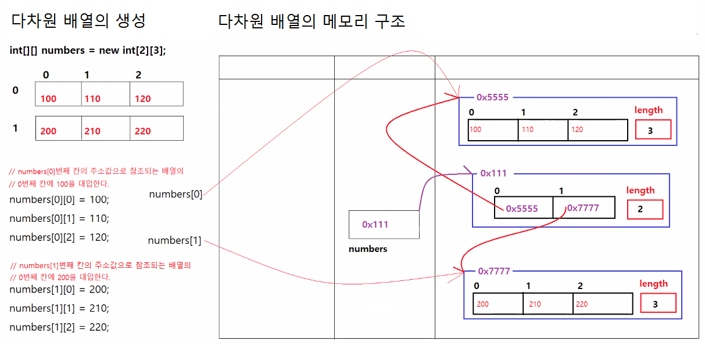

# 3/11

- [3/11](#311)
	- [1 ~ 2교시](#1--2교시)
	- [다차원배열](#다차원배열)
		- [ArrayApp6](#arrayapp6)
		- [ArrayApp6의 메모리 구조](#arrayapp6의-메모리-구조)
			- [자바의 리터럴](#자바의-리터럴)
		- [ArrayApp7](#arrayapp7)
	- [3교시](#3교시)
	- [객체지향프로그래밍 OOP](#객체지향프로그래밍-oop)
		- [OOP의 장점](#oop의-장점)
			- [1. 재사용성](#1-재사용성)
			- [2. 관리 용이](#2-관리-용이)
			- [3. 신뢰성](#3-신뢰성)
		- [OOP의 특징](#oop의-특징)
			- [1. 캡슐화(Encapsulation)](#1-캡슐화encapsulation)
			- [2. 상속(Inheritance)](#2-상속inheritance)
			- [3. 다형성(Polymorphism)](#3-다형성polymorphism)
	- [4교시](#4교시)
	- [객체](#객체)
		- [객체 간의 관계](#객체-간의-관계)
	- [객체와 클래스](#객체와-클래스)
		- [클래스](#클래스)
	- [OOP 개발 단계](#oop-개발-단계)
		- [클래스의 설계](#클래스의-설계)
		- [객체의 생성과 참조형 변수](#객체의-생성과-참조형-변수)
		- [ScoreApp.java](#scoreappjava)
		- [ScoreApp 메모리 구조](#scoreapp-메모리-구조)
	- [5 ~ 8 교시](#5--8-교시)
	- [클래스](#클래스-1)
	- [클래스의 구성요소](#클래스의-구성요소)
		- [1. 필드](#1-필드)
		- [app2](#app2)
			- [Student.java](#studentjava)
			- [StudentApp.java](#studentappjava)
			- [StudentApp 메모리 구조](#studentapp-메모리-구조)
			- [java.lang.object](#javalangobject)
			- [debug모드로 변수 값 저장 여부 확인하기](#debug모드로-변수-값-저장-여부-확인하기)
		- [Book.java](#bookjava)
		- [BookApp.java](#bookappjava)
			- [BookApp의 메모리 구조](#bookapp의-메모리-구조)
			- [웹브라우저에서 데이터 조회시 데이터 전달 과정](#웹브라우저에서-데이터-조회시-데이터-전달-과정)

<small><i><a href='http://ecotrust-canada.github.io/markdown-toc/'>Table of contents generated with markdown-toc</a></i></small>


## 1 ~ 2교시
## 다차원배열
* 구글 차트 라이브러리 사용시 필요
* > https://developers.google.com/chart

### ArrayApp6
```java

public class ArrayApp6 {

	public static void main(String[] args) {

		/*
		 * 다차원배열 자료형[][] 참조변수 = new 자료형[길이][길이]; 자료형[][][] 참조변수 = new 자료형[길이][길이][길이];
		 * (4, 5, ... 차원 다 가능)
		 * 
		 * 자료형[][] 참조변수 = {{값, 값, 값, 값}, {값, 값, 값, 값}};
		 * 
		 * + 다차원배열에서 첫번째 배열의 길이는 반드시 정의해야 하지만, 그 외의 배열길이는 배열 생성할 때 결정하지 않아도 된다.
		 */

		
		// 2행3열의 2차원 배열을 생성하기
		int[][] numbers = new int[2][3];
		// 2행3열의 2차원배열을 생성하고, 배열의 인덱스를 이용해서 배열의 각 칸에 값을 대입하기
		numbers[0][0] = 100;
		numbers[0][1] = 100;
		numbers[0][2] = 100;
		numbers[1][0] = 100;
		numbers[1][1] = 100;
		numbers[1][2] = 100;

		// 2행3열의 2차원 배열 생성하기
		// 배열 리터럴을 이용해서 2행3열의 배열을 생성하기
		int[][] numbers2 = { { 300, 310, 320 }, { 400, 410, 420 } };

		// 2행3열의 2차원 배열 생성하기
		// 2차원 배열을 생성할 때 행의 크기만 결정하고 열의 크기를 지정하지않고 배열을 생성하기
		int[][] numbers3 = new int[2][3];
		// 행배열(row array)의 0번째 칸에 열배열(column array)을 생성해서 연결시키기
		numbers3[0] = new int[] { 500, 510, 520 };
		// 행배열(row array)의 1번째 칸에 열배열(column array)을 생성해서 연결시키기
		numbers3[1] = new int[] { 600, 610, 620 };

		// 2행n열의 2차원배열 생성하기 (각 행의 배열의 크기가 달라도 된다.)
		// 배열 리터럴을 이용해서 컬럼의 길이가 서로 다른 2차원 배열을 생ㅅ어하기
		int[][] numbers4 = { { 700, 710, 720 }, { 800, 820, 820, 830, 840, 850, 860 } };

		// 2행n열의 2차원배열 생성하기
		// 2차원 배열을 생성할 때 행의 크기만 결졍하고 열의 크기를 지정하지않고 배열을 생성하기
		int[][] numbers5 = new int[2][];
		// 행배열(row array)의 0번째 칸에 열배열(column array)을 생성해서 연결시키기
		numbers5[0] = new int[] { 900, 910 };
		// 행배열(row array)의 1번째 칸에 열배열(column array)을 생성해서 연결시키기
		numbers5[1] = new int[] { 1000, 1010, 1020, 1030, 1040, 1050 };

	}
}

```

### ArrayApp6의 메모리 구조
* 다차원배열 메모리 구조
* 실제로 메모리에서 생성된 모습은 바둑판처럼 생기지는 않는다.


#### 자바의 리터럴
```java
int a = 1;
```
* 1과 같이 변하지 않는 데이터(boolean, char, double, long, int, etc...)를 리터럴(literal)이라고 부른다.
* 해당 클래스는 한번 생성하면 객체 안의 데이터가 변하지 않는다. 변할 상황이면 새로운 객체를 만들어준다.

> 출처: https://mommoo.tistory.com/14 [개발자로 홀로 서기]

### ArrayApp7
* 다차원 배열의 값 사용하기
* 중첩for문, 향상된-for문을 사용하여 다차원 배열 출력
```java

public class ArrayApp7 {

	public static void main(String[] args) {

		/*
		 * 다차원 배열의 값 사용하기
		 */

		int[][] numbers1 = { { 10, 20, 30 }, { 40, 50, 60 } };
		/*
		 *				   				    --> { [ 10, 20, 30 ] , length=3 }
		 *								    |
		 *	    numbers1[ 0x1111 ] ---> { [ 0x5555, 0x7777 ], length=2 }
		 *										    |
		 *										    --> { [ 40, 50, 60 ], length=3 }  		
		 */
		
		for (int x = 0; x < numbers1.length; x++) {
			for (int y = 0; y < numbers1[x].length; y++) {
				int number = numbers1[x][y];
				System.out.println("[" + x + "][" + y + "] " + number);
			}
		}
		System.out.println();
		
		int[][] numbers2 = { { 100, 200, 300 }, { 400, 500, 600, 700, 800, 900, 1000 } };
		/*
		 *				   				    --> { [ 100, 200, 300 ] , length=3 }
		 *								    |
		 *	    numbers2[ 0x2222 ] ---> { [ 0x6666, 0x8888 ], length=2 }
		 *										    |
		 *										    --> { [ 400, 500, 600, 700, 800, 900, 1000 ], length=7 }  
		 */
		for (int x = 0; x < numbers2.length; x++) {
			for (int y = 0; y < numbers2[x].length; y++) {
				int number = numbers2[x][y];
				System.out.println("[" + x + "][" + y + "] " + number);
			}
		}
		System.out.println();
		
		String[][] names = { { "김유신", "강감찬", "이순신" }, { "류관순", "안중근", "이봉창", "안창호", "김구", "윤봉길" } };
		// names는 배열을 2개 가지고 있는 배열이다.
		// arr에는 names의 첫번째 배열이 대입되고, 안쪽 for문이 한번 실행된다.
		// arr에는 names의 두번째 배열이 대입되고, 안쪽 for문이 한번 실행된다.
		for (String[] arr : names) {
			// arr은 문자열을 여러 개 가지고 있는 배열이다.
			// arr이 names의 0번째 배열일 때 name에는 김유신, 강감찬, 이순신이 순서대로 대입되고, name에 저장된 값이 출력된다.
			// arr이 names의 1번째 배열일 때 name에는 류관순, 안중군, 이봉창, 안창호, 김구, 윤봉길이 순서대로 대입되고, name에 저장된 값이 출력된다.
			for (String name : arr) {
				System.out.println(name);
			}
		}
		
	}
}

```

## 3교시
## 객체지향프로그래밍 OOP
> https://github.com/eungsu/documents/blob/master/01-java/07-oop-01-%EA%B0%9D%EC%B2%B4%EC%A7%80%ED%96%A5%ED%94%84%EB%A1%9C%EA%B7%B8%EB%9E%98%EB%B0%8D.md
* 부품에 해당하는 객체들을 만들고, 그 객체를 조립해서 소프트웨어를 만드는 개발방식이다.
  * 부품에 해당하는 객체 : Instance, Object, Bean
* 객체를 생성하기 위한 설계도가 필요
  * 설계도 : class
  * a라는 class를 b가 사용할 수 있다.
* 완성품 객체를 모델링하고, 집합관계에 있는 부품객체와 사용관계에 있는 객체들을 하나씩 설계 후 조립하는 방식으로 프로그램을 개발한다.

### OOP의 장점
####  1. 재사용성
* 새 코드 작성 시 기존의 코드를 이용해서 쉽게 작성 가능(상속)
#### 2. 관리 용이
* 코드간의 관계"를 이용해 쉽게 코드 변경 가능(조립, 디자인패턴)
#### 3. 신뢰성
* 접근제한자와 메소드를 이용해 데이터를 보호하고 올바른 값 유지(캡슐화)
* 코드의 중복을 제거해 코드 불일치로 인한 오동작 방지(중복제거, 리팩토링)

### OOP의 특징
#### 1. 캡슐화(Encapsulation)
* **다른 객체는 객체의 내부구조를 알 수 없고, 공개된 속성과 기능만을 이용 가능**하다.
* **잘못된 사용으로 인한 객체의 손상을 방지**한다.
* 자바는 **접근제한자를 사용해서 공개할 것인지, 숨길 것인 결정**할 수 있다.

#### 2. 상속(Inheritance)
* 상속은 새로운 클래스(하위클래스)가 기존 클래스(상위클래스)의 필드와 메소드를 이용할 수 있게 하는 것이다.
* 상위클래스를 재사용하기 때문에 하위클래스를 빠르게 개발할 수 있다.
* 상위클래스를 상속받아서 다양한 프로그램의 요구에 대응할 수 있는 하위클래스를 개발할 수 있다.
* 상위클래스와 하위클래스는 **종속관계를 형성함으로서 클래스들을 조직화**할 수 있다.

* 고양이를 사람타입에 담을 수 없다.
* 사자, 호랑이, 고양이는 포유류라는 공통적인 타입에 담을 수 있다.

#### 3. 다형성(Polymorphism)
* 같은 종류의 객체지만, 실행결과가 다양한 객체를 이용할 수 있는 성질이다.
* 사용하는 방법은 동일하지만, **실제 사용하는 객체가 바뀌면 실행결과가 다르게 발현되는 것**이다.
* 사례
  * 컴퓨터의 출력기능 사용하기
    * 흑백프린터를 사용중 : 흑백인쇄물 출력
    * 컬러프린터를 사용중 : 컬러인쇄물 출력
  * 스마트폰의 노래듣기 기능 사용하기
    * 이어폰 사용중 : 나만 노래를 듣는다.
    * 스피커 사용중 : 같은 공간의 모든 사람들이 노래를 듣는다.
* 인쇄물을 출력하는 방법은 동일하지만, 사용중인 프린터(객체)에 따라서 결과가 다르게 나타난다. 이것이 다형성이다.
* 노래를 듣는 방법을 동일하지만, 실제 사용하는 장치에 따라서 결과가 다르게 나타난다. 이것이 다형성이다.


## 4교시
## 객체
* 물리적으로 존재하거나 추상적으로 생각할 수 있는 것이며, 다른 것과 식별가능한 것이다.
  * 물리적으로 존재하는 것
    * 자동차, TV, 책, 상품 등
  * 추상적으로 존재하는 것
    * 개설과정, 계좌, 주문 등
* 객체는 자신의 고유한 **속성**을 **기능**을 가지고 있다.
  * 속성 : *자신만의 고유한* 특징(객체가 가지고 있는 정보), 같은 기능을 가진 객체라도 속성은 다르다.
  * 자동차
    * 속성 : 제조사, 모델명, 가격, 최고속도
    * 기능 : 출발기능, 정지기능, 운전기능
  * 주문
    * 속성 : 주문번호, 고객명, 주문날짜, 주문상태
    * 기능 : 조회하기, 취소하기, 반품하기
* 소프트웨어에서 객체는 각각 독립적으로 존재하며, 객체의 메소드를 통해서 상호작용한다.
* 객체는 클래스의 인스턴스(실제로 메모리상에 할당되는 것)다.
### 객체 간의 관계
* 객체는 개별적으로 사용할 수 있지만, 대부분 다른 객체와 관계를 맺고 있다.
* **집합관계**(포함관계)
  * 객체가 다른 객체의 부품으로 사용되는 관계다.
* **사용관계**(의존관계)
  * 객체간의 사용작용을 의미하며, 객체가 다른 객체의 메소드를 호출해서 원하는 작업을 수행한다.
* **상속관계**
  * 상위(부모)객체를 기반으로 하위(자식)객체를 생성하는 관계다.
  * 상위객체는 종류(자동차류, 스마트폰류)를 의마하며, 하위객체는 구체적인 사물(제네시스, 산타페, 투산, iphone11, iphoneSE)에 해당한다.


## 객체와 클래스
### 클래스
* 객체는 설계도를 바탕으로 만들어진다.
* 자바에서 객체에 대한 **설계도**가 **클래스(class)**다.
* 클래스는 객체를 생성하기 위한 **필드**와 **메소드**로 구성되어 있다.
* 클래스로부터 만들어진 객체를 해당 클래스의 인스턴스(Instance)라고 한다.
* 클래스로부터 객체를 생성하는 과정을 **클래스의 인스턴스화**라고 한다.


## OOP 개발 단계
1. 클래스 설계
2. 클래스로 객체 생성
3. 생성된 객체의 속성과 기능 이용하기
### 클래스의 설계
* 클래스이름은 대문자로 시작한다.
```java
public class 클래스이름 {

}
```
```java
public class Car{

}
public class Book{

}
public class Order{
    
}
```

### 객체의 생성과 참조형 변수
* new 연산자를 사용하면 클래스로부터 객체를 생성할 수 있다.
  ```java
  new 클래스명();
  ```
* 객체는 메모리의 힙(Heap)영역에 만들어진다.
* new 연산자는 메모리의 힙영역에 객체를 생성한 후, 메모리 내에서 객체의 위치를 알 수 있도록 객체의 주소값(메모리에서 객체가 위치하고 있는 주소)를 반환한다.
* new 연산자가 반환하는 주소값을 저장하기 위한 참조변수가 필요하다.
  ```java
  // 객체 생성하기
  클래스명 참조변수;
  참조변수 = new 클래스명();

  // 참조변수 선언, 객체 생성
  Car myCar;
  myCar = new Car();

  Book book1;
  book1 = new Book();
  Book book2 = null;
  book2 = new Book();

  // 참조변수 선언 및 객체 생성
  클래스명 참조변수 = new 클래스명();
  
  Car yourCar = new Car();
  Book book3 = new Book();
  ```
* 참조변수는 생성된 객체의 주소값을 저장하는 변수다.
* 참조변수의 타입은 해당 객체를 생성할 때 사용했던 클래스이름이다.
* 주소값이 저장된 참조변수는 힙영역에 생성된 객체를 참조하게 된다.

### ScoreApp.java
* new project 'java-oop-1'
* new package 'App1'
* new class 'Score.java'
    ```java
    package app1;

    public class Score {

    }

    ```
* new class 'ScoreApp.java'
    ```java
    package app1;

    public class ScoreApp {

        public static void main(String[] args) {
            
            // Score 클래스로 객체 생성하기
            
            // Score 객체를 생성함. 생성된 객체의 참조값을 참조변수에 저장하지 않았기 때문에 이 객체는 사용할 수 없다.
    //		new Score();
            
            // Score 객체의 참조값을 저장하는 참조변수를 생성함
            // new 연산자 다음에 생성자메소드(클래스이름과 동일한 이름을 갖는 특별한 메소드)를 지정하면 객체가 생성된다.
            // 생성된 객체의 참조값이 참조변수 s1에 대입된다.
            // 참조변수 s1의 생성된 객체를 참조한다. (생성된 객체와 연결된다.)
            // 생성된 객체의 모든 공개된 속성과 모든 공개된 기능을 반드시 참조변수를 통해서만 사용이 가능하다.
            Score s1 = new Score();
            Score s2 = new Score();
            Score s3 = new Score();
            
            // 참조변수를 표준출력장치로 출력하면 "패키지명.클래스명@해시코드"가 출력된다.
            // 서로 다른 객체는 해시코드값도 서로 다르다. 해시코드는 같은 객체인지 확인할 때 사용된다.
            System.out.println(s1);
            System.out.println(s2);
            System.out.println(s3);
        }
    }
    ```
    
  * 참조변수를 표준출력장치로 출력하면 "패키지명.클래스명@해시코드"가 출력된다.
  * 서로 다른 객체는 해시코드값도 서로 다르다. 해시코드는 같은 객체인지 확인할 때 사용된다.

### ScoreApp 메모리 구조
* 객체 생성시 메모리 구조
* Score 클래스로 객체를 생성한다.

* 참조변수 값에 null값을 넣게되면 객체 영역과의 연결(참조)이 끊어지게 된다.
* 이때 JVM의 Garbage Collector가 해당 객체를 청소를 담당한다.
* 언제 청소하는지 정확히 알 수 없다. 메모리가 부족할 때 또는 한가할 때 한다.(게으르다)
* 가비지 컬렉터를 사용자가 원하는대로 튜닝하는 방법도 있다.

## 5 ~ 8 교시
## 클래스


## 클래스의 구성요소
### 1. 필드
* 객체의 **고유 데이터**, **현재 상태정보**, **부품객체**를 저장하는 곳
* 객체의 고유한 속성(다른 객체와 구분지을 수 있는 특징)을 나타낸다.
* 변수와 비슷한 형태로 정의
* 필드는 해당 데이터타입의 기본값으로 초기화된다.
* 필드는 생성자와 메소드 전체에서 사용가능
* 객체 소멸되지 않는 한 객체와 함께 유지된다.

### app2
#### Student.java
```java
package app2;

/**
 * 학생정보를 저장할 객체를 생성할 때 사용되는 클래스다.
 * @author qufstar7
 */

public class Student {
	
	// 학생객체의 고유한 속성을 담당하는 필드를 정의하기
	int no;
	int grade;
	String name;
	String department;
	String email;
	String tel;
	
}	
```
* 필드를 정의하는 것은 변수만드는 것과 유사하지만 main메소드안에 만들지 않는다.
* 여태까지 만들었던 변수들은 main메소드안에서 선언한 변수였다.(지역변수)
* 지역변수 : 메소드 안에서 선언한 변수
  * 그 메소드 안에서만 사용가능
  * 다른 메소드에서 사용 불가능
  * 메소드의 실행이 종료되면 즉시 사라짐.
  * 변수가 자동으로 초기화되지 않기 떄문에 반드시 초기화 한 후에 사용해야 함.
* 클래스를 만들고 해당 클래스에 대한 설명을 주석과 같이 입력할 수 있다.
    ```java
    /**
    * 학생정보를 저장할 객체를 생성할 때 사용되는 클래스다.
    * @author qufstar7
    */
    ```
#### StudentApp.java
* Student 클래스로 객체를 생성하고 stud1, stud2에 대입
* int와 같은 기본자료형은 Student 객체에 저장되고 String과 같은 참조자료형은 생성된 String객체에 저장되고 Student객체에서 참조한다.
```java
package app2;

public class StudentApp {

	public static void main(String[] args) {
		
		Student stud1 = new Student();
		Student stud2 = new Student();
		
		System.out.println("--- stud1 Student객체 생성, 생성된 객체의 필드값 출력 ---");
		System.out.println(stud1.no);
		System.out.println(stud1.name);
		System.out.println(stud1.grade);
		System.out.println(stud1.department);
		System.out.println(stud1.email);
		System.out.println(stud1.tel);
		System.out.println();

		// stud1참조변수가 참조하는 Student객체의 필드에 값 대입하기
		stud1.no = 100;
		stud1.name = "홍길동";
		stud1.grade = 3;
		stud1.department = "컴퓨터공학과";
		stud1.email = "hong@gmail.com";
		stud1.tel = "010-1234-5678";
		
		// stud2참조변수가 참조하는 Student객체의 필드에 값 대입하기
		stud2.no = 200;
		stud2.name = "김유신";
		stud2.grade = 1;
		stud2.department = "국어국문학과";
		stud2.email = "kim@gmail.com";
		stud2.tel = "010-9876-5432";
		
		System.out.println("--- stud1 Student객체 생성, 생성된 객체의 필드값 출력 ---");
		System.out.println(stud1.no);
		System.out.println(stud1.name);
		System.out.println(stud1.grade);
		System.out.println(stud1.department);
		System.out.println(stud1.email);
		System.out.println(stud1.tel);
		System.out.println();
		
	}
}
```
#### StudentApp 메모리 구조
* 객체 생성 및 참조변수에 대입시 메모리 구조


#### java.lang.object
* stud1 참조변수가 참조하는 Student객체의 필드에 값을 대입하기 위해 커서를 올려놓고 추천 메소드를 확인해보면
* 그림과 같이 Student객체와 Object객체 메소드들이 나온다.

* Object클래스는 java.base.lang.Object의 경로에 위치해있다.
* '배열을 포함한 모든 객체들은 Object클래스ㅢ 메소드들을 구현할 수 있다.'

#### debug모드로 변수 값 저장 여부 확인하기


### Book.java
* Book 클래스 생성
  * 변수명과 그게 자료형만 잘 정해서 만들면 된다.
```java
package app2;

public class Book {

	// 책번호, 제목, 저자, 출판사, 가격, 할인가격, 재고수량, 판매여부, 절판여부를 저장하는 필드 정의하기
	int no;
	String title;
	String author;
	String publisher;
	int price;
	int discountPrice;
	int stock;
	boolean onSell;
	boolean unPublished;
}

```
### BookApp.java
* books[]배열에 book1, book2를 대입하고(주소값이 저장됨)
```java
package app2;

public class BookApp {

	public static void main(String[] args) {

		// book객체를 여러개 가지고 있을 수 있는 배열 books가 그 주소값을 가지고 있다.
		Book[] books = new Book[2];

		Book book1 = new Book();
		book1.no = 100;
		book1.title = "자바의 정석";
		book1.author = "남궁성";
		book1.publisher = "도우출판사";
		book1.price = 35000;
		book1.discountPrice = 32000;
		book1.stock = 5;
		book1.onSell = true;
		book1.unPublished = false;

		Book book2 = new Book();
		book2.no = 200;
		book2.title = "혼자 공부하는 자바";
		book2.author = "신용권";
		book2.publisher = "한빛미디어";
		book2.price = 32000;
		book2.discountPrice = 29000;
		book2.stock = 10;
		book2.onSell = true;
		book2.unPublished = false;

		books[0] = book1;
		books[1] = book2;

		for (Book book : books) {
			System.out.println(book.title);
		}
	}
}
```
#### BookApp의 메모리 구조

* `Book book1 = new Book();`과 같은 객체생성, 참조변수에 대입하는 코드를 쭉 나열하며 작성하는 것은 실제로는 필요없다.
* book1, book2는 books배열에 주소값이 참조된 순간 필요없어진다.
* 자바에서 위와 같이 객체를 생성해서 값을 저장하는 선형적 구조를 만들 수 있으므로 2차원 배열과 같은 데이터 저장구조는 필요없다.
  * 자바는 데이터타입이 엄격한 언어이므로 배열에 같은 데이터타입만 담을 수 있다.
* 반면 자바스크립트는 배열에서 같은 데이터 타입이 아니더라도 다양하게 저장할 수 있으므로 배열, 2차원배열 등이 사용된다.
* 향상된-for문을 통해 book들의 정보를 books로부터 주소값을 받아 사용할 수 있다.

#### 웹브라우저에서 데이터 조회시 데이터 전달 과정

1. '웹브라우저'가 베스트셀러 조회를 '웹브라우저의 요청 처리 담당'에게 요청한다.
2. '웹브라우저의 요청 처리 담당'이 베스트셀러 조회를 '데이터베이스 엑세스 담당'에 요청한다.
3. '데이터베이스'로부터 books객체정보를 받아서 다시 '데이터베이스 엑세스 담당'에 준다.
   * books에는 각 book의 정보를 담고 있는 객체들의 주소값이 들어있다.
4. books참조변수의 주소값을 '웹브라우저의 요청 처리 담당'에게 전달한다.
5. '화면표현담당'은 주소값을 받아서 '웹브라우저'에게 전달한다.

* 객체를 잘 다룰 수 있으면 다음 2가지만 알면 웹 서비스를 구현가능하다고 할 수 있다.
  1. 데이터베이스에 접근하는 방법
  2. 웹브라우저 화면에 보이게 하는 방법