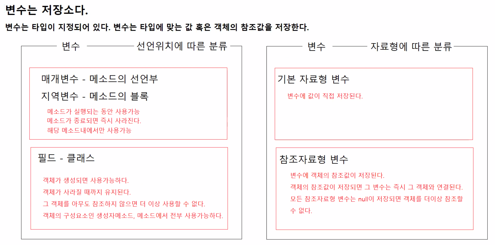
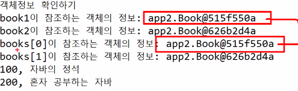
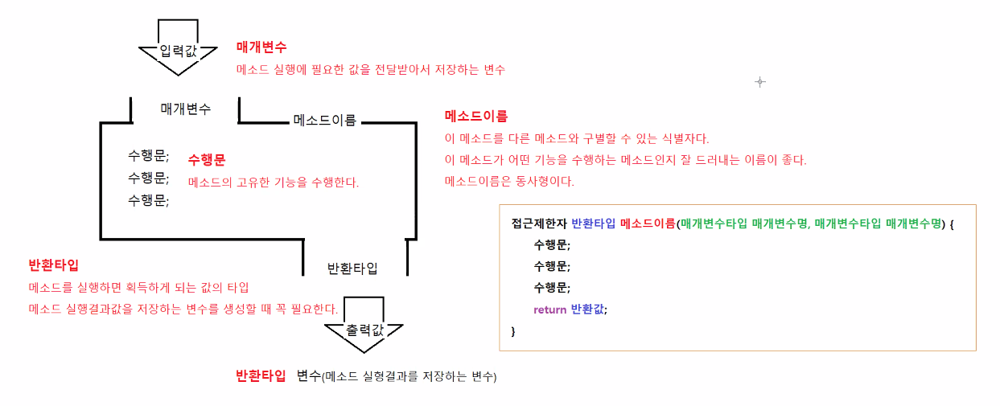
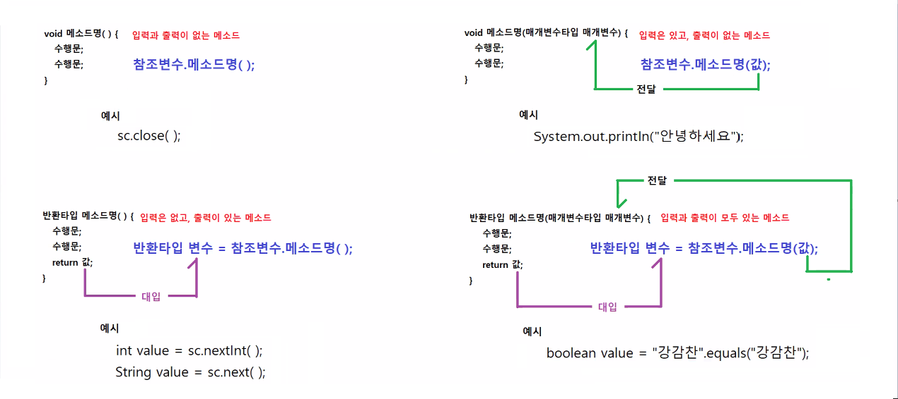
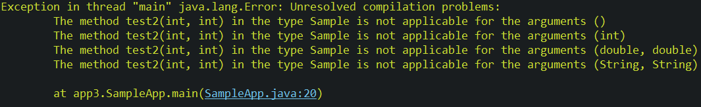
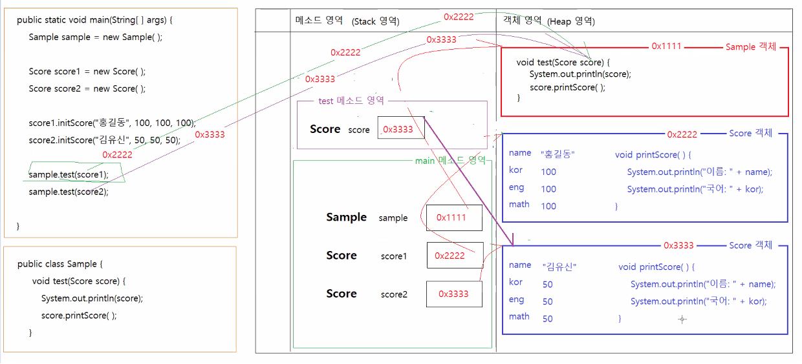
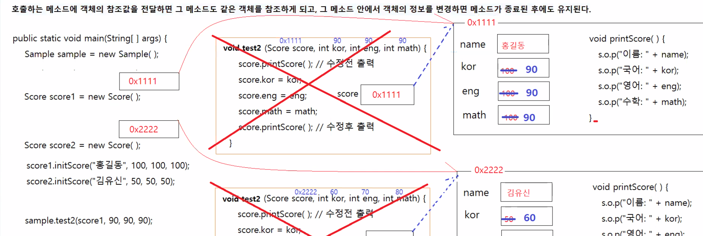
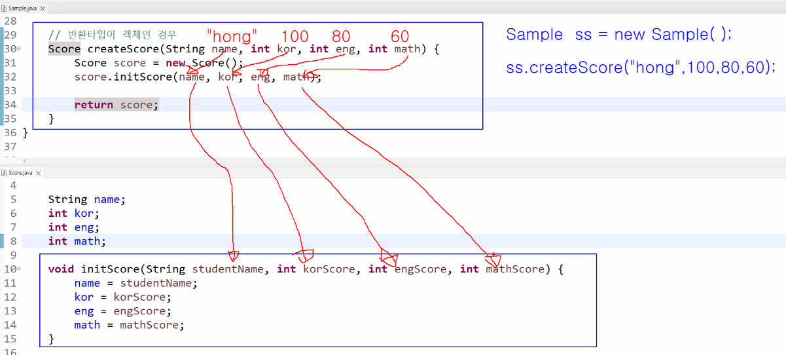

# 3/14

- [3/14](#314)
  - [1 ~ 2교시](#1--2교시)
  - [변수의 분류](#변수의-분류)
  - [클래스와 클래스의 관계](#클래스와-클래스의-관계)
  - [클래스 실습](#클래스-실습)
    - [BookApp.java](#bookappjava)
    - [StudentScore.java](#studentscorejava)
    - [StudentScoreApp.java](#studentscoreappjava)
  - [3~4교시](#34교시)
  - [메소드](#메소드)
    - [메소드의 호출방법](#메소드의-호출방법)
    - [메소드의 매개변수](#메소드의-매개변수)
    - [Sample.java](#samplejava)
    - [SampleApp.java](#sampleappjava)
    - [회원관리기능이 구현된 클래스](#회원관리기능이-구현된-클래스)
  - [5~6교시](#56교시)
  - [메소드와 변수](#메소드와-변수)
    - [Account.java](#accountjava)
    - [AccountApp.java](#accountappjava)
  - [메소드의 반환타입과 반환값](#메소드의-반환타입과-반환값)
    - [Score.java](#scorejava)
  - [7~8교시](#78교시)
  - [참조자료형을 매개변수로 받는 메소드](#참조자료형을-매개변수로-받는-메소드)
    - [Sample.java](#samplejava-1)
    - [SampleApp.java](#sampleappjava-1)
      - [Sample.java 메모리 구조](#samplejava-메모리-구조)
  - [메소드를 이용해 객체 수정하기.](#메소드를-이용해-객체-수정하기)
    - [SampleApp.java](#sampleappjava-2)
    - [SampleApp2.java](#sampleapp2java)
      - [SampleApp2.java 메모리구조](#sampleapp2java-메모리구조)
  - [반환타입이 객체인 경우](#반환타입이-객체인-경우)
    - [Sample.java](#samplejava-2)
    - [SampleApp3.java](#sampleapp3java)
  - [객체지향](#객체지향)
    - [메시지(message)](#메시지message)
    - [메세지의 의미](#메세지의-의미)
    - [전송객체](#전송객체)
  - [수신객체](#수신객체)
    - [디자인 패턴](#디자인-패턴)

<small><i><a href='http://ecotrust-canada.github.io/markdown-toc/'>Table of contents generated with markdown-toc</a></i></small>


## 1 ~ 2교시
## 변수의 분류


## 클래스와 클래스의 관계
* has a 관계
  * 포함관계
    * Car has a Tire
    * Car has a Engine
* is a 관계
  * 상속관계, 구현관계
    * galaxy is a SmartPhone
    * Iphone is a SmartPhone

## 클래스 실습
* 클래스는 객체를 생성하기 위한 설계도
* 클래스의 구성요소인 필드, 생성자, 메서드를 이해한다.
* 클래스를 작성하고 생성된 객체의 원하는 정보를 사용(표준출력장치로 출력해보기)할 수 있다.
### BookApp.java
* 지난 시간 만들어봤던 BookApp을 활용한다.
* 배열객체에 객체정보담고 출력하기.
* 객체정보를 확인해 같은 객체의 정보를 담고 있는지를 확인해보자.
```java
package app2;

public class BookApp {

	public static void main(String[] args) {

		// Book객체를 여러개 가지고 있을 수 있는 배열 books가 그 주소값을 가지고 있다.
		//  new Book[2] : Book객체를 참조하는 참조값을 2개 저장할 수 있는 배열을 생성한다.
		//  Book[] books : Book 설계도로 만들어진 Book객체를 여러개 저장하는 배열객체의 참조값을 저장하는 변수를 생성한다.
		Book[] books = new Book[2];
		
		// 첫번째 책정보 저장하는 객체를 생성하고, 책정보를 필드에 대입함.
		Book book1 = new Book();
		book1.no = 100;
		book1.title = "자바의 정석";
		book1.author = "남궁성";
		book1.publisher = "도우출판사";
		book1.price = 35000;
		book1.discountPrice = 32000;
		book1.stock = 5;
		book1.onSell = true;
		book1.unPublished = false;

		Book book2 = new Book();
		book2.no = 200;
		book2.title = "혼자 공부하는 자바";
		book2.author = "신용권";
		book2.publisher = "한빛미디어";
		book2.price = 32000;
		book2.discountPrice = 29000;
		book2.stock = 10;
		book2.onSell = true;
		book2.unPublished = false;

		// 첫번째 책정보 객체의 참조값을 배열의 0번째 칸에 대입함.
		books[0] = book1;		
		// 두번째 책정보 객체의 참조값을 배열의 1번째 칸에 대입함.
		books[1] = book2;

		System.out.println("객체정보 확인하기");
		System.out.println("book1이 참조하는 객체의 정보 : " + book1);
		System.out.println("book2이 참조하는 객체의 정보 : " + book2);
		System.out.println("book[0]이 참조하는 객체의 정보 : " + books[0]);
		System.out.println("book[1]이 참조하는 객체의 정보 : " + books[1]);
		
		for (Book book : books) {
			System.out.println(book.no + ", " + book.title);
		}
	}
}

```
* 같은 정보를 담고 있는 것을 확인할 수 있다.


### StudentScore.java
* 학생의 이름, 국어점수, 영어점수, 수학점수를 저장하기 위한 클래스
```java
package app2;

public class StudentScore {

	String name;
	int kor;
	int eng;
	int math;
	int total = kor + eng + math;
	int average = total / 3;
}

```

### StudentScoreApp.java
* 5명의 이름, 시험성적을 입력받아 각 점수와 총점, 평균을 출력해보자.
```java
package app2;

public class StudentScoreApp {

	public static void main(String[] args) {

		// 이번 시험에 5명의 학생이 시험에 응시했다.
		// 학생 각각의 점수를 저장하는 StudentScore객체를 생성하고, 객체의 필드에 학생이름, 성적을 저장한다.
		// 5명 학생의 시험점수를 하나의 이름으로 관리하기 위해서 StudentScore를 여러개 저장하는 배열객체를 생성한다.
		// 배열객체에 순서대로 학생객체의 참조값을 저장한다.
		// 배열객체에 저장된 모든 학생의 이름, 국어점수, 영어점수, 총점, 평균점수를 출력하시오.

		StudentScore stud1 = new StudentScore();
		stud1.name = "고희동";
		stud1.kor = 00;
		stud1.eng = 00;
		stud1.math = 00;

		StudentScore stud2 = new StudentScore();
		stud2.name = "또치";
		stud2.kor = 40;
		stud2.eng = 60;
		stud2.math = 30;

		StudentScore stud3 = new StudentScore();
		stud3.name = "마이콜";
		stud3.kor = 90;
		stud3.eng = 80;
		stud3.math = 70;

		StudentScore stud4 = new StudentScore();
		stud4.name = "둘리";
		stud4.kor = 10;
		stud4.eng = 10;
		stud4.math = 10;

		StudentScore stud5 = new StudentScore();
		stud5.name = "고길동";
		stud5.kor = 90;
		stud5.eng = 90;
		stud5.math = 90;

		// 'new StudentScore[5]'는 StudentScore객체 5개를 생성한 것이 아니다.
		// 'new StudentScore[5]'는 StudentScore객체의 참조값 5개를 저장할 수 있는 저장소를 가진 배열객체를 생성한다.
		// 'StudentScore[] scoreArr'는 new StudentScore객체의 참조값을 여러 개 저정하는 배열객체의 참조값을 저장하는
		// 참조변수 생성
		StudentScore[] scoreArr = new StudentScore[6];
		scoreArr[0] = stud1;
		scoreArr[1] = stud2;
		scoreArr[2] = stud3;
		scoreArr[3] = stud4;
		scoreArr[4] = stud5;

		for (StudentScore s : scoreArr) {
			System.out.println("이   름: " + s.name);
			System.out.println("국어점수: " + s.kor);
			System.out.println("영어점수: " + s.eng);
			System.out.println("수학점수: " + s.math);
			System.out.println("총   점: " + (s.kor + s.eng + s.math));
			System.out.println("평   균: " + (s.kor + s.eng + s.math) / 3);
			System.out.println();
		}
	}
}

```
* 필드에 총점과 평균을 저장해서(`stud1.total = ...;`) 출력해도 되지만 효율적이지 않다.

## 3~4교시
## 메소드
클래스의 구성요소인 메소드에 대해 더 자세히 알아본다.

* 메소드는 이름있는 코드 블록이다.(ex) main method)
* 메소드는 기능을 담당한다. (수행문이 포함되어 있다.)
* 메소드는 선언부와 구현부로 구성된다.
  ```java
  선언부 {
      구현부
  }
  접근제한자 반환타입 메소드이름(타입 매개변수명, 타입매개변수명, ... ) {
    수행문;
    수행문;
    return 반환값;
  }
  ```


### 메소드의 호출방법
1. 입력과 출력이 없는 메소드
2. 입력은 있고 출력이 없는 메소드
3. 입력은 없고 출력이 있는 메소드
4. 입력과 출력이 모두 있는 메소드


### 메소드의 매개변수
* 메소드가 작업을 수행하기 위해 필요한 입력값을 저장하기 위한 변수.
* 0개 이상 저장 가능
* 기본자료형, 참조자료형 두 타입 모두 가능
* 메소드를 호출하려면 반드시 매개변수에 맞게 인자값을 전달해야 한다.
* 매개변수의 유형
  * 기본자료형 타입의 매개변수  
  * 참조자료형 타입의 매개변수
    * 매개변수에는 지정된 타입의 객체나 배열을 참조할 수 있는 주소값을 입력으로 요구한다.
    * 매개변수에 지정된 타입의 객체에 대한 주소값 대신 null값이 입력값으로 전달되어도 상관없다.
    * 단) 매개변수에 null이 전달될 수도 있는 경우에는 매개변수에 저장된 값이 null인지, 실제 주소값인지를 꼭 확인해야 한다.

### Sample.java
```java
package app3;

public class Sample {

	// 입력값 없음, 반환값 없음
	public void test1() {
		System.out.println("test1 메소드가 실행됨");
	}

	// 입력값 있음, 반환값 없음
	public void test2(int x, int y) {
		System.out.println("test2 메소드가 실행됨");
		System.out.println("x에 전달된 값: " + x);
		System.out.println("y에 전달된 값: " + y);
	}

	// 입력값 없음, 반환값 있음
	public int test3() {
		System.out.println("test3 메소드가 실행됨");
		return 100;
	}
	
	// 입력값 없음, 반환값 있음
	public long test4() {
		System.out.println("test4 메소드가 실행됨");
		long unixTIme = System.currentTimeMillis();
		return unixTIme;
	}
	
	// 입력값과 반환값이 모두 있음
	// 매개변수의 타입과 반환타입은 아무런 상관관계가 없음
	//		test5는 우연히 타입이 같은 경우
	public int test5(int x, int y) {
		System.out.println("test5 메소드가 실행됨");
		int result = x + y;
		
		return result;
	}

	// 입력값과 반환값이 모두 있음
	// 매개변수의 타입과 반환타입은 아무런 상관관계가 없음
	public double test6(int kor, int eng, int math) {
		int total = kor + eng + math;
		double average = total / 3.0;
		
		return average;
	}
}

```

### SampleApp.java
```java
package app3;

public class SampleApp {

	public static void main(String[] args) {
		// Sample클래스에 정의된 메소드 실행하기
		// 1. 객체 생성하고, 생성된 객체의 참조값을 참조변수에 대입시킨다.
		// 2. 참조변수를 이용해서 생성된 객체의 메소드를 실행한다.
		Sample s = new Sample();

		// 매개변수와 반환타입이 없는 메소드 실행
		s.test1();
		s.test1();
		s.test1();

		// 매개변수가 있고 반환타입이 없는 메소드 실행
		s.test2(100, 200);
		s.test2(-10, 40);
		s.test2(50, 40);
//		s.test2();				 // 인자값이 없다.
//		s.test2(100);			 // 인자값이 부족하다.
//		s.test2(10.9, 3.15);	 // 인자값의 타입이 일치하지 않는다.
//		s.test2("홍길동", "안녕");	 // 인자값의 타입이 일치하지 않는다.

		// 매개변수가 없고, 반환타입이 있는 메소드 실행
		int value1 = s.test3();
		System.out.println("test3 메소드의 반환값: " + value1);
		long value2 = s.test4();
		System.out.println("test4 메소드의 반환값: " + value2);
	
		// 매개변수가 있고, 반환타입이 있는 메소드 실행
		int value4 = s.test5(1, 2);
		System.out.println(value4);
		double value5 = s.test6(10, 50, 70);
		System.out.println(value5);
		
	}
}

```


* 문법오류 수행문에 대한 콘솔값

### 회원관리기능이 구현된 클래스
* 클래스의 기능에 맞게 반환타입과 매개변수를 정할 수 있다.
* 기능 구현 예시
  1. 매개변수 없음, 반환타입 없음
     * 모든 회원정보 삭제하기 기능
       * `public void deleteAll() {...}`
  2. 매개변수 있음, 반환타입 없음
     * 특정 번호에 해당하는 회원정보 삭제하기 기능
       * `public void deleteUserByNo(int no) {...}`
     * 특정 상품을 지정된 회원의 장바구니에 저장하는 기능
       * `public void addCartItem(int userNo, int productNo, int quantity) {...}`
  3. 매개변수 없음, 반환타입 있음
     * 우리 사이트에 가입한 모든 회원의 수를 조회하는 기능
       * `public int getTotalUserCount() {...}`
     * 우리 사이트에 가입한 모든 회원정보를 조회하는 기능
       * `public User[] getAllUser() {...}`
  4. 매개변수 있음, 반환타입 있음
     * 최소가격, 최대가격을 전달받아서 그 가격범위에 속하는 상품정보를 조회하는 기능
       * `public Product[] getProductByPrice(int minPrice, int maxPrice) {...}`
     * 검색조건을 전달받아서 그 조건에 맞는 책정보를 조회하는 기능
       * `public Book[] searchBooks(String searchOption, String keyword) {...}`
     * 사용자 아이디를 전달받아서 사용자정보를 조회하는 기능
       * `public User getUserById(String userId) {...}`
     * 카테고리를 전달받아서 해당 카테고리에 속하는 상품정보를 조회하는 기능
       * `public Product[] getProductsByCategory(String category) {...}`

* **추가, 변경, 삭제**하는 기능은 **반환타입을 없게** 만들고
* **조회**하는 기능은 **반환타입이 있게** 만든다.
* `~를 전달받아서~`, `~의 기준에 맞게~` .. : 매개변수가 필요한 경우.

## 5~6교시
## 메소드와 변수
### Account.java
* package : app3
```java
package app3;

public class Account {

	// 멤버변수, 인스턴스변수, 필드, 프로퍼티
	// 멤버변수: 객체 생성에 참여하는 변수다. 생성된 객체에 포함되는 변수다.
	// 인스턴스변수: 객체를 생성하면 사용할 수 있는 변수다.
	// 멤버변수는 모든 멤버메소드가 사용할 수 있다.
	String name;
	int password;
	long balance;

	// 멤버메소드, 인스턴스메소드
	// 멤버메소드에서는 멤버변수를 사용할 수 있다.

	// 이름, 비밀번호, 초기 잔액을 전달받아서 멤버변수에 저장하는 메소드
	void initAccount(String inputName, int inputPassword, long inputBalance) {
		name = inputName;
		password = inputPassword;
		balance = inputBalance;
	}

	// 계좌번호를 출력하는 메소드
	void printAccountInfo() {
		System.out.println("---계좌정보---");
		System.out.println("예금주: " + name);
		System.out.println("비밀번호: " + password);
		System.out.println("현재잔액: " + balance);
		System.out.println();
	}

	// 입금액을 전달받아서 잔액을 증가시키는 메소드
	void increaseBalance(long amount) {
		balance += amount;
	}

	// 현재 잔액을 조회하는 메소드
	long getCurrentBalance() {
		return balance;
	}

}

```
### AccountApp.java
```java
package app3;

public class AccountApp {

	public static void main(String[] args) {
		
		Account account1 = new Account();
		
		// 계좌정보 출력하기 기능을 실행(호출)하기
		account1.printAccountInfo();
		
		// 계좌정보를 초기화하는 기능을 실행하기
		account1.initAccount("홍길동", 1234, 1000000);
		// 계좌정보 출력하기 기능을 실행(호출)하기
		account1.printAccountInfo();
		
		// 입금 기능을 실행하기
		account1.increaseBalance(10000);
		// 계좌정보 출력하기 기능을 실행(호출)하기
		account1.printAccountInfo();
		
		//현재 잔액을 조회하는 기능을 실행하기
		System.out.println("현재 잔액을 조회합니다: " + account1.getCurrentBalance());
		
	}
}
```

## 메소드의 반환타입과 반환값
* 한 개의 반환값만 return 
* void : 반환값이 존재하지 않는 메소드의 반환타입
* void가 아닌 경우 return 반환값; 필수, 반환값 저장할 변수 필요.
### Score.java
* package : app4
```java
package app4;

public class Score {
	
	String name;
	int kor;
	int eng;
	int math;	

	void initScore(String studentName, int korScore, int engScore, int mathScore) {
		name = studentName;
		kor = korScore;
		eng = engScore;
		math = mathScore;
	}

	int getTotalScore() {
		int totalScore = kor + eng + math;
		return totalScore;
	}

//	int getAverage() {
//		int totalScore = getTotalScore(); 		// 멤버 메소드안에서는 참조변수 없이 같은 객체의 다른 멤버메소드를 실행할 수 있다.
//		int average = totalScore / 3;
//
//		return average;
//	}
//	
//	int getAverage() {
//		int totalScore = getTotalScore()/3;
//		return totalScore/3;					// getTotalScore()가 반환하는 값을 나누기 연산에 바로 사용할 수 있다.
//	}
	
	int getAverage() {
		return getTotalScore()/3;				// getTotalScore()가 반환하는 값을 3으로 나눈 평균값을 변수에 저장하지 않고 바로 반환할 수 있다.
	}

	void printScore() {
		System.out.println("이   름: " + name);
		System.out.println("국어점수: " + kor);
		System.out.println("영어점수: " + eng);
		System.out.println("수학점수: " + math);
		System.out.println("총   점: " + getTotalScore()); 	// 변환값이 있는 메소드는 메소드 실행으로 획득된 값을 바로 사용할 수 있다.
		System.out.println("평   균: " + getAverage()); 		// 변환값이 있는 메소드는 메소드 실행으로 획득된 값을 바로 사용할 수 있다.
		System.out.println();
	}

}

```
* getAverage()함수를 구현하는 방식 3가지가 있다.
    1. 다른 멤버메소드를 실행하여 average변수에 저장후  average return
    2. 다른 멤버메소드가 반환하는 값을 연산에 바로 사용하여 변수에 저장 후 연산하여 return
    3. 다른 멤버메소드가 반환하는 값을 연산에 바로 사용하여 변수에 저장하지 않고 연산값을 바로 return

## 7~8교시
## 참조자료형을 매개변수로 받는 메소드
### Sample.java
```java
package app4;

public class Sample {

	// 매개변수 타입이 참조자료형인 경우
	// test1메소드는 Score타입객체의 참조값을 전달받고 싶어한다.
	void test1(Score score) {
		System.out.println("전달받은 객체의 정보: " + score);
	}
}

```
### SampleApp.java
```java
package app4;

public class SampleApp {

	public static void main(String[] args) {

		Sample sample = new Sample();

		Score score1 = new Score();
		score1.initScore("홍길동", 100, 100, 100);
		Score score2 = new Score();
		score2.initScore("김유신", 50, 50, 50);

		// Sample객체의 test1()메소드에게 score1에 저장된 참조값을 전달하고,
		// test1메소드를 실행한다.
		System.out.println("score1 객체의 정보: " + score1);
		sample.test1(score1);
		
		// Sample객체의 test1()메소드에게 score2에 저장된 참조값을 전달하고,
		// test1메소드를 실행한다.
		System.out.println("score2 객체의 정보: " + score2);
		sample.test1(score2);
	}
}

```
1. sample객체 한개와 score객체 2개(정보 입력)를 생성한다.
2. sample클래스의 test1메소드를 통해 score1, score2에 저장된 참조값을 전달해 객체의 정보를 읽어온다.
 
* 실행결과
```java
score1 객체의 정보: app4.Score@6f2b958e
전달받은 객체의 정보: app4.Score@6f2b958e
score2 객체의 정보: app4.Score@5e91993f
전달받은 객체의 정보: app4.Score@5e91993f
```

#### Sample.java 메모리 구조


* 메소드 실행시점에 실행인자(score1이나 score2냐)에 따라 메소드의 매개변수에 전달되는 값(Score 객체의 주소값)이 달라진다.
* 매개변수가 참조자료형일때 매개변수에는 해당 객체를 가리키는 주소값을 가지고 있다.
  * 이 주소값이 달라지며 여러 객체의 데이터를 가져올 수 있다.

## 메소드를 이용해 객체 수정하기.
### SampleApp.java
* test2코드 추가
* score.App의 printScore()메소드 사용
```java
package app4;

public class Sample {

	// 매개변수 타입이 참조자료형인 경우
	// test1메소드는 Score타입객체의 참조값을 전달받고 싶어한다.
	void test1(Score score) {
		System.out.println("전달받은 객체의 정보: " + score);
		score.printScore();
	}

	// Score객체의 점수를 수정하는 메소드
	void test2(Score score, int kor, int eng, int math) {
		// 전달받은 참조값으로 참조되는 객체의 성적정보를 출력한다.
		System.out.println("수정전 성적");
		score.printScore();

		// 전달받은 참조값으로 참조되는 객체의 필드에 성적정보를 새로 대입한다.
		score.kor = kor;
		score.eng = eng;
		score.math = math;

		// 전달받은 참조값으로 참조되는 객체의 성적정보를 출력한다.
		System.out.println("수정후 성적");
		score.printScore();
	}
}

```
### SampleApp2.java
```java
package app4;

public class SampleApp2 {

	public static void main(String[] args) {

		Sample sample = new Sample();

		Score score1 = new Score();
		score1.initScore("횽길동", 100, 100, 100);
		Score score2 = new Score();
		score2.initScore("김유신", 50, 50, 50);

		System.out.println("성적정보를 수정합니다");
		sample.test2(score1, 90, 90, 90);
		sample.test2(score2, 70, 60, 80);		
		System.out.println("성적정보 수정이 완료되었습니다.");
		
		System.out.println();
		
		score1.printScore();
		score2.printScore();
		
	}
}

```
#### SampleApp2.java 메모리구조

* test2메소드의 실행이 종료되고 나서 score1.printScore()를 통해 값을 출력해보면 수정된 값이 나오는 것을 확인할 수 있다.
* 즉 참조값을 전달한다는 것은 호출하는 메소드도 같은 객체를 다룰 수 있게 해준다는 것이다.

## 반환타입이 객체인 경우
### Sample.java
```java
package app4;

public class Sample {

	// 매개변수 타입이 참조자료형인 경우
	// test1메소드는 Score타입객체의 참조값을 전달받고 싶어한다.
	void test1(Score score) {
		System.out.println("전달받은 객체의 정보: " + score);
		score.printScore();
	}

	// Score객체의 점수를 수정하는 메소드
	// Score타입 객체의 참조값이랑 국어, 영어, 수학점수를 전달받고 싶어한다.
	void test2(Score score, int kor, int eng, int math) {
		// 전달받은 참조값으로 참조되는 객체의 성적정보를 출력한다.
		System.out.println("수정전 성적");
		score.printScore();

		// 전달받은 참조값으로 참조되는 객체의 필드에 성적정보를 새로 대입한다.
		score.kor = kor;
		score.eng = eng;
		score.math = math;

		// 전달받은 참조값으로 참조되는 객체의 성적정보를 출력한다.
		System.out.println("수정후 성적");
		score.printScore();
	}

	// 반환타입이 객체인 경우
	Score createScore(String name, int kor, int eng, int math) {
		Score score = new Score();
		score.initScore(name, kor, eng, math);

		return score;
	}
}
```


### SampleApp3.java
* 반환타입이 기본자료형이 아닌경우 객체의 주소값을 반환받게 된다. (참조자료형의 데이터는 객체가 생성되므로)
```java
package app4;

public class SampleApp3 {

	public static void main(String[] args) {
		Sample sample = new Sample();
		
		Score s1 = sample.createScore("홍길동", 90, 80, 100);
		Score s2 = sample.createScore("이순신", 100, 90, 70);
		Score s3 = sample.createScore("류관순", 80, 100, 90);
		
		System.out.println(s1);
		System.out.println(s2);
		System.out.println(s3);
	}
}

```
* sample클래스의 createScore()메소드를 실행하여 score객체를 반환받았다. (표준출력장치로 확인가능)
* 실행결과
  ```
  app4.Score@6f2b958e
  app4.Score@5e91993f
  app4.Score@1c4af82c
  ```
* s1, s2, s3 참조변수들은 main 메소드에서 생성되었으므로 main 메소드가 종료되야 사라진다.
* 해당 참조변수들이 사라져야 해당 객체들을 참조하는 것이 끝나는 것이므로 객체가 사라진다.
* 따라서 메인메소드가 종료되야 객체가 사라진다.

## 객체지향
* 객체지향이란 객체들의 대화를 의미한다
* 클래스를 기반으로 생성된 객체들은 서로 유기적으로 협업하여 동작한다.(대화한다)
### 메시지(message)
* 이렇게 여러 객체가 존재할때, 객체간의 대화하는 것을 **메시지 보내기** 라고 한다.

### 메세지의 의미
* 메시지는 객체가 상호 작용을 하기 위해서 다른 객체에 접근을 하는 방법을 말하는 것.

### 전송객체
* 전송객체란 하나의 객체가 다른 객체의 메서드를 호출하는 것. 
* 즉, 전송객체는 자신의 처리 동작을 위해서 기능을 포함하고 있는 다른 객체를 호출하여 사용을 하는 것.

## 수신객체
* 전송 객체로 부터 호출되는 객체를 수신 객체.
* 수신객체는 요청한 동작을 처리하고, 이와 관련된 결과값을 반환. 
* 다른 객체를 재호출 하여 전송객체가 될 수도 있다.

### 디자인 패턴
* 객체들간의 대화에서 말을 잘하는 방법