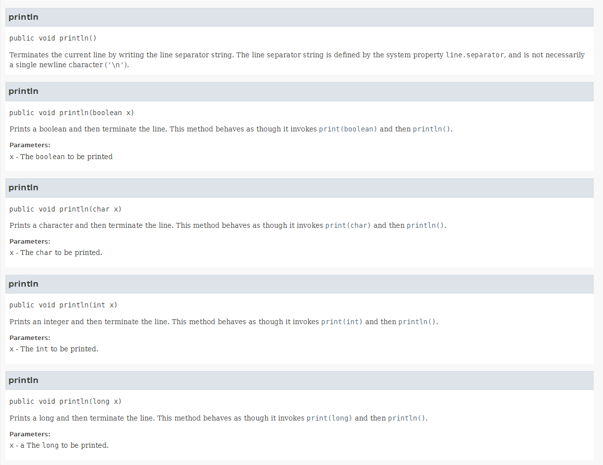
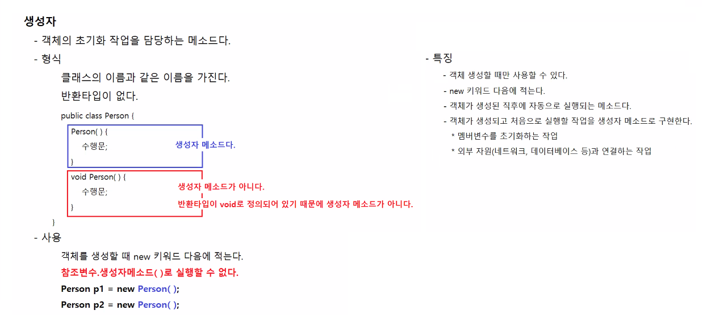
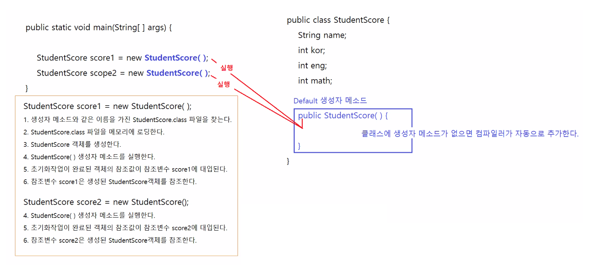
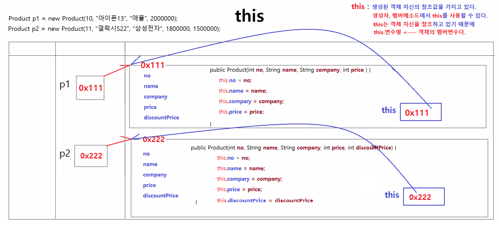
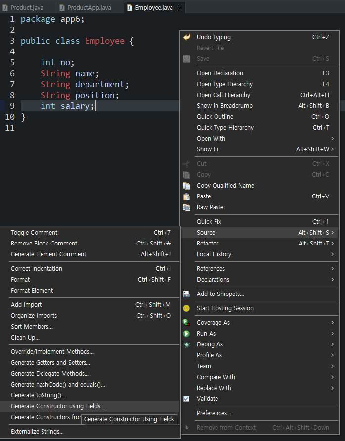
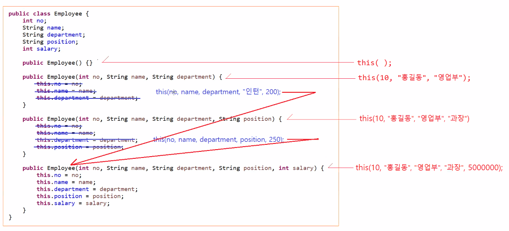
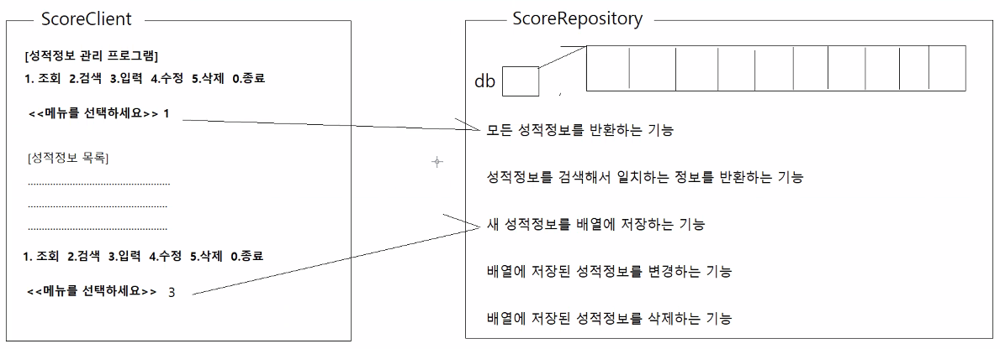

# 3/15

- [3/15](#315)
  - [1교시](#1교시)
  - [메소드 중복정의](#메소드-중복정의)
    - [예시](#예시)
    - [메소드 중복정의의 목적](#메소드-중복정의의-목적)
      - [Sample.java](#samplejava)
      - [SampleApp.java](#sampleappjava)
  - [2~3교시](#23교시)
  - [생성자](#생성자)
    - [생성자 메소드의 형식](#생성자-메소드의-형식)
    - [생성자 메소드의 사용](#생성자-메소드의-사용)
    - [생성자 메소드의 특징](#생성자-메소드의-특징)
    - [자바와 생성자](#자바와-생성자)
      - [Product.java](#productjava)
      - [ProductApp.java](#productappjava)
        - [ProductApp.java 실행결과](#productappjava-실행결과)
  - [4교시](#4교시)
  - [this](#this)
      - [Product.java](#productjava-1)
      - [Employee.java](#employeejava)
    - [lombok 라이브러리](#lombok-라이브러리)
  - [5교시](#5교시)
    - [this메소드의 활용](#this메소드의-활용)
      - [Employee.java](#employeejava-1)
  - [this, this(), super, super()](#this-this-super-super)
  - [6~8교시](#68교시)
  - [실습하기](#실습하기)
    - [성적정보 관리 프로그램](#성적정보-관리-프로그램)
      - [Score.java](#scorejava)
      - [KeyboardReader.java](#keyboardreaderjava)
      - [ScoreRepository.java](#scorerepositoryjava)
      - [ScoreClient.java](#scoreclientjava)
  - [과제1](#과제1)
    - [상품 정보 관리 프로그램](#상품-정보-관리-프로그램)
    - [구현 코드](#구현-코드)
      - [product.java](#productjava-2)
      - [ProductClient.java](#productclientjava)
      - [ProductRepository.java](#productrepositoryjava)
    - [구현 과정](#구현-과정)

<small><i><a href='http://ecotrust-canada.github.io/markdown-toc/'>Table of contents generated with markdown-toc</a></i></small>


## 1교시
## 메소드 중복정의
* 매개변수의 개수나 매개변수의 종류가 서로 다르고 이름이 같은 메소드를 여러개 정의하는게 가능하다.
* 메소드 중복정의는 **하나의 클래스안에 같은 이름의 메소드를 여러 개 정의하는 것**이다.
* 매개변수의 타입이나 갯수가 다르면 중복정의가 가능하다.
  * **우리가 구현하는 프로젝트에는 중복정의를 할 경우가 없다**
    * 회원정보 입력받기, 조회하기, 정보 수정, 정보 삭제.
  * 하지만 우리가 사용하는 라이브러리들은 범용적으로 사용하도록 설계되어 있기 때문에(System, String class) 뭔지는 알고있어야 한다.

### 예시
* `System.out.println()`
  ```java
  System.out.println();
  System.out.println(10);
  System.out.println('A');
  System.out.println(true);
  System.out.println(3.14);
  System.out.println(10000000000000000L);
  System.out.println("홍길동");

  Account acc = new Account();
  System.out.println(acc);
  Score score = new Score();
  System.out.println(score);
  ```
  
  * println()메소드는 매개변수로 void부터 object까지 다양하게 사용가능하게 만들어져 있다.
  * 같은 이름이지만 서로 다른 메소드로 범용성을 올리고 효율적으로 코딩할 수 있게 도와준다.

### 메소드 중복정의의 목적
* 같은 작업을 수행하는 메소드는 일관된 이름, 방식으로 실행하고 싶은 것.
* 더 쉽고 효율적으로 다양한 매개변수에 대해 사용할 수 있다.

#### Sample.java
```java
package app5;

public class Sample {
	
	/*
	 * 메소드 중복정의
	 * - 매개변수의 타입이나 개수만 다르고 같은 작업을 수행하는 메소드는 
	 * 	 사용상의 편의를 위해 같은 이름의 메소드로 정의하는 것.
	 */

	void plus(int x, int y) {
		System.out.println("plus(int, int) 실행됨");
		System.out.println(x + ", " + y);		
	}
	void plus(double x, double y) {
		System.out.println("plus(double, double) 실행됨");
		System.out.println(x + ", " + y);		
	}
	void plus(int x, double y) {
		System.out.println("plus(int, double) 실행됨");
		System.out.println(x + ", " + y);		
	}
	void plus(double x, int y) {
		System.out.println("plus(double, int) 실행됨");
		System.out.println(x + ", " + y);		
	}
	void plus(int... x) {  // 가변길이 매개변수
		System.out.println("plus(int...) 실행됨");
		System.out.println(java.util.Arrays.toString(x));		
	}
	
}

```
* `void plus(int... x)`는 가변 매개변수를 사용하였다.
  * 가변 매개변수
    * 인자값을 0개 이상 전달 받을 수 있는 매개변수.
    ```java
    메소드명(자료형... 매개변수명) { 

    }
    ```
    * 가변 매개변수는 마지막에 사용해야 한다.
    * ...뒤에 한칸 띄워쓴다.
    * 인자값들을 전달받아서 배열처럼 사용 가능하다.
#### SampleApp.java
```java
package app5;

public class SampleApp {

	public static void main(String[] args) {
		Sample sample = new Sample();

		sample.plus(10, 10);			// plus(int, int) 실행됨
		sample.plus(3.14, 3.14);		// plus(double, double) 실행됨
		sample.plus(10, 3.14);			// plus(int, double) 실행됨
		sample.plus(3.14, 10);			// plus(double, int) 실행됨
		sample.plus();					// plus(int...) 실행됨
		sample.plus(10);				// plus(int...) 실행됨
		sample.plus(10, 20);			// plus(int, int) 실행됨 *더 구체적인 메소드가 실행된다.
		sample.plus(10, 20, 30);		// plus(int...) 실행됨
		sample.plus(10, 20, 40);		// plus(int...) 실행됨
		sample.plus(10, 20, 40, 50);	// plus(int...) 실행됨
	}
}
```

## 2~3교시
## 생성자
* 반환타입이 없는 클래스와 이름이 같은 메소드를 생성자라고 한다.
* 객체의 초기화 작업을 담당한다.
  * 클래스의 구성요소로 필드, 생성자, 메소드가 있다.
    * 필드는 객체의 고유한 정보를 표현한다.
    * 생성자는 객체의 초기화 작업을 담당한다
    * 메소드는 객체의 기능을 표현한다.
### 생성자 메소드의 형식
* 클래스 이름과 같은 이름
* 반환타입이 없다. (void 조차도 없다.) : 기본생성자 메소드
* 기본생성자 메소드는 자바 컴파일러에 의해 아무런 생성자 메소드가 없을 때 자동 생성된다.
### 생성자 메소드의 사용
* 객체 생성시에 new 연산자와 같이 사용된다.
* **참조변수.생성자메소드()로 실행할 수 없다.**
    ```java
    Score s1 = new Score();
    Score s2 = new Score();
    ```
    * new 뒤의 Score();가 생성자 메소드다.
* 객체가 생성된 다음에는 생성자를 사용할 필요가 없다.
### 생성자 메소드의 특징
* 객체 생성할 때만 사용 가능.
* new 키워드 다음에 적는다.
* 객체가 생성된 직후에 자동 실행되는 메소드
* 객체가 생성되고 처음 실행할 작업을 생성자 메소드로 구현한다.
  1. 멤버변수 초기화
  2. 외부 자원(네트워크, 데이터베이스 등)과 연결하는 작업




### 자바와 생성자
* 자바 컴파일러는 컴파일 시 클래스에 생성자가 하나도 정의되어 있지 않으면, 자동으로 다음과 같은 기본 생성자를 추가한다.
    ```java
    클래스이름() {}
    ```
* 자바 컴파일러가 Car 클래스에 자동으로 추가해 주는 기본 생성자의 예제.
    ```java
    Car() {}
    ```

#### Product.java
```java
package app6;

public class Product {

	int no;
	String name;
	String company;
	int price;
	int discountPrice;

	// 컴파일러가 기본 생성자를 자동으로 추가한다.
	// 클래스에 (아무거나 한개라도)생성자가 정의되어 있으면 컴파일러는 기본생성자를 자동 추가하지 않는다.
	/*
	 * public Product() {
	 * 
	 * }
	 */

	// 기본생성자를 직접 작성
	// 객체가 생성될 때마다 기본생성자의 수행문이 실행된다..
	public Product() {
		System.out.println("Product() 기본 생성자가 실행됨.");

		// 객체 초기화 작업, 객체 초기화 작업은 객체의 멤버변수를 초기화(값을 대입하는 것)하는 것이다.
		no = 1;
		name = "샘플 상품";
		company = "샘플 회사";
		price = 1000;
		discountPrice = 900;
	}

	// 생성자 중복정의 1
	// 생성자메소드도 메소드이기 때문에 중복정의가 가능하다.
	public Product(int productNo, String productName, String productCompany, int productPrice) {
		System.out.println("Product(int, String, String, int) 생성자가 실행됨");
		no = productNo;
		name = productName;
		company = productCompany;
		price = productPrice;
		discountPrice = (int) (productPrice * 0.85); // 할인가격이 따로 정해지지 않은 경우 사용할 수 있게 정해진 할인비율을 계산식에 사용
	}

	// 생성자 중복정의 2
	public Product(int productNo, String productName, String productCompany, int productPrice,
			int productDiscountPrice) {
		System.out.println("Product(int, String, String, int, int 생성자가 실행됨");
		no = productNo;
		name = productName;
		company = productCompany;
		price = productPrice;
		discountPrice = productDiscountPrice;
	}

	void printProductInfo() {
		System.out.println("-----------------------");
		System.out.println("상품번호: " + no);
		System.out.println("상품이름: " + name);
		System.out.println("제조회사: " + company);
		System.out.println("판매가격: " + price);
		System.out.println("할인가격: " + discountPrice);
		System.out.println("-----------------------");
		System.out.println();
	}
}
```

#### ProductApp.java
```java
package app6;

public class ProductApp {

	public static void main(String[] args) {

		// Product 객체 생성하기
		// Product p = new Product();
		// Product() 는 컴파일러가 자동으로 추가한 기본 생성자 메소드다.

		// 객체생성하고, 기본 생성자 메소드 Product()를 실행한다.
		Product p1 = new Product();
		// 객체생성하고, Product(int, String, String, int) 생성자 메소드를 실행한
		Product p2 = new Product(10, "아이폰13프로 맥스", "애플", 2000000);
		// 객체생성하고, Product(int, String, String, int, int) 생성자 메소드를 실행한다.
		Product p3 = new Product(11, "갤럭시S22", "삼성전자", 1800000, 1400000);

		p1.printProductInfo();
		p2.printProductInfo();
		p3.printProductInfo();
	}
}

```
##### ProductApp.java 실행결과
```
Product() 기본 생성자가 실행됨.
Product(int, String, String, int) 생성자가 실행됨
Product(int, String, String, int, int 생성자가 실행됨
-----------------------
상품번호: 1
상품이름: 샘플 상품
제조회사: 샘플 회사
판매가격: 1000
할인가격: 900
-----------------------

-----------------------
상품번호: 10
상품이름: 아이폰13프로 맥스
제조회사: 애플
판매가격: 2000000
할인가격: 1700000
-----------------------

-----------------------
상품번호: 11
상품이름: 갤럭시S22
제조회사: 삼성전자
판매가격: 1800000
할인가격: 1400000
-----------------------
```

## 4교시
## this

* 생성된 객체 자기자신을 참조하는 참조값을 가지고 있는 레퍼런스(참조자)
* 생성자, 멤버메소드에서 this를 사용할 수 있다.

#### Product.java
* this를 이용해 생성자 메소드에서 객체의 참조변수를 선언한다.
* 참조변수명, 매개변수명을 통일시켜 더 간결한 코딩을 할 수 있다.
```java
package app6;

public class Product {

	int no;
	String name;
	String company;
	int price;
	int discountPrice;

	// 컴파일러가 기본 생성자를 자동으로 추가한다.
	// 클래스에 (아무거나 한개라도)생성자가 정의되어 있으면 컴파일러는 기본생성자를 자동 추가하지 않는다.
	/*
	 * public Product() {
	 * 
	 * }
	 */

	// 기본생성자를 직접 작성
	// 객체가 생성될 때마다 기본생성자의 수행문이 실행된다..
	public Product() {
		System.out.println("Product() 기본 생성자가 실행됨.");

		// 객체 초기화 작업, 객체 초기화 작업은 객체의 멤버변수를 초기화(값을 대입하는 것)하는 것이다.
		this.no = 1;
		this.name = "샘플 상품";
		this.company = "샘플 회사";
		this.price = 1000;
		this.discountPrice = 900;
	}

	// 생성자 중복정의 1
	// 생성자메소드도 메소드이기 때문에 중복정의가 가능하다.
	public Product(int no, String name, String company, int price) {
		System.out.println("Product(int, String, String, int) 생성자가 실행됨");
		this.no = no;
		this.name = name;
		this.company = company;
		this.price = price;
		this.discountPrice = (int) (price * 0.85); // 할인가격이 따로 정해지지 않은 경우 사용할 수 있게 정해진 할인비율을 계산식에 사용
	}

	// 생성자 중복정의 2
	public Product(int no, String name, String company, int price,
			int discountPrice) {
		System.out.println("Product(int, String, String, int, int 생성자가 실행됨");
		this.no = no;
		this.name = name;
		this.company = company;
		this.price = price;
		this.discountPrice = discountPrice;
	}

	void printProductInfo() {
		System.out.println("-----------------------");
		System.out.println("상품번호: " + no);
		System.out.println("상품이름: " + name);
		System.out.println("제조회사: " + company);
		System.out.println("판매가격: " + price);
		System.out.println("할인가격: " + discountPrice);
		System.out.println("-----------------------");
		System.out.println();
	}
}
```

#### Employee.java
```java
package app6;

public class Employee {

	int no;
	String name;
	String department;
	String position;
	int salary;
	
	public Employee() {
		
	}
	
	public Employee(int no, String name, String department, String position, int salary) {
//		super();
		this.no = no;
		this.name = name;
		this.department = department;
		this.position = position;
		this.salary = salary;
	}
}
```

* 이클립스에서 자동으로 this를 이용해 생성자 메소드를 만들어주는 기능이 있다.
* 마우스 우클릭 > source > Generate Constructor using Fields... 클릭

### lombok 라이브러리
* 반복되는 getter, setter, toString 등의 메서드 작성 코드를 줄여주는 라이브러리
* 롬복은 여러가지 어노테이션을 제공하는데 이를 기반으로 코드를 컴파일과정에서 생성해준다.
* 컴파일뒤에 자동 생성된 메서드들은 보이지 않지만 실제 컴파일된 결과물에는 생성되어 있다.

## 5교시
### this메소드의 활용
* 생성자의 매개변수를 다르게해서 다양한 방식으로 this로 메소드를 실행할 수 있다.
* 또한 생성자의 매개변수 참조값을 다른 생성자가 사용할 수 있다.
  * `this();` `this(90,"A","홍길동");`...
  * 
#### Employee.java
```java
package app6;

public class Employee {

	int no;
	String name;
	String department;
	String position;
	int salary;

	public Employee() {
	}

    // 1번
	public Employee(int no, String name, String department) {
//		this.no = no;
//		this.name = name;
//		this.department = department;
		this(no, name, department, "인턴", 200);
	}
	
    // 2번
	public Employee(int no, String name, String department, String position) {
//		this.no = no;
//		this.name = name;
//		this.department = department;
//		this.position = position;
		this(no, name, department, position, 3000);
	}

    // 3번
	public Employee(int no, String name, String department, String position, int salary) {
//		super();
		this.no = no;
		this.name = name;
		this.department = department;
		this.position = position;
		this.salary = salary;
	}
}

```
* 1, 2번 Employee 생성자의 this는 3번 Employee 생성자를 가리킨다.

## this, this(), super, super()
* this와 this()
  * *this*
    * 생성된 객체 자신의 참조값을 가지고 있는 참조변수
    * 생성자메소드와 멤버메소드에서 사용가능하다.
  * this()
    * 생성된 객체의 생성자 메소드
    * 생성자메소드에서만 사용가능하다.
    * 생성자 메소드에서 다른 실행문보다 앞에 위치해야 한다. 
    * this(값, 값, 값, ...)메소드를 실행할 때 전달되는 인자값에 맞는 생성자메소드를 실행한다.

* super와 super()
  * super
    * 생성된 객체의 부모객체를 참조하는 참조값을 가지고 있는 참조변수
  * *super()*
    * 생성된 객체의 부모객체의 생성자 메소드
* this, super()가 자주 사용된다.

## 6~8교시
## 실습하기
### 성적정보 관리 프로그램


#### Score.java
* 기본생성자 메소드 정의
* 모든 멤버변수를 초기화하는 생성자 메소드를 정의
* 총점을 반환하는 메소드 정의
* 평균을 반환하는 메소드를 정의
* 성적정보를 화면에 출력하는 메소드를 정의
```java

```

#### KeyboardReader.java
* 키보드 입력을 불린, 정수, 실수, 문자열로 읽어오는 readXXX()메소드를 제공하는 클래스다. @author 중앙HTA
```java
package app7;

import java.io.BufferedReader;
import java.io.IOException;
import java.io.InputStreamReader;

/**
 * 키보드 입력을 불린, 정수, 실수, 문자열로 읽어오는 readXXX()메소드를 제공하는 클래스다.
 * @author 중앙HTA
 *
 */
public class KeyboardReader {

	/**
	 * 키보드 입력을 한 줄단위로 읽어오는 BufferedReader객체가 대입되는 멤버변수다.
	 */
	private BufferedReader in;
	
	/**
	 * 키보드 입력을 한 줄단위로 읽어오는 BufferedReader객체를 생성해서 멤버변수 in에 대입한다.
	 */
	public KeyboardReader() {
		try {
			in = new BufferedReader(new InputStreamReader(System.in, "utf-8"));
		} catch (IOException e) {}
	}
	
	/**
	 * 키보드 입력을 읽어서 불린타입의 값을 반환한다.
	 * @return 불린값, true나 false가 아닌 문자열을 입력하면 false값이 반환된다.
	 */
	public boolean readBoolean() {
		try {
			return Boolean.parseBoolean(in.readLine().trim());
		} catch (Exception e) {
			return false;
		}
	}
	
	/**
	 * 키보드 입력을 읽어서 정수로 반환합니다.
	 * @return 정수, 숫자가 아닌 값이 포함되어 있으면 0이 반환된다.
	 */
	public int readInt() {
		try {
			return Integer.parseInt(in.readLine().trim());
		} catch (Exception e) {
			return 0;
		}
	}
	
	/**
	 * 키보드 입력을 읽어서 long타입의 정수를 반환합니다.
	 * @return 정수, 숫자가 아닌 값이 포함되어 있으면 0L이 반환된다.
	 */
	public long readLong() {
		try {
			return Long.parseLong(in.readLine().trim());
		} catch (Exception e) {
			return 0L;
		}
	}
	
	/**
	 * 키보드 입력을 읽어서 소숫점이 포함된 실수를 반환합니다.
	 * @return 실수, 숫자가 아닌 값이 포함되어 있으면 0.0이 반환된다.
	 */
	public double readDouble() {
		try {
			return Double.parseDouble(in.readLine().trim());
		} catch (Exception e) {
			return 0.0;
		}
	}
	
	/**
	 * 키보드 입력을 읽어서 문자열로 반환합니다.
	 * @return 문자열
	 */
	public String readString() {
		try {
			return in.readLine().trim();
		} catch (Exception e) {
			return "";
		}
	}
	
	/**
	 * 사용했던 리소스를 닫습니다.
	 */
	public void close() {
		try {
			in.close();
		} catch (IOException e) {}
	}
}

```
#### ScoreRepository.java
* Score배열 database에 모든 score객체의 주소값을 저장하고
  1. 조회
  2. 저장
  3. 수정
  4. 삭제
* 기능을 구현한다.
```java
package app7;

public class ScoreRepository { // 성적데이터를 저장하는 클래스

	Score[] database = new Score[100];
	int savePosition = 0; // 저장위치. 멤버변수로 값을 가지고 있어야 객체변수가 유지된다.

	// 모든 성적정보를 반환하는 기능
	// 반환타입: Score[], 메소드명: getAllScores, 매개변수: 없음
	/**
	 * Score 객체가 저장된 배열을 반환한다. (배열객체를 참조하고 있는 참조변수의 참조값을 반환한다.)
	 * @return
	 */
	Score[] getAllScores() {
		return database;
	}

	// 학생이름을 전달받아서 해당하는 학생의 성적 정보를 반환하는 기능
	// 반환타입: Score, 메소드명: getScoreByName, 매개변수: String
	/**
	 * 지정된 이름의 학생정보를 포함하고 있는 Score객체를 반환한다.
	 * @param studentName 학생이름
	 * @return Score객체, 이름에 해당하는 Score객체가 존재하지 않으면 null을 반환한다.
	 */
	Score getScoreByName(String studentName) {
		for (Score score : database) {
			if (score == null) {	// Score객체가 저장되지 않은 곳에 도달하면 반복문을 탈출한다.
				break;
			}
			if (studentName.equals(score.name)) { 	// 전달받은 이름과 동일한 이름을 가진 Score객체가 발견되면
				return score; 					  	// 그 객체의 주소값을 반환하고, 메소드 실행을 종료한다.
			}
		}
		
		return null; // 배열에 저장된 모든 Score객체를 조사해도 이름이 동일한 Score객체가 없으면 null이 발환된다.
	}
	
	// 새 성적 정보를 저장하는 기능
	// 반환타입: void, 메소드명: saveScore, 매개변수: Score
	/**
	 * 신규 성적정보가 포함된 Score객체를 전달받아서 배열에 저장한다.
	 * @param score Score객체
	 */
	void saveScore(Score score) {
		database[savePosition] = score;
		System.out.println("성적정보를 [" + savePosition + "]번째 칸에 저장하였습니다.");

		savePosition++;
	}

	// 기존 성적정보를 변경하는 기능
	// 반환타입: void, 메소드명: updateScore, 매개변수: Score

	// 기존 성적정보를 삭제하는 기능
	// 반환타입: void, 메소드명: removeScoreByName, 매개변수: String
}

```

#### ScoreClient.java
* keyboardReader 클래스의 기능으로 사용자의 입력값을 읽고 ScoreRepository 저장소를 이용해 조회, 수정, 저장, 삭제하는 기능을 이용해 사용자가 성적을 관리할 수 있는 프로그램을 만든다.
```java
package app7;

public class ScoreClient {

	public static void main(String[] args) {

		// 키보드 입력을 읽어오는 객체 생성하기
		// 성적 정보를 관리하는 객체 생성하기
		KeyboardReader reader = new KeyboardReader();
		ScoreRepository repo = new ScoreRepository();

		while (true) {
			System.out.println("\n\n\n");
			System.out.println("[성적관리 프로그램]");
			System.out.println("------------------------------------------------------");
			System.out.println("1.조회 2.검색 3.입력 4.수정 5.삭제 0.종료");
			System.out.println("------------------------------------------------------");

			System.out.print("메뉴를 선택하세요: ");
			int menuNo = reader.readInt();

			System.out.println();
			if (menuNo == 1) {
				System.out.println("<<전체 성적 리스트>>");

				Score[] scores = repo.getAllScores();
				System.out.println("이름\t국어\t영어\t수학\t총점\t평균");
				for (Score score : scores) {
					if (score == null) {
						break;
					}
					System.out.print(score.name + "\t");
					System.out.print(score.kor + "\t");
					System.out.print(score.eng + "\t");
					System.out.print(score.math + "\t");
					System.out.print(score.getTotalScore() + "\t");
					System.out.println(score.getAverage());
				}

			} else if (menuNo == 2) {
				System.out.println("<<성적 검색>>");
				
				System.out.println("학생이름을 입력하세요: ");
				String name = reader.readString();
				Score score = repo.getScoreByName(name);

				if (score != null) {
					score.printScoreInfo();
				} else {
					System.out.println("[경고] 성적정보를 찾을 수 없습니다.");					
				}

			} else if (menuNo == 3) { // 저장기능을 제일 먼저 작성한다.
				System.out.println("<<성적 입력>>");

				// 입력값 입력받기
				System.out.print("학생 이름을 입력하세요: ");
				String name = reader.readString();
				System.out.print("국어점수를 입력하세요: ");
				int kor = reader.readInt();
				System.out.print("영어점수를 입력하세요: ");
				int eng = reader.readInt();
				System.out.print("수학점수를 입력하세요: ");
				int math = reader.readInt();

				// 저장소에 데이터 보내기 (여러 값이 저장된 객체를 준다.)
				Score score = new Score(name, kor, eng, math);
				repo.saveScore(score);

			} else if (menuNo == 4) {
				System.out.println("<<성적 변경>>");

			} else if (menuNo == 5) {
				System.out.println("<<성적 삭제>>");
				System.out.println("학생 이름을 입력하세요: ");

			} else if (menuNo == -1) {
				System.out.println("[성적관리 프로그램을 종료합니다.]");
				break;
			} else {
				System.out.println("[경고] 메뉴번호가 올바르지 않습니다.");
			}
		}
	}
}

```
* 성적 변경기능, 성적 삭제기능 구현 예정.

## 과제1
### 상품 정보 관리 프로그램
```
과제
	app7
		Product.java
		ProductClient.java
		ProductRepository.java 를 정의한다.
		
		Product.java
			멤버변수 
				상품명, 제조사, 가격, 할인가격, 재고량 	
			생성자
				기본 생성자, 모든 멤버변수를 초기화하는 생성자
			멤버메소드
				상품정보를 출력하는 기능
		ProductClient
			메뉴
				1.전체조회 2.상품명으로 검색 3.가격으로 검색 4.등록 5.변경 -1.종료
					1. 등록된 모든 상품 출력
					2. 상품명을 입력받아서 동일한 이름을 가진 상품정보를 찾아서 출력
					3. 최소/최대 상품가격을 입력받아서 가격이 해당범위에 속하는 상품정보를 출력하기
					4. 상품명,제조사,가격,할인가격,재고량을 입력받아서 등록하기
					5. 상품명, 가격, 할인가격, 제고량을 입력받아서 해당 상품의 정보를 변경하기
					-1. 종료시키기
		ProductRepository
			멤버변수
				상품정보를 저장하는 배열, 다음저장위치를 나타내는 변수
			멤버메소드
				Product[] getAllProducts( ) { ... }
				Product getProductByName(String name) { ... }
				Product[] searchProductsByPrice(int min, int max) { ... } // 가격범위에 해당하는 상품을 담는 새로운 배열을 메소드안에서 생성한 다음에 
                                                                                                                                    그 배열에 가격범위에 해당하는 상품을 저장하고 그 배열의 참조값을 반환한다.
				void saveProduct(Product product) { ... } 	     // 새 상품정보를 배열에 저장
				void updateProduct(Product product) { ... }	     // 상품명에 해당하는 상품을 찾아서 가격,할인가격,재고량을 변경		
```

### 구현 코드
#### product.java
```java
package app7;

public class Product {

	// 멤버변수
	String name;
	String company;
	int price;
	int discountPrice;
	int stock;

	// 생성자
	// 기본생성자
	public Product() {

	}

	// 초기화용 생성자
	Product(String name, String company, int price, int discountPrice, int stock) {
		this.name = name;
		this.company = company;
		this.price = price;
		this.discountPrice = discountPrice;
		this.stock = stock;
	}

	// 멤버메소드 - 상품정보 출력기능
	void printInfo() {
		System.out.println("상품명: " + name);
		System.out.println("제조사: " + company);
		System.out.println("가격: " + price);
		System.out.println("할인가격: " + discountPrice);
		System.out.println("재고량: " + stock);
	}

}
```

#### ProductClient.java
```java
package app7;

public class ProductClient {

	public static void main(String[] args) {

		KeyboardReader reader = new KeyboardReader();
		ProductRepository repo = new ProductRepository();

		// 메뉴 선택 반복
		while (true) {
			System.out.println("<< 상품정보 관리 프로그램 메뉴 선택 >>");
			System.out.println("-------------------------------------------------------");
			System.out.println("1.전체조회 2.상품명으로 검색 3.가격으로 검색 4.등록 5.변경 -1.종료");
			System.out.println("-------------------------------------------------------");
			System.out.print("메뉴를 선택하세요: ");

			int inputNum = reader.readInt();
			System.out.println();

			if (inputNum == 1) { // 1. 등록된 모든 상품 출력
				System.out.println("<< 1.전체상품조회 >>");

				Product[] products = repo.getAllProducts();

				if (products[0] == null) {
					System.out.println("상품정보가 없습니다.");
				} else {
					System.out.println("상품명\t제조사\t가격\t할인가격\t재고량");
					for (Product product : products) {
						if (product == null) {
							break;
						}
						System.out.println(product.name + "\t" + product.company + "\t" + product.price + "\t"
								+ product.discountPrice + "\t" + product.stock);
					}
				}
				System.out.println();

			} else if (inputNum == 2) { // 2. 상품명을 입력받아서 동일한 이름을 가진 상품정보를 찾아서 출력
				System.out.println("<< 2.상품명으로 상품 검색 >>");
				System.out.print("검색할 상품명을 입력해주세요: ");
				String name = reader.readString();

				Product product = repo.getProductByName(name);
				if (product == null) {
					System.out.println("상품정보가 없습니다.");
				} else {
					System.out.println(product.name + "\t" + product.company + "\t" + product.price + "\t"
							+ product.discountPrice + "\t" + product.stock);
				}
				System.out.println();

			} else if (inputNum == 3) { // 3. 최소/최대 상품가격을 입력받아서 가격이 해당범위에 속하는 상품정보를 출력하기
				System.out.println("<< 3.최소/최대 가격으로 상품 검색 >>");
				System.out.println("최소가격: ");
				int min = reader.readInt();
				System.out.println("최대가격: ");
				int max = reader.readInt();
				System.out.println();

				System.out.println("입력한 가격 범위의 상품을 출력합니다.");

				Product[] products = repo.searchProductsByPrice(min, max);
				if (products[0] == null) {
					System.out.println("상품정보가 없습니다.");
				} else {
					System.out.println("상품명\t제조사\t가격\t할인가격\t재고량");
				}

				for (Product product : products) {
					if (product == null) {
						break;
					}
					System.out.println(product.name + "\t" + product.company + "\t" + product.price + "\t"
							+ product.discountPrice + "\t" + product.stock);
				}
				System.out.println();

			} else if (inputNum == 4) { // 4. 상품명, 제조사, 가격, 할인가격, 재고량을 입력받아서 등록하기
				System.out.println("<< 4.상품 등록 >>");
				System.out.println("상품명: ");
				String name = reader.readString();
				System.out.println("제조사: ");
				String company = reader.readString();
				System.out.println("가격: ");
				int price = reader.readInt();
				System.out.println("할인가격: ");
				int discountPrice = reader.readInt();
				System.out.println("재고량: ");
				int stock = reader.readInt();

				Product product = new Product(name, company, price, discountPrice, stock);
				repo.saveProduct(product);
				System.out.println();

			} else if (inputNum == 5) { // 5. 상품명, 가격, 할인가격, 제고량을 입력받아서 해당 상품의 정보를 변경하기
				System.out.println("<< 5.상품 정보 변경 >>");
				System.out.println("정보를 변경할 상품명: ");
				String productNameToChange = reader.readString();
				Product productToChange = repo.getProductByName(productNameToChange);

				System.out.println("어떻게 수정할지 작성해주세요.");

				System.out.println("상품명: ");
				String name = reader.readString();
				System.out.println("제조사: ");
				String company = reader.readString();
				System.out.println("가격: ");
				int price = reader.readInt();
				System.out.println("할인가격: ");
				int discountPrice = reader.readInt();
				System.out.println("재고량: ");
				int stock = reader.readInt();

				productToChange.name = name;
				productToChange.company = company;
				productToChange.price = price;
				productToChange.discountPrice = discountPrice;
				productToChange.stock = stock;

				repo.updateProduct(productToChange);

				System.out.println();

			} else if (inputNum == -1) { // -1. 종료시키기
				System.out.println("프로그램을 종료합니다.");
				break;

			} else { // 잘못 입력시
				System.out.println("잘못 입력하셨습니다. 다시 입력해주세요.\n");

			}

		}

	}
}
```

#### ProductRepository.java
```java
package app7;

public class ProductRepository {

	// 상품정보를 저장하는 배열
	Product[] database = new Product[100];
	// 다음 저장위치를 나타내는 변수
	int savePosition = 0;

	// 멤버메소드
	// 1. 모든 상품 정보 조회
	public Product[] getAllProducts() {
		return database;
	}

	// 2. 상품명으로 상품 조회
	Product getProductByName(String name) {

		for (Product product : database) {
			if (product == null) {
				break;
			}
			if (name.equals(product.name)) {
				return product;
			}
		}

		return null;
	}

	// 3. 가격으로 상품 조회
	// 가격범위에 해당하는 상품을 담는 새로운 배열을 메소드안에서 생성한 다음에
	// 그 배열에 가격범위에 해당하는 상품을 저장하고 그 배열의 참조값을 반환한다.
	Product[] searchProductsByPrice(int min, int max) {
		Product[] database2 = new Product[database.length];
		int savePosition2 = 0;

		for (int i = 0; i < database.length; i++) {
			Product product = database[i];
			if (product == null) {
				break;
			}
			int price = product.price;

			if (min <= price && price <= max) {
				database2[savePosition2] = database[i];
				savePosition2++;
			}
		}
		return database2;
	}

	// 4. 상품정보 저장
	// 새 상품정보를 배열에 저장
	void saveProduct(Product product) {
		database[savePosition] = product;
		System.out.println("상품정보를 [" + savePosition + "]번째 저장소에 저장하였습니다.");
		savePosition++;
	}

	// 5. 상품정보 변경
	// 상품명에 해당하는 상품을 찾아서 가격,할인가격,재고량을 변경
	void updateProduct(Product product) {
		
		
	}
}

```
### 구현 과정
1. Product.java
   * 멤버변수 생성, 기본생성자, 초기화용 생성자 생성, 멤버 메소드 생성(generate 기능)
2. ProductClient.java
   * KeyboardReader 객체 생성 (키보드입력용)
   * ProductRepository 객체 생성 (정보관리용)
   * 메뉴 출력 (사용자가 '-1'입력해 종료할 때까지 반복해서 메뉴 선택할 수 있게)
     ```java
     while(true) {
        if (no == 1) {

        } else if ( no == 2) {

        } ...

        } else {

        }
     } 
     ``` 
   * 메뉴 구현
     * 선택시 해당 메뉴 타이틀 출력, 필요시 질문 출력
     * ProductRepository와 연결해 입력된 Product 객체 정보를 이용하거나 반복문, 조건문을 사용해 구현
3. ProductRepository.java
   * 상품정보 저장하는 배열 생성
     * `Product[] database = new Product[100]; 
   * 저장위치를 나타내는 멤버변수 생성(객체변수 유지를 위해)
     * `int savePosition = 0;`
   * 멤버메소드 생성
     1. `public getAllProducts()`
     2. `Product getProductByName(String name)`
     3. `Product[] searchProductsByPrice(int min, int max)`
        * 객체 배열 database2를 생성해 조회한 상품들의 정보를 담는다.
        * savePosition2를 이용해 database2에 정보를 담을때 배열 index++ 하기위해 사용한다.
        * 반복문을 이용해 database 전체를 조회해 가격 조건이 맞을 경우(조건문) database2에 하나씩 추가한다.
          * Product 클래스에서 배열에 Product형 값을 add하는 메소드를 만들어서 구현 가능할 것 같다.
        * 조건에 맞는 Product값들을 저장한 database2를 return.
     4. `void saveProduct(Product product)`
     5. `void updateProduct(Product product)`
     * 알잘딱깔센하게 메소드를 구현한다...