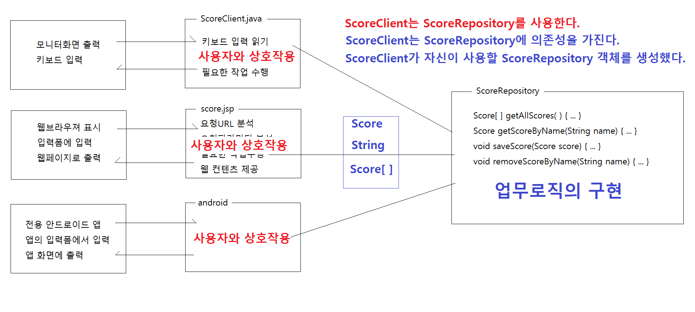
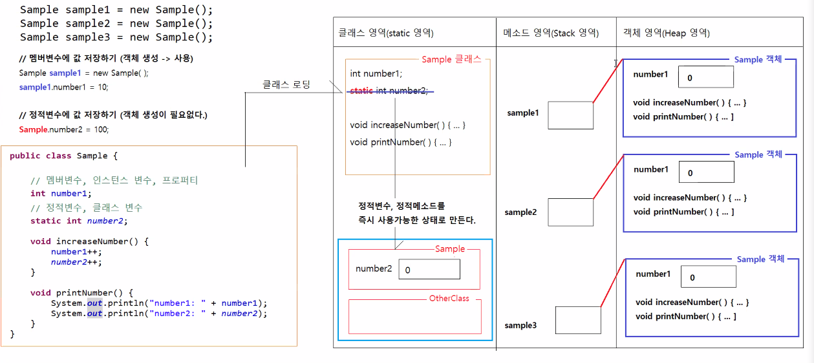
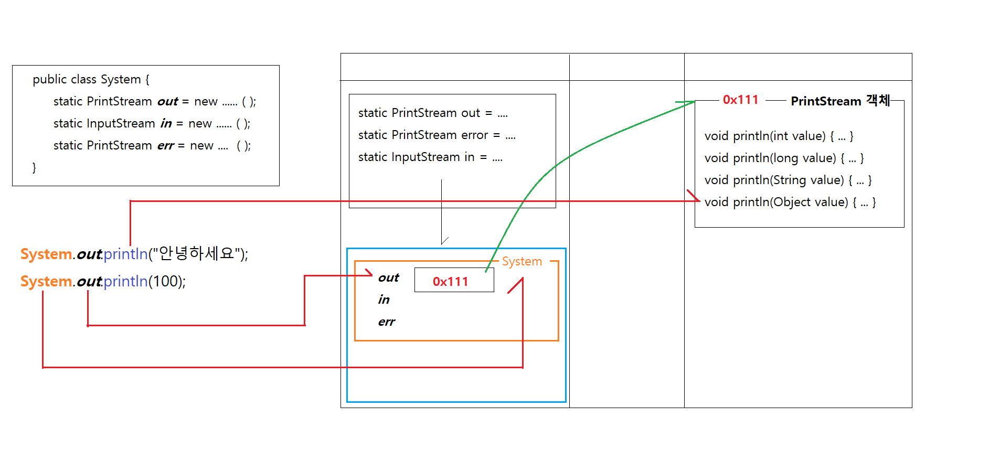
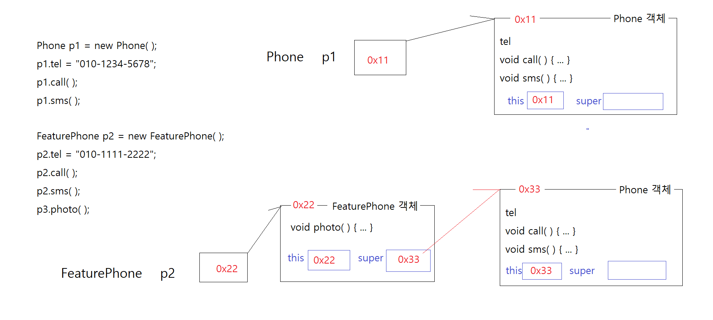
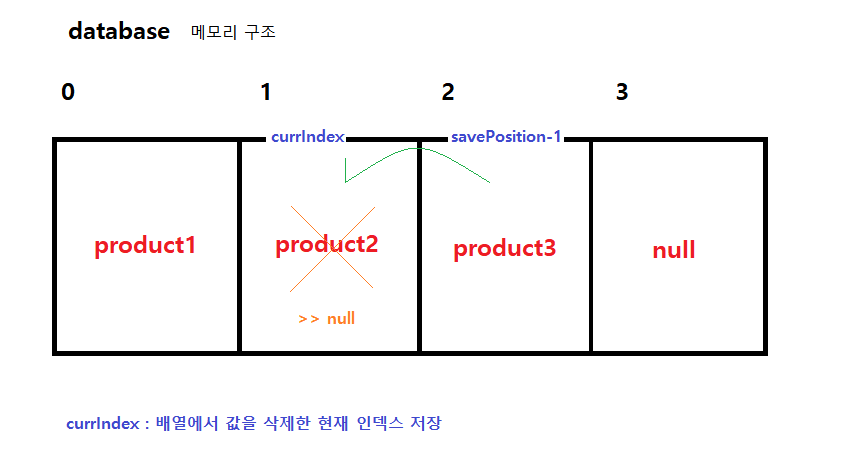

# 3/15

- [3/15](#315)
  - [1~4 교시](#14-교시)
  - [성적정보 관리 프로그램](#성적정보-관리-프로그램)
    - [4. 성적변경](#4-성적변경)
    - [5. 성적 삭제](#5-성적-삭제)
      - [성적 삭제 스케치](#성적-삭제-스케치)
  - [스케치와 시나리오 작성.](#스케치와-시나리오-작성)
    - [1. 스케치 그리기](#1-스케치-그리기)
    - [2. 시나리오 작성하기](#2-시나리오-작성하기)
  - [성적관리 프로그램 완성 코드](#성적관리-프로그램-완성-코드)
      - [Score.java](#scorejava)
      - [ScoreClient.java](#scoreclientjava)
      - [ScoreRepository.java](#scorerepositoryjava)
    - [성적관리 프로그램의 객체간의 관계도](#성적관리-프로그램의-객체간의-관계도)
  - [5~6교시](#56교시)
  - [static](#static)
    - [예시 및 실습](#예시-및-실습)
      - [Sample.java](#samplejava)
      - [Sample.java 메모리구조](#samplejava-메모리구조)
      - [System.out.println()의 out](#systemoutprintln의-out)
      - [Circle 클래스](#circle-클래스)
      - [상수 클래스](#상수-클래스)
      - [청년도움적금](#청년도움적금)
      - [Sample2.java](#sample2java)
  - [7~8교시](#78교시)
  - [클래스간의 관계](#클래스간의-관계)
  - [상속](#상속)
    - [super](#super)
    - [상속 실습](#상속-실습)
      - [Phone.java](#phonejava)
      - [FeaturePhone.java](#featurephonejava)
      - [PhoneApp.java](#phoneappjava)
  - [과제1](#과제1)
    - [6. 제품 정보 삭제하기](#6-제품-정보-삭제하기)

<small><i><a href='http://ecotrust-canada.github.io/markdown-toc/'>Table of contents generated with markdown-toc</a></i></small>

## 1~4 교시
## 성적정보 관리 프로그램
### 4. 성적변경
* 구현 예시
  

* updateScore 메소드를 repo에 만들지 않고
* getScoreByName을 이용해 수정할 수 있다.
    * getScoreByName을 이용해 이름을 이용한 score객체의 정보를 받고
    * 입력값을 토대로 값을 다시 대입해 준다.
```java
else if (menuNo == 4) {
    System.out.println("<<성적 변경>>");
    System.out.print("성적을 수정할 학생의 이름을 입력하세요: ");
    String name = reader.readString();
    Score score = repo.getScoreByName(name);

    System.out.println("\n[" + name + "] 학생의 성적");
    System.out.print("국어: " + score.kor);
    System.out.print("영어: " + score.eng);
    System.out.print("수학: " + score.math);
    System.out.println();

    System.out.println("[" + "학생의 점수를 다시 입력하세요");
    System.out.print("국어: ");
    int kor = reader.readInt();
    System.out.print("영어: ");
    int eng = reader.readInt();
    System.out.print("수학: ");
    int math = reader.readInt();

    score.kor = kor;
    score.eng = eng;
    score.math = math;

}
```
* ScoreRepository.java에서는 코드를 작성 또는 수정할 필요가 없다.
  * getScoreByName만 사용하기 때문에
### 5. 성적 삭제
#### 성적 삭제 스케치

* 성적 삭제의 경우 마지막 값을 지울 경우에는 값을 옳길 필요가 없지만 배열의 중간에 위치한 값을 지울경우 해당 값이 위치한 인덱스보다 큰(오른쪽에 위치한) 값들을 한칸씩 왼쪽으로 옳겨줘야 한다.

* 구현 과정 설계
  * 삭제할 학생의 성적정보가 몇번째 칸에 저장되어 있는지 알아낸다.
  * 마지막 값을 삭제할 경우
    * 해당 성적정보가 저장된 값을 null로 설정한다.
    * 다음 저장위치를 1감소시킨다.
  * 중간의 값을 삭제할 경우
    * 해당 성적정보가 저장된 칸에 다음번째 성적의 주소값을 저장한다.
      * 이 작업을 반복한다.
    * 맨 마지막번째 칸을 null로 생성한다.
    * 다음 저장위치를 1감소시킨다.

* ScoreClient.java에 성적 삭제 코드 추가
    ```java
    else if (menuNo == 5) {
                    System.out.println("<<성적 삭제>>");
                    System.out.print("학생 이름을 입력하세요: ");
                    String name = reader.readString();
                    repo.removeScoreByName(name);
                } else if (menuNo == -1) {
    ```
* ScoreRepository.java에 성적 삭제 코드 추가
    ```java
    // 학생이름을 전달받아서 기존 성적정보를 삭제하는 기능
        // 반환타입: void, 메소드명: removeScoreByName, 매개변수: String
        /**
        * 이름을 전달받아서 해당 학생의 성적정보를 삭제한다.
        * 
        * @param name 학생이름
        */
        void removeScoreByName(String name) {
            // 삭제할 학생의 성적정보가 몇번째 칸에 저장되어 있는지 알아낸다.
            int savedIndex = getScoreIndexByName(name);
            // savedIndex값이 -1이면 이름에 해당하는 성적정보가 존재하지 않으므로 메소드 실행을 즉시 종료시킨다.(빠른 종료!!!)
            if (savedIndex == -1) {
                System.out.println("[경고] " + name + " 학생의 성적정보가 존재하지 않습니다.");
                return;
            }
            // 해당위치의 성적정보를 삭제하는 메소드를 실행한다.
            removeScoreByIndex(savedIndex);
            System.out.println(name + "학생의 성적정보가 삭제되었습니다.");
        }

        /**
        * 이름을 전달받아서 해당 학생의 성적정보가 저장된 위치를 반환한다.
        * 
        * @param name 학생이름
        * @return 배열에서 저장된 인덱스, 정보가 존재하지 않으면 -1을 반환한다.
        */
        int getScoreIndexByName(String name) {
            // 저장된 위치를 저장하는 변수를 선언하고, 절대로 나올수 없는 -1을 초기값으로 대입한다.
            int savedIndex = -1;
            // 배열의 0번째부터 다음 저장위치 바로 앞까지 반복하면서 이름과 일치하는 성적정보를 찾는다.
            for (int index = 0; index < savePosition; index++) {
                Score score = database[index];
                if (name.equals(score.name)) { // 전달받은 이름과 배열에서 순서대로 가져온 성적의 이름이 일치하는지 확인한ㄷ.
                    savedIndex = index; // index값을 savedIndex에 대입하고, 검색을 끝낸다.
                    break;
                }
            }
            return savedIndex; // savedIndex에 저장된 값을 반환한다. -1이면 성적정보가 없는 경우다.
        }

        /**
        * 전달받은 인덱스 위치에 저장된 성적정보를 삭제한다.
        * 
        * @param removeIndex 인덱스
        */
        void removeScoreByIndex(int removeIndex) {
            // 삭제할 위치가 맨 마지막번째 저장된 성적정보인지 확인한다.
            if (removeIndex == savePosition - 1) {
                // 맨 마지막번째 성적정보 삭제 메소드를 실행하고 메소드를 종료한다.
                removeLastScore();
                return;
            }
            removeUnLastScore(removeIndex);
        }

        /**
        * 맨 마지막번째 성적정보를 삭제한다.
        */
        void removeLastScore() {
            database[savePosition - 1] = null;
            savePosition--;
        }

        /**
        * 삭제할 성적정보가 맨 마ㅓ지막번째가 아닌 경우, 전달받은 인덱스 위치 다음부터 성적정보를 한 칸씩 앞으로 이동시켜서 성적정보를 삭제한다.
        * 
        * @param removeIndex 삭제할 인덱스
        */
        void removeUnLastScore(int removeIndex) {
            // 삭제할 위치 다음붙터 한칸씩 앞으로 이동시킨다.
            for (int index = removeIndex; index < savePosition - 1; index++) {
                database[index] = database[index + 1];
            }
            removeLastScore();
        }
    ```
* ScoreRepository.java에 테스트용 코드추가
    ```java
        // 테스트용 성적정보 저장
        public ScoreRepository() {
            saveScore(new Score("홍길동", 100, 100, 100));
            saveScore(new Score("김유신", 90, 90, 100));
            saveScore(new Score("강감찬", 90, 90, 100));
            saveScore(new Score("이순신", 80, 80, 100));
            saveScore(new Score("류관순", 80, 80, 100));
            saveScore(new Score("안중근", 70, 70, 100));
            saveScore(new Score("윤봉길", 70, 70, 100));
        }
    ```
## 스케치와 시나리오 작성.
* 코딩하기전에 미리 메모리 과정을 생각(사유) 해본다. 
### 1. 스케치 그리기
* 메모리 모습을 상상하고 발생할 문제와 경우의 수를 생각한다.
### 2. 시나리오 작성하기
* 스케치를 통해 생각해놓은 구현과정을 글로 작성한다.

## 성적관리 프로그램 완성 코드
#### Score.java
```java
package app7;

public class Score {

	String name;
	int kor;
	int eng;
	int math;

	// 기본 생성자 메소드를 정의하기
	public Score() {

	}

	// 모든 멤버변수를 초기화하는 생성자 메소드를 정의하기
	public Score(String name, int kor, int eng, int math) { // generate기능 사용
		this.name = name;
		this.kor = kor;
		this.eng = eng;
		this.math = math;
	}

	// 총점을 반환하는 메소드를 정의하기, 반환값:int, 메소드명:getTotalScore, 매개변수: 없음
	int getTotalScore() {
		return kor + eng + math;
	}

	// 평균을 반환하는 메소드를 정의하기, 반환값:int, 메소드명:getAverage, 매개변수: 없음
	int getAverage() {
		return getTotalScore() / 3;
	}

	// 성정정보를 화면에 출력하는 메소드를 정의하기, 반환값:void, 메소드명:printScoreInfo, 매개변수: 없음
	// 출력형식
	// ----------------
	// 이름 : 홍길동
	// 국어 : 80
	// 영어 : 80
	// 수학 : 80
	// 총점 : 80
	// 평균 : 80
	// 빈 줄
	void printScoreInfo() {
		System.out.println("-------------");
		System.out.println("이름 : " + name);
		System.out.println("국어 : " + kor);
		System.out.println("영어 : " + eng);
		System.out.println("수학 : " + math);
		System.out.println("총점 : " + getTotalScore());
		System.out.println("평균 : " + getAverage());
		System.out.println();
	}

}
```
#### ScoreClient.java
```java
package app7;

public class ScoreClient {

	public static void main(String[] args) {

		// 키보드 입력을 읽어오는 객체 생성하기
		// 성적 정보를 관리하는 객체 생성하기
		KeyboardReader reader = new KeyboardReader();
		ScoreRepository repo = new ScoreRepository();

		while (true) {
			System.out.println("\n\n\n");
			System.out.println("[성적관리 프로그램]");
			System.out.println("------------------------------------------------------");
			System.out.println("1.조회 2.검색 3.입력 4.수정 5.삭제 -1.종료");
			System.out.println("------------------------------------------------------");

			System.out.print("메뉴를 선택하세요: ");
			int menuNo = reader.readInt();

			System.out.println();
			if (menuNo == 1) {
				System.out.println("<<전체 성적 리스트>>");

				Score[] scores = repo.getAllScores();
				System.out.println("이름\t국어\t영어\t수학\t총점\t평균");
				for (Score score : scores) {
					if (score == null) {
						break;
					}
					System.out.print(score.name + "\t");
					System.out.print(score.kor + "\t");
					System.out.print(score.eng + "\t");
					System.out.print(score.math + "\t");
					System.out.print(score.getTotalScore() + "\t");
					System.out.println(score.getAverage());
				}

			} else if (menuNo == 2) {
				System.out.println("<<성적 검색>>");

				System.out.println("학생이름을 입력하세요: ");
				String name = reader.readString();
				Score score = repo.getScoreByName(name);

				if (score != null) {
					score.printScoreInfo();
				} else {
					System.out.println("[경고] 성적정보를 찾을 수 없습니다.");
				}

			} else if (menuNo == 3) { // 저장기능을 제일 먼저 작성한다.
				System.out.println("<<성적 입력>>");

				// 입력값 입력받기
				System.out.print("학생 이름을 입력하세요: ");
				String name = reader.readString();
				System.out.print("국어점수를 입력하세요: ");
				int kor = reader.readInt();
				System.out.print("영어점수를 입력하세요: ");
				int eng = reader.readInt();
				System.out.print("수학점수를 입력하세요: ");
				int math = reader.readInt();

				// 저장소에 데이터 보내기 (여러 값이 저장된 객체를 준다.)
				Score score = new Score(name, kor, eng, math);
				repo.saveScore(score);

			} else if (menuNo == 4) {
				System.out.println("<<성적 변경>>");
				System.out.print("성적을 수정할 학생의 이름을 입력하세요: ");
				String name = reader.readString();
				Score score = repo.getScoreByName(name);

				if (score != null) {
					System.out.println("\n[" + name + "] 학생의 성적");
					System.out.print("국어: " + score.kor + ", ");
					System.out.print("영어: " + score.eng + ", ");
					System.out.print("수학: " + score.math + ", ");
					System.out.println();

					System.out.println("[" + "학생의 점수를 다시 입력하세요");
					System.out.print("국어: ");
					int kor = reader.readInt();
					System.out.print("영어: ");
					int eng = reader.readInt();
					System.out.print("수학: ");
					int math = reader.readInt();

					score.kor = kor;
					score.eng = eng;
					score.math = math;

					System.out.println(name + "학생의 성적정보가 변경되었습니다.");
				} else {
					System.out.println("[경고] " + name + " 학생의 성적정보가 존재하지않습니다.");
				}

			} else if (menuNo == 5) {
				System.out.println("<<성적 삭제>>");
				System.out.print("학생 이름을 입력하세요: ");
				String name = reader.readString();
				
				// 방법1
				boolean isSuccess = repo.removeScoreByName(name);
				if (isSuccess) {
					System.out.println(name + "학생의 성적정보가 삭제되었습니다.");	
				} else {
					System.out.println("[경고] " + name + " 학생의 성적정보가 존재하지않습니다.");
				}
				
				// 방법2
//				Score score= repo.getScoreByName(name);				
//				if (score != null) {
//					repo.removeScoreByName2(name);
//					System.out.println(name + "학생의 성적정보가 삭제되었습니다.");				
//				} else {
//					System.out.println("[경고] " + name + " 학생의 성적정보가 존재하지않습니다.");
//				}				
				
			} else if (menuNo == -1) {
				System.out.println("[성적관리 프로그램을 종료합니다.]");
				break;
			} else {
				System.out.println("[경고] 메뉴번호가 올바르지 않습니다.");
			}
		}
	}
}

```
#### ScoreRepository.java
```java
package app7;

public class ScoreRepository { // 성적데이터를 저장하는 클래스

	// 1. 모든 성적정보를 반환하는 기능
	// 	반환타입: Score[], 메소드명: getAllScores, 매개변수: 없음
	// 2. 학생이름을 전달받아서 해당하는 학생의 성적 정보를 반환하는 기능
	// 	반환타입: Score, 메소드명: getScoreByName, 매개변수: String
	// 3. 새 성적 정보를 저장하는 기능
	// 	반환타입: void, 메소드명: saveScore, 매개변수: Score
	// 4. 기존 성적정보를 변경하는 기능
	// 	반환타입: void, 메소드명: updateScore, 매개변수: Score
	// 5. 학생이름을 전달받아서 기존 성적정보를 삭제하는 기능
	// 	반환타입: void, 메소드명: removeScoreByName, 매개변수: String

	// Score 주소값들을 저장할 Score 배열을 생성한다.
	Score[] database = new Score[100];
	int savePosition = 0; // 저장위치. 멤버변수로 값을 가지고 있어야 객체변수가 유지된다.

	// 테스트용 성적정보 저장
	public ScoreRepository() {
		saveScore(new Score("홍길동", 100, 100, 100));
		saveScore(new Score("김유신", 90, 90, 100));
		saveScore(new Score("강감찬", 90, 90, 100));
		saveScore(new Score("이순신", 80, 80, 100));
		saveScore(new Score("류관순", 80, 80, 100));
		saveScore(new Score("안중근", 70, 70, 100));
		saveScore(new Score("윤봉길", 70, 70, 100));
	}

	/**
	 * Score 객체가 저장된 배열을 반환한다. (배열객체를 참조하고 있는 참조변수의 참조값을 반환한다.)
	 * 
	 * @return
	 */
	Score[] getAllScores() {
		return database;
	}

	/**
	 * 지정된 이름의 학생정보를 포함하고 있는 Score객체를 반환한다.
	 * 
	 * @param studentName 학생이름
	 * @return Score객체, 이름에 해당하는 Score객체가 존재하지 않으면 null을 반환한다.
	 */
	Score getScoreByName(String studentName) {
		for (Score score : database) {
			if (score == null) { // Score객체가 저장되지 않은 곳에 도달하면 반복문을 탈출한다.
				break;
			}
			if (studentName.equals(score.name)) { // 전달받은 이름과 동일한 이름을 가진 Score객체가 발견되면
				return score; // 그 객체의 주소값을 반환하고, 메소드 실행을 종료한다.
			}
		}

		return null; // 배열에 저장된 모든 Score객체를 조사해도 이름이 동일한 Score객체가 없으면 null이 발환된다.
	}

	/**
	 * 신규 성적정보가 포함된 Score객체를 전달받아서 배열에 저장한다.
	 * 
	 * @param score Score객체
	 */
	void saveScore(Score score) {
		database[savePosition] = score;
		savePosition++;
	}

	// 방법 1
	/**
	 * 이름을 전달받아서 해당 학생의 성적정보를 삭제하고 삭제 여부를 반환한다.
	 * 
	 * @param name
	 * @return 삭제 여부
	 */
	boolean removeScoreByName(String name) {
		// 삭제할 학생의 성적정보가 몇번째 칸에 저장되어 있는지 알아낸다.
		int savedIndex = getScoreIndexByName(name);
		// savedIndex값이 -1이면 이름에 해당하는 성적정보가 존재하지 않으므로 메소드 실행을 즉시 종료시킨다.(빠른 종료!!!)
		if (savedIndex == -1) {
			return false;
		}
		// 해당위치의 성적정보를 삭제하는 메소드를 실행한다.
		removeScoreByIndex(savedIndex);
		return true;
	}

	// 방법 2
	/**
	 * 이름을 전달받아서 해당 학생의 성적정보를 삭제한다.
	 * 
	 * @param name
	 */
	void removeScoreByName2(String name) {
		// 삭제할 학생의 성적정보가 몇번째 칸에 저장되어 있는지 알아낸다.
		int savedIndex = getScoreIndexByName(name);
		// 해당위치의 성적정보를 삭제하는 메소드를 실행한다.
		removeScoreByIndex(savedIndex);
	}

	/**
	 * 이름을 전달받아서 해당 학생의 성적정보가 저장된 위치를 반환한다.
	 * 
	 * @param name 학생이름
	 * @return 배열에서 저장된 인덱스, 정보가 존재하지 않으면 -1을 반환한다.
	 */
	int getScoreIndexByName(String name) {
		// 저장된 위치를 저장하는 변수를 선언하고, 절대로 나올수 없는 -1을 초기값으로 대입한다.
		int savedIndex = -1;
		// 배열의 0번째부터 다음 저장위치 바로 앞까지 반복하면서 이름과 일치하는 성적정보를 찾는다.
		for (int index = 0; index < savePosition; index++) {
			Score score = database[index];
			if (name.equals(score.name)) { // 전달받은 이름과 배열에서 순서대로 가져온 성적의 이름이 일치하는지 확인한ㄷ.
				savedIndex = index; // index값을 savedIndex에 대입하고, 검색을 끝낸다.
				break;
			}
		}
		return savedIndex; // savedIndex에 저장된 값을 반환한다. -1이면 성적정보가 없는 경우다.
	}

	/**
	 * 전달받은 인덱스 위치에 저장된 성적정보를 삭제한다.
	 * 
	 * @param removeIndex 인덱스
	 */
	void removeScoreByIndex(int removeIndex) {
		// 삭제할 위치가 맨 마지막번째 저장된 성적정보인지 확인한다.
		if (removeIndex == savePosition - 1) {
			// 맨 마지막번째 성적정보 삭제 메소드를 실행하고 메소드를 종료한다.
			removeLastScore();
			return;
		}
		removeUnLastScore(removeIndex);
	}

	/**
	 * 맨 마지막번째 성적정보를 삭제한다.
	 */
	void removeLastScore() {
		database[savePosition - 1] = null;
		savePosition--;
	}

	/**
	 * 삭제할 성적정보가 맨 마ㅓ지막번째가 아닌 경우, 전달받은 인덱스 위치 다음부터 성적정보를 한 칸씩 앞으로 이동시켜서 성적정보를 삭제한다.
	 * 
	 * @param removeIndex 삭제할 인덱스
	 */
	void removeUnLastScore(int removeIndex) {
		// 삭제할 위치 다음붙터 한칸씩 앞으로 이동시킨다.
		for (int index = removeIndex; index < savePosition - 1; index++) {
			database[index] = database[index + 1];
		}
		removeLastScore();
	}

}

```
### 성적관리 프로그램의 객체간의 관계도
* 웹브라우저, android 객체를 추가 했을 경우 예상도



  * 방향성이 있다. = 의존성을 가진다.

## 5~6교시
## static
* static : "정적인, 고정된"
* static 키워드를 통해서 static변수와 static 메소드를 만들 수 있다.
  * 각각 클래스변수, 클래스메소드라고도 부른다.
  * 이 둘은  객체(인스턴스)에 속해있지 않고 클래스에 고정되어 있다.
  * 클래스(static영역)영역에 저장된다.
* 클래스의 로딩이 끝나는 즉시 사용할 수 있게 된다.     


* 사용방법
  * 클래스 이름으로 사용한다.
  * 객체 생성이 필요없다.
  * 형식 : `클래스.static변수명(메소드명)`
  * 상수 변수를 만들기 위해 정적 변수를 사용한다. (static final)

* 자바에서의 대문자(3)
  1. 클래스 - Student.java, Score.java
  2. 상수 - FIXED_RATE, PI, DAY_OF_WEEK
  3. 열거형

* static 변수 - 상수 만들 때 사용
* static 메소드 - 객체와 상호작용이 필요 없는 메소드를 만들 때 사용한다.(여러 클래스에서 자주 사용되는 유틸리티 기능)

### 예시 및 실습
#### Sample.java
* 정적 변수 실습
```java
package app8;

public class Sample {
	
	// 멤버변수, 인스턴스 변수, 프로퍼티
	int number1;
	// 정적변수, 클래스 변수
	static int number2;
	
	void increaseNumber() {
		number1++;
		Sample.number2++;
	}
	
	void printNumber() {
		System.out.println("number1: " + number1);
		System.out.println("number2: " + number2);
	}
}
```

#### Sample.java 메모리구조


* Sample 클래스를 로딩하면..
   * Sample 클래스 영역 생성
   * static영역 안에 Sample의 static들이 저장되는 영역 생성 (클래스 로딩하면 즉시 생성)
     * static들을 바로 사용가능하게 만듦
* number1은 객체를 생성한 만큼 객체영역에 객체가 생성되지만
* number2는 오로지 1개만 생성된다.
#### System.out.println()의 out 
* `out`은 static변수로 한번만 생성된다.
* `out.println()`하면 PrintStream클래스의 println()메소드의 주소값을 참조하여 사용한다.



#### Circle 클래스
* x, y그래프에서 여러 원을 그린다.
* 각 원은 크기와 위치가 다르다.
* 하지만 파이값은 모두 3.14로 같다. 즉, 상수다.
* 파이값은 static으로 선언한다.  


#### 상수 클래스
* ApplicationConstant 클래스에 프로그램에서 사용할 상수들을 선언한다.


#### 청년도움적금
* 고정금리를 가진 청년도움적금 클래스
```java
public class 청년도움적금 {
    public static final double FIXED_RATE = 0.04;
    String name;
    String password;
    long balance;
    Date createdDate;
    Date expiredDate;
    ...
}
```

#### Sample2.java
```java
package app8;

public class Sample2 {

	int number1;					// 인스턴스 변수, 멤버변수
	static int number2;				// 클래스변수

	void method1() {				// 인스턴스 메소드, 멤버메소드
		System.out.println(number1);			// 인스턴스 변수를 사용할 수 있다.
		System.out.println(Sample2.number2);	// 클래스 변수를 사용할 수 있다.
	}

	void method2() {				// 인스턴스 메소드, 멤버메소드
		method1();								// 다른 인스턴스 메소드를 호출할 수 있다.
	}

	void method3() {				// 인스턴스 메소드, 멤버메소드
		Sample2.staticMethod1(); 				// 다른 클래스 메소드를 호출할 수 있다.
	}

	static void staticMethod1() {	// 클래스 메소드
//		System.out.println(number1);			// 인스턴스 변수를 사용할 수 없다.
		System.out.println(Sample2.number2);	// 정적 변수를 사용할 수 있다.
	}

	static void staticMethod2() {	// 클래스 메소드
//		method1();								// 인스턴스 메소드를 호출할 수 없다.
	}

	static void staticMethod3() {	// 클래스 메소드
		Sample2.staticMethod1();				// 다른 클래스 메소드를 호출할 수 있다.
	}
}

```


## 7~8교시
* new project : 'java-oop-2' 

## 클래스간의 관계
* 의존관계
  * 사람은 자동차를 사용한다.
  * 사람은 냉장고를 사용한다.
  * 사람은 핸드폰을 사용한다.
* 포함관계
  * 자동차는 엔진을 가지고 있다.
  * 자동차는 에어컨을 가지고 있다.
  * 자동차는 내비게이션을 가지고 있다.
* 상속관계  
  * 미국인은 사람이다.
  * 한국인은 사람이다.
  * 중국인은 사람이다.
    * 미국인, 한국인, 중국인은 공통된 속성을 가지고 있다.
  * 갤럭시는 스마트폰이다.
  * 아이폰은 스마트폰이다.
  * 샤오미폰은 스마트폰이다.
  * 아이폰미니는 스마트폰이다.
    * 갤럭시, 아이폰, 샤오미폰, 아이폰미니는 공통된 기능을 가지고 있다.
  * 아이폰 13은 아이폰이다.
  * 아이폰13프로는 아이폰이다.
  * 아이폰 13프로맥스는 아이폰이다.
    * 아이폰 13, 아이폰13프로 아이폰 13프로맥스가 아이폰 보다 더 구체적이다.

## 상속
프로그래밍에서의 상속은 조금 다르다.
* 기존 클래스를 사용해서 새로운 클래스를 작성하는것.
* 장점
  * 재사용성
  * 중복제거
  * 생산성, 유지보수성
* 사용 : extends 키워드
* 특징 : 
  * 하위 클래스는 상위 클래스의 필드와 메소드를 상속받는다.
* ***자바에서는 자식만 부모를 참조한다.***
  * 부모는 자식에 대한 정보를 가지고 있지 않다.
  * new class에 super class를 정하는 항목이 있고 이를 지정하지 않으면 java.lang.object가 부모클래스로 지정된다.
### super
* 자식 클래스가 부모 클래스로부터 상속받은 멤버를 참조할 때 사용하는 참조 변수
* 생성된 객체가 상속받은, 즉 상위 클래스의 주소값을 담고 있다.
* this가 자신을 가리키는 반면 super는 부모를 가리키는 것.
### 상속 실습
#### Phone.java
```java
package sample1;

public class Phone {

	String tel;
	void call() {
		System.out.println("전화걸기/받기");
	}
	
	void sms() {
		System.out.println("문자 주고/받기");
	}
	
}
```
#### FeaturePhone.java
```java
package sample1;

public class FeaturePhone extends Phone {

	void photo() {
		System.out.println("사진찍기");
	}
}

```
#### PhoneApp.java
```java
package sample1;

public class PhoneApp {

	public static void main(String[] args) {
		Phone p1 = new Phone();
		p1.tel = "010-1234-5678";
		p1.call();
		p1.sms();

		FeaturePhone p2 = new FeaturePhone();
		p2.tel = "010-2345-7896";		// Phone의 속성
		p2.call();						// Phone의 기능
		p2.sms();						// Phone의 기능
		p2.photo();						// FeaturePhone의 기능
		
	}

}
```
* Phone의 하위 클래스인 FeaturePhone의 객체인 p2객체를 이용해 Phone클래스의 메소드를 사용할 수 있다.



## 과제1
* 삭제 기능 추가
### 6. 제품 정보 삭제하기

* ProductClient.java
    ```java
    else if (inputNum == 6) { // 6. 삭제하기
                    System.out.println("<< 6. 상품 정보 삭제 >>");
                    System.out.print("삭제하고 싶은 제품 이름을 적어주세요: ");
                    String name = reader.readString();
                            
                    Product product = repo.getProductByName(name);
                    if (product != null) {
                        repo.deleteProduct(product);
                        System.out.println("삭제 완료");
                    } else {
                        System.out.println("상품정보가 없습니다.");
                    }
                    
                    System.out.println();

                }
    ```
* ProductRepository.java
    ```java
    // 6. 상품정보 삭제
        // 상품명에 해당하는 상품을 찾아서 정보를 삭제. database에서 참조값 왼쪽으로 밀기.	
        void deleteProduct(Product product) {
            
            int currIndex = 0;
            for (int i = 0; i < database.length; i++) {
                if (product == database[i]) {
                    database[i] = null;
                    currIndex = i;
                } 
            }
            
            for (int i = currIndex; i < savePosition - 1; i++) {	
                database[i] = database[i+1];
            }
            
            database[savePosition-1] = null;
            savePosition--;
        }
    ```
