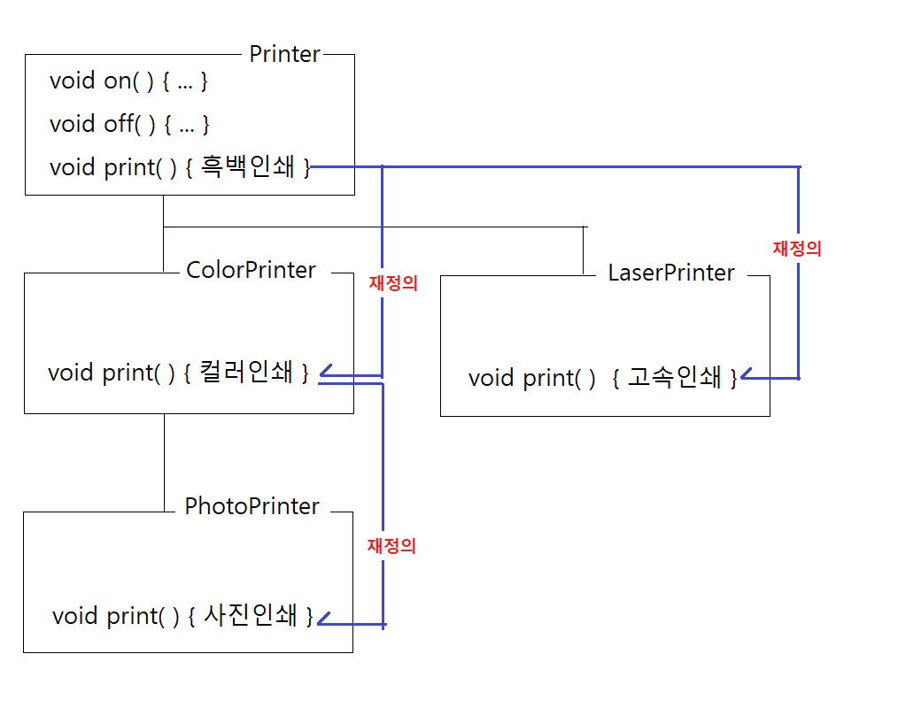
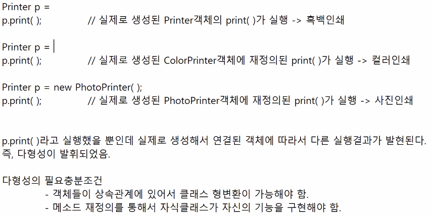

# 3/17

- [3/17](#317)
  - [1~2교시](#12교시)
  - [상속](#상속)
    - [실습](#실습)
      - [Iphone](#iphone)

  - [Object 클래스](#object-)
    * [주요 메소드](#-)
  - [메소드 재정의](#--1)
    * [메소드 재정의 목적](#--)
      + [메소드 중복정의(Method overload)](#-method-overload)
      + [메소드 재정의(Method override)](#-method-override)
    * [실습](#)
      + [PrinterApp](#printerapp)

    - [메소드 재정의 예시](#메소드-재정의-예시)
    - [다형성의 필요충분조건](#다형성의-필요충분조건)
  - [3~4교시](#34교시)
  - [형변환](#형변환)
    - [기본자료형의 형변환](#기본자료형의-형변환)
    - [클래스의 형변환](#클래스의-형변환)
    - [실습](#실습-1)
      - [PrinterApp2.java](#printerapp2java)
    - [클래스의 형변환과 다형성](#클래스의-형변환과-다형성)
  - [5~7교시](#57교시)
  - [다형성](#다형성)
    - [예시](#예시)
      - [회계정보 분석프로그램](#회계정보-분석프로그램)
    - [실습](#실습-2)
      - [PhoneApp](#phoneapp)
      - [PhoneApp2](#phoneapp2)
      - [instanceof](#instanceof)
  - [8교시](#8교시)
  - [과제](#과제)
    - [추가과제](#추가과제)

## 1~2교시
## 상속


* 단일 상속만 지원한다.
  * 하위 클래스는 한 개의 상위 클래스만 상속받을 수 있다.
  * 두 개 이상의 상위 클래스를 동시에 상속받을 수 없다.
    ```java
    // 컴파일 오류
    // 하위 클래스는 오직 상위 클래스 하나만 상속받을 수 있다.
    public class Child extends Parent1, Parent2 {

    }
    ```
* 동시에 상위 클래스를 두개 상속받을 수는 없지만, 여러 상위 클래스를 수직적으로 상속받을 수는 있다.
  ```java
  // GrandParent 클래스
  public class GrandParent {
    // GrandParent 클래스의 필드와 메소드
  }
  // GrandParent 클래스를 상속받은 Parent 클래스
  public class Parent extends GrandParent {
    // Parent 클래스의 필드와 메소드
  }
  public class Me extends Parent {
    // Me 클래스의 필드와 메소드
  }
  ```
* 상위클래스가 지정되지 않은 클래스는 항상 Object 클래스를 상속받는다.
  * Object 클래스는 자바의 최상위 클래스다.
  * Object 클래스는 배열을 포함한 모든 클래스의 최상위 클래스다.
  * 따라서, 자바의 모든 클래스는 Object 클래스의 하위 클래스다.
  * Object 클래스는 java.lang 패키지에 있다.
  * Object 클래스는 상위 클래스가 없는 유일한 클래스다.
  * Object 클래스에는 배열을 포함한 모든 객체가 꼭 포함해야할 메소드가 정의되어 있다.
  * 배열객체를 포함한 모든 객체는 Object객체를 내부에 포함하고 있다.
  * 배열객체를 포함한 모든 객체는 Object객체가 가진 기능을 사용할 수 있다.


### 실습
* Phone, FeaturePhone, SmartPhone
  * 순서대로 상속받는다.
* Galaxy, Iphone extends SmartPhone

  


#### Iphone
```java
package sample1;

public class Iphone extends SmartPhone {

    void appleMusic() {
        System.out.println("애플뮤직으로 음악듣기");
    }
    
    
}
``` 
* 작성된 기능이 1개만 있다. (자신만의 고유기능)
* 하지만 상속받은 모든 부모클래스들의 기능을 사용할 수 있다.
  * SmartPhone, FeaturePhone, Phone이 가지고 있는 기능.
  * PhoneApp.java에서 확인
  ```java
    Iphone p3 = new Iphone();		
    p3.tel = "010-1111-3333";		// Phone의 속성
    p3.ip = "192.168.1.1";			// SmartPhone의 속성
    p3.email = "hong@gmail.com";	// SmartPhone의 속성
    p3.call();						// Phone의 속성
    p3.sms();						// Phone의 속성
    p3.photo();						// FeaturePhone의 속성
    p3.email();						// SmartPhone의 속성
    p3.web();						// SmartPhone의 속성
    p3.appleMusic();				// Iphone의 속성
  ````

## Object 클래스
* 'new class' -> 'super class' 설정을 하지 않을 경우 Object클래스를 상속받는다.
* 자바의 최상위 클래스 (모든 자바의 클래스는 Object의 하위 클래스)
* java.lang.object
* 객체를 다루는데 사용되는 기초적인 기능들이 있다. 
  * toString, equals

### 주요 메소드
1. ***boolean equals(Object obj)***
2. *int hashCode()*
   * 이 객체의 고유한 해시코드값을 반환한다.
   * 해시코드값이 다르면 서로 다른 객체다.
   * 해시코드값이 같으면 같은 객체일 수도 있고, 다른 객체일 수도 있다.
3. ***String toString()***
   * 이 객체에 대한 간단한 정보를 문자열로 반환한다.
   * `패키지명.패키지명.클래스명@해시코드`
   * `System.out.println(참조변수);` 이 코드를 실행하면 실제로 실행되는 코드는 `System.out.println(참조변수.toString());`이 실행된다.
4. *Class<?> getClass()*
   * 이 객체에 대한설계도 정보를 Class객체로 반환한다.
     * Class객체 : 클래스를 표현하는 객체
5. *Object clone()*
   * 이 객체를 복제한 객체를 반환한다.
     * 복제된 객체는 이 객체와 같은 정보를 가지고 있다.
6. *void wait(), void notify()*
   * 다중 스레드와 관련된 기능이다.

## 메소드 재정의
* 상속관계에 있는 클래스에서 자식클래스가 부모 클래스의 메소드를 재정의하는 것이다.
* 부모 클래스로부터 상속받은 기능 중에서 자식 클래스에 맞게 해당 메소드의 구현내용만 재정의하는 것이다. 
  * 반환타입, 메소드이름, 매개변수가 부모 클래스의 메소드와 일치해야 한다.
  * 구현내용만 부모 클래스의 메소드와 다르게 정의하는 것이다.

### 메소드 재정의 목적
* 구현내용의 차이만 있는 기능은 부모클래스와 자식클래스들이 같은 메소드이름으로 구현하게 한다.
* 상속관계에 있는 모든 클래스들에서 재정의된 메소드들은 사용법이 동일해진다.

#### 메소드 중복정의(Method overload)
- 같은 클래스안에서 매개변수만 다르고, 구현내용이 비슷한 기능들을 같은 메소드이름으로 구현하는 것
    ```java
    System.out.println();
    System.out.println(10);
    System.out.println('A');
    System.out.println(true);
    System.out.println(3.14);
    System.out.println(10000000000000000L);
    System.out.println("홍길동");

    Account acc = new Account();
    System.out.println(acc);
    Score score = new Score();
    System.out.println(score);
    ```
* println()에는 매개변수를 다르게 받을 수 있는 다양한 println()들이 있다.

#### 메소드 재정의(Method override)
- 상속관계에 있는 클래스에서 자식 클래스들이 구현내용이 비슷한 기능을 같은 메소드 이름으로 재정의 하는 것
- 즉, 부모로부터 물려받은 메소드를 자신 클래스에 맞게 메소드명은 같지만 기능은 다르게 구현한 것.

### 실습
* Printer
* ColorPrinter extends Printer

#### PrinterApp
```java
package sample2;

public class PrintApp {

    public static void main(String[] args) {
        
        Printer p1 = new Printer();
        p1.on();
        p1.print();
        p1.off();
        
        ColorPrinter p2 = new ColorPrinter();
        p2.on();
        p2.print();
        p2.off();
    }
}
```
* 실행결과
    ```
    전원을 켠다.
    인쇄물을 흑백으로 출력한다.
    전원을 끈다.
    전원을 켠다.
    인쇄물을 흑백으로 출력한다.
    전원을 끈다.
    ```
  * Printer의 `print()`기능이 ColorPrint에 알맞지 않다. 
    * 해결방법 1 : 개별 클래스로 (extends X)
      * 출력기능의 이름이 달라져 비효율적이다. (`print()`, `printColor()`)
      * 클래스, 기능들이 많아질수록 사용하기 복잡하다.
        * PhotoPrinter extends ColorPrinter
            ```java
            package sample2;

            public class PhotoPrinter extends Printer {

                void printPhoto() {
                    System.out.println("인쇄물을 고화질로 출력한다.");
                    }
                }
            ```
            * PrintApp에서 실행
            ```java
            package sample2;

            public class PrintApp {

                public static void main(String[] args) {
                    
                    Printer p1 = new Printer();
                    p1.on();
                    p1.print();								// 출력기능의 이름이 print()
                    p1.off();
                    
                    ColorPrinter p2 = new ColorPrinter();
                    p2.on();
                    p2.printColor();						// 출력기능의 이름이 printColor()
                    p2.off();
                    
                    System.out.println();
                    PhotoPrinter p3 = new PhotoPrinter();	
                    p3.on();
                    p3.printPhoto();                        // 출력기능의 이름이 printPhoto()
                    p3.off();
                }
            }
            ```
            * 같은 출력기능인데 이름이 달라 사용하기 힘들것이다.
    * 해결방법 2 : ***메소드 재정의***
      * ColorPrint, PhotoPrint 재정의
        ```java
        package sample2;

        public class ColorPrinter extends Printer {

        //	void printColor() {
        //		System.out.println("인쇄물을 컬러로 출력한다.");
        //	}
            
            // Printer로부터 물려받은 void print()를 재정의한다.
            void print() {
                System.out.println("인쇄물을 컬러로 출력한다.");
            }
        }
        ```
        ```java
        package sample2;

        public class PhotoPrinter extends Printer {

        //	void printPhoto() {
        //		System.out.println("인쇄물을 고화질로 출력한다.");
        //	}
            
            // 메소드 재정의
            // ColorPrinter에서 물려받은 print() 재정의
            void print() {
                System.out.println("인쇄물을 고화질로 출력한다.");
            }
        }
        ```
      * PrintApp
        ```java
        package sample2;

        public class PrintApp {

            public static void main(String[] args) {
                
                Printer p1 = new Printer();
                p1.on();
                p1.print();								// 출력기능의 이름이 print()
                p1.off();
                
                System.out.println();
                ColorPrinter p2 = new ColorPrinter();
                p2.on();
        //		p2.printColor();						// 출력기능의 이름이 printColor()
                p2.print();								// 메소드 재정의
                p2.off();
                
                System.out.println();
                PhotoPrinter p3 = new PhotoPrinter();	
                p3.on();
        //		p3.printPhoto();						// 출력기능의 이름이 printColor()
                p3.print();								// 메소드 재정의
                p3.off();
            }
        }
        ```



### 메소드 재정의 예시
- Object 클래스
  - `boolean equals(Object obj)`
    - 객체가 동일한 객체인지 판단해서 boolean값을 반환한다.
  - `String toString() `
    - 객체의 정보를 "패키지명.클래스명@해시코드"값으로 반환한다.
- String 클래스
  - `boolean equals(Object obj)`를 메소드 재정의하였음.
    - String객체가 가지고 있는 문자열의 내용을 비교해서 같은 내용이면 true를 반환한다.
  - `String toString()`메소드를 재정의하였음.
  - `int hashCode()`메소드를 재정의 하였음.

```java
Book book = new Book();
System.out.println(book); -> System.out.println(book.toString()); -> "sample3.Book@2f3a112"

String str = "김유신";    String str = new String("김유신");
System.out.println(str); -> System.out.println(str.toString()); -> "김유신"
```


### 다형성의 필요충분조건
- 객체들이 상속관계에 있어서 클래스 형변환이 가능해야 함.
- 메소드 재정의를 통해서 자식클래스가 자신의 기능을 구현해야 함.

## 3~4교시
## 형변환
### 기본자료형의 형변환
```java
정수 -> 실수      double x = 10;       // x에 10.0이 대입된다.
실수 -> 정수      int x = (int) 3.14;  // x에 3이 대입된다.
정수 -> 문자      char x = 65;         // x에 'A'라 대입된다.
문자 -> 정수      int x = 'A'          // x에 65(ASCII값)가 대입된다.

문자열 -> 정수    int x = "100";       // 문법오류
문자열 -> 실수    double x = "3.01";   // 문법오류
* 기본자료형의 형변환은 정수, 실수, 문자간의 형변환만 지원한다.
```

### 클래스의 형변환
- 자식클래스로 만들어진 객체의 참조값을 부모클래스 타입의 참조변수에 대입할 수 있다.
- 부모타입의 참조변수는 자식타입의 객체를 참조할 수 있다.
- 클래스 형변환은 부모/자식 관계에 있는 클래스간의 형변환만 가능하다.

### 실습
#### PrinterApp2.java
```java
package sample2;

public class PrintApp2 {

	public static void main(String[] args) {
		
		Printer p1 = new Printer();
		ColorPrinter p2  = new ColorPrinter();
		PhotoPrinter p3 = new PhotoPrinter();
		
		// 클래스 형변환 : 자식타입객체를 부모타입 참조변수에 대입할 수 있다.
		Printer p4 = new ColorPrinter();
		Printer p5 = new PhotoPrinter();
		
		// 클래스 형변환 : 자식타입객체를 부모타입 참조변수에 대입할 수 있다.
		ColorPrinter p6 = new PhotoPrinter();
		
		// 부모타입객체를 자식타입 참조변수에 대입할 수 없다.
//		PhotoPrinter p7 = new Printer();
//		PhotoPrinter p8 = new ColorPrinter();
	}
}
```

### 클래스의 형변환과 다형성
* 상속, 메소드 재정의, 클래스 형변환은 다형성과 연관된다.
* 추상화는 다형성을 발휘시키기 위해서 모든 자식클래스들에서 메소드의 이름이 같게 하는 것.


* 생성된 객체의 타입과 참조변수의 타입이 서로 다른 경우, 즉 클래스의 형변환의 경우 
  * 해당 객체의 참조값을 참조변수에 대입할 수 없다.
  * 참조변수의 타입과 같은 타입의 객체를 찾아서 그 객체의 참조값을 대입한다.
    * 따라서 p2는 ColorPrinter를 참조하는 것이 아니라 ColorPrinter의 super가 참조하고 있는 Printer를 참조하게 된다.
    * p4는 PhotoPrinter의 super가 참조하고 있는 ColorPrinter의 super가 참조하고 있는 Printer를 참조하게 된다.


- 클래스 형변환을 이용해 객체의 범위를 지정할 수 있다.
- 가장 마지막에 재정의된 메소드가 실행된다.(PhotoPrinter객체를 대입했으면 사진출력이 되는 것.)
  - 예) testInternet이라는 기능은 SmartPhone 및 그 자식 객체들만 사용할 수 있게 할 수 있다.
  - `Printer p4 = new PhotoPrinter();`
    - 사진을 출력하기 위해 PhotoPrinter 객체를 생성하였지만 Printer 에 대입하였다.
    - `p4.print()`
      - (Printer 자료형의 `p4.print()`)메소드를 실행하면 실제로 생성된 객체(PhotoPrinter)의 메소드(사진출력)가 실행된다.
      - ***Printer의 print()인 흑백 출력이 아닌 재정의된 PhotoPrinter의 사진 출력 기능이 실행된다.***



## 5~7교시
## 다형성
* 다형성이란 실행방법은 동일하지만, 동작결과가 다르게 나타나는 것을 말한다.
* 메소드 중복정의, 메소드 재정의, 추상화, 인터페이스 등을 활용해서 다형성을 구현할 수 있다.
* 자주 사용하는 많은 클래스들이 메소드 중복정의, 재정의, 추상화, 인터페이스등을 사용해 다형성을 구현한 것들이다.
  * 자료구조 클래스들
    * Collection
      * ArrayList
      * HashSet
      * Stack
      * ...
  * 입출력 클래스들
    * InputStream
      * FileInputStream
      * ...

### 예시
#### 회계정보 분석프로그램


* 다양한 형식의 데이터를 요청했을때 형변환에 의해 하나의 소스코드로 '데이터 불러오기' 기능을 수행 할 수 있다.
* 회계정보 분석프로그램을 만드는 개발자는 구체적인 DataLoader, ExcelDataLoader.. 의 코드를 알 필요가 없다.
  * DataLoader 기능을 참조하고 필요한 기능이 담긴 객체를 생성해 (형변환을 통해) 다양한 기능을 쉽고 편리하게 구현할 수 있다.

### 실습
#### PhoneApp
```java
package sample3;

public class PhoneApp {

	public static void main(String[] args) {
		
		// SmartPhone객체를 phone타입의 참조변수로 참조하면 SmartPhone객체의 고유 속성과 고유 기능을 사용할 수 없다.
		Phone p1 = new SmartPhone();
		p1.tel = "010-1234-5678";
		p1.call();
		p1.sms();
//		p1.ip = "192.168.0.1";
//		p1.web();
		
		SmartPhone p2 = new SmartPhone();
		p2.tel = "010-4254-2352";
		p2.call();
		p2.sms();
		p2.ip = "192.168.0.1";
		p2.web();
		p2.email();
		p2.pay();
		
	}
}
```


#### PhoneApp2
```java
package sample3;

public class PhoneApp2 {
	public static void main(String[] args) {

		// phone타입의 참조변수가 Iphone객체를 참조하면, SmartPhone과 Iphone의 고유 속성과 기능을 사용할 수 없다.
		Phone p1 = new Iphone();
		p1.tel = "010-1234-5678"; // Phone객체의 tel필드를 사용.
		p1.call(); // Iphone객체에 재정의된 call() 메소드가 실행됨.
		p1.sms(); // Phone객체의 sms() 메소드가 실행됨.
//		p2.ip = "192.168.0.1";
//		p1.web();
//		p1.email();
//		p1.pay();
//		p1.touchId();
//		p1.faceId();

        // SmartPhone타입의 참조변수가 Iphone객체를 참조하면, Iphone의 고유 속성과 기능을 사용할 수 없다.
		SmartPhone p2 = new Iphone();
		p2.tel = "010-1234-5678";
		p2.call();
		p2.sms();
		p2.ip = "192.168.0.1";
		p2.web();
		p2.email();
		p2.pay();
//		p2.touchId();
//		p2.faceId();

		// Iphone타입의 참조변수가 Iphone객체를 참조하면, SmartPhone과 Iphone의 고유 속성과 기능을 사용할 수 있다.
		Iphone p3 = new Iphone();
		p3.tel = "010-1234-5678";
		p3.call();
		p3.sms();
		p3.ip = "192.168.0.1";
		p3.web();
		p3.email();
		p3.pay();
		p3.touchId();
		p3.faceId();

	}
}
```


```java
package sample3;

public class PhoneApp2 {
	public static void main(String[] args) {

		Phone p1 = new Iphone();
		// 클래스형변환 연산자를 이용해서 p1참조변수가 참조하는 객체와 연결된 SmartPhone를 검색해서 해당 객체의 참조값을 얻을 수 있다.
		SmartPhone sp = (SmartPhone) p1;
		sp.web();
		
		// Iphone타입의 참조변수 생성없이 Iphone객체의 참조값을 얻어서 Iphone객체의 faceId()기능 실행하기
		((Iphone) p1).faceId();

		((Galaxy) p1).gos(); // 실행시 오류 발생, p1이 참조하는 객체에는 Galaxy객체가 포함되어 있지 않기 때문에 형변환 오류가 발생한다.
		System.out.println();
		
//		((String) p1).gos();
		System.out.println();
	}
}
```

* `((Galaxy) p1).gos();`
  * 문법적으로 오류를 찾지 못하지만 실행하면 형변환 오류가 발생한다.
  * p1 은 Iphone객체를 대입한 변수이기 때문에 Galaxy와 상하관계가 없어 JVM이 찾지 못하기 때문
  * Galaxy가 Phone과 상하관계에 있기 때문에 문법적 오류를 찾지 못하는것.


#### instanceof
* instanceof는 참조변수가 참조하는 객체에 지정된 클래스 타입의 객체가 포함되어 있는지 확인하는 연산자다.
* 거의 사용하지 않는다.

## 8교시
## 과제


* app1 만들기
  * 회원가입, 장바구니, 구매내역 등의 기능 구현.

### 추가과제
1. 장바구니에 같은 사람이 같은 상품을 못 담게
2. 장바구니의 메뉴 한꺼번에 구매 > 장바구니에서 삭제.