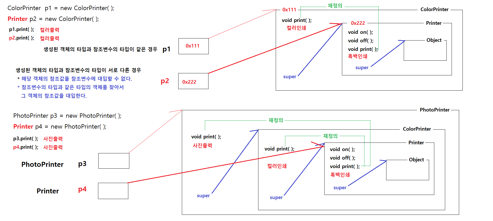
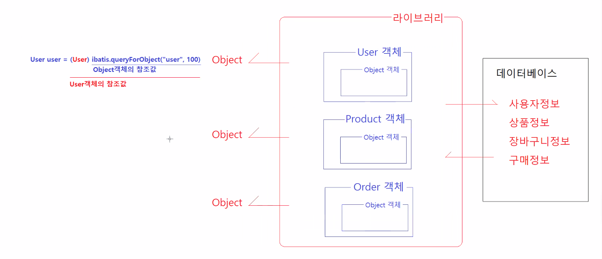
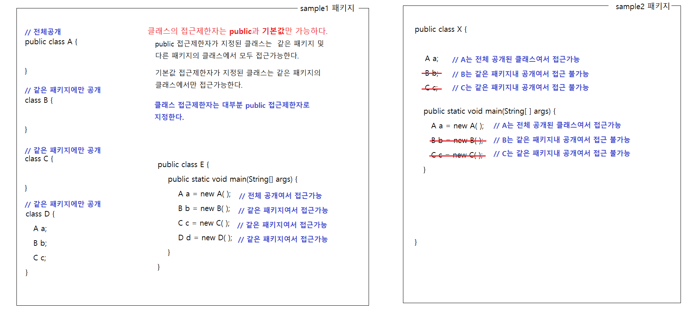
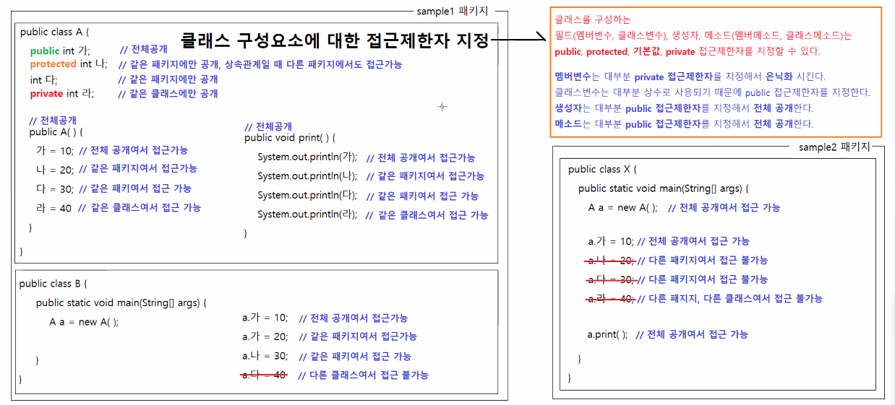
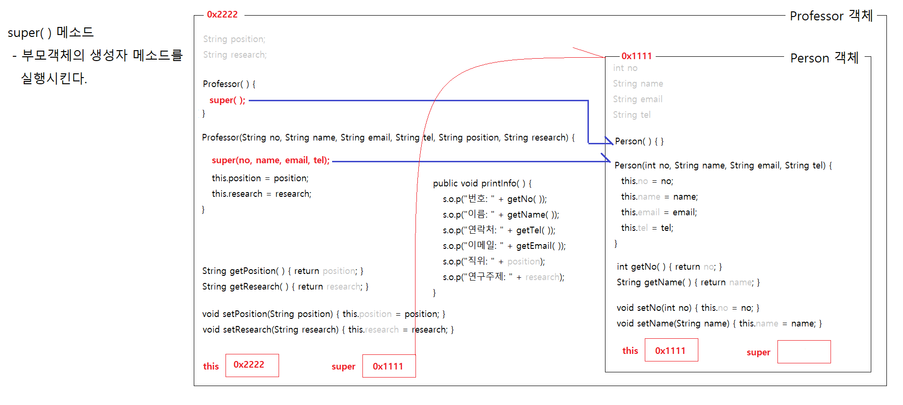
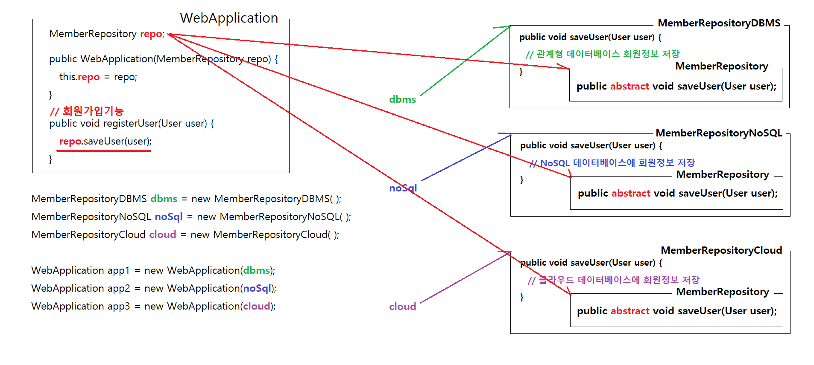

# 3/21

- [3/21](#321)
  - [클래스 형변환과 재정의](#클래스-형변환과-재정의)
    - [실습](#실습)
      - [PrinterApp4](#printerapp4)
    - [클래스 형변환 사용예시](#클래스-형변환-사용예시)
  - [접근제한자](#접근제한자)
    - [클래스의 접근제한자](#클래스의-접근제한자)
    - [접근제한자 지정](#접근제한자-지정)
    - [private](#private)
    - [import](#import)
      - [실습](#실습-1)
    - [Getter, Setter](#getter-setter)
    - [클래스의 사용방법 2가지](#클래스의-사용방법-2가지)
  - [super와 super()](#super와-super)
    - [this와 this(), super와 super()](#this와-this-super와-super)
    - [멤버변수 초기화 방법(2)](#멤버변수-초기화-방법2)
      - [실습](#실습-2)
      - [실행결과](#실행결과)
      - [쉽게 만들기 (단축키)](#쉽게-만들기-단축키)
  - [추상화](#추상화)
    - [추상메소드](#추상메소드)
    - [추상클래스](#추상클래스)
      - [실습](#실습-3)
      - [실행결과](#실행결과-1)

<small><i><a href='http://ecotrust-canada.github.io/markdown-toc/'>Table of contents generated with markdown-toc</a></i></small>

## 클래스 형변환과 재정의
* 형변환
  * 생성된 객체의 타입과 참조변수의 타입이 서로 다른 경우
    * 해당 객체의 참조값을 참조변수에 대입할 수 없다.
    * 참조변수의 타입과 같은 타입의 객체를 찾아서 그 객체의 참조값을 대입한다.



### 실습
#### PrinterApp4
```java
package sample2;

public class PrinterApp4 {
	
	public static void main(String[] args) {
		
		// Printer객체는 printer타입의 참조변수가 참조할 수 있다.
		Printer p1 = new Printer();
		// 오류 !	Printer객체는 ColorPrinter타입의 참조변수가 참조할 수 없다.
		// 오류 !	"자식타입 참조변수 = 부모타입객체"는 클래스 형변환 오류다.
//		ColorPrinter p2 = new Printer(); // 문법 오류
		// 오류 !	Printer객체는 PhotoPrinter타입의 참조변수가 참조할 수 없다.
		// 오류 !	"자식타입 참조변수 = 부모타입객체"는 클래스 형변환 오류다.
//		PhotoPrinter p3 = new Printer(); // 문법 오류
		
		p1.print();
		System.out.println();
		
		// ColorPrinter객체는 Printer타입의 참조변수가 참조할 수 있다.
		// "부모타입 참조변수 = 자식타입객체"는 클래스 형변환이 가능하다.
		Printer p4 = new ColorPrinter();
		// ColorPrinter객체는 ColorPrinter타입의 참조변수가 참조할 수 있다.
		ColorPrinter p5 = new ColorPrinter();
		// 오류 !	ColorPrinter객체는 PhotoPrinter타입의 참조변수가 참조할 수 없다.
		// 오류 !	"자식타입 참조변수 = 부모타입객체"는 클래스 형변환 오류다.
//		PhotoPrinter p6 = new ColorPrinter();
		
		p4.print();
		p5.print();
		System.out.println();
		
		// PhotoPrinter객체는 printer타입의 참조변수가 참조할 수 있다.
		// "부모타입 참조변수 = 자식타입객체"는 클래스 형변환이 가능하다.
		Printer p7 = new PhotoPrinter();
		// PhotoPrinter객체는 ColorPrinter타입의 참조변수가 참조할 수 있다.
		// "부모타입 참조변수 = 자식타입객체"는 클래스 형변환이 가능하다.
		ColorPrinter p8 = new PhotoPrinter();
		// PhotoPrinter객체는 PhotoPrinter타입의 참조변수가 참조할 수 있다. 
		PhotoPrinter p9 = new PhotoPrinter();
		p7.print();
		p8.print();
		p9.print();
	}
}

```
* 실행결과
```
인쇄물을 흑백으로 출력한다.

인쇄물을 컬러로 출력한다.
인쇄물을 컬러로 출력한다.

인쇄물을 고화질로 출력한다.
인쇄물을 고화질로 출력한다.
인쇄물을 고화질로 출력한다.
```
* 부모타입의 객체를 자식객체에 담지 못한다.
* 어느 타입에 담든 대입된 객체의 메소드가 실행된다.

### 클래스 형변환 사용예시

* 라이브러리는 User객체, Product객체, Order객체를 Object객체 타입으로 반환하는데 이중 사용자가 원하는 타입을 반환받기 위해 형변환을 사용한다.

## 접근제한자
1. public
   * 전체공개
2. protected
   * 상속관계일 때 다른 패키지에서도 접근가능
3. (default)
   * 같은 패키지에만 공개
4. private
   * 같은 클래스에만 공개

### 클래스의 접근제한자
* public과 default를 사용할 수 있다.
* 대부분 public을 사용한다.



### 접근제한자 지정


### private
* 필드의 멤버변수는 private을 사용한다.
* 멤버변수에 접근하기 위헤 생성자 메소드를 사용한다.
### import
* java.lang패키지를 제외하고 모든 패키지는 import를 사용해서 접근한다.
#### 실습
```java
package sample5.sub1;

public class SampleA {

	public int num1;	// 전체 공개
	protected int num2;	// 같은 패키지에서만 접근이 허용, 상속관계일때는 다른 패키지여도 접근이 허용
	int num3;			// 같은 패키지에서만 접근이 허용
	private int num4;	// 같은 클래스에서만 접근이 허용
	
	public SampleA() {
		
	}

	// 생성자 메소드에서는 필드의 접근제한자와 상관없이 모든 필드를 사용할 수 있다.
	public SampleA(int num1, int num2, int num3, int num4) {
		this.num1 = num1;
		this.num2 = num2;
		this.num3 = num3;
		this.num4 = num4;
	}

	// 멤버 메소드에서는 필드의 접근제한자와 상관없이 모든 필드를 사용할 수 있다.
	public void printNumbers() {
		System.out.println("number1: " + num1);
		System.out.println("number2: " + num2);
		System.out.println("number3: " + num3);
		System.out.println("number4: " + num4);
	}
}

```
```java
package sample5.sub1;

class SampleB {

}

```
```java
package sample5.sub1;

public class SampleC {

	public static void main(String[] args) {
		SampleA a = new SampleA();
		SampleB b = new SampleB();
		
		a.num1 = 100;
		a.num2 = 200;
		a.num3 = 300;
		// 오류! num4필드는 접근할 수 없다.
		//a.num4 = 400;
	}
}

```
* private로 설정된 필드 num4의 경우 SampleC에서 접근할 수 없다.
* 하지만 aa에서 한 것처럼 메소드를 통해 접근해 사용할 수 있다.
```java
package sample5.sub2;

import sample5.sub1.SampleA;
import sample5.sub1.SampleC;

// 다른 패키지의 클래스를 사용하기 위해서는 import 구문이 필요하다.

public class SampleX {

	public static void main(String[] args) {
		SampleA a = new SampleA(); // 다른클래스에 있는 패키지는 바로 사용할 수 없다. > import사용(Ctrl+space)
		SampleC c = new SampleC();
	}
}

```
```java
package sample5;

// sample5패키지의 하위 패키지인 sample5.sub1과 sample5.sub2에 있는 클래스도 반드시 import한 후 사용해야 한다.
import sample5.sub1.SampleA;
// 오류!  SampleB는 sample5.sub1 패키지에만 공개되는 클래스여서 sample5 패키지의 Sample에서는 접근할 수 없다.
//import sample5.sub1.SampleB;
import sample5.sub1.SampleC;
import sample5.sub2.SampleX;

public class Sample {

	public static void main(String[] args) {

		SampleA a = new SampleA();
		// 오류!
//		SampleB b= new SampleB();		
		SampleC c = new SampleC();
		SampleX x = new SampleX();
	}
}

```

### Getter, Setter
* private 접근제한자를 사용해 모든 멤버변수의 접근을 제한한다.(은닉화)
* Getter메소드를 통해 멤버변수의 값을 조회한다.
* Setter메소드를 통해 멤버변수의 값을 변경한다.
* Getter, Setter메소드는 필수는 아니지만 거의 항상 제공한다.
* 생성자를 제공할 경우 Getter메소드를 제공하지 않는다. (멤버변수의 값을 고정시켜 사용할 경우)
### 클래스의 사용방법 2가지
1. 프로그램의 데이터를 저장할 목적으로 설계된 클래스
   * 부르는 이름 : 
     * VO (Value Object)
     * DTO (Data Transfer Object)
     * Entity
   * 예시
     * Book.java, User.java, Product.java, CartItem.java, ...
        ```java
        public class Book{
            // 모든 멤버변수는 private 접근제한으로 한다.
            private int no;
            private String title;
            private String author;
            private int price;
            private boolean isOnSell; // 불린타입의 멤버변수는 is혹은 has 접두사를 붙인다.
            
            // 멤버변수의 값을 조회하는 Getter메소드를 제공한다. Getter메소드를 제공하지 않아도 된다.
            // Getter메소드의 형식
            //          접근제한자 : public 
            //          반환타입 : 해당 변수의 타입
            //          메소드명 : get + 해당변수명의 첫글자를 대문자로 변경한 이름
            //          매개변수 : 없음
            //          구현코드 : return 변수명
            public int getNo() {
                return no;
            }
            public String getTitle() {
                return title;
            }
            public String getAuthor() {
                return author;
            }
            public int getPrice() {
                return price;
            }
            public boolean isOnSell() {     // 불린타입의 변수명이 is로 시작하면 그 변수명의 이름이 메소드명이 된다.
                return isOnSell;
            }

            // 멤버변수의 값을 변경하는 Setter메소드를 제공한다. Setter메소드를 제공하지 않아도 된다.
            // Setter메소드의 형식
            //          접근제한자 : public
            //          반환타입 : void
            //          메소드명 : set + 해당변수의 첫글자를 대문자로 변경한 이름
            //          매개변수 : 해당 변수의 타입 및 이름과 똑같이 지정
            //          구현코드 : this.변수명 = 매개변수명;    // 변수명과 매개변수명이 서로 같다.
            public void setNo(int no) {
                this.no = no;
            }
            public void setTitle(String title) {
                this.title = title;
            }
            public void setAuthor(String author) {
                this.author = author;
            }
            public void setPrice(int price) {
                this.price = price;
            }
            public void setOnSell(boolean isOnSell) { // 불린타입의 변수명이 is로 시작하면 is를 제외한 변수명의 첫글자는 대문자로 변경한 이름과 set을 합쳐서 만든다.
                this.isOnSell = isOnSell;
            }
        }
        ```
2. 기능을 구현하기 위해 사용
   * UserRepository.java, 

## super와 super()
* super()는 부모객체의 생성자 메소드를 의미한다.
* 자식객체의 생성자 메소드 실행시 super()를 먼저 실행한다. 즉 부모객체부터 먼저 초기화한다.



### this와 this(), super와 super()
* this는 생성된 객체 자신의 참조값을 가진다.
* this()메소드 생성된 객체의 생성자 메소드다.

* super는 부모객체의 참조값을 가진다.
* super()메소드는 부모객체의 생성자 메소드다.

### 멤버변수 초기화 방법(2)
* 멤버변수 초기화하기
  * Setter 메소드
    * 장점
      * 어떤 멤버변수가 초기화되는지 한번에 파악할 수 있다.
      * 멤버변수를 여러 조합으로 초기화할 수 있다.
    * 단점
      * 초기화 코드량이 많다.
      * 언제든지 Setter메소드로 값을 변경해 버릴 수 있다.

  * 매개변수가 있는 생성자 메소드
    * 장점
      * 여러 멤버변수를 한번에 초기화할 수 있다.
      * Setter메소드를 제공하지 않으면 객체 생성시 설전된 초기화 값을 함부로 바꾸지 못하게 할 수 있다.

    * 단점
      * 매개변수의 개수가 많을 때, 순서를 틀릴 수 있다.
      * 다양한 조합으로 멤버변수를 초기화하기 위해서는 모든 경우의 수에 해당하는 생성자 메소드를 중복정의해야 한다.

* 둘다 일장일단이 있고 더 중요한 문제(보안, 데이터저장 등)가 많기 때문에 '무엇을 사용할것인가'하는 문제는 크게 중요하지 않다.
#### 실습
```java
package sample4;

public class Person {

	private int no;
	private String name;
	private String tel;
	private String email;

	public Person(int no, String name, String tel, String email) {
		this.no = no;
		this.name = name;
		this.tel = tel;
		this.email = email;
	}
	
	public Person() {

	}

	public int getNo() {
		return no;
	}
	public void setNo(int no) {
		this.no = no;
	}
	public String getName() {
		return name;
	}
	public void setName(String name) {
		this.name = name;
	}
	public String getTel() {
		return tel;
	}
	public void setTel(String tel) {
		this.tel = tel;
	}
	public String getEmail() {
		return email;
	}
	public void setEmail(String email) {
		this.email = email;
	}
}

```
```java
package sample4;

public class Employee extends Person {

	private String dept;
	private int salary;
	
	public Employee(int no, String name, String tel, String email, String dept, int salary) {
		super(no, name, tel, email); // Person객체의 Person(int, String, String, String, String) 생성자 메소드 호출
		this.dept = dept;
		this.salary = salary;
	}
	
	public String getDept() {
		return dept;
	}
	public void setDept(String dept) {
		this.dept = dept;
	}
	public int getSalary() {
		return salary;
	}
	public void setSalary(int salary) {
		this.salary = salary;
	}
	
	public void printInfo() {
		System.out.println("번호: " + getNo());
		System.out.println("이름: " + getName());
		System.out.println("전화번호: " + getTel());
		System.out.println("이메일: " + getEmail());
		System.out.println("소속부서: " + dept);
		System.out.println("급여: " + salary);
	}
}

```
* super(name, email, tel, email)은 Person객체의 중복 생성자 메소드 `Person(int, String, String, String)`을 가리킨다.
```java
package sample4;

public class Professor extends Person {

	private String position;
	private String research;
	
	public Professor() {
		super();	// Person객체의 Person() 생성자 메소드를 호출한다. 컴파일러가 자동으로 추가
	}
	
	public Professor(int no, String name, String tel, String email, String position, String research) {
//		super(); // 개발자가 직접 super(int, String, String, String) 메소드를 추가했기 때문에
				 // Person 객체의 Person() 생성자 메소드를 호출하는 super()가 자동으로 추가되지 않는다.
		super(no, name, tel, email);
		this.position = position;
		this.research = research;
	}
	
	public String getPosition() {
		return position;
	}
	public void setPosition(String position) {
		this.position = position;
	}
	public String getResearch() {
		return research;
	}
	public void setResearch(String research) {
		this.research = research;
	}
	
	public void printInfo() {
		System.out.println("번호: " + getNo());
		System.out.println("이름: " + getName());
		System.out.println("전화번호: " + getTel());
		System.out.println("이메일: " + getEmail());
		System.out.println("직위: " + position);
		System.out.println("연구주제: " + research);
	}
}

```
```java
package sample4;

public class PersonApp {

	public static void main(String[] args) {
		
		// 기본생성자메소드와 Setter 메소드를 사용해서 객체의 멤버변수를 초기화하기
		Employee emp1 = new Employee();
		emp1.setNo(100);				// emp1.no = 100; 오류! no필드가 private 접근제한으로 지정되어 있음.
		emp1.setName("홍길동");
		emp1.setTel("010-1234-5678");
		emp1.setDept("영업1팀");
		emp1.setSalary(3500000);
		
		emp1.printInfo();
		System.out.println();
		
		// 기본 생성자메소드 대신, 매개변수가 있는 생성자메소드를 사용해서 객체의 멤버변수를 초기화하기
		Employee emp2 = new Employee(200, "강감찬", "010-1111-2222", "kang@gmail.com", "개발2팀", 4000000);
		emp2.printInfo();
		System.out.println();
		
		/*
		 * 멤버변수 초기화하기
		 * 		Setter 메소드
		 * 			- 장점
		 * 				어떤 멤버변수가 초기화되는지 한번에 파악할 수 있다.
		 * 				멤버변수를 여러 조합으로 초기화할 수 있다.
		 * 			- 단점
		 * 				초기화 코드량이 많다.
		 * 				언제든지 Setter메소드로 값을 변경해 버릴 수 있다.
		 * 
		 * 		매개변수가 있는 생성자 메소드
		 * 			- 장점
		 * 				여러 멤버변수를 한번에 초기화할 수 있다.
		 * 			- 단점
		 * 				매개변수의 개수가 많을 때, 순서를 틀릴 수 있다.
		 * 				다양한 조합으로 멤버변수를 초기화하기 위해서는 모든 경우의 수에 해당하는 생성자 메소드를 중복정의해야 한다.
		 * 				
		 */
	}
}

```
#### 실행결과
```
번호: 100
이름: 홍길동
전화번호: 010-1234-5678
이메일: null
소속부서: 영업1팀
급여: 3500000

번호: 200
이름: 강감찬
전화번호: 010-1111-2222
이메일: kang@gmail.com
소속부서: 개발2팀
급여: 4000000
```
#### 쉽게 만들기 (단축키)
```java
package sample4;

public class Student extends Person {

	private int grade;
	private String deptname;
	
	public Student() {

	}
		
	public Student(int no, String name, String tel, String email, int grade, String deptname) {
		super(no, name, tel, email);
		this.grade = grade;
		this.deptname = deptname;
	}

	public int getGrade() {
		return grade;
	}
	
	public String getDeptname() {
		return deptname;
	}
	
	public void setGrade(int grade) {
		this.grade = grade;
	}
	
	public void setDeptname(String deptname) {
		this.deptname = deptname;
	}
}
```
* 초기화용 기본 생성자 메소드는 'Student ctrl+space'
* Getter, Setter메소드는 'getG ctrl+space', 'setG ctrl+space'와 같이 일부 입력 후 '자동완성' 기능을 이용해 쉽게 만들 수 있다.
* 마우스 우클릭 > Source > 'Generate ~' 기능으로도 쉽게 만들 수 있다.

## 추상화
* 객체에서 공통된 속성과 기능을 추출하는 것
* 자바에서 추상화는 공통된 속성과 기능을 모아서 추상클래스나 인터페이스를 정의하는 것

### 추상메소드
```java
abstract void sample();
```
* 공통기능을 추상화 하는 메소드
* 구현부가 없는 메소드 
  * `{}`가 없다.
* 일반클래스(구현클래스)는 추상메소드를 보유할 수 없다.
* 만약 추상메소드를 상속받았다면 반드시 메소드 재정의를 통해서 구현부가 있는 메소드로 만들어야 한다.
### 추상클래스
```java
public abstract class Sample {

}
```
* 추상화된 추상메소드를 가지는 클래스
* new키워드를 사용해서 객체 생성할 수 없다.
* 목적 :
  * 하위 클래스들이 반드시 구현할 기능을 추상메소드를 통해서 추상화한다.(공통적인 속성, 기능을 추출한다.)
  * 모든 하위 클래스의 공통 기능을 추상클래스에서 구현해 상속시킴으로써 하위 클래스의 구현부담을 경감시킨다.
    * 추상클래스를 상속받으면 많은 공통적인 기능을 직접 구현할 필요가 없고 구체적인 코드를 몰라도 사용할 수 있다.
    * 
      * MemberRepository 추상클래스의 공통기능 removeUser()를 Cloud, DB에서 상속받아 재정의하였다.
      * WebApplication에서 생성자의 인자로 객체를 전달받거나 Setter메소드의 인자로 객체를 전달받아 repo에 연결할 수 있다.
      * repo에 MemberRepository와 연결되었고 핵심기능인 '회원탈퇴'를 사용할 수 있다.
        * 핵심기능은 객체간 조립이 끝나고(연결이 완료되고) 사용해야 한다.
      * App.java에서 cloud와 db객체를 전달받은 web1, web2가 setRepo()라는 Setter메소드로 사용할 수 있는 것을 확인할 수 있다.
#### 실습
```java
package sample6;

// 추상 클래스, 추상 메소드(구현부가 없는 메소드)를 포함할 수 있는 클래스다.
// 추상 클래스는 멤버변수, 정적변수, 생성자, 멤버메소드, 정적메소드도 포함될 수 있다.
// 추상 클래스는 new 키워드로 객체생성할 수 없다.
public abstract class MemberRepository {

	// 추상 메소드
	public abstract void removeUser(String username);
}

```

```java
package sample6;

public class MemberRepositoryCloud extends MemberRepository {

	@Override	// 어노테이션(Annotation). 통합개발환경툴, 컴파일러, 프레임워크에게 부가적인 정보를 제공한다.
				// @Override는 방식에 어긋나게 재정의된 메소드를 의미한다.
				// MemberRepository로부터 상속받은 추상메소드를 재정의하였다.
				// 재정의를 안하면 컴파일이 되지 않기 때문에 무조건 해야한다.
				// MemberRepository에서 빨간색을 오류표시가 뜨지만 작동된다.
	public void removeUser(String username) {
		System.out.println("클라우드에서 " + username + " 사용자 정보를 삭제함.");
	}
}

```

```java
package sample6;

public class MemberRepositoryDB extends MemberRepository {
	
	@Override
	public void removeUser(String username) {
		System.out.println("관계형 데이터베이스에서 " + username + " 사용자 정보를 삭제함");
	}
}

```

```java
package sample6;

public class WebApplication {

	// MemberRepository객체 혹은 그 자식객체와 연결할 참조변수를 정의하였음
	private MemberRepository repo;
	
	public WebApplication() {
		
	}
	
	// 생성자의 인자로 MemberRepository률 객체를 전달받아서 멤버변수 repo에 연결한다.
	public WebApplication(MemberRepository repo) {
		this.repo = repo;
	}
	
	// Setter 메소드의 인자로 MemberRepository류 객체를 전달받아서 멤버변수 repo에 연결한다.
	public void setRepo(MemberRepository repo) {
		this.repo = repo;
	}
	
	
	// WebApplication객체의 핵심 기능이다.
	// 핵심기능은 WebApplication객체와 다른 객체의 조립이 완료된 다음에 사용해야 한다.
	public void 회원탈퇴(String name) {
		repo.removeUser(name);
	}
}

```
```java
package sample6;

public class App {

	public static void main(String[] args) {
		
		MemberRepositoryCloud cloud = new MemberRepositoryCloud();
		MemberRepositoryDB db = new MemberRepositoryDB();
		
		WebApplication web1 = new WebApplication(cloud);
		
		WebApplication web2 = new WebApplication();
		web2.setRepo(db);
		
		web1.회원탈퇴("홍길동");
		web2.회원탈퇴("김유신");
	}
}

```
#### 실행결과
```
클라우드에서 홍길동 사용자 정보를 삭제함.
관계형 데이터베이스에서 김유신 사용자 정보를 삭제함
```