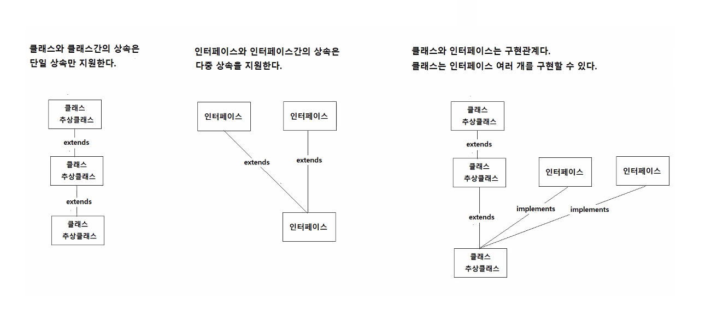
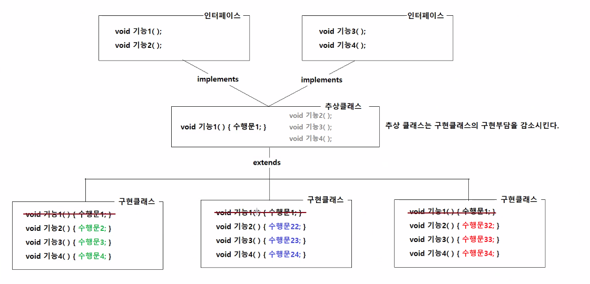
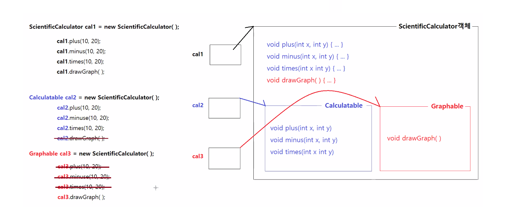
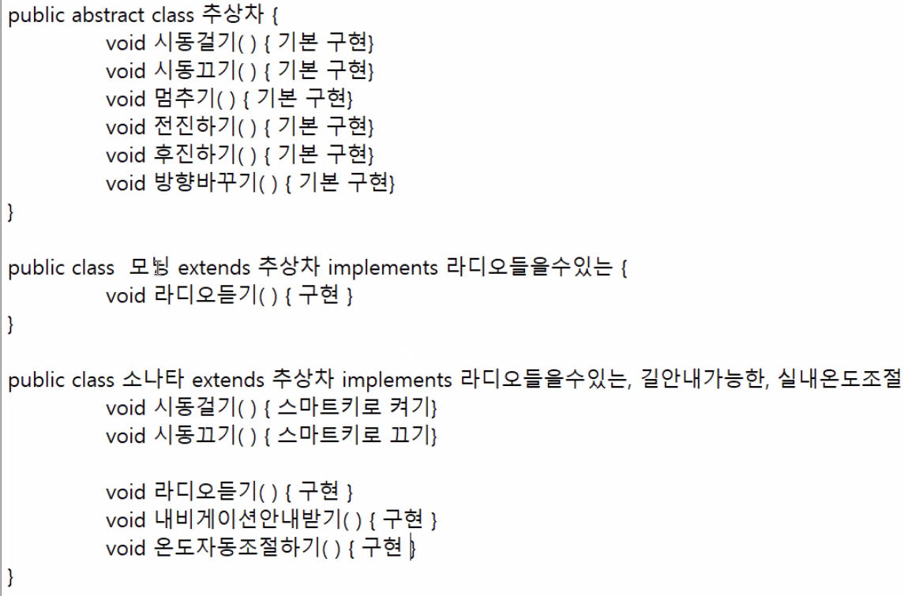
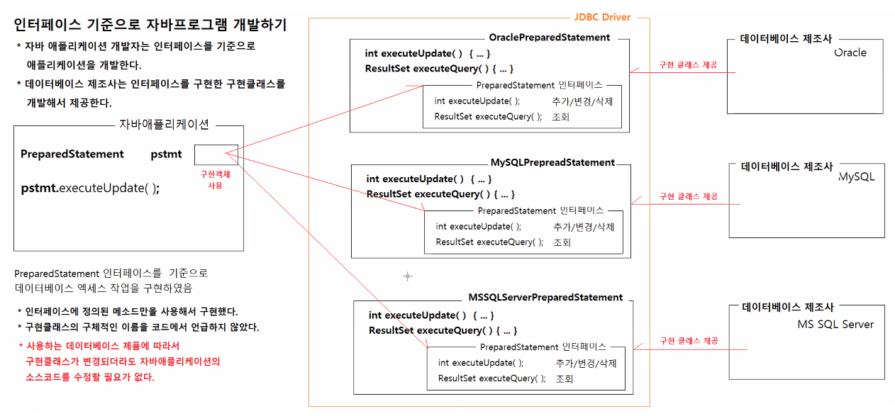
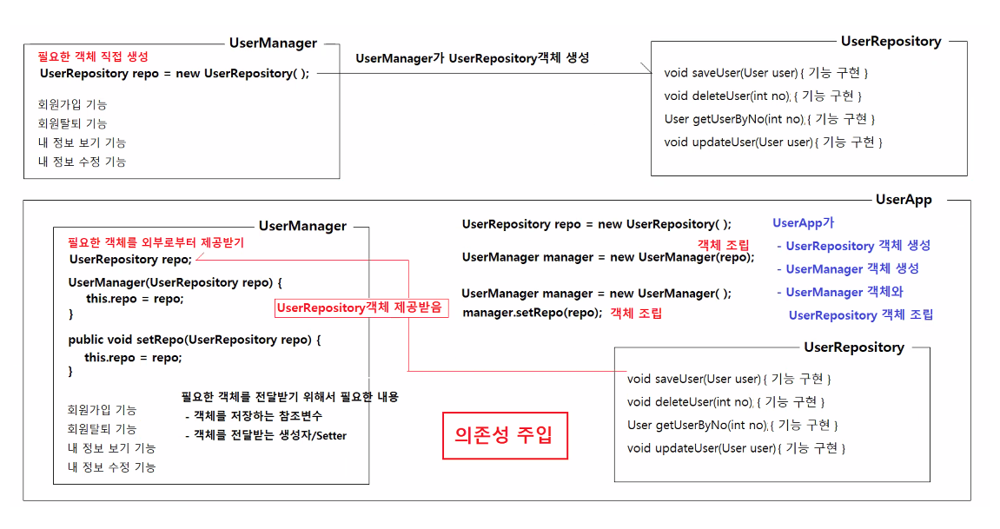
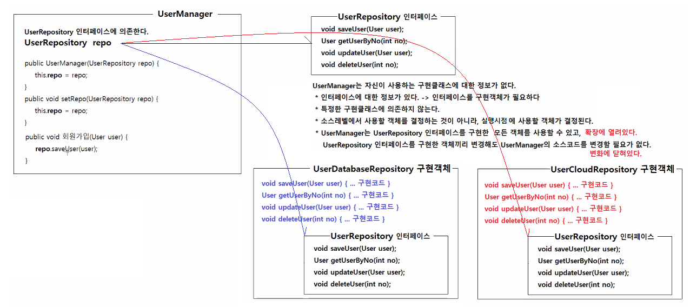

# 3/22

- [3/22](#322)
  - [추상화](#추상화)
    - [추상화의 목적](#추상화의-목적)
    - [추상화의 효과](#추상화의-효과)
    - [추상화의 방법](#추상화의-방법)
      - [실습1](#실습1)
      - [실행결과](#실행결과)
      - [실습2](#실습2)
      - [실행결과](#실행결과-1)
      - [실습3](#실습3)
    - [상속과 구현](#상속과-구현)
    - [구현클래스 만들기](#구현클래스-만들기)
  - [인터페이스](#인터페이스)
    - [JDBC와 인터페이스](#jdbc와-인터페이스)
    - [인터페이스의 특징](#인터페이스의-특징)
    - [인터페이스 정의하기](#인터페이스-정의하기)
    - [클래스에서 인터페이스 구현하기](#클래스에서-인터페이스-구현하기)
    - [인터페이스의 활용](#인터페이스의-활용)
      - [실습](#실습)
  - [의존성 주입](#의존성-주입)
    - [객체지향 설계 5원칙](#객체지향-설계-5원칙)
    - [참고](#참고)

<small><i><a href='http://ecotrust-canada.github.io/markdown-toc/'>Table of contents generated with markdown-toc</a></i></small>

## 추상화
* 자식 클래스가 반드시 구현해야할 기능을 추상클래스나 인터페이스를 이용해서 추상화하는 것이다.
* 추상화할 기능은 추상 메소드로 정의한다.
  * 추상 메소드는 구현부가 없는 메소드
  * 추상 메소드는 추상클래스와 인터페이스에 정의할 수 있다.
  * 구현 클래스는 추상 메소드를 포함할 수 없다.
* 추상 메소드를 포함하고 있는 추상클래스나 인터페이스를 상속받는 구현 클래스는 반드시 추상 메소드를 재정의해야 한다.
  * 같은 추상 클래스나 인터페이스를 상속받은 서로 다른 구현 클래스들은 전부 추상 메소드를 재정의하고 있으므로, 클래스는 서로 다르지만 같은 사용법(반환타입, 메소드이름, 매개변수 구성이 동일하다.)으로 해당 기능을 구현하게 된다.
* 추상화는 자식클래스가 반드시 구현할 기능을 정의할 때 사용한다.
  * 추상화된 메소드를 자식 클래스(구현 클래스)에서 재정의하지 않으면 자식클래스는 컴파일되지 않는다.
* 추상화는 자식클래스에게 메소드 재정의를 강제시킨다.

### 추상화의 목적
* 자식 클래스(구현 클래스)에게 메소드 재정의 강제
* 자식 클래스(구현 클래스)가 반드시 구현할 기능을 정의
* 모든 자식 클래스(구현 클래스)가 추상화된 기능을 구현하도록 강제한다.

### 추상화의 효과
* 모든 자식 클래스 (구현 클래스)는 같은 부모타입의 참조변수로 클래스 형변환할 수 있다(상속)
* 부모타입의 참조변수로 모든 자식 객체에 재정의된 메소드를 실행할 수 있다.(메소드 재정의)

### 추상화의 방법
* 추상 클래스
  * 추상 메소드를 포함할 수 있는 클래스다.
  * 멤버변수, 클래스 변수, 생성자, 멤버메소드, 클래스메소드, 추상메소드를 모두 포함할 수 있다.
  * 추상 메소드의 포함여부와 상관없이 new키워드로 객체생성할 수 없다.
  * 형식
    ```java
    public abstract class Sample {
        private int x;                     // 멤버변수
        private static int y;              // 클래스변수

        public Sample(){}                  // 생성자
        public Sample(int x) {       // 생성자
            this.x = x;
        }
        public void printX() {              // 멤버메소드
            System.out.println(x);
        }
        public static void printY() {       // 정적메소드
            System.out.println(Sample.y);
        }
        public abstract void work();        // 추상메소드
        public abstract boolean isExist();  // 추상메소드
    }
    ```
    ```java
    // 구현 클래스에서 추상 메소드 재정의
    public class SampleChild1 extends Sample {
        @Override
        public void work() {
            // 수행문;
        }
        @Override
        public boolean isExist() {
            // 수행문;
        }
    }
    ```
    ```java
    // 구현 클래스에서 추상 메소드 재정의
    public class SampleChild2 extends Sample {
        @Override
        public void work() {
            // 수행문;
        }
        @Override
        public boolean isExist() {
            // 수행문;
        }
    }
    ```
* 인터페이스
  * 추상 메소드를 포함한다.
  * 멤버변수, 생성자, 멤버메소드를 포함할 수 없다.
  * 상수, 정적메소드, 디폴트 메소드, 추상메소드를 포함할 수 있다.(정적메소드와 디폴트 메소드는 java8버전부터 가능합니다.)
    * 일반적으로 개발자가 정의하는 인터페이스는 추상메소드만으로 구성되는 경우가 대부분이다.
  * 인터페이스는 new 키워드로 객체생성할 수 없다.
  * 인터페이스와 인터페이스는 다중 상속이 허용된다.
  * 구현 클래스 하나가 한 번에 여러 개 인터페이스를 상속(구현)할 수 있다.
  * 
  * 형식
    ```java
    // 인터페이스에 상수와 추상 메소드 정의하기
    public interface SampleInterface1 {
        public static final int MAX_UPLOAD_FILE_SIZE = 1024*1024*10;        // 상수를 포함할 수 있다.
        int MAX_ONCE_UPLOAD_FILES = 5;                                      // public static final를 생략할 수 있다.

        public abstract void saveFile(String directory, String filename);   // 추상메소드를 포함할 수 있다.
        void downloadFile(String directory, String filename);               // public abstract를 생략할 수 있다.
    }  
    // 인터페이스에 상수와 추상 메소드 정의하기
    public interface SampleInterface2 {
        void copy(File src, File dest);                                     // 추상 메소드를 포함할 수 있다.
        void copy(InputStream src, OutputStream dest);                      // 추상 메소드를 포함할 수 있다.
    }
    // 구현클래스에서 인터페이스 하나 구현하기
    public class FileUploadDownloadService implements SampleInterface1 {
        public void saveFile(String directory, String filename) {
            // 수행문1;
        }
        public void downloadFile(String directory, String filename) {
            // 수행문2;
        }
    }
    // 구현클래스에서 인터페이스 여러개 구현하기
    public class FileService implements SampleInterface1, SampleInterface2 {
        public void saveFile(String directory, String filename) {
            // 수행문3;
        }
        public void downloadFile(String directory, String filename) {
            // 수행문4;
        }
        public void copy(File src, File dest) {
            // 수행문5;
        }
        public void copy(InputStream src, OutputStream dest) {
            // 수행문6;
        }
    }
    ```
    
    * 공통된 기능인 기능1()을 추상클래스에서 추상화하고 구현클래스의 구현부담을 감소시킨다.

#### 실습1
```java
package sample7;

/**
 * 모든 계산기 객체가 반드시 구현할 기능을 추상화하는 인터페이스.
 * @author HOME
 *
 */
public interface Calculatable {

	void plus(int x, int y);
	void minus(int x, int y);
	void times(int x, int y);
}

```
```java
package sample7;

/**
 * Calculatable 인터페이스의 추상화된 기능을 구현한 구현 클래스다.
 * @author HOME
 *
 */
public class SimpleCalculator implements Calculatable {

	@Override
	public void plus(int x, int y) {
		System.out.println("덧셈결과: " + (x + y));
	}

	@Override
	public void minus(int x, int y) {
		System.out.println("뺄셈결과: " + (x - y));
	}

	@Override
	public void times(int x, int y) {
		System.out.println("곱셈결과: " + (x * y));
	}
}

```
```java
package sample7;

public class CalculatorApp {

	public static void main(String[] args) {
		
		SimpleCalculator calculator1 = new SimpleCalculator();
		calculator1.plus(100, 200);
		calculator1.minus(100, 200);
		calculator1.times(100, 200);
		
		// 부모 인터페이스 타입의 참조변수에 자식 객체의 참조값을 저장할 수 있다.(클래스 형변환)
		Calculatable calculator2 = new SimpleCalculator();
		calculator2.plus(400, 200);
		calculator2.minus(400, 200);
		calculator2.times(400, 200);
	}
}

```
#### 실행결과
```
덧셈결과: 300
뺄셈결과: -100
곱셈결과: 20000
덧셈결과: 600
뺄셈결과: 200
곱셈결과: 80000

```
#### 실습2
```java
package sample7;

/**
 * 계산 결과를 그래프로 출력하는 객체가 반드시 구현해야 할 기능을 추상화한 인터페이스다.
 * @author HOME
 *
 */
public interface Graphable {

	void drawGraph();
}

```
```java
package sample7;

public class ScientificCalculator implements Calculatable, Graphable {

	@Override
	public void drawGraph() {
		System.out.println("계산결과를 그래프로 출력한다.");
	}

	@Override
	public void plus(int x, int y) {
		System.out.println("덧셈결과: " + Integer.toBinaryString(x + y));
		System.out.println("덧셈결과: " + Integer.toOctalString(x + y));
		System.out.println("덧셈결과: " + (x + y));
		System.out.println("덧셈결과: " + Integer.toHexString(x + y));
		System.out.println();
	}

	@Override
	public void minus(int x, int y) {
		System.out.println("뺄셈결과: " + Integer.toBinaryString(x - y));
		System.out.println("뺄셈결과: " + Integer.toOctalString(x - y));
		System.out.println("뺄셈결과: " + (x - y));
		System.out.println("뺄셈결과: " + Integer.toHexString(x - y));
		System.out.println();
	}

	@Override
	public void times(int x, int y) {
		System.out.println("곱셈결과: " + Integer.toBinaryString(x * y));
		System.out.println("곱셈결과: " + Integer.toOctalString(x * y));
		System.out.println("곱셈결과: " + (x * y));
		System.out.println("곱셈결과: " + Integer.toHexString(x * y));
		System.out.println();
	}

}

```
```java
package sample7;

public class CalculatorApp2 {

	public static void main(String[] args) {
		
		ScientificCalculator calculator1 = new ScientificCalculator();
		calculator1.plus(10, 20);
		calculator1.minus(10, 20);
		calculator1.times(10, 20);
		calculator1.drawGraph();

	}
}

```
#### 실행결과
```
덧셈결과: 11110
덧셈결과: 36
덧셈결과: 30
덧셈결과: 1e

뺄셈결과: 11111111111111111111111111110110
뺄셈결과: 37777777766
뺄셈결과: -10
뺄셈결과: fffffff6

곱셈결과: 11001000
곱셈결과: 310
곱셈결과: 200
곱셈결과: c8
계산결과를 그래프로 출력한다.
```
* 프로그램에서 음수는 32자리 가장 앞부터 1이 이어지는 형태다.

#### 실습3
```java
package sample7;

public class CalculatorApp2 {

	public static void main(String[] args) {
		
		ScientificCalculator calculator1 = new ScientificCalculator();
		calculator1.plus(10, 20);
		calculator1.minus(10, 20);
		calculator1.times(10, 20);
		calculator1.drawGraph();
		
		Calculatable calculator2 = new ScientificCalculator();
		calculator2.plus(10, 20);
		calculator2.minus(10, 20);
		calculator2.times(10, 20);
//		calculator2.drawGraph();
		
		Graphable calculator3 = new ScientificCalculator();
//		calculator3.plus(10, 20);
//		calculator3.minus(10, 20);
//		calculator3.times(10, 20);
		calculator3.drawGraph();

	}
}

```
* calculator2.drawGraph(), calculator3.plus() minus() times()는 오류
* 인터페이스도 implements한 (구현관계인) 클래스 객체를 대입받은 참조변수의 타입으로 사용할 수 있다.
* 하지만 상속과 마찬가지로 각 인터페이스에서 접근가능한 기능만 사용할 수 있다.
* cal2, cal3 모두 ScientificCalculator에서 재정의된 메소드가 실행된다.


### 상속과 구현

* 상속은 한번만 가능하다.
* 구현(implements)은 여러개 가능하다.
* 상속은 내용 전체를 상속받는다.
* 구현은 원하는 기능만 구현받을 수 있다.
* 상속에서 공통기능을 구현하여 구현클래스에서 따로 기능을 만들지 않을 수 있다.
* 구현에서 공통된 클래스가 있을 수 있으나 모든 클래스가 공통되지 않는 기능의 경우 구현을 사용해 하나씩 implements를 한다.
* 특정 인터페이스를 구현했다는 것은 특정한 기능을 구현했다는 것이다.

### 구현클래스 만들기
* 부모클래스를 **상속**해서 자식클래스 만들기
  * 부모클래스의 속성과 기능을 그대로 상속받기 떄문에 빠르게 자식클래스를 작성할 수 있다.
  * 자식클래스에서는 해당 클래스의 고유한 속성과 고유한 기능만 구현하면 된다.
    * 클래스를 상속해서 자식 클래스를 작성하면 적은 코드량으로 비슷한 기능을 가지는 구현 클래스를 빠르게 작성할 수 있다.
    * 상속은 부모클래스와 비슷한 자식 클래스를 작성하는 것이 목적이다.

* 부모인터페이스를 **구현**해서 자식클래스 만들기
  * 부모인터페이스에 추상화된 기능을 구현하는 자식클래스를 작성할 수 있다.
  * 같은 부모 인터페이스를 구현한 자식클래스는 추상된 기능을 메소드 재정의를 통해서 전부 구현하고 있다.(사용법이 동일하다.)
    * 인터페이스를 구현해서 자식 클래스를 작성하면 사용법이 동일한 다양한 구현 클래스를 작성할 수 있다.
    * 구현은 인터페이스를 이용해서 기능을 추상화하고 그 기능을 다양한 방법으로 구현한 구현 클래스를 작성하는 것이 목적이다.
      * 이 경우에 인터페이스는 구현클래스가 구현할 기능에 대한 표준이 된다.
  * 구현클래스가 구현할 기능들을 여러 개의 인터페이스로 분리하고, 인터페이스를 조합해서 다양한 구성을 가지는 구현 클래스를 작성할 수 있다
    * 구현 클래스가 특정 인터페이스를 구현한다는 것은 그 인터페이스에 추상화된 기능을 구현해서 제공한다는 것을 뜻한다.


## 인터페이스
* 하위 클래스에 특정한 메소드가 반드시 존재하도록 강제할 때 사용
* 사용법(메소드의 실행방법)을 통일시키는 표준으로 사용된다.

### JDBC와 인터페이스

* DB개발자와 자바개발자는 JDBC 표준(인터페이스)으로 개발한다.

### 인터페이스의 특징
1. 자바8 버전부터 정적 메소드와 디폴트 메소드가 추가되었다.
2. 인터페이스끼리는 다중 상속이 가능하다.
3. 인터페이스에서 정의하는 모든 추상메소드는 public 접근제한을 가진다.
4. 인터페이스에서 정의하는 모든 추상메소드는 접근제한자와 abstract 키워드를 생략할 수 있다.
5. 인터페이스는 new 키워드를 사용해서 객체 생성할 수 없다.
6. 인터페이스 타입의 참조변수는 하위 객체를 참조할 수 있다.
### 인터페이스 정의하기
```java
  public interface Phone {
    // 상수
    public static final String MOBILE_TELECOMMUNICATION = "LTE";
    // 추상 메소드(모든 하위 클래스 반드시 존재해야하는 기능은 추상메소드로 추상화)
    void call();
    void sms();
    // 디폴트 메소드(모든 하위클래스가 동일하게 구현하는 기능은  디폴트 메소드로 인터페이스에서 구현)
    default void on() {
      전원 켜기
    }
    default void off() {
      전원 끄기
    }
  }
```
### 클래스에서 인터페이스 구현하기
* 클래스는 implements 키워드를 사용해서 구현할 인터페이스를 지정한다.
* 한 개의 인터페이스 구현하기
```java
  public interface Calculatable {
    void addNumber(int x, int y);
    int plus();
    int minus();
  }

  public class SimpleCalculator implements Calculatable {
    int x;
    int y;
    public void addNumber(int x, int y) {
      this.x = x;
      this.y = y;
    }
    public int plus() {
      return x + y;
    }
    public int minus() {
      return x - y;
    }
  }
```
* 한 개 이상의 인터페이스 구현하기
```java
  // 모든 하위 클래스가 반드시 포함해야 되는 기능을 정의한 인터페이스
  public interface phone {
    void call();
    void sms();
  }
  // 인증 기능을 지원하는 모든 하위 클래스가 반드시 포함해야 되는 기능을 정의한 인터페이스
  public interface Authenticatable {
    void auth();
  }
  // 인터넷 기능을 지원하는 모든 하위 클래스가 반드시 포함해야 되는 기능을 정의한 인터페이스
  public interface InternetAvailable {
    void web();
  }

  // Phone 인터페이스를 구현한 NormalPhone
  public class NormalPhone implements Phone {
    String tel;
    public void call() {
      통화하기
    }
    public void sms() {
      문자보내기
    }
  }
  // NormalPhone 클래스를 상속받고, Authenticatable인터페이스와 IntenetAvailable인터페이스를 구현하는 클래스
  public class SmartPhone extends NormalPhone implements Authenticatable, InternetAvailable {
    String ip;
    public void auth() {
      사용자 인증하기
    }
    public void web() {
      인터넷하기
    }
  }
```
### 인터페이스의 활용
* 인터페이스를 이용해서 하위 클래스의 사용법을 통일시킬 수 있다.
* 인터페이스를 이용하면 클래스 개발자와 클래스 사용자의 협업이 쉬워진다.
* 개발시간을 단축시킬 수 있다.
* 표준화가 가능하다
  * 프로젝트에서 사용되는 구현클래스에 대한 기본 틀(기본 설계도)을 인터페이스로 작성한다.
  * 개발들에게 인터페이스를 기본 설계도로 삼아서 구현하게 하면 일관되고, 정형화된 프로그램 개발이 가능하다.
* 인터페이스를 사용하면 클래스간의 관계를 느슨하게 유지할 수 있다.
  * 클래스간의 관계가 느슨하면 다른 클래스로 교체할 때, 수정할 코드가 줄어든다.

#### 실습
* Banking
```java
package sample8;

public abstract class Banking {

	// 전처리작업은 요청업무와 상관없이 구현내용이 동일한 작업이다.
	private void 전처리작업수행하기() {
		System.out.println("전처리업무: 요청메세지를 받는다.");
		System.out.println("전처리업무: 암호화된 요청메세지를 평문으로 변환한다.");
		System.out.println("전처리업무: 은행 코어 시스템과 연결한다.");
	}
	
	// 후처리작업은 요청업무와 상관없이 구현내용이 동일한 작업이다.
	private void 후처리작업수행하기() {
		System.out.println("후처리업무: 은행 코어 시스템과 연결을 해제한다.");
		System.out.println("후처리업무: 처리결과를 암호화해서 응답메세지로 보낸다.");
	}
	
	// 핵심업무는 요청업무에 따라서 구현내용이 변하는 작업이다.
	public abstract void 핵심업무수행하기();
	
	public void 은행업무실행하기() {
		전처리작업수행하기();
		핵심업무수행하기();
		후처리작업수행하기();
	}
}

```
```java
package sample8;

public class BankingTransaction extends Banking {
	
	@Override
	public void 핵심업무수행하기() {
		System.out.println("핵심업무: 이체업무 수행 시작");
		System.out.println("핵심업무: 이체작업 수행");
		System.out.println("핵심업무: 계좌잔액 변경");
		System.out.println("핵심업무: 이체내역 기록");
		System.out.println("핵심업무: 이체업무 수행 종료");
	}

}

```
```java
package sample8;

public class ATM {

	public void runBankingJob(Banking banking) {
		banking.은행업무실행하기();
	}
}

```
```java
package sample8;

import app1.KeyboardReader;

public class ATMApp {

	public static void main(String[] args) {
		
		ATM atm = new ATM();
		KeyboardReader reader = new KeyboardReader();
		
		Banking 이체 = new BankingTransaction();
//		Banking 조회 = new BankingDisplay();
//		Banking 입금 = new BankingDeposit();
//		Banking 출금 = new BankingWithdraw();
		
		System.out.println("--------------------------------------");
		System.out.println("1.조회 2.입금 3.출금 4.이체 0.종료");
		System.out.println("--------------------------------------");
		
		System.out.println("메뉴를 입력하세요: ");
		int menuNo = reader.readInt();
		
		if (menuNo == 1) {
//			atm.runBankingJob(조회);			
		} else if (menuNo == 2) {
//			atm.runBankingJob(입금);
		} else if (menuNo == 3) {
//			atm.runBankingJob(출금)
		} else if (menuNo == 4) {
			atm.runBankingJob(이체);
		} else if (menuNo == 0) {
			System.exit(0);
		} else {
			
		}
		
	}
}

```


## 의존성 주입
* Spring 프레임워크의 가장 핵심적인 개념  


* UserManager는 UserRepository객체에 의존한다.(필요하다)
* UserManager는 UserApp으로부터 UserRepository객체를 전달받는다. (의존성 주입(제공)받는다.)
* 생성자 또는 Setter() 그리고 참조변수를 통해 연결된다.


* UserManager는 UserRepository객체에 의존한다.(필요하다)
* UserRepository 인터페이스에서 추상화된 기능들을 UserDatabaseRepository구현객체와 UserCloudRepository구현객체에서 각각 재정의하고 UserManager를 통해 회원가입하려 한다.
* UserManager는 생성자 또는 setter 그리고 참조변수를 통해 UserRepository 인터페이스에 의존성을 주입받는다.
* UserManager는 UserRepository인터페이스를 구현한 모든 구현객체들을 사용할 수 있고,(확장에 열려있다.)
* UserRepository 인터페이스를 구현한 구현객체끼리 변경해도 UserManager의 소스코드를 변경할 필요가 없다.(변화에 닫혀있다.)

### 객체지향 설계 5원칙
> https://ko.wikipedia.org/wiki/SOLID_(%EA%B0%9D%EC%B2%B4_%EC%A7%80%ED%96%A5_%EC%84%A4%EA%B3%84)
* SOLID (객체 지향 설계)
  1. 단일 책임 원칙 (Single responsibility principle)
     * 한 클래스는 하나의 책임만 가져야 한다.
한 클래스는 하나의 책임만 가져야 한다.
  1. 개방-폐쇄 원칙 (Open/closed principle) 
     * “소프트웨어 요소는 확장에는 열려 있으나 변경에는 닫혀 있어야 한다.”
  2. 리스코프 치환 원칙 (Liskov substitution principle)
     * “프로그램의 객체는 프로그램의 정확성을 깨뜨리지 않으면서 하위 타입의 인스턴스로 바꿀 수 있어야 한다.” 
     * 계약에 의한 설계를 참고
  3. 인터페이스 분리 원칙 (Interface segregation principle)
     * “특정 클라이언트를 위한 인터페이스 여러 개가 범용 인터페이스 하나보다 낫다.”
  4. 의존관계 역전 원칙 (Dependency inversion principle)
     * 의존성 주입
     * 프로그래머는 “추상화에 의존해야지, 구체화에 의존하면 안된다.”

### 참고
> [코드로 배우는 스프링 웹 프로젝트] p.53  
> 의존성이라는 것은 하나의 객체가 다른 객체없이 제대로 된 역할을 할 수 없다는 것을 의미  
> 주입은 말 그대로 외부에서 밀어넣는 것을 의미  
> 필요한 객체를 얻기 위해서 주체가 능동적인지 수동적인지에 대한 문제  