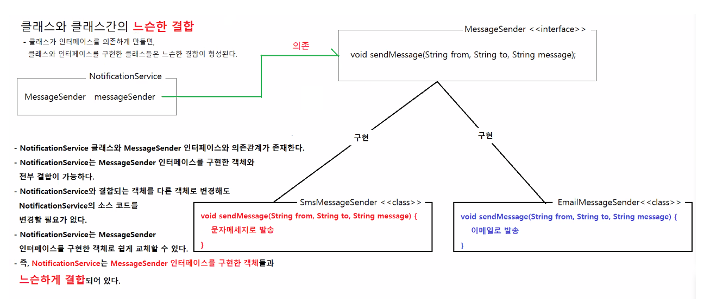
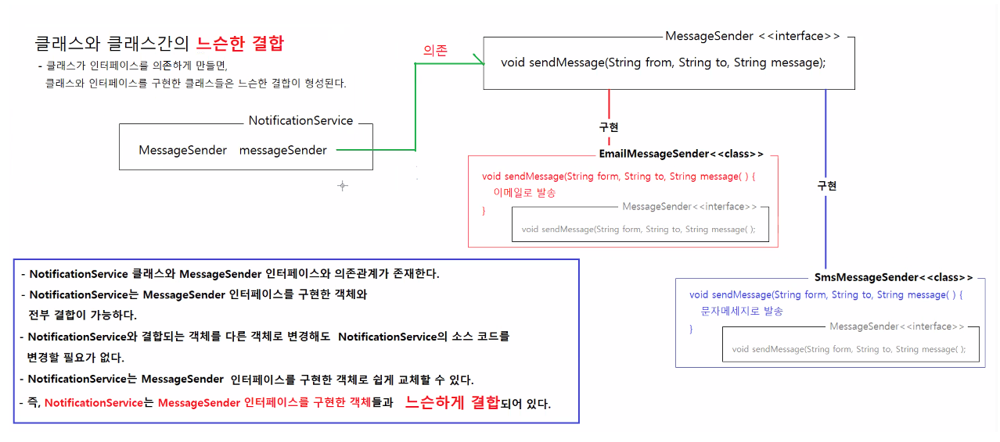
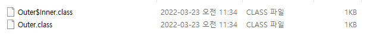
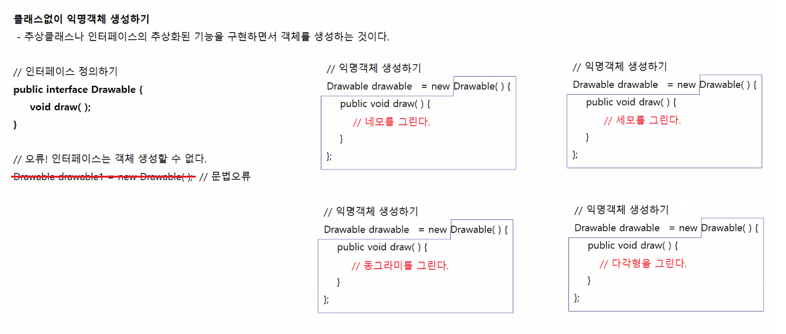

# 3/23

- [3/23](#323)
  - [의존성 역전](#의존성-역전)
    - [의존성 주입](#의존성-주입)
    - [의존성 검색](#의존성-검색)
    - [특징](#특징)
    - [클래스간의 느슨한 결합](#클래스간의-느슨한-결합)
      - [실습](#실습)
  - [중첩클래스](#중첩클래스)
    - [중첩클래스의 종류](#중첩클래스의-종류)
    - [목적](#목적)
    - [내부클래스의 저장위치](#내부클래스의-저장위치)
      - [실습](#실습-1)
    - [내부클래스의 사용](#내부클래스의-사용)
      - [실습](#실습-2)
    - [정적 내부 클래스](#정적-내부-클래스)
      - [실습](#실습-3)
      - [실습](#실습-4)
    - [로컬 내부 클래스](#로컬-내부-클래스)
  - [익명객체](#익명객체)
    - [형식](#형식)
      - [실습](#실습-5)
    - [다양하게 객체 생성하기](#다양하게-객체-생성하기)
  - [람다식](#람다식)
    - [타입추론](#타입추론)
      - [실습](#실습-6)
    - [람다식의 응용](#람다식의-응용)
  - [자바의 버전업](#자바의-버전업)
  - [이벤트모델](#이벤트모델)
    - [이벤트모델의 동작](#이벤트모델의-동작)
      - [실습](#실습-7)

<small><i><a href='http://ecotrust-canada.github.io/markdown-toc/'>Table of contents generated with markdown-toc</a></i></small>

## 의존성 역전
* IoC : Inversion of Control
* 자신이 사용할 객체의 생성 책임이 제 3자가 가지고 있는 것 
* 의존성 역전의 종류에는 의존성 주입과 의존성 검색이 있다.
### 의존성 주입
* DI: Dependency Injection
* 제 3자가 내가 사용할 객체를 생성해서 나한테 주입해준다.
### 의존성 검색
* DL: Dependency Lookup
* 제 3자가 내가 사용할 객체를 생성해 놓으면 그 중에서 필요한 객체를 찾아서 사용한다.

### 특징
* 상속 혹은 구현을 통해서 자식클래스를 정의한다.
  * 클래스 형변환이 가능해진다.
  * 부모타입의 참조변수로 자식객체를 참조할 수 있다.
    ```java
    public class Sample {
        private 부모타입 참조변수;
    }
    ```
* 추상화를 통해서 모든 자식클래스들이 해당 기능을 구현하도록 강제해야 한다.
  * 자식객체가 서로 다르더라도 해당 기능의 사용방법이 동일해진다.
  메소드 재정의를 통해서 자식 클래스는 부모의 기능을 재정의해야 한다.
  * 부모타입의 참조변수로 부모에 정의된 기능을 실행하면, 실제 생성된 자식객체의 재정의된 기능이 실행된다.
  * 실제 사용하는 자식객체를 참조할 필요가 없다.
+ 다형성이 발휘된다.

### 클래스간의 느슨한 결합
* 클래스가 인터페이스에 의존하고 인터페이스를 구현한 구현클래스가 있을때 클래스와 구현클래스는 '느슨하게 결합'하고 있다고 한다.
* 언제든지 분리해 다른 구현클래스와 결합해 사용할 수 있기 때문이다.
* cf) 강력한 결합: 의존성주입을 거치지 않고, 즉 인터페이스 구현을 하지 않고 상속.
#### 실습
```java
package sample9;

/**
 * 메세지 송신 기능을 추상화하는 인터페이스다.
 * @author HOME
 *
 */
public interface MessageSender {

	/**
	 * 메세지를 송신한다.
	 * @param from 발신자
	 * @param to 수신자
	 * @param message 메세지
	 */
	void sendMessage(String from, String to, String message);
}

```

```java
package sample9;

/**
 * MessageSender 인터페이스 구현클래스다.
 * <p>
 * SMS 서비스를 이용해서 문자 메세지를 발송한다.
 * @author HOME
 *
 */
public class SmsMessageSender implements MessageSender {

	@Override
	public void sendMessage(String from, String to, String message) {
		System.out.println("[SMS 메세지 발송]");
		System.out.println("발신자: " + from);
		System.out.println("수신자: " + to);
		System.out.println("메세지: " + message);
		System.out.println();
	}	
}

```

```java
package sample9;

/**
 * MessageSender 인터페이스 구현클래스다.
 * <p>
 * 이메일 서비스를 이용해서 메세지를 발송한다.
 * @author HOME
 *
 */
public class EmailMessageSender implements MessageSender {

	@Override
	public void sendMessage(String from, String to, String message) {
		System.out.println("[Email 메세지 발송]");
		System.out.println("발신자: " + from);
		System.out.println("수신자: " + to);
		System.out.println("메세지: " + message);
		System.out.println();
	}
}

```

```java
package sample9;

/**
 * 공지사항, 이벤트 등의 정보를 고객에게 발송하는 기능이 구현된 클래스다.
 * @author HOME
 *
 */
public class NotificationService {

	/**
	 * 공지사항, 이벤트 정보를 고객에게 발송하는 기능이 구현된 MessageSender류 객체를 주입받을 참조변수를 정의한다.
	 */
	private MessageSender messageSender;
	
	/**
	 * MessageSender류 객체를 전달받아서 멤버변수 messageSender에 대입하는 Setter 메소드다.
	 * @param messageSender messageSender 인터페이스를 구현한 구현객체
	 */
	public void setMessageSender(MessageSender messageSender) {
		this.messageSender = messageSender;
	}
	
	/**
	 * 이벤트 소식을 고객에게 발송한다.
	 * @param form 발송부서
	 * @param tos 수신고객들
	 * @param message 이벤트 내용
	 */
	public void noticeEvent(String form, String[] tos, String message) {
		System.out.println("[신규 이벤트 정보 발송]");
		for (String to : tos) {
			// messageSender는 MessageSender인터페이스에 정의된 sendMessage(String, String, String)을 실행한다.
			// 실제로 실행되는 것은 messageSender가 참조하는 객체의 재정의된 sendMessage(String, String, String)이 실행된다.
			messageSender.sendMessage(form, to, message);
		}
	}
}

```

```java
package sample9;

public class Company {

	public static void main(String[] args) {

		NotificationService service = new NotificationService();
		SmsMessageSender sms = new SmsMessageSender();
		EmailMessageSender email = new EmailMessageSender();

		// 이벤트 소식 발송하기
		String from = "02-1234-5678";
		String[] tos = { "010-1111-1111", "010-2222-2222", "010-3333-3333" };
		String message = "모든 상품을 10% 추가할인을 실시합니다.";

		// NotificationService객체가 사용할 MessageSender 인터페이스 구현객체를 SmsMessageSender객체로 주입(전달,조립)한다.
		service.setMessageSender(sms);
		service.noticeEvent(from, tos, message);
		
		// 이메일로 이벤트 소식 발송하기
		from = "admin@company.co.kr";
		tos = new String[] { "hong@gmail.com", "lee@hanmail.net", "kang@naver.com" };
		
		// NotificationService객체가 사용할 MessageSender 인터페이스 구현객체를 EmailMessageSender객체로 주입(전달,조립)한다.
		service.setMessageSender(email);
		service.noticeEvent(from, tos, message);
	}
}

```




## 중첩클래스
별로 중요하지 않은, 사용빈도가 적은 개념이다.
* 클래스내부에 정의된 클래스
* 중첩클래스를 정의하는 이유
  * 클래스가 특정 클래스와 밀접한 관계를 맺고 있을 때, 클래스의 내부에 선언하는 것이 유리하다.
  * 외부 클래스의 구성요소들을 서로 쉽게 사용할 수 있다.
* 내부클래스를 포함하고 있는 클래스를 컴파일하면 내부클래스의 갯수만큼 컴파일된 클래스파일이 추가로 생성된다.
  * 내부클래스의 컴파일된 클래스의 파일명 : `외부클래스명$내부클래스.class`

### 중첩클래스의 종류
1. 멤버 내부 클래스
   * 모든 변수, 메소드 사용가능
2. 정적 내부 클래스 : 
   * 정적 변수, 메소드만 사용가능
3. 로컬 내부 클래스
   * 메소드안에 정의되어 있는 클래스
   * 외부클래스의 모든 변수, 메소드 사용가능
```java
public class Outer {
    // 멤버 내부 클래스
    public class Inner {
        Outer의 모든 변수, 모든 메소드를 사용할 수 있다.
    }
}

public class Outer {
    // 정적 내부 클래스
    public static class Inner {
        외부클래스의 객체 생성여부와 상관없이 사용할 수 있는 내부클래스
        외부클래스의 정적변수, 정적 메소드만 사용할 수 있다
    }
}

public clas Outer {
    public void method() {
        // 로컬 내부 클래스
        public class Inner {
            해당 메소드가 실행되는 동안만 사용할 수 있는 내부클래스
            외부클래스의 모든변수, 모든 메소드를 자유롭게 사용할 수 있다.
            로컬 내부클래스가 정의된 메소드의 지역변수, 매개변수 중에서 값이 변하는 것은 사용할 수 없다.
            final 변수 혹은 final변수처럼 동작하는 변수만 사용할 수 있다
        }
    }
}
```

### 목적
* 클래스의 구성요소들을 쉽게 사용하기 위해
* 아주 밀접한 관계일 때 내부에 선언

### 내부클래스의 저장위치
#### 실습
```java
package sample10;

public class Outer {

	public class Inner {
		
	}
}

```

* 저장위치 : C:\eclipse\workspace-java\java-oop-2\bin\sample10
* 내부클래스는 bin폴더에 저장된다.

### 내부클래스의 사용
#### 실습
```java
package sample10;

public class StudentScores {

	private int[] scores = { 100, 80, 70, 50 };

	public int getTotal() {
		int total = 0;
		for (int score : scores) {
			total += score;
		}
		return total;
	}

	// 성적통계정보를 제공하는 객체를 반환한다.
	public ScoreStat getStat() {
		return new ScoreStat();
	}
	
	
	// 성적에 대한 통계정보를 제공하는 내부 클래스
	public class ScoreStat {

		public int highScore() {
			int high = 0;
			for (int score : scores) {
				if (score > high) {
					high = score;
				}
			}
			return high;
		}

		public int lowScore() {
			int low = 100;
			for (int score : scores) {
				if (score < low) {
					low = score;
				}
			}
			return low;
		}

		public int average() {
			return getTotal() / 3;
		}
	}
}

```

```java
package sample10;

import sample10.StudentScores.ScoreStat;

public class StudentScoresApp {

	public static void main(String[] args) {
		
		StudentScores studentScores = new StudentScores();
		ScoreStat stat = studentScores.getStat();
		
		System.out.println("최고점수: " + stat.highScore());
		System.out.println("최저점수: " + stat.lowScore());
		System.out.println("평균점수: " + stat.average());
	}
}

```
* 실행결과
    ```
    최고점수: 100
    최저점수: 50
    평균점수: 100
    ```

### 정적 내부 클래스
#### 실습
```java
package sample10;

public class StaticOuterApp {

	public static void main(String[] args) {
		Score score = new Score();
//		Score2 score2 = new Score2(); // 오류
	}
	
	// 정적 내부 클래스
	// 외부 클래스의 정적메소드에서는 내부 클래스중에서 정적 내부클래스만 사용할 수 있다.
	static class Score {
		
	}
	
	class Score2 {
		
	}
}

```

#### 실습
```java
package sample10;

public class StaticOuterApp {

	public static void main(String[] args) {
		Score score = new Score("김유신", 100, 80, 70);
		System.out.println(score.getName());
		System.out.println(score.getTotal());
		System.out.println(score.getAverage());
	}
	
	// 정적 내부 클래스
	// 외부 클래스의 정적메소드에서는 내부 클래스중에서 정적 내부클래스만 사용할 수 있다.
	static class Score {
		private String name;
		private int kor;
		private int eng;
		private int math;
		
		public Score(String name, int kor, int eng, int math) {
			this.name = name;
			this.kor = kor;
			this.eng = eng;
			this.math = math;
		}
		
		public String getName() {
			return name;
		}
		public int getTotal() {
			return kor + eng + math;
		}
		public int getAverage() {
			return getTotal()/3;
		}
	}

}

```

### 로컬 내부 클래스
* 값이 편하지 않는 변수만 로컬 내부 클래스에서 사용할 수 있다.
* 클래스 실행 후에 변하면 의미가 없기 때문이다.
```java
  public class Outer {
    int x;
    int y;
    public void test1() {
      수행문;
    }
    public void test2() {
       int x1 = 100;
       int y1 = 200;
      // 지역내부 클래스
      class Inner {
        int a;
        int b;
        public void test2() {
          수행문;
        }
      }
      y1 = 20;
    }
  }
```

## 익명객체
자주 사용되는 객체 생성 방법.(이벤트 처리)
모바일환경과 같이 UI 가 필요한 Application의 경우 익명객체를 자주 사용한다.
* 이름이 없는 객체
* 상위클래스를 상속받거나 인터페이스를 구현해서 즉석에서 객체를 생성하는 것.(단독생성불가)
* 단 한 번 사용되는 기능이 필요하다면 별도의 클래스 정의없이 익명객체로 생성하는 것이 유리하다.
  * 주로 GUI프로그램의 이벤트처리, 스레드 구현등에 사용된다.



### 형식
```java
        Handler handler1 = new Handler() {
			public void execute() {
				System.out.println("새 파일을 엽니다.");
			}
		};
```
* handler1은 익명객체이다.

#### 실습
```java
package sample11;

public interface Handler {

	void execute();
}

```

```java
package sample11;

public class Menu {

	private Handler handler;

	public void addHandler(Handler handler) {
		this.handler = handler;
	}

	public void click() {
		handler.execute();
	}

}

```

```java
package sample11;

public class Painter {

	private Menu newFileMenu;
	private Menu saveMenu;
	private Menu renameMenu;
	private Menu exitMenu;

	public Painter() {
		newFileMenu = new Menu();
		saveMenu = new Menu();
		renameMenu = new Menu();
		exitMenu = new Menu();

		Handler handler1 = new Handler() {
			public void execute() {
				System.out.println("새 파일을 엽니다.");
			}
		};

		Handler handler2 = new Handler() {
			public void execute() {
				System.out.println("파일을 저장합니다.");
			}
		};

		Handler handler3 = new Handler() {
			public void execute() {
				System.out.println("파일명을 변경합니다.");
			}
		};

		Handler handler4 = new Handler() {
			public void execute() {
				System.out.println("프로그램을 종료합니다.");
			}
		};

		newFileMenu.addHandler(handler1);
		saveMenu.addHandler(handler2);
		renameMenu.addHandler(handler3);
		exitMenu.addHandler(handler4);
	}

	public void clickMenu(String name) {
		if ("새파일".equals(name)) { // .equals()에서 파라미터 name에 null이 올 수도 있으므로 뒤에 적고 값이 뚜렷한 String을 앞에 적는다.
			newFileMenu.click();
		} else if ("저장하기".equals(name)) {
			saveMenu.click();
		} else if ("이름변경".equals(name)) {
			renameMenu.click();
		} else if ("종료하기".equals(name)) {
			exitMenu.click();
		}
	}
	
	public static void main(String[] args) {
		Painter painter = new Painter();
		
		painter.clickMenu("새파일");
		painter.clickMenu("종료하기");
	}
	
}

```

```java
package sample11;

public class Painter2 {

	private Menu newFileMenu;
	private Menu saveMenu;
	private Menu renameMenu;
	private Menu exitMenu;

	public Painter2() {
		newFileMenu = new Menu();
		saveMenu = new Menu();
		renameMenu = new Menu();
		exitMenu = new Menu();

		newFileMenu.addHandler(new Handler() {
			public void execute() {
				System.out.println("새 파일을 엽니다.");
			}
		});
		saveMenu.addHandler(new Handler() {
			public void execute() {
				System.out.println("파일을 저장합니다.");
			}
		});
		renameMenu.addHandler(new Handler() {
			public void execute() {
				System.out.println("파일명을 변경합니다.");
			}
		});
		exitMenu.addHandler(new Handler() {
			public void execute() {
				System.out.println("프로그램을 종료합니다.");
			}
		});
	}

	public void clickMenu(String name) {
		if ("새파일".equals(name)) { // .equals()에서 파라미터 name에 null이 올 수도 있으므로 뒤에 적고 값이 뚜렷한 String을 앞에 적는다.
			newFileMenu.click();
		} else if ("저장하기".equals(name)) {
			saveMenu.click();
		} else if ("이름변경".equals(name)) {
			renameMenu.click();
		} else if ("종료하기".equals(name)) {
			exitMenu.click();
		}
	}

	public static void main(String[] args) {
		Painter2 painter = new Painter2();

		painter.clickMenu("새파일");
		painter.clickMenu("종료하기");
	}

}

```
* 메소드 실행 코드의 파라미터로 익명객체 생성코드를 바로 적었다.
* 그럼에도 반복되는 부분(`new~`)이 많다. 람다식을 통해 간소화할 수 있다.

### 다양하게 객체 생성하기
```java
interface Handler {
    void execute();
}
```
1. 인터페이스를 구현한 구현클래스를 정의하고, 그 클래스를 이용해서 객체 생성하기
```java
public class FileOpenHandler implements Handler {
    public void execute() {
        System.out.println("새 파일을 엽니다.");
    }
}
Handler handler = new FileOpenHandler();
```
2. 인터페이스의 추상화된 기능을 바로 구현하고, 객체를 생성하기 - 익명객체 생성
```java
Handler handler = new Handler() {
    public void execute() {
        System.out.println("새 파일을 엽니다.");
    }
};
```
4. 람다식으로 객체를 생성하기
```java
Handler handler = () -> System.out.println("새 파일을 엽니다.");

```
* 추상클래스 인터페이스가 있어야 익명객체, 람다식으로 객체를 생성할 수 있다.(단독생성 x)

## 람다식
* java8부터 도입되었다.
* 객체를 표현하는 또 다른 방법. (객체를 반환한다.)
* 추상메소드가 한 개일때만 사용할 수 있다.
* 형식
    ```java
    // 수행문이 1개
    (타입 변수, 타입 변수) -> 수행문

    // 수행문이 2개 이상
    (타입 변수, 타입 변수) -> {
        수행문;
        수행문;
    }
    ```

### 타입추론
* java7부터 도입되었다.
* 변수의 타입을 보고 어떤 객체가 와야 되는지 알아낸다.
* 타입추론을 통해 람다식의 활용이 가능하다.

#### 실습
```java
package sample11;

public class Painter3 {

	private Menu newFileMenu;
	private Menu saveMenu;
	private Menu renameMenu;
	private Menu exitMenu;

	public Painter3() {
		newFileMenu = new Menu();
		saveMenu = new Menu();
		renameMenu = new Menu();
		exitMenu = new Menu();

		newFileMenu.addHandler(() -> System.out.println("새 파일을 엽니다."));

		saveMenu.addHandler(() -> System.out.println("파일을 저장합니다."));

		renameMenu.addHandler(() -> System.out.println("파일명을 변경합니다."));

		exitMenu.addHandler(() -> System.out.println("프로그램을 종료합니다."));

	}

	public void clickMenu(String name) {
		if ("새파일".equals(name)) { // .equals()에서 파라미터 name에 null이 올 수도 있으므로 뒤에 적고 값이 뚜렷한 String을 앞에 적는다.
			newFileMenu.click();
		} else if ("저장하기".equals(name)) {
			saveMenu.click();
		} else if ("이름변경".equals(name)) {
			renameMenu.click();
		} else if ("종료하기".equals(name)) {
			exitMenu.click();
		}
	}

	public static void main(String[] args) {
		Painter3 painter = new Painter3();

		painter.clickMenu("새파일");
		painter.clickMenu("종료하기");
	}

}

```
* 익명객체를 간편하게 생성할 수 있다.

### 람다식의 응용
```java
public interface Sample {
    void exec(int x);
}

Sample s = (int x) -> System.out.println(x);
Sample s = (x) -> System.out.println(x);
Sample s = x -> System.out.println(x);

public interface Sample {
    int exec(int x, int y);
}

Sample s = (int x, int y) -> x + y;  // 자동으로 반환값이 된다.
Sample s = (x, y) -> x - y; // 타입 생략 가능
Sample s = (x, y) -> { // 브레이스{ 를 열면 메소드 작성방법과 똑같이 적는다.
    int z = x + y;
    return z;
}
```
* 컴파일러는 람다식의 s가 Sample인터페이스에 부합되는지 확인하고 작업을 수행한다.

## 자바의 버전업
* java 5
  * 향상된 for문
  * 제네릭
  * 오토박싱
* java 7
  * NIO
  * 자동 자원관리(auto close)
* java 8
  * 람다식
  * 스트림API
  * 인터페이스에서 정적메소드, default 메소드 도입
* java 9
  * 모듈

## 이벤트모델
* 이벤트(Event)
  * 사용자가 화면의 버튼, 입력필드, 메뉴 등 화면의 구성요소와 상호작용할 때마다 프로그램에서 생성하는 객체
  * 이벤트 객체에는 이벤트이름, 이벤트종류, 이벤트가 발생한 화면요소(콤보박스)에 대한 정보가 포함되어 있다.
* 이벤트 소스(Event Source)
  * 사용자와 상호작용으로 이벤트를 생성하는 객체
  * 버튼, 입력필드, 콤보박스, 체크박스, 라디오버튼, 스크롤바 등...
* 이벤트 리스너(Event Listener) 혹은 이벤트 핸들러(Event Handler)
  * 이벤트 소스에서 이벤트가 발생하면 실행될 코드가 정의된 객체

### 이벤트모델의 동작
* 사용자와 상호작용하는 이벤트 소스를 선정한다.
* 선정된 이벤트 소스에서 발생하는 이벤트중에서 프로그램에 활용할 이벤트를 고른다.
* 선정된 이벤트가 발생했을 떄 실행할 코드를 포함하고 있는 이벤트 리스너를 구현한다.
* 선정된 이벤트 소스에 이벤트 리스너를 등록한다.

#### 실습
```java
package sample12;

import java.awt.event.ActionEvent;
import java.awt.event.ActionListener;

import javax.swing.JFrame;
import javax.swing.JMenu;
import javax.swing.JMenuBar;
import javax.swing.JMenuItem;

// 메뉴객체 생성
public class Notepad extends JFrame {
	
	// 메뉴바 객체 생성
	JMenuBar menuBar = new JMenuBar();
	// 
	JMenu fileMenu = new JMenu("파일");
	// 메뉴아이템 객체 생성
	JMenuItem newMenuItem = new JMenuItem("새 파일");
	JMenuItem openMenuItem = new JMenuItem("열기");
	JMenuItem saveMenuItem = new JMenuItem("저장");
	JMenuItem exitMenuItem = new JMenuItem("종료");

	public Notepad() {

		// 메뉴에 메뉴아이템추가
		fileMenu.add(newMenuItem);
		fileMenu.add(openMenuItem);
		fileMenu.add(saveMenuItem);
		fileMenu.addSeparator();
		fileMenu.add(exitMenuItem);		
		// 메뉴바 객체 생성
		menuBar.add(fileMenu);
		// 메뉴바를 프레임에 추가
		setJMenuBar(menuBar);
		
		// 이벤트 발생시 실행(종료)
		exitMenuItem.addActionListener(new ActionListener() {			
			public void actionPerformed(ActionEvent e) {
				System.exit(0);
			}
		});
		
		// 화면의 왼쪽 상단에서 가로, 세로 방향으로 300픽셀 떨어진 곳에 가로, 세로 길이가 각각 480, 360픽셀
		setBounds(300, 300, 480, 360);
		// 화면에 창이 보이게 하기
		setVisible(true);
		// 화면의 우측상단의 x버튼을 클릭하면 창이 닫히고, 프로그램이 종료되게 하기
		setDefaultCloseOperation(JFrame.EXIT_ON_CLOSE);
	}

	public static void main(String[] args) {
		new Notepad();
	}
}

```