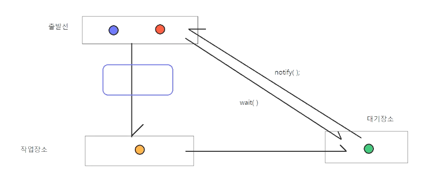

# 3/24

- [3/24](#324)
  - [final](#final)
  - [API](#api)
    - [java.lang](#javalang)
    - [java.util](#javautil)
    - [java.text](#javatext)
    - [java.time](#javatime)
    - [java.io, java.net](#javaio-javanet)
    - [java.sql, javax.sql](#javasql-javaxsql)
  - [Object](#object)
    - [주요 메소드](#주요-메소드)
      - [실습](#실습)
  - [System](#system)
    - [주요 메소드](#주요-메소드-1)
      - [실습](#실습-1)
  - [String](#string)
    - [String의 주요 메소드](#string의-주요-메소드)
      - [실습](#실습-2)
    - [String과 형변환](#string과-형변환)
  - [StringBuilder, StringBuffer](#stringbuilder-stringbuffer)
      - [실습](#실습-3)

<small><i><a href='http://ecotrust-canada.github.io/markdown-toc/'>Table of contents generated with markdown-toc</a></i></small>


## final
* 클래스 앞에 붙일 수 있다.
  ```java
  public final class Sample {                                   // 상속 금지 : 이 클래스를 상속해서 자식 클래스를 작성할 수 없다.

  }

  public class Sample {
      public void method1() {

      }
      public final void method2() {                              // 메소드 재정의 금지 : 자식 클래스에서 이 메소드는 재정의 할 수 없다.

      }
  }

  public class Sample {
      public static final int MAX_UPLOAD_SIZE = 1024 * 1024 * 10; // 값 변경 금지 : 상수
      
      private final int rows;                                     // 값 변경 금지 : 멤버변수에 final이 있으면, 객체 생성시 생성자를 통해서만 값을 설정할 수 있고, 설정된 값을 변경할 수 없다.

      public void method(final int x, final int y) {              // 값 변경 금지 : 메소드 호출시 전달받은 값은 수행문에서 값을 변경할 수 없다.

      }
  }
  ```
* 클래스 앞에 붙으면 '상속 금지'
* 메소드 앞에 붙으면 '메소드 재정의 금지'
* 변수 앞에 붙으면 '값 변경 금지'

## API
* Application Programming Interface
* 프로그램 언어, 프레임워크, 라이브러리 등이 제공하는 기능
### java.lang
* 자바 프로그램 언어의 기본 클래스들을 제공한다.
* System, Runtime, Object, String, Wrapper, Thread 등의 클래스가 포함되어 있다.
* 각종 Error 클래스와 Exception 클래스도 제공한다.
### java.util
* 자바 프로그램 개발에 가장 많이 사용되는 클래스들을 제공한다.
* 자료구조 클래스, 날짜/달력 관련 클래스, 각종 유틸리티 클래스 제공
* 자료구조 클래스
  * Collection, List, Set, Queue, ArrayList, HashSet, Vector, LinkedList, Stack, Map, HashMap
* 날짜/달력
  * Date, Calendar
* 유틸리티클래스
  * Scanner, Object, Arrays, Collections, Random
### java.text
* 포맷팅 클래스(텡스트, 숫자, 날짜, 메세지를 형식화된 텍스트로 변환하는 기능을 제공하는 클래스)들을 제공한다.
* DateFormat, NumberFormat, MessageFormat, DecimalFormat, SimpleDateFormat
### java.time
* 날짜와 시간정보를 다루는 클래스를 제공한다.
* java8 부터 제공되는 API
* java.util의 날짜/달력 관련 기능이 너무 부족해서 새로 추가된 API다.
* LocalDate, LocalDateTime, Period 등의 클래스가 추가되었다.
### java.io, java.net
* 입출력, 네트워킹 관련 클래스를 제공한다.
* 입출력 클래스
  * InputStream, OutputStream, Reader, Writer
* 네트워킹
  * Socket, ServetSocket, DatagramPacket, URI, URL, InetAddress
### java.sql, javax.sql
* 데이터베이스 엑세스 관련 JDBC 표준을 제공한다.

## Object
* 배열을 포함한 모든 객체의 최상위 부모클래스다.
* 명시적으로 extends를 사용해서 부모클래스를 지정하지 않으면 무조건 extends Object로 간주된다.
* Object의 모든 메소드는 모든 클래스가 상속받는다.
* 모든 객체는 Object의 메소드를 사용할 수 있다.
* Object에는 객체와 관련된 필수 기능들이 구현되어 있다.

### 주요 메소드
* boolean equals(Object obj)
  * 현재 객체와 전달받은 객체가 동일한 객체인지 여부를 반환한다.
  * 객체들의 주소값(참조값)을 비교한다.
  * 재정의 가능
* int hashCode()
  * 현재 객체의 해시코드값을 반환한다.
  * 재정의 가능
* String toString()
  * 현재 객체에 대한 간단한 정보를 제공한다.
  * 클래스이름@16진수해시코드
  * 재정의 가능
* Class<?> getClass()
  * 현재 객체에 대한 설계도(클래스정보) 정보를 제공한다.
* Object clone()
  * 현재 객체를 복제한 복사본을 생성해서 제공한다.

#### 실습
```java
package lang.object;

import java.util.Objects;

public class Score implements Cloneable {

	private String name;
	private int kor;
	private int eng;
	private int math;

	public Score(String name, int kor, int eng, int math) {
		super();
		this.name = name;
		this.kor = kor;
		this.eng = eng;
		this.math = math;
	}

	public Score() {
	}

	public String getName() {
		return name;
	}

	public void setName(String name) {
		this.name = name;
	}

	public int getKor() {
		return kor;
	}

	public void setKor(int kor) {
		this.kor = kor;
	}

	public int getEng() {
		return eng;
	}

	public void setEng(int eng) {
		this.eng = eng;
	}

	public int getMath() {
		return math;
	}

	public void setMath(int math) {
		this.math = math;
	}

	public Score copy() throws CloneNotSupportedException {
		Object obj = this.clone();
		Score clonedScore = (Score) obj;
		return clonedScore;
	}
	
	@Override
	public int hashCode() {
		return Objects.hash(name);
	}

	@Override
	public boolean equals(Object obj) { 		
		if (this == obj)						// this의 참조값과 obj의 참조값이 같으면 두 객체는 같은 객체다.
			return true;
		if (obj == null)						// obj의 참조값이 null이면 this와 obj는 같은 객체가 아니다.
			return false;
		if (getClass() != obj.getClass())		// 이 객체의 설계도정보와 obj의설계도 정보가 다르면 두객체는 같은 객체가 아니다.
			return false;
		Score other = (Score) obj;
		return Objects.equals(name, other.name);	// 지정한 항목의 값이 같으면 true를 반환한다.
	}

	// Object의 toString() 메소드 재정의
	// Score객체의 멤버변수에 저장된 학생이름, 과목별 점수를 문자열로 반환하도록 toString() 메소드를 재정의하였음
	@Override
	public String toString() {
		return "Score [name=" + name + ", kor=" + kor + ", eng=" + eng + ", math=" + math + "]";
	}

}
```
* 학생의 이름 및 점수들을 통해 score객체를 저장하고 불러올 수 있는 클래스
* toString(), hashCode()와 equals(), copy()메소드를 재정의하였다.
```java
package lang.object;

public class ScoreApp {

	public static void main(String[] args) {
		
		Score score1 = new Score("홍길동", 100, 50, 100);
		Score score2 = new Score("김유신", 50, 70, 80);
		
		// toString()은 Object의 메소드다.
		// toString()은 "클래스전체이름@해시코드"를 반환한다.
		String score1Info = score1. toString();
		String score2Info = score2. toString();
		
		System.out.println("첫번째 Score객체의 정보: " + score1Info);
		System.out.println("두번째 Score객체의 정보: " + score2Info);
		
		System.out.println("첫번째 Score객체의 정보: " + score1); 		// score1.toString()의 결과가 출력
		System.out.println("두번째 Score객체의 정보: " + score2); 		// score2.toString()의 결과가 출력
	}
}

```
* toString()메소드는 클래스전체이름@해시코드를 반환한다.
  * 해시코드는 주소값이다.
```java
package lang.object;

public class ScoreApp2 {

	public static void main(String[] args) {
		
		Score score1 = new Score("김유신", 100, 90, 90);
		Score score2 = new Score("김유신", 100, 90, 90);
		Score score3 = score1;
		
		// 객체에 대한 == 연산은 객체의 참조값을 비교한다.
		System.out.println(score1 == score2); // false, score1과 score2는 참조값이 서로 다르다.
		System.out.println(score1 == score3); // true, score1과 score3는 참조값이 같다.
		System.out.println();
		
		// Object의 equals(Object other) 메소드는 객체의 참조값을 비교한다.
		// Score에서 학생이름이 같으면 true가 반환되도록 equals(Object other) 메소드를 재정의하였다.
		System.out.println(score1.equals(score2)); // true, score1과 score2는 참조값이 서로 다르지만 학생이름은 같다.
		System.out.println(score1.equals(score3)); // true, score1과 score3는 참조값이 같다.
	} 
}

```
* equals()메소드를 Generate 기능을 통해 score에서 재정의하고 (참조값이 서로 다르지만) 학생이름이 같은지를 비교할 수 있다.
```java
package lang.object;

public class ScoreApp3 {

	public static void main(String[] args) throws CloneNotSupportedException {
		
		Score score1 = new Score("김유신", 80, 90, 100);

		if (score1 instanceof Cloneable) {
			System.out.println("Score객체는 복제가 허용된다.");
		} else {
			System.out.println("Score객체는 복제가 허용되지 않는다.");
		}
		
		Score cloned = score1.copy();
		
		System.out.println("원본객체: " + score1);
		System.out.println("복제객체: " + cloned);
	}
}

```
* Score.java에서 Cloneable 인터페이스를 implements하고 재정의한 copy()메소드를 통해 객체를 복제할 수 있다.
```java
package lang.object;

import java.lang.reflect.Field;
import java.lang.reflect.Method;

public class ScoreApp4 {

	public static void main(String[] args) throws CloneNotSupportedException {
		
		Score score1 = new Score("홍길동", 80, 90, 100);

		// Object의 getClass()메소드는 생성된 객체의 설계도 정보를 반환한다.
		Class<?> clazz = score1.getClass();
		
		// getName()은 생성된 객체의 전체클래스명을 반환한다.
		String className = clazz.getName();
		System.out.println("클래스명: " + className);
		System.out.println();
		
		System.out.println("### 객체의 필드정보");
		// getDeclaredFields()는 생성된 객체에 포함된 필드정보를 배열로 반환한다.
		Field[] fields =  clazz.getDeclaredFields();
		for(Field field : fields) {
			System.out.println(field.getType().getName() + " " + field.getName());
		}
		System.out.println();
		
		System.out.println("### 객체의 메소드 정보");
		Method[] methods = clazz.getDeclaredMethods();
		for(Method method : methods) {
			System.out.println(method.getReturnType().getName() + " " + method.getName());
		}
		System.out.println();
		
	}
}

```
* getClass()를 통해 객체의 설계도 정보를 알 수 있다.
* reflect : 객체로부터 객체의 정보를 획득하는 것을 의미한다.


* wait() : 대기시킨다.
* wait(long timeoutMillis) : 시간을 정해 대기시킨다.
* notify() : 대기상태를 종료하고 출발선으로 가져온다.

## System
* 자바실행환경이 설치된 시스템(컴퓨터)에 대한 유용한 값과 객체를 제공하는 클래스다.
* java.lang 패키지에 속해있다.
* System 클래스의 모든 필드와 모든 메소드는 정적필드, 정적메소드다.
* 제공하는 것
  * 표준입력장치, 표준출력장치, 표준에러출력장치와 연결된 스트림
  * 컴퓨터의 환경변수, 프로퍼티 값을 제공한다.
  * 컴퓨터의 현재시간정보를 제공한다.

### 주요 메소드
* long System.currentTimeMillis()
  * 현재 시간에 대한 유닉스타임을 제공한다.
  * 유닉스타임:1970/1/1 00:00:00부터 지금까지의 시간을 1/1000초 단위로 표현한 값이다
  long time = System.currentTimeMillis();	// 13자리 정수가 획득된다.
* void System.arraycopy(Object src, int srcPos, Object dest, int destPos, int length)
  * 배열의 요소를 다른 배열에 복사한다.
  * 매개변수
    * src:원본배열
    * srcPos:원본배열의 복사시작위치
    * dest:대상배열
    * destPos:대상배열의 저장시작위치
    * length: 복사할 요소의 갯수
    ```java
    int[] arr1 = {1, 2, 3, 4, 5, 6, 7, 8, 9, 10};
    int[] arr2 = new int[20];
    int[] arr2 = new int[20];
    
    // 원본배열의 0번째부터 10개를 arr2의 0번째 위치에 복사하기
    System.arraycopy(arr1, 0, arr2, 0, 10);
    // arr2 = {1, 2, 3, 4, 5, 6, 7, 8, 9, 10, 0, 0, 0, 0, 0, 0, 0, 0, 0, 0}
    
    // 원본배열의 4번째부터 5개를 arr2의 0번째 위치에 복사하기
    System.arraycopy(arr1, 4, arr2, 0, 5);
    // arr2 = {5, 6, 7, 8, 9, 0, 0, 0, 0, 0, 0, 0, 0, 0, 0, 0}
    ```
* void System.exit(int status)
  * 프로그램을 종료시킨다
  * 정상적인 종료일 때는 status값을 0으로 설정한다
* String System.getenv(String name)
  * 시스템의 환경변수 설정값을 조회한다
  ```java
  String value1 = System.getenv("JAVA_HOME");
  System.out.println(value1);	// "C:\Program Files\Java\jdk-11.0.8" 가 출력됨  
  ```
* String System.getProperty(String name)
  * 운영체제의 설정정보를 조회한다
  ```java
  // 사용자의 홈 디렉토리 경로를 반환한다.
  String value1 = System.getProperty("user.dir");
  
  // 시스템의 줄바꿈 문자를 반환한다.
  String value2 = System.getProperty("line.separator");
  
  // 시스템의 디렉토리 경로 구분문자를 반환한다.
  String value3 = System.getProperty("file.separator");
  ```

#### 실습
```java
package lang.system;

import java.util.Date;

public class SystemApp {

	public static void main(String[] args) {
		
		/*
		 * System은 표준 입출력 스트림을 제공한다.
		 * 		System.in : 표준 입력장치(키보드)와 연결된 스트림을 제공한다.
		 * 				Scanner sc = new Scanner(System.in);	키보드 입력을 읽어오는 Scanner객체 생성
		 * 		System.out : 표준 출력장치 (모니터)와 연결된 스트림을 제공한다.
		 * 				System.out.println(값);
		 * 		System.err : 표준 에러 출력장치(모니터)와 연결된 스트림을 제공한다.
		 * 				System.err.println(오류메세지);
		 */
		
		System.out.println("표준 출력장치에 메세지 출력하기");
		System.err.println("표준 에러 출력장치에 에러메세지 출력하기");
		
		/*
		 * System은 현재 시간 정보를 제공한다.
		 * 		long currentTimeMillis()
		 * 			1970년 1월 1일 0시 0분 0초부터 지금 이 순간까지의 시간을 1/1000초 단위로 환산한 값을 반환한다.
		 * 			* 유닉스타임을 반환한다.
		 * 			* 이름 충돌을 방지하기 위한 용도로 많이 사용한다.
		 */
		
		long unixTime = System.currentTimeMillis();
		System.out.println("유닉스 타임: " + unixTime);
		
		Date date = new Date(0L);
		System.out.println(date);
		
		/*
		 * System은 시스템의 환경변수정보를 제공한다.
		 * 		String getenv(String name)
		 */
		String javaHome = System.getenv("JAVA_HOME");
		String os = System.getenv("os");
		String path = System.getenv("path");
		
		System.out.println("자바홈: " + javaHome);
		System.out.println("운영체제: " + os);
		System.out.println("path: " + path);		
		
		/*
		 * System은 시스템의 프로퍼티 정보를 제공한다.
		 * 		String getProperty(String key)
		 */
		String javaVersion = System.getProperty("java.version");		// 자바버전
		String osName = System.getProperty("os.name");					// 운영체제 이름
		String fileSeparator = System.getProperty("file.separator");	// 시스템의 파일구분문자
		String lineSeparator = System.getProperty("line.separator");	// 시스템의 줄바꿈 문자
		String userName = System.getProperty("user.name");				// 사용자명
		String userHome = System.getProperty("user.home");				// 사용자의 홈
		String userDir = System.getProperty("user.dir");				// 사용자의 홈 디렉토리
		
		System.out.println("자바버전: " + javaVersion);
		System.out.println("운영체제 이름: " + osName);
		System.out.println("시스템의 파일구분문자: " + fileSeparator);
		System.out.println("시스템의 줄바꿈 문자: " + lineSeparator);
		System.out.println("사용자명: " + userName);
		System.out.println("사용자의 홈: " + userHome);
		System.out.println("사용자의 홈 디렉토리: " + userDir);
		
	}
}

```
* System은 입출력, 시간, 환경변수, 프로퍼티와 관련된 메소드를 제공한다.
```java
package lang.system;

import java.util.Arrays;

public class SystemApp2 {

	public static void main(String[] args) {
		
		/*
		 * System은 배열복사 기능을 제공한다.
		 * 		void arraycopy(Object[] src, int srcPos, Object[] dest, int destPos, int length)
		 * 			src: 원본배열
		 * 			srcPos: 원본배열의 복사 시작위치
		 * 			dest: 대상배열
		 * 			destPos: 대상배열의 저장위치
		 * 			length: 복사할 값의 길이
		 */
		
		int[] src = {23, 56, 87, 21, 89};
		int[] dest = new int[10];
		
		System.arraycopy(src, 0, dest, 0, 5);
		System.out.println(Arrays.toString(dest));
		
		Arrays.fill(dest, 0);
		System.arraycopy(src, 0, dest, 5, 5);
		System.out.println(Arrays.toString(dest));
		
		Arrays.fill(dest, 0);
		System.arraycopy(src, 0, dest, 2, 3);
		System.out.println(Arrays.toString(dest));
	}
}

```
* arraycopy()메소드는 배열 복사 기능을 제공한다.
* Arrays.fill()은 java.util.Arrays에 있는 메소드로 특정 배열에 원하는 값을 채울수 있다.

## String
* 문자열을 표현하는 객체다.
* 문자열(String)은 불변객체다.
  * 한번 생성된 문자열은 절대로 변하지 않는다.
* String객체를 생성하는 방법
  ```java
  String s = "abc";
  String s = new String("abc");
  
  char[] data = {'a', 'b', 'c'};
  String s = new String(data);
  ```
* String객체는 문자열과 관련된 다양한 기능들을 제공한다.
### String의 주요 메소드
* int length()
  * 문자열의 길이를 반환한다.
  ```java
  String str = "abcdefg";
  int len = str.length();
  System.out.println(len);	// 7이 출력됨
  ```
* boolean equals(Object str)
  * 문자열의 내용을 비교해서 동등성 여부를 반환한다.
  ```java
  String str1 = "hello";
  String str2 = "Hello";
  String str3 = "hello";

  boolean result1 = str1.equals(str2);	// false
  boolean result2 = str1.equals(str3);	// true
  ```

* boolean equalsIgnoreCase(String str)
  * 문자열의 내용을 비교해서 동등성 여부를 반환한다.
  * 대/소문자를 구분하지 않고 비교한다.
  ```java
  String str1 = "hello";
  String str2 = "Hello";
  String str3 = "hello";

  boolean result1 = str1.equalsIgnoreCase(str2);	// true
  boolean result2 = str1.equalsIgnoreCase(str3);	// true
  ```
* boolean isEmpty()
  * 문자열의 길이가 0인 경우 true를 반환한다.
  ```java
  String str1 = "";
  String str2 = " ";
  String str3 = "abc";

  boolean result1 = str1.isEmpty();	// true
  boolean result2 = str2.isEmpty(); // false
  boolean result3 = str3.isEmpty(); // false
  ```
* boolean contains(CharSequence s)
  * 지정된 문자열이 포함되어 있으면 true를 반환한다.
  ```java
  boolean result1 = str.contains("java");			// true
  String str = "Hello, java!";
  boolean result2 = str.contains('hello');		// false
  ```
* int indexOf(String str)
  * 지정된 문자열이 처음으로 등장하는 위치를 반환한다.
  ```java
  String str = "My car is red car";
  int index = str.indexOf("car");	// 3
  ```
* int lastIndexOf(String str)
  * 지정된 문자열이 마지막으로 등장하는 위치를 반환한다.
  ```java
  String str = "My car is red car";
  int index = str.lastiIndexOf("car");	// 14
  ```
* String substring(int beginIndex)
  * 지정된 위치부터 끝까지의 문자열을 새로 만들어서 반환한다.
  ```java
  String str = "abcdefg";
  String result = str.substring(2);	// "cdefg"		
  ```
* String substring(int beginIndex, int lastIndex)
  * 지정된 시작위치부터 끝위치 앞까지의 문자열을 새로 만들어서 반환한다.
  ```java
  String str = "abcdefg";
  String result = str.substring(2, 5);	// "cde"
  ```
* String replace(CharSequenct target, CharSequence replacement)
  * 대상 문자열을 지정된 문자열로 대체한 새로운 문자열을 반환한다.
  ```java
  String str = "My car is red car";
  String result = str.replace("car", "house");	// "My house is red house"
  ```
* String toLowerCase()
  * 문자열을 소문자로 새로 만들어서 반환한다.
  ```java
  String str = "Hello, Java!";
  String result = str.toLowerCase();	// "hello, java!"
  ```
* String toUpperCase()
  * 문자열을 대문자로 새로 만들어서 반환한다.
  ```java
  String str = "Hello, Java!";
  String result = str.toUpperCase();	// "HELLO, JAVA!"
  ```
* String trim()
  * 문자열의 좌우 불필요한 공백이 제거된 새로운 문자열을 만들어서 반환한다.
  ```java
  String str = "     안녕     하세요     ";
  String result = str.trim();		// "안녕     하세요"
  ```
* boolean startsWith(String prefix)
  * 문자열이 지정된 문자열로 시작하면 true를 반환한다.
  ```java
  String str1 = "이력서_홍길동.hwp";
  String str2 = "이력서_김유신.hwp";
  String str3 = "강감찬.hwp";

  boolean result1 = str1.startsWith("이력서");	// true
  boolean result2 = str2.startsWith("이력서");	// true
  boolean result3 = str3.startsWith("이력서");	// false
  ```
* boolean endsWith(String suffix)
  * 문자열이 지정된 문자열로 끝나면 true를 반환한다.
  ```java
  String str1 = "logo.png";
  String str2 = "이력서.hwp";

  boolean result1 = str1.endsWith("png");		// true
  boolean result2 = str2.endsWith("png");		// false
  ```
* String[] split(String regex)
  * 문자열을 지정된 구분문자열로 잘라서 각각의 요소를 배열에 담아서 반환한다.
  ```java
  String str = "김유신,강감찬,이순신,홍길동";
  String[] arr = str.split(",");	// {"김유신", "강감찬", "이순신", "홍길동"}
  ```
* int compareTo(String other)
  * 지정된 다른 문자와 사전 순서대로 비교한다
배열이나 콜렉션에 저장된 문자열을 정렬할 때 사용된다.
* char charAt(int index)
  * 문자열에서 지정된 위치의 글자를 문자로 반환한다.
  ```java
  String str = "abc";
  char c = str.charAt(0);	// 'a' 
  ```
* static String valueOf(다양한 값)
  * 전달받은 다양한 타입의 값을 문자열로 바꿔서 반환한다.
  * 정적메소드다.
  ```java
  String result1 = String.valueOf(10);	// "10"
  String result2 = String.valueOf(3.14);	// "3.14"
  String result3 = String.valueOf(true);	// "true"
  ```

#### 실습
```java
package lang.string;

import java.util.Arrays;

public class StringApp1 {

	public static void main(String[] args) {
		
		/* 
		 * String은 문자열을 비교하는 기능을 제공한다.
		 * 		boolean equals(Object obj)
		 * 			Object의 equals(Object obj)메소드를 재정의한 메소드다.
		 * 			문자열의 내용을 비교해서 내용이 동일하면 true를 반환한다.
		 * 			문자열의 대소문자가 서로 다르면 내용이 동일해도 false를 반환한다.
		 * 		boolean equalsIgnoreCase(String anotherString)
		 * 			문자열의 내용을 비교해서 내용이 동일하면 true를 반환한다.
		 * 			문자열의 대소문자가 서로 달라도 내용이 동일하면 true를 반환한다.
		 */		
		System.out.println("abc".equals("abc"));			// true
		System.out.println("abc".equals("ABC"));			// false
		System.out.println("abc".equalsIgnoreCase("abc"));	// true
		System.out.println("abc".equalsIgnoreCase("ABC"));	// true
	
		/* 
		 * String은 문자열의 길이를 반환하는 기능을 제공한다.
		 * 		int length()
		 * 			문자열의 길이를 반환한다.
		 */
		int len = "문자열의 내용을 비교해서 내용이 동일함녀 true를 반환한다.".length();
		System.out.println("문자열의 길이: " + len);
		
		/*
		 * String은 문자열이 빈 문자열인지 여부를 반환하는 기능을 제공한다.
		 * 		boolean isEmpty()
		 * 			문자열이 빈 문자열이면 true를 반환한다.
		 * 			빈 문자열은 ""이다. 빈 문자열은 길이가 0인 문자열이다.
		 *		boolean isBlank()
		 *			문자열이 빈 문자열이거나 공백만 있는 문자열이면 true를 반환한다.
		 */
		System.out.println("".isEmpty());	// true
		System.out.println("  ".isEmpty()); // false
		System.out.println("".isBlank());	// true
		System.out.println("  ".isBlank()); // true
		
		/*
		 * String은 문자열에 특정 문자가 포함되어 있는지 여부를 반환하는 기능을 제공한다.
		 * 		boolean contains(String str)
		 * 			지정된 문자열이 포함되어 있으면 true를 반환한다.
		 * 		boolean startsWith(String str)
		 * 			문자열이 지정된 문자열로 시작하면 true를 반환한다.
		 * 		boolean endsWith(String str)
		 * 			문자열이 지정된 문자열로 끝나면 true를 반환한다.
		 */
		System.out.println("이것이 자바다.".contains("자바"));			// true
		System.out.println("파일명: sample.txt".startsWith("파일명")); // true
		System.out.println("파일명: sample.txt".endsWith("txt"));		// true
		
		/*
		 * String은 원본 문자열에 대해서 대소문자로 변환된 새 문자열을 반환하는 기능을 제공한다.
		 * 		String toUpperCase()
		 * 			원본 문자열에 대한 대문자로 구성된 새 문자열을 반환한다.
		 * 		Stirng toLowerCase()
		 * 			원본 문자열에 대한 소문자로 구성된 새 문자열을 반환한다.
		 * 		++ 경고: 원본문자열 자체가 대문자/소문자로 변하는 것이 절대아니다.
		 * 		++ 경고: 문자열은 불변객체다. 한번 생성된 문자열은 그 내용이 절대 변하지 않는다.
		 */
		String src = "The String class represents character strings";
		String upperText = src.toUpperCase();
		System.out.println("원본문자열: " + src);
		System.out.println("새 문자열: " + upperText);
		
		/* 
		 * String은 원본 문자열에 대해서 특정 문자열이 다른 문자열로 대체된 새 문자열을 반환하는 기능을 제공한다.
		 * 		String replace(String search, String replaceText)
		 * 			원본문자열에서 search에 해당하는 문자열을 지정된 문자열로 대체된 새로운 문자열을 생성해서 반환한다.
		 * 			++ 경고: 원본 문자열의 일부가 지정된 문자열로 대체되는 것이 절대 아니다.
		 */
		String replaceText = src.replace("String", "문자열");
		System.out.println("원본문자열: " + src);
		System.out.println("새 문자열: " + replaceText);

		/* 
		 * String은 원본 문자열에 대한 부분문자열을 반환하는 기능을 제공한다.
		 * 		String subString(int index)
		 * 			원본 문자열에서 지정된 위치부터 문자열의 끝에 해당하는 문자열로 구성된 새로운 문자열을 반환한다.
		 * 		String subString(int beginIndex, int endIndex)
		 * 			원본 문자열에서 지정된 시작위치부터 지정된 끝위치 바로 앞까지 해당하는 문자열로 구성하는 새로운 문자열을 반환한다.
		 * 		++ 경고: 문자열의 시작위치는 0부터 시작한다.
		 * 		++ 경고: endIndex는 (문자열의 길이 - 1)을 초과할 수 없다.
		 */
		String subText = src.substring(8);			// 8 ~ 인덱스에 해당하는 문자열 반환
		System.out.println("부분문자열: " + subText);	// "ng class represents character strings"
		subText = src.substring(4, 10);				// 4 ~ 9 인덱스에 해당하는 문자열 반환
		System.out.println("부분문자열: " + subText);	// "String"이 출력된다.
		
		/*
		 * String은 원본 문자열에서 의미없는 좌우 공백이 제외된 새문자열을 반환하는 기능을 제공한다.
		 * 		String trim()
		 * 
		 */
		String src3 = "        안녕하세요        반갑습니다.       ";
		String trimedText = src3.trim();
		System.out.println("원본문자열: [" + src3 + "]");
		System.out.println("공백이 제거된 새 문자열: [" + trimedText + "]");
		
		/* 
		 * String은 지정된 문자열 위치, 지정된 위치의 문자를 반환하는 기능을 제공한다.
		 * 		int indexOf(String str)
		 * 		int indexOf(String str, int fromIndex)
		 * 		int lastIndexOf(String str)
		 * 		int lastindexOf(String str, int fromIndex)
		 * 			지정된 문자열이 등장하는 위치를 반환한다. 지정된 문자열이 없으면 -1을 반환한다.
		 * 
		 * 		char charAt(int index)
		 * 			문자열에서 지정된 위치의 문자를 반환한다.
		 */
		String filename = "2022년 코로나 발생현황.xlsx";
		int endIndex = filename.indexOf(".");
		System.out.println(filename.substring(0, endIndex));
		
		System.out.println(filename.split("[.]")[0]); // split, regex(정규표현식)사용 . : 모든문자, [.] : 점 하나
		
		/*
		 * String은 다른 문자열과 비교해서 사전순서로 앞에 위치하고 있는지 뒤에 위치하고 있는지를 숫자로 반환한다.
		 * 		int compareTo(String other)
		 * 			문자열이 지정된 문자열보다 앞에 위치하면 음수
		 * 			문자열이 지정된 문자열과 같은 위치에 있으면 0
		 * 			문자열이 지정된 문자열보다 뒤에 위치하면 양수를 반환한다.
		 * 		* 배열이나 콜렉션에 저장된 문자열을 정렬할 때 내부적으로 compareTo(String other)를 활용한다.
		 */
		System.out.println("순서: " + "abc".compareTo("xyz"));	// 음수
		System.out.println("순서: " + "abc".compareTo("abc"));	// 0
		System.out.println("순서: " + "xyz".compareTo("abc"));	// 양수
		
		/* 
		 * String은 문자열이 특정한 구분문자열로 구성되어 있을 때 구분문자를 기준으로 문자열을 잘라서 String[]배열을 반환하는 기능을 제공한다.
		 * 		String[] split(String delim)
		 */
		String text = "1000, 이것이 자바다, 신용권, 한빛미디어, 35000, 31000"; // CSV(Comma-Separated Values)
		String values[] = text.split(",");
		System.out.println(Arrays.toString(values));
		System.out.println("제목: " + values[1]);
		System.out.println("저자: " + values[2]);
		System.out.println("할인가격: " + values[5]);
		
		/*
		 * String은 다양한 타입의 값을 문자열로 변환하는 정적 메소드를 제공한다.
		 * 		String String.valueOf()
		 */
		String value1 = String.valueOf(true);	// true -> "true"
		String value2 = String.valueOf(123456); // 123456 -> "123456"
		String value3 = String.valueOf("3.14"); // 3.14 -> "3.14"
		String value4 = String.valueOf('A'); 	// 'A' -> "A"
		
		char[] values2 = {'안', '녕', '하', '세', '요'};
		String value5 = String.valueOf(value2);	// {'안', '녕', '하', '세', '요'} -> "안녕하세요
	}
}

```
### String과 형변환
* 기본자료형 형변환
  * 정수 <---> 정수
  * 실수 <---> 실수
  * 정수 <---> 실수
  * 정수 <---> 문자
  ```java
  byte a = (byte) 100;
  float a = (float) 3.14;

  double a = 10;
  int a = (int) 3.14;

  int a = 'A';
  char a = 65;
  ```

* 기본자료형의 형변환에 해당되지 않는다.
  ```java
  int x = (int) "1234"; // 오류, 문자열은 기본자료형이 아니다.
  String x = (String) 1234; // 오류, String은 클래스다. 클래스 형변환은 부모자식관계에서만 가능하다.
  ```

* 정수,실수,불린,문자를 문자열로 변환할 때는 String.valueOf(값)메소드를 이용해야 한다.
  ```java
  // String String.valueOf(int value) 
  String x = String.valueOf(1234); // 1234 -> "1234"
  // String StringvalueOf(double value)
  String x = String.valueOf(3.14); // 3.14 -> "3.14"
* 문자열을 정수로 변환
  ```java
  // int Integer.parseInt(String value)
  int x = Integer.parseInt("1234"); // "1234" -> 1234
  // long Long.parseLong(String value)
  long x = Long.parseLong("10000000000") // "10000000000" -> 10000000000
  ```
* 문자열을 실수로 변환
  ```java
  // double Double.parseDouble(String value)
  double x = Double.parseDouble("3.14") // "3.14" -> 3.14
  ```
* 문자열을 불린으로 변환
  ```java
  // boolean Boolean.parseBoolean(String value)
  ```


## StringBuilder, StringBuffer
* 임시저장소(버퍼)를 가지고 있어서, append(다양한 타입의 데이터)로 새로운 객체 생성없이 임시저장소에 데이터를 저장할 수 있다.
* 임시저장소에 저장된 데이터는 toString() 메소드를 실행해서 문자열(String)로 제공받을 수 있다.
* StringBuilder와 StringBuffer의 사용법은 완전히 동일하다.
  * StringBuffer는 멀티스레드환경에서 안전하게 사용할 수 있지만 속도가 느리다.
  * StringBuilder는 멀티스레드환경에서 안전하지 않지만, 속도는 빠르다.
* 사용 예제
  ```java
  String text = "국어" + 70 + "수학" + 80 + "영어" + 100;
  // ["국어"]		     	
  // ["국어70"]				
  // ["국어70수학"]				
  // ["국어70수학80"]			
  // ["국어70수학80영어"]  
  // ["국어70수학80영어100"]
  // text에 최종적으로 대입되는 값은 "국어70수학80영어100" 다.
  // String객체의 불변특성 때문에 불필요한 객체 5개가 추가로 생성된다.

  StringBuilder sb = new StringBuilder();
  sb.append("국어");	// 버퍼에 저장
  sb.append(70);		// 버퍼에 저장
  sb.append("수학");	// 버퍼에 저장
  sb.append(80);		// 버퍼에 저장
  sb.append("영어");	// 버퍼에 저장
  sb.append(100);		// 버퍼에 저장
  String finalText = sb.toString(); // 버퍼에 저장된 데이터가 전부 연결된 문자열이 반환된다.
  ```
* StringBuilder를 사용하면 "+" 연산을 사용해서 이어붙이기 할 때 보다 불필요한 객체의 생성이 억제되어서 메모리 효율 및 실행 성능이 개선된다.

#### 실습
```java
package lang.string;

public class StringApp2 {

	public static void main(String[] args) {
		
		/*
		 * 덧셈연산자
		 * 		숫자 + 숫자 		  = 덧셈 기능을 수행한다.
		 * 		"문자열" + 숫자 	  = "문자열숫자", 실행결과는 항상 문자열
		 * 		숫자 + "문자열" 	  = "숫자문자열", 실행결과는 항상 문자열
		 * 		"문자열" + "문자열"  = "문자열문자열", 실행결과는 항상 문자열
		 */
		
		System.out.println(3 + 6 + "abc" + 8 + 7);
		/*
		 * 3 + 6 + "abc" + 8 + 7
		 * 9 + "abc" + 8 + 7
		 * "9abc" + 8 + 7
		 * "9abc8" + 7
		 * "9abc87"
		 */
		
	}
}

```
* `+`연산마다 객체가 하나씩 생성된다. (불필요, 비효율적)
```java
package lang.string;

public class StringBuilderApp1 {

	public static void main(String[] args) {
		
		/*
		 * StringBuilder와 StringBuffer는 문자열이나 기본자료형값들을 저장하는 내부 저장소를 가지고 있 객체다.
		 * StringBuilder와 StringBuffer은 내부 저장소에 값을 저장하는
		 * 		append(String value)
		 * 		append(int value)
		 * 		append(long value)
		 * 		append(double value)
		 * 		append(boolean value)
		 * 		append(char value)
		 * 		append(Object value) 메소드를 제공한다.
		 * StringBuilder와 StringBuffer은 내부 저장소에 저장된 값을 하나의 문자열로 반환하는 
		 * 		String toString()메소드를 제공한다.
		 * 			* Object의 toString()메소드를 재정의한 것이다.
		 */
		
		StringBuilder builder = new StringBuilder();
		builder.append(1000);
		builder.append("김유신");
		builder.append(3.14);
		builder.append(true);
		
		String text = builder.toString();
		System.out.println(text);
		
		StringBuffer buffer = new StringBuffer();
		buffer.append(1000);
		buffer.append("김유신");
		buffer.append(3.14);
		buffer.append(true);
				
		String text2 = buffer.toString();
		System.out.println(text2);
	}
}

```
* append()메소드를 통해 StringBuilder와 StringBuffer라는 내부저장소 객체에 값을 저장할 수 있다.
* toString()메소드를 통해 값을 문자열로 반환할 수 있다.
  * Object클래스의 toString()메소드를 재정의 한 것.