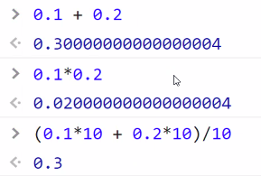
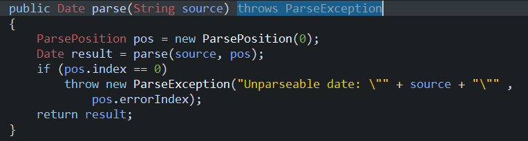
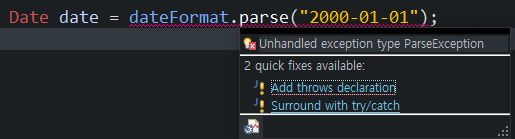
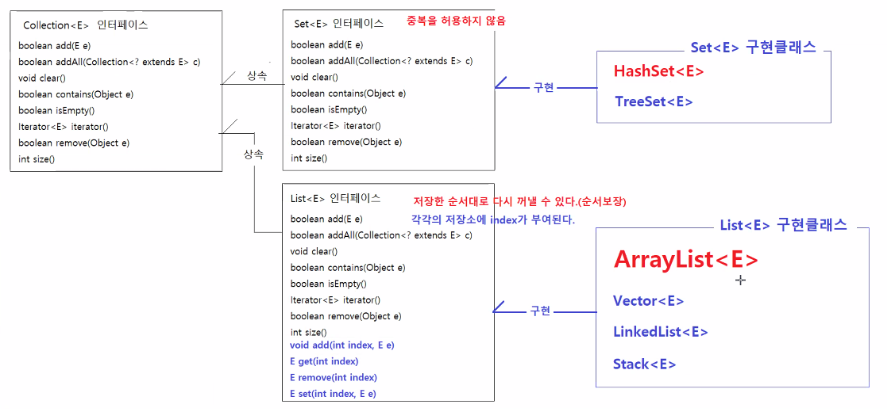

# 3/25

- [3/25](#325)
  - [Wrapper 클래스](#wrapper-클래스)
    - [Wrapper 클래스의 상수, 메소드](#wrapper-클래스의-상수-메소드)
    - [오토박싱과 오토언박싱](#오토박싱과-오토언박싱)
      - [실습](#실습)
    - [기본자료형 <-> 문자열 변환](#기본자료형---문자열-변환)
      - [실습](#실습-1)
    - [실수값의 연산](#실수값의-연산)
  - [Date 클래스](#date-클래스)
  - [formatting 포맷팅](#formatting-포맷팅)
    - [SimpleDateFormat](#simpledateformat)
      - [실습](#실습-2)
    - [dateFormat.parse()](#dateformatparse)
      - [실습](#실습-3)
  - [Time 클래스](#time-클래스)
    - [LocalDate 클래스](#localdate-클래스)
    - [LocalDateTime 클래스](#localdatetime-클래스)
    - [LocalDate와 LocalDateTime 활용하기](#localdate와-localdatetime-활용하기)
    - [Period 클래스](#period-클래스)
    - [ChronoUnit 클래스](#chronounit-클래스)
  - [Collection Framework](#collection-framework)
    - [자바의 자료구조 특징](#자바의-자료구조-특징)
    - [배열과 콜렉션](#배열과-콜렉션)
    - [제네릭](#제네릭)
      - [실습](#실습-4)
    - [`Collection<E>`](#collectione)
    - [Collection의 주요 하위 인터페이스](#collection의-주요-하위-인터페이스)
    - [**`Set<E>`**](#sete)
    - [**`List<E>`**](#liste)
      - [실습](#실습-5)
  - [과제3](#과제3)

<small><i><a href='http://ecotrust-canada.github.io/markdown-toc/'>Table of contents generated with markdown-toc</a></i></small>


## Wrapper 클래스
* 클래스 위치 : java.lang.Wrapper
* **기본자료형의 각 타입에 대응되는 클래스**
  ```java
  byte      Byte
  short     Short
  int       Integer
  long      Long
  float     Float
  double    Double
  char      character
  boolean   Boolean
  ```
  + 객체만 저장되는 곳에 기본자료형값을 저장하기 위해서 정의
    * `Integer x = new Integer(1);`
  * 기본자료형 값에 대한 다양한 기능을 제공하기 위해서 정의
    ```java
    Integer.min(int x, int y)
    Integer.max(int x, int y)
    Integer.sum(int x, int y)
    Integer.parseInt(String s)
    Integer.parseInt(String s, int radix)   // 진법(radix)에 맞게 String을 Int로 바꾼다.
    Integer.reverse(int x)
    Integer.toBinaryString(int x)           // 2진수로 변환
    Integer.toHexString(int x)              // 16진수로 변환
    Integer.toOctalString(int x)            // 8진수로 변환

### Wrapper 클래스의 상수, 메소드
* Integer
  * 상수
    ```java
    Integer.MIN_VALUE   // int 타입의 최소값
    Integer.MAX_VALUE   // int 타입의 최대값
    ```
  * 정적 메소드
    ```java
    int Integer.parseInt(String s)               // 숫자로 구성된 문자열을 정수로 변환한다.
    int Integer.parseInt(String s, int radix)    // 지정된 진법의 숫자로 구성된 문자열을 정수로 변환한다.
    String Integer.toBinaryString(int x)         // 정수를 이진수로 구성된 문자열로 반환한다.
    String Integer.toHexString(int x)            // 정수를 16진수로 구성된 문자열로 반환한다.
    String Integer.toOctalString(int x)          // 정수를 8진수로 구성된 문자열로 반환한다.    
    ```
* Long
  * 상수
    ```java
    Long.MIN_VALUE
    LONG.MAX_VALUE
    ```
  * 정적 메소드
    ```java
    long Long.parseLong(String s)               // 숫자로 구성된 문자열을 정수로 변환한다.
    long Long.parseLong(String s, int radix)    // 지정된 진법의 숫자로 구성된 문자열을 정수로 변환한다.
    String Long.toBinaryString(long x)         // 정수를 이진수로 구성된 문자열로 반환한다.
    String Long.toHexString(long x)            // 정수를 16진수로 구성된 문자열로 반환한다.
    String Long.toOctalString(long x)          // 정수를 8진수로 구성된 문자열로 반환한다.   
    ```
* Double
  * 상수
    ```java
    Double.MIN_VALUE
    Double.MAX_VALUE
    ```
  * 정적 메소드
    ```java
    double Double.parseDouble(String s)               // 숫자로 구성된 문자열을 정수로 변환한다.
    String Double.toHexString(double x)            // 정수를 16진수로 구성된 문자열로 반환한다.

    ```
* Boolean
  * 정적 메소드
    ```java
    boolean Boolean.parseBoolean(String s)
    ```

### 오토박싱과 오토언박싱
* java 1.5 버전부터 도입됨
* 기본자료형 타입과 Wrapper객체 타입간의 변환을 자동으로 지원한다.
* 오토박싱
  ```java
  // 변수가 Wrapper 클래스타입의 변수면, 기본자료형 값을 대입했을 때,
  // 자동으로 기본자료형값을 포함하는 Wrapper객체를 생성해서 그 객체의 참조값이 대입된다.

  Integer x = 10;   // 실제 실행되는 코드 : Integer x = new Integer(10);
  Long x = 100000L; // 실제 실행되는 코드 : Long x = new Long(100000L);
  Double x = 3.14;  // 실제 실행되는 코드 : Double x = new Double(3.14);
  ```
* 오토 언박싱
  ```java
  // Wrapper 타입 객체를 기본자료형 타입의 변수에 대입하면, Wrapper객체가 가지고 있는 기본자료형값이 변수에 대입된다.
  Integer x = new Integer(100);
  int y = x;        // x가 참조하는 Wrapper객체의 100이 y에 대입된다.
  ```

#### 실습
```java
package lang.wrapper;

public class WrapperApp {

	public static void main(String[] args) {
		// 오토박싱
		// 기본 자료형 티입의 값을 대응되는 Wrapper클래스타입의 변수에 대입할 수 있다.
		// 기본 자료형 타입에 대응되는 Wrapper객체가 생성되고, 생성된 Wrapper객체에 기본자료형값이 저장된 다음, Wrapper객체의 참조값이 대입된다.
		Integer a = 10;			// Integer a = Integer.valueOf(10);		혹은 Integer a = new Integer(10);
		Long b = 10000000000L;  // Long b = Long.valueOf(10000000000L);		Long b = new Long(10000000000L
		Double c = 3.14;		// Double c = Double.valueOf(3.14);			Double c = new Double(3.14);
		
		// 오토언박싱
		// 기본 자료형타입의 변수에 Wrapper객체를 대입할 수있다.
		// Wrapper객체의 xxxValue()메소드를 실행해서 기본자료형값을 획득하고, 획득한 기본자료형값을 변수에 대입한다.
		int x = a;				// int x = a.intValue();
		long y = b;				// long y = b.longValue(); 
		double z = c;			// double z = c.doubleValue();
		
		System.out.println("x의 값: " + x);
		System.out.println("y의 값: " + y);
		System.out.println("z의 값: " + z);
	}
}

```

### 기본자료형 <-> 문자열 변환
* 문자열을 기본자료형타입의 값으로 변환
  * Wrapper클래스의 `parse자료형()`메소드

* 기본자료형타입의 값을 문자열로 변환
  * String클래스의 `valueOf()`메소드

#### 실습
```java
package lang.wrapper;

public class WrapperApp2 {

	public static void main(String[] args) {

		/*
		 * Wrapper 클래스의 정적 메소드
		 * 		문자열을 가본자료형타입의 값으로 변환하는 기능을 제공한다.
		 * 		문자열 -> 정수
		 * 				Integer.parseInt("1234") 		-> 1234
		 * 				Long.parseLong("100000000000") 	-> 100000000000 
		 * 		문자열 -> 실수
		 * 				Double.parseDouble("3.14")		-> 3.14
		 * 		문자열 -> 불린
		 * 				Boolean.parseBoolean("true")	-> true
		 * 
		 * String 클래스의 정적 메소드
		 * 		기본자료형타입의 값을 문자열로 변환하는 기능을 제공한다.
		 * 		정수 -> 문자열
		 * 				String.valueOf(1234)			-> "1234"
		 * 				String.valueOf(100000000000L)	-> "100000000000"
		 * 		실수 -> 문자열
		 * 				String.valueOf(3.14)			-> "3.14"
		 * 		불린 -> 문자열
		 * 				String.valueOf(true)			-> "true"
		 */
		
		int x = Integer.parseInt("1234");
		int y = Integer.parseInt("45");
		System.out.println(x*y);
		
		long a = Long.parseLong("100000000000");
		long b = Long.parseLong("23");
		System.out.println(a/b);
		
		double c = Double.parseDouble("0.2");
		double d = Double.parseDouble("0.1");
		System.out.println(c + d);
		
		// 아래 모든 예시는 NumberFormatException 예외가 발생하는 코드다. ""안에 int만 있어야 된다.
		// NumberFormatException 예외는  숫자로 변환하는 문자열에 숫자가 아닌 문자가 포함되어 있을 때 발생되는 예외객체다.
//		int k = Integer.parseInt("");		// java.lang.NumberFormatException: For input string: ""
//		int l = Integer.parseInt(" ");		// java.lang.NumberFormatException: For input string: " "
//		int m = Integer.parseInt("123가");	// java.lang.NumberFormatException: For input string: "123가"
//		int n = Integer.parseInt(" 123");	// java.lang.NumberFormatException: For input string: " 123"
//		int o = Integer.parseInt("123 ");	// java.lang.NumberFormatException: For input string: "123 "
		
	}
}

```

### 실수값의 연산
* 컴퓨터에서 실수를 저장하는 방법 자체가 문제가 있기 때문에 실수 계산에서 오차가 발생한다.  


* 실수를 정수화할 수 있는 만큼 곱하고 필요한 계산을 한 뒤 그 수를 다시 곱해서 값을 구해야 정확하게 나온다.
  * 은행 앱 달러 계산(`0.99$`) 등..

## Date 클래스
* java.util.Date
  * 날짜와 시간
  * `long getTime()`
* java.sql.Date
  * 날짜
```java
package util.date;

import java.util.Date;

public class DateApp {

	public static void main(String[] args) {
		/*
		 * java.util.Date
		 * 		날짜와 시간정보를 표현하는 객체다.
		 * 		생성자
		 * 			Date()
		 * 				시스템의 현재 날짜, 시간정보가 포함된 객체를 생성한다.
		 * 			Date(long unixTime)
		 * 				지정된 unixTime에 해당하는 날짜, 시간정보가 포함된 객체를 생성한다.
		 * 		주요 메소드
		 * 			long getTime()
		 * 				생성된 Date객체가 표현하는 날짜, 시간정보에 대한 unixTime을 반환한다.
		 * 			void setTime(long unixTime)
		 * 				생성된 Date객체의 날짜와 시간정보를 지정된 unixTime이 가리키는 날짜, 시간정보로 변경한다.
		 * 
		 * java.sql.Date
		 * 		날짜 정보를 표현하는 객체다.
		 */
		
		// 시스템의 현재 날짜와 시간정보를 표현하는 Date객체 생성하기				-> Date()
		Date now = new Date(); 			
		System.out.println(now);
		
		// 유닉스타입값 조회하기  											-> getTime()
		long unixTime = now.getTime();
		System.out.println("유닉스 타임: " + unixTime);
		
		// 지정된 unixTime에 해당하는 날짜와 시간정보를 표현하는 Date객체 생성하기 	->  Date(long date)
		Date dateAndTime = new Date(1000000000000L);
		System.out.println(dateAndTime);
	}
}

```

## formatting 포맷팅
* java.text.SimpleDateFormat
* java.text.NumberFormat
### SimpleDateFormat
* java.text.SimpleDateFormat
    > https://docs.oracle.com/en/java/javase/17/docs/api/java.base/java/text/SimpleDateFormat.html

#### 실습
```java
package util.date;

import java.text.SimpleDateFormat;
import java.util.Date;

public class DateApp2 {

	public static void main(String[] args) {
		/*
		 * java.text.SimpleDateFormat
		 * 		Date -> String으로 String -> Date로 변환하는 기능을 제공하는 클래스다.
		 * 		생성자
		 * 			SimpleDateFormat(String pattern)
		 * 		주요메소드
		 * 			Stringformat(Date date)
		 * 				Date를 문자열로 변환한다.
		 * 			Date parse(String text)
		 * 				문자열을 Date로 변환한다.
		 * 
		 * 주요 패턴문자
		 * 		yy, yyyy		년
		 * 		M, MM			월
		 * 		d, dd			일
		 * 		E, EEE			요일
		 * 		a				오전/오후
		 * 		h, hh			12시간제(1~12)
		 * 		H, HH			24시간제(0~23)
		 * 		m, mm			분
		 * 		s, ss			초
		 * 
		 * 		M은 "1", "2", "3", "4", "5", "6", "7", "8", "9", "10", "11"
		 * 		MM은 "01", "02", "03", "04", "05", "06", "07", "08", "09", "10", "11"
		 */
		
		Date now = new Date();
		
		String pattern1 = "yyyy-MM-dd";				// 2022-03-25
		String pattern2 = "yyyy-M-d";				// 2022-3-25
		String pattern3 = "yy년 M월 d일";				// 22년 3월 25일
		String pattern4 = "yyyy년 M월 d일 EEEE";		// 2022년 3월 25일 금요일
		String pattern5 = "hh:mm:ss";				// 11:37:26
		String pattern6 = "a h시 m분 s초";			// 오전 11시 38분 4초
		String pattern7 = "yyyy-MM-dd HH:mm:ss";	// 2022-03-25 11:41:05
		
		SimpleDateFormat dateFormat = new SimpleDateFormat(pattern7);
		String text = dateFormat.format(now);
		System.out.println(text);
	}
}

```

### dateFormat.parse()
* 지정된 문자열의 시작 부부분에서 텍스트를 구문 분석(parse)해서 날짜를 생성한다.
* 지정된 문자열의 전체 텍스트를 사용하지 않을 수 있다.
* 예외를 던지는(throw exception) 메소드.
  
  * 예외처리를 꼭 해줘야 한다.
  * 예외처리 :
    
    1. 날아오는 것을 쳐내버린다. (다시 던진다.)
       * Add throws declaration
       * 쳐낸것을 JVM이 처리한다.
    2. 날아오는 것을 잡는다.
       * Surround with try/catch

#### 실습
```java
package util.date;

import java.text.ParseException;
import java.text.SimpleDateFormat;
import java.util.Date;

public class DateApp3 {

	public static void main(String[] args) throws ParseException {
		/*
		 * java.text.SimpleDateFormat
		 * 		Date -> String으로 String -> Date로 변환하는 기능을 제공하는 클래스다.
		 * 		생성자
		 * 			SimpleDateFormat(String pattern)
		 * 		주요메소드
		 * 			Stringformat(Date date)
		 * 				Date를 문자열로 변환한다.
		 * 			Date parse(String text)
		 * 				문자열을 Date로 변환한다.
		 * 
		 * 주요 패턴문자
		 * 		yy, yyyy		년
		 * 		M, MM			월
		 * 		d, dd			일
		 * 		E, EEE			요일
		 * 		a				오전/오후
		 * 		h, hh			12시간제(1~12)
		 * 		H, HH			24시간제(0~23)
		 * 		m, mm			분
		 * 		s, ss			초
		 * 
		 * 		M은 "1", "2", "3", "4", "5", "6", "7", "8", "9", "10", "11"
		 * 		MM은 "01", "02", "03", "04", "05", "06", "07", "08", "09", "10", "11"
		 */
		
		String pattern1 = "yyyy-MM-dd";		
		SimpleDateFormat dateFormat1 = new SimpleDateFormat(pattern1);				
		Date date1 = dateFormat1.parse("2000-01-01");
		System.out.println(date1);
		
		Date birthday = dateFormat1.parse("1993-03-30");
		System.out.println(birthday);
		
		String pattern2 = "yyyy-MM-dd HH:mm";		
		SimpleDateFormat dateFormat2 = new SimpleDateFormat(pattern2);				
		Date date2 = dateFormat2.parse("2022-03-22 02:23");
		System.out.println(date2);	
	}
}

```

## Time 클래스
* time.LocalDate
* time.LocalTime
* time.LocalDateTime
* time.Period
* time.Instant
* time.Duration

### LocalDate 클래스
```java
package time;

import java.time.LocalDate;

public class LocalDateApp {
	
	public static void main(String[] args) {
		
		/*
		 * time.LocalDate, time.LocalTime, time.LocalDateTime, time.Period, time.Instant, time.Duration
		 * 		java8에는 날짜와 시간을 다루는 다양한 API가 추가되었다.
		 * 		
		 * 		LocalDate
		 * 			날짜정보를 표현하는 객체다.
		 * 			주요 API
		 * 				정적 메소드
		 * 					static LocalDate LocalDate.now()
		 * 						시스템의 현재 날짜정보가 포함된 LocalDate객체를 반환한다.
		 * 					static LocalDate LocalDate.of(int year, int month, int dayOfMonth)
		 * 						지정된 년,월,일에 해당하는 날짜정보가 포함된 LocalDate객체를 반환한다.
		 * 					static LocalDate LocalDate.parse(String str)
		 * 						"2022-03-22"과 같이 입력하면 그 날짜에 해당하는 LocalDate객체를 반환한다.
		 * 				멤버 메소드
		 * 					지정된 날짜만큼 경과된 날짜정보가 포함된 LocalDate객체를 반환한다.
		 * 					LocalDate plusDays(long days)
		 *					LocalDate plusWeeks(long weeks)
		 *					LocalDate plusMonths(long months)
		 *					LocalDate plusYear(long year)
		 * 					LocalDate minusDays(long days)
		 *					LocalDate minusWeeks(long weeks)
		 *					LocalDate minusMonths(long months)
		 *					LocalDate minusYear(long year)
		 * 
		 * 		LocalTime
		 * 			시간정보를 표현하는 객체다.
		 * 		LocalDateTime
		 * 			날짜정보와 시간정보를 표현하는 객체다.
		 * 			주요 API
		 * 				static LocalDateTime	LocalDateTime.now()
		 * 					시스템의 현재 날짜와 시간정보가 포함된 LOcalDateTime객체를 반환한다.
		 * 				static LocalDateTime	LocalDateTime.of(int year, int month, int day, int hour, int minute)		
		 * 				static LocalDateTime	LocalDateTime.of(int year, int month, int day, int hour, int minute, int second)		
		 * 				static LocalDateTime	LocalDateTime.parse(String str)
		 * 					"2022-03-22T10:15:20"과 같이 입력하면 그 날짜에 해당하는 LocalDateTIme을 반환한다.
		 * 				멤버 메소드
		 * 					지정된 날짜만큼 경과된 날짜정보가 포함된 LocalDate객체를 반환한다.
		 * 					LocalDate plusDays(long days)
		 *					LocalDate plusWeeks(long weeks)
		 *					LocalDate plusMonths(long months)
		 *					LocalDate plusYear(long year)
		 *					LocalDate plusHour(long hours)
		 *					LocalDate plusMinutes(long minutes)
		 *					LocalDate plusSeconds(long seconds)
		 * 					LocalDate minusDays(long days)
		 *					LocalDate minusWeeks(long weeks)
		 *					LocalDate minusMonths(long months)
		 *					LocalDate minusYear(long year)
		 *					LocalDate minusHour(long hours)
		 *					LocalDate minusMinutes(long minutes)
		 *					LocalDate minusSeconds(long seconds)
		 * 
		 * 		Period와 Duration
		 * 			날짜의 차이를 표현하는 객체다.
		 * 			period는 기간(년, 월, 일)을 구할 때 사용한다.
		 * 			Duration은 시간, 분, 초 단위의 차이를 구할 때 사용한다.
		 */
		
		// LocalDate 객체로 날짜 표현하기
		// 현재 시스템의 날짜정보를 포함하는 LocalDate객체 생성하기
		LocalDate today = LocalDate.now();
		System.out.println("오늘: " + today);
	
		// 년,월,일을 지정해서 해당 날짜 정보를 포함하는 LocalDate객체 생성하기
		LocalDate birthday = LocalDate.of(1900, 8, 21);
		System.out.println("생일: " + birthday);
		
		// 문자열로 표시된 날짜정보를 포함하는 LocalDate객체 생성하기
		LocalDate tomorrow = LocalDate.parse("2022-03-26");
		System.out.println("내일: " + tomorrow);
	}

}

```
### LocalDateTime 클래스

```java
package time;

import java.time.LocalDateTime;

public class LocalDateTimeApp {
	
	public static void main(String[] args) {		
		// LocalDateTime으로 날짜와 시간정보 표현하기
		
		// 시스템의 현재 날짜와 시간정보가 포함된 LocalDateTime객체 생성하기
		LocalDateTime now = LocalDateTime.now();
		System.out.println("현재 날짜와 시간: " + now);
		
		// 년,월,일,시,분,초를 지정해서 localDateTime객체 생성하기
		LocalDateTime birthday = LocalDateTime.of(1990, 8, 21, 14, 21, 59);
		System.out.println("생일: " + birthday);
		
		// 문자열로 표현된 날짜와 시간정보로 LocalDateTime객체 생성하기
		LocalDateTime tomorrow = LocalDateTime.parse("2022-03-26T14:25:30");
		System.out.println("내일: " + tomorrow);
	}

}

```

### LocalDate와 LocalDateTime 활용하기
```java
package time;

import java.time.LocalDate;
import java.time.LocalDateTime;
import java.time.LocalTime;

public class LocalDateAndLocalDateTimeApp {
	
	public static void main(String[] args) {		
		LocalDate today = LocalDate.now();
		
		// java.time.LocalDate      getYear()
		System.out.println("today(): " + today);
		System.out.println("getYear(): " + today.getYear());
//		System.out.println("getMonth(): " + today.getMonth());
		System.out.println("getMonthValue(): " + today.getMonthValue());
		System.out.println("getDayOfMonth(): " + today.getDayOfMonth());
//		System.out.println("getDayOfYear()f: " + today.getDayOfYear());
		
		// java.time.LocalDate       plusYears()
		LocalDate oneYearAfter = today.plusYears(1);
		LocalDate oneMonthAfter = today.plusMonths(1);
		LocalDate oneWeekAfter = today.plusWeeks(1);
		LocalDate oneDayAfter = today.plusDays(1);
		System.out.println("1년 후: " + oneYearAfter);
		System.out.println("1달 후: " + oneMonthAfter);
		System.out.println("1주 후: " + oneWeekAfter);
		System.out.println("1일 후: " + oneDayAfter);
		// java.time.LocalDate       minusYears()
		LocalDate oneYearBefore = today.minusYears(1);
		LocalDate oneMonthBefore = today.minusMonths(1);
		LocalDate oneWeekBefore = today.minusWeeks(1);
		LocalDate oneDayBefore = today.minusDays(1);
		System.out.println("1년 전: " + oneYearBefore);
		System.out.println("1달 전: " + oneMonthBefore);
		System.out.println("1주 전: " + oneWeekBefore);
		System.out.println("1일 전: " + oneDayBefore);
		
		// java.time.LocalTime       atTime()
		// java.time.LocalDateTime   getHour()
		LocalDateTime now = today.atTime(LocalTime.now());
		System.out.println("지금: " + now);
		System.out.println("시간: " + now.getHour());
		System.out.println("분: " + now.getMinute());
		System.out.println("초: " + now.getSecond());
		System.out.println("나노초: " + now.getNano());
	}

}

```
### Period 클래스
```java
package time;

import java.time.LocalDate;
import java.time.Period;

public class PeriodApp {

	public static void main(String[] args) {
		/*
		 * Period와 Duration
		 * 		날짜의 차이를 표현하는 객체다.
		 * 		Period는 기간(년, 월, 일)을 구할 때 사용한다.
		 * 		Duration은 시간, 분, 초 단위의 차이를 구할 때 사용한다.
		 * 
		 * Period
		 * 		정적 메소드
		 * 			static Period Period.between(LocalDate startDate, LocalDate endDate)
		 */
		
		LocalDate today = LocalDate.now();
		LocalDate birthday = LocalDate.of(2018, 12, 7);
		
		Period period = Period.between(birthday,  today);
		int years = period.getYears();
		int months = period.getMonths();
		int days = period.getDays();
		
		System.out.println("태어난지 " + years + "년 " + months + "개월 " + days + "일이 지났습니다.");
		
		long totalMonths = period.toTotalMonths();
		
		System.out.println("총 개월 수는 " + totalMonths + "개월 입니다.");
	}
}

```

### ChronoUnit 클래스
```java
package time;

import java.time.LocalDate;
import java.time.temporal.ChronoUnit;

public class ChronoUnitApp {

	public static void main(String[] args) {
		
		/*
		 * ChronoUnit
		 * 		Duration이나 Period객체를 생성하지 않고, 특정 시점의 두 날짜 사이의 여러 값들에 대한 길이를 구할 수 있다.
		 * 		    long ChronoUnit.YEARS.between(Temporal start, Temporal end) 
		 * 		    long ChronoUnit.MONTHS.between(Temporal start, Temporal end) 
		 * 		    long ChronoUnit.WEEKS.between(Temporal start, Temporal end) 
		 * 		    long ChronoUnit.DAYS.between(Temporal start, Temporal end) 
		 * 		    long ChronoUnit.HOURS.between(Temporal start, Temporal end) 
		 * 		    long ChronoUnit.MINUTES.between(Temporal start, Temporal end) 
		 * 		    long ChronoUnit.SECONDS.between(Temporal start, Temporal end) 
		 * 		    long ChronoUnit.NANOS.between(Temporal start, Temporal end) 
		 * 
		 * 			* 위의 정적 메소드는 두 시점간의 년, 월, 주, 일, 시간, 분 , 초, 나노초 단위의 길이를 반환한다.
		 * 
		 * 		* Temporal은 LocalDate, LocalTime, LocalDateTime의 부모 인터페이스다.
		 */
		LocalDate today = LocalDate.now();
		LocalDate birthday = LocalDate.parse("2018-12-07");
		
		long years = ChronoUnit.YEARS.between(birthday, today);
		long months = ChronoUnit.MONTHS.between(birthday, today);
		long weeks = ChronoUnit.WEEKS.between(birthday, today);
		long days = ChronoUnit.DAYS.between(birthday, today);
//		long hours = ChronoUnit.HOURS.between(birthday, today);
//		long minutes = ChronoUnit.MINUTES.between(birthday, today);
//		long seconds = ChronoUnit.SECONDS.between(birthday, today);
//		long nanos = ChronoUnit.NANOS.between(birthday, today);
		
		System.out.println("태어난지 " + years + "년 ");
		System.out.println("태어난지 " + months + "개월 ");
		System.out.println("태어난지 " + weeks + "주 ");
		System.out.println("태어난지 " + days + "일");
//		System.out.println("태어난지 " + hours + "시");
//		System.out.println("태어난지 " + minutes + "분");
//		System.out.println("태어난지 " + seconds + "초");
//		System.out.println("태어난지 " + nanos + "나노초");
	}
}

```

## Collection Framework
* 자바가 자료구조를 구현해 놓은 것.
  * 자료구조 : 객체의 저장/삭제/조회 등의 기능을 제공하는 것.
* 자바의 모든 자료구조 클래스는 Collection 인터페이스를 구현한 클래스다.
  * Collection 인터페이스에 정의된 모든 기능을 구현하고 있다.
### 자바의 자료구조 특징
* 객체만 저장할 수 있다.
* 크기가 가변적이다.
* 다양한 메소드를 지원한다.

### 배열과 콜렉션
구분    |   값  |    크기    |   메소드 
---|---|---|---
배열    |   기본자료형, 객체    |   불변    |   없음    
콜렉션  |   Wrapper객체, 객체    |  가변적  |   저장/삭제/조회/검색 기능을 제공하는 메소드가 있음.  
* 배열 생성하기
  * `자료형[] 참조변수명 = new 자료형[크기];`
* 콜렉션 생성하기
  * `콜렉션<자료형> 참조변수명 = new 콜렉션<>();`

### 제네릭
* 소스레벨에서 타입이 결정되지 않고, 별칭(타입파라미터)만 지정한다.
* 그리고 객체생성시점, 구현시점, 메소드 실행시점에 별칭을 대신할 데이터 타입을 지정하는 것이다.
* 형태 : `<자료형>` 
```java
// 소스레벨에서 Box가 저장할 객체의 타입이 Book으로 지정되어 있는 경우
public class Box {
    private Book[] items = new Book[10];            // Book객체만 10개 저장할 수 있다.
    public Book getItem(int index) {
        return item[index];
    }
    public void setItem(int index, Book book) {
        items[index] = book;
    }
}
Box box = new Box();
box.setItem(new Book());  // Book객체 외의 다른 객체를 담을 수 없다.
```
```java
// 소스레벨에서 Box가 저장할 객체의 타입이 Object로 지정되어 있는 경우
//      어떤 객체든 담을 수 있다.
//      하지만 
public class Box {
    private Object[] items = new Object[10];        // 어떤 객체든지 10개 저장할 수 있다. Book객체, Product객체, User객체 등 다양한 객체들이 섞여서 저장될 수 있다.(혼란)
    public Object getItem(int index) {
        return items[index];
    }
    public void setItem(int index, Object item) {
        items[index] = item;
    }
}
// 책 담는 Box객체를 만들고자함.
Box box1 = new Book();
box1.setItem(0, new Book());              // items의 0번째칸에 Book객체를 저장함. 
Book book = (Book) box1.getItem(0);       // 0번째 저장된 객체를 꺼낼 때마다 형변환을 해야 된다.
box.setItem(1, new Product());            // items의 1번째 칸에 Product객체를 저장함. Book객체 외의 다른 객체가 저장되는 것을 체크할 수 없다.
```
```java
// 제네릭 사용, 소스레벨에서 타입이 결정되지 않고, 별칭만 지정한다. 그리고 객체 생성시점에 별칭을 대신할 데이터 타입을 지정한다.
public class Box<T> {
    private T[] items = new T[10];                  // 별칭만 지정. 타입 결정 x
    public T getItem(int index) {
        return items[index];
    }
    public void setItem(int index, T item) {
        items[index] = item;
    }
}

Box<Person> personBox = new Box<>();                // 별칭을 대신할 데이터 타입 지정
public class Box<Person> {
    private Person[] items = new Person[10];
    public Person getItem(int index) {
        return items[index];
    }
    public void setItem(int index, Person item) {
        items[index] = item;
    }
}

Box<Book> personBox = new Box<>();
public class Box<Book> {
    private Book[] items = new Book[10];
    public Book getItem(int index) {
        return items[index];
    }
    public void setItem(int index, Book item) {
        items[index] = item;
    }
}
```
#### 실습
```java
package util.generic;

/*
 * Box<E> 클래스는 제네릭 클래스다.
 * Box<E> 클래스의 E는 타입파라미터다.
 * 객체 생성시점에 E의 타입을 지정할 수 있다.(필수)
 * 객체 생성시점에 E의 타입을 지정하면 소스코드에서 E로 표시된 곳이 전부 지정한 타입으로 대체된 Box객체가 생성된다.
 * 객체 생성시점에 E의 타입을 지정하지 않으면 Object타입으로 간주한다.
 */
public class Box<E> {
	private Object[] items = new Object[10];
	
	public void addItem(int index, E e) {
		items[index] = e;
	}
	
	@SuppressWarnings("unchecked")
	public E getItem(int index) {
		return (E) items[index];
	}
}
```
```java
package util.generic;

public class Score {

	private String name;
	private int kor;
	private int eng;
	private int math;
	
	
	public Score(String name, int kor, int eng, int math) {
		super();
		this.name = name;
		this.kor = kor;
		this.eng = eng;
		this.math = math;
	}

	public String getName() {
		return name;
	}

	public void setName(String name) {
		this.name = name;
	}

	public int getKor() {
		return kor;
	}

	public void setKor(int kor) {
		this.kor = kor;
	}

	public int getEng() {
		return eng;
	}

	public void setEng(int eng) {
		this.eng = eng;
	}

	public int getMath() {
		return math;
	}

	public void setMath(int math) {
		this.math = math;
	}
}
```
```java
package util.generic;

public class BoxApp {

	public static void main(String[] args) {
		// Box<E> 제네릭 클래스의 E를 String타입으로 지정한 Box객체를 생성함
		// String 객체만 저장할 수 있음
		// Box객체에서 꺼낸 객체도 항상 String 타입이다. 추가적인 형변환 작업이 필요없다.
		Box<String> nameBox = new Box<>();
		// nameBox.addItem()의 매개변수타입은 각각 int와 String이다.
		nameBox.addItem(0, "홍길동");
		nameBox.addItem(1, "김유신");
		
		// nameBox.getItem(0)의 반환타입이 String이다.
		String name0 = nameBox.getItem(0);
		String name1 = nameBox.getItem(1);
		System.out.println(name0 + ", " + name1);
		
		// Box<E> 제네릭 클래스의 E를 Score타입으로 지정한 Box객체를 생성함
		Box<Score> scoreBox = new Box<>();
		// ScoreBox.addItem()의 매개변수 타입은 각각 int와 Score이다.
		scoreBox.addItem(0, new Score("홍길동", 100, 80, 100));
		scoreBox.addItem(0, new Score("김유신", 90, 70, 70));

		// ScoreBox.getItem(0)의 반환타입이 Score다.
		Score score0 = scoreBox.getItem(0);
	}
}
```

### `Collection<E>`
* 모든 자료구조 클래스의 최상위 인터페이스다.
* 주요 메소드
    * `boolean add(E e)`
      * 자료구조에 새로운 요소를 추가한다.
    * `boolean addAll(Collection<? extends E> c)`
      * 자료구조에 다른 자료구조의 모든 요소를 추가한다.
    * `void clear()`
      * 자료구조의 모든 요소를 삭제한다.
    * `boolean contains(Object e)`
      * 자료구조에 지정된 객체가 존재하는지 조회한다.
    * `boolean isEmpty()`
      * 자료구조가 비었는지 조회한다.
    * `Iterator<E> iterator()`
      * 자료구조의 각 요소를 반복해서 추출해주는 반복자객체를 반환한다.
    * `boolean remove(Object e)`
      * 자료구조에서 지정된 객체를 삭제한다.
    * `int size()`
      * 자료구조에 저장된 요소의 갯수를 반환한다.
    * `Object[] toArray()`
      * 자료구조에 저장된 요소를 배열로 반환한다.

### Collection의 주요 하위 인터페이스


### **`Set<E>`**
* 중복을 허용하지 않는다.(동일한 객체를 2개 저장할 수 없다.)
* 주요 구현 클래스
  * **`HashSet<E>`** : 가장 많이 사용하는 Set구현 클래스
  * `TreeSet<E>` : 저장되는 요소가 오름차순으로 정렬되어서 저장된다
* Set의 구현객체 생성하기
  ```java
  // String 객체를 여러 개 저장하는 HashSet객체 생성하기
  Set<String> set1 = new HashSet<String>();
  // 정수를 여러 개 저장하는 HashSet객체 생성하기
  Set<Integer> set2 = new HashSet<Integer>();

  // Book객체를 여러 개 저장하는 HashSet객체 생성하기
  Set<Book> set3 = new HashSet<Book>();
  // Account객체를 여러 개 저장하는 HashSet객체 생성하기
  Set<Account> set4 = new HashSet<Account>();
  ```
* `HashSet<E>` 활용하기
  ```java
  public static void main(String[] args) {
    // String객체를 여러 개 저장하는 HashSet객체 생성하기
    Set<String> set = new HashSet<String>();

    // HashSet에 객체 저장하기
    set.add("홍길동");
    set.add("김유신");
    set.add("이순신");
    set.add("강감찬");
    set.add("류관순");
    set.add("강감찬");	// 동일한 객체가 저장되어 있기 때문에 저장되지 않음

    // HashSet에 저장된 객체의 갯수 조회하기
    int count = set.size();
    System.out.println("저장된 객체의 갯수: " + count);	// 5가 출력됨

    // HashSet이 지정된 객체를 포함하고 있는지 조회하기
    boolean hasElement = set.contains("김유신");
    System.out.println("김유신을 포함하고 있는가?" + hasElement); // true가 출력됨

    // HashSet에서 지정된 객체를 삭제하기
    set.remove("홍길동");

    // HashSet이 비어있는지 조회하기
    boolean empty = set.isEmpty);
    System.out.println("비어있는가?" + empty);		// false가 출력됨

    // HashSet에 저장된 객체를 향상된 for문을 사용해서 순회하기
    for (String name : set) {
      System.out.println("저장된 이름: " + name);
    }
    // HashSet에 저장된 모든 객체 삭제하기		
    set.clear();
  }
  ```

### **`List<E>`**
* 순서가 유지된다.(저장된 순서대로 다시 꺼낼 수 있다.)
* 요소가 저장될 때 마다 index(순번)이 자동으로 부여된다.
* 특정위치에 요소 저장하기, 특정위치의 요소 삭제하기, 특정위치의 요소 꺼내기
* `List<E>`가 지원하는 추가 메소드
  * `void add(int index, E e)`
    * 지정된 위치에 요소를 저장한다.
  * `E get(int index)`
    * 지정된 위치의 요소를 꺼낸다
  * `E remove(int index)`
    * 지정된 위치의 요소를 삭제한다.
  * `E set(int index, E e)`
    * 지정된 위치의 요소를 새 요소로 교체한다.
* 주요 구현 클래스
  * **`ArrayList<E>`** : 가장 많이 사용하는 List구현 클래스(전체 자료구조 클래스 중에서 가장 많이 사용)
  * `LinkedList<E>` : 더블링크로 List를 구현한 클래스(요소의 추가/삭제 성능이 우수하다.)
  * `Vector<E>` : ArrayList와 유사하는 List구현 클래스(멀티스레드 환경에 안전하다.)
  * `Stack<E>` : LIFO(Last-In-First-Out)으로 구현된 List구현 클래스
* `List<E>`의 구현객체 생성하기
  ```java
  // String객체를 여러 개 저장하는 ArrayList객체 생성하기
  List<String> list1 = new ArrayList<String>();
  // 실수를 여러 개 저장하는 ArrayList객체 생성하기
  List<Double> list2 = new ArrayList<Double>();
  
  // Person객체를 여러 개 저장하는 ArrayList객체 생성하기
  List<Person> list3 = new ArrayList<Person>();
  ```
* `ArrayList<E>` 활용하기
  ```java
  public class Person {
    private int no;
    private String name;
    public Person() {}
    public Person(int no, String) {
      this.no = no;
      this.name = name;
    }
    public int getNo() {
      return no;
    }
    public String name() {
      return name;
    }
  }
  ```
  ```java
  public static void main(String[] args) {
    // Person객체를 여러 개 저장할 수 있는 ArrayList객체 생성하기
    List<Person> personList = new ArrayList<Person>();
    
    // ArrayList객체에 Person객체생성하기
    personList.add(new Person(100, "김유신"));
    personList.add(new Person(200, "강감찬"));
    personList.add(new Person(300, "이순신"));
    personList.add(new Person(400, "류관순"));
    
    // ArrayList객체에 저장된 Person객체의 갯수를 조회하기
    int count = personList.size();
    System.out.println("저장된 갯수: " + count); // 4가 출력됨
    
    // 향상된 for문을 사용해서 ArrayList객체에 저장된 Person객체를 순회하기
    for (Person person : personList) {
      int no = person.getNo();
      String name = person.getName();
      System.out.println("번호:" + no + ", 이름:" + name);
    }
    
    // ArrayList객체에서 0번에 저장된 Person객체 조회하기
    Person person0 = personList.get(0);
    
    // ArrayList객체에서 2번에 칸에 저장된 Person객체 삭제하기
    personList.remove(2)
    
    // ArrayList객체에서 1번에 저장된 객체를 새로운 Person객체로 변경하기
    personList.set(1, new Person(500, "안중근"));
    
    // ArrayList객체에 저장된 모든 객체 삭제하기
    personList.clear()
  }
  ```
* ` Stack<E>` 객체 사용하기
  ```java
  public static void main(String[] args) {
    Stack<String> stack = new Stack<String>();
    
      // Stack객체에 문자열 저장하기
      stack.push("김유신");
      stack.push("강감찬");
      stack.push("이순신");

      // Stack객체에서 맨 위에 있는 객체를 조회한다.
      String value1 = stack.peek();	// 이순신
      String value2 = stack.peek();	// 이순신
      String value3 = stack.peek();	// 이순신
    
    // Stack객체에서 맨 위에 있는 객체를 꺼낸다.(Stack에서 해당 객체는 삭제된다.)
    String value1 = stack.pop();	// 이순신
      String value2 = stack.pop();	// 강감찬
      String value3 = stack.pop();	// 김유신
    
    // Stack객체가 비어있는지 확인하기
    boolean result = stack.isEmpty(); // true가 반환된다.
  }
  ```

#### 실습
* `ArrayList<E>` 만들고 사용해보기

```java
package util.List;

import java.util.ArrayList;

public class ArrayListApp {

	public static void main(String[] args) {
		
		// 사용자 이름을 여러개 저장하는 자료구조 구현객체 생성하기
		ArrayList<String> nameList = new ArrayList<String>();
		
		// boolean add(E e) 메소드는 ArrayList에 객체를 저장한다.
		//		List<E>에서 저장되지 않는 경우는 없으므로 항상 true라 boolean이 리턴된다는 것은 중요하지 않다.
		// 		Set<E>에서는 중복된 값은 저장되지 않기 때문에 boolean값이 리턴되는 것이 중요하다.
		// add(E e) 메소드는 객체를 기존의 저장된 객체들의 다음 순서(리스트의 마지막)에 저장한다.
		// add(E e) 메소드는 저장공간이 부족하면 자동으로 저장공간을 늘린 후 객체를 저장한다.
		nameList.add("홍길동");	System.out.println(nameList);
		nameList.add("김유신");	System.out.println(nameList);
		nameList.add("강감찬");	System.out.println(nameList);

		// int size() 메소드는 저장된 객체의 개수를 반환한다.
		// ArrayList의 저장공간 크기가 아니고, 실제 저장된 객체의 개수를 반환한다.
		int elemetCount = nameList.size();
		System.out.println("저장된 데이터 개수: " + elemetCount);
		
		// boolean isEmpty() 메소드는 ArrayList객체가 비어있으면 true를 반환한다.
		boolean empty = nameList.isEmpty();
		System.out.println("비어있는가?" + empty);
		
		// void clear() 메소드는 ArrayList객체에 저장된 모든 객체를 삭제한다.
		nameList.clear();
		System.out.println("비어있는가?" + nameList.isEmpty());
		
		nameList.add("김유신");
		nameList.add("류관순");
		nameList.add("강감찬");
		nameList.add("이순신");
		nameList.add("안중근");
		nameList.add("김봉창");		
		
		// ArrayList객체에 저장된 모든 객체를 꺼내기
		//		넣은 순서대로 출력한다.
		for (String name : nameList ) {
			System.out.println(name);
		}
	}
}

```
```java
package util.List;

import java.util.ArrayList;

import util.generic.Score;

public class ArrayListApp2 {

	public static void main(String[] args) {
		// Score객체를 여러 개 저장하는 ArrayList객체 생성하기
		ArrayList<Score> scoreList = new ArrayList<>();
		
		Score score1 = new Score("김유신", 100, 100, 100);
		scoreList.add(score1);
		scoreList.add(new Score("강감찬", 100, 90, 90));
		scoreList.add(new Score("이순신", 70, 80, 90));
		scoreList.add(new Score("류관순", 90, 60, 70));
		scoreList.add(new Score("윤봉길", 70, 70, 70));
		scoreList.add(new Score("안중근", 80, 80, 70));
		
		for (Score score : scoreList) {
			System.out.println(score.getName() + ", " + score.getKor() + ", " + score.getEng() + ", " + score.getMath());
		}
	}
}

```

* ArrayList의 장점
  * 크기를 정하지 않아도 되는 편리함
  * null값을 걱정 안해도 되는 편리함
  * 값을 순서대로 사용할 수 있는 편리함
  * 등등

## 과제3
```
클래스
객체
클래스 정의하기
객체 생성하기
클래스의 멤버변수 정의하기
객체 생성해서 멤버변수에 값 대입하기, 값 꺼내서 사용하기
클래스의 생성자 정의하기
클래스의 생성자 중복정의하기
클래스의 생성자를 이용해서 멤버변수 값 초기화하기
클래스의 멤버메소드 정의하기
클래스의 멤버메소드에서 멤버변수값 사용하기
Getter/Setter 메소드 정의하기
Getter/Setter 메소드를 이용해서 멤버변수의 값 조회하고, 변경하기
toString()을 재정의해서 멤버변수의 값을 한번에 출력해보기

부모클래스를 상속받아서 자식 클래스 정의해보기
자식 객체 생성해서 부모 객체의 공개된 멤버변수, 공개된 멤버메소드 실행하보기
자식클래스에서 메소드 재정의 해보기
자식객체를 부모타입의 참조변수에 저장해보기
부모타입의 참조변수로 자식객체에 재정의 메소드 실행해보기
인터페이스 정의해보기
인터페이스를 구현한 구현 클래스 작성해보기
인터페이스 타입의 참조변수로 구현객체 참조하기
인터페이스 타입의 참조변수로 구현객체의 재정의 메소드 실행해보기
```
> [과제3.md](../JHTA/과제3.md)