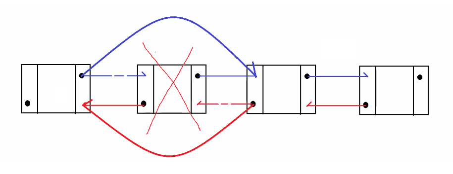
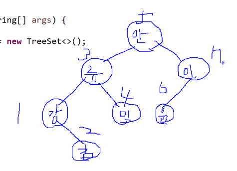

# 3/28

- [3/28](#328)
  - [콜렉션 프레임워크](#콜렉션-프레임워크)
    - [콜렉션 프레임워크의 구조](#콜렉션-프레임워크의-구조)
    - [`Collection<E>` 인터페이스의 하위 인터페이스](#collectione-인터페이스의-하위-인터페이스)
    - [`Collection<E>` 인터페이스의 주요 구현 클래스](#collectione-인터페이스의-주요-구현-클래스)
    - [`Iterator<E>` 인터페이스](#iteratore-인터페이스)
    - [While문](#while문)
      - [실습](#실습)
    - [Object의 `boolean equals(Object other)`](#object의-boolean-equalsobject-other)
    - [String의 `boolean equals(Object other)`](#string의-boolean-equalsobject-other)
    - [`Comparable<T>` 인터페이스](#comparablet-인터페이스)
      - [실습](#실습-1)
    - [코딩의 순서 꿀팁](#코딩의-순서-꿀팁)
    - [ArrayList 실습](#arraylist-실습)
      - [실습](#실습-2)

<small><i><a href='http://ecotrust-canada.github.io/markdown-toc/'>Table of contents generated with markdown-toc</a></i></small>

## 콜렉션 프레임워크
* 자료구조에 대한 자바의 구현체다.
    > [자료구조(資料構造, 영어: data structure)는 컴퓨터 과학에서 효율적인 접근 및 수정을 가능케 하는 자료의 조직, 관리, 저장을 의미한다. 더 정확히 말해, 자료 구조는 데이터 값의 모임, 또 데이터 간의 관계, 그리고 데이터에 적용할 수 있는 함수나 명령을 의미한다. ](https://ko.wikipedia.org/wiki/%EC%9E%90%EB%A3%8C_%EA%B5%AC%EC%A1%B0)

  * 자료구조는 각자의 연산 및 목적에 맞게 여러 종류가 있다.
    * 배열, 튜플, 연결리스트, 해시테이블, 스택, 큐, 그래프, 트리
* 자바는 `Collection<E>` 인터페이스를 이용해서 다양한 자로구조의 기능을 추상화하고, 각각의 자료구조에 대한 다양한 구현클래스를 제공한다.

### 콜렉션 프레임워크의 구조
* `Collection<E>` 인터페이스
  * 모든 자료구조 구현클래스가 반드시 구현해야할 기능을 추상화한 인터페이스다.
  * 저장, 조회, 삭제, 검색과 관련된 기능이 추상화되어 있다.
  * 주요 메소드
    * `boolean add(E e)`
      * 자료구조객체에 객체(데이터객체)를 저장한다. 저장이 완료되면 true 를 반환한다.
    * `boolean addAll(Collection<E> collection)`
      * 자료구조객체에 다른 자료구조객체에 저장된 객체(데이터객체)를 모두 한번에 저장한다. 저장이 완료되면 true를 반환한다.
    * `void clear()`
      * 자료구조객체에 저장된 모든 객체(데이터)를 삭제한다.
    * `boolean contains(Object e)`
      * 자료구조객체에 지정된 객체(데이터)가 저장되어 있으면 true를 반환한다.
    * `boolean isEmpty()`
      * 자료구조객체가 비어있으면 true를 반환한다.
    * `Iterator<E> iterator()`
      * 자료구조객체에 저장된 객체(데이터)를 반복처리할 수 있는 Iterater(반복자)객체를 반환한다.
      * Iterator(반복자)객체를 이용하면 while문에서 객체(데이터)를 반복처리할 수 있고, 특정 객체를 삭제할 수 있다.
      * 향상된-for문은 객체(데이터를)반복처리할 수 있지만, 반복처리 중에 객체(데이터)를 삭제할 수 없다.
    * `boolean remove(Object e)`
      * 자료구조객체에서 지정된 객체(데이터를 삭제한다.)
    * `int size()`
      * 자료구조객체에 저장된 객체(데이터)의 개수를 반환한다
    * `default Stream<E> stream()`
      * java 8 부터 지원
      * 자료구조 객체에 저장된 객체(데이터)를 반복처리할 수 있는 Stream객체를 반환한다.
    * `default Stream<E> parallelStream()`
      * java 8 부터 지원
      * 자료구조객체에 저장된 객체(데이터)를 병렬처리를 이용해서 반복처리할 수 있는 Stream객체를 반환한다.

### `Collection<E>` 인터페이스의 하위 인터페이스
* `Set<E>` 인터페이스
  * 자료구조객체에 같은 객체(데이터)를 중복저장할 수 없다.
  * 주요 구현 클래스
    * `HashSet<E>`,`TreeSet<E>`
  * 주요 메소드
    * `Collection<E>` 인터페이스의 메소드와 동일하다
    * `static Set<E> Set.of()`
    * `static Set<E> Set.of(E... elements)`
    * `static Set<E> Set.of(E e1)`
    * `static Set<E> Set.of(E e1, E e2)`
    * `static Set<E> Set.of(E e1. E e2, E e3)`
      * `Set.of()`메소드는 Set구현객체를 반환한다.
* `List<E>` 인터페이스
  * 자료구조객체에 객체(데이터)를 저장했던 순서 그대로 다시 꺼낼 수 있다.
  * 주요 구현 클래스
    * `ArrayList<E>`, `LinkedList<E>`, `Vector<E>`, `Stack<E>`
  * 주요 메소드
    * `Colletion<E>` 인터페이스의 모든 추상 메소드와 ***인덱스를 활용한 메소드를 제공***한다.
    * `boolean add(int index, E e)`
      * 자료구조객체의 지정된 인덱스위치에 객체(데이터객체)를 저장한다. 저장이 완료되면 true를 반환한다.
    * `boolean addAll(int index, Collection<E> collection)`
      * 자료구조객체에 지정된 인덱스위치에 다른 자료구조객체에 저장된 객체(데이터객체)를 모두 한번에 저장한다.
    * `E get(int index)`
      * 자료구조객체에서 지정된 인덱스위치에 저장된 객체(데이트)를 반환한다.
    * `E remove(int index)`
      * 자료구조객체에서 지정된 인덱스위치에 저장된 객체(데이터)를 삭제하고, 그 객체를 반환한다.
    * `E set(int index, E e)`
      * 자료구조객체에서 지정된 인덱스위치에 저장된 객체(데이터를) 전달받은 다른 객체(데이터)로 교체한다.
    * `static List<E> List.of()`
    * `static List<E> List.of(E... elements)`
    * `static List<E> List.of(E e1)`
    * `static List<E> List.of(E e1, E e2)`
    * `static List<E> List.of(E e1. E e2, E e3)`
      * `List.of()`메소드는 List구현객체를 반환한다.

### `Collection<E>` 인터페이스의 주요 구현 클래스
* `Set<E>` 인터페이스의 구현 클래스
  * **`HashSet<E>`**
    * `HashSet<E>` 자료구조객체는 해시코드를 비교해서 객체의 중복여부를 체크하는 `Set<E>`의 구현객체다.
  * `TreeSet<E>`
    * `TreeSet<E>` 자료구조객체는 저장되는 객체(데이터)가 정렬되어서 저장된다.
    * `TreeSet<E>` 자료구조객체에 저장되는 객체(데이터)는 `Comparable<E>` 인터페이스를 구현한 객체만 가능하다.
* `List<E>` 인터페이스 구현 클래스
  * **`ArrayList<E>`**
    * `ArrayList<E>` 가변길이 배열을 이용해서 객체(데이터)를 저장하는 자료구조객체다.
    * 순서대로 저장하고, 순서대로 조회해서 사용하는 환경에서 사용하기 좋다.
      * 자료구조객체의 중간에 객체를 삽입하거나, 자료구조객체의 중간에 저장된 객체를 삭제하는 일이 잦은 환경에서는 처리 속도가 느리다.
  * `Vector<E>`
    * 멀티스레드 환경에서 안전하게 사용할 수 있는 `List<E>` 인터페이스의 구현객체다.
      * 'synchronized'
  * `LinkedList<E>`
    * 
    * 자료구조객체의 중간에 객체를 삽입하거나, 자료구조객체의 중간에 저장된 객체를 삭제하는 일이 잦은 환경에서는 처리속도가 빠르다.
    * `Queue<E>` 인터페이스의 구현객체다. 선입선출(FIFO)의 구현객체다.
    * > 연결 리스트로 구현한 큐는 연결 리스트를 사용한 것으로써, 큐의 길이를 쉽게 늘릴 수 있어 오버플로우가 발생하지 않는 것이 특징이다. 필요에 따라 환형으로 만들 수도 있으며, 환형으로 만들지 않아도 삽입과 삭제가 제한되지 않아 편리하다. [연결 리스트로 구현한 큐 (링크드 큐)](https://ko.wikipedia.org/wiki/%ED%81%90_(%EC%9E%90%EB%A3%8C_%EA%B5%AC%EC%A1%B0))
    * 주요 메소드
      * `E peek()`
        * Queue의 맨 첫번째 객체(데이터)를 반환한다.
      * `boolean offer(E e)`
        * Queue의 맨 마지막에 새로운 객체를 추가한다.
      * `E poll()`
        * Queue의 맨 첫번째 객체(데이터)를 삭제하고 그 객체(데이터)를 반환한다.

  * `Stack<E>`
    * 후입선출(LIFO)의 구현객체다.
    * 주요 메소드
      * `E peek()`
        * Stack의 맨 위에 저장된 객체(데이터)를 반환한다.
      * `E pop()`
        * Stack의 맨 위에 저장된 객체(데이터)를 삭제하고, 그 객체를 반환한다.
      * `E push(E e)`
        * Stack의 맨 위에 새로운 객체를 저장한다.


### `Iterator<E>` 인터페이스
* 자료구조객체에저장된 객체(데이터)를 반복처리할 떄 사용되는 기능을 추상화한 인터페이스다.
* 모든 자료구조 구현클래스는 자신의 자료구조 객체에 저장된 객체(데이터)를 반복처리하는 `Iterator<E>` 인터페이스에 대한 구현객체를 제공하고 있다.
  * 모든 자료구조객체에서 iterator() 메소드를 실행하면 해당 자료구조객체에 저장된 객체를 반복처리할 수 있는 반복자객체가 반환된다.
* 주요 메소드
  * `boolean hasNext()`
    * 반복자 객체에 반복처리할 객체가 남아있으면 true를 반환한다. 반복처리를 지속할지 여부를 알려주는 메소드다.
  * `E next()`
    * 반복자 객체에서 반복처리할 객체를 하나 반환한다.
  * `void remove()`
    * 반복자객체에서 지금 반복처리중인 객체를 삭제한다.
* 예시
  ```java
  HashSet<Integer> scores = new HashSet<>(); // 자료구조객체는 정수값을 바로 저장할 수 없기 때문에 int의 Wrapper클래스(Integer)를 타입으로 지정한다.
  scores.add(100);
  scores.add(58);
  scores.add(75);
  scores.add(40);
  scores.add(85);

  // 자료구조 객체에서 저장된 객체를 반복처리도 하고, 삭제도 할 때만 특정 객체를 삭제할 때만 Iterator<E> 객체를 획득해서 반복처리하자.
  Iterator<Integer> it = score.iterator();  // 반복자객체를 획득한다.
  while (it.hasNext()){
      int number = it.next();               // 반복자객체에서 반복처리할 데이터를 가져온다.
      System.out.println(numeber);
      if (number < 60 ) {
          it.remove();                      // 반복자객체의 remove() 메소드를 실행하면 현재 반복처리중인 객체가 자료구조객체에서 삭제된다.
      }
  }

  // 자료구조 객체에 저장된 객체를 삭제없이 반복처리만 할 때는 향상된-for문을 사용하자.
  for (int number : score) {
      System.out.println(number);
  }
  ```

### While문
* 반복작업을 수행한다. 
  * 반복처리 + 삭제를 할 경우에만 사용하자.( 반복처리만 할꺼면 향상된-for문이 더 간편하다. )
* 형식
  ```
  while(조건식) {
      수행문;
      수행문;
  }
  ```
  * 조건식이 true면 블록 내의 반복문을 실행한다.
  * 조건식은 반복을 지속할지 여부를 확인할 수 있는 표현식이어야 한다.
  * `Iterator<E>`, `ResultSet`, `Enumeratrion<E>`, `StringTokenizer` 객체처럼 반복작업을 계속 수행할지 여부를 확인할 수 있는 메소드가 제공되는 객체들과 같이 사용된다.
    구분                    |       반복지속여부를 제공하는 메소드   |   꺼내는 메소드              |
    ------------------------|-------------------------------------|-----------------------------|
    `Iterator<E>`           |       `boolean hasNext()`           |   `E next(`)                |
    `ResultSet`             |       `boolean next()`              |   `x getXXX(String name)`   |  
    `Enumeratrion<E>`       |       `boolean hasMoreElements()`   |   `E nextElement()`         |
    `StringTokenizer`       |       `boolean hasMoreToken()`      |   `String nextToken()`      |
  * 초기식, 증감식이 필요없다.
* 사용예시
  ```
  while(반복을 지속할지 알려주는 메소드) {
      수행문;
  }
  ```
  ```
  while(true) {
      수행문;
      if(탈출조건) {
          break; 
      }
  }
  ```

#### 실습
```java
package util.set;

import java.util.HashSet;
import java.util.Iterator;

public class HashSetApp {

	public static void main(String[] args) {

		HashSet<String> names = new HashSet<>();

		names.add("김유신");
		names.add("김유신");	// 중복을 허용하지 않는다.
		names.add("김유신");	// 중복을 허용하지 않는다.
		names.add("김유신");	// 중복을 허용하지 않는다.
		names.add("김유신");	// 중복을 허용하지 않는다.
		names.add("김유신");	// 중복을 허용하지 않는다.
		names.add("강감찬");
		names.add("이순신");
		names.add("류관순");
		names.add("안중근");

		System.out.println(names);
		
		boolean isEmpty = names.isEmpty();
		System.out.println("비어 있는가? " + isEmpty);
		
		names.remove("류관순");
		System.out.println("류관순 삭제 후 : " + names);

		// 향상된-for문은 자료구조객체에 저장된 모든객체를 처음부터 끝까지 반복처리할 때 사용하자.
		// 향상된-for문은 반복처리하는 과정에서 자료구조객체에 저장된 객체를 삭제하는 작업을 하지 않을 때 사용하자.
		System.out.println("향상된-for문으로 HashSet 자료구조객체에 저장된 객체 반복처리하기");		
		for (String name : names) {
			System.out.println(name);
			// 오류!!! 절대로 향상된-for문내에서 자료구조에 저장된 객체를 삭제할 수 없다.
//			names.remove("이순신");
		}
		
		// Iterator<E>객체를 획득해서 자료구조객체에 저장된 객체를 반복처리하고, 삭제도 하기
		System.out.println("Iterator<E> 객체를 획등해서 HashSet자료구조객체에 저장된 객체 반복처리하기");
		Iterator<String> namesIterator = names.iterator();
		while(namesIterator.hasNext()) {
			String name = namesIterator.next();
			System.out.println(name);
			
			if("이순신".equals(name)) {
				namesIterator.remove();
			}
			System.out.println(name);
		}
		
		System.out.println("Iterator<E>를 사용해서 값 삭제후 : " + names);

	}
}

```
```
[김유신, 류관순, 강감찬, 이순신, 안중근]
비어 있는가? false
류관순 삭제 후 : [김유신, 강감찬, 이순신, 안중근]
향상된-for문으로 HashSet 자료구조객체에 저장된 객체 반복처리하기
김유신
강감찬
이순신
안중근
Iterator<E> 객체를 획등해서 HashSet자료구조객체에 저장된 객체 반복처리하기
김유신
김유신
강감찬
강감찬
이순신
이순신
안중근
안중근
Iterator<E>를 사용해서 값 삭제후 : [김유신, 강감찬, 안중근]
```
```java
package util.set;

import java.util.TreeSet;

public class TreeSetApp {

	public static void main(String[] args) {
		
		// TreeSet<E>자료구조 객체는 객체(데이터)를 정렬해서 저장한다.
		TreeSet<String> names = new TreeSet<>();
		names.add("안중근");
		names.add("안중근");	// 중복을 허용하지 않는다.
		names.add("안중근");	// 중복을 허용하지 않는다.
		names.add("류관순");
		names.add("이순신");
		names.add("강감찬");
		names.add("윤봉길");
		names.add("민영환");
		names.add("김구");

		
		System.out.println(names);	// [강감찬, 김구, 류관순, 민영환, 안중근, 윤봉길, 이순신]

	}
}
```
```
[강감찬, 김구, 류관순, 민영환, 안중근, 윤봉길, 이순신]
```

* 위와 같은 구조로 데이터를 정렬해서 저장해 검색이 더 빠르고 쉽다.
  * 가장 마지막에 `add()` 했던 '김구'를 조회하면 안 -> 류 -> 강 -> 김으로 3번만에 찾는다.

### Object의 `boolean equals(Object other)`
* 동일성 체크
* 현재 객체와 다른 객체가 완전히 동일한 객체인지 여부를 반환한다.

### String의 `boolean equals(Object other)`
* 동등성 체크
* 현재 String객체와 다른 String객체의 문자열 내용이 같으면 true를 반환한다.

### `Comparable<T>` 인터페이스
* `Comparable<T>` 인터페이스를 구현한 객체는 비교가능한 객체가 된다.
* 비교가능한 객체란?
  * 그 객체가 가지고 있는 특정한 값을 기준으로 정렬이 가능한 객체다.
  * 비교가능한 객체는 `Comparable<T>` 인터페이스의 `int compareTo(T other)` 메소드를 재정의한다.
* 주요 메소드
  * int compareTo(T other)
    * 이 메소드가 양수를 반환하면, other객체가 가지고 있는 값이 더 작은 값이다. 이 객체가 other객체보다 오름차순으로 정렬했을 때 더 뒤에 위치한다.
    * 이 메소드가 0을 반환하면, other객체가 가지고 있는 값과 같은 값이다. 이 객체와 other객체는 순서를 변경하지 않는다.
    * 이 메소드가 음수를 반환하면, other객체가 가지고 있는 값이 더 큰 값이다. 이 객체가 other객체보다 오름차순으로 정렬했을 때 더 앞에 위치한다.

#### 실습
* Set의 특징, 동등성 비교
* HashSet, toString(), hashCode(), equals()
```java
package util.set;

import java.util.Objects;

public class Contact {

	private String tel;
	private String name;
	private String company;

	public Contact(String tel, String name, String company) {
		super();
		this.tel = tel;
		this.name = name;
		this.company = company;
	}

	public String getTel() {
		return tel;
	}

	public String getName() {
		return name;
	}

	public String getCompany() {
		return company;
	}
	
	@Override
	public int hashCode() {
		return Objects.hash(tel);
	}

	@Override
	public boolean equals(Object obj) {
		if (this == obj)
			return true;
		if (obj == null)
			return false;
		if (getClass() != obj.getClass())
			return false;
		Contact other = (Contact) obj;
		return Objects.equals(tel, other.tel);
	}

	@Override
	public String toString() {
		return "Contact [tel=" + tel + ", name=" + name + ", company=" + company + "]";
	}

}

```

```java
package util.set;

import java.util.HashSet;

public class HashSetApp2 {

	public static void main(String[] args) {
		
		HashSet<Contact> contactSet = new HashSet<>();
		
		// Contact 클래스에 hashCode() 메소드와 equals(Object other)를 재정의해서 객체끼리 동등성 비교를 하도록 하면
		// 같은 객체(같은 정보를 가지는 객체)라고 판단하고 중복저장되지 않는다.
		contactSet.add(new Contact("010-1111-1111", "김유신", "마이크로소프트"));
		contactSet.add(new Contact("010-1111-1111", "김유신", "마이크로소프트"));
		contactSet.add(new Contact("010-1111-1111", "김유신", "마이크로소프트"));
		contactSet.add(new Contact("010-1111-1111", "김유신", "마이크로소프트"));
		contactSet.add(new Contact("010-1111-1111", "김유신", "마이크로소프트"));

		System.out.println(contactSet);
	}
}

```
* 정렬 - 비굔
* TreeSet, compareTo
```java
package util.set;

public class Product implements Comparable<Product> {

	private int no;
	private String name;
	private String company;
	private int price;

	public Product(int no, String name, String company, int price) {
		super();
		this.no = no;
		this.name = name;
		this.company = company;
		this.price = price;
	}

	public int getNo() {
		return no;
	}

	public String getName() {
		return name;
	}

	public String getCompany() {
		return company;
	}

	public int getPrice() {
		return price;
	}

	@Override
	public String toString() {
		return "Product [no=" + no + ", name=" + name + ", company=" + company + ", price=" + price + "]";
	}

	// 상품번호를 기준으로 오름차순 정렬되도록 compareTo(T other)를 구현하자.
	@Override
	public int compareTo(Product o) {
		return no - o.no;
	}
//	// 가격을 기준으로 오름차순 정렬되도록 compareTo(T other)를 구현하자.
//	@Override
//	public int compareTo(Product o) {
//		return price - o.price;
//	}
//	// 상품명을 기준으로 오름차순 정렬되도록 compareTo(T other)를 구현하자.
//	@Override
//	public int compareTo(Product o) {
//		return name.compareTo(o.name);
//	}
//	// 제조사를 기준으로 오름차순 정렬되도록 compareTo(T other)를 구현하자.
//	@Override
//	public int compareTo(Product o) {
//		return company.compareTo(o.company);
//	}

}

```

```java
package util.set;

import java.util.TreeSet;

public class TreeSetApp2 {

	public static void main(String[] args) {
		
		TreeSet<Product> products = new TreeSet<>();
		
		products.add(new Product(100, "아이폰 13", "애플", 150));
		products.add(new Product(40, "레노버 노트북", "레노버",200));
		products.add(new Product(28, "갤럭시 S22", "삼성", 160));
		products.add(new Product(85, "아이패드 프로", "애플", 80));
		products.add(new Product(63, "맥북 프로", "애플", 250));
		
		for(Product product : products) {
			System.out.println(product.getNo() + ", " + product.getName() + ", " + product.getPrice());
		}
	}
}

```

### 코딩의 순서 꿀팁
1. 메소드의 선언부을 정한다.
   1. 여러 건이 조회되는가 한 건이 조회되는가
      1. 여러 건은 Set 또는 List
      2. 사람 이름, 상품 이름, 카테고리 가격 등으로 조회같은 경우는 여러 건을 조회하는 것.
2. 메소드의 구현부를 구현한다.
   1. CRUD - 생성, 조회, 수정, 삭제 중 어떤 작업인가?
   2. 조회 - 한건? 여러건?(향상된for문)
   3. 삭제 - while, Iterator

### ArrayList 실습
* 배열이 아닌 ArrayList로 도서 조회 프로그램을 만들기 실습

#### 실습
```java
package util.List;

public class Item {

	private int no;
	private String category;
	private String name;
	private int price;

	public Item(int no, String category, String name, int price) {
		super();
		this.no = no;
		this.category = category;
		this.name = name;
		this.price = price;
	}

	public int getNo() {
		return no;
	}

	public String getCategory() {
		return category;
	}

	public String getName() {
		return name;
	}

	public int getPrice() {
		return price;
	}

}

```

```java
package util.List;

import java.util.ArrayList;
import java.util.Iterator;
import java.util.List;
import java.util.Set;
import java.util.TreeSet;
import java.util.Vector;

/**
 * Item객체에 대한 조회기능, 검색기능, 저장기능, 삭제기능 등을 제공하는 레포지토리 클래스다.
 * 
 * @author HOME
 *
 */
public class ItemRepository {

	/**
	 * Item객체를 여러 개 저장하는 ArrayList객체다.
	 */
	private ArrayList<Item> items = new ArrayList<>();

	/**
	 * 기본 생성자 메소드다.
	 * <p>
	 * ItemRepository의 ArrayList객체에 Item객체를 객체 생성 시점에 여러 개 미리 저장한다.
	 */
	public ItemRepository() {
		items.add(new Item(100, "사무자동화", "진짜 쓰는 실무 엑셀", 21000));
		items.add(new Item(101, "언어", "점프 투 파이썬", 18800));
		items.add(new Item(102, "일반", "비전공자를 위한 이해할 수 있는 IT 지식", 16800));
		items.add(new Item(103, "머신러닝", "혼자 공부하는 머신러닝과 딥러닝", 26000));
		items.add(new Item(104, "웹", "HTM+CSS+자바스크립트 웹 표준의 정석", 30000));
		items.add(new Item(105, "언어", "혼자 공부하는 파이썬", 18000));
		items.add(new Item(106, "일반", "1일 1로그 100완성 IT 지식", 20000));
		items.add(new Item(107, "일반", "비전공자도 이핼할 수 있는 AI 지식", 19800));
		items.add(new Item(108, "사무자동화", "회사에서 바로 통화는 실무 엑셀과 파워포인트", 22000));
		items.add(new Item(109, "사무자동화", "실무에서 바로 쓰는 일잘러의 보고서 작성법", 18000));
		items.add(new Item(110, "디자인", "맛있는 디자인 포토삽과 일러스트레이터", 22000));
		items.add(new Item(111, "소프트웨어공학", "헤드 퍼스트 디자인 패턴", 36000));
		items.add(new Item(112, "언어", "혼자 공부하는 C언어", 24000));
		items.add(new Item(113, "언어", "이것이 취업을 위한 코딩 테스트다 with 파이썬", 34000));
		items.add(new Item(114, "데이터과학", "빅데이터 커리어 가이드북", 22000));
		items.add(new Item(115, "언어", "쉽게 풀러쓴 C언어 Express", 30000));
		items.add(new Item(116, "소프트웨어공학", "클린 코드 애자일 소프트웨어 장인 정신", 33000));
		items.add(new Item(117, "알고리즘", "C언어로 쉽게 풀어쓴 자료구조", 29000));
		items.add(new Item(118, "언어", "쉽게 풀러쓴 C언어 Express", 21000));
	}

	/**
	 * 모든 아이템을 반환한다.
	 * @return Item객체가 저장된 List류 객체(저장된 순서대로 다시 조회할 수 있는 객체)
	 */
	public List<Item> getAllItems() {
		return items;
	}

	/**
	 * 모든 카테고리명을 반환한다.
	 * @return 아이템 카테고리들이 중복없이 저장된 Set류 객체
	 */
	public Set<String> getCategories() {
		Set<String> categories = new TreeSet<>();	// 카테고리 정보를 저장하는 TreeSet객체를 생성한다.
		
		for (Item item : items) {					// List객체에 저장된 모든 아이템들을 반복처리한다.
			categories.add(item.getCategory());		// 아이템객체의 카테고리를 categories객체에 저장한다.
		}											// categories는 Set객체이기 때문에 동일한 카테고리는 중복저장되지 않는다.
		return categories;
	}

	/**
	 * 키워드를 전달받아서 이름에 해당키워드를 포함하고 있는 아이템들을 반환한다.
	 * @param keyword 검색어
	 * @return List류 객체
	 */
	public List<Item> searchItems(String keyword) {
		List<Item> result = new ArrayList<>();  // 검색 결과를 저장하는 ArrayList 객체를 생성한다.

		for (Item item : items) {				// List객체에 저장된 모든 아이템들을 반복처리한다.
			String name = item.getName(); 		// 아이템객체의 이름을 조회한다.
			if (name.contains(keyword)) {		// 이름에 키워드를 포함하고 있는지 확인한다.
				result.add(item);				// 이름에 키워드를 포함하고 있는 아이템을 result에 저장한다.
			}
		}
		return result;
	}
	
	/**
	 * 지정된 가격범위에 해당하는 아이템들을 반환한다.
	 * @param minPrice 최소가격
	 * @param maxPrice 최대가격
	 * @return List류 객체
	 */
	public List<Item> searchItems(int minPrice, int maxPrice) {
		List<Item> result = new ArrayList<>();
		
		for (Item item : items) {
			int price = item.getPrice();
			if (price >= minPrice && price <= maxPrice) {
				result.add(item);
			}
		}
		return result;
	}
	
	/**
	 * 상품고유번호를 전달받아서 그 번호에 해당하는 상품정보를 반환한다.
	 * @param no 상품고유번호
	 * @return Item객체, 고유번호에 해당하는 상품이 없으면 null이 반환된다.
	 */	
	public Item getItemByNo(int no) {
											// 객체를 하나만 반환해도 되기 떄문에 List객체를 생성하지 않았음
		for (Item item : items) {			// List객체에 저장된 모든 아이템들을 반복처리한다.
			if (no == item.getNo()) {		// 전달받은 번호와 조회된 아이템의 번호가 같으면
				return item;				// 아이템을 반환한다.
			}
		}
		return null;						// List객체를 전부 살펴봤는데 고유번호에 해당하는 상품이 없으면 null을 반환한다.
	}
	
	/**
	 * 상품고유번호를 전달받아서 그 번호에 해당하는 상품정보를 삭제한다.
	 * @param no 상품고유번호
	 */
	public void removeItemByNo(int no) {
		Iterator<Item> itemIterator = items.iterator(); // 삭제작업을 위해서 반복자객체를 획득한다.
		
		while (itemIterator.hasNext()) {				// while문을 사용해서 반복문을 수행한다.
			Item item = itemIterator.next();			// 반복자객체에서 아이템 객체를 하나 가져온다.
			if (item.getNo() == no) {					// 아이템객체의 번호와 전달받은 번호가 일치하는지 확인한다.
				itemIterator.remove();					// 일치하면 지금 반복처리중인 아이템객체를 삭제한다.
				break;									// 번호에 해당하는 객체를 찾아서 지웠기 때문에 더이상 반복문을 실행할 필요가 없다.
			}
		}
	}

}

```

```java
package util.List;

import java.util.ArrayList;
import java.util.Iterator;
import java.util.List;
import java.util.Set;
import java.util.TreeSet;
import java.util.Vector;

/**
 * Item객체에 대한 조회기능, 검색기능, 저장기능, 삭제기능 등을 제공하는 레포지토리 클래스다.
 * 
 * @author HOME
 *
 */
public class ItemRepository {

	/**
	 * Item객체를 여러 개 저장하는 ArrayList객체다.
	 */
	private ArrayList<Item> items = new ArrayList<>();

	/**
	 * 기본 생성자 메소드다.
	 * <p>
	 * ItemRepository의 ArrayList객체에 Item객체를 객체 생성 시점에 여러 개 미리 저장한다.
	 */
	public ItemRepository() {
		items.add(new Item(100, "사무자동화", "진짜 쓰는 실무 엑셀", 21000));
		items.add(new Item(101, "언어", "점프 투 파이썬", 18800));
		items.add(new Item(102, "일반", "비전공자를 위한 이해할 수 있는 IT 지식", 16800));
		items.add(new Item(103, "머신러닝", "혼자 공부하는 머신러닝과 딥러닝", 26000));
		items.add(new Item(104, "웹", "HTM+CSS+자바스크립트 웹 표준의 정석", 30000));
		items.add(new Item(105, "언어", "혼자 공부하는 파이썬", 18000));
		items.add(new Item(106, "일반", "1일 1로그 100완성 IT 지식", 20000));
		items.add(new Item(107, "일반", "비전공자도 이핼할 수 있는 AI 지식", 19800));
		items.add(new Item(108, "사무자동화", "회사에서 바로 통화는 실무 엑셀과 파워포인트", 22000));
		items.add(new Item(109, "사무자동화", "실무에서 바로 쓰는 일잘러의 보고서 작성법", 18000));
		items.add(new Item(110, "디자인", "맛있는 디자인 포토삽과 일러스트레이터", 22000));
		items.add(new Item(111, "소프트웨어공학", "헤드 퍼스트 디자인 패턴", 36000));
		items.add(new Item(112, "언어", "혼자 공부하는 C언어", 24000));
		items.add(new Item(113, "언어", "이것이 취업을 위한 코딩 테스트다 with 파이썬", 34000));
		items.add(new Item(114, "데이터과학", "빅데이터 커리어 가이드북", 22000));
		items.add(new Item(115, "언어", "쉽게 풀러쓴 C언어 Express", 30000));
		items.add(new Item(116, "소프트웨어공학", "클린 코드 애자일 소프트웨어 장인 정신", 33000));
		items.add(new Item(117, "알고리즘", "C언어로 쉽게 풀어쓴 자료구조", 29000));
		items.add(new Item(118, "언어", "쉽게 풀러쓴 C언어 Express", 21000));
	}

	/**
	 * 모든 아이템을 반환한다.
	 * @return Item객체가 저장된 List류 객체(저장된 순서대로 다시 조회할 수 있는 객체)
	 */
	public List<Item> getAllItems() {
		return items;
	}

	/**
	 * 모든 카테고리명을 반환한다.
	 * @return 아이템 카테고리들이 중복없이 저장된 Set류 객체
	 */
	public Set<String> getCategories() {
		Set<String> categories = new TreeSet<>();	// 카테고리 정보를 저장하는 TreeSet객체를 생성한다.
		
		for (Item item : items) {					// List객체에 저장된 모든 아이템들을 반복처리한다.
			categories.add(item.getCategory());		// 아이템객체의 카테고리를 categories객체에 저장한다.
		}											// categories는 Set객체이기 때문에 동일한 카테고리는 중복저장되지 않는다.
		return categories;
	}

	/**
	 * 키워드를 전달받아서 이름에 해당키워드를 포함하고 있는 아이템들을 반환한다.
	 * @param keyword 검색어
	 * @return List류 객체
	 */
	public List<Item> searchItems(String keyword) {
		List<Item> result = new ArrayList<>();  // 검색 결과를 저장하는 ArrayList 객체를 생성한다.

		for (Item item : items) {				// List객체에 저장된 모든 아이템들을 반복처리한다.
			String name = item.getName(); 		// 아이템객체의 이름을 조회한다.
			if (name.contains(keyword)) {		// 이름에 키워드를 포함하고 있는지 확인한다.
				result.add(item);				// 이름에 키워드를 포함하고 있는 아이템을 result에 저장한다.
			}
		}
		return result;
	}
	
	/**
	 * 지정된 가격범위에 해당하는 아이템들을 반환한다.
	 * @param minPrice 최소가격
	 * @param maxPrice 최대가격
	 * @return List류 객체
	 */
	public List<Item> searchItems(int minPrice, int maxPrice) {
		List<Item> result = new ArrayList<>();
		
		for (Item item : items) {
			int price = item.getPrice();
			if (price >= minPrice && price <= maxPrice) {
				result.add(item);
			}
		}
		return result;
	}
	
	/**
	 * 상품고유번호를 전달받아서 그 번호에 해당하는 상품정보를 반환한다.
	 * @param no 상품고유번호
	 * @return Item객체, 고유번호에 해당하는 상품이 없으면 null이 반환된다.
	 */	
	public Item getItemByNo(int no) {
											// 객체를 하나만 반환해도 되기 떄문에 List객체를 생성하지 않았음
		for (Item item : items) {			// List객체에 저장된 모든 아이템들을 반복처리한다.
			if (no == item.getNo()) {		// 전달받은 번호와 조회된 아이템의 번호가 같으면
				return item;				// 아이템을 반환한다.
			}
		}
		return null;						// List객체를 전부 살펴봤는데 고유번호에 해당하는 상품이 없으면 null을 반환한다.
	}
	
	/**
	 * 상품고유번호를 전달받아서 그 번호에 해당하는 상품정보를 삭제한다.
	 * @param no 상품고유번호
	 */
	public void removeItemByNo(int no) {
		Iterator<Item> itemIterator = items.iterator(); // 삭제작업을 위해서 반복자객체를 획득한다.
		
		while (itemIterator.hasNext()) {				// while문을 사용해서 반복문을 수행한다.
			Item item = itemIterator.next();			// 반복자객체에서 아이템 객체를 하나 가져온다.
			if (item.getNo() == no) {					// 아이템객체의 번호와 전달받은 번호가 일치하는지 확인한다.
				itemIterator.remove();					// 일치하면 지금 반복처리중인 아이템객체를 삭제한다.
				break;									// 번호에 해당하는 객체를 찾아서 지웠기 때문에 더이상 반복문을 실행할 필요가 없다.
			}
		}
	}

}

```