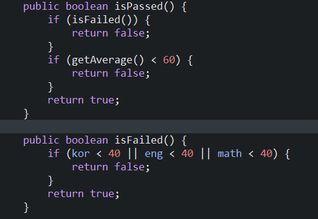
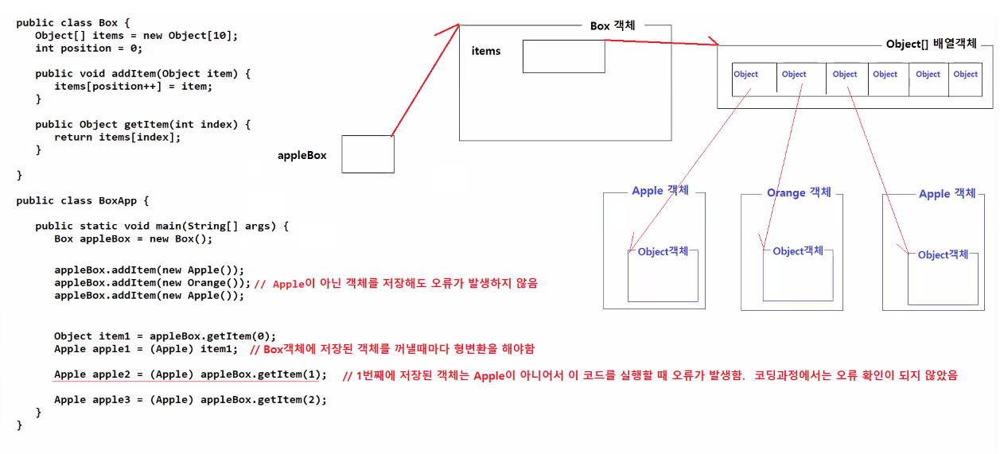

# 4/08

- [4/08](#408)
- [복습](#복습)
  - [과제3 해설](#과제3-해설)
    - [메소드의 반환값 정하기](#메소드의-반환값-정하기)
      - [1. 기본자료형 반환](#1-기본자료형-반환)
      - [2. 객체 하나 반환](#2-객체-하나-반환)
      - [3. 객체 여러 개 반환](#3-객체-여러-개-반환)
  - [Collection](#collection)
    - [Set](#set)
    - [List](#list)
  - [Generic](#generic)
    - [일반적인 객체 생성과의 비교](#일반적인-객체-생성과의-비교)
      - [메모리 구조로 확인하기](#메모리-구조로-확인하기)
      - [실습](#실습)
      - [1. List인터페이스의 ArrayList와 Vector 구현클래스 비교](#1-list인터페이스의-arraylist와-vector-구현클래스-비교)
      - [2. Set의 특징 확인](#2-set의-특징-확인)
      - [3. Set에서 Override를 통해 동등성 비교 해보기](#3-set에서-override를-통해-동등성-비교-해보기)
    - [자바에서의 데이터 분류, 조건문, 반복문](#자바에서의-데이터-분류-조건문-반복문)
  - [`Map<K, V>` 인터페이스](#mapk-v-인터페이스)
    - [Key, Value](#key-value)
    - [주요 메소드](#주요-메소드)
    - [구현 클래스](#구현-클래스)
      - [실습](#실습-1)

<small><i><a href='http://ecotrust-canada.github.io/markdown-toc/'>Table of contents generated with markdown-toc</a></i></small>


# 복습
## 과제3 해설
1. 필드의 초기화는 항상 메소드를 통해서 한다.(getter메소드 또는 생성자 메소드를 사용한다.)
   * 다음과 같이 할 수도 있다.
   * 
   * 하지만 저장공간을 최대한 효율적으로 사용하기 위해 필드를 최소화한다.
2. 합격 여부를 판단하는 메소드 정의할 때 효율성을 위해 false를 리턴하는 조건문을 먼저 찾는다.
   * 그리고 false를 리턴하는 조건문 중에서도 계산을 덜 하는 조건문을 먼저 찾는다.
   * 

### 메소드의 반환값 정하기
```java
반환값이 없는 메소드
public void 메소드명([매개변수타입 매개변수]) {
    // 저장하기, 삭제하기, 변경하기
}

반환값이 있는 메소드
public 자료형혹은설계도 메소드명([매개변수타입 매개변수]) {
    // 조회하기
}
```
* 반환값이 있는 메소드는 아래 3가지의 경우로 나눌 수 있다.
#### 1. 기본자료형 반환
```java
// 기본자료형 값을 반환하는 메소드
public 기본자료형 메소드명([매개변수타입 매개변수]) {

    return 값;  // 값 혹은 그 값을 담고 있는 변수명
}
```
* `자료형 변수 = x.메소드명();`

#### 2. 객체 하나 반환
```java
// 객체 하나를 반환해야 하는 메소드
// 설계도이름은 클래스명, 인터페이스명일 수 있다.
public 설계도이름 메소드명([매개변수타입 매개변수]) {
    설계도이름 참조변수 = null;

    // 조건에 부합되는 객체를 딱 하나 찾아서 그 객체의 참조값을 참조변수에 대입하는 코그만 작성하면 된다.
    // 조건에 부합되는 객체가 하나도 없을 수도 있다. 참조변수는 null인 상태가 되고, 최종적으로 null값이 반환된다.

    return 참조값;  // 객체를 참조할 수 있는 참조값
}
```
* `설계도이름 참조변수 = x.메소드명()`
  * 참조변수는 null 일수도 있다.
  * 참조변수는 참조값을 반환받아서 특정 객체를 참조하고 있다.

#### 3. 객체 여러 개 반환
```java
// 객체 여러 개를 담고 있는 List류 객체를 반환해야 하는 메소드
// 설계도 이름은 클래스명, 인터페이스명일 수 있다.
public List<설계도이름> 메소드명([매개변수타입 매개변수]) {
    List<설계도이름> 참조변수 = new ArrayList<설계도이름>();

    // 조건에 부합되는 객체를 콜렉션에 저장하는 코드만 작성하면 된다.
    // 조건에 부합되는 객체가 하나도 없을 수도 있다. List에 객체가 한번도 저장되지 않았을 뿐이다.(절대 null일 수 없다.)

    return 참조변수;    // 객체를 참조할 수 있는 참조값
}
```
* `List<설계도이름> 참조변수 = x.메소드명();`
  * 참조변수는 절대 null이 아니다.
  * 참조변수가 참조하는 List류 객체가 비어있을 수는 있다.

## Collection
### Set
1. HashSet
2. TreeSet
### List
1. ArrayList
2. Vector
3. LinkedList
4. Stack

## Generic
* 소스코드에서 객체의 타입을 지정하지 않고, 객체 생성시점, 인터페이스 구현시점, 메소드 실행시점에 객체의 타입을 지정하는 방식
### 일반적인 객체 생성과의 비교
* 일반적인 객체 생성 시 
  * 지정한 객체 타입 외 다른 객체를 담을 수 없다
  * 객체의 종류만큼 해당 객체 타입의 클래스가 필요하다.
* (위의 문제를 해결하기위해) Object타입의 객체 배열을 생성해 객체를 저장할 경우
  * 여러 종류의 객체가 저장될 수 있다.
  * 꺼낼 때 어떤 객체가 나올 지 예측할 수 없다.
  * 저장될 때 전부 Object 타입으로 형변환된다.
  * 꺼낼 때 형변환 연산을 수행해야 한다.
* Generic방식으로 객체의 타입을 지정할 경우
  * 지정한 객체 외 다른 객체가 저장되지 않는다.
  * 객체를 꺼내면 항상 지정한 객체만 획득된다.
  * 지정한 타입으로 저장된다.(형변환 x)
  * 꺼낼 때 지정한 타입으로 바로 사용 가능하다.
#### 메모리 구조로 확인하기
* 
* 
  * 일반적인 객체 생성 방법을 사용자가 실행할 때 치명적인 오류가 발생할 수 있다.
* 
  * 지정된 객체 외의 다른 객체가 저장되는지 컴파일 시점에 체크가 되고 다른 객체는 저장될 수 없다.

#### 실습
#### 1. List인터페이스의 ArrayList와 Vector 구현클래스 비교
```java
package util.collection;

public class User {

	int no;
	String name;
	String email;
	
	public User() {
		super();
	}
	
	public User(int no, String name, String email) {
		super();
		this.no = no;
		this.name = name;
		this.email = email;
	}

	public int getNo() {
		return no;
	}

	public String getName() {
		return name;
	}

	public String getEmail() {
		return email;
	}

	public void setNo(int no) {
		this.no = no;
	}

	public void setName(String name) {
		this.name = name;
	}

	public void setEmail(String email) {
		this.email = email;
	}
		
}

```
* no, name, email 필드를 가지고 있는 User객체를 만들고 ListApp에서 ArrayList와 Vector를 비교하는 실습에 사용한다.
```java
package util.collection;

import java.util.ArrayList;
import java.util.Iterator;
import java.util.List;
import java.util.Vector;

public class ListApp {

	public static void main(String[] args) {
		// List<E> 인터페이스 구현객체(ArrayList<E>, Vector<E>) 생성
		List<User> userList = new ArrayList<>();
		List<User> userVector = new Vector<>();

		// ArrayList객체에 User 정보 저장하기
		userList.add(new User(100, "hong@gmail.com", "홍길동"));
		userList.add(new User(101, "kim@gmail.com", "김유신"));
		userList.add(new User(102, "kang@gmail.com", "강감찬"));

		// Vector객체에 User정보 저장하기
		userVector.add(new User(110, "lee@gmail.com", "이순신"));
		userVector.add(new User(111, "ahn@gmail.com", "안중근"));
		userVector.add(new User(112, "ryu@gmail.com", "류관순"));

		System.out.println("ArrayList객체에 저장된 User객체 출력하기");
		for (User user : userList) {
			System.out.println(user.getNo() + "," + user.getEmail() + "," + user.getName());
		}
		
		System.out.println("Vector객체에 저장된 User객체 출력하기");
		for (User user : userVector) {
			System.out.println(user.getNo() + "," + user.getEmail() + "," + user.getName());
		}
		
		// Iterator<E> 인터페이스 구현객체 획득해서 ArrayList 객체에 저장된 User 객체 하나씩 다루기 및 특정 객체 삭제하기
		System.out.println("ArrayList객체가 반환하는 Iterator인터페이스 구현객체로 반복처리하기");
		Iterator<User> listIterator = userList.iterator();
		while(listIterator.hasNext()) {
			User user = listIterator.next();
		}
		
		// Iterator<E> 인터페이스 구현객체 획득해서 Vector 객체에 저장된 User 객체 하나씩 다루기 및 특정 객체 삭제하기
		System.out.println("Vector객체가 반환하는 Iterator인터페이스 구현객체로 반복처리하기");
		Iterator<User> vectorIterator = userList.iterator();
		while(vectorIterator.hasNext()) {
			User user = vectorIterator.next();
		}
		
	}

}

```
* List인터페이스를 구현한 ArrayList와 Vector를 구현한 객체의 사용법은 같다.
  * 값을 저장하는 방법이 같다.
  * 값을 출력하는 방법이 같다.
  * Iterator를 사용해 반복처리 작업을 하는 방법이 같다.

#### 2. Set의 특징 확인
* Set은 같은 객체가 저장되지 않는다.
* 같은 값을 가진 서로 다른 객체는 저장된다.
```java
package util.collection;

import java.util.HashSet;
import java.util.Set;

public class SetApp {

	public static void main(String[] args) {

		Set<User> userSet = new HashSet<>();

		// 같은 값을 가진 서로 다른 객체 2개 생성
		User user0 = new User(100, "hong@gmail.com", "홍길동");
		User user1 = new User(100, "hong@gmail.com", "홍길동");
		
		// 해시코드값 (객체의 주소값)확인
		System.out.println(user0);
		System.out.println(user1);
		
		// Set에 add
		userSet.add(user0);
		userSet.add(user1);

		// 같은 객체를 여러 번 add메소드 수행
		User user101 = new User(101, "kim@gmail.com", "김유신");
		userSet.add(user101);
		userSet.add(user101);

		// userSet 출력해 저장된 값 확인하기
		for (User user : userSet) {
			System.out.println(user.getNo() + ", " + user.getEmail() + ", " + user.getName());
		}
	}
}

```
* 해시코드가 다른 객체는 같은 값을 저장한 사용자가 보기에 똑같은 객체일지라도 실제로는 서로 다른, 별개의 객체이므로 Set에 각각 저장된다.
* 반면 완전히 같은 객체는 여러 번 저장될 수 없다.
* 이러한 특징들로 인해 Set은 특별한 값들을 저장하는 중복을 제거하기 위한 수단으로 사용된다.

#### 3. Set에서 Override를 통해 동등성 비교 해보기
* equals()메소드의 경우 String클래스는 Object()클래스의 그것을 재정의해서 사용한다.(주소값이 달라도 같은 값일 경우 true 판정하기 위해)
* 아래와 같이 hashCode()와 equals()를 Override(재정의)해서 값은 같지만 서로 다른 객체의 중복을 방지할 수 있다.(Object클래스의 메소드를 User클래스에서 재정의하였다.)
  * 
    ```java   
    @Override
    public int hashCode() {
        return no;
    }

    @Override
    public boolean equals(Object obj) {
        if (this == obj) // 주소값이 같으면 같은 객체다.
            return true;
        if (obj == null) // 다른 쪽이 null이면 다른 객체다.
            return false;
        if (getClass() != obj.getClass()) // getClass()를 실행해서 획득한 설계도 정보가 다르면 다른 객체다.
            return false;
        User other = (User) obj;
        return this.no == other.no; // 사용자 번호가 같으면 같은 객체다.
    }
  ```  

* hashCode()를 재정의하기 전과 후 비교
    * 실행 코드 (user0, user1 비교)
    ```java
    package util.collection;

    import java.util.HashSet;
    import java.util.Set;

    public class SetApp {

        public static void main(String[] args) {

            Set<User> userSet = new HashSet<>();

            // 같은 값을 가진 서로 다른 객체 2개 생성
            User user0 = new User(100, "hong@gmail.com", "홍길동");
            User user1 = new User(100, "hong@gmail.com", "홍길동");
            
            // 해시코드값 (객체의 주소값)확인
            System.out.println(user0);
            System.out.println(user1);
            
            // Set에 add
            userSet.add(user0);
            userSet.add(user1);

            // 같은 객체를 여러 번 add메소드 수행
            User user101 = new User(101, "kim@gmail.com", "김유신");
            userSet.add(user101);
            userSet.add(user101);

            // HashSet 객체인 userSet을 출력해 저장된 값 확인하기
            for (User user : userSet) {
                System.out.println(user.getNo() + ", " + user.getEmail() + ", " + user.getName());
            }
        }
    }

    ```
    * 전
    ```
    util.collection.User@3d012ddd
    util.collection.User@626b2d4a
    100, 홍길동, hong@gmail.com
    100, 홍길동, hong@gmail.com
    101, 김유신, kim@gmail.com
    ```
    * 후
    ```
    util.collection.User@64
    util.collection.User@64
    100, 홍길동, hong@gmail.com
    100, 홍길동, hong@gmail.com
    101, 김유신, kim@gmail.com
    ```
      * no를 hashCode로 재정의했으므로 같은 no를 가진 객체는 같은 주소값을 가지게 된다. 

#### 4. Collection에서 재정의 메소드 활용해보기
```java
package util.collection;

import java.util.ArrayList;
import java.util.HashSet;
import java.util.List;
import java.util.Set;

public class CollectionApp {

	public static void main(String[] args) {
		
		List<User> list = new ArrayList<>();
		Set<User> set = new HashSet<>();
		
		User user1 = new User(101, "hong@gmail.com", "홍길동");
		User user2 = new User(101, "hong@gmail.com", "홍길동");
		User user3 = new User(101, "hong@gmail.com", "홍길동");
		
		list.add(user1);
		list.add(user2);
		list.add(user3);
		
		set.add(user1);
		set.add(user2);
		set.add(user3);
		
		System.out.println("ArrayList객체에 저장된 User정보 출력하기");
		for (User user : list) {
			System.out.println(user.getNo() + ", " + user.getEmail() + ", " + user.getName());
		}
		
		System.out.println("HashSet객체에 저장된 User정보 출력하기");
		for (User user : set) {
			System.out.println(user.getNo() + ", " + user.getEmail() + ", " + user.getName());
		}
		
	}
}
```
* ArrayList는 중복을 허용하지만 HashSet은 중복을 허용하지 않는다.
  * 생성자메소드를 이용해 값은 같지만 각기 다른 객체로 생성했다.
  * User 클래스에서 hashCode()를 no로 재정의 했기 때문에 같은 같으로 취급된다.

### 자바에서의 데이터 분류, 조건문, 반복문
* 실제 현업에서 데이터를 가져올 때 sql문으로 원하는 조건에 맞는 데이터를 가져오기 때문에 자바에서 데이터를 분류하는 경우는 거의 없다.
* 자바에서 조건문, 데이터 분류, 반복문과 같은 로직은 업무 로직을 만드는 경우에 주로 사용한다.(데이터 처리는 주로 SQL(데이터베이스)에서 처리한다.)

## `Map<K, V>` 인터페이스

* Map 인터페이스는 Map.Entry\<K, V>라는 객체가 여러 개 존재하는 구조로 이루어져 있다.
* key와 value의 쌍으로 객체를 저장한다.
* key값을 알면 반복없이 Map객체에서 value를 조회/변경/삭제할 수 있다.
* key값을 알고있다는 전제하에 사용하기 떄문에 반복문을 통해 값을 찾지 않는다.
### Key, Value
* K
  * K는 key값의 타입이다.
  * key값은 Map객체에서 유일한 값이어야 한다.
  * key값은 Map객체에서 value를 대표하는 값이다.
  * key의 타입은 보통 String, Integer, Long 타입이 주로 사용된다.
  * key값으로 Map객체에 저장된 value를 조회, 삭제, 변경할 수 있다.
  * key값은 List객체의 index 같은 존재이다.
  * key값은 실제 정보를 포함하고 있는 value에 대한 태그 같은 값이다.
  * key값은 대부분 정수 혹은 문자열인 경우가 대부분이다.
* V
  * V는 value값의 타입이다.
  * value가 실제 정보를 포함하고 있는 객체다.
### 주요 메소드
* V put(K key, V value)
    * Map객체에 key, value의 쌍을 저장한다.
* V get(Object key)
    * Map객체에서 지정된 key에 해당하는 value를 조회한다.
* V remove(Object key)
    * Map객체에서 지정된 key에 해당하는 value를 삭제한다.
* void clear()
    * Map객체에 저장된 모든 key, value의 쌍을 삭제한다.
* int size()
    * Map객체에 저장된 Key,value쌍의 갯수를 반환한다.
* boolean isEmpty()
    * Map객체가 비어있으면 true를 반환한다.
* boolean containsKey(Object key)
    * Map객체에 지정된 key가 포함되어 있는지 여부를 반환한다.
* boolean containsValue(Object value)
    * Map객체에 지정된 value가 포함되어 있는지 여부를 반환한다.
* Set\<Key> keySet()
    * Map객체의 모든 key를 Set객체에 담아서 반환한다.
    * key는 유일한 값이므로 set에 담아서 반환해 중복되는 값이 없음을 보여준다.
* Collection\<V> values()
    * Map객체의 모든 value를 Collection객체에 담아서 반환한다.
* Set\<Map.Entry<K, V>> entrySet()
    * Map에 저장된 모든 Entry\<K, V>를 Set에 담아서 반환한다.
    * Set의 타입으로 Map.Entry\<K, V>를 사용할 수 있다.
    * List\<Map\<String, Student>>와 같은 타입 설정도 가능하다.
### 구현 클래스
* HashMap
* HashTable
  * HashMap과 사용법은 동일하지만 멀티스레드 환경에서 안전하다.

#### 실습
* map(hashmap)을 사용해 객체를 저장하고 삭제하고 변경해보자
```java
package util.map;

import java.util.HashMap;
import java.util.Map;

public class HashMapApp {

	public static void main(String[] args) {
		
		// 정수를 key로 문자열을 value로 저장하는 Map구현객체 생성하기
		Map<Integer, String> map = new HashMap<>();
		
		// map객체에 (key, value)의 쌍으로 값 저장하기
		map.put(100, "김유신");
		map.put(102, "강감찬");
		map.put(103, "이순신");
		
		// map객체에서 key에 해당하는 value 조회하기
		String name1 = map.get(100);
		System.out.println(name1);
		
		// map객체에서 key에 해당하는 값 삭제하기
		map.remove(102);
		
		// map객체서 key에 해당하는 값 변경하기
		map.put(103, "홍길동");
		
		// 출력해보기
		System.out.println(map);
	}
}

```
* 저장과 변경은 put()을 사용한다.
  * '밀어내고 넣는 느낌'
* map은 값의 조회가 편리하다.