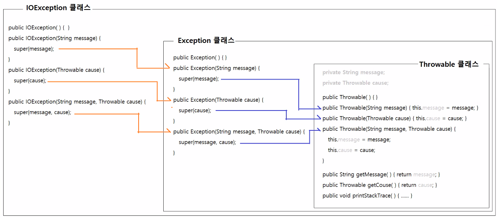
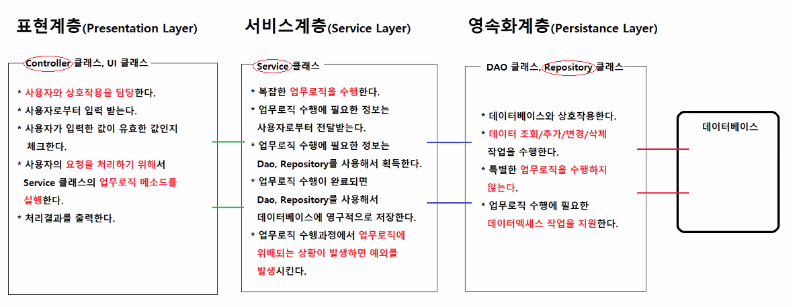
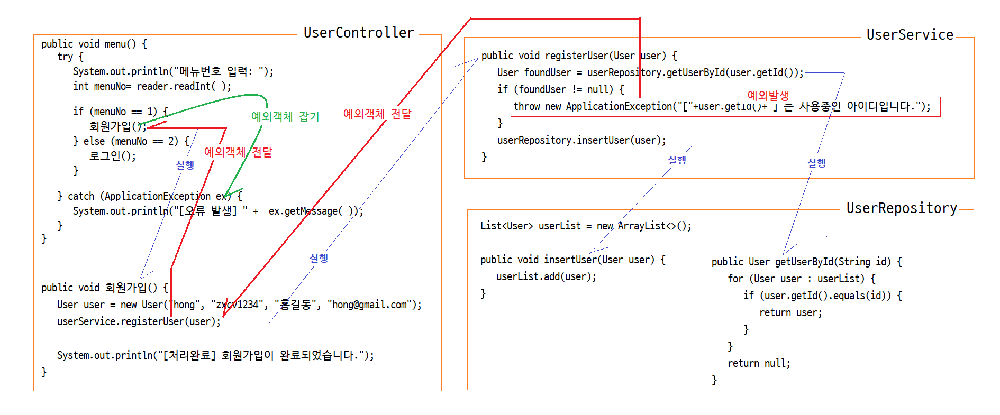
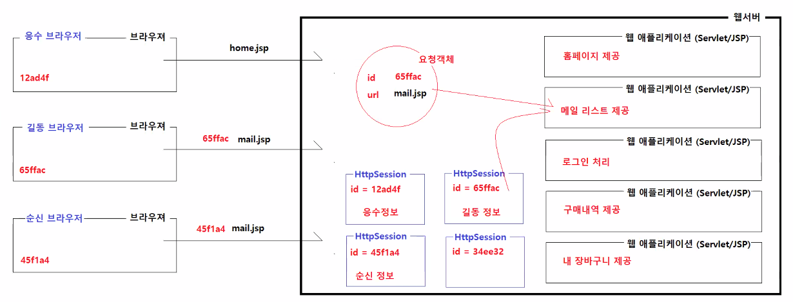

# 4/12

- [4/12](#412)
  - [자바 예외처리의 주요 API](#자바-예외처리의-주요-api)
    - [Throwable 클래스](#throwable-클래스)
    - [Exception 클래스](#exception-클래스)
    - [RuntimeException 클래스](#runtimeexception-클래스)
  - [사용자정의 예외클래스 작성하기](#사용자정의-예외클래스-작성하기)
  - [throw](#throw)
  - [예외발생의 활용](#예외발생의-활용)
    - [성공실패 여부를 boolean값 반환으로 처리하는 예](#성공실패-여부를-boolean값-반환으로-처리하는-예)
    - [성공 실패여부 예외발생으로 처리하는 예](#성공-실패여부-예외발생으로-처리하는-예)
  - [예외처리 실습](#예외처리-실습)
  - [계층적 프로그래밍](#계층적-프로그래밍)
    - [브라우저와 웹서버의 상호작용](#브라우저와-웹서버의-상호작용)
      - [실습](#실습)

<small><i><a href='http://ecotrust-canada.github.io/markdown-toc/'>Table of contents generated with markdown-toc</a></i></small>


## 자바 예외처리의 주요 API
### Throwable 클래스
* Error와 Exception의 최상위 부모 클래스
* 주요 생성자
  * `Throwable()`
    * 기본 생성자 메소드
  * `Throwable(String message)`
    * 오류 메세지를 전달받아서 멤버변수를 초기화하는 생성자
  * `Throwable(Throwable cause)`
    * 오류의 원인이 된 다른 오류객체를 전달받아서 멤버변수를 초기화하는 생성자
  * `Throwable(String message, Throwable cause)`
    * 오류메세지와 오류 원인을 전달받아서 멤버변수를 초기화하는 생성자
* 주요 메소드
  * `String getMessage()`
    * 오류 메세지를 반환한다.
  * `void printStackTrace()`
    * 디버깅에 필요한 메소드 호출 정보를 화면에 출력한다.
  * `Throwable getCause()`
    * 오류에 관한 정보가 포함된 Error 혹은 Exception을 반환한다.
* 모든 Error, Exception 객체는 Throwable으로부터 위의 메소드를 상속받는다.
* 예외를 처리하지 않으면 JVM은 발생한 예외객체의 `printStackTrace()`를 실행시켜서 오류정보를 화면에 출력시키고, 프로그램을 종료한다.



### Exception 클래스
* 모든 예외 클래스의 최상위 부모 클래스
* Throwable 클래스의 자식 클래스다.
* 주요 생성자
  ```java
  Exception()
  Exception(String message) {
      super(message);
  }
  Exception (Throwable cause) {
      super(cause);
  }
  Exception (String message, Throwable cause) {
      super(message, cause);
  }
  ```
* 오류 메세지, 오류 원인을 전달받아서 객체를 초기화하는 생성자 메소드만 가지고 있다.
* 생성자에서 호출하는 `super()` 메소드는 Throwable의 생성자 메소드다.

### RuntimeException 클래스
* 모든 unChecked Exception 클래스의 최상위 부모 클래스
* Exception 클래스의 자식 클래스다.
* 주요 생성자
  ```java
  RuntimeException()
  RuntimeException(String message) {
      super(message);
  }
  RuntimeException (Throwable cause) {
      super(cause);
  }
  RuntimeException (String message, Throwable cause) {
      super(message, cause);
  }
  ```
* 오류 메세지, 오류 원인을 전달받아서 객체를 초기화하는 생성자 메소드만 가지고 있다.
* 생성자에서 호출하는 `super()` 메소드는 Exception의 생성자 메소드다.

## 사용자정의 예외클래스 작성하기
* Exception 클래스를 상속해서 예외 클래스를 정의한다.
  * Checked 예외 클래스를 정의한다.
  * 예외처리를 강제하는 예외클래스를 정의한다.
* RuntimeException 클래스를 상속해서 클래스를 정의한다.
  * unChecked 예외 클래스를 정의한다.
  * 예외처리를 강제하지 않는 예외클래스를 정의한다.
  * 대부분 RuntimeException을 상속받아서 사용자정의 예외클래스를 정의한다.
* 작성방법
  * 오류정보에 필요한 멤버변수를 추가할 수 있다.
  * 생성자 메소드를 정의할 때 부모클래스의 생성자 메소드를 호출하는 super메소드를 반드시 사용해야한다.
    * 이 예외와 관련된 오류 메세지를 Throwable의 멤버변수에 저장할 수 없다.
* 작성목적
  * 애플리케이션에 최적화된 예외를 정의할 수 있다.
  * 애플리케이션에서 발생하는 예외의 종류를 단순화시킬 수 있다.
  * 다양한 오류정보를 표현할 수 있다.
  * 애플리케이션에서 발생하는 예외의 종류를 단순화시킬 수 있기 때문에 최종단계에서 예외의 일괄처리가 단순해진다. 

## throw
1. 예외의 변환
   * 사용자 정의 예외를 발생시키는 것
   * 사용자 정의 예외만 처리하도록 하는 것이 목적
2. 강제 예외 발생
   * 업무로직상의 오류가 있는 경우(비밀번호 불일치, 잔액부족, 로그인 실패 등) 예외를 강제로 발생시켜서 해당 기능을 호출한 측에게 오류가 발생했음을 알리는 것

## 예외발생의 활용
### 성공실패 여부를 boolean값 반환으로 처리하는 예 
```java
public class UserService {

	private UserRepository userRepo = new UserRepository();

	/** 
	 * 새 사용자정보를 전달받아서 회원가입처리를 수행하는 메소드
         * @param 새 사용자정보
         * @return 가입이 완료되면 true를 반환하고, 실패하면 false를 반환한다.
	**/
	public boolean registerUser(User user) {
		// 새로 가입하는 사용자의 아이디로 회원정보를 조회함
		User savedUser = userRepo.getUser(user.getId());
		// 회원정보가 조회됨, 같은 아이디를 사용하는 사용자가 이미 가입되어 있음
		if (savedUser != null) {
			return false;	
		}
		// 새로 가입하는 사용자의 이메일로 회원정보를 조회함
		savedUser = userRepo.getUserByEmail(user.getEmail());
		// 회원정보가 조회됨, 같은 이메일을 사용하는 사용자가 이미 가입되어 있음
		if (savedUser != null) {
			return false;
		}

		// 회원가입이 완료됨
		userRepo.save(user);
		return true;
	}
}

public class App {
	public static void main(String[] args) {

		User user = new User("hong", "zxcv1234", "홍길동", "hong@gmail.com");
		UserService userService = new UserService();
		
		boolean isSuccess = userService.registerUser(user);
		if (isSuccess) {
			System.out.println("회원가입이 완료되었습니다.");
		} else {
			System.out.println("회원가입에 실패하였습니다.");	// 정확한 실패원인을 파악할 수 없다.
		}
	}
}
```
### 성공 실패여부 예외발생으로 처리하는 예
```java
public class UserService {

	private UserRepository userRepo = new UserRepository();

	/** 
	 * 새 사용자정보를 전달받아서 회원가입처리를 수행하는 메소드
         * @param 새 사용자정보
	**/
	public void registerUser(User user) {
		// 새로 가입하는 사용자의 아이디로 회원정보를 조회함
		User savedUser = userRepo.getUser(user.getId());
		// 회원정보가 조회됨, 같은 아이디를 사용하는 사용자가 이미 가입되어 있음
		if (savedUser != null) {
			throw new HtaException("이미 사용중인 아이디입니다.");
		}
		// 새로 가입하는 사용자의 이메일로 회원정보를 조회함
		savedUser = userRepo.getUserByEmail(user.getEmail());
		// 회원정보가 조회됨, 같은 이메일을 사용하는 사용자가 이미 가입되어 있음
		if (savedUser != null) {
			throw new HtaException("이미 사용중인 이메일입니다.");
		}

		// 회원가입이 완료됨
		userRepo.save(user);
	}
}

public class App {
	public static void main(String[] args) {

		User user = new User("hong", "zxcv1234", "홍길동", "hong@gmail.com");
		UserService userService = new UserService();
		
		try {
			boolean isSuccess = userService.registerUser(user);
			System.out.println("회원가입이 완료되었습니다.");
		} catch (HtaException ex) {
			System.out.println("회원가입에 실패하였습니다.");
			System.out.println("오류메세지: " + ex.getMessage());
		}
	}
}
```

## 예외처리 실습
* 예외를 던지는 메소드인 `Integer.parseInt()`를 사용하기
* try~catch구문으로 감싸고 `getMessage()`메소드 사용하기
* `printStackTrace()`사용하기
    ```java
    package except.api;

    import java.util.Scanner;

    public class ExceptionApp1 {

        public static void main(String[] args) {

            Scanner scanner = new Scanner(System.in);
            System.out.println("입력한 숫자들의 합계를 계산하는 프로그램");
            int sum = 0;

            while (true) {
                System.out.println("숫자를 입력하세요 0을 입력하면 종료합니다 ): ");
                String text = scanner.next();
                
                try {
                    // Integer.parseInt(String text)는 Unchecked Exception인 NumberFormatException 예외를 던지는 메소드다.
                    int number = Integer.parseInt(text);
                    if (number == 0) {
                        break;
                    }
        
                    sum += number;
                } catch (NumberFormatException ex) {
                    // 예외객체에서 오류 메세지를 조회해서 화면에 출력시키기
                    String errorMessage = ex.getMessage();
                    System.out.println("오류 메세지: " + errorMessage);
                    
                    // 디버깅에 필요한 정보를 화면에 출력시키기
                    ex.printStackTrace();
                }
            }
                
            System.out.println("합계: " + sum);
            scanner.close();
        }
    }

    ```

* 사용자 정의 예외클래스를 정의해보자
* Exception과 RuntimeException의 차이를 확인할 수 있다.
  * 예외처리 위임여부(throws 사용 필수 여부)
    ```java
    package except.custom;

    public class HtaException extends RuntimeException {

        private static final long serialVersionUID = 5806821163054219139L;

        public HtaException() {
            
        }
        
        public HtaException(String message) {
            super(message);
        }
        
        public HtaException(String message, Throwable cause) {
            super(message, cause);
        }
    }

    ```
    ```java
    package except.custom;

    public class CommonUtils {

        public static int stringToInt(String text) {
            if (text == null) {
                // 사용자 정의 예외객체 발생시키기
                throw new HtaException("text는 null일 수 없습니다.");
            }
            if (text.isBlank()) {
                // 사용자 정의 예외객체 발생시키기
                throw new HtaException("text가 빈 문자열이거나 공백문자입니다.");
            }
            try {
                int value = Integer.parseInt(text);
                return value;

            } catch (NumberFormatException ex) {
                // 예외의 변환
                // Integer.parseInt()메소드가 발생시킨 NumberFormatException을 catch에서 잡고, 대신 HtaException을 발생시키기
                throw new HtaException("text에 숫자가 아닌 문자가 포함되어 있습니다.", ex);
            }
        }

    }

    ```
    * HtaException클래스가 RuntimeException이 아닌 Exception 을 상속받았다면 CommonUtils클래스의 stringToInt메소드에서 throws HtaException을 해줘야 한다.(예외처리 위임)
    * RuntimeException을 상속받은 경우엔 해줘도 되고 안해줘도 된다. (위 실습에선 하지 않았다.)

* 사용자 정의 예외클래스로 정의한 예외 확인하기
  1. text가 null일 때
  2. 빈 문자열 또는 공백일 때
  3. 숫자가 아닌 문자 포함일 때
    ```java
    package except.custom;

    public class HtaExceptionApp {

        public static void main(String[] args) {
            
    //		int value = CommonUtils.stringToInt("100");
    //		int value = CommonUtils.stringToInt(null);
    //		int value = CommonUtils.stringToInt("");
            int value = CommonUtils.stringToInt("100가");
            
            System.out.println(value);
        }
    }

    ```
    ```
    Exception in thread "main" except.custom.HtaException: text는 null일 수 없습니다.
        at except.custom.CommonUtils.stringToInt(CommonUtils.java:8)
        at except.custom.HtaExceptionApp.main(HtaExceptionApp.java:7)
    ```
    ```
    Exception in thread "main" except.custom.HtaException: text가 빈 문자열이거나 공백문자입니다.
        at except.custom.CommonUtils.stringToInt(CommonUtils.java:12)
        at except.custom.HtaExceptionApp.main(HtaExceptionApp.java:9)

    ```
    ```
    Exception in thread "main" except.custom.HtaException: text에 숫자가 아닌 문자가 포함되어 있습니다.
        at except.custom.CommonUtils.stringToInt(CommonUtils.java:21)
        at except.custom.HtaExceptionApp.main(HtaExceptionApp.java:10)
    Caused by: java.lang.NumberFormatException: For input string: "100가"
        at java.base/java.lang.NumberFormatException.forInputString(NumberFormatException.java:67)
        at java.base/java.lang.Integer.parseInt(Integer.java:668)
        at java.base/java.lang.Integer.parseInt(Integer.java:786)
        at except.custom.CommonUtils.stringToInt(CommonUtils.java:15)
        ... 1 more
    ```
    * 3번의 경우 `RuntimeException (String message, Throwable cause) {super(message, cause);})` 메소드를 사용하였다.
    * 2개의 오류 메세지가 나와 더 구체적으로 확인할 수 있다.

* 반환타입이 있는 메소드에서 반환타입과 일치하는 타입의 값 혹은 객체를 반환하거나. 
* 대신 예외를 발생시키는 것은 컴파일 오류가 아니다.
  ```java
  // 아래코드는 컴파일 오류가 아님
  public User findUser(String id) {
      throw new HtaException();
  }

  // 아이디가 유효하지 않을 때는 예외를 발생시킨다. 사용자 정보가 반환되지 않지만, 컴파일 오류가 아니다.
  // 아이디가 유효한 경우 사용자 정보를 조회해서 반환한다.
  public User findUser(String id) {
      if (id == null || id.isBlank()) {
          throw new HtaException();
      }
      User user = userRepo.getUserById(id);
      return user;
  }
  ```

## 계층적 프로그래밍

* 어플리케이션 프로젝트의 개발은 위의 구조로 이루어진다.
* 표현 계층
  * Controller 클래스
  * 사용자와 상호작용하는 클래스
  * 사용자의 기기(화면)가 달라지면 표현계층이 달라지면 된다.
* 서비스 계층
  * Service 클래스
  * 업무로직을 실행하는 클래스
* 영속화계층 
  * Repository 클래스
  * DB에 access하는 클래스
  * DBMS가 달라지면 영속화계층만 달라지면 된다.



### 브라우저와 웹서버의 상호작용

* 웹서버에 저장된 웹 애플리케이션들은 각각 기능을 담고 있다.
  * 홈페이지 제공
  * 메일 리스트 제공
  * 로그인 처리
  * 구매내역 제공
  * 내 장바구니 제공

* 로그인 이후에 제공되는 기능(사용자정보가 필요한 기능의 제공)
  * 메일 리스트 제공, 구매내역 제공, 내 장바구니 제공과 같은 기능은 로그인 이후에 제공될 수 있다.
  * 각각의 사용자가 로그인에 성공하면 웹서버의 각각의 HttpSession에 랜덤한 id를 가지는 객체로 정보가 저장된다.
  * 한 사용자가 기능을 요쳥하면 웹서버는 HttpSession의 id와 비교하여 사용자 일치여부를 확인하고 웹 애플리케이션과 연결해 서비스를 제공한다.
  * 로그인을 하면 HttpSession에 사용자정보가 저장되므로 매번 기능을 요청할 때마다 로그인 할 필요가 없다.
  * 브라우저를 닫거나 로그아웃을 하면 해당 사용자정보가 저장된 HttpSession객체는 사라진다.


#### 실습
* 사용자정의 예외클래스 ApplicationException 생성
    ```java
    package except.app;

    /**
     * 사용자정의 예외 클래스다.
     * @author HOME
     *
     */
    public class ApplicationException extends RuntimeException {
        
        public ApplicationException(String message) {
            super(message);
        }
        
        public ApplicationException(String message, Throwable cause) {
            super(message, cause);
        }
    }
    ```

* 사용자정보를 담을 User클래스 생성
    ```java
    package except.app;

    public class User {

        private String id;
        private String password;
        private String name;
        private String email;
        private int point;
        private boolean isDisabled;
        
        public User() {}
        
        public User(String id, String password, String name, String email) {
            this.id = id;
            this.password = password;
            this.name = name;
            this.email = email;
            this.point = 100;
            this.isDisabled = false;
        }

        public String getId() {
            return id;
        }

        public void setId(String id) {
            this.id = id;
        }

        public String getPassword() {
            return password;
        }

        public void setPassword(String password) {
            this.password = password;
        }

        public String getName() {
            return name;
        }

        public void setName(String name) {
            this.name = name;
        }

        public String getEmail() {
            return email;
        }

        public void setEmail(String email) {
            this.email = email;
        }

        public int getPoint() {
            return point;
        }

        public void setPoint(int point) {
            this.point = point;
        }

        public boolean isDisabled() {
            return isDisabled;
        }

        public void setDisabled(boolean isDisabled) {
            this.isDisabled = isDisabled;
        }
        
    }

    ```

* Controller layer을 실행하는 UserApp 생성 (메인메소드)
    ```java
    package except.app;

    public class UserApp {

        public static void main(String[] args) {
            
            new UserController().menu();
        }
    }

    ```

* 사용자정보를 저장하는 UserRepository
    ```java
    package except.app;

    import java.util.ArrayList;
    import java.util.Iterator;
    import java.util.List;

    /**
     * 사용자 정보에 대한 저장, 조회, 변경, 삭제 기능을 제공하는 클래스다.
     * @author Home
     *
     */
    public class UserRepository {

        private List<User> userList = new ArrayList<>();
        
        public UserRepository() {
            userList.add(new User("hong", "zxcv1234", "홍길동", "hong@gmail.com"));
            userList.add(new User("kim", "zxcv1234", "김유신", "kim@gmail.com"));
            userList.add(new User("lee", "zxcv1234", "이순신", "lee@gmail.com"));
            userList.add(new User("kang", "zxcv1234", "강감찬", "kang@gmail.com"));
        }
        
        /**
         * 사용자정보를 전달받아서 ArrayList에 저장한다.
         * @param user 사용자 정보
         */
        public void insertUser(User user) {
            userList.add(user);
        }
        
        /**
         * 아이디를 전달받아서 아이디가 일치하는 사용자정보를 반환한다.
         * @param id 사용자 아이디
         * @return 사용자정보, 아이디가 일치하는 사용자정보를 없는 경우 null이 반환된다.
         */
        public User getUserById(String id) {
            User foundUser = null;
            
            for (User user : userList) {
                if (user.getId().equals(id)) {
                    foundUser = user;
                    break;
                }
            }
            
            return foundUser;
        }
        
        /**
         * 이메일를 전달받아서 이메일이 일치하는 사용자정보를 반환한다.
         * @param email 이메일
         * @return 사용자정보, 이메일이 일치하는 사용자정보를 없는 경우 null이 반환된다.
         */
        public User getUserByEmail(String email) {
            User foundUser = null;
            
            for (User user : userList) {
                if (user.getEmail().equals(email)) {
                    foundUser = user;
                    break;
                }
            }
            
            return foundUser;
        }
        
        /**
         * 변경된 정보가 포함된 사용자정보를 전달받아서 사용자정보를 갱신한다.
         * @param user 변경된 정보가 포함된 사용자 정보
         */
        public void updateUser(User user) {
            User foundUser = getUserById(user.getId());
            foundUser.setPassword(user.getPassword());
            foundUser.setPoint(user.getPoint());
            foundUser.setDisabled(user.isDisabled());
        }
        
        /**
         * 사용자 아이디를 전달받아서 아이디가 일치하는 사용자를 탈퇴처리한다.
         * @param id 사용자 아이디
         */
        public void deleteUser(String id) {
            Iterator<User> iter = userList.iterator();

            while (iter.hasNext()) {
                User user = iter.next();
                if (user.getId().equals(id)) {
                    iter.remove();
                    break;
                }
            }
        }
    }

    ```

* 업무로직을 실행하는 UserService (기능 구현, 제공)
    ```java
    package except.app;

    /**
     * 회원가입, 회원인증, 회원정보 수정, 비밀번호변경, 회원탈퇴, 등의 서비스를 제공하는 클래스다.
     * 
     * @author Home
     *
     */
    public class UserService {

        private UserRepository userRepository = new UserRepository();

        /*
        * 회원가입 회원정보를 전달받아서 회원정보를 데이터베이스에 등록시키는 업무 동일한 아이디를 가진 사용자는 등록할 수 없다. 
        * 동일한 이메일을 가진 사용자는 등록할 수 없다.
        *  반환타입 : void 
        *  메소드명 : registerUser 
        *  매개변수 : User user
        */
        public void registerUser(User user) {
            // 동일한 아이디로 등록된 사용자가 있는지 체크한다.
            User foundUser = userRepository.getUserById(user.getId());
            if (foundUser != null) {
                throw new ApplicationException("[" + user.getId() + "]는 사용중인 아이디입니다.");
            }

            // 동일한 이메일로 등록된 사용자가 있는지 체크한다.
            foundUser = userRepository.getUserByEmail(user.getEmail());
            if (foundUser != null) {
                throw new ApplicationException("[" + user.getEmail() + "]은 사용중인 이메일입니다.");
            }

            // 동일한 아이디, 동일한 이메일을 가진 사용자가 존재하지 않으면 회원정보를 등록시킨다.
            userRepository.insertUser(user);
        }

        /*
        * 회원인증 아이디, 비밀번호를 전달받아서 사용자 인증처리 작업을 수행하고, 인증이 완료된 사용자정보를 반환하는 업무
        * 		아이디에 해당하는 사용자정보가 존재하지 않으면 예외를 발생시킨다.
        * 		사용자정보가 존재하지만, 계정이 비활성화 되어 있으면 예외를 발생시킨다.
        * 		사용자정보가 존재하지만, 비밀번호가 서로 일치하지 않으면 예외를 발생시킨다.
        *  반환타입 : User
        *  메소드명 : loginCheck
        *  매개변수 : String id, String password
        */
        public User loginCheck(String id, String password) {
            User foundUser = userRepository.getUserById(id);
            if (foundUser == null) {
                throw new ApplicationException("아이디 혹은 비밀번호가 올바르지 않습니다.");
            }
            
            if (foundUser.isDisabled()) {
                throw new ApplicationException("이 사용자계정은 현재 비활성화 상태입니다.");
            }
            
            if (!foundUser.getPassword().equals(password)) {
                throw new ApplicationException("아이디 혹은 비밀번호가 올바르지 않습니다.");
            }
            
            return foundUser;
        }

        /*
        * 비밀번호 변경 
        *  아이디, 현재 비밀번호, 새 비밀번호를 전달받아서 비밀번호를 변경하는 업무 
        *  반환타입 : void 
        *  메소드명 : changePassword
        *  매개변수 : String id, String prevPassword, String password
        */
        public void changePassword(String id, String prevPassword, String password) {

        }

        /*
        * 회원 탈퇴 아이디, 비밀번호를 전달받아서 회원정보를 삭제하는 업무 반환타입 : void 메소드명 : removeUser 매개변수 :
        * String id, String password
        */
        public void removeUser(String id, String password) {

        }
    }

    ```

* 사용자와 상호작용하는 표현계층인 UserController
    ```java
    package except.app;

    public class UserController {

        private UserService userService = new UserService();
        private KeyboardReader reader = new KeyboardReader();
        
        // 로그인한 사용자정보를 저장하는 참조변수
        private User loginedUser = null;
        
        public void menu() {
            try {
                
                System.out.println("[[샘플 애플리케이션 컨트롤러]]");
                System.out.println("------------------------------------------------------------------------");
                System.out.println("1.가입  2.로그인  3.로그아웃  4.내정보 보기  5.비밀번호변경 6.탈퇴 0.종료");
                System.out.println("------------------------------------------------------------------------");
                
                System.out.print("메뉴를 선택하세요: ");
                int menuNo = reader.readInt();
                
                if (menuNo == 1) {
                    회원가입();
                } else if (menuNo == 2) {
                    로그인();
                } else if (menuNo == 3) {
                    로그아웃();
                } else if (menuNo == 4) {
                    내정보보기();
                } else if (menuNo == 5) {
                    비밀번호변경();
                } else if (menuNo == 6) {
                    탈퇴();
                } else if (menuNo == 0) {
                    종료();
                }
            
            } catch (ApplicationException ex) {
                // 애플리케이션에서 발생하는 모든 예외를 일괄처리하고 있음
                System.out.println();
                System.out.println("[오류 발생] " + ex.getMessage());
                
            } catch (Exception ex) {
                System.out.println();
                System.out.println("[오류 발생] 알 수 없는 오류가 발생하였습니다.");
            }
            
            System.out.println();
            System.out.println();
            System.out.println();
            
            menu();
        }
        
        private void 회원가입() {
            System.out.println("<< 회원 가입 >>");
            System.out.println("### 회원정보를 입력하세요");
            
            // 사용자로부터 값을 입력받는다.
            System.out.print("아이디 입력: ");
            String id = reader.readString();		
            System.out.print("비밀번호 입력: ");
            String password = reader.readString();		
            System.out.print("사용자명 입력: ");
            String name = reader.readString();		
            System.out.print("이메일 입력: ");
            String email = reader.readString();
            
            // 사용자가 입력한 값의 유효성을 체크하고, 업무로직을 수행하는 서비스 메소드에 전달한다.
            User user = new User(id, password, name, email);
            // 업무로직 메소드를 실행한다.
            userService.registerUser(user);
            
            // 업무로직 처리결과를 출력한다.
            System.out.println("[처리완료] 회원가입이 완료되었습니다.");		
        }
        
        private void 로그인() {
            System.out.println("<< 로그인 >>");
            System.out.println("### 아이디와 비밀번호를 입력하세요.");
            
            System.out.print("아이디 입력: ");
            String id = reader.readString();
            System.out.print("비밀번호 입력: ");
            String password = reader.readString();
            
            loginedUser = userService.loginCheck(id, password);
            
            System.out.println("[로그인 성공]" + loginedUser.getName() + "님 환영합니다.");
        }
        
        private void 로그아웃() {
            
        }
        
        private void 내정보보기() {
            
        }
        
        private void 비밀번호변경() {
            
        }
        
        private void 탈퇴() {
            
        }
        
        private void 종료() {
            
        }
    }

    ```