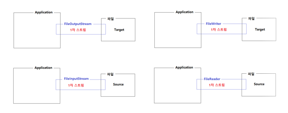
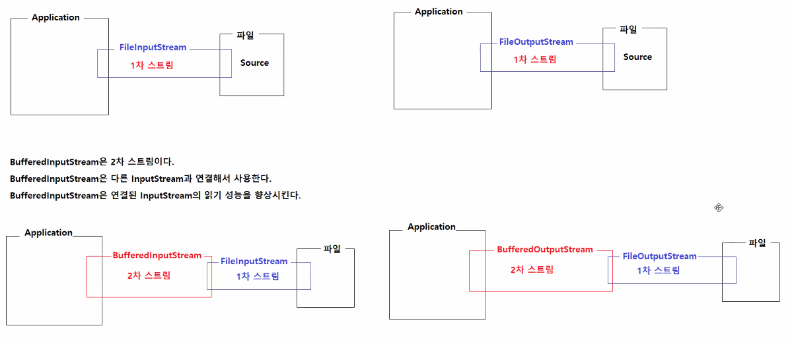
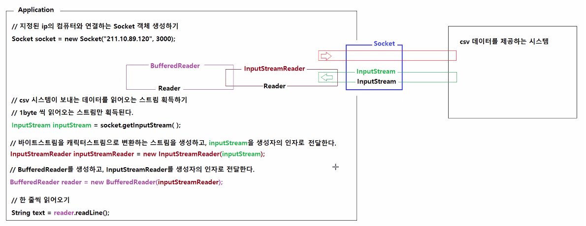
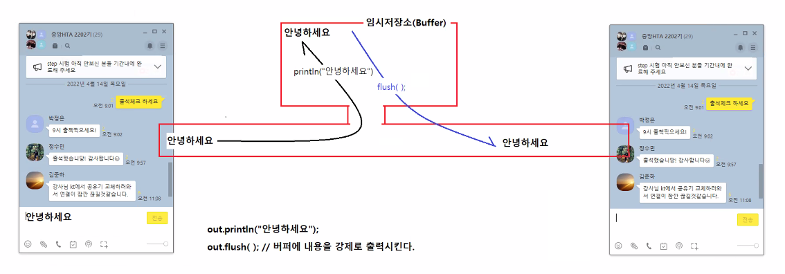
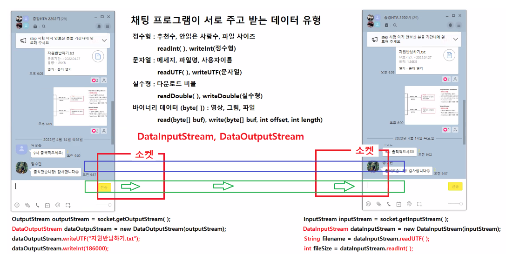

# 4/14

- [4/14](#414)
- [스트림의 구분](#스트림의-구분)
  - [대표적인 2차 스트림](#대표적인-2차-스트림)
    - [BufferedReader](#bufferedreader)
      - [실습](#실습)
    - [print](#print)
      - [실습](#실습-1)
    - [DataInputStream, DataOutputStream](#datainputstream-dataoutputstream)
      - [실습](#실습-2)
- [데이터 타입](#데이터-타입)
  - [바이너리 데이터](#바이너리-데이터)
    - [자바의 스트림으로 바이너리 데이터 다루기](#자바의-스트림으로-바이너리-데이터-다루기)
  - [텍스트 데이터](#텍스트-데이터)
    - [자바에서 csv 텍스트 데이터 다루기](#자바에서-csv-텍스트-데이터-다루기)
- [반환타입의 종류](#반환타입의-종류)
- [학생 성적정보 관리 프로그램](#학생-성적정보-관리-프로그램)
  - [실습](#실습-3)

<small><i><a href='http://ecotrust-canada.github.io/markdown-toc/'>Table of contents generated with markdown-toc</a></i></small>

# 스트림의 구분
- 읽고 쓰는 데이터의 길이 혹은 종류에 따라
  * 바이트스트림
    * 1byte씩 읽고 쓰는 스트림
    * InputStream의 모든 하위 클래스
    * OutputStream의 모든 하위 클래스
  * 캐릭터스트림
    * 1글자씩 읽고 쓰는 스트림
    * Reader의 모든 하위 클래스
    * Writer의 모든 하위 클래스
- 연결방식에 따라
  * 1차 스트림
    * Target 혹은 Source와 직접 연결되는 스트림
    * 
  * 2차 스트림
    * 다른 스트림과 연결되는 스트림
      * 2차 스트림만 단독으로 사용할 수 없다.
      * 1차 스트림과 연결해서 사용해야 한다.
      * 연결된 스트림의 성능을 향상시키는 스트림이다.
    * 2차 스트림클래스의 생성자는 다른 스트림을 매개변수를 전달받는다.
    * 

## 대표적인 2차 스트림
* BufferedInputStream, BufferedOutputStream
  * 연결된 바이트스트림의 읽기 쓰기 성능을 향상시키는 스트림이다.
* DataInputStream, DataOutputStream
  * 연결된 바이트스트림으로 값을 타입 그대로 읽고 쓸 수 있게 하는 스트림이다.
* ObjectInputStream, ObjectOutputStream
  * 연결된 바이트스트림으로 객체를 읽고 쓸 수 있게 하는 스트림이다.
* BufferedReader, BufferedWriter
  * 연결된 캐릭터스트림의 읽기 쓰기 성능을 향상시키는 스트림이다.
* InputStreamReader, OutputStreamWriter
  * 바이트스트림과 캐릭터스트림을 연결하는 스트림이다.

### BufferedReader
> https://docs.oracle.com/en/java/javase/17/docs/api/java.base/java/io/BufferedReader.html
* chracter-input stream으로부터 text를 읽어온다.
* 문자열, 배열, 여러줄을 읽어올 때 효율적이다.
* buffer 사이즈는 정할 수 있고 default 사이즈를 사용할 수 있다.
  * default 사이즈는 대부분의 사용목적에 대해 충분히 크다.
* FileReader또는 InputStreamReader와 같이 read() 작업에 많은 비용이 드는 모든 Reader 주위에 BufferedReader를 래핑하는 것이 좋다.
  ```java
  BufferedReader in = new BufferedReader(new FileReader("foo.in"));
  ```
* 효율적으로 줄바꿈을 기준으로 한 줄씩 읽어 올 수 있는 메소드인 readLine()이 있다.

#### 실습
* 1차 스트림 FileReader에 2차스트림 BufferedReader를 연결해 한 줄씩 텍스트데이터를 읽어오기
```java
package buffered;

import java.io.BufferedReader;
import java.io.FileReader;
import java.io.IOException;

public class BufferedReaderApp {

	public static void main(String[] args) throws IOException {
		// 1글자씩 읽는 FileReader 스트림객체를 생성
		FileReader fileReader = new FileReader("scores.txt");
		
		// 1라인씩 읽는 BufferedReader객체를 생성하고, FileReader객체를 생성자의 인자로 전달한다.
		BufferedReader reader = new BufferedReader(fileReader);
		
		// BufferedReader은 read()메소드 외에 추가로 readLine()메소드를 제공한다.
		String text1 = reader.readLine();
		String text2 = reader.readLine();
		String text3 = reader.readLine();
		String text4 = reader.readLine();
		String text5 = reader.readLine();
		String text6 = reader.readLine();
		String text7 = reader.readLine();

		System.out.println(text1);
		System.out.println(text2);
		System.out.println(text3);
		System.out.println(text4);
		System.out.println(text5);
		System.out.println(text6);
		System.out.println(text7);

		reader.close();
	}
}

```
* 실행결과
    ```
    10,홍길동,100,100,100
    11,김유신,90,80,80
    12,강감찬,50,60,50
    13,이순신,80,70,80
    14,류관순,90,60,90
    null
    null
    ```
    * BufferedReader는 -1이 아닌 null을 반환한다.

* 스트림의 획득과 스트림의 연결  
      
    * InputStream은 1차스트림/바이트스트림
    * InputStreaReader는 2차스트림/캐릭터스트림
    * 바이트스트림을 캐릭터스트림으로 바꿔주는 역할
    * BufferedReader는 2차스트림/캐릭터스트림

```java
package buffered;

import java.io.BufferedReader;
import java.io.FileInputStream;
import java.io.IOException;
import java.io.InputStream;
import java.io.InputStreamReader;

public class BufferedReaderApp2 {

	public static void main(String[] args) throws IOException {
		
		InputStream inputStream = new FileInputStream("scores.txt");
		InputStreamReader inputStreamReader = new InputStreamReader(inputStream);
		BufferedReader reader = new BufferedReader(inputStreamReader);
		
		String text1 = reader.readLine();
		String text2 = reader.readLine();
		String text3 = reader.readLine();
		String text4 = reader.readLine();
		String text5 = reader.readLine();
		String text6 = reader.readLine();
		String text7 = reader.readLine();

		System.out.println(text1);
		System.out.println(text2);
		System.out.println(text3);
		System.out.println(text4);
		System.out.println(text5);
		System.out.println(text6);
		System.out.println(text7);

		reader.close();
	}
}

```

### print

* java.io 패키지에 위치함
> [java.io.PrintStream](https://docs.oracle.com/en/java/javase/17/docs/api/java.base/java/io/PrintStream.html)  
> [java.io.PrintWriter](https://docs.oracle.com/en/java/javase/17/docs/api/java.base/java/io/PrintStream.html)
* PrintStream은 OutputStream의 하위 클래스로 다양한 데이터 값을 출력하는 기능을 가지고 있다.
* 절대 IOException을 던지지 않는다.(다른 Output Stream과 마찬가지다.)
* PrintWriter를 이용해 표준출력장치와 연결된 스트림을 전달받아 출력할 수 있다.
* BufferedWriter와 달리 버퍼의 크기를 정할 수 없다.
#### 실습
```java
package print;

import java.io.FileOutputStream;
import java.io.IOException;
import java.io.PrintStream;

public class PrintStreamApp {

	public static void main(String[] args) throws IOException {
		
		// 시스템의 표준 출력장치와 연결된 스트림이 PrintStream이다.
		PrintStream out = System.out;
		out.println("안녕하세요.");
		out.println("반갑습니다.");
		
		// PrintStream와 FileOutputStream을 연결하면 파일에 텍스트를 한 줄씩 기록할 수 있다.
		// PrintStream의 println()메소드는 자동으로 줄바꿈문자를 추가한다.
		out = new PrintStream(new FileOutputStream("greeting.txt"));
		out.println("반갑습니다.");
		out.println("반갑습니다.");
		out.println("반갑습니다.");
		out.println("반갑습니다.");
		out.println("반갑습니다.");
		out.println("반갑습니다.");
	}
}

```

```java
package print;

import java.io.PrintWriter;

public class PrintWriterApp {

	public static void main(String[] args) {
		
		// 표준출력장치와 연결된 스트림을 생성자의 인자로 전달받아서 PrintWriter객체를 생성함
		// PrintWriter의 출력기능을 사용하면 출력내용이 표준출력장치로 출력된다.
		PrintWriter out = new PrintWriter(System.out, true);
		
		out.println("안녕하세요");
		out.println("안녕하세요");
		out.println("안녕하세요");
		out.println("안녕하세요");
		out.println("안녕하세요");
		
	}
}

```
* 오토 flush사용
* PrintWriter는 buffer가 없어 close() flush()와 같은 기능을 사용해 버퍼안의 데이터를 내보내야 출력할 수 있다.  


### DataInputStream, DataOutputStream


#### 실습
```java
package dataInputOutput;

import java.io.DataOutputStream;
import java.io.FileOutputStream;
import java.io.IOException;

public class DataOutputStreamApp {

	public static void main(String[] args) throws IOException {
		// 자료형타입 그대로 출력하는 DataOutputStream 생성하기.
		DataOutputStream out = new DataOutputStream(new FileOutputStream("data.sav"));
		
		out.writeInt(100);			// 책번호
		out.writeUTF("자바의 정석");	// 제목
		out.writeUTF("홍길동");		// 저자
		out.writeInt(35000);		// 가격
		out.writeBoolean(true);		// 판매여부
		out.writeDouble(0.15);		// 할인율
		
		out.close();
	}
}

```

```java
package dataInputOutput;

import java.io.DataInputStream;
import java.io.FileInputStream;
import java.io.IOException;

public class DataInputStreamApp {

	public static void main(String[] args) throws IOException {
		
		DataInputStream in = new DataInputStream(new FileInputStream("data.sav"));
		
		int no = in.readInt();
		String titme = in.readUTF();
		String author = in.readUTF();
		int price = in.readInt();
		boolean onSell = in.readBoolean();
		double discountRate = in.readDouble();
		
		in.close();
		
		System.out.println("번호: " + no);
		System.out.println("제목: " + titme);
		System.out.println("저자: " + author);
		System.out.println("가격: " + price);
		System.out.println("판매여부: " + onSell);
		System.out.println("할인율: " + discountRate);
	}
}

```

# 데이터 타입
## 바이너리 데이터
그림, 영상, 압축파일, hwp파일, 엑셀파일, 워드파일, pdf
* 바이너리 데이터는 해당 컨텐츠를 표시, 편집하는 별도의 애플리케이션이 있다.
### 자바의 스트림으로 바이너리 데이터 다루기
1. 바이너리 데이터를 읽어오는 **InputStream**을 획득하자
2. 바이너리 데이터를 쓰는 **OutputStream**을 획득하자
3. **Apache Commons-io 라이브러리**를 사용해서 복사하자
## 텍스트 데이터
문자열  
캐릭터스트림으로 덱스트 데이터를 읽어서 데이터를 분석, 가공한다.
* plain text
* csv text
* xml text
* json text
### 자바에서 csv 텍스트 데이터 다루기
1. csv 텍스트를 한 줄씩 읽어오는 **BufferedReader**객체를 생성하자.
2. csv 텍스트를 한 줄씩 기록하는 **PrintWriter**객체를 생성하자.
3. BufferedReader로 csv 텍스트를 읽고 분석해서 객체에 저장하자
4. PrintWriter로 객체에 저장된 값을 csv 텍스트로 한 줄씩 파일에 저장하자.

# 반환타입의 종류
    기본자료형 메소드명(매개변수타입 매개변수, ...) {
        자료형 변수명 = 기본값;

        // 반환할 값을 계산해서 변수명에 대입하는 수행문;

        return 변수명;
    }

    클래스명 메소드명(매개변수타입 매개변수, ...) {
        클래스명 참조변수명 = null;

        // 반환할 객체를 획득/생성해서 참조변수명에 대입하는 수행문;

        return 참조변수명;
    }

    List<클래스명> 메소드명(매개변수타입 매개변수, ...) {
        List<클래스명> list = new ArrayList<>();

        // 클래스명에 해당하는 타입의 객체를 전부 찾아서 list에 add하는 수행문; 

        return list;
    }

# 학생 성적정보 관리 프로그램
* 학생 성적정보를 전체조회, 검색, 등록, 수정, 삭제 할 수 있는 프로그램 
## 실습
```java
package score.app;

public class Score {

	private int no;
	private String name;
	private int kor;
	private int eng;
	private int math;
	
	public Score() {
		
	}
	
	public Score(int no, String name, int kor, int eng, int math) {
		this.no = no;
		this.name = name;
		this.kor = kor;
		this.eng = eng;
		this.math = math;
	}

	public int getNo() {
		return no;
	}

	public String getName() {
		return name;
	}

	public int getKor() {
		return kor;
	}

	public int getEng() {
		return eng;
	}

	public int getMath() {
		return math;
	}

	public void setNo(int no) {
		this.no = no;
	}

	public void setName(String name) {
		this.name = name;
	}

	public void setKor(int kor) {
		this.kor = kor;
	}

	public void setEng(int eng) {
		this.eng = eng;
	}

	public void setMath(int math) {
		this.math = math;
	}
	
	public int getTotal() {
		return kor + eng + math;
	}
	
	public int getAverage() {
		return getTotal()/3;
	}
	
	public boolean isPassed() {
		if (kor < 40 || eng < 40 || math < 40) {
			return false;		
		}
		if (getAverage() < 60) {
			return false;
		}
		return true;
	}
}

```

```java
package score.app;

import java.io.BufferedReader;
import java.io.FileReader;
import java.io.IOException;
import java.io.PrintWriter;
import java.util.ArrayList;
import java.util.List;

public class ScoreRepository {

	private List<Score> scoreList = new ArrayList<>();
	
	public void insert(Score score) {
		scoreList.add(score);
	}
	
	public List<Score> getAll() {
		return scoreList;
	}
		
	public void loadScores() throws IOException {
		// score.txt 파일의 내용을 한 줄씩 읽어오기 위해 BufferedReader객체 생성하기
		BufferedReader reader = new BufferedReader(new FileReader("src/score/app/scores.txt"));
	
		// BufferedReader가 읽어온 한 줄의 문자열을 저장할 변수
		String data = null;
		// 스트림의 끝에 도달하기 전까지 BufferedReader의 readLine()으로 파일의 내용을 한 줄씩 읽어서 data에 대입한다.
		while ((data = reader.readLine()) != null) {
			// data에 저장된 성적정보를 ","를 구분문자로 사용해서 분리시켜 String[] 배열을 획득한다.
			// data = "1001,김유신,90,80,70"
			// items = {"1001", "김유신", "90", "80", "70"}
			String[] items = data.split(",");
			
			// 배열로 획득한 성적정보를 적절한 타입으로 변환해서 변수에 저장한다.
			int no = Integer.parseInt(items[0]);
			String name = items[1];
			int kor = Integer.parseInt(items[2]);
			int eng = Integer.parseInt(items[3]);
			int math = Integer.parseInt(items[4]);
			// 위에서 조회한 성적정보로 Score객체를 생성한다.
			Score score = new Score(no, name, kor, eng, math);
			// 성적정보가 저장된 Score객체를 콜렉션에 저장한다.
			scoreList.add(score);
		}		
		
		reader.close();
	}
	
	
	public void saveScores() throws IOException {
		PrintWriter writer = new PrintWriter("src/score/app/scores.txt");
		
		for (Score score : scoreList) {
			String text = score.getNo() + "," + score.getName() + "," + score.getKor() + "," + score.getEng() + "," + score.getMath();
			writer.println(text);
		}
		
		writer.close();
	}
}

```

* scores.txt
```java
1001,김유신,90,80,70
1002,강감찬,80,70,70
1003,류관순,90,95,100
1004,안중근,100,100,95
1005,윤봉길,90,70,50
1006,안창호,100,40,60

```

```java
package score.app;

import java.io.IOException;
import java.util.List;

public class ScoreService {

	private ScoreRepository scoreRepository = new ScoreRepository();
	
	public void start() throws IOException {
		scoreRepository.loadScores();
	}
	
	public void shutdown() throws IOException {
		scoreRepository.saveScores();
	}
	
	/**
	 * 새 성적정보를 전달받아서 레포지토리에 등록하고, 파일에 저장시킨다.
	 * @param score 새 성적정보
	 * @throws IOException 파일이 존재하지 않거나, 파일을 다른 곳에 사용중이면 예외가 발생할 수 있다.
	 */	 	
	public void registerScore(Score score) throws IOException {
		scoreRepository.insert(score);
		scoreRepository.saveScores();
	}
	
	/**
	 * 모든 성적정보를 반환한다.
	 * @return 전체 성적정보 리스트
	 */
	public List<Score> getAllScores() {
		return scoreRepository.getAll();
	}
	
	/**
	 * 학번을 전달받아서 해당 학번 학생의 성적정보를 반환한다.
	 * @param no 학번
	 * @return 해당 학번 학생의 성적정보, 학번이 유효한 값이 아닌 경우 null이 반환될 수 있다.
	 * @throws ScoreException 학번이 유효한 값이 아닌 경우 예외가 발생한다.
	 */
	public Score getScoreByNo(int no) throws ScoreException {
		Score foundScore = null;
		
		List<Score> scores = scoreRepository.getAll();
		for(Score score : scores) {
			if(score.getNo() == no) {
				foundScore = score;
				break;
			}
		}
		
		if (foundScore == null) {
			throw new ScoreException("학번과 일치하는 성적정보가 존재하지 않습니다.");
		}
		
		return foundScore;
	}
}

```

```java
package score.app;

import java.io.IOException;
import java.util.List;

public class ScoreController {

	private ScoreService scoreService = new ScoreService();
	private KeyboardReader keyboard = new KeyboardReader();
	
	public void run() throws IOException {
		scoreService.start();
		menu();
	}
	
	private void menu() {
		try {
			System.out.println("[성적 관리 프로그램]");
			System.out.println("-----------------------------------------------------------");
			System.out.println("1.전체조회 2.검색 3.등록 4.수정 5.삭제 0.종료");
			System.out.println("-----------------------------------------------------------");
			System.out.println();
			
			System.out.print("메뉴 번호 입력: ");
			int menuNo = keyboard.readInt();
			System.out.println();
			
			if (menuNo == 1) {
				전체조회();
			} else if (menuNo == 2) {
				검색();
			} else if (menuNo == 3) {
				등록();
			} else if (menuNo == 4) {
				수정();
			} else if (menuNo == 5) {
				삭제();
			} else if (menuNo == 0) {
				종료();
			} 			
			
		} catch (ScoreException e) {
			System.out.println("[오류 발생]" + e.getMessage());
		} catch (Exception e) {
			System.out.println("[오류 발생]" + e.getMessage());
		}
		
		System.out.println("\n\n\n");
		menu();
	}
	
	public void 전체조회() {
		System.out.println("<< 성적 전체 조회 >>");
		System.out.println("### 모든 성적정보를 확인해보세요");
		
		List<Score> scores = scoreService.getAllScores();
		
		System.out.println("번호\t이름\t국어\t영어\t수학\t합격여부");
		System.out.println("-----------------------------------------------------------");
		for (Score score : scores) {
			System.out.print(score.getNo() + "\t");
			System.out.print(score.getName() + "\t");
			System.out.print(score.getKor() + "\t");
			System.out.print(score.getEng() + "\t");
			System.out.print(score.getMath() + "\t");
			System.out.println(score.isPassed() ? "합격" : "불합격");
		}
		
		System.out.println("[처리 완료] 모든 성적정보가 출력되었습니다.");		
		
	}
	
	public void 검색() {
		System.out.println("<< 성적 검색 >>");
		System.out.println("### 학번으로 성적정보를 검색해보세요.");
		
		System.out.print("학번 입력: ");
		int no = keyboard.readInt();
		
		Score score = scoreService.getScoreByNo(no);
		
		if (score == null) {
			System.out.println("[검색 실패] 학번과 일치하는 학생정보가 존재하지 않습니다.");
		} else {
			System.out.println("학   번: " + score.getNo());
			System.out.println("이   름: " + score.getName());
			System.out.println("국어점수: " + score.getKor());
			System.out.println("영어점수: " + score.getEng());
			System.out.println("수학점수: " + score.getMath());
			System.out.println("종합점수: " + score.getTotal());
			System.out.println("평균점수: " + score.getAverage());
			System.out.println("합격여부: " + (score.isPassed() ? "합격" : "불합격"));
		}
		System.out.println("-----------------------------------------------------------");
	}
	
	public void 등록() throws IOException {
		System.out.println("<< 성적 등록 >>");
		System.out.println("학번, 이름, 국어, 영어, 수학점수를 입력하세요.");
		
		System.out.print("학번 입력: ");
		int no = keyboard.readInt();
		System.out.print("이름 입력: ");
		String name = keyboard.readString();
		System.out.print("국어 입력: ");
		int kor = keyboard.readInt();
		System.out.print("영어 입력: ");
		int eng = keyboard.readInt();
		System.out.print("수학 입력: ");
		int math = keyboard.readInt();
		
		Score score = new Score(no, name, kor, eng, math);
		scoreService.registerScore(score);
		
		System.out.println("[처리 완료] 성적정보가 등록되었습니다.");		
	}
	
	public void 수정() {
		System.out.println("<< 성적 수정 >>");
	}
	
	public void 삭제() {
		System.out.println("<< 성적 삭제 >>");
	}
	
	public void 종료() throws IOException {
		System.out.println("<< 프로그램 종료 >>");
		scoreService.shutdown();
		
		System.exit(0);
	}

}

```

```java
package score.app;

import java.io.IOException;

public class ScoreApp {

	public static void main(String[] args) throws IOException {
		
		ScoreController controller = new ScoreController();
		controller.run();
	}
}

```

```java
package score.app;

public class ScoreException extends RuntimeException {

	public ScoreException(String message) {
		super(message);		
	}
	
	public ScoreException(String message, Throwable cause) {
		super(message, cause);
	}
}

```