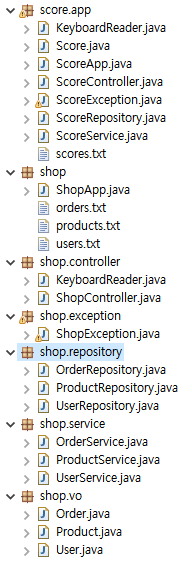

# 0415

- [0415](#0415)
- [앱 실습 1](#앱-실습-1)
  - [학생 성적정보 관리 프로그램](#학생-성적정보-관리-프로그램)
    - [실습 코드](#실습-코드)
- [프로그램 구현하기 과정](#프로그램-구현하기-과정)
  - [성적관리 프로그램 구현하기](#성적관리-프로그램-구현하기)
- [싱글턴](#싱글턴)
  - [싱글턴 객체](#싱글턴-객체)
    - [사용배경](#사용배경)
  - [싱글턴 패턴](#싱글턴-패턴)
    - [사용법](#사용법)
    - [예제](#예제)
- [앱 실습 2](#앱-실습-2)
  - [쇼핑몰 프로그램 구현하기](#쇼핑몰-프로그램-구현하기)
    - [구현하기](#구현하기)
      - [1. 메뉴 출력하기](#1-메뉴-출력하기)
      - [2. 기능 구현하기](#2-기능-구현하기)
        - [회원가입기능 구현하기](#회원가입기능-구현하기)
        - [로그인기능 구현하기](#로그인기능-구현하기)
        - [로그아웃 기능 구현하기](#로그아웃-기능-구현하기)
        - [상품조회기능 구현하기](#상품조회기능-구현하기)
        - [상품구매기능 구현하기](#상품구매기능-구현하기)
        - [내 정보보기기능 구현하기](#내-정보보기기능-구현하기)
        - [내 구매내역 조회기능 구현하기](#내-구매내역-조회기능-구현하기)
  - [실습 코드](#실습-코드-1)
    - [패키지별 구분](#패키지별-구분)
      - [shop](#shop)
      - [shop.vo](#shopvo)
      - [shop.controller](#shopcontroller)
      - [shop.exception](#shopexception)
      - [shop.service](#shopservice)
      - [shop.repository](#shoprepository)
    - [실행결과](#실행결과)

<small><i><a href='http://ecotrust-canada.github.io/markdown-toc/'>Table of contents generated with markdown-toc</a></i></small>


# 앱 실습 1
## 학생 성적정보 관리 프로그램
* 수정, 삭제 기능 코드 추가
### 실습 코드
* Score.java
  * 생성자 메소드 추가 (수정 기능에 사용)
    ```java
        public Score(int no, int kor, int eng, int math) {
            this(no, null, kor, eng, math);
        }

    ```
* ScoreService.java
    ```java
    /**
        * 변경된 성적정보를 전달받아서 반영시킨다.
        * @param score 성적정보
        * @throws ScoreException 학번이 유효한 값이 아닌 경우 예외가 발생한다.
        */
        public void updateScore(Score score) throws ScoreException, IOException {
            // getScoreByNo(int no) 멤버메소드를 호출해서 학번에 해당하는 학생정보를 조회한다.
            // getScoreByNo(int no) 멤버메소드는 학번에 해당하는 성적정보가 존재하지 않으면 ScoreException을 발생시킨다.
            Score foundScore = getScoreByNo(score.getNo());
            
            foundScore.setKor(score.getKor());
            foundScore.setEng(score.getEng());
            foundScore.setMath(score.getMath());
            
            scoreRepository.saveScores();
        }
        
        /**
        * 학번을 전달받아서 해당 학번 학생의 성적정보를 삭제한다.
        * @param no 학번
        * @throws IOException 해당 학번 학생의 성적정보가 존재하지 않는 경우 예외가 발생한다.
        */
        public void deleteScore(int no) throws IOException {
            
            // 전체 성적정보 조회
            List<Score> scores = scoreRepository.getAll();
            
            // 삭제완료 여부를 저장하는 변수
            boolean isDeleted = false;
            Iterator<Score> iter = scores.iterator();
            while (iter.hasNext()) {
                Score score = iter.next();
                // 전달받은 학번과 일치하는 학번의 성적정보가 존재하는지 체크한다.
                if(score.getNo() == no) {
                    // 현재 조회중인 성적정보를 삭제한다.
                    iter.remove();
                    // 삭제완료 여부를 true로 설정한다.
                    isDeleted = true;
                    break;
                }
            }
            
            // 삭제완료여부가 false라면 전달받은 학번과 일치하는 성적정보가 존재하지 않기 때문에 예외를 발생시킨다.
            if (!isDeleted) {
                throw new ScoreException("학번과 일치하는 성적정보가 존재하지 않습니다.");
            }
            
            // 위의 코드에서 예외가 발생되지 않았다면, 성적정보가 삭제된 것이므로 성적정보를 파일에 저장시킨다.
            scoreRepository.saveScores();
        }
    ```
* ScoreController.java
    ```java
    public void 수정() throws ScoreException, IOException {
            System.out.println("<< 성적 수정 >>");
            System.out.println("### 학번, 국어, 영어, 수학점수를 입력해서 성적을 변경하세요.");
            
            System.out.print("학번 입력: ");
            int no = keyboard.readInt();
            System.out.print("국어점수 입력: ");
            int kor = keyboard.readInt();
            System.out.print("영어점수 입력: ");
            int eng = keyboard.readInt();
            System.out.print("수학점수 입력: ");
            int math = keyboard.readInt();
            
            Score score = new Score(no, kor, eng, math);
            scoreService.updateScore(score);
            
            System.out.println("[처리 완료] 성적정보 변경이 완료되었습니다.");
        }
        
        public void 삭제() throws ScoreException, IOException {
            System.out.println("<< 성적 삭제 >>");
            System.out.println("### 학번을 입력해서 성적정보를 삭제하세요.");
            
            System.out.print("학번 입력: ");
            int no = keyboard.readInt();
            
            scoreService.deleteScore(no);
            
            System.out.println("[처리 완료] 성적정보가 삭제되었습니다.");
        }
    ```

# 프로그램 구현하기 과정
1. 데이터 파악
2. 필드 파악
3. Value Object 클래스 작성
4. 표현계층, 서비스계층, 영속화계층 클래스 작성
## 성적관리 프로그램 구현하기
1. 프로그램 개발 대상이 되는 데이터를 파악
   * 성적정보
2. 데이터의 속성(필드)을 파악
   * 성적정보의 속성
     * 정수형의 학번
     * 텍스트형의 이름
     * 정수형의 국어점수
     * 정수형의 영어점수
     * 정수형의 수학점수
     * 정수형의 총점
     * 정수형의 평균
     * 불린형의 합격여부
3. 1번과 2번에서 파악된 정보를 표현하는 Value Object 클래스 작성하기
   ```java
   public class Score {
       private int no;
       private String name;
       private int kor;
       private int eng;
       private int math;
       ...
   }
   ```
4. 표현계층, 서비스계층, 영속화계층에 해당하는 클래스를 작성하기
   * 표현계층은 서비스계층의 메소드를 서비스계층은 영속화 계층의 메소드를 호출할 수 있다.
     * 단방향, 계층을 건너뛸 수 없다.
     * 같은 계층의 메소드도 호출할 수 있다.(ex) 서비스계층의 메소드가 다른 서비스계층의 메소드를 호출)
   * 영속화 계층
     * 데이터에 대한 CRUD(Create, Retrieve, Update, Delete) 작업 구현
     ```java
     public class ScoreRepository {
         List<Score> database = new ArrayList<>();
         // 저장, 조회, 수정, 삭제 기능 구현
     }
     ```
   * 서비스 계층
     * 사용자에게 직접 제공되는 서비스를 구현
     ```java
     public class ScoreService {
         ScoreRepository repository = new ScoreRepository();
         // 성적정보 등록
         // 전체 성적정보 조회
         // 성적정보 상세조회
         // 합격자 조회
         // 불합격자 조회
         // 장학금 대상자 조회
         // 국어, 영어, 수학점수 변경
         // 성적정보 삭제
     }
     ```
   * 표현 계층
     * 사용자와 상호작용하는 기능 구현
     * 사용자에게 메뉴 제공, 사용자의 입력처리, 서비스 실행, 서비스 실행결과 출력
     ```java
     public class ScoreController {
         ScoreService scoreService = new ScoreService();
         KeyboardReader keyboard = new KeyboardReader();
         // 메뉴 제공
         // 메뉴별 상호작용 구현
     }
     ```

# 싱글턴
## 싱글턴 객체
* Singleton Object
* 애플리케이션이 실행되는 동안 객체가 단 하나만 생성되는 객체

### 사용배경
* 3계층 프로그래밍을 하다보면 하나의 Repository를 각기 다른 Service클래스에서 여러 번 호출해야 할 때가 있다.
* 그때 각기 다른 Repository객체가 기능을 수행하므로 저장된 값이 서로 다르게 된다.
* 이때 Repository를 통일하기 위해 싱글턴 패턴을 활용한다.

## 싱글턴 패턴
* 애플리케이션이 실행되는 동안 객체가 단 하나만 생성되고 사용되도록 하는 것

### 사용법
```java
// UserRepository 클래스가 싱글턴 객체로 사용되도록 구현코드 추가하기
public class UserRepository {

	/*
		싱글턴객체로 변신하기
		1. 자신의 객체를 저장하는 정적변수를 정의하고, 객체를 생성해서 대입한다.
		2. 기본생성자의 접근제한을 private로 설정한다. (다른 클래스에서 new 연산자로 객체생성할 수 없게 한다.)
		3. 1번에서 미리 생성해 둔 객체를 반환하는 정적 메소드를 제공한다.
	*/
	private static UserRepository instance = new UserRepository();	// 설계도가 메모리에 로딩될 때 객체가 생성되고 정적변수에 저장된다.
	private UserRepository() {}					// 생성자의 접근제한자를 private로 변경
	public static UserRepository getInstance() {			// 설계도 로딩시 생성된 UserRepository객체를 제공한다.
		return instance;
	}

	public void insert(User user) { ... }
	public User findUser(String id) { ... }
}
```
```java
public class UserService {
	// 싱글턴 객체 획득하기
	private UserRepository = UserRepository.getInstance(); 
}

```

### 예제
```java
public class ShopController {
// 필요한 객체 획득하기
private KeyboardReader keyboard = new KeyboardReader();
private UserService userService = UserService.getInstance();
private ProductService productService = ProductService.getInstance();
private OrderService orderService = OrderSerrice.getInstance();

private User loginedUser = null;

public void menu() {

}

}

public class UserService {
	// 싱글턴 코딩
	private static UserService instance = new UserService();
	private UserService() {}
	public static UserService getInstance() {
		return instance;
	}
	
	// 필요한 객체 획득하기
	private UserRepository userRepository = userRepository.getInstance();
}

public class OrderService {
	// 싱글턴 코딩
	private static OrderService instance = new OrderService();
	private OrderService() {}
	public static OrderService getInstance() {
		return instance;
	}
	
	// 필요한 객체 획득하기
	private UserRepository userRepository = UserRepository.getInstance();
	private ProductRepository productRepository = ProductRepositor.getInstance();
	private OrderRepository orderRepository = OrderRepository.getInstance();
	private UserService userService = UserService.getInstance();
	private ProductService productService = ProductService.getInstance();
	
}

public class UserRepository {

	private static UserRepository instance = new UserRepository();	// 설계도가 메모리에 로딩될 때 객체가 생성되고 정적변수에 저장된다.
	private UserRepository() {}					// 생성자의 접근제한자를 private로 변경
	public static UserRepository getInstance() {			// 설계도 로딩시 생성된 UserRepository객체를 제공한다.
		return instance;
	}

	private List<User> userList = new ArrayList<>();

	public void insert(User user) { ... }
	public User findUser(String id) { ... }
}

public class ProductRepository {

	private static ProductRepository instance = new ProductRepository();	// 설계도가 메모리에 로딩될 때 객체가 생성되고 정적변수에 저장된다.
	private ProductRepository() {}						// 생성자의 접근제한자를 private로 변경
	public static ProductRepository getInstance() {				// 설계도 로딩시 생성된 UserRepository객체를 제공한다.
		return instance;
	}

	private List<Product> productList = new ArrayList<>();
	
}

public class OrderRepository {

	private static OrderRepository instance = new OrderRepository();	// 설계도가 메모리에 로딩될 때 객체가 생성되고 정적변수에 저장된다.
	private OrderRepository() {}						// 생성자의 접근제한자를 private로 변경
	public static OrderRepository getInstance() {				// 설계도 로딩시 생성된 UserRepository객체를 제공한다.
		return instance;
	}

	private List<Order> orderList = new OrderList<>();
	
}
```

# 앱 실습 2
## 쇼핑몰 프로그램 구현하기
1. 프로그램 개발 대상이 되는 데이터를 파악
   * 사용자, 상품, 주문, 결재, 배송
2. 데이터의 속성 파악
   * 사용자정보의 속성
     * 번호, 이름, 아이디, 비밀번호, 이메일, 등급, 가입일, 적립포인트, 탈퇴일
   * 상품정보의 속성
     * 번호, 상품명, 제조사, 가격, 할인가격, 재고현황, 상태, 등록일
   * 주문정보의 속성
     * 번호, 주문자, 주문일, 주문상태, 총주문금액, 포인트 사용액, 쿠폰 사용액, 총결재금액, 적립포인트
   * 결재정보의 속성
     * 번호, 주문번호, 결재수단, 결재금액, 할부개월수, 결재일
   * 배송정보의 속성
     * 번호, 주문번호, 우편번호, 주소, 전화번호, 메모, 배송상태, 배송완료일

* 요구사항
   * 회원가입 기능
   * 로그인 기능
   * 로그아웃 기능
   * 내 정보 보기 기능
   * 내 구매내역 보기 기능
   * 상품 목록 보기 기능
   * 상품 바로 구매 기능
* 데이터
  * 회원정보, 상품정보, 구매정보
* 데이터 속성
  * 회원정보 : 아이디, 비밀번호, 이름, 이메일, 적립포인트, 등급(골드, 실버, 브론즈, 일반)
  * 상품정보 : 번호, 이름, 가격, 할인가격, 재고량, 판매상태(판매중, 재고없음)
  * 구매정보 : 번호(유닉스타임), 고객아이디, 상품번호, 상품이름, 구매가격, 구매수량, 총구매가격, 적립포인트
* 개발하기
  * shop 패키지 생성
    * users.txt, products.txt, orders.txt 파일 생성
    * ShopApp.java 클래스 정의
  * shop.vo 패키지 생성
    * User.java, Product.java, Order.java ValueObject 클래스 정의
      * 멤버변수, 기본생성자, Getter, Setter 메소드 정의
  * shop.repository 패키지 생성
    * UserRepository.java, ProductRepository.java OrderRepository.java 클래스 정의
  * shop.service 패키지 생성
    * UserService.java, ProductService.java, OrderService.java 클래스 정의
  * shop.controller 패키지 생성
    * ShopController.java 클래스 정의
  * shop.exception 패키지 생성
    * ShopException.java 클래스 정의
  


### 구현하기
#### 1. 메뉴 출력하기
  * ShopController에 menu메소드를 정의한다.
   	* 로그인하지 않았을 때 : 1.로그인  2.회원가입  3.상품조회  0.종료
   	* 로그인했을 때 : 11.상품조회  12.상품구매  13.내구매내역보기  14.내정보보기  15.로그아웃  0.종료
#### 2. 기능 구현하기 
##### 회원가입기능 구현하기
* UserRepository.java
  * `public void loadUsers() throws IOException {}` 메소드를 구현한다.
    * src/shop/users.txt파일의 읽어서 모든 사용자정보를 List객체에 저장한다.
  * `public void saveUsers() throws IOException {}` 메소드를 구현한다.
    * src/shop/users.txt파일에 모든 사용자정보를 기록한다.
  * `public void insert(User user) {}` 메소드를 구현한다.
    * 사용자정보를 전달받아서 List객체에 저장한다.
  * `public User findUser(String id) {}` 메소드를 구현한다.
    * 전달받은 사용자 아이디와 일치하는 사용자정보를 반환한다.
* UserService.java
  * `public void registerUser(User user) throws ShopException, IOException {}` 메소드를 구현한다.
  * UserRepository객체의 findUser(String id) 메소드를 호출해서 사용자정보를 조회한다.
  * 사용자가 존재하면 ShopException을 발생시킨다.
  * 사용자정보가 존재하지 않으면 
    * UserRepository객체의 insert(User user)메소드를 호출해서 사용자정보를 저장시킨다.
  * UserRepository객체의 saveUsers() 메소드를 호출해서 파일에 저장시킨다.
* ShopController.java
  * `private void 회원가입() throws ShopException, IOException {}` 메소드를 구현한다.
    * 아이디, 비밀번호, 이름, 이메일을 입력받는다.
	  * User객체를 생성해서 아이디, 비밀번호, 이름, 이메일을 저장한다.
    * 신규 가입인 경우 포인트는 10점, 등급은 "일반"을 저장한다.
    * UserService객체의 register(User user) 메소드를 호출해서 회원가입을 처리한다.
    * 회원가입 완료 메세지를 화면에 출력한다.
##### 로그인기능 구현하기
* UserRepository.java
	* 구현할 내용없음

* UserService.java
	* `public User loginUser(String id, String password) throws ShopException {}` 메소드를 구현한다.
	  * UserRepository객체의 findUser(String id) 메소드를 호출해서 사용자정보를 조회한다.
	  * 사용자가 존재하지 않으면 ShopException을 발생시킨다.
	  * 비밀번호가 일치하지 않으면 ShopException을 발생시킨다.
	  * 사용자 인증이 완료되면 조회된 User정보를 반환한다.

* ShpController.java
	* `private void 로그인() throws ShopException {}` 메소드를 구현한다.
	  * 아이디, 비밀번호를 입력받는다.
	  * UserService객체의 loginUser(String id, String password) 메소드를 호출해서 로그인을 처리한다.
	  * 인증이 완료된 사용자정보를 반환받아서 ShopController의 loginedUser에 대입한다.
	  * 로그인 완료 메세지를 화면에 표시한다.

##### 로그아웃 기능 구현하기
* UserRepository.java
	* 구현할 내용없음
* UserService.java
	* 구현할 내용없음
* ShopController.java
	* `private void 로그아웃() {}` 메소드를 구현한다.
	  * ShopController의 loginedUser에 저장된 인증된 사용자정보를 null로 바꾼다.

##### 상품조회기능 구현하기
* ProductRepository.java
	* `public void loadProducts() throws IOException {}` 메소드를 구현한다.
	  * src/shop/products.txt파일의 읽어서 모든 상품정보를 List객체에 저장한다.

	* `public void saveProducts() throws IOException {}` 메소드를 구현한다.
	  * src/shop/products.txt파일에 모든 상품정보를 기록한다.

	* `public List<Product> findAllProducts() {}` 메소드를 구현한다.
	  * 모든 상품정보를 반환한다.

* ProductService.java
	* `public List<Product> getProductList() {}` 메소드를 구현한다.
	  * ProductRepository객체의 findAllProducts() 메소드를 호출해서 모든 상품정보를 조회한다.
	  * 조회된 모든 상품정보를 반환한다.

* ShopController.java
	* `private void 상품조회() {}` 메소드를 구현한다.
	  * ProductService객체의 getProductList()메소드를 호출해서 모든 상품정보를 조회한다.
	  * 조회된 모든 상품정보를 화면에 출력한다.
	  * 상품번호 가격 할인가격 재고수량 상품상태 상품명의 순으로 출력한다.

##### 상품구매기능 구현하기
* OrderRepository.java
	* `public void loadOrders() throws IOException {}` 메소드를 구현한다.
	  * src/shop/orders.txt파일의 읽어서 모든 주문정보를 List객체에 저장한다.

	* `public void saveOrders() throws IOException {}` 메소드를 구현한다.
	  * src/shop/orders.txt파일에 모든 주문정보를 기록한다.

	* `public void insert(Order order) {}`
	  * 주문정보를 전달받아서 List에 저장한다.

* ProductRepository.java
	* `public Product findProduct(int no) {}` 메소드를 구현한다.
	  * 전달받은 상품번호에 해당하는 상품정보를 반환한다.

* UserService.java
	* `public void depositPoint(String id, int point) throws StoreException, IOException {}` 메소드를 구현한다.
	  * UserRepository객체의 findUser(String id) 메소드를 호출해서 사용자정보를 조회한다.
	  * 사용자정보가 존재하지 않으면 StoreException 예외를 발생시킨다.
	  * 사용자의 포인트를 전달받은 포인트만큼 증가시킨다.
	  * 포인트 변경 후 고객의 등급을 재조정한다.
  	  ```
      포인트가 1000미만 일반
      포인트가 5000미만 브론즈
      포인트가 50000미만 실버
      포인트가 500000이상 골드
      ```
	  * UserRepository객체의 saveUsers() 메소드를 호출해서 파일에 저장시킨다.

* ProductService.java
	* `public void decreaseStock(int no, int amount) throws StoreException, IOException {}` 메소드를 구현한다.
	  * ProductRepository객체의 findProduct(int no) {} 메소드를 실행해서 상품번호와 일치하는 상품정보를 조회한다.
	  * 상품정보가 존재하지 않으면 StoreException 예외를 발생시킨다.
	  * 상품의 재고량을 전달받은 수량만큼 감소시킨다.
	  * 상품의 재고량이 0이 되면 상품의 상태를 "재고없음"으로 변경한다.
 	  * ProductRepository객체의 saveProducts() 메소드를 호출해서 파일에 저장시킨다.
	  

* OrderService.java
	* `public void addNewOrder(String userId, int productNo, int quantity) throws StoreException, IOException {}` 메소드를 구현한다.
	  * UserRepository객체의 findUser(String id) {} 메소드를 실행해서 사용자정보를 조회한다.
	  * 사용자정보가 존재하지 않으면 StoreException을 예외를 발생시킨다.
	  * ProductRepository객체의 findProduct(int no) {} 메소드를 실행해서 상품번호와 일치하는 상품정보를 조회한다.
	  * 상품정보가 존재하지 않으면 StoreException 예외를 발생시킨다.				
	  * 구매수량보다 재고량이 부족하면 StoreException 예외를 발생시킨다.
	  * 총 구매금액을 계산한다.
	  * 총 구매금액에 대한 적립포인트를 계산한다.(회원등급별 총구매금액에 대한 적립포인트 비율 : 골드 0.5%, 실버 0.2%, 브론즈 0.07%, 일반 0.02%)
	  * Order객체에 번호(유닉스타임), 고객아이디, 상품번호, 상품이름, 구매가격(구매당시의 할인가격이다.), 구매수량, 총구매가격, 적립포인트를 저장한다.
	  * OrderRepository객체의 insert(Order order)를 호출해서 주문정보를 List에 저장한다.
	  * OrderRepository객체의 saveOrders()를 호출해서 파일에 저장시킨다.
	  * UserService객체의 depositPoint(String id, int point)를 실행해서 고객의 포인트를 변경한다.
	  * ProductService객체의 decreaseStock(int no, int amount)를 실행해서 상품의 재고량을 변경한다.

* ShopController
	* `private void 바로구매() throws StoreException, IOException {}` 메소드를 구현한다.
	  * 상품번호, 구매수량을 입력받는다.
	  * OrderService객체의 addNewOrder(String userId, int productNo, int quantity)를 실행해서 주문을 처리한다.
		* 사용자 아이디는 로그인한 사용자의 아이디다.
	  * 주문완료 메세지를 화면에 표시한다.
			
##### 내 정보보기기능 구현하기
* UserRepository.java
  * 구현내용 없음

* UserService.java
  * `public User getUserDetail(String id) throws StoreException {}` 메소드를 구현한다.	
    * UserRepository객체의 findUser(String id) 메소드를 호출해서 사용자정보를 조회한다.
    * 사용자정보가 존재하지 않으면 StoreException 예외를 발생시킨다.
    * 조회된 사용자 정보를 반환한다.

* ShopController.java
  * `private void 내정보보기() throws StoreException {}` 메소드를 구현한다.
    * UserService객체의 getUserDetail(String id)를 실행시켜서 사용자정보를 조회한다.
    * 조회된 사용자 정보를 출력한다.


##### 내 구매내역 조회기능 구현하기
* OrderRepository.java
	* `public List<Order> getOrdersByUserId(String userId) {}` 메소드르 구현한다.
	  * List객체에 저장된 구매정보중에서 전달받은 사용자아이디로 주문된 모든 구매정보를 반환한다.

* OrderService.java
	* `public List<Order> getMyOrders(String userId) {}` 메소드를 구현한다.
	  * UserRepository객체의 findUser(String id) 메소드를 호출해서 사용자정보를 조회한다.
	  * 사용자정보가 존재하지 않으면 StoreException 예외를 발생시킨다.	
	  * OrderRepository객체의 getOrdersByUserId(String userId) 메소드를 호출해서 구매내역을 조회한다.
	  * 조회된 구매내역을 반환한다.

* ShopController.java
	* `private void 구매내역() throws StoreException {}` 메소드를 구현한다.
	  * OrderService객체의 getMyOrders(String userId) 메소드를 호출해서 내 구매내역을 조회한다.
		* * 사용자 아이디는 로그인한 사용자의 아이디다.
	  * 구매내역이 존재하지 않으면 화면에 "구매내역이 존재하지 않습니다." 메세지를 출력한다. 				
	  * 구매내역이 존재하면 주문번호 총구매금액 적립포인트 가격 구매수량 상품명 순으로 출력한다.
								
## 실습 코드
### 패키지별 구분
* pakage에 역할별로 구분하였다
* 아래 패키지 순서는 프로그램의 작성 및 수행순서를 고려하여 나열하였다.
  * shop 
    * 메인메소드, 데이터 저장용 text파일들
      * ShopApp.java
      * orders.txt
      * products.txt
      * users.txt
  * shop.vo 
    * 객체 클래스들(ValueObject)
      * Order.java
      * Product.java
      * User.java
  * shop.controller
    * 표현계층(controller) 클래스, 키보드 읽기 기능 클래스
      * KeyboardReader.java
      * ShopController.java
  * shop.exception
    * 사용자 정의 예외 처리용 클래스 
      * ShopException.java
  * shop.service
    * 서비스계층 클래스
      * OrderService.java
      * ProductService.java
      * UserService.java
  * shop.repository
    * 영속화 클래스
      * OrderRepository.java
      * ProductRepository.java
      * UserRepository.java
#### shop
```JAVA
package shop;

import java.io.IOException;

import shop.controller.ShopController;

public class ShopApp {

	public static void main(String[] args) throws IOException {
		
		new ShopController().run();
	}
}
```
* products.txt
  * 판매중인 상품의 정보가 저장되어 있다.
  ```
  101,갤럭시 S22,1200000,990000,10,판매중
  102,갤럭시 S22+,1300000,1190000,2,판매중
  103,갤럭시 S22 Ultra,1550000,1250000,2,판매중
  104,갤럭시 A53,650000,595000,3,판매중
  105,갤럭시 A23,450000,395000,0,재고없음
  106,갤럭시 Z 플립3,1350000,1254000,3,판매중
  107,갤럭시 M12,250000,198000,0,재고없음
  108,아이폰13 미니,870000,810000,5,판매중
  109,아이폰SE,560000,540000,10,판매중
  110,아이폰13,1200000,1100000,2,판매중
  111,아이폰13 프로,1500000,1400000,5,판매중
  112,아이폰13 프로 맥스,1900000,1750000,4,판매중
  ```

* orders.txt는 주문정보를 주문등록하면 저장한다.
  ```
  1650030041152,quf,102,갤럭시 S22+,1190000,1,1190000,238
  1650030898664,quf,112,아이폰13 프로 맥스,1750000,1,1750000,350
  1650030905376,quf,110,아이폰13,1100000,2,2200000,440
  1650031247641,quf,103,갤럭시 S22 Ultra,1250000,1,1250000,250
  1650031418872,hong,105,갤럭시 A23,395000,3,1185000,237
  1650031436433,hong,107,갤럭시 M12,198000,10,1980000,396
  1650031716912,quf,106,갤럭시 Z 플립3,1254000,1,1254000,250
  1650031736872,hong,101,갤럭시 S22,990000,1,990000,198
  1650031760608,qwer,109,아이폰SE,540000,5,2700000,540
  ```

* users.txt는 사용자정보를 회원가입하면 저장한다.
  ```
  hong,1234,홍길동,hong@email.com,643,643
  quf,2202,kjh,kjh@email.com,1288,1288
  qwer,1234,가나다,qwer@email.com,10,10
  ```

#### shop.vo
```JAVA
package shop.vo;

public class Order {
	
	private long no;
	private String userId;
	private int productNo;
	private String productName;
	private int orderPrice;
	private int quantity;
	private int totalOrderPrice;
	private int point;
	
	public Order() {}
	
	public Order(long no, String userId, int productNo, String productName, int orderPrice, int quantity,
			int totalOrderPrice, int point) {
		super();
		this.no = no;
		this.userId = userId;
		this.productNo = productNo;
		this.productName = productName;
		this.orderPrice = orderPrice;
		this.quantity = quantity;
		this.totalOrderPrice = totalOrderPrice;
		this.point = point;
	}

	public long getNo() {
		return no;
	}

	public String getUserId() {
		return userId;
	}

	public int getProductNo() {
		return productNo;
	}

	public String getProductName() {
		return productName;
	}

	public int getOrderPrice() {
		return orderPrice;
	}

	public int getQuantity() {
		return quantity;
	}

	public int getTotalOrderPrice() {
		return totalOrderPrice;
	}

	public int getPoint() {
		return point;
	}

	public void setNo(long no) {
		this.no = no;
	}

	public void setUserId(String userId) {
		this.userId = userId;
	}

	public void setProductNo(int productNo) {
		this.productNo = productNo;
	}

	public void setProductName(String productName) {
		this.productName = productName;
	}

	public void setOrderPrice(int orderPrice) {
		this.orderPrice = orderPrice;
	}

	public void setQuantity(int quantity) {
		this.quantity = quantity;
	}

	public void setTotalOrderPrice(int totalOrderPrice) {
		this.totalOrderPrice = totalOrderPrice;
	}

	public void setPoint(int point) {
		this.point = point;
	}
		
}

```
```JAVA
package shop.vo;

public class Product {

	private int no;
	private String name;
	private int price;
	private int discountPrice;
	private int stock;
	private String status;
	
	public Product() {}	
	
	public Product(int no, String name, int price, int discountPrice, int stock, String status) {
		super();
		this.no = no;
		this.name = name;
		this.price = price;
		this.discountPrice = discountPrice;
		this.stock = stock;
		this.status = status;
	}

	public int getNo() {
		return no;
	}

	public String getName() {
		return name;
	}

	public int getPrice() {
		return price;
	}

	public int getDiscountPrice() {
		return discountPrice;
	}

	public int getStock() {
		return stock;
	}

	public String getStatus() {
		return status;
	}

	public void setNo(int no) {
		this.no = no;
	}

	public void setName(String name) {
		this.name = name;
	}

	public void setPrice(int price) {
		this.price = price;
	}

	public void setDiscountPrice(int discountPrice) {
		this.discountPrice = discountPrice;
	}

	public void setStock(int stock) {
		this.stock = stock;
	}

	public void setStatus(String status) {
		this.status = status;
	}
		
}

```
```JAVA
package shop.vo;

public class User {

	private String id;
	private String password;
	private String name;
	private String email;
	private int point;
	private String rank;
	
	public User() {}
	
	public User(String id, String password, String name, String email) {
		this(id, password, name, email, 0, null);
	}
	
	public User(String id, String password, String name, String email, int point, String rank) {
		super();
		this.id = id;
		this.password = password;
		this.name = name;
		this.email = email;
		this.point = point;
		this.rank = rank;
	}

	public String getId() {
		return id;
	}

	public String getPassword() {
		return password;
	}

	public String getName() {
		return name;
	}

	public String getEmail() {
		return email;
	}

	public int getPoint() {
		return point;
	}

	public String getRank() {
		return rank;
	}

	public void setId(String id) {
		this.id = id;
	}

	public void setPassword(String password) {
		this.password = password;
	}

	public void setName(String name) {
		this.name = name;
	}

	public void setEmail(String email) {
		this.email = email;
	}

	public void setPoint(int point) {
		this.point = point;
	}

	public void setRank(String rank) {
		this.rank = rank;
	}
		
}

```

#### shop.controller
```JAVA
package shop.controller;

import java.io.BufferedReader;
import java.io.IOException;
import java.io.InputStreamReader;

/**
 * 키보드 입력을 불린, 정수, 실수, 문자열로 읽어오는 readXXX()메소드를 제공하는 클래스다.
 * @author 중앙HTA
 *
 */
public class KeyboardReader {

	/**
	 * 키보드 입력을 한 줄단위로 읽어오는 BufferedReader객체가 대입되는 멤버변수다.
	 */
	private BufferedReader in;
	
	/**
	 * 키보드 입력을 한 줄단위로 읽어오는 BufferedReader객체를 생성해서 멤버변수 in에 대입한다.
	 */
	public KeyboardReader() {
		try {
			in = new BufferedReader(new InputStreamReader(System.in, "utf-8"));
		} catch (IOException e) {}
	}
	
	/**
	 * 키보드 입력을 읽어서 불린타입의 값을 반환한다.
	 * @return 불린값, true나 false가 아닌 문자열을 입력하면 false값이 반환된다.
	 */
	public boolean readBoolean() {
		try {
			return Boolean.parseBoolean(in.readLine().trim());
		} catch (Exception e) {
			return false;
		}
	}
	
	/**
	 * 키보드 입력을 읽어서 정수로 반환합니다.
	 * @return 정수, 숫자가 아닌 값이 포함되어 있으면 0이 반환된다.
	 */
	public int readInt() {
		try {
			return Integer.parseInt(in.readLine().trim());
		} catch (Exception e) {
			return 0;
		}
	}
	
	/**
	 * 키보드 입력을 읽어서 long타입의 정수를 반환합니다.
	 * @return 정수, 숫자가 아닌 값이 포함되어 있으면 0L이 반환된다.
	 */
	public long readLong() {
		try {
			return Long.parseLong(in.readLine().trim());
		} catch (Exception e) {
			return 0L;
		}
	}
	
	/**
	 * 키보드 입력을 읽어서 소숫점이 포함된 실수를 반환합니다.
	 * @return 실수, 숫자가 아닌 값이 포함되어 있으면 0.0이 반환된다.
	 */
	public double readDouble() {
		try {
			return Double.parseDouble(in.readLine().trim());
		} catch (Exception e) {
			return 0.0;
		}
	}
	
	/**
	 * 키보드 입력을 읽어서 문자열로 반환합니다.
	 * @return 문자열
	 */
	public String readString() {
		try {
			return in.readLine().trim();
		} catch (Exception e) {
			return "";
		}
	}
	
	/**
	 * 사용했던 리소스를 닫습니다.
	 */
	public void close() {
		try {
			in.close();
		} catch (IOException e) {}
	}
}

```
```JAVA
package shop.controller;

import java.io.IOException;
import java.util.List;

import shop.exception.ShopException;
import shop.service.OrderService;
import shop.service.ProductService;
import shop.service.UserService;
import shop.vo.Order;
import shop.vo.Product;
import shop.vo.User;

public class ShopController {

	private KeyboardReader keyboard = new KeyboardReader();
	private UserService userService = UserService.getInstance();
	private ProductService productService = ProductService.getInstance();
	private OrderService orderService = OrderService.getInstance();
	private User loginedUser = null;

	public void run() throws IOException {
		userService.start();
		productService.start();
		orderService.start();
		menu();
	}

	public void menu() {
		try {
			System.out.println("[스마트폰 쇼핑몰]");
			System.out.println("----------------------------------------------------------");
			if (loginedUser == null) {
				System.out.println("1.로그인 2.회원가입 3.상품조회 0.종료");
			} else {
				System.out.println("[스마트폰 쇼핑몰] ["+loginedUser.getName()+"]");
				System.out.println("11.상품조회 12.상품구매 13.내구매내역보기 14.내정보보기 15.로그아웃 0.종료");
			}
			System.out.println("----------------------------------------------------------");
			System.out.println();
			System.out.print("메뉴 번호 입력: ");
			int menuNo = keyboard.readInt();
			System.out.println();
			if (menuNo == 1) {
				로그인();
			} else if (menuNo == 2) {
				회원가입();
			} else if (menuNo == 3 || menuNo == 11) {
				상품조회();
			} else if (menuNo == 12) {
				상품구매();
			} else if (menuNo == 13) {
				내구매내역보기();
			} else if (menuNo == 14) {
				내정보보기();
			} else if (menuNo == 15) {
				로그아웃();
			} else if (menuNo == 0) {
				종료();
			}
		} catch (ShopException e) {
			System.out.println("[업무로직 오류 발생] " + e.getMessage());
		} catch (IOException e) {
			System.out.println("[입출력 오류 발생] " + e.getMessage());
		} catch (Exception e) {
			System.out.println("[프로그램 오류 발생] " + e.getMessage());
		}
		System.out.println("\n\n\n");
		menu();
	}

	private void 회원가입() throws ShopException, IOException {
		System.out.println("<< 회원가입 >>");
		System.out.println("### 아이디, 비밀번호, 이름, 이메일을 입력하세요");
		
		System.out.print("아이디 입력: ");
		String id = keyboard.readString();
		System.out.print("비밀번호 입력: ");
		String password = keyboard.readString();
		System.out.print("이름 입력: ");
		String name = keyboard.readString();
		System.out.print("이메일 입력: ");
		String email = keyboard.readString();

		User user = new User();
		user.setId(id);
		user.setPassword(password);
		user.setName(name);
		user.setEmail(email);
		user.setPoint(10);
		user.setRank("일반");
		
		userService.registerUser(user);

		System.out.println("[처리 완료] 회원가입이 완료되었습니다.");
	}

	private void 로그인() throws ShopException {
		System.out.println("<< 로그인 >>");
		System.out.println("### 아이디, 비밀번호를 입력하세요");

		System.out.print("아이디 입력: ");
		String id = keyboard.readString();
		System.out.print("비밀번호 입력: ");
		String password = keyboard.readString();

		loginedUser = userService.loginUser(id, password);

		System.out.println("[처리 완료] 로그인이 완료되었습니다.");
	}

	private void 로그아웃() {
		loginedUser = null;
		System.out.println("[처리 완료] 로그아웃 되었습니다.");
	}

	private void 상품조회() {
		System.out.println("<< 상품 전체 조회 >>");
		System.out.println("### 상품정보를 확인해보세요");

		List<Product> productList = productService.getProductList();

		System.out.println("----------------------------------------------------------------------------");
		System.out.println("번호\t가격\t할인가격\t재고수량\t판매상태\t상품명");
		System.out.println("----------------------------------------------------------------------------");
		for (Product product : productList) {
			System.out.print(product.getNo() + "\t");
			System.out.print(product.getPrice() + "\t");
			System.out.print(product.getDiscountPrice() + "\t");
			System.out.print(product.getStock() + "\t");
			System.out.print(product.getStatus() + "\t");
			System.out.println(product.getName());
		}
		System.out.println("----------------------------------------------------------------------------");

		System.out.println("[처리 완료] 모든 상품정보가 출력되었습니다.");

	}

	private void 상품구매() throws ShopException, IOException {
		System.out.println("<< 상품 바로 구매 >>");
		System.out.println("### 바로 상품을 구매해보세요");

		System.out.print("상품번호 입력: ");
		int productNo = keyboard.readInt();
		System.out.print("구매수량 입력: ");
		int quantity = keyboard.readInt();

		orderService.addNewOrder(loginedUser.getId(), productNo, quantity);

		System.out.println("[주문 완료] 주문이 성공적으로 완료되었습니다.");
	}

	private void 내정보보기() throws ShopException {
		System.out.println("<< 내 정보 보기 >>");
		System.out.println("### 내 정보를 확인할 수 있습니다.");

		System.out.println("아이디	: " + loginedUser.getId());
		System.out.println("이름 	: " + loginedUser.getName());
		System.out.println("이메일	: " + loginedUser.getEmail());
		System.out.println("포인트	: " + loginedUser.getPoint());
		System.out.println("등급  	: " + loginedUser.getRank());
	}

	private void 내구매내역보기() throws ShopException, IOException {
		System.out.println("<< 내 구매내역 보기 >>");
		System.out.println("### 내 구매내역을 확인할 수 있습니다.");
		
		List<Order> orderList = orderService.getUserOrdersById(loginedUser.getId());
		
		System.out.println("주문자: " + loginedUser.getName());
		System.out.println("----------------------------------------------------------------");
		System.out.println("주문번호\t\t주문수량\t주문가격\t포인트\t상품명");
		System.out.println("----------------------------------------------------------------");
		for (Order order : orderList) {
			System.out.print(order.getNo() + "\t");
			System.out.print(order.getOrderPrice() + "\t");
			System.out.print(order.getQuantity() + "\t");
			System.out.print(order.getPoint() + "\t");
			System.out.println(order.getProductName());
		}
		
		System.out.println("---------------------------------------------------------------");

	}
	
	private void 종료() throws IOException {
		System.out.println("<< 프로그램 종료 >>");
		orderService.shutdown();
		userService.shutdown();
		productService.shutdown();
		System.exit(0);
	}
}

```

#### shop.exception
```JAVA
package shop.exception;

public class ShopException extends Exception {

	public ShopException(String message) {
		super(message);
	}
	
	public ShopException(String message, Throwable cause) {
		super(message, cause);
	}
	
}

```

#### shop.service
```JAVA
package shop.service;

import java.io.IOException;
import java.util.ArrayList;
import java.util.List;

import shop.exception.ShopException;
import shop.repository.OrderRepository;
import shop.repository.ProductRepository;
import shop.repository.UserRepository;
import shop.vo.Order;
import shop.vo.Product;
import shop.vo.User;

public class OrderService {

	private static OrderService instance = new OrderService();

	private OrderService() {
	}

	public static OrderService getInstance() {
		return instance;
	}

	private UserRepository userRepository = UserRepository.getInstance();
	private ProductRepository productRepository = ProductRepository.getInstance();
	private OrderRepository orderRepository = OrderRepository.getInstance();

	private UserService userService = UserService.getInstance();
	private ProductService productService = ProductService.getInstance();

	/**
	 * 주문정보를 로딩한다.
	 * 
	 * @throws IOException 주문정보 로딩 중 입출력 오류가 발생하면 이 예외를 던진다.
	 */
	public void start() throws IOException {
		orderRepository.loadOrder();
	}

	/**
	 * 주문자 아이디, 상품번호, 구매수량 정보를 전달받아 주문정보를 저장한다.
	 * 
	 * @param userId    주문자 아이디
	 * @param productNo 제품번호
	 * @param quantity  구매수량
	 * @throws ShopException 사용자정보, 상품정보가 존재하지 않거나, 상품수량이 부족하면 이 예외를 던진다.
	 * @throws IOException   주문정보 저장 중 입출력 오류가 발생하면 이 예외를 던진다.
	 */
	public void addNewOrder(String userId, int productNo, int quantity) throws ShopException, IOException {
		User foundUser = userRepository.findUser(userId);
		if (foundUser == null) {
			throw new ShopException("해당 사용자가 존재하지 않습니다.");
		}

		Product foundProduct = productRepository.findProduct(productNo);
		if (foundProduct == null) {
			throw new ShopException("해당 상품이 존재하지 않습니다.");
		}

		int stock = foundProduct.getStock();
		if (quantity > stock) {
			throw new ShopException("재고량이 부족합니다.");
		}

		int totalOrderPrice = foundProduct.getDiscountPrice() * quantity;
		String rank = foundUser.getRank();

		int depositPoint = 0;
		if (rank.equals("골드")) {
			depositPoint = (int) (totalOrderPrice * 0.005);
		} else if (rank.equals("실버")) {
			depositPoint = (int) (totalOrderPrice * 0.002);
		} else if (rank.equals("브론즈")) {
			depositPoint = (int) (totalOrderPrice * 0.0007);
		} else {
			depositPoint = (int) (totalOrderPrice * 0.0002);
		}
		
		long no = System.currentTimeMillis();
		String productName = foundProduct.getName();
		int discountPrice = foundProduct.getDiscountPrice();
		Order order = new Order(no, userId, productNo, productName, discountPrice, quantity, totalOrderPrice,
				depositPoint);
		
		orderRepository.insert(order);
		orderRepository.saveOrders();
		
		userService.depositPoint(userId, depositPoint);
		productService.decreaseStock(productNo, quantity);
		
	}
	
	public List<Order> getUserOrdersById(String id) {
		return orderRepository.findUserOrders(id);
	}
	
	/**
	 * 주문저장소 시스템을 종료한다.
	 * @throws IOException
	 */
	public void shutdown() throws IOException {
		orderRepository.saveOrders();
	}
	
}

```
```JAVA
package shop.service;

import java.io.IOException;
import java.util.List;

import shop.exception.ShopException;
import shop.repository.ProductRepository;
import shop.vo.Product;

public class ProductService {

	private static ProductService instance = new ProductService();

	private ProductService() {
	}

	public static ProductService getInstance() {
		return instance;
	}

	private ProductRepository productRepository = ProductRepository.getInstance();

	/**
	 * 상품정보를 로딩시킨다.
	 * 
	 * @throws IOException 사용자 정보 로딩 중 입출력 오류가 발생하면 이 예외를 던진다.
	 */
	public void start() throws IOException {
		productRepository.loadProducts();
	}
	
	/**
	 * 모든 상품정보를 반환한다.
	 * 
	 * @return
	 */
	public List<Product> getProductList() {
		return productRepository.findAllProducts();
	}

	/**
	 * 상품번호와 수량을 전달받아서 해당 상품의 재고를 수량만큼 감소시킨다.
	 * 
	 * @param no     상품번호
	 * @param amount 수량
	 * @throws ShopException 상품번호와 일치하는 상품정보가 존재하지 않으면 이 예외를 던진다.
	 * @throws IOException   사용자 정보 저장 중 입출력 오류가 발생하면 이 예외를 던진다.
	 */
	public void decreaseStock(int no, int amount) throws ShopException, IOException {
		Product foundProduct = productRepository.findProduct(no);
		if (foundProduct == null) {
			throw new ShopException("해당 상품이 존재하지 않습니다.");
		}
		foundProduct.setStock(foundProduct.getStock() - amount);
		if (foundProduct.getStock() == 0) {
			foundProduct.setStatus("재고없음");
		}
		productRepository.saveProducts();
	}
	
	public void shutdown() throws IOException {
		productRepository.saveProducts();
	}
}

```
```JAVA
package shop.service;

import java.io.IOException;

import shop.exception.ShopException;
import shop.repository.UserRepository;
import shop.vo.User;

public class UserService {

	private static UserService instance = new UserService();

	private UserService() {
	}

	public static UserService getInstance() {
		return instance;
	}

	private UserRepository userRepository = UserRepository.getInstance();

	/**
	 * 사용자정보를 로딩시킨다.
	 * 
	 * @throws IOException 사용자 정보 로딩 중 입출력 오류가 발생하면 이 예외를 던진다.
	 */
	public void start() throws IOException {
		userRepository.loadUsers();
	}

	/**
	 * 새 사용자정보를 전달받아서 회원으로 등록시킨다.
	 * 
	 * @param user 새 사용자정보
	 * @throws ShopException 이미 등록된 아이디인 경우 이 예외를 던진다.
	 * @throws IOException   사용자정보 저장 중 입출력 오류가 발생하면 이 예외를 던진다.
	 */
	public void registerUser(User user) throws ShopException, IOException {
		User existingUser = userRepository.findUser(user.getId());
		if (existingUser != null) {
			throw new ShopException("사용자가 이미 존재합니다.");
		}
		userRepository.insert(user);
		userRepository.saveUsers();

	}

	/**
	 * 아이디, 비밀번호를 전달받아서 사용자 인증작업을 수행하고, 인증이 완료된 사용자정보를 반환한다.
	 * 
	 * @param id       아이디
	 * @param password 비밀번호
	 * @return 인증이 완료된 사용자정보
	 * @throws ShopException 아이디 혹은 비밀번호가 올바르지 않을 때 이 예외를 던진다.
	 */
	public User loginUser(String id, String password) throws ShopException {
		User user = userRepository.findUser(id);
		if (user == null) {
			throw new ShopException("아이디 혹은 비밀번호가 올바르지 않습니다.");
		}
		if (!user.getPassword().equals(user.getPassword())) {
			throw new ShopException("아이디 혹은 비밀번호가 올바르지 않습니다.");
		}
		return user;
	}

	/**
	 * 사용자 아이디와 적립포인트를 전달받아서 사용자의 포인트를 증가시키고, 특정 등급의 포인트에 도달하면 등급을 변경한다.
	 * 
	 * @param id    사용자 아이디
	 * @param point 적립포인트
	 * @throws ShopException 아이디와 일치하는 사용자가 존재하지 않으면 이 예외를 던진다.
	 * @throws IOException   사용자정보 저장 중 입출력 오류가 발생하면 이 예외를 던진다.
	 */
	public void depositPoint(String id, int point) throws ShopException, IOException {
		User foundUser = userRepository.findUser(id);
		if (foundUser == null) {
			throw new ShopException("해당하는 사용자를 찾을 수 없습니다.");
		}
		foundUser.setPoint(foundUser.getPoint() + point);
		if (foundUser.getPoint() >= 500000) {
			foundUser.setRank("골드");
		} else if (foundUser.getPoint() >= 50000) {
			foundUser.setRank("실버");
		} else if (foundUser.getPoint() >= 5000) {
			foundUser.setRank("브론즈");
		} else {
			foundUser.setRank("일반");
		}
		userRepository.saveUsers();
	}

	public void shutdown() throws IOException {
		userRepository.saveUsers();
	}

}

```

#### shop.repository
```JAVA
package shop.repository;

import java.io.BufferedReader;
import java.io.FileReader;
import java.io.IOException;
import java.io.PrintWriter;
import java.util.ArrayList;
import java.util.Iterator;
import java.util.List;

import shop.vo.Order;

public class OrderRepository {

	private static OrderRepository instance = new OrderRepository();

	private OrderRepository() {
	}

	public static OrderRepository getInstance() {
		return instance;
	}

	private List<Order> orderList = new ArrayList<>();

	/**
	 * src/shop/orders.txt 파일을 읽어서 주문정보를 로딩한다.
	 * 
	 * @throws IOException 지정된 경로에 파일이 존재하지 않으면 이 예외를 던진다.
	 */
	public void loadOrder() throws IOException {
		BufferedReader bufferedReader = new BufferedReader(new FileReader("src/shop/orders.txt"));
		String data = null;
		while ((data = bufferedReader.readLine()) != null) {
			String[] items = data.split(",");
			long no = Long.parseLong(items[0]);
			String userId = items[1];
			int productNo = Integer.parseInt(items[2]);
			String productName = items[3];
			int orderPrice = Integer.parseInt(items[4]);
			int quantity = Integer.parseInt(items[5]);
			int totalOrderPrice = Integer.parseInt(items[6]);
			int point = Integer.parseInt(items[7]);
			Order order = new Order(no, userId, productNo, productName, orderPrice, quantity, totalOrderPrice, point);
			orderList.add(order);
		}
		bufferedReader.close();
	}

	/**
	 * 모든 상품정보를 src/shop/orders.txt파일에 저장한다.
	 * 
	 * @throws IOException 지정된 경로에 파일이 존재하지 않으면 이 예외를 던진다.
	 */
	public void saveOrders() throws IOException {
		PrintWriter printWriter = new PrintWriter("src/shop/orders.txt");
		for (Order order : orderList) {
			String text = order.getNo() + "," + order.getUserId() + "," + order.getProductNo() + ","
					+ order.getProductName() + "," + order.getOrderPrice() + "," + order.getQuantity() + ","
					+ order.getTotalOrderPrice() + "," + order.getPoint();
			printWriter.println(text);
		}
		printWriter.close();
	}

	/**
	 * 주문정보를 저장한다.
	 * 
	 * @param order 주문정보
	 */
	public void insert(Order order) {
		orderList.add(order);
	}

	/**
	 * 사용자 아이디를 전달받아 해당 사용자의 구매내역들을 반환한다.
	 * 
	 * @param id 사용자아이디
	 * @return
	 */
	public List<Order> findUserOrders(String id) {
		List<Order> userOrderList = new ArrayList<>();
		Iterator<Order> iter = orderList.iterator();
		while (iter.hasNext()) {
			Order order = iter.next();
			if (order.getUserId().equals(id)) {
				userOrderList.add(order);
			}
		}
		return userOrderList;
	}

}

```
```JAVA
package shop.repository;

import java.io.BufferedReader;
import java.io.FileReader;
import java.io.IOException;
import java.io.PrintWriter;
import java.util.ArrayList;
import java.util.List;

import shop.vo.Product;

public class ProductRepository {

	private static ProductRepository instance = new ProductRepository();

	private ProductRepository() {
	}

	public static ProductRepository getInstance() {
		return instance;
	}

	private List<Product> productList = new ArrayList<>();

	/**
	 * src/shop/products.txt 파일을 읽어서 상품정보를 로딩한다.
	 * 
	 * @throws IOException 지정된 경로에 파일이 존재하지 않으면 이 예외를 던진다.
	 */
	public void loadProducts() throws IOException {
		BufferedReader bufferedReader = new BufferedReader(new FileReader("src/shop/products.txt"));
		String data = null;
		while ((data = bufferedReader.readLine()) != null) {
			String[] items = data.split(",");
			Product product = new Product();
			product.setNo(Integer.parseInt(items[0]));
			product.setName(items[1]);
			product.setPrice(Integer.parseInt(items[2]));
			product.setDiscountPrice(Integer.parseInt(items[3]));
			product.setStock(Integer.parseInt(items[4]));
			product.setStatus(items[5]);
			
			productList.add(product);
		}
		bufferedReader.close();
	}

	public void saveProducts() throws IOException {
		PrintWriter printWriter = new PrintWriter("src/shop/products.txt");
		for (Product product : productList) {
			String text = product.getNo() + "," + product.getName() + "," + product.getPrice() + ","
					+ product.getDiscountPrice() + "," + product.getStock() + "," + product.getStatus();
			printWriter.println(text);
		}

		printWriter.close();
	}

	/**
	 * 모든 상품정보를 반환한다.
	 * 
	 * @return
	 */
	public List<Product> findAllProducts() {
		return productList;
	}

	/**
	 * 상품번호를 전달받아서 일치하는 상품정보를 반환한다.
	 * 
	 * @param no 상품번호
	 * @return 상품정보, 상품번호와 일치하는 상품정보가 없으면 null을 반환한다.
	 */
	public Product findProduct(int no) {
		Product foundProduct = null;
		for (Product product : productList) {
			if (product.getNo() == no) {
				foundProduct = product;
				break;
			}
		}
		return foundProduct;
	}
}

```
```JAVA
package shop.repository;

import java.io.BufferedReader;
import java.io.FileReader;
import java.io.IOException;
import java.io.PrintWriter;
import java.util.ArrayList;
import java.util.List;

import shop.vo.User;

public class UserRepository {

	private static UserRepository instance = new UserRepository();

	private UserRepository() {
	}

	public static UserRepository getInstance() {
		return instance;
	}

	private List<User> userList = new ArrayList<>();

	/**
	 * src/shop/users.txt 파일을 읽어서 사용자정보를 로딩한다.
	 * 
	 * @throws IOException 지정된 경로에 파일이 존재하지 않으면 이 예외가 발생된다.
	 */
	public void loadUsers() throws IOException {
		BufferedReader bufferedReader = new BufferedReader(new FileReader("src/shop/users.txt"));
		String data = null;
		while ((data = bufferedReader.readLine()) != null) {
			String[] items = data.split(",");
			String id = items[0];
			String password = items[1];
			String name = items[2];
			String email = items[3];
			int point = Integer.parseInt(items[4]);
			String rank = items[5];
			User user = new User(id, password, name, email, point, rank);
			userList.add(user);
		}
		bufferedReader.close();
	}

	/**
	 * 모든 사용자정보를 src/shop/users.txt파일에 저장한다.
	 * 
	 * @throws IOException 지정된 경로에 파일이 존재하지 않으면 이 예외가 발생된다.
	 */
	public void saveUsers() throws IOException {
		PrintWriter printWriter = new PrintWriter("src/shop/users.txt");
		for (User user : userList) {
			String text = user.getId() + "," + user.getPassword() + "," + user.getName() + "," + user.getEmail() + ","
					+ user.getPoint() + "," + user.getRank();
			printWriter.println(text);
		}
		printWriter.close();
	}

	/**
	 * 전달받은 사용자정보를 List객체에 저장한다.
	 * 
	 * @param user 새 사용자정보
	 */
	public void insert(User user) {
		userList.add(user);
	}

	/**
	 * 전달받은 아이디와 일치하는 사용자정보를 반환한다.
	 * 
	 * @param id 사용자 아이디
	 * @return 사용자정보, 일치하는 사용자가 없으면 null을 반환한다.
	 */
	public User findUser(String id) {
		User foundUser = null;
		for (User user : userList) {
			if (user.getId().equals(id)) {
				foundUser = user;
				break;
			}
		}
		return foundUser;
	}

}

```

### 실행결과
1. 로그인  


2. 회원가입  


3. 상품조회  


12. 상품구매  


13. 내구매내역보기  


14. 내정보보기  


15. 로그아웃  


0. 종료  
