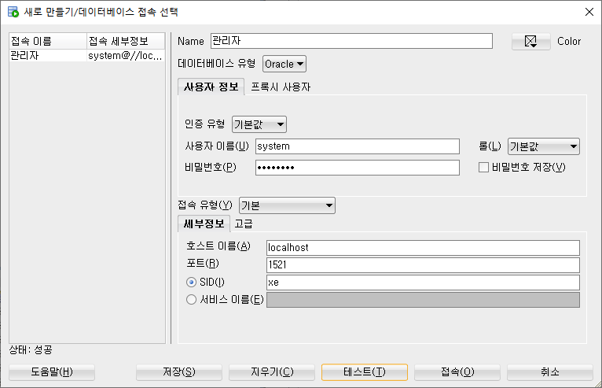

# 04/18


# 과제5 로또앱
## 로또앱
메뉴
* 회차지정
* 자동추첨
* 수동추첨
* 추첨
* 당첨조회
* 요약정보
* 수익확인

### 풀이 코드
각 클래스, 변수, 메소드에 달린 주석으로 내용을 확인할 수 있다.
* LotteryController.java
```java
package lottery.controller;

import java.io.IOException;
import java.util.List;

import lottery.exception.LotteryException;
import lottery.service.LotteryRewardService;
import lottery.service.LotterySalesService;
import lottery.service.LottoService;
import lottery.utils.KeyboardReader;
import lottery.vo.LotteryReward;
import lottery.vo.LotterySale;
import lottery.vo.Lotto;

public class LotteryController {
    private KeyboardReader keyboard = new KeyboardReader();

    private LotterySalesService lotterySalesService = LotterySalesService.getInstance();
    private LotteryRewardService lotteryRewardService = LotteryRewardService.getInstance();
    private LottoService lottoService = LottoService.getInstance();

    private int currentLotteryPeriod = 0;

    /**
     * menu()메소드를 실행시켜 사용자화면에 프로그램이 제공하는 메뉴를 표시한다.
     * @throws IOException
     */
    public void run() throws IOException {
        lotterySalesService.start();
        lottoService.start();
        menu();
    }

    /**
     * 사용자에게 프로그램의 메뉴를 표시한다.
     * <pre>
     * 		회차지정
     * 			판매중인 복권의 회차를 지정한다.
     * 		자동판매
     * 			프로그램이 복권의 번호를 무작위로 생성해서 복권을 판매한다.
     * 			복권일련번호, 회차, 복권숫자를 출력한다.
     * 		수동판매
     * 			사용자가 입력한 번호로 복권을 판매한다.
     * 			복권일련번호, 회차, 복권숫자를 출력한다.
     * 		추첨
     * 			현재 판매중인 회차의 당첨번호를 추첨한다.
     * 			당첨번호 추첨시, 해당 회차의 총 매출이 집계된다.
     * 			당첨번호 추첨시, 해당 회차의 순위별 당첨금, 당첨자 수가 집계된다.	
     * 			당첨번호, 순위별 당첨금, 당첨자 수를 조회해서 출력한다.
	 * 		당첨조회
	 * 			사용자로부터 복권일련번호를 입력받아서 해당 복권의 당첨여부, 순위, 당첨금을 조회해서 출력한다.
	 * 		요약정보
	 * 			사용자로부터 회차를 입력받아서 회차별 당첨번호, 순위별 당첨금, 당첨자 수를 출력한다.
	 * 		수익확인
	 * 			관리자로부터 회차를 입력받아서 회차별 총매출, 총수익을 조회해서 출력한다.
	 * 			
     * </pre>
     */
    private void menu() {
        try {
            System.out.println("----------------------------------------------------------------------------------------------------");
            System.out.println("1.회차지정  2.자동판매  3.수동판매  4.추첨  5.당첨조회  6.요약정보  7.수익확인  0.종료");
            System.out.println("----------------------------------------------------------------------------------------------------");
            
            System.out.println();
            System.out.print("메뉴번호 입력: ");
            int menuNo = keyboard.readInt();
            System.out.println();
            
            if (menuNo == 1) {
                회차지정();
            } else if (menuNo == 2) {
                자동판매();
            } else if (menuNo == 3) {
                수동판매();
            } else if (menuNo == 4) {
                추첨();
            } else if (menuNo == 5) {
                
            } else if (menuNo == 6) {

            } else if (menuNo == 7) {
                
            } else if (menuNo == 0) {
                
            }
        } catch (LotteryException e) {
            System.out.println("[업무 오류 발생] " + e.getMessage());
        } catch (IOException e) {
            System.out.println("[입출력 오류 발생] " + e.getMessage());
        } catch (Exception e) {
            System.out.println("[시스템 오류 발생] " + e.getMessage());
        }
        
        System.out.println("\n\n\n");
        menu();
    }
    
    /**
     * 판매할 복권의 회차를 지정한다.
     */
    private void 회차지정() {
        System.out.println("<< 회차 지정 >>");
        System.out.println("### 이번 회차의 회차번호를 지정하세요");
        
        System.out.print("회차 입력: ");
        int period = keyboard.readInt();
        
        // LottoService의 isExistPeriod(int period) 메소드는 인자로 전달받은 회차의 복권추첨번호가 존재하면 true를 반환한다.
        // 복권추첨번호가 존재한다면 이미 복권추첨이 완료된 회차이기 때문에 화면에 오류 메세지를 출력한다.
        if (lottoService.isExistPeriod(period)) {
            System.out.println("[처리 오류] 지정한 회차는 판매가 종료된 회차입니다.");
            System.out.println();
            회차지정();
        } else {
        	// 복권추첨번호가 존재하지 않으면 입력한 회차를 복권판매회차를 지정한다.
            currentLotteryPeriod = period;
            System.out.println("[처리 완료] 새로운 회차가 지정되었습니다.");
        }
    }
    
    /**
     * 복권번호를 자동으로 지정한 복권을 판매하고, 그 정보를 출력한다.
     * @throws LotteryException 회차번호가 올바르지 않으면 이 예외를 던진다.
     * @throws IOException 입출력 오류가 발생하면 이 예외를 던진다.
     */
    private void 자동판매() throws LotteryException, IOException {
        System.out.println("<< 자동 판매 >>");
        System.out.println("### 복권번호를 자동으로 생성해서 판매합니다.");
        
        // LotterySaleService의 generateLotterySale(int period)는 회차를 전달받아서 해당 회차로 복권번호를 자동으로 생성해서
        // 복권일련번호, 회차번호, 복권번호가 저장된 LotterySale객체를 반환한다.
        LotterySale lotterySale = lotterySalesService.generateLotterySale(currentLotteryPeriod);
        System.out.println("----------------------------------------------------------------------------------------------------");
        System.out.println("회차번호: " + currentLotteryPeriod);
        System.out.println("일련번호: " + lotterySale.getSerial());
        System.out.println("복권번호: " + lotterySale.getNumbers());
        System.out.println("----------------------------------------------------------------------------------------------------");
     
        System.out.println("[처리 완료] 자동 판매가 완료되었습니다.");
    }

    /**
     * 복권번호를 사용자가 입력한 번호를 지정해서 판매하고, 복권정보를 출력한다.
     * @throws LotteryException 사용자가 입력한 복권번호가 유효하지 않으면 이 예외를 던진다.
     * @throws IOException 입출력 오류가 발생하면 이 예외를 던진다.
     */
    private void 수동판매() throws LotteryException, IOException {
        System.out.println("<< 수동 판매 >>");
        System.out.println("### 복권번호를 수동으로 입력받아서 판매합니다.");
        System.out.println("### 복권번호는 1,2,3,4,5,6 형식으로 입력하세요");

        // 사용자로부터 복권번호를 수동으로 입력받는다.
        System.out.print("번호입력: ");
        // text에는 사용자가 입력한 복권번호가 저장된다.
        // text는 "1,2,3,4,5,6" 형식의 값이 저장된다.
        String text = keyboard.readString();
        
        // LotterySalesService의 inputLottoNumber(int period, String text)는
        // 회차, 사용자가 입력한 복권번호를 인자로 전달하면 복권정보를 저장하고 반환한다.
        // 사용자가 
        LotterySale lotterySale = lotterySalesService.inputLottoNumbers(currentLotteryPeriod, text);
        System.out.println("----------------------------------------------------------------------------------------------------");
        System.out.println("회차번호: " + currentLotteryPeriod);
        System.out.println("일련번호: " + lotterySale.getSerial());
        System.out.println("복권번호: " + lotterySale.getNumbers());
        System.out.println("----------------------------------------------------------------------------------------------------");
        
        System.out.println("[처리 완료] 수동 판매가 완료되었습니다.");
    }
    
    /**
     * 이번 회차 복권판매를 마감하고 로또 번호를 추첨한다.
     * 추첨된 로또번호를 화면에 출력한다.
     * 당첨결과(순위, 순위별 1인당 당첨금, 당첨자 수)를 화면에 출력한다.
     * @throws LotteryException 유효한 회차가 아닐 때 예외를 던진다.
     * @throws IOException 입출력 오류가 발생할 때 이 예외를 던진다.
     */
    private void 추첨() throws LotteryException, IOException {
        System.out.println("### 이번 회차 복권 당첨번호를 추첨합니다.");
        
        // LottoService객체의 drawLotteryNumbers(int period) 메소드는 지정된 회차의 로또번호를 추첨한다.
        Lotto lotto = lottoService.drawLotteryNumbers(currentLotteryPeriod); 
        
        
        // LotteryRewardService의 getLotteryRewards(int period) 메소드는 지정된 회차의 당첨결과를 반환한다.
        // 당첨결과는 1~4등 총 4개
        List<LotteryReward> lotteryRewards = lotteryRewardService.getLotteryRewards(currentLotteryPeriod);

        System.out.println("### " + currentLotteryPeriod + "회차 추첨");
        System.out.println();
        
        System.out.println("### 복권번호");
        System.out.println("----------------------------------------------------------------------------------------------------");
        System.out.println("회차: " + currentLotteryPeriod);
        System.out.println("결과: " + lotto.getNumbers());
        System.out.println("----------------------------------------------------------------------------------------------------");

        // 해당 회차의 총매출액을 집계한다.
        lotterySalesService.summaryLotterySales(currentLotteryPeriod);
        // 해당 회차의 당첨결과를 집계한다.
        lotterySalesService.summaryLottoRewards(currentLotteryPeriod);
        
        System.out.println("### 순위별 당첨결과");
        System.out.println("----------------------------------------------------------------------------------------------------");
        for (LotteryReward lotteryReward : lotteryRewards) {
            System.out.println("순위: " + lotteryReward.getRanking());
            System.out.println("상금: " + lotteryReward.getPrize());
            System.out.println("당첨자수: " + lotteryReward.getNumberOfPeople());
            System.out.println();
        }
        System.out.println("----------------------------------------------------------------------------------------------------");


        System.out.println("[처리 완료] " + currentLotteryPeriod + "회차 복권 당첨번호 추첨이 완료되었습니다.");
    }
}

```

* LottoService
```java
package lottery.service;

import java.io.IOException;
import java.util.Set;
import java.util.TreeSet;
import java.util.Random;

import lottery.exception.LotteryException;
import lottery.repository.LottoRepository;
import lottery.vo.Lotto;

public class LottoService {
	private static LottoService instance = new LottoService();

	private LottoService() {
	}

	public static LottoService getInstance() {
		return instance;
	}

	private LottoRepository lottoRepository = LottoRepository.getInstance();

	/**
	 * 난수를 발생시키는 Random객체를 사용한다.
	 */
	private Random random = new Random();

	/**
	 * 모든 회차의 복권 당첨번호를 로딩한다.
	 * 
	 * @throws IOException
	 */
	public void start() throws IOException {
		lottoRepository.loadLottosFile();
	}

	/**
	 * 회차를 전달받아서 해당 회차의 로또 추점결과가 존재하는지 여부를 반환한다.
	 * 
	 * @param period 회차
	 * @return 로또 추첨결과 존재 여부
	 */
	public boolean isExistPeriod(int period) {
		return lottoRepository.getLotto(period) != null;
	}

	/**
	 * 회차를 전달받아서 로또 번호를 추첨한다.
	 * 
	 * @param period 회차
	 * @return 로또 추첨번호
	 * @throws LotteryException 회차번호가 유효하지 않거나, 추첨이 이미 완료된 경우 이 예외를 던진다.
	 * @throws IOException      입출력 오류가 발생하면 이 예외를 던진다.
	 */
	public Lotto drawLotteryNumbers(int period) throws LotteryException, IOException {
		if (period == 0) {
			throw new LotteryException("회차번호가 0입니다.");
		}
		if (isExistPeriod(period)) {
			throw new LotteryException("추첨이 완료된 회차입니다.");
		}

		// 이번 회차의 로또번호를 추첨한다.
		Set<Integer> numbers = new TreeSet<>();
		while (true) {
			int number = random.nextInt(45) + 1;
			numbers.add(number);
			if (numbers.size() == 6) {
				break;
			}
		}

		// 추첨된 로또번호를 Lotto객체에 회차와 함께 저장한다.
		Lotto lotto = new Lotto();
		lotto.setPeriod(period);
		lotto.setNumbers(numbers);

		// 추첨된 로또번호 정보를 저장하고, 파일에 기록한다.
		lottoRepository.insertLotto(lotto);
		lottoRepository.saveLottosFile();

		return lotto;
	}

}

```

* LottoRepository
```java
package lottery.repository;

import java.io.BufferedReader;
import java.io.FileReader;
import java.io.IOException;
import java.io.PrintWriter;
import java.util.ArrayList;
import java.util.List;

import lottery.vo.Lotto;

public class LottoRepository {
    private static LottoRepository instance = new LottoRepository();
    private LottoRepository() {}
    public static LottoRepository getInstance() {
        return instance;
    }

    private List<Lotto> lottos = new ArrayList<>();

    /**
     * 로또 추첨번호를 로딩한다.
     * @throws IOException 입출력 오류가 발생하면 예외를 던진다.
     */
    public void loadLottosFile() throws IOException {
        BufferedReader reader = new BufferedReader(new FileReader("src/lottery/lotto.txt"));
        String text = null;
        while ((text = reader.readLine()) != null) {
            lottos.add(Lotto.textToLotto(text));
        }
        reader.close();;
    }

    /**
     * 로또 추첨정보를 기록한다.
     * @throws IOException 입출력 오류가 발생하면 예외를 던진다.
     */
    public void saveLottosFile() throws IOException {
        PrintWriter writer = new PrintWriter("src/lottery/lotto.txt");
        for (Lotto lotto : lottos) {
            writer.println(Lotto.lottoToText(lotto));
        }
        writer.close();
    }

    /**
     * 로또 당첨번호를 전달받아서 저장한다.
     * @param lotto 로또 당첨번호 정보
     */
    public void insertLotto(Lotto lotto) {
        lottos.add(lotto);
    }

    /**
     * 전달받은 회차의 로또 당첨번호를 반환한다.
     * @param period 회차
     * @return 로또 당첨번호
     */
    public Lotto getLotto(int period) {
        for (Lotto lotto : lottos) {
            if (lotto.getPeriod() == period) {
                return lotto;
            }
        }
        return null;
    }
}

```

* LotterySalesService
  * repository와 연결되어 로또 판매와 관련된 서비스 기능을 구현하였다.
  * repository > service > controller > app
```java
package lottery.service;

import java.io.IOException;
import java.util.ArrayList;
import java.util.List;
import java.util.Map;
import java.util.Random;
import java.util.Set;
import java.util.TreeMap;
import java.util.TreeSet;

import lottery.exception.LotteryException;
import lottery.repository.LotteryRewardRepository;
import lottery.repository.LotterySalesRepository;
import lottery.repository.LotteryTotalSalesRepository;
import lottery.repository.LottoRepository;
import lottery.vo.LotteryReward;
import lottery.vo.LotterySale;
import lottery.vo.LotteryTotalSale;
import lottery.vo.Lotto;

/**
 * 복권 자동판매, 복권 수동판매, 복권판매매출 집계, 복권당첨결과 집계 등의 기능을 제공하는 객체의 클래스다.
 * 
 * @author lee_e
 *
 */
public class LotterySalesService {
	/**
	 * LotterySaleService가 싱글턴 객체로 사용되도록 지원하는 코드
	 */
	private static LotterySalesService instance = new LotterySalesService();

	private LotterySalesService() {
	}

	public static LotterySalesService getInstance() {
		return instance;
	}

	/**
	 * 복권판매정보를 조회/저장하는 LotterySaleRepository객체를 사용한다.
	 */
	private LotterySalesRepository lotterySalesRepository = LotterySalesRepository.getInstance();
	/**
	 * 복권판매 매출정보를 조회/저장하는 LotteryTotalSalesRepository객체를 사용한다. 회차별 복권판매 매출 정보를
	 * 조회/저장하기 위해서 사용된다. 회차별 복권당첨결과를 집계할 때 해당 회차의 1등~4등까지 상금을 산정할 때도 사용된다.
	 */
	private LotteryTotalSalesRepository lotteryTotalSalesRepository = LotteryTotalSalesRepository.getInstance();
	/**
	 * 복권당첨결과(회차, 순위별 당첨금, 당첨자수)를 조회/저장하는 LotteryRewardRepository객체를 사용한다.
	 */
	private LotteryRewardRepository lotteryRewardRepository = LotteryRewardRepository.getInstance();
	/**
	 * 복권당첨번호를 조회/저장하는 LottoRepository객체를 사용한다. LottoRepository는 회차별 복권 당첨번호 정보를
	 * 제공한다. 회차별 복권당첨결과를 집계할 때 해당 회차의 복권 당첨번호를 조회하기 위해서 사용한다.
	 */
	private LottoRepository lottoRepository = LottoRepository.getInstance();

	/**
	 * 난수를 발생시키는 Random객체를 사용한다. int nextInt(int limit)는 0부터 limit-1범위의 숫자중에서 임의의
	 * 숫자를 반환한다.
	 */
	private Random random = new Random();

	/**
	 * 복권판매정보를 로딩한다.
	 * 
	 * @throws IOException 입출력 오류 발생시 이 예외를 던진다.
	 */
	public void start() throws IOException {
		lotterySalesRepository.loadLotterySalesFile();
	}

	/**
	 * 전달받은 회차로 복권번호를 자동으로 생성해서 반환한다.
	 * 
	 * @param period 회차
	 * @return 자동 생성된 복권번호
	 * @throws IOException      입출력 오류가 발생하면 이 예외를 던진다.
	 * @throws LotteryException 회차정보가 유효하지 않으면 이 예외를 던진다.
	 */
	public LotterySale generateLotterySale(int period) throws IOException, LotteryException {
		if (period == 0) {
			throw new LotteryException("회차번호가 0입니다.");
		}

		// 자동으로 생성된 6개의 복권번호를 저장할 TreeSet<Integer>객체를 생성한다.
		// TreeSet객체를 사용한 이유는
		// TreeSet은 같은 숫자가 중복으로 저장되지 않는다.
		// TreeSet은 저장된 숫자들이 오름차순으로 정렬되어 저장된다.
		Set<Integer> numbers = new TreeSet<>();
		// 몇번이나 반복해서 숫자를 뽑아서 저장해야지 중복없이 숫자 6개를 TreeSet에 저장할 지 모르기때문에
		// while(true)로 설정해서 반복을 계속 수행하게 한다.
		while (true) {
			// Random객체의 nextInt(int bound)는 0이상 bound값 미만의 임의의 정수를 반환한다.
			// 0 <= random.nextInt(45) < 45 : 0 ~ 44
			// 0 + 1 <= random.nextInt(45) + 1 < 45 + 1 : 1 ~ 45
			int number = random.nextInt(45) + 1;
			numbers.add(number);
			if (numbers.size() == 6) {
				break;
			}
		}

		// LotterySale객체를 생성해서 복권판매정보를 저장한다.
		LotterySale lotterySale = new LotterySale();
		lotterySale.setPeriod(period);
		lotterySale.setSerial(System.currentTimeMillis());
		lotterySale.setNumbers(numbers);

		// LotterySale 정보를 저장하고, 파일에 저장시킨다.
		lotterySalesRepository.insertLotterySale(lotterySale);
		lotterySalesRepository.saveLotterySalesFile();

		return lotterySale;
	}

	/**
	 * 전달받은 회차와 수동 입력된 복권번호를 분석해서 복권판매정보를 저장하고, 그 정보를 반환한다.
	 * 
	 * @param period 회차
	 * @param text   ","로 구분된 복권번호번호. 예시) 12,16,37,40,41,43
	 * @return 복권판매정보
	 * @throws LotteryException 수동 입력된 복권번호가 유효하지 않으면 이 예외를 던진다.
	 * @throws IOException      입출력 오류가 발생하면 이 예외를 던진다.
	 */
	public LotterySale inputLottoNumbers(int period, String text) throws IOException, LotteryException {
		if (period == 0) {
			throw new LotteryException("회차번호가 0입니다.");
		}

		// 전달받은 복권번호를 ",'를 기준으로 잘라서 배열을 획득한다.
		// items = {"10 ", " 14", "24", "35 ", "41", "44"}
		String[] items = text.split(",");
		// 배열의 길이가 6이 아니면 복권번호가 6개보다 적거나 많은 경우기 때문에 예외를 던진다.
		if (items.length != 6) {
			throw new LotteryException("번호 갯수가 올바르지 않습니다.");
		}

		// 복권번호를 저장할 TreeSet객체를 생성한다.
		Set<Integer> numbers = new TreeSet<>();
		for (String item : items) {
			// item.trim()은 좌우공백이 제거된 새 문자열을 반환한다.
			int number = 0;
			try {
				number = Integer.parseInt(item.trim());
			} catch (NumberFormatException e) {
				// 변환오류가 발생하면 number값은 0이다.
			}
			if (number < 1 || number > 45) {
				throw new LotteryException("유효한 로또번호가 아닙니다.");
			}
			numbers.add(number);
		}
		// TreeSet에 저장된 복권번호 갯수가 6개 미만이면 예외를 발생시킨다.
		if (numbers.size() < 6) {
			throw new LotteryException("중복된 번호가 존재합니다.");
		}

		// LotterySale객체를 생성하고, 로또번호를 저장한다.
		LotterySale lotterySale = new LotterySale();
		lotterySale.setPeriod(period);
		lotterySale.setSerial(System.currentTimeMillis());
		lotterySale.setNumbers(numbers);

		// 로또 판매정보를 등록하고, 파일에 기록시킨다.
		lotterySalesRepository.insertLotterySale(lotterySale);
		lotterySalesRepository.saveLotterySalesFile();

		return lotterySale;
	}

	/**
	 * 지정된 회차에 판매된 매출정보를 집계하고, 파일에 기록한다.
	 * 
	 * @param period 회차
	 * @throws LotteryException 지정된 회차의 로또 판매정보가 없으면 이 예외를 던진다.
	 * @throws IOException      입출력 오류가 발생하면 이 예외를 던진다.
	 */
	public void summaryLotterySales(int period) throws LotteryException, IOException {
		// 해당 회차의 모든 로또 판매정보를 조회한다.
		List<LotterySale> lotterySales = lotterySalesRepository.getLotterySales(period);

		// 해당 회차의 로또 추첨정보를 조회해서 조회정보가 없으면 예외를 던진다.
		if (lottoRepository.getLotto(period) == null) {
			throw new LotteryException(period + "회차는 아직 판매중입니다.");
		}

		// 해당 회차의 매출정보를 LotteryTotalSale객체에 저장한다.
		LotteryTotalSale lotteryTotalSale = new LotteryTotalSale();
		lotteryTotalSale.setPeriod(period);
		lotteryTotalSale.setTotalAmount(lotterySales.size() * 1000);

		// 해당 회차의 매출정보를 저장하고, 파일에 기록한다.
		lotteryTotalSalesRepository.insertLotteryTotalSale(lotteryTotalSale);
		lotteryTotalSalesRepository.saveSalesSummaryFile();
	}

	/**
	 * 해당 회차의 당첨결과를 집계하고, 그 결과를 기록한다.
	 * 
	 * @param period 회차
	 * @throws LotteryException 복권판매정보가 없거나, 추첨결과가 없으면 이 예외를 던진다.
	 * @throws IOException      입출력 오류가 발생하면 이 예외를 던진다.
	 */
	public void summaryLottoRewards(int period) throws LotteryException, IOException {

		// 해당 회차의 순위별 당첨결과를 전달해서 랭킹, 당첨금, 당첨자수를 집계해서 반환받는다.
		// 해당 집계에서는 당첨자가 없는 순위도 당첨금, 당첨자수를 포함시킨다.
		List<LotteryReward> lotteryRewards = getLotteryRewards(period);

		// 해당 회차의 당첨결과를 저장하고, 파일에 기록한다.
		lotteryRewardRepository.insertLotteryRewards(lotteryRewards);
		lotteryRewardRepository.saveLotteryRewardsFile();
	}

	/**
	 * 회차를 전달받아서 해당 회차의 1등, 2등, 3등, 4등의 당첨결과를 List에 담아서 반환한다.
	 * 
	 * @param period 회차번호
	 * @return 순위별 당첨결과가 저장된 List객체
	 * @throws LotteryException 아직 판매중인 회차인 경우 이 예외를 던진다.
	 */
	private List<LotteryReward> getLotteryRewards(int period) throws LotteryException {
		// 순위별 당첨결과를 저장하는 List객체다.
		List<LotteryReward> lotteryRewards = new ArrayList<>();

		// 해당 회차의 순위별 당첨자수를 집계해서 반환받는다.
		// 1등, 2등, 3등, 4등 중에서 해당 순위의 당첨자가 있는 경우에만 Map객체에 순위와 당첨자 수가 저장되어 있다.
		// numberOfPeopleByRankingMap은 {key=3:value=1, key=4:value=6}
		Map<Integer, Integer> numberOfPeopleByRankingMap = numberOfPeopleByRankingMap(period);

		// 1등부터 4등까지 당첨결과를 집계한다.
		// 순위별 인원수를 참고해서 상금정보를 계산한다.
		for (int rank = 1; rank <= 4; rank++) {
			// 1~4까지 각 순위별 당첨자수를 Map에서 조회한다. 당첨자가 없는 경우 numberOfPeople는 null이다.
			Integer numberOfPeople = numberOfPeopleByRankingMap.get(rank);
			// 회차, 순위, 당첨자 수를 전달해서
			LotteryReward lotteryReward = getLotteryReward(period, rank, numberOfPeople);
			lotteryRewards.add(lotteryReward);
		}

		return lotteryRewards;
	}

	/**
	 * 회차, 순위, 당첨자 수를 전달받아서 해당 순위의 당첨결과를 반환한다.
	 * @param period 회차
	 * @param rank 순위
	 * @param numberOfPeople 당첨자 수
	 * @return 당첨결과
	 */
	private LotteryReward getLotteryReward(int period, int rank, Integer numberOfPeople) {
		// 순위별 총상금 비율을 Map을 생성해서 저장함. key, value
		Map<Integer, Double> prizeRate = Map.of(1, 1 / 4.0,   // 1등 상금은 총 매출의 1/4
												2, 1 / 8.0,   // 2등 상금은 총 매출의 1/8
												3, 1 / 16.0,  // 3등 상금은 총 매출의 1/16
												4, 1 / 16.0); // 4등 상금은 총 매출의 1/16

		// 당첨결과를 저장하는 객체를 생성하고, 회차, 순위를 저장한다.
		LotteryReward lotteryReward = new LotteryReward();
		lotteryReward.setPeriod(period);
		lotteryReward.setRanking(rank);

		// 해당 회차의 총 매출 정보를 조회한다.
		LotteryTotalSale lotteryTotalSale = lotteryTotalSalesRepository.getLotteryTotalSale(period);
		long totalAmount = lotteryTotalSale.getTotalAmount();

		// 해당 순위에 당첨자 존재 여부를 체크해서 당첨자가 없으면 1인당 상금은 해당 순위의 전체 상금으로 당첨자수는 0으로 설정하고,
		// 해당 순위에 당첨자가 존재하면 1인당 상금과 당첨자수를 계산해서 저장한다.
		long amount = (long) (totalAmount * prizeRate.get(rank));
		if (numberOfPeople == null) {
			lotteryReward.setPrize(amount);
			lotteryReward.setNumberOfPeople(0);
		} else {
			lotteryReward.setPrize(amount / numberOfPeople);
			lotteryReward.setNumberOfPeople(numberOfPeople);
		}
		return lotteryReward;
	}

	private Map<Integer, Integer> numberOfPeopleByRankingMap(int period) throws LotteryException {
		// 해당 회차의 모든 로또 판매정보를 조회한다.
		List<LotterySale> lotterySales = lotterySalesRepository.getLotterySales(period);

		// 해당 회차의 로또 추첨정보를 조회한다.
		Lotto lotto = lottoRepository.getLotto(period);
		if (lotto == null) {
			throw new LotteryException(period + "회차는 아직 판매중입니다.");
		}

		// 순위별 당첨자수를 저장할 Map객체를 생성한다.
		// TreeMap은 key를 기준으로 오름차순으로 값을 정렬해서 저장한다.
		Map<Integer, Integer> rewardsMap = new TreeMap<>();

		// 해당 회차의 모든 복권판매정보를 반복하면 당첨여부를 확인하고, 당첨결과를 순위별로 집계한다.
		for (LotterySale lotterySale : lotterySales) {
			// 로또번호와 로또판매정보를 전달해서 당첨여부를 체크해서 순위를 반환받는다.
			int ranking = checkLottery(lotto, lotterySale);
			// 순위가 0보다 크면 Map에 해당 순위가 이미 저장되어 있는지 확인해서 존재하면 당첨자수를 증가시키고, 존재하지않으면 새로 추가한다.
			if (ranking > 0) {
				if (rewardsMap.containsKey(ranking)) {
					int numberOfPeople = rewardsMap.get(ranking);
					rewardsMap.put(ranking, numberOfPeople + 1);
				} else {
					rewardsMap.put(ranking, 1);
				}
			}
		}		
		// 위의 for문 실행이 완료되면 rewardMap에는 아래와 같은 값이 저장된다.
		// {3:1, 4:6} <--- 3등 1명, 4등 6명

		return rewardsMap;
	}

	/**
	 * 당첨번호와 복권판매정보의 복권번호를 비교해서 당첨순위를 반환한다.
	 * @param lotto 당첨번호가 포함된 Lotto객체
	 * @param lotterySale 복권번호가 포함된 LotterySale객체
	 * @return 당첨순위를 반환한다. 당첨되지 않으면 0을 반환한다.
	 */
	private int checkLottery(Lotto lotto, LotterySale lotterySale) {
		// 당첨번호와 복권번호의 숫자가 일치하는 개수를 저장하는 변수
		int counting = 0;
		// 복권판매정보의 복권번호를 조회한다.
		Set<Integer> lotteryNumbers = lotterySale.getNumbers();
		// Lotto객체의 당첨번호를 하나씩 꺼내서 복권번호에 당첨번호가 포함되어 있으면 counting값을 1증가시킨다.
		for (int lottoNumber : lotto.getNumbers()) {
			if (lotteryNumbers.contains(lottoNumber)) {
				counting++;
			}
		}

		// 일치하는 개수가 3개 이상일 때 순위를 계산하고, 3개 미만일 때는 0을 반환한다.
		return counting >= 3 ? lotteryNumbers.size() - counting + 1 : 0;
	}
}

```

* LotterySale
  * 문자열 데이터를 분석해 LotterySale객체로 변환하거나 
  * LotterySale을 데이터로 변환하는 메소드를 추가 구현한다.
```java
package lottery.vo;

import java.util.Set;
import java.util.StringJoiner;
import java.util.TreeSet;

public class LotterySale {
    private long serial;
    private int period;
    private Set<Integer> numbers = new TreeSet<>();

    public LotterySale() {}

    public long getSerial() {
        return serial;
    }

    public void setSerial(long serial) {
        this.serial = serial;
    }

    public int getPeriod() {
        return period;
    }

    public void setPeriod(int period) {
        this.period = period;
    }

    public Set<Integer> getNumbers() {
        return numbers;
    }

    public void setNumbers(Set<Integer> numbers) {
        this.numbers = numbers;
    }

    /**
     * 문자열을 분석해서 LotterySale객체로 변환한다.
     * @param text "일련번호, 회차, 숫자:숫자:숫자:숫자:숫자:숫자"로 구성된 문자열
     * @return 복권판매정보
     */
    public static LotterySale textToLotterySale(String text) {
    	// items = {"일련번호", "회차", "숫자:숫자:숫자:숫자:숫자:숫자"}
        String[] items = text.split(",");
        LotterySale lotterySale = new LotterySale();
        lotterySale.setSerial(Long.parseLong(items[0]));
        lotterySale.setPeriod(Integer.parseInt(items[1]));

        // numberItems = {"숫자", "숫자", "숫자", "숫자", "숫자", "숫자"}
        String[] numberItems = items[2].split(":");
        // TreeSet객체를 생성해서 숫자들을 저장한다.
        Set<Integer> set = new TreeSet<>();
        for (String item : numberItems) {
            set.add(Integer.parseInt(item));
        }
        // 복권숫자가 저장된 TreeSet객체를 LotterySale객체에 저장한다.
        lotterySale.setNumbers(set);

        // 복권정보를 반환한다.
        return lotterySale;
    }

    /**
     * LotterySale객체를 문자열로 변환한다.
     * @param lotterySale 복권판매정보
     * @return "일련번호, 회차, 숫자:숫자:숫자:숫자:숫자:숫자"로 구성된 문자열
     */
    public static String lotterySaleToText(LotterySale lotterySale) {
    	// StringJoiner는 지정된 구분문자를 사용해 저장된 문자열을 합치는 기능이 구현된 객체다.
    	// ","를 구분문자로 사용하는 StringJoiner객체를 생성함
        StringJoiner joiner = new StringJoiner(",");
        // StringJoiner의 add(String str)메소드를 호출해 StringJoiner객체에 문자열을 추가한다.
        // StringJoiner의 add(String str)메소드는 인자로 문자열만 전달받기 때문에 정수, 실수 등의 값을 문자열로 변환해서 제공해야 한다.
    	// String객체의 정적메소드 String.valueOf(intvalue), String.valueOf(long value)는 정수를 문자열로 변환한다.
        joiner.add(String.valueOf(lotterySale.getSerial()));
        joiner.add(String.valueOf(lotterySale.getPeriod()));
        
        // ":"를 구분문자로 사용하는 StringJoiner객체를 생성함
        StringJoiner numberJoiner = new StringJoiner(":");
        // 복권숫자를 문자열로 변환해서 numberJoiner객체에 추가함.
        for (int number : lotterySale.getNumbers()) {
            numberJoiner.add(String.valueOf(number));
        }
        // StringJoiner의 toString()메소드는 StringJoiner에 추가된 문자열을 지정된 구분문자로 구분된 하나의 문자열로 반환한다.
        // numberJoiner.toString()의 변환값은 "숫자:숫자:숫자:숫자:숫자:숫자" 다.
        joiner.add(numberJoiner.toString());

        // joiner에는 "일련번호"와 "회차번호"와 "숫자:숫자:숫자:숫자:숫자:숫자"가 추가되어 있다.
        // joiner.toString()의 반환값은 "일련번호,회차,숫자:숫자:숫자:숫자:숫자:숫자"다.
        return joiner.toString();
    }
}

```

---
# Database
## 실습 환경 만들기
1. Oracle Database 다운로드
   * > https://www.oracle.com/database/technologies/xe-downloads.html
   * Express Edition은 개인 사업자, 학교, 학원 등에서 사용할 수 있는 좀 더 간단한 기능을 담고 있다.
   1. setup.exe 실행
      * 비밀번호 zxcv1234로 설정(실습용 비밀번호)
      * 경로에 한글이 있으면 오류가 발생 할 수 있으므로 컴퓨터사용자 이름을 영어로 한다. 
   2. 'localhost' description 설정
      * >C:\app\HOME\product\21c\homes\OraDB21Home1\network\admin
      * 위 경로에서 listender.ora, tnsnames.ora 2개의 파일의 description을 변경한다.
      * ip주소로 되어있는 것을 쉬운 사용을 위해 localhost로 바꾼다. (총 3군데 변경)
      * 
2. Oracle sql developer 다운로드
   * > https://www.oracle.com/tools/downloads/sqldev-downloads.html
   * sqldeveloper 폴더를 압축 풀고 C:\app\HOME\product 경로에 붙여 넣는다.
   * sqldeveloper.exe 쉬운 실행을 위해 작업표시줄에 끌어서 고정한다.

## sql developer 실습
1. 새 접속
   * 이름(관리자), 사용자이름(system), 비밀번호(zxcv1234), 설정. 나머지 항목은 기본설정 사용
   * 
   * 저장 > 테스트 > 상태:성공 > 접속
   * 새로 만들기/데이터베이스 접속선택 탭 설명
     * 세부정보
       * 호스트이름: 해당컴퓨터이름, localhost(DBMS를 실행중인 컴퓨터, 자기 자신을 가리킴), ip주소(컴퓨터를 식별하는 주소) 중에서 작성하게 된다.
       * port
         * 네트워크 서비스나 프로세스를 식별하는 논리 단위
         * 주로 포트를 사용하는 프로토콜은 전송 계층 프로토콜이라 하며, 예를 들어 전송 제어 프로토콜(TCP)와 사용자 데이터그램 프로토콜(UDP)가 있다. 
         * 각 포트는 번호로 구별되며 이 번호를 포트 번호라고 한다. 포트 번호는 IP 주소와 함께 쓰여 해당하는 프로토콜에 의해 사용된다.
           * 0번 ~ 1023번: 잘 알려진 포트 (well-known port)
           * 1024번 ~ 49151번: 등록된 포트 (registered port)
           * 49152번 ~ 65535번: 동적 포트 (dynamic port)
         * > https://ko.wikipedia.org/wiki/%ED%8F%AC%ED%8A%B8_(%EC%BB%B4%ED%93%A8%ED%84%B0_%EB%84%A4%ED%8A%B8%EC%9B%8C%ED%82%B9)
         * > https://ko.wikipedia.org/wiki/TCP/UDP%EC%9D%98_%ED%8F%AC%ED%8A%B8_%EB%AA%A9%EB%A1%9D
         * 컴퓨터 내부의 WAS, DBMS와 같은 서비스(기능, 프로그램)가 가지게 되는 고유번호로 처음 설치할 때 지정한다.     
         * 0 ~ 65535 사이의 번호로 구별된다.       
         * Tomcat 웹 애플리케이션 서버(WAS)는 80 포트번호를 주고
         * 오라클 데이터베이스 관리 시스템(DBMS)은 1521(기본) 포트번호가 지정되었다.(Oracle Express Edition은 1521 고정이다.)
2. 사용자 만들기
   * 관리자 계정 우클릭 후 sql 워크시트 열기
   * 워크시트 작성
        ```sql
        alter session set "_ORACLE_SCRIPT" = true;

        -- 관리자 권한으로 사용자를 새로 등록함
        -- 사용자명 : hr
        -- 비밀번호 : zxcv1234
        create user hr identified by zxcv1234;

        -- 관리자 권한으로 hr 사용자에게 권한을 부여함(롤)
        -- connect : <접속 권한>DBMS에 접속할 수 있는 권한
        -- resource : <자원 권한>DBMS에서 여러 자원을 사용할 수 있는 권한(데이터베이스 객체 생성, 변경, 삭제가 가능해진다.)
        -- dba : <관리자 권한>데이터베이스 관리자 권한
        grant connect, resource, dba to hr;
        ```
   * 스크립트 출력
        ```

        Session이(가) 변경되었습니다.


        User HR이(가) 생성되었습니다.


        Grant을(를) 성공했습니다.

        ```

3. 새 접속
   * hr 계정 생성
   * 
   * 사용자 계정 리스트에서 HR을 확인할 수 있다.

* 스크립트 저장
  * 20xx-xx-xx-스크립트이름.sql과 같이 저장.

