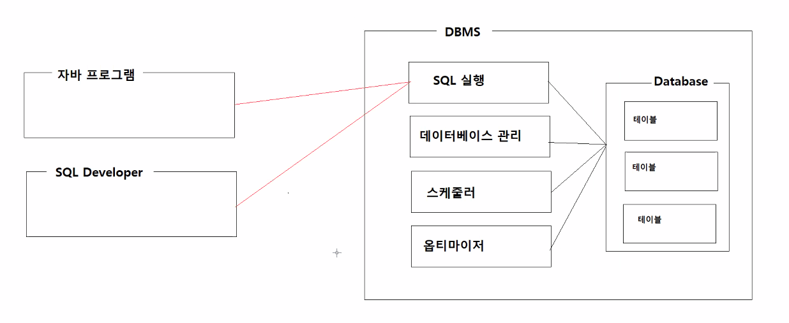
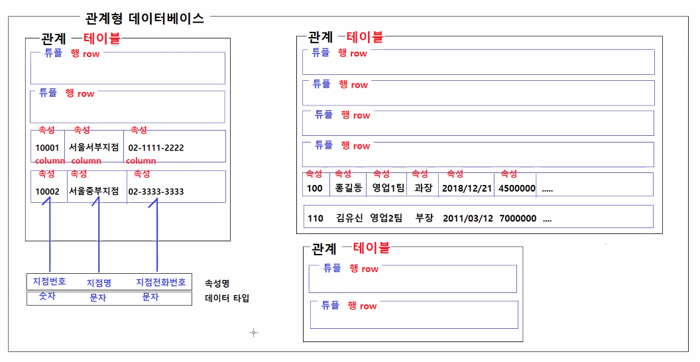
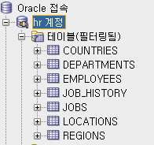
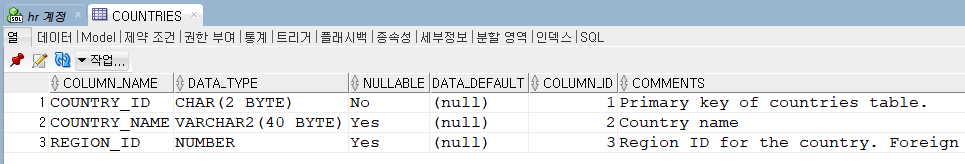
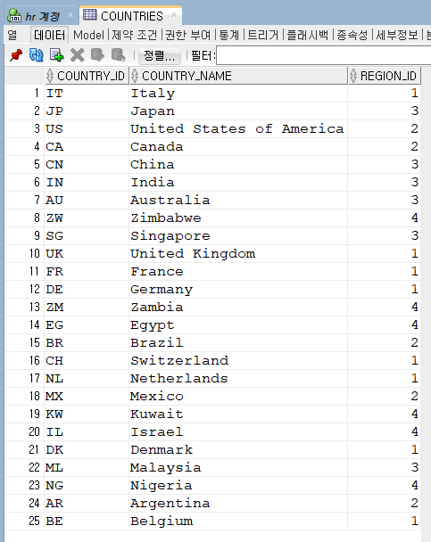
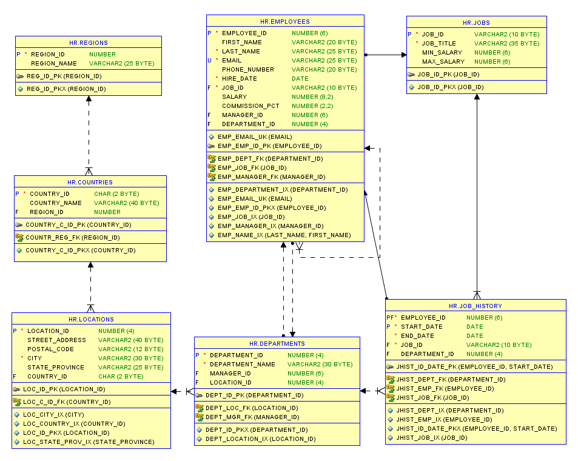
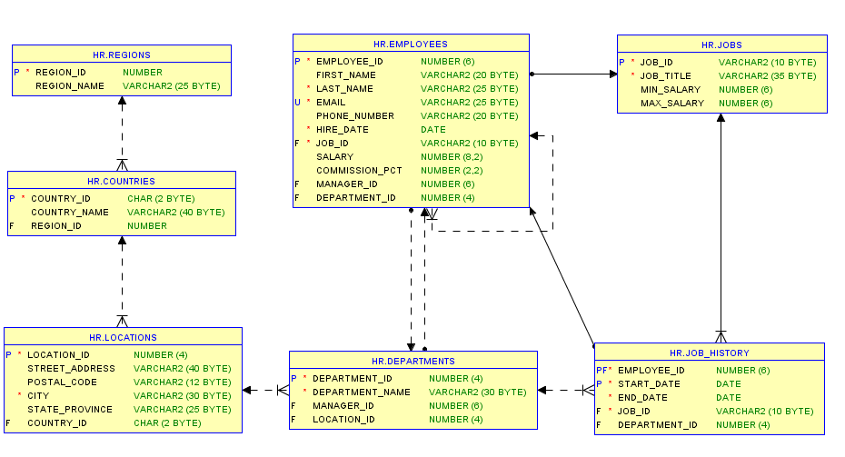
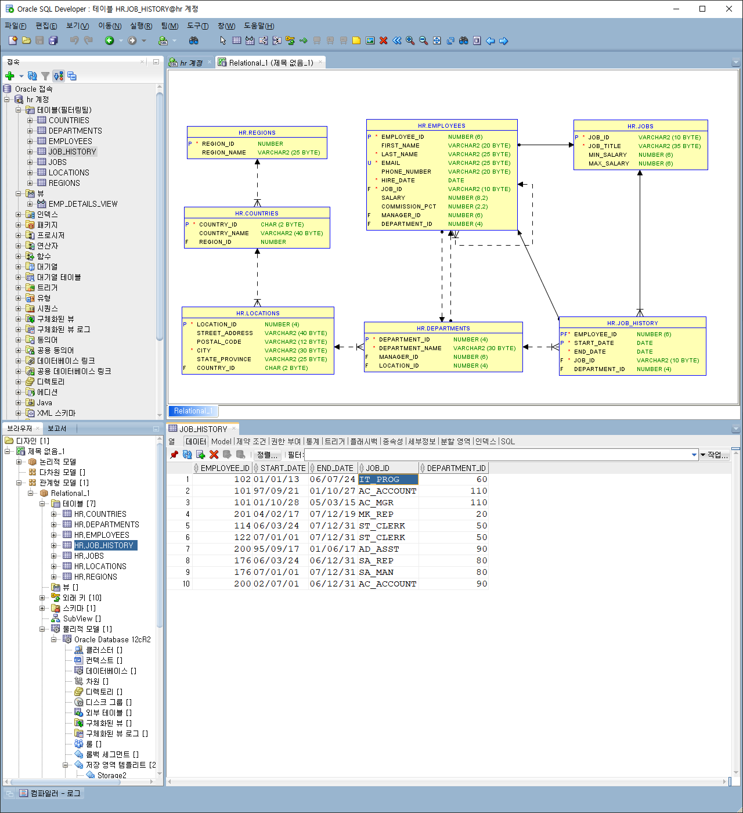
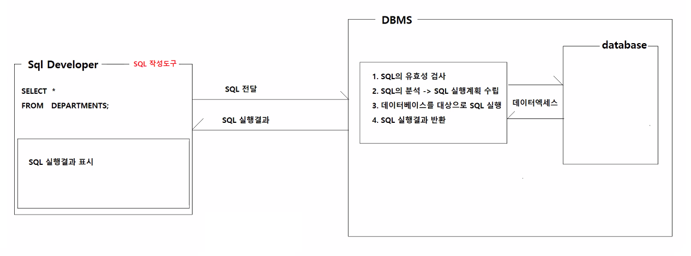

# 04/19

- [04/19](#0419)
- [데이터베이스](#데이터베이스)
  - [데이터 베이스 관리 시스템](#데이터-베이스-관리-시스템)
    - [대표적인 DBMS](#대표적인-dbms)
    - [DBMS의 장점](#dbms의-장점)
    - [NoSQL 데이터베이스](#nosql-데이터베이스)
  - [사용자 관점에서의 데이터베이스](#사용자-관점에서의-데이터베이스)
  - [관계형 데이터 모델](#관계형-데이터-모델)
  - [데이터베이스의 특징](#데이터베이스의-특징)
- [SQL](#sql)
  - [SQL의 종류](#sql의-종류)
  - [SQL문 실행해보기](#sql문-실행해보기)
    - [모델러](#모델러)
    - [SQL과 대소문자의 구분](#sql과-대소문자의-구분)
    - [DBMS별 SQL문 차이](#dbms별-sql문-차이)
  - [SELECT문](#select문)
    - [SELECT문 - 사칙연산](#select문---사칙연산)
    - [SELECT문 - 별칭](#select문---별칭)
    - [WHERE절](#where절)

<small><i><a href='http://ecotrust-canada.github.io/markdown-toc/'>Table of contents generated with markdown-toc</a></i></small>


# 데이터베이스
* 정보의 집합
* 관련있는 데이터를 모아 놓은 것
* 반드시 DBMS와 함께 한다.
## 데이터 베이스 관리 시스템
* 데이터베이스를 이용할 수 있게 해주는 시스템
* DBMS(DataBase Management System)
* 관계형 데이터베이스 RDB(Relational Database)를 관리해주는 RDBMS가 가장 많이 사용된다.
* 
* sql develper : 오라클 데이터베이스 무료 개발 툴, sql 작성도구
  * 학습, 실습에 사용할 것.
* 자바 프로그램이 sql developer의 역할을 수행하게 할 수 있다.
  * 자바를 이용한 database 엑세스 (최종목표)

### 대표적인 DBMS
* 오라클
* MySQL
* MS SQL Server
* DB2
* Maria DB
* H2
* HSQLDB
  * 위의 DBMS는 모두 관계형 데이터베이스다.
### DBMS의 장점
* 자료의 통합성 향상
* 데이터의 접근성 강화
* 데이터의 통제 강화
* 보안 강화
### NoSQL 데이터베이스
* 전통적인 관계형 데이터베이스 보다 덜 제한적인 일관성 모델을 이용
* 가장 널리 사용되는 네 가지 NoSQL 데이터베이스 유형
  * 키-값
    * 키-값은 해시 테이블을 사용하여 키와 값의 쌍을 저장합니다. 키는 알려졌지만 키 값은 알려지지 않은 경우에 키-값 유형이 가장 적합합니다.
  * 문서
    * 문서 데이터베이스는 문서 전체를 컬렉션이라 불리는 그룹으로 구성하여 키-값 데이터베이스의 개념을 확장합니다. 문서 데이터베이스는 중첩된 키-값 쌍을 지원하며, 문서 내에 있는 모든 속성에 대한 쿼리를 허용합니다.
  * 열 형식
    * 열 형식, 와이드 열 또는 열 패밀리 데이터베이스는 희소 데이터 행에 걸쳐 데이터와 쿼리를 효율적으로 저장하며 데이터베이스의 특정 열에 대한 쿼리 실행 시 이점을 제공합니다.
  * 그래프
    * 그래프 데이터베이스는 노드 및 에지 기반 모델을 바탕으로 상호 연결된 데이터(예: 소셜 네트워크를 사용하는 사용자들 간의 관계)를 표현하고 복잡한 관계를 간단하게 스토리지하고 살펴볼 수 있도록 지원합니다.
* "Not only SQL"로 불리기도 한다.
* NoSQL 데이터베이스는 행과 테이블을 사용하는 관계형(SQL) 데이터베이스보다 훨씬 다양한 방식으로 빠르게 바뀌는 대량의 비정형 데이터를 처리할 수 있다는 점을 강조하기 위해 “비관계형”, “NoSQL DB” 또는 “non-SQL”이라고도 한다.
* 클라우드, 모바일, 소셜 미디어와 빅 데이터로부터 생성되는 다양한 대규모 데이터를 처리해야 할 필요가 늘어남에 따라 그 인기가 급증하고 있다.
* > https://azure.microsoft.com/ko-kr/overview/nosql-database/

## 사용자 관점에서의 데이터베이스
* 데이터베이스에서 원하는 데이터를 가져올 때 **DBMS를 통해서 질의**하게 된다.
* 질의는 **SQL**이라는 언어를 사용한다.
* 데이터 베이스는 **구조화된 데이터**를 저장
* 관계형 데이터베이스에서는 **객체-관계 모델링(Entity-Relationship Modeling, ERD)**방법으로 데이터를 모델링한다.

## 관계형 데이터 모델
* 관계형 모델의 이론
  * 데이터베이스 : 관계의 집합
  * 관계 : 행의 집합
  * 행 : 속성의 집합
* 관계형 DB의 대치
  * 관계 : 테이블
  * 행 : 레코드
  * 속성 : 컬럼
* 관계라는 이름의 이유
  * 속성과 행이 어떠한 관계에 의해 모여진 집합으로 보기 때문
* 관계형 데이터 모델에서의 속성
  * 가질 수 있는 모든 값에 대한 도메인을 가지며, 원자적이어야 한다.
* 관계형 데이터베이스에는 *관계*의 집합과 *제약 조건*의 집합으로 이루어져 있다.
* 

## 데이터베이스의 특징
* 실시간 접근을 지원
* 다수의 사용자 혹은 프로그램이 동시에 데이터 이용
* 데이터 접근이 용이
* 내용으로 데이터를 탐색
* 항상 최신의 데이터 유지

# SQL
* Structured Query Language
* 구조화된 질의언어

## SQL의 종류
* DML: 데이터 조작 언어
* DDL: 데이터 정의 언어
* DCL: 데이터 제어 언어

```sql

```

## SQL문 실행해보기
* 공유받은 sql문 다운받아 sql문 실행
  1. HR_30.sql sql문 실행
  2. HR_30_DATA.sql sql문 실행
  * 테이블 생성이 완료되었다.  
  * 
  * countries테이블의 속성이 제대로 저장되었다. 
  * 
  * countries테이블의 데이터가 제대로 저장되었다. 
  * 

### 모델러
* ERD 설계도구
* 생산성을 높이고 데이터 모델링 작업을 단순화하는 무료 그래픽 도구입니다. Oracle SQL Developer Data Modeler를 사용하여 사용자는 논리적, 관계형, 물리적, 다차원 및 데이터 유형 모델을 생성, 검색 및 편집할 수 있습니다.
  > https://www.oracle.com/database/technologies/appdev/datamodeler.html
1. 모델러로 가시적으로 정보 확인하기.
   * 테이블간 연결관계, P키, F키 등의 정보를 확인할 수 있다.
   * 
   * 보기 > 브라우저 > Data Modeler > 관계형 모델 \[1\] > Relational_1
   * 테이블 끌어서 놓기 > 배치하기
2. 원하는 세부정보만 보이는 모델러
   * 세부정보보기'
   * 
   * 흰 바탕 마우스 우클릭
   * 세부정보보기 > 열, 데이터 유형 체크
   * 레이아웃 > 표시가능하도록 크기 조정



### SQL과 대소문자의 구분
  * 자바의 식별자는 대소문자를 구분하기 때문에
  * 두 단어 이상을 합쳐서 식별자를 만들 때 두번째 단어부터 첫글자를 대문자로 한다.
    * employeeId
    * lotteryTotalSale
  * SQL문은 대소문자를 구분하지 않는다.
    * SELECT * FROM JOBS;
    * select * from JobS;

### DBMS별 SQL문 차이
* MySQL은 FROM 생략가능
* 오라클은 WHRER 생략가능
* 이처럼 시스템별로 SQL문에서 키워드의 생략이 가능한 여부가 다를 수 있다.

## SELECT문
* 데이터를 조회한다.
* sql developer에 sql문을 입력하고 실행하면 DBMS에서 sql의 유효성을 검사하고 분석하고 실행해 결과를 반환해 준다.
  * 

* 형식
    ```sql
    SELECT *
    FROM 테이블명;

    SELECT 컬럼명, 컬럼명, 컬럼명
    FROM 테이블명;
    ```
    * \* 는 모든 컬럼을 의미한다.
    * 컬럼명과 테이블명을 명확히 알고 SQL문을 작성해야 에러가 발생하지 않는다.
    * `SELECT 컬럼명` -> SELECT 절
    * `FROM 테이블명` -> FROM 절

```SQL
-- SELECT
---- 테이블의 모든 데이터 조회할 때 사용하는 명령어다.
-------------------------------------------------------------------------------
-- 형식
---- SELECT *                     -- 모든 컬럼 조회
---- FROM 테이블명;

---- SELECT 컬럼명, 컬럼명, 컬럼명    -- 지정한 컬럼의 모든 행에 대한 값 조회
---- FROM 테이블명;
-------------------------------------------------------------------------------
-------------------------------------------------------------------------------
-- 직종테이블(JOBS)의 모든 행과 모든 컬럼 조회하기
SELECT *
FROM JOBS;

-- 부서테이블(DEPARTMENTS)의 모든 행과 모든 컬럼 조회하기
SELECT *
FROM DEPARTMENTS;

-- 소재지테이블(LOCATIONS)의 모든 행과 모든 컬럼 조회하기
SELECT *
FROM LOCATIONS;

-- 사원테이블(EMPOYEES)에서 모든 행의 사원아이디, 사원이름(FIRST_NAME), 직종아이디, 급여를 조회하기
SELECT EMPLOYEE_ID, FIRST_NAME, JOB_ID, SALARY      -- 각 컬럼명은 ,로 구분하고, 맨 마지막 컬럼 뒤에는 ,를 생략한다.
FROM EMPLOYEES;

-- 직종테이블(JOBS)에서 모든 행의 직종아이디, 직종최저급여, 직종최고급여를 조회하기
SELECT JOB_ID, MIN_SALARY, MAX_SALARY
FroM JOBS;

-- 소재지테이블(LOCATIONS)에서 모든 행의 소재지아이디, 주소, 도시명을 조회하기
SELECT LOCATION_ID, STREET_ADDRESS, CITY
FROM LOCATIONS;

-- 부서테이블(DEPARTMENTS)에서 모든 행의 부서아이디, 부서이름을 조회하기
SELECT DEPARTMENT_ID, DEPARTMENT_NAME
FROM DEPARTMENTS;
```

### SELECT문 - 사칙연산
* SELECT문에서 사칙연산을 수행한 값들을 가져올 수 있다.
* 사칙연산에 사용되는 컬럼은 NUMBER타입이어야 한다.(예외존재)
* 사칙연산은 조회된 모든 행에 대해 수행된다.
```SQL
-- SELECT 절에서 사칙연산 수행하기
---- 사칙연산에 사용되는 컬럼은 데이터 타입이 NUMBER타입이어야 한다.
---- 사칙연산은 조회된 모든 행에 대해서 수행된다.
-------------------------------------------------------------------------------
-- 형식
---- SELECT 컬럼+컬럼, 컬럼-컬럼, 컬럼*컬럼, 컬럼/컬럼
---- FROM 테이블명;

---- SELECT 컬럼+숫자, 컬럼-숫자, 컬럼+숫자, 컬럼/숫자
---- FROM 테이블명;
-------------------------------------------------------------------------------
-- 직종테이블에서 모든 행의 직종아이디, 직종최고급여, 직종최저급여
SELECT JOB_ID, MAX_SALARY, MIN_SALARY, MAX_SALARYM - MIN_SALARY
FROM JOBS;

-- 사원테이블에서 모든 행의 사원아이디, 이름, 급여, 연봉을 조회하기
-- 연봉은 급여*12한 값
SELECT EMPLOYEE_ID, FIRST_NAME, SALARY, SALARY*12
FROM EMPLOYEES;

-- 사원테이블에서 모든 행의 사원아이디, 이름, 급여, 10% 인상된 급여 조회하기
SELECT EMPLOYEE_ID, FIRST_NAME, SALARY, SALARY + SALARY*0.1
FROM EMPLOYEES;
```

### SELECT문 - 별칭
* 보여지는 컬럼이름을 별칭으로 바꿔 조회할 수 있다.
  * AS 사용
  * 한칸 띄어쓰기
* 계산식 뿐만 아니라 조회된 컬럼의 별칭을 각각 지정할 수 있다.
```SQL
-- SELECT 절의 컬럼명에 별칭 붙이기
---- * 별칭은 컬럼명을 의미있는 이름으로 표현할 때 사용하자.
---- * 복잡한 연산식을 별칭으로 표현하자.
-------------------------------------------------------------------------------
-- 형식
---- SELECT 컬럼 AS 별칭, 컬럼명 AS 별칭
---- FROM 테이블명;

---- SELECT 컬럼+숫자 AS 별칭, 컬럼/숫자 AS 별칭
---- FROM 테이블명;
-------------------------------------------------------------------------------
-- 직종테이블에서 모든 행의 직종아이디, 직종최고급여, 직종최저급여, 직종최고급여-직종최저급여를 조회하기
-- 별칭은 SALARY_GAP
SELECT JOB_ID, MAX_SALARY, MIN_SALARY, MAX_SALARYM - MIN_SALARY AS SALARY_GAP
FROM JOBS;

-- 사원테이블에서 모든 행의 사원아이디, 이름, 급여, 연봉을 조회하기
-- 연봉은 급여*12한 값, 별칭은 ANNUAL_SALARY
SELECT EMPLOYEE_ID, FIRST_NAME, SALARY, SALARY*12 AS ANNUAL_SALARY
FROM EMPLOYEES;

-- 사원테이블에서 모든 행의 사원아이디, 이름, 급여, 10% 인상된 급여 조회하기
-- 별칭은 INCREASED_SALARY
SELECT EMPLOYEE_ID ID, FIRST_NAME NAME, SALARY SAL, SALARY + SALARY*0.1 INCREASED_SALARY
FROM EMPLOYEES;
```

### WHERE절
* 조건 연산자를 사용해 조건식이 TRUE인 행(속성)만 조회한다. (조회되는 행의 개수를 제한한다.)
  * 조건연산자 : `>`, `>=`, `<`, `<=`, `=`, `!=` (`<>` : 오라클 한정), `IN`, `LIKE`
  * `AND`, `OR`을 사용해 2개 이상의 조건식을 판정조건으로 사용 가능하다. 
* 조건절에서 '' 홑따옴표를 사용해 문자열, 문자의 일치 여부를 판정한다.
  * 조건절에서 사용하는 문자열 데이터값은 대소문자를 지켜야 한다.(정확히 일치해야 한다.)(문법오류는 아니지만 결과값이 나오지 않는다.)
  * 홑따옴표를 사용하지 않거나 쌍따옴표를 사용하면 문법 오류가 발생한다.
  * 비교연산자는 =로 ==를 사용하면 문법 오류가 발생한다.
* OR와 AND를 같이 사용할 경우 ()괄호를 사용한다.
* OR과 =을 같이 사용할 경우 IN을 사용가능하다.
```SQL
-- WHERE절을 이용해서 조회되는 행을 제한하기
---- WHERE절의 조건식이 TRUE로 판정되는 행만 조회된다.
---- 조건식의 연산자는 >, >=, <, <=, =, !=, IN, LIKE 등이 있다. 
---- (오라클 한정 - 같지 않다 : <>도 쓴다.)
---- AND, OR을 사용하면 2개 이상의 조건식을 판정조건으로 사용할 수 있다.
---- 사용예) 평균점수가 90점 이상인 학생정보 조회
----        급여를 10000이상 받는 직원정보 조회
----        이번달에 입사한 사원정보 조회
----        평균점수가 90점 이상이고 국어점수가 100점인 학생정보 조회 <- 2개의 조건식이 사용됨
----        급여를 10000이상 받고 직종이 IT_PROG인 사원정보 조회 <- 2개의 조건식이 사용됨
----        2022년 1월과 2월달에 입사한 사원정보 조회 <- 2개의 조건식이 사용됨
-------------------------------------------------------------------------------
-- 형식
---- SELECT * 
---- FROM 테이블명
---- WHERE 조건식;

---- SELECT *
---- FROM 테이블명;
---- WHERE 조건식 AND 조건식;
-------------------------------------------------------------------------------
-- 직원 테이블에서 급여를 15000이상 받는 직원의 아이디, 이름, 직종아이디, 급여 조회하기
SELECT EMPLOYEE_ID, FIRST_NAME, JOB_ID, SALARY
FROM EMPLOYEES
WHERE SALARY >= 15000;

-- 직원 테이블에서 직종아이디가 IT_PROG인 직원의 아이디, 이름, 입사일을 조회하기
SELECT EMPLOYEE_ID, FIRST_NAME, HIRE_DATE
FROM EMPLOYEES
WHERE JOB_ID = 'IT_PROG';
-- 잘못된 조건식
---- WHERE JOB_ID = IT_PROG;    JOB_ID컬럼의 값과 ID_PROG컬럼의 값이 같은 행을 조회하는 조건식
----                            문법오류, EMPLOYEES테이블에 IT_PROG컬럼은 존재하지 않는다.
---- WHERE JOB_ID = "IT_PROG";  문자데이터는 'IT_PROG'로 적어야 한다.
----                            문법오류
---- WHERE JOB_ID = 'it_prog';  JOB_ID컬럼의 값이 'it_prog'인 행을 조회하는 조건식이다.
----                            EMPLOYEES 테이블에는 JOB_ID컬럼의 값이 'it_prog'인 행은 존재하지 않는다.
----                            문법오류는 아니지만 조회결과가 존재하지 않는다.
---- WHERE JOB_ID == 'IT_PROG'; 오라클에서 equal 비교연산자는 =이다.
----                            문법오류

-- 직원테이블에서 급여를 10000이상 받고, 소속부서아이디가 80인 직원의 직원아이디, 이름, 급여를 조회하기
SELECT EMPLOYEE_ID, FIRST_NAME, SALARY
FROM EMPLOYEES
WHERE SALARY >= 10000 AND DEPARTMENT_ID = 80; -- '80'으로 적으면 묵시적 형변환으로 값이 조회된다.
                                              -- 숫자<->문자, 날짜<->문자 묵시적 형변환이 가능하다.

-- 직원테이블에서 60번 부서에서 근무하는 직원과 90번 부서에서 근무하는 직원의 아이디, 이름, 직종아이디를 조회하기
SELECT EMPLOYEE_ID, FIRST_NAME, JOB_ID, DEPARTMENT_ID
FROM EMPLOYEES
WHERE DEPARTMENT_ID = 60 OR DEPARTMENT_ID = 90;
---- IN키워드 사용하기(=equal 연산에 OR를 사용할 경우 IN 사용가능)
SELECT EMPLOYEE_ID, FIRST_NAME, JOB_ID, DEPARTMENT_ID
FROM EMPLOYEES
WHERE DEPARTMENT_ID IN (60, 90);

-- 직원테이블에서 급여를 10000이상 15000이하로 받는 직원의 아이디, 이름, 급여를 조회하기
SELECT EMPLOYEE_ID, FIRST_NAME, JOB_ID, SALARY
FROM EMPLOYEES
WHERE SALARY >= 10000 AND SALARY <= 15000;

-- 직원테이블에서 80번 부서에서 근무하는 직원과 50번 부서에서 근무하는 직원 중에서 급여를 7000이하로 받는 사원 조회하기
SELECT EMPLOYEE_ID, FIRST_NAME, DEPARTMENT_ID, SALARY
FROM EMPLOYEES
WHERE (DEPARTMENT_ID = 80 OR DEPARTMENT_ID = 50) AND SALARY <= 7000;
-- AND, OR를 같이 사용할 때는 OR연산자 부분을 ()괄호로 감싸야 한다.
-- WHERE DEPARTMENT_ID = 80 OR DEPARTMENT_ID = 50 AND SALARY <= 7000;
-- ()괄호를 사용하지 않으면 80번 부서 직원이 전부 조회된 후 50번 부서 직원들중 7000이하의 급여를 받는 직원들이 나온다.
---- IN 사용하기
SELECT EMPLOYEE_ID, FIRST_NAME, DEPARTMENT_ID, SALARY
FROM EMPLOYEES
WHERE DEPARTMENT_ID IN (80, 50) AND SALARY <= 7000;
```