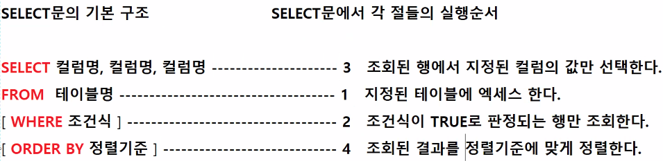
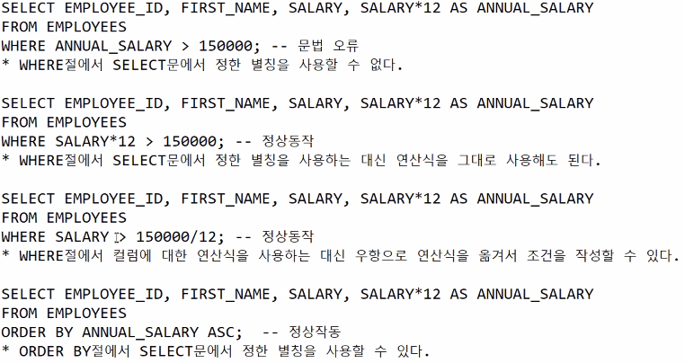
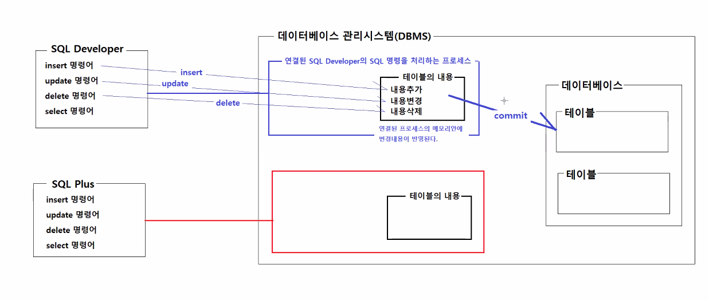

# 0420

- [0420](#0420)
- [SELECT](#select)
  - [IN, LIKE](#in-like)
  - [NULL, NOT NULL](#null-not-null)
  - [ORDER BY](#order-by)
    - [실행순서](#실행순서)
  - [DISTINCT](#distinct)
- [CREATE](#create)
  - [INSERT](#insert)
- [UPDATE](#update)
- [DELETE](#delete)
  - [COMMIT](#commit)
    - [COMMIT과 ROLLBACK](#commit과-rollback)
- [실습](#실습)

<small><i><a href='http://ecotrust-canada.github.io/markdown-toc/'>Table of contents generated with markdown-toc</a></i></small>


# SELECT
## IN, LIKE
```SQL
-- WHERE절의 조건식에서 IN, LIKE 사용하기
-- WHERE 컬럼명 IN (값1, 값2, 값3, ...)
-- * 지정된 컬럼의 값이 값1 혹은 값2 혹은 값3 중의 하나와 일치하면 TRUE로 판정한다.
-- * WHERE 컬럼명 = 값1 OR 컬럼명 = 값2 OR 컬럼명 = 값3; 과 연산결과가 같다.

-- WHERE 컬럼명 LIKE '패턴'
-- * 지정된 컬럼의 값이 패턴과 일치하면 TRUE로 판정한다.
-- * 패턴 기호
--          % : ALL
--                WHERE BOOK_TITLE LIKE '자바%';    책 제목이 '자바', '자바11', '자바 공부하기' ...
--                WHERE BOOK_TITME LIKE '%자바%';   책 제목이 '자바', '혼자서 공부하는 자바', '자바의정석', '이것이 자바다' ...
--          _ : ANY ONE
--                WHERE USER_NAME LIKE '이_';       사용자명이 '이이', '이상', '이' (외자 이씨)
-------------------------------------------------------------------------------------------------------------------------------
-- 직원중에서 60번 부서와 90번 부서에서 근무중인 사원의 아이디, 이름, 직종아이디를 조회하기
SELECT EMPLOYEE_ID, FIRST_NAME, JOB_ID
FROM EMPLOYEES
WHERE DEPARTMENT_ID IN (60, 90);

-- 부서 소재지의 국가아이디가 'US', 'JP'인 곳은 소재지 아이디, 주소, 도시명을 조회하기
SELECT LOCATION_ID, STREET_ADDRESS, CITY, COUNTRY_ID
FROM LOCATIONS
WHERE COUNTRY_ID IN ('US', 'JP');

-- 직원중에서 'US', 'FR'인 곳은 소재지 아이디, 주소, 도시명을 조회하기
SELECT LOCATION_ID, STREET_ADDRESS, CITY, COUNTRY_ID
FROM EMPLOYEES, LOCATIONS
WHERE COUNTRY_ID IN ('US', 'FR');

-- 직원중에서 50번 부서와 80번 부서에서 근무중이며 급여를 5000이상 10000이하로 받은 사원의 아이디, 이름, 급여, 부서아이디를 조회하기
SELECT EMPLOYEE_ID, FIRST_NAME, SALARY, DEPARTMENT_ID
FROM EMPLOYEES
WHERE DEPARTMENT_ID IN (50, 80)
      AND SALARY >= 5000 AND SALARY <= 10000;

-- 직원들이 맡고 있는 직종 아이디가 'FI'로 시작하는 사원의 아이디, 이름, 직종아이디를 조회하기 
SELECT EMPLOYEE_ID, FIRST_NAME, JOB_ID
FROM EMPLOYEES
WHERE JOB_ID = 'FI%';

-- 직원들 이름 중에서 영문자 'e'가 포함된 직원의 이름을 조회하기 '***e', 'e***', '**e****'
SELECT FIRST_NAME
FROM EMPLOYEES
WHERE FIRST_NAME LIKE '%e%';

-- 직원들 이름 중에서 영문자 'e'가 이름의 중간에 포함된 직원의 이름 조회하기 '***e*'
SELECT FIRST_NAME
FROM EMPLOYEES
WHERE FIRST_NAME LIKE '%_e_%';
```

## NULL, NOT NULL

```SQL
-- WHERE절의 조건에서 컬럼의 값이 NULL이거나 NULL 아닌 값 조회하기
-- * 특정 컬럼의 값이 NULL이라는 것은 "그 컬럼의 값이 아직 결졍되지 않았다"라는 의미다.
-- * 컬럼의 값이 NULL일 때는 비교(> >= < <= = !=)의 연산을 수행할 수 없다.
-- * 컬럼의 값이 NULL일 때는 그 컬럼의 값과 사칙연산(+ - * /)을 수행하면 그 결과는 무조건 NULL이다.

-- WHERE 컬럼 IS NULL;        해당 컬럼의 값이 NULL일 때 TRUE로 판정한다.
-- WHERE 컬럼 IS NOT NULL;    해당 컬럼의 값이 NULL이 아닐 때 TRUE로 판정한다.

-------------------------------------------------------------------------------------------------------------------------------
-- 부서테이블에서 MANAGER_ID가 NULL인 부서의 부서아이디, 부서명 조회하기
SELECT DEPARTMENT_ID, DEPARTMENT_NAME
FROM DEPARTMENTS
WHERE MANAGER_ID IS NULL;

-- 부서테이블에서 관리자가 지정된 부서의 부서아이디, 부서명, 관리자 아이디를 조회하기
SELECT DEPARTMENT_ID, DEPARTMENT_NAME, MANAGER_ID
FROM DEPARTMENTS
WHERE MANAGER_ID IS NOT NULL;

-- 사원테이블에서 소속부서가 아직 결졍되지 않은 사원의 아이디, 이름, 직종아이디를 조회하기
SELECT EMPLOYEE_ID, FIRST_NAME, JOB_ID
FROM EMPLOYEES
WHERE DEPARTMENT_ID IS NULL;
```

## ORDER BY

```SQL
-- 조회된 행을 정렬하기
-- ORDER BY절을 사용해서 조회된 행을 정렬할 수 있다.
-- SELECT 컬럼명, 컬럼명, 컬럼명
-- FROM
-- WHERE 조건식
-- ORDER BY 정렬기준, 정렬기준;
--
-- * ORDER BY 절은 SELECT문의 맨 끝에 위치해야 한다.
-- * ORDER BY 절에서는 SELECT문에서 지정한 별칭을 사용할 수 있다.
-- * WHERE 절에서는 SELECT문에서 지정한 별칭을 사용할 수 없다.
-- * ORDER BY 절에서는 컬럼명 대신 컬럼 순서를 나타내는 숫자를 사용해서 정렬할 수 있다.
--      SELECT ID, NAME, PRICE
--      FROM PRODUCTS
--      ORDER BY 3 DESC;      SELECT 문의 3번째 컬럼인 PRICE가 정렬기준이 된다.

-- ORDER BY 컬럼명             지정된 컬럼을 오름차순으로 정렬
-- ORDER BY 컬럼명 ASC         지정된 컬럼을 오름차순으로 정렬
-- ORDER BY 컬럼명 DESC        지정된 컬럼을 내림차순으로 정렬
-- ORDER BY 절에서는 컬럼명 대신 컬럼 순서를 나타내는 숫자를 사용해서 정렬할 수 있다.
--      SELECT ID, NAME, PRICE
--      FROM PRODUCTS
--      ORDER BY 3 DESC;    SELECT문의 3번째컬럼인 PRICE가 정렬기준이 된다.

-- * 정렬대상 컬럼에 NULL이 포함되어 있을 경우 오름차순 정렬일 때는 맨 마지막에, 내림차순 정렬일 때는 맨 처음에 조회된다.
-------------------------------------------------------------------------------------------------------------------------------

-- 80번 부서에서 일하는 사원들 중에서 급여를 5000이상 10000이하로 받는 사원들의 아이디, 이름, 직종아이디, 급여를 조회하기
-- 조회된 결과는 급여에 대한 오름차순으로 정렬하기
SELECT EMPLOYEE_ID, FIRST_NAME, JOB_ID, SALARY
FROM EMPLOYEES
WHERE DEPARTMENT_ID = 80
ORDER BY SALARY;

-- 모든 사원들에 대해서 부서아이디로 오름차순 정렬하기, 사원아이디, 사원이름, 부서아이디를 조회한다.
SELECT EMPLOYEE_ID, FIRST_NAME, DEPARTMENT_ID
FROM EMPLOYEES
ORDER BY DEPARTMENT_ID DESC;

-- 50번부서와 80번 부서에 소속된 사원들의 부서아이디, 급여, 이름을 조회하기
-- 부서아이디를 기준으로 오름차순으로 정렬하고, 부서아이디가 동일한 경우 급여 기준으로 내림차순으로 정렬한다.
SELECT DEPARTMENT_ID, SALARY, FIRST_NAME
FROM EMPLOYEES
WHERE DEPARTMENT_ID IN (50, 80)
ORDER BY DEPARTMENT_ID ASC, SALARY DESC;
```

### 실행순서
  
* 실행순서 : FROM > WHERE > ORDER BY > SELECT


* SELECT문의 실행순서로 인해 SELECT문에서 정한 별칭은 WHERE절에서 사용할 수 없다.
* ORDER BY절에서는 SELECT문에서 정한 별칭을 사용할 수 있다.
* 연산식의 위치를 SELECT문에서 WHERE절로 옳길 수 있다.
  * 등식의 성질을 이용하여 등식의 한 변에 있는 항의 부호를 전환해서 연산식을 우항으로 이항할 수 있다.

## DISTINCT
```SQL
-- DISTINCT 키워드를 사용해서 중복된 행을 제거하기
-- SELECT DISTINCT 컬럼명, 컬럼명
-- FROM 테이블명;

-- * DISTINCT 키워드는 SELECT문에서 나열한 모든 컬럼의 값이 서로 같은 중복행을 한번만 선택한다.

-------------------------------------------------------------------------------------------------------------------------------

-- 직원들은 다양한 직종에서 일하고 있다. 직원들이 종사하고 있는 직종아이디를 중복없이 조회하기
SELECT DISTICT JOB_ID, DEPARTMENT_ID
FROM EMPLOYEE;

-- 부서 소재지 정보를 참고해서 부서가 위치한 나라의 아이디를 중복없이 조회하기
SELECT DISTINCT COUNTRY_ID
FROM LOCATIONS;
```


# CREATE
```SQL
-- 테이블 생성하기
-- CREATE TABLE 명령어로 테이블을 생성한다.
-- CREATE TABLE 테이블명 {
--    컬럼명 데이터타입(사이즈),                 : NULL값이 허용되는 속성
--    컬럼명 데이터타입(사이즈) NOT NULL,        : NULL값이 허용되지 않는 속성
--    컬럼명 데이터타입(사이즈) DEFAULT 기본값    : DEFAULT는 속성의 기본값을 지정한다.
--                                                행을 추가할 때 값을 지정하지 않으면 지정된 기본값이 해당 컬럼의 값이 된다.
--                                                행을 추가할 때 값을 지정하면 그 값이 컬럼의 값이 된다.
--    컬럼명 데이터타입(사이즈) 제약조건          : 컬럼에 제약조건을 지정한다. 제약조건에 위배되는 값은 저장되지 않는다.
--    컬럼명 데이터타입(사이즈) CONSTRAINT 제약조건별칭 제약조건 : 컬럼에 제약조건과 제약조건 별칭을 지정한다.
--                                                               제약조건 별칭을 지정해두면 추가/변경/삭제 작업시 오류가 발생하면
--                                                               오류 메세지에 위배된 제약조건의 별칭이 표시되기 때문에 
--                                                               오류 원인을 쉽게 파악할 수 있다.
--                                                               제약조건별칭 = 테이블명_컬럼명_제약조건
-----------------------------------------------------------------------------------------------------------------------

-- 샘플 테이블 생성하기
CREATE TABLE SAMPLE_PRODUCTS (
    PRODUCT_NO              NUMBER(6)       CONSTRAINT SAMPLE_PRODUCTS_NO_PK PRIMARY KEY,
    PRODUCT_NAME            VARCHAR2(255)   NOT NULL,
    PRODUCT_COMPANY         VARCHAR2(255)   NOT NULL,
    PRODUCT_PRICE           NUMBER(10)      NOT NULL,
    PRODUCT_DISCOUNT_PRICE  NUMBER(10),
    PRODUCT_STOCK           NUMBER(6)       NOT NULL,
    PRODUCT_STATUS          VARCHAR2(100)   DEFAULT '판매중',
    PRODUCT_CREATED_DATE    DATE            DEFAULT SYSDATE
);
-- * DATE 타입은 사이즈를 지정할 필요가 없다.
-- * SYSDATE는 오라클의 내장함수다.
-- * SYSDATE는 시스템의 현재 날짜와 시간정보를 제공하는 내장함수다.
```

## INSERT
```SQL
-- 일련번호를 발행하는 시퀀스 객체 생성하기
-- CREATE SEQUENCE 시퀀스명;

--   CREATE SEQUENCE 시퀀스명;
--   INCREMENT BY 1        : 일련번호를 발행할 때마다 1씩 증가시킨다. 기본값은 1
--   START WITH 1001`      : 일련번호의 시작값을 1001로 한다. 기본값은 1이다.
--   NOCACHE;              : 일련번호를 미리 생성해 두지 않게 한다. 기본값은 CACHE20 이다.

-- 시퀀스객체의 내장함수
--      NEXTVAL : 시퀀스에서 새로운 일련번호를 발행받는다.
--      CURRVAL : 시퀀스에서 현재 일련번호를 조회한다. 현재 세션에서 CURRVAL은 반드시 NEXTVAL이 실행된 후에만 사용할 수 있다.

-- INSERT문에서 시퀀스의 일련번호를 발행받아서 저장하기
-- INSERT INTO SAMPLE_PRODUCTS (PRODUCT_NO, PRODUCT_NAME, ... )
-- VALUES (PRODUCTS_SEQ.NEXTVAL, '애플워치 7')

-----------------------------------------------------------------------------------------------------------------------
-- 테이블에 새로운 행 추가하기
-- INSERT INTO ~ VALUES 명령어를 사용해서 테이블에 새로운 행을 추가할 수 있다.

-- 행의 모든 컬럼에 값을 지정해서 새로운 행을 추가하기
-- INSERT INTO 테이블명 (컬럼명, 컬럼명, 컬럼명, 컬럼명 ,컬럼명, ..., 컬럼명)
-- VALUES               (값,    값,     값,     값,     값,    ..., 값);

-- 행의 모든 컬럼에 값을 지정해서 새로운 행을 추가하기
-- * VALUES 절에서 지정하는 값의 순서가 테이블의 컬럼순서와 일치하고, 모든 컬럼에 빠짐없이 값을 지정하는 경우 
--   INSERT INTO 절에서 컬럼명을 생략할 수 있다.(유지보수를 위해 생략하지 않는다.)
-- INSERT INTO 테이블명
-- VALUES (값, 값, 값, 값, 값, ..., 값);

-- 행의 특정 컬럼에만 값을 지정해서 새로운 행을 추가하기
-- * 제외된 컬럼은 DEFAULT값이 지정되어 있으면 그 값이 컬럼에 저장된다. DEFAULT값이 지정되어 있지 않으면 자동으로 NULL이 된다.
-- * 행의 특정 컬럼에만 값을 지정해서 새로운 행을 추가할 때는 INSERT INTO 절에서 컬럼명을 생략할 수 없다.
-- INSERT INTO 테이블명 (컬럼명, 컬럼명, 컬럼명)
-- VALUES               (값,    값,     값)
-- * 위에서 제시한 컬럼 3개를 제외한 나머지 컬럼들은 NULL이나 해당 컬럼의 DEFAULT값이 저장된다.

-----------------------------------------------------------------------------------------------------------------------

-- SAMPLE_PRODUCTS 테이블에 새 상품정보 저장하기
INSERT INTO SAMPLE_PRODUCTS
(PRODUCT_NO, PRODUCT_NAME, PRODUCT_COMPANY, PRODUCT_PRICE, PRODUCT_DISCOUNT_PRICE, PRODUCT_STOCK)
VALUES
(1000, '애플워치 SE', '애플', 350000, NULL, 10);

-- 상품정보로 사용할 일련번호를 발행해주는 시퀀스 객체 생성하기
CREATE SEQUENCE PRODUCTS_SEQ
INCREMENT BY 1 START WITH 1001 NOCACHE;

-- 시퀀스에서 발행받은 일련번호로 상품번호를 지정하고, 새 상품정보 저장하기
INSERT INTO SAMPLE_PRODUCTS
(PRODUCT_NO, PRODUCT_NAME, PRODUCT_COMPANY, PRODUCT_PRICE, PRODUCT_STOCK)
VALUES
(PRODUCTS_SEQ.NEXTVAL, '갤럭시 S22', '삼성전자', 1500000, 5);

-- NOT NULL 제약조건이 지정된 컬럼의 값을 누락시키고 새 상품정보를 저장하기
INSERT INTO SAMPLE_PRODUCTS
(PRODUCT_NO, PRODUCT_NAME, PRODUCT_COMPANY, PRODUCT_PRICE, PRODUCT_STOCK)
VALUES
(PRODUCTS_SEQ.NEXTVAL, '갤럭시 S22', '삼성전자', 1500000); -- 오류 '값의 수가 충분하지 않습니다'

-----------------------------------------------------------------------------------------------------------------------
-- 테이블에 새로운 행을 추가할 때 체크할 내용
-- 1. 컬럼명
-- 2. 데이터타입과 크기
-- 3. NOT NULL 허용여부, NULL이 허용되지 않는 컬럼은 반드시 값을 지정해야 한다.
-- 4. 컬럼별 제약조건
-- 5. INSERT문 작성시 컬럼명을 반드시 작성하자.
-- 6. 컬럼개수와 값의 개수가 일치하는지 체크
-- 7. NULL 허용하지 않는 컬럼이 누락되었는지 체크
-- 8. PRIMARY KEY로 설정된 컬럼의 값으로 사용되는 시퀀스가 있는지 체크
-----------------------------------------------------------------------------------------------------------------------
```

# UPDATE

```SQL

-- 데이터 변경하기
-- UPDATE 명령어로 데이터를 변경하기

-- WHERE절이 없으면 테이블의 모든 행에서 지정된 컬럼의 값을 새로운 값으로 변경한다.
-- * WHERE절 없는 UPDATE문을 실행할 경우는 거의 없다.
-- UPDATE 테이블명
-- SET
-- 컬럼명 = 값;
-- 컬럼명 = 값;
-- 컬럼명 = 값;

-- WHERE절이 있으면 조건식이 TREU로 판정되는 행에서만 지정된 컬럼의 값을 새로운 값으로 변경한다.
-- UPDATE 테이블명
-- SET
-- 컬럼명 = 값,
-- 컬럼명 = 값,
-- 컬럼명 = 값
-- WHERE 조건식;
-----------------------------------------------------------------------------------------------------------------------

-- SAMPLE_PRODUCTS 테이블의 모든 상품 재고를 100개로 변경하기
UPDATE SAMPLE_PRODUCTS
SET
    PRODUCT_STOCK = 100;

-- SAMPLE_PRODUCTS 테이블의 모든 상품 재고를 10개로 변경하고, 상품의 할인가격을 상품가격에서 15% 할인된 가격으로 변경하기
UPDATE SAMPLE_PRODUCTS
SET
    PRODUCT_STOCK = 100,
    PRODUCT_DISCOUNT_PRICE = PRODUCT_PRICE * 0.85;

-- '삼성전자'에서 제조한 상품의 재고량을 5개로 변경하기
UPDATE SAMPLE_PRODUCTS
SET
    PRODUCT_STOCK = 5
WHERE PRODUCT_COMPANY = '삼성전자';

-- 1031번 상품의 상품명과 가격, 할인가격, 재고량을 변경하기
-- 상품명: '갤럭시 S22 Ultra', 가격: 1900000, 할인가격: 1700000, 재고량: 20
UPDATE SAMPLE_PRODUCTS
SET
    PRODUCT_NAME = '갤럭시 S22',
    PRODUCT_PRICE = 1500000,
    PRODUCT_DISCOUNT_PRICE = 1500000,
    PRODUCT_STOCK = 5
WHERE PRODUCT_NO = 1032;

```

# DELETE
```SQL

-- 데이터 삭제하기
-- DELETE 명령어로 데이터 삭제하기

-- 테이블에 저장된 모든 행 삭제하기
-- * WHERE절 없이 DELETE문을 실행하면 테이블의 모든 행이 삭제되기 때문에 WHERE절 없이 사용되는 경우는 드물다.
-- DELETE FROM 테이블명;

-- WHERE절의 조건식이 TRUE로 판정되는 행만 삭제하기
-- DELETE FROM 테이블명
-- WHERE 조건식;

-----------------------------------------------------------------------------------------------------------------------
-----------------------------------------------------------------------------------------------------------------------
-- INSERT, UPDATE, DELETE는 제약조건에 위배되는 명령문은 처리되지 않는다.
DELETE FROM DEPARTMENTS
WHERE DEPARTMENT_ID = 10; -- 문법적으로는 맞지만 EMPLOYEE 중 10번 부서가 있으므로 삭제되지 않는다.

UPDATE EMPLOYEES
SET
    DEPARTMENT_10 = 1000
WHERE EMPLOYEE_10 = 10; -- 제약조건 위반으로 실행 X
-----------------------------------------------------------------------------------------------------------------------
-----------------------------------------------------------------------------------------------------------------------

-- 상품명이 '갤럭시 S22' 이고, 상품번호가 1032번이 아닌 상품 삭제하기
DELETE FROM SAMPLE_PRODUCTS
WHERE PRODUCT_NAME = '갤럭시 S22'
AND PRODUCT_NO != 1032;

```

## COMMIT
```SQL

-- COMMIT을 실행해서 작업내용을 데이터베이스에 반영시킨다.
COMMIT;
```

### COMMIT과 ROLLBACK
* COMMIT과 ROLLBACK으로 트랜잭션 처리하기
  * 트랜잭션은 여러 개의 작업을 하나의 논리적인 작업으로 묶는다.
  * commit과 rollback은 데이터베이스 변경작업에서 부분적인 성공을 허용하지 않는다.
  * 언제나 All or Nothing 두 가지 경우만 존재한다.
* A가 B에게 100만원 이체하기
  ```java
  try {
      A -100만원
      B +100만원
      A, B 거래내역 저장
      // 아래의 commit은 위의 작업이 오류없이 전부 완료된 경우만 실행된다.
      commit
  } catch (Exception ex) {
      // 아래의 rollback은 위의 작업이 하나라도 오류가 발생하면 실행된다.
      // rollback은 오류가 발생하기 전에 실행했던 모든 작업을 원래대로 되돌린다.
      rollback;
  }
  ```



# 실습
```SQL

```
* 주의할 점
  * *키워드는 재사용성을 위해 사용하지 않는다.
* <>는 !=과 같은 논리연산자(같지 않은, 아닌)이다.
* SELECT문 작성 시 FROM > WHERE > SELECT 순으로 적는 것이 더 바람직하다. (코드 실행 순서와 연관)
  1. 테이블을 먼저 찾고
  2. 조건을 적고
  3. 컬럼을 적는다.
* 모두 조회하기에서 NOT NULL을 조회해야하는 정보인지 아닌지 파악하고 필요하면 IS NOT NULL을 사용한다.
  * '사원들이 소속된 부서아이디를 모두 조회하기'
    ```SQL
    SELECT DISTINCT DEPARTMENT_ID
    FROM EMPLOYEES
    WHERE DEPARTMENT_ID IS NOT NULL;
    ```