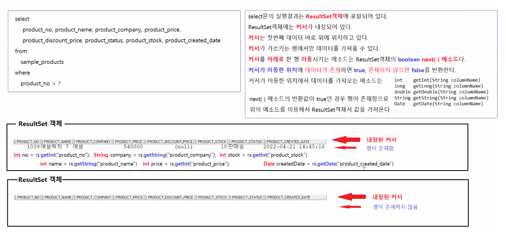
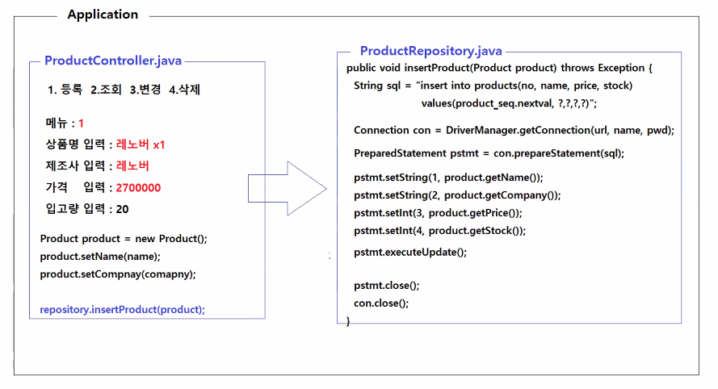
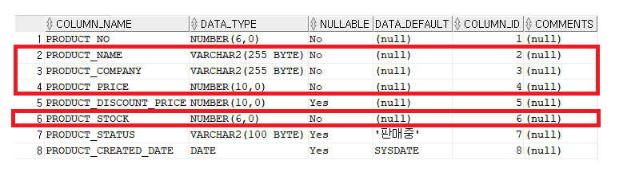
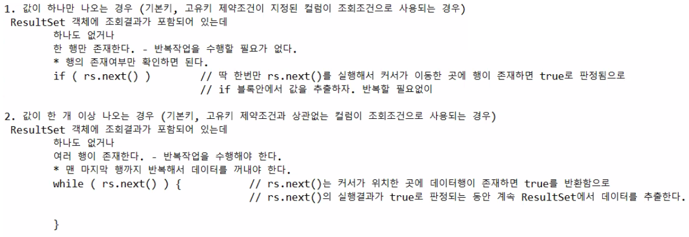

# 04/21

- [04/21](#0421)
- [JDBC](#jdbc)
  - [주요 API](#주요-api)
  - [DB 엑세스 작업 순서](#db-엑세스-작업-순서)
  - [ResultSet](#resultset)
- [실습](#실습)

<small><i><a href='http://ecotrust-canada.github.io/markdown-toc/'>Table of contents generated with markdown-toc</a></i></small>


# JDBC
* Java DataBase Connectivity
* 자바가 DB에 접속해 SQL을 실행할 수 있도록 하는 표준이다.
* java.sql과 javax.sql 패키지에 관련 인터페이스, 클래스가 존재한다.
## 주요 API
* 클래스
  * DriverManager
    * Driver를 이용해 데이터베이스와 연결을 유지하는 Connection객체를 생성한다.
* 인터페이스
  * Driver
    * JDBC기술을 기반으로 데이터베이스와 연결을 처리하는 Driver를 드라이버레지스트리에 등록한다.
    * DriverManager는 드라이버레지스트리에 등록된 Driver를 이용해 데이터베이스와 연결을 유지하는 Connection객체를 생성한다.
    * Driver인터페이스를 구현하는 구현클래스는 DBMS를 만든 회사에서 제공한다.
  * Connection
    * 데이터베이스와 연결을 유지하는 객체다.
    * DriverManager가 Driver를 이용해서 생성한다.
    * Connection은 SQL구문을 데이터베이스로 전송하고 실행시키는 Statement, PreparedStatement, CallableStatement객체를 제공한다.
    * Connection인터페이스를 구현하는 구현클래스는 DBMS 제작사가 제공한다.
  * Statement, PreparedStatement, CallableStatement
    * SQL구문을 데이터베이스로 전송하고 실행시키는 객체다.
    * Statement, PreparedStatement, CallableStatement인터페이스를 구현하는 구현 클래스는 DBMS제작사가 제공한다.
  * ResultSet
    * SQL구문(SELECT) 실행결과를 포함하고 있는 객체다.
    * ResultSet 인터페이스를 구현하는 구현클래스는 DBMS 제작사가 제공한다.
  * ResultSetMetaData
    * SQL구문(SELECT) 실행결과에 대한 부가적인 정보를 포함하고 있는 객체다.
    * ResultSetMetaData 인터페이스를 구현하는 구현클래스는 DBMS제작사가 제공한다.
* 예외
  * SQLException
    * 데이터베이스 엑세스 작업중 오류가 발생하면 이 예외를 던진다.

```
DriverManager를 이용해 db와 연결한다.
DBMS제작사가 제공하는 Connection객체는 Statement, PreparedStatement객체를 제공하고 이 둘은 데이터베이스로 sql문을 전송하고 실행시킨다.
sql문의 실행결과는 ResultSet객체가 가지고 있다.
```

## DB 엑세스 작업 순서
0. SQL구문 작성하기
   ```java
   String sql = "insert into sample_products(product_no, product_name, product_company, product_price, product_stock) "
              + "values (products_sql.nextval,?,?,?,?)";
   // SQL 키워드(insert, into, values, select, from, where, order by, asc, desc, in, like, update, set, delete 등)와
   // 테이블명, 시퀀스명, 내장함수명, 컬럼명 자리에는 ? 를 사용할 수 없다.
   ```

1. Driver를 드라이버레지스트리에 등록하기
   * JVM의 드라이버레지스트리에 key-value형태로 저장된다.
   ```java
   // Class.forName("패키지경로를 포함하는 클래스이름") 정적 메소드는 지정된 클래스를 메모리의 설계도 영역으로 로딩시킨다.
   // oracle.jdbc패키지의 OracleDriver.class 클래스를 메모리로 로딩시키는 수행문이다.
   // OracleDriver는 Driver인터페이스의 구현클래스다.
   // OracleDriver는 메모리에 로딩이 완료되면 드라이버레지스트리에 "jdbc:oracle:thin"이라는 이름으로 OracleDriver를 등록시킨다.
   Class.forName("oracle.jdbc.OracleDriver");   
   ```

2. 데이터베이스와 연결을 유지하는 Connection객체 생성(획득)하기
   ```java
   // Connection DriverManager.getConnection(url, username, password) 정적메소드는 url, username, password 정보와 Driver를 이용해서 
   // 데이터베이스와 연결을 유지하는 Connection 인터페이스 구현객체를 반환한다.
   // url에는 드라이버레지스트리에 등록된 Driver이름, DBMS가 실행중인 컴퓨터이름, 포트번호, SID가 포함되어 있다.(오라클 한정)
   Connection conn = DriverManager.getConnection("jdbc:oracle:this:@localhost:1521:xe", "hr", "zxcv1234");
   // conn참조변수가 참조하는 객체는 Connection 인터페이스를 Oracle에서 구현한 객체다.
   ```

3. SQL구문을 DBMS로 전송하고 실행시키는 Statement, PrepareStatement, CallableStatement객체를 생성(획득하기)
   ```java
   // Connection의 PreparedStatement preparedStatement(String sql)메소드는 지정된 SQL을 DBMS로 전송하고 실행시키는 PreparedStatement객체를 반환한다.
   PreparedStatement pstmt = conn.prepareStatement(sql);
   // pstmt가 참조하는 객체는 PreparedStatement 인터페이스를 Oracle에서 구현한 객체다.
   ```
   * PreparedStatement 와 prepareStatement 철자에 유의하라(뒤에 것은 d가 없다.)

4. SQL구문의 ?에 값을 바인딩 시키기
   ```java
   // PreparedStatement의 
   //                       setInt(int position, int value)
   //                       setLong(int position, Long value)
   //                       setDouble(int position, double value)
   //                       setString(int position, String value)
   //                       setDate(int position, date value)
   // 메소드를 이용해서 SQL구문의 ?에 값을 바인딩시킨다.
   psmt.setString(1, "맥북 프로13");
   psmt.setString(2, "애플");
   psmt.setInt(3, 1960000);
   psmt.setInt(4, 20);
   ```

5. SQL구문을 DBMS로 전송, 실행시키기
   ```java
   // PreparedStatement의
   //                       int             executeUpdate()         INSERT구문, UPDATE구문, DELETE구문의 전송, 실행에 사용한다.
   //                                                               위의 작업실행결과는 추가/변경/삭제된 행의 개수를 반환한다.
   //                       ResultSet       executeQuery()          SELECT구문의 전송, 실행에 사용한다.
   //                                                               조회결과를 포함하는 ResultSet객체를 반환한다.
   // 메소드를 이용해서 SQL구문을 DBMS에 전송하고 실행시킨다.

   ```

6. 실행결과를 사용하기
   ```java
   // 결과를 출력한다.
   ```

7. 데이터베이스 엑세스 작업이 종료되면 데이터베이스 엑세스 작업으로 점유했던 모든 자원을 반납한다.
   ```java
   //ResultSet의 close(), PreparedStatement의 close(), Connection의 close() 메소드를 실행한다.
   ```

## ResultSet

* ResultSet객체에 select문의 결과를 담고 있다.
* ResultSet에 커서가 내장되어 있다.
* 커서는 첫번째 데이터 바로 위에 위치하고 있다.
* 커서를 아래로 한 행 이동 시키는 메소드는 `boolean next()`메소드다
* 커서가 이동한 위치에 데이터가 존재하면 true, 아니면 false를 반환한다. 
* 커서가 이동한 위치에서 데이터를 가져오려면 예시)`int getInt()`를 통해 데이터를 가져올 수 있다.


# 실습
이클립스에서 jdbc로 DB연결하기
* 실습에 활용할 Product 클래스 - SAMPLE_PRODUCT 에 저장할 상품정보를 담을 객체를 생성하기 위함.
    ```java
    package jdbc.sample;

    import java.util.Date;

    public class Product {

        private int no;				// product_no				number(6, 0)
        private String name;		// product_name				varchar2(255)
        private String company;		// product_company			varchar2(255)
        private int price;			// product_price			number(10, 0)
        private int discountPrice;	// product_discount_price	number(10, 0)
        private int stock;			// product_stock			number(6, 0)
        private String status;		// product_status			varchar2(100)
        private Date createdDate;	// product_createdDate		date
                
        public Product() {
            super();
        }
        public int getNo() {
            return no;
        }
        public String getName() {
            return name;
        }
        public String getCompany() {
            return company;
        }
        public int getPrice() {
            return price;
        }
        public int getDiscountPrice() {
            return discountPrice;
        }
        public int getStock() {
            return stock;
        }
        public String getStatus() {
            return status;
        }
        public Date getCreatedDate() {
            return createdDate;
        }
        public void setNo(int no) {
            this.no = no;
        }
        public void setName(String name) {
            this.name = name;
        }
        public void setCompany(String company) {
            this.company = company;
        }
        public void setPrice(int price) {
            this.price = price;
        }
        public void setDiscountPrice(int discountPrice) {
            this.discountPrice = discountPrice;
        }
        public void setStock(int stock) {
            this.stock = stock;
        }
        public void setStatus(String status) {
            this.status = status;
        }
        public void setCreatedDate(Date createdDate) {
            this.createdDate = createdDate;
        }
        @Override
        public String toString() {
            return "Product [no=" + no + ", name=" + name + ", company=" + company + ", price=" + price + ", discountPrice="
                    + discountPrice + ", stock=" + stock + ", status=" + status + ", createdDate=" + createdDate + "]";
        }
        
    }
    ```

* DB에 객체 데이터를 INSERT하는 코드
    ```java
    package jdbc.sample;

    import java.sql.Connection;
    import java.sql.DriverManager;
    import java.sql.PreparedStatement;
    import java.sql.SQLException;

    public class ProductInsertApp {
        
        public static void main(String[] args) throws ClassNotFoundException, SQLException {
            
            // 바인딩할 값 세팅
            Product product = new Product();
            product.setName("레노버 노트북 x1");
            product.setCompany("레노버");
            product.setPrice(2700000);
            product.setStock(25);		
            
            // 1. OracleDriver를 드라이버 레지스트리에 등록시키기(드라이버 레지스트리에 "jdbc:oracle:thin"이라는 이름으로 등록시킨다.
            Class.forName("oracle.jdbc.OracleDriver");
            
            // 2. DriverManager로 드라이버 레지스트리에 등록된 OracleDriver를 이용해 오라클 DBMS와 연결을 시도하고 연결되면
            //    연결을 유지하는 Connection객체 생성하기
            //    "jdbc:oracle:thin:@localhost:1521:xe"
            //          드라이버 레지스트리에 "jdbc:oracle:thin"으로 등록된 OracleDriver를 이용해서 
            //          내 컴퓨터(localhost)의 1521 port(논리적인 연결지)을 사용하고 있는 xe라는 식별자를 가진 데이터베이스
            String url = "jdbc:oracle:thin:@localhost:1521:xe";
            String username = "hr";
            String password = "zxcv1234";
            Connection connection = DriverManager.getConnection(url, username, password);
            
            // 3. SQL구문을 DBMS로 전송, 실행시키는 PreparedStatement 객체 생성하기
            String sql = "insert into sample_products " // 끝에 한칸씩 꼭 띄어쓴다.
                    + "(product_no, product_name, product_company, product_price, product_stock) "
                    + "values "
                    + "(products_seq.nextval, ?, ?, ?, ?) ";
            PreparedStatement pstmt = connection.prepareStatement(sql);
            
            // 4. ?에 값 바인딩시키기
            pstmt.setString(1, product.getName());
            pstmt.setString(2, product.getCompany());
            pstmt.setInt(3, product.getPrice());
            pstmt.setInt(4, product.getStock());
            
            // 5. SQL구문을 DBMS로 전송해서 실행시키기
            int updatedRowCount = pstmt.executeUpdate();
            System.out.println(updatedRowCount + "개 행이 추가되었습니다.");
            
            // 6. 리소스 반환
            pstmt.close();
            connection.close();		
            
        }
    }

    ```
* java.sql.Connection, DriverManager,PreparedStatement 를 활용하면 DB와 JDBC를 연결할 수 있다.
    * 
    * 사용자가 메뉴를 고르고 상품정보를 입력하면 DB에 저장된다.

* 사용자와 상호작용하는 ProductApp
    ```java
    package jdbc.sample;

    import java.util.List;

    public class ProductApp {

        public static void main(String[] args) {

            KeyboardReader reader = new KeyboardReader();
            ProductRepository productRepository = new ProductRepository();

            while (true) {
                try {
                    System.out.println("-------------------------------------------");
                    System.out.println("1.등록 2.전체조회 3.상세조회 4.수정 5.삭제 0.종료");
                    System.out.println("-------------------------------------------");

                    System.out.print("메뉴 선택: ");
                    int menuNo = reader.readInt();
                    System.out.println();

                    if (menuNo == 1) {
                        System.out.println("<< 새 상품 등록 >>");
                        System.out.println("### 상품등록 정보를 입력하세요.");

                        System.out.print("상품이름 입력: ");
                        String name = reader.readString();
                        System.out.print("제조회사 입력: ");
                        String company = reader.readString();
                        System.out.print("상품가격 입력: ");
                        int price = reader.readInt();
                        System.out.print("입고수량 입력: ");
                        int stock = reader.readInt();

                        Product product = new Product();
                        product.setName(name);
                        product.setCompany(company);
                        product.setPrice(price);
                        product.setStock(stock);

                        productRepository.insertProduct(product);

                        System.out.println("[처리 완료] 신규 상품이 등록되었습니다.");

                    } else if (menuNo == 2) {
                        System.out.println("<< 전체 상품 조회하기 >>");
                        System.out.println("### 전체 상품을 조회합니다.");

                        List<Product> products = productRepository.getAllProducts();
                        if (products.isEmpty()) {
                            System.out.println("[처리 완료] 등록된 상품이 존재하지 않습니다.");
                        } else {
                            System.out.println("---------------------------------------------------------------------------");
                            System.out.println("상품번호\t상품이름\t\t제조회사\t정상가격\t할인가격\t판매여부\t재고수량\t등록일자");
                            System.out.println("---------------------------------------------------------------------------");
                            for (Product product : products) {
                                System.out.println(product.getNo() + "\t" + product.getName() + "\t" + product.getCompany()
                                        + "\t" + product.getPrice() + "\t" + product.getDiscountPrice() + "\t"
                                        + product.getStatus() + "\t" + product.getStock() + "\t"
                                        + product.getCreatedDate());
                            }
                            System.out.println("--------------------------------------------------------------------------");
                            System.out.println("[처리 완료] 상품정보 출력완료.");
                        }

                    } else if (menuNo == 3) {
                        System.out.println("<< 상품 상세정보 조회하기 >>");
                        System.out.println("### 상품번호로 상품상세정보를 조회해 보세요.");

                        System.out.print("상품번호 입력: ");
                        int productNo = reader.readInt();

                        Product product = productRepository.getProductByNo(productNo);					
                        if (product == null) {
                            System.out.println("[처리 완료] 상품번호에 일치하는 상품정보가 존재하지 않습니다.");
                        } else {
                            System.out.println("-------------------------------------------");
                            System.out.println("상품번호: " + product.getNo());
                            System.out.println("상품이름: " + product.getName());
                            System.out.println("제조회사: " + product.getCompany());
                            System.out.println("정상가격: " + product.getPrice());
                            System.out.println("할인가격: " + product.getDiscountPrice());
                            System.out.println("판매여부: " + product.getStatus());
                            System.out.println("재고수량: " + product.getStock());
                            System.out.println("등록일자: " + product.getCreatedDate());
                            System.out.println("-------------------------------------------");
                            System.out.println("[처리 완료] 상품정보를 확인하세요.");
                        }
                    }
                    System.out.println("\n\n\n\n");

                } catch (Exception e) {
                    e.printStackTrace();
                }

            }

        }
        
    }


    ```
    * 메뉴 2번 - 전체 조회
      * 데이터를 List에 저장한다.
      * isEmpty()메소드로 존재유무를 확인한다.
      * 향상된 for문을 사용해 product객체를 반복 출력한다.


* ProductRepository는 ProductApp, DB와 상호작용한다.
    ```java
    package jdbc.sample;

    import java.sql.Connection;
    import java.sql.DriverManager;
    import java.sql.PreparedStatement;
    import java.sql.ResultSet;
    import java.sql.SQLException;
    import java.util.ArrayList;
    import java.util.Date;
    import java.util.List;

    public class ProductRepository {

        /**
        * 상품번호를 전달받아서 일치하는 상품정보를 SAMPLE_PRODUCTS 테이블에서 조회해 반환한다.
        * 
        * @param no 상품번호
        * @return 상품정보, 상품번호와 일치하는 상품정보가 존재하지 않으면 null이 반환된다.
        * @throws ClassNotFoundException 드라이버 클래스가 존재하지 않으면 이 예외를 던진다.
        * @throws SQLException           데이터베이스 엑세스 작업 중 오류가 발생하면 이 예외를 던진다.
        */
        public Product getProductByNo(int productNo) throws ClassNotFoundException, SQLException {
            Product product = null;

            String sql = "select product_no, product_name, product_company, product_price, product_discount_price, product_stock, product_status, product_created_date "
                    + "from sample_products " + "where product_no = ? ";

            Class.forName("oracle.jdbc.OracleDriver");
            Connection connection = DriverManager.getConnection("jdbc:oracle:thin:@localhost:1521:xe", "hr", "zxcv1234");

            PreparedStatement pstmt = connection.prepareStatement(sql);
            pstmt.setInt(1, productNo);
            ResultSet rs = pstmt.executeQuery();

            if (rs.next()) {
                int no = rs.getInt("product_no");
                String name = rs.getString("product_name");
                String company = rs.getString("product_company");
                int price = rs.getInt("product_price");
                int discountPrice = rs.getInt("product_discount_price");
                int stock = rs.getInt("product_stock");
                String status = rs.getString("product_status");
                Date createdDate = rs.getDate("product_created_date");

                product = new Product();
                product.setNo(no);
                product.setName(name);
                product.setCompany(company);
                product.setPrice(price);
                product.setDiscountPrice(discountPrice);
                product.setStock(stock);
                product.setStatus(status);
                product.setCreatedDate(createdDate);
            }

            rs.close();
            pstmt.close();
            connection.close();

            return product;
        }

        /**
        * SAMPLE_PRODUCTS 테이블에 저장된 모든 상품정보를 조회해서 반환한다.
        * 
        * @return 상품정보 리스트, 상품이 존재하지 않으면 빈 List객체가 반환된다.
        * @throws ClassNotFoundException 드라이버 클래스가 존재하지 않으면 이 예외를 던진다.
        * @throws SQLException
        */
        public List<Product> getAllProducts() throws ClassNotFoundException, SQLException {
            List<Product> products = new ArrayList<>();

            String sql = "select product_no, product_name, product_company, product_price, product_discount_price, product_stock, product_status, product_created_date "
                    + "from sample_products " + "order by product_no desc ";

            Class.forName("oracle.jdbc.OracleDriver");
            Connection connection = DriverManager.getConnection("jdbc:oracle:thin:@localhost:1521:xe", "hr", "zxcv1234");

            PreparedStatement pstmt = connection.prepareStatement(sql);
            ResultSet rs = pstmt.executeQuery();

            while (rs.next()) {
                int no = rs.getInt("product_no");
                String name = rs.getString("product_name");
                String company = rs.getString("product_company");
                int price = rs.getInt("product_price");
                int discountPrice = rs.getInt("product_discount_price");
                int stock = rs.getInt("product_stock");
                String status = rs.getString("product_status");
                Date createdDate = rs.getDate("product_created_date");

                Product product = new Product();
                product.setNo(no);
                product.setName(name);
                product.setCompany(company);
                product.setPrice(price);
                product.setDiscountPrice(discountPrice);
                product.setStock(stock);
                product.setStatus(status);
                product.setCreatedDate(createdDate);

                products.add(product);

            }

            rs.close();
            pstmt.close();
            connection.close();

            return products;
        }

        /**
        * 새 상품정보를 전달받아서 SAMPLE_PRODUCT 테이블에 저장한다.
        * 
        * @param product 새 상품정보
        * @throws ClassNotFoundException 드라이버 클래스가 존재하지 않으면 이 예외를 던진다.
        * @throws SQLException           데이터베이스 엑세스 작업 중 오류가 발생하면 이 예외를 던진다.
        */
        public void insertProduct(Product product) throws ClassNotFoundException, SQLException {
            String sql = "insert into sample_products "
                    + "(product_no, product_name, product_company, product_price, product_stock) " + "values "
                    + "(products_seq.nextval, ?, ?, ?, ?)";

            Class.forName("oracle.jdbc.OracleDriver");
            Connection connection = DriverManager.getConnection("jdbc:oracle:thin:@localhost:1521:xe", "hr", "zxcv1234");

            PreparedStatement pstmt = connection.prepareStatement(sql);
            pstmt.setString(1, product.getName());
            pstmt.setString(2, product.getCompany());
            pstmt.setInt(3, product.getPrice());
            pstmt.setInt(4, product.getStock());
            pstmt.executeUpdate();

            pstmt.close();
            connection.close();
        }
    }

    ```
    * 메뉴 3번 - 상세정보 조회
      * 사용자에게 받을 입력값을 db와 스토리보드를 보고 작성한다.
      * 
      * no는 `products_seq.nextval`로 인해 자동 지정되고
      * status, created_date는 디폴트 값이 있고 nullable이기 때문에 사용자로부터 입력받지 않는다.
      * 또한 discount_price도 nullable이다.
    * 메뉴 2번 - 전체조회
      * 조회하기 기능에서 2개 이상의 데이터를 조회할 경우 order by를 써서 정렬해준다.

* 보충설명
  * sql문의 ?의 개수만큼 파라미터(데이터값, 객체)를 전달해야 한다.
  * executeQuery()와 executeUpdate()
    * select는 executeQuery()메소드를 사용하고
    * insert, delete, update는 executeUpdate()메소드를 사용해 PreparedStatement 객체의 sql문을 실행한다.
    * executeQuery()는 쿼리문에 의해 생성된 데이터 담고있는 객체인 ResultSet을 반환한다.
  * 전체조회와 상세조회
    * 전체조회는 여러 행의 데이터를 전달받아 출력하고 상세조회는 한 행의 데이터를 전달받아 출력한다. (ProductList vs Product)
    * 여러 행의 데이터는 반복문을 사용해 출력한다.
    * 