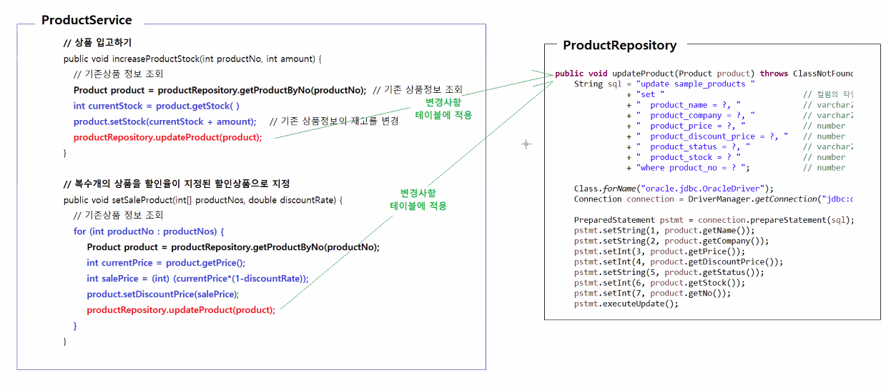
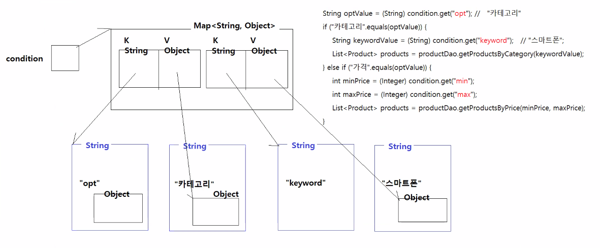

# 0422


# 실습

## delete
* 하나의 Product(튜플 1개)를 삭제하는 deleteProduct() 메소드 구현
## update
* 변경 가능한 모든 정보를 update하는 updateProduct() 메소드 구현
### update 활용

* 다양한 상품 정보 변경이 필요한 기능 구현에 updateProduct() 메소드를 활용할 수 있다.
  * 상품 입고하기, 할인상품으로 지정 등
  1. 기존 상품정보를 조회
  2. 바꾸고 싶은 정보만 바꾼 Product
  3. updateProduct()에 전달 

## 코드
1. Product 1개 조회
2. Product 전체 조회
3. Product 1개 수정
4. Product 1개 삭제
5. Product 1개 삽입
```java
package jdbc.sample;

import java.sql.Connection;
import java.sql.DriverManager;
import java.sql.PreparedStatement;
import java.sql.ResultSet;
import java.sql.SQLException;
import java.util.ArrayList;
import java.util.Date;
import java.util.List;

public class ProductRepository {

	/**
	 * 상품번호를 전달받아서 일치하는 상품정보를 SAMPLE_PRODUCTS 테이블에서 조회해 반환한다.
	 * 
	 * @param no 상품번호
	 * @return 상품정보, 상품번호와 일치하는 상품정보가 존재하지 않으면 null이 반환된다.
	 * @throws ClassNotFoundException 드라이버 클래스가 존재하지 않으면 이 예외를 던진다.
	 * @throws SQLException           데이터베이스 엑세스 작업 중 오류가 발생하면 이 예외를 던진다.
	 */
	public Product getProductByNo(int productNo) throws ClassNotFoundException, SQLException {
		Product product = null;

		String sql = "select product_no, product_name, product_company, product_price, product_discount_price, product_stock, product_status, product_created_date "
				+ "from sample_products " + "where product_no = ? ";

		Class.forName("oracle.jdbc.OracleDriver");
		Connection connection = DriverManager.getConnection("jdbc:oracle:thin:@localhost:1521:xe", "hr", "zxcv1234");

		PreparedStatement pstmt = connection.prepareStatement(sql);
		pstmt.setInt(1, productNo);
		ResultSet rs = pstmt.executeQuery();

		if (rs.next()) {
			int no = rs.getInt("product_no");
			String name = rs.getString("product_name");
			String company = rs.getString("product_company");
			int price = rs.getInt("product_price");
			int discountPrice = rs.getInt("product_discount_price");
			int stock = rs.getInt("product_stock");
			String status = rs.getString("product_status");
			Date createdDate = rs.getDate("product_created_date");

			product = new Product();
			product.setNo(no);
			product.setName(name);
			product.setCompany(company);
			product.setPrice(price);
			product.setDiscountPrice(discountPrice);
			product.setStock(stock);
			product.setStatus(status);
			product.setCreatedDate(createdDate);
		}

		rs.close();
		pstmt.close();
		connection.close();

		return product;
	}

	/**
	 * SAMPLE_PRODUCTS 테이블에 저장된 모든 상품정보를 조회해서 반환한다.
	 * 
	 * @return 상품정보 리스트, 상품이 존재하지 않으면 빈 List객체가 반환된다.
	 * @throws ClassNotFoundException 드라이버 클래스가 존재하지 않으면 이 예외를 던진다.
	 * @throws SQLException
	 */
	public List<Product> getAllProducts() throws ClassNotFoundException, SQLException {
		List<Product> products = new ArrayList<>();

		String sql = "select product_no, product_name, product_company, product_price, product_discount_price, product_stock, product_status, product_created_date "
				+ "from sample_products " + "order by product_no desc ";

		Class.forName("oracle.jdbc.OracleDriver");
		Connection connection = DriverManager.getConnection("jdbc:oracle:thin:@localhost:1521:xe", "hr", "zxcv1234");

		PreparedStatement pstmt = connection.prepareStatement(sql);
		ResultSet rs = pstmt.executeQuery();

		while (rs.next()) {
			int no = rs.getInt("product_no");
			String name = rs.getString("product_name");
			String company = rs.getString("product_company");
			int price = rs.getInt("product_price");
			int discountPrice = rs.getInt("product_discount_price");
			int stock = rs.getInt("product_stock");
			String status = rs.getString("product_status");
			Date createdDate = rs.getDate("product_created_date");

			Product product = new Product();
			product.setNo(no);
			product.setName(name);
			product.setCompany(company);
			product.setPrice(price);
			product.setDiscountPrice(discountPrice);
			product.setStock(stock);
			product.setStatus(status);
			product.setCreatedDate(createdDate);

			products.add(product);

		}

		rs.close();
		pstmt.close();
		connection.close();

		return products;
	}

	/**
	 * 새 상품정보를 전달받아서 SAMPLE_PRODUCT 테이블에 저장한다.
	 * 
	 * @param product 새 상품정보
	 * @throws ClassNotFoundException 드라이버 클래스가 존재하지 않으면 이 예외를 던진다.
	 * @throws SQLException           데이터베이스 엑세스 작업 중 오류가 발생하면 이 예외를 던진다.
	 */
	public void insertProduct(Product product) throws ClassNotFoundException, SQLException {
		String sql = "insert into sample_products "
				+ "(product_no, product_name, product_company, product_price, product_stock) " + "values "
				+ "(products_seq.nextval, ?, ?, ?, ?)";

		Class.forName("oracle.jdbc.OracleDriver");
		Connection connection = DriverManager.getConnection("jdbc:oracle:thin:@localhost:1521:xe", "hr", "zxcv1234");

		PreparedStatement pstmt = connection.prepareStatement(sql);
		pstmt.setString(1, product.getName());
		pstmt.setString(2, product.getCompany());
		pstmt.setInt(3, product.getPrice());
		pstmt.setInt(4, product.getStock());
		pstmt.executeUpdate();

		pstmt.close();
		connection.close();
	}
	
	/**
	 * 수정할 상품정보를 전달받아서 SAMPLE_PRODUCTS 테이블에서 상품번호가 일치하는 상품의 상품이름, 제조사, 가격, 할인가격, 재고수량, 판매상태 등을 수정한다.
	 * @param product 숭정된 상품정보
	 * @throws ClassNotFoundException 드라이버 클래스가 존재하지 않으면 이 예외를 던진다.
	 * @throws SQLException 데이터베이스 엑세스 작업 중 오류가 발생하면 이 예외를 던진다.
	 */
	public void updateProduct(Product product) throws ClassNotFoundException, SQLException {
		String sql = "update sample_products "
				+ "set "
				+ "  product_name = ?, "
				+ "  product_company = ?, "
				+ "  product_price = ?, "
				+ "  product_discount_price = ?, "
				+ "  product_status = ?, "
				+ "  product_stock = ? "
				+ "where product_no = ? ";
		
		Class.forName("oracle.jdbc.OracleDriver");
		Connection connection = DriverManager.getConnection("jdbc:oracle:thin:@localhost:1521:xe", "hr", "zxcv1234");

		PreparedStatement pstmt = connection.prepareStatement(sql);
		pstmt.setString(1, product.getName());
		pstmt.setString(2, product.getCompany());
		pstmt.setInt(3, product.getPrice());
		pstmt.setInt(4, product.getDiscountPrice());
		pstmt.setString(5, product.getStatus());
		pstmt.setInt(6, product.getStock());
		pstmt.setInt(7, product.getNo());
		pstmt.executeUpdate();
		
		pstmt.close();
		connection.close();		
	}
	
	/**
	 * 상품번호를 전달받아서 SAMPLE_PRODUCTS 테이블에서 상품번호와 일치하는 상품정보를 삭제한다.
	 * @param productNo 상품번호
	 * @throws ClassNotFoundException 드라이버 클래스가 존재하지 않으면 이 예외를 던진다.
	 * @throws SQLException 데이터베이스 엑세스 작업 중 오류가 발생하면 이 예외를 던진다.
	 */	
	public void deleteProduct(int productNo) throws ClassNotFoundException, SQLException {
		String sql = "delete from sample_products "
				+ "where product_no = ? ";
		
		Class.forName("oracle.jdbc.OracleDriver");
		Connection connection = DriverManager.getConnection("jdbc:oracle:thin:@localhost:1521:xe", "hr", "zxcv1234");

		PreparedStatement pstmt = connection.prepareStatement(sql);
		pstmt.setInt(1, productNo);
		pstmt.executeUpdate();
		
		pstmt.close();
		connection.close();		
	}
	
}

```

* ProductApp에서 간단하게 출력해 기능 작동 여부 확인해보기
```java
package jdbc.sample;

import java.util.List;

public class ProductApp {

	public static void main(String[] args) {

		KeyboardReader reader = new KeyboardReader();
		ProductRepository productRepository = new ProductRepository();

		while (true) {
			try {
				System.out.println("-------------------------------------------");
				System.out.println("1.등록 2.전체조회 3.상세조회 4.수정 5.삭제 0.종료");
				System.out.println("-------------------------------------------");

				System.out.print("메뉴 선택: ");
				int menuNo = reader.readInt();
				System.out.println();

				if (menuNo == 1) {
					System.out.println("<< 새 상품 등록 >>");
					System.out.println("### 상품등록 정보를 입력하세요.");

					System.out.print("상품이름 입력: ");
					String name = reader.readString();
					System.out.print("제조회사 입력: ");
					String company = reader.readString();
					System.out.print("상품가격 입력: ");
					int price = reader.readInt();
					System.out.print("입고수량 입력: ");
					int stock = reader.readInt();

					Product product = new Product();
					product.setName(name);
					product.setCompany(company);
					product.setPrice(price);
					product.setStock(stock);

					productRepository.insertProduct(product);

					System.out.println("[처리 완료] 신규 상품이 등록되었습니다.");

				} else if (menuNo == 2) {
					System.out.println("<< 전체 상품 조회하기 >>");
					System.out.println("### 전체 상품을 조회합니다.");

					List<Product> products = productRepository.getAllProducts();
					if (products.isEmpty()) {
						System.out.println("[처리 완료] 등록된 상품이 존재하지 않습니다.");
					} else {
						System.out
								.println("---------------------------------------------------------------------------");
						System.out.println("상품번호\t제조회사\t정상가격\t할인가격\t판매여부\t재고수량\t상품이름");
						System.out
								.println("---------------------------------------------------------------------------");
						for (Product product : products) {
							System.out.println(product.getNo() + "\t" + product.getCompany() + "\t" + product.getPrice()
									+ "\t" + product.getDiscountPrice() + "\t" + product.getStatus() + "\t"
									+ product.getStock() + "\t" + product.getName());
						}
						System.out
								.println("--------------------------------------------------------------------------");
						System.out.println("[처리 완료] 상품정보 출력완료.");
					}

				} else if (menuNo == 3) {
					System.out.println("<< 상품 상세정보 조회하기 >>");
					System.out.println("### 상품번호로 상품상세정보를 조회해 보세요.");

					System.out.print("상품번호 입력: ");
					int productNo = reader.readInt();

					Product product = productRepository.getProductByNo(productNo);
					if (product == null) {
						System.out.println("[처리 완료] 상품번호에 일치하는 상품정보가 존재하지 않습니다.");
					} else {
						System.out.println("-------------------------------------------");
						System.out.println("상품번호: " + product.getNo());
						System.out.println("상품이름: " + product.getName());
						System.out.println("제조회사: " + product.getCompany());
						System.out.println("정상가격: " + product.getPrice());
						System.out.println("할인가격: " + product.getDiscountPrice());
						System.out.println("판매여부: " + product.getStatus());
						System.out.println("재고수량: " + product.getStock());
						System.out.println("등록일자: " + product.getCreatedDate());
						System.out.println("-------------------------------------------");
						System.out.println("[처리 완료] 상품정보를 확인하세요.");
					}
				} else if (menuNo == 4) {
					System.out.println("<< 상품 정보 변경 >>");
					System.out.println("### 상품번호, 상품이름, 가격, 할인가격을 입력해 상품정보를 수정해보세요.");

					System.out.print("상품번호 입력: ");
					int productNo = reader.readInt();
					System.out.print("상품이름 입력: ");
					String name = reader.readString();
					System.out.print("정상가격 입력: ");
					int price = reader.readInt();
					System.out.print("할인가격 입력: ");
					int discountPrice = reader.readInt();

					Product product = productRepository.getProductByNo(productNo);
					product.setName(name);
					product.setPrice(price);
					product.setDiscountPrice(discountPrice);

					productRepository.updateProduct(product);

					System.out.println("[처리 완료] 상품정보가 변경되었습니다.");

				} else if (menuNo == 5) {
					System.out.println("<< 상품 정보 삭제 >>");
					System.out.println("### 상품번호를 입력해 상품정보를 삭제하세요.");

					System.out.print("상품번호 입력: ");
					int productNo = reader.readInt();

					productRepository.deleteProduct(productNo);
					System.out.println("[처리 완료] " + productNo + "번 상품정보가 삭제되었습니다.");

				}
				System.out.println("\n\n\n\n");

			} catch (Exception e) {
				e.printStackTrace();
			}

		}

	}

}

```

# admin app
* 검색기능 - Map(key, value) 활용
  * Map에 검색조건을 저장해 조건에 맞는 결과 반환하는 기능
  * 키워드만 입력하면 검색할 수 있는 기능
    * 삼성 > '삼성' 키워드가 포함된 제조사
    * 갤럭시 > '갤럭시' 키워드가 포함된 제품들
  * 