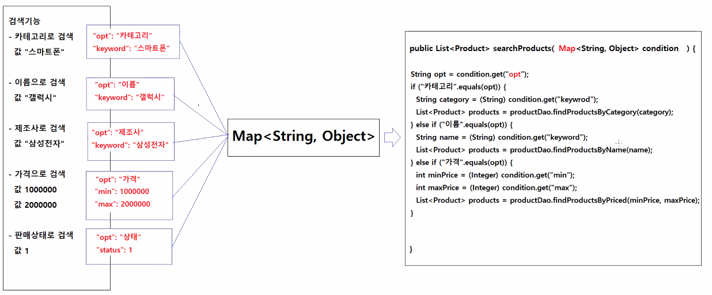
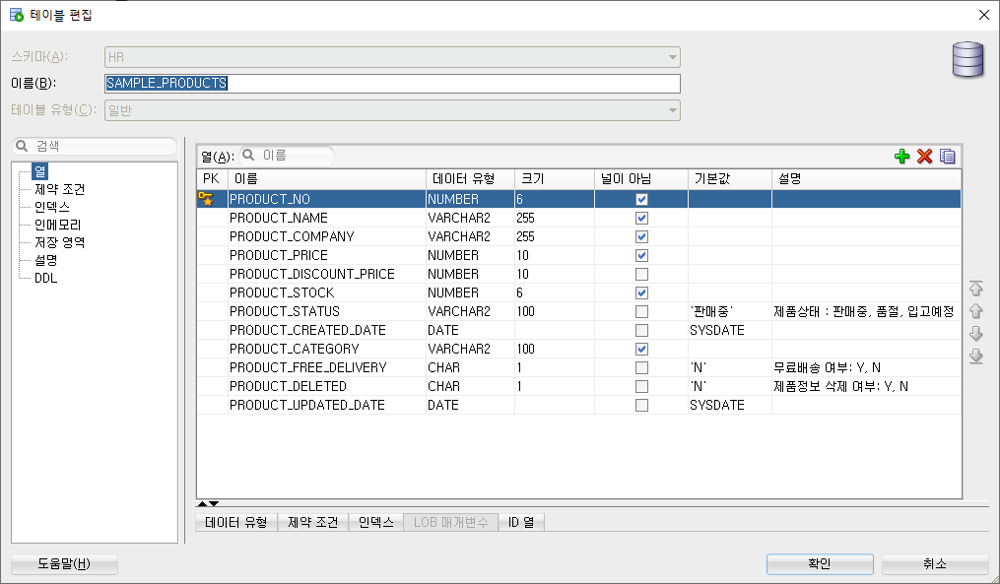
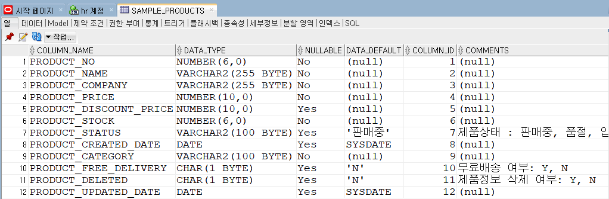
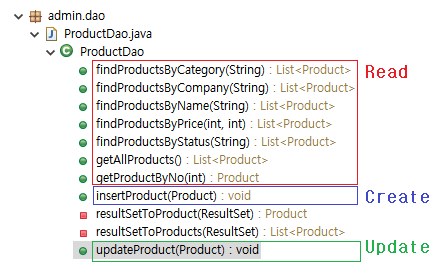
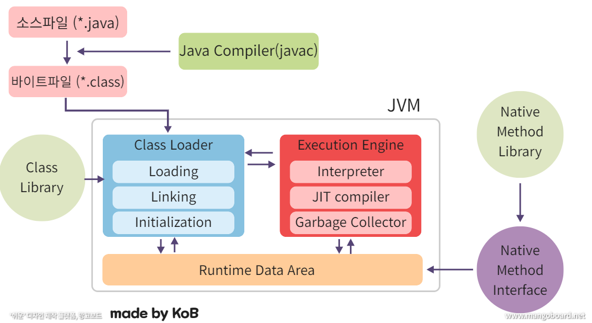
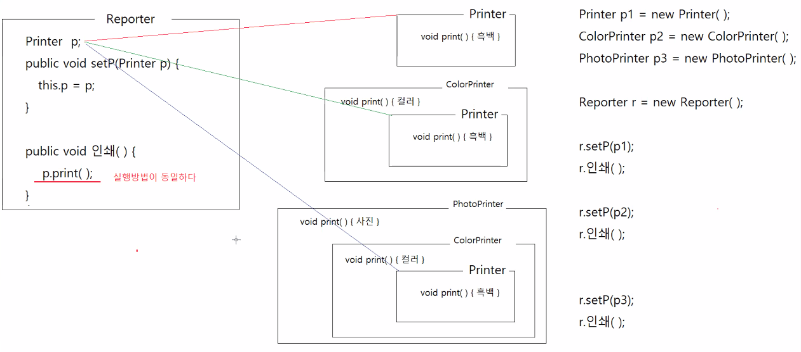

# 0425

- [0425](#0425)
- [Admin 앱 실습](#admin-앱-실습)
  - [기능 구현](#기능-구현)
    - [전체상품조회()](#전체상품조회)
    - [상품검색()](#상품검색)
    - [신규등록()](#신규등록)
    - [무료배송지정()](#무료배송지정)
    - [상품입고처리()](#상품입고처리)
    - [상품폐기처리()](#상품폐기처리)
  - [기타 설명](#기타-설명)
    - [제약조건 추가](#제약조건-추가)
    - [auto commit](#auto-commit)
    - [오토-박싱 오토-언박싱](#오토-박싱-오토-언박싱)
    - [DAO 구조](#dao-구조)
    - [기본적인 CRUD SQL문 복습](#기본적인-crud-sql문-복습)
- [오라클 내장함수](#오라클-내장함수)
  - [종류](#종류)
  - [단일행 함수](#단일행-함수)
    - [종류](#종류-1)
      - [문자함수](#문자함수)
  - [기타 설명](#기타-설명-1)
    - [DUAL](#dual)
- [1차 시험 오답정리](#1차-시험-오답정리)

<small><i><a href='http://ecotrust-canada.github.io/markdown-toc/'>Table of contents generated with markdown-toc</a></i></small>


# Admin 앱 실습
* 지난 시간에 이에서 앱 개발
## 기능 구현
### 전체상품조회()
* 전체상품조회()
    ```java
    private void 전체상품조회() throws SQLException {
            System.out.println("<< 전체 상품 목록 >>");
            System.out.println("### 전체 상품 목록을 확인하세요.");

            List<Product> products = productService.getAllProducts();
            상품리스트출력(products);
            
            System.out.println("[처리완료] 상품 전체 목록을 출력합니다.");
        }
    ```

* 상품리스트출력() 리팩토링
    ```java
    private void 상품리스트출력(List<Product> products) {
            if (products.isEmpty()) {
                System.out.println("[처리 완료] 검색조건에 해당하는 상품이 없습니다.");
            } else {
                System.out.println("------------------------------------------------------------------------------------");
                System.out.println("상품번호\t상품가격\t판매상태\t제조회사\t상품명");
                System.out.println("------------------------------------------------------------------------------------");
                for (Product product : products) {
                    System.out.print(product.getNo() + "\t");
                    System.out.print(product.getPrice() + "\t");
                    System.out.print(product.getStatus() + "\t");
                    System.out.print(product.getCompany() + "\t");
                    System.out.println(product.getName());
                }
                System.out.println("------------------------------------------------------------------------------------");
            }
        }
    ```

* 전체상품조회() > ProductsService.getAllProducts() > productDao.getAllProducts()
    ```java
    /**
        * 전체 상품정보를 반환하는 서비스다.
        * @return 전체 상품정보
        * @throws SQLException 데이터베이스 엑세스 작업중 오류가 발생하면 이 예외를 던진다.
        */
        public List<Product> getAllProducts() throws SQLException {
            return productDao.getAllProducts();
        }
    ```
    ```java
        /**
        * 모든 상품정보를 반환한다.
        * 
        * @return 모든 상품정보
        * @throws SQLException 데이터베이스 엑세스 작업 중 오류가 발생하면 이 예외를 던진다.
        */
        public List<Product> getAllProducts() throws SQLException {
            String sql = "select * " + "from sample_products " + "order by product_no desc ";

            Connection connection = ConnectionUtil.getConnection();
            PreparedStatement pstmt = connection.prepareStatement(sql);
            ResultSet rs = pstmt.executeQuery();
            List<Product> products = resultSetToProducts(rs);

            rs.close();
            pstmt.close();
            connection.close();

            return products;
        }
    ```

* ResultSet을 Product, Products로 바꿔주는 메소드 (리팩토링)
    ```java
    /**
        * ResultSet에 포함된 모든 행의 데이터를 가져와서 Product목록으로 반환한다.
        * 
        * @param rs ResultSet
        * @return 상품정보 리스트
        * @throws SQLException 데이터베이스 엑세스 작업중 오류가 발생하면 이 예외를 던진다.
        */
        private List<Product> resultSetToProducts(ResultSet rs) throws SQLException {
            List<Product> products = new ArrayList<>();

            while (rs.next()) {
                Product product = resultSetToProduct(rs);
                products.add(product);
            }

            return products;
        }

        /**
        * ResultSet에서 현재 커서가 위치한 행의 데이터를 가져와서 Product객체에 저장하고 반환한다.
        * 
        * @param rs ResultSet
        * @return 현재 커서가 위치한 행의 값을 저장하고 있는 Product객체
        * @throws SQLException 데이터베이스 엑세스 작업중 오류가 발생하면 이 예외를 던진다.
        */
        private Product resultSetToProduct(ResultSet rs) throws SQLException {
            Product product = new Product();

            product.setNo(rs.getInt("product_no"));
            product.setCategory(rs.getString("product_category"));
            product.setName(rs.getString("product_name"));
            product.setCompany(rs.getString("product_company"));
            product.setPrice(rs.getInt("product_price"));
            product.setDiscountPrice(rs.getInt("product_discount_price"));
            product.setStatus(rs.getString("product_status"));
            product.setStock(rs.getInt("product_stock"));
            product.setFreeDelivery(rs.getString("product_free_delivery"));
            product.setDeleted(rs.getString("product_deleted"));
            product.setUpdatedDate(rs.getDate("product_updated_date"));
            product.setCreatedDate(rs.getDate("product_created_date"));

            return product;
        }
    ```

### 상품검색()
* 카테고리, 이름, 제조사, 가격, 상태별로 검색
* condition이라는 map객체에 담아서 출력한다.
* 

* 상품검색()
    ```java
    private void 상품검색() throws SQLException {
            System.out.println("<< 상품 검색 >>");
            System.out.println("------------------------------------------------------------------------------------");
            System.out.println("1.카테고리  2.이름  3.제조사  4.가격  5.상태  -1.종료");
            System.out.println("------------------------------------------------------------------------------------");

            System.out.print("검색메뉴 입력: ");
            int menuNo = keyboard.readInt();

            Map<String, Object> condition = new HashMap<>();
            if (menuNo == 1) {
                System.out.println("<< 카테고리로 상품 검색 >>");
                System.out.println("### 카테고리를 입력해서 상품을 검색해보세요");

                System.out.print("카테고리 입력: ");
                String category = keyboard.readString();

                condition.put("opt", "카테고리");
                condition.put("keyword", category);

            } else if (menuNo == 2) {
                System.out.println("<< 상품이름으로 상품 검색 >>");
                System.out.println("### 상품이름을 입력해서 상품을 검색해보세요");

                System.out.print("상품이름 입력: ");
                String name = keyboard.readString();

                condition.put("opt", "상품명");
                condition.put("keyword", name);

            } else if (menuNo == 3) {
                System.out.println("<< 제조회사로 상품 검색 >>");
                System.out.println("### 제조회사명을 입력해서  상품을 검색해보세요");

                System.out.print("제조회사이름 입력: ");
                String company = keyboard.readString();

                condition.put("opt", "제조회사");
                condition.put("keyword", company);

            } else if (menuNo == 4) {
                System.out.println("<< 가격으로 상품 검색 >>");
                System.out.println("### 가격을 입력해서  상품을 검색해보세요");

                System.out.print("최소가격 입력: ");
                int minPrice = keyboard.readInt();
                System.out.print("최대가격 입력: ");
                int maxPrice = keyboard.readInt();

                condition.put("opt", "가격");
                condition.put("min", minPrice);
                condition.put("max", maxPrice);

            } else if (menuNo == 5) {
                System.out.println("<< 판매상태로 상품 검색 >>");
                System.out.println("### 판매상태를 선택해서 상품을 검색해보세요");

                System.out.print("판매상태(1.판매중, 2.재고없음, 3.입고예정, 4.절판): ");
                int statusNumber = keyboard.readInt();

                condition.put("opt", "판매상태");
                if (statusNumber == 1) {
                    condition.put("status", "판매중");
                } else if (statusNumber == 2) {
                    condition.put("status", "재고없음");
                } else if (statusNumber == 3) {
                    condition.put("status", "입고예정");
                } else if (statusNumber == 4) {
                    condition.put("status", "절판");
                }

            } else if (menuNo == -1) {
                System.out.println("### 상품검색을 종료합니다.");
                return;
            }

            List<Product> products = productService.searchProducts(condition);
            상품리스트출력(products);
            

            System.out.println();
            System.out.println();

            상품검색();
        }
    ```

* productService.searchProducts(condition) > productDao.findProductsBy~()
* productService.searchProducts(condition)
    ```java
        /**
        * 검색조건이 저장된 Map객체를 전달받아서 검색조건과 일치하는 상품정보를 반환한다.
        * 
        * @param condition 검색조건이 저장된 Map객체
        * @return 상품정보 리스트
        */
        public List<Product> searchProducts(Map<String, Object> condition) throws SQLException {
            System.out.println("검색조건: " + condition);

            String optValue = (String) condition.get("opt");

            List<Product> products = new ArrayList<>();
            if ("카테고리".equals(optValue)) {
                String category = (String) condition.get("keyword");
                products = productDao.findProductsByCategory(category);

            } else if ("상품명".equals(optValue)) {
                String name = (String) condition.get("keyword");
                products = productDao.findProductsByName(name);

            } else if ("제조회사".equals(optValue)) {
                String company = (String) condition.get("keyword");
                products = productDao.findProductsByCompany(company);

            } else if ("가격".equals(optValue)) {
                int minPrice = (Integer) condition.get("min");
                int maxPrice = (Integer) condition.get("max");
                products = productDao.findProductsByPrice(minPrice, maxPrice);

            } else if ("판매상태".equals(optValue)) {
                String status = (String) condition.get("status");
                products = productDao.findProductsByStatus(status);
            }

            return products;
        }
    ```

* productDao.findProductsBy~()
    ```java
        /**
        * 모든 상품정보를 반환한다.
        * 
        * @return 모든 상품정보
        * @throws SQLException 데이터베이스 엑세스 작업 중 오류가 발생하면 이 예외를 던진다.
        */
        public List<Product> getAllProducts() throws SQLException {
            String sql = "select * " + "from sample_products " + "order by product_no desc ";

            Connection connection = ConnectionUtil.getConnection();
            PreparedStatement pstmt = connection.prepareStatement(sql);
            ResultSet rs = pstmt.executeQuery();
            List<Product> products = resultSetToProducts(rs);

            rs.close();
            pstmt.close();
            connection.close();

            return products;
        }

        /**
        * 카테고리를 전달받아서 해당 카테고리에 포함되는 상품정보를 전부 반환한다.
        * 
        * @param category 상품카테고리
        * @return 상품정보 리스트
        * @throws SQLException 데이터베이스 엑세스 작업중 오류가 발생하면 이 예외를 던진다.
        */
        public List<Product> findProductsByCategory(String category) throws SQLException {
            String sql = "select * " + "from sample_products " + "where product_category like '%' || ? || '%' "
                    + "order by product_no desc ";

            Connection connection = ConnectionUtil.getConnection();
            PreparedStatement pstmt = connection.prepareStatement(sql);
            pstmt.setString(1, category);
            ResultSet rs = pstmt.executeQuery();
            List<Product> productList = resultSetToProducts(rs);

            rs.close();
            pstmt.close();
            connection.close();

            return productList;
        }

        /**
        * 제조사명을 전달받아서 해당 제조사에 포함되는 상품정보를 전부 반환한다.
        * 
        * @param company 제조사
        * @return 상품정보 리스트
        * @throws SQLException 데이터베이스 엑세스 작업중 오류가 발생하면 이 예외를 던진다.
        */
        public List<Product> findProductsByCompany(String company) throws SQLException {
            String sql = "select * " + "from sample_products " + "where product_company like '%' || ? || '%' "
                    + "order by product_no desc ";

            Connection connection = ConnectionUtil.getConnection();
            PreparedStatement pstmt = connection.prepareStatement(sql);
            pstmt.setString(1, company);
            ResultSet rs = pstmt.executeQuery();
            List<Product> productList = resultSetToProducts(rs);

            rs.close();
            pstmt.close();
            connection.close();

            return productList;
        }

        /**
        * 최소값, 최대값을 전달받아서 해당 가격범위에 포함되는 상품정보를 전부 반환한다.
        * 
        * @param minPrice 최소값
        * @param maxPrice 최대값
        * @return 상품정보 리스트
        * @throws SQLException 데이터베이스 엑세스 작업중 오류가 발생하면 이 예외를 던진다.
        */
        public List<Product> findProductsByPrice(int minPrice, int maxPrice) throws SQLException {
            String sql = "select * " + "from sample_products " + "where product_price >= ? and product_price <= ? "
                    + "order by product_no desc ";

            Connection connection = ConnectionUtil.getConnection();
            PreparedStatement pstmt = connection.prepareStatement(sql);
            pstmt.setInt(1, minPrice);
            pstmt.setInt(2, maxPrice);
            ResultSet rs = pstmt.executeQuery();
            List<Product> productList = resultSetToProducts(rs);

            rs.close();
            pstmt.close();
            connection.close();

            return productList;
        }

        /**
        * 제품상태를 전달받아서 해당 상태에 맞는 제품들을 모두 반환한다.
        * 
        * @param status 상품상태
        * @return 상품정보 리스트
        * @throws SQLException 데이터베이스 엑세스 작업중 오류가 발생하면 이 예외를 던진다.
        */
        public List<Product> findProductsByStatus(String status) throws SQLException {
            String sql = "select * " + "from sample_products " + "where product_status = ? " + "order by product_no desc ";

            Connection connection = ConnectionUtil.getConnection();
            PreparedStatement pstmt = connection.prepareStatement(sql);
            pstmt.setString(1, status);
            ResultSet rs = pstmt.executeQuery();
            List<Product> productList = resultSetToProducts(rs);

            rs.close();
            pstmt.close();
            connection.close();

            return productList;
        }
    ```


### 신규등록()
* 신규등록()
    ```java
    private void 신규등록() throws SQLException {
            System.out.println("<< 상품 신규 등록 >>");
            System.out.println("### 카테고리, 이름, 제조사, 가격, 입고량을 입력하세요.");

            System.out.print("카테고리 입력: ");
            String category = keyboard.readString();
            System.out.print("상품이름 입력: ");
            String name = keyboard.readString();
            System.out.print("제조회사 입력: ");
            String company = keyboard.readString();
            System.out.print("상품가격 입력: ");
            int price = keyboard.readInt();
            System.out.print("입고수량 입력: ");
            int stock = keyboard.readInt();

            Product product = new Product();
            product.setCategory(category);
            product.setName(name);
            product.setCompany(company);
            product.setPrice(price);
            product.setDiscountPrice(price); // 할인가격은 입력받지 않지만 신규 상품 등록인 경우 할인가격은 상품가격과 같은 값을 저장한다.
            product.setStock(stock);
            
            productService.addNewProduct(product);
            
            System.out.println("[처리 완료] 신규 상품등록이 완료되었습니다.");
        }
    ```

### 무료배송지정()
* productDao의 getProductByNo(), updateProduct()를 활용
```java
	private void 무료배송지정() throws SQLException {
		System.out.println("<< 무료 배송 지정 >>");
		System.out.println("### 무료배송으로 지정할 상품번호를 ,로 구분해서 입력하세요");
		
		System.out.print("무료배송할 상품번호 입력: ");
		System.out.print("무료배송을 적용할 상품번호 입력: "); // 1023,1034,1041
		String productNumberText = keyboard.readString();
		String[] items = productNumberText.split(",");
		
		Set<Integer> productNumbers = new HashSet<>();
		for (String item : items) {
			productNumbers.add(Integer.parseInt(item));
		}

		productService.setFreeDeliveryProducts(productNumbers);

		System.out.println("[처리 완료] 지정된 상품이 무료배송상품으로 변경되었습니다.");		
	}    
```
```java
	/**
	 * 상품정보들을 전달받아서 해당 상품들을 무료배송 상품으로 변경하는 서비스를 제공한다.
	 * 
	 * @param prodcutNumbers 상품번호와 저장된 Set객체
	 * @throws SQLException 데이터베이스 엑세스 작업 중 오류가 발생하면 이 예외를 던진다.
	 */
	public void setFreeDeliveryProducts(Set<Integer> productNumbers) throws SQLException {
		for (int productNo : productNumbers) {
			// 상품번호에 해당하는 상품정보 조회
			Product product = productDao.getProductByNo(productNo);
			// 상품번호에 해당하는 상품정보가 존재하면, 해당 상품의 무료배송여부를 "Y"로 변경하고,
			// 변경된 정보가 포함된 Product객체를 ProductDao의 updateProduct(상품정보)에 전달해서 데이터베이스에 반영시킨다.
			if (product != null) {
				product.setFreeDelivery("Y");
				productDao.updateProduct(product);
			}
		}
	}
```

### 상품입고처리()
* productDao의 getProductByNo(), updateProduct()를 활용
```java
	private void 상품입고처리() throws SQLException {
		System.out.println("<< 상품 입고 처리 >>");
		System.out.println("### 입고된 상품번호와 입고량을 입력하세요.");
		
		System.out.print("상품번호 입력: ");
		int productNo = keyboard.readInt();
		System.out.println("입고량 입력: ");
		int amount = keyboard.readInt();
		
		productService.updateProductStock(productNo, amount);
		
		System.out.println("[처리 완료] 해당 상품이 입고처리 되었습니다.");
	}
```
```java
	/**
	 * 상품번호와 입고수량을 전달받아서 해당 상품의 재고량을 변경하는 서비스를 제공한다.
	 * 
	 * @param productNo 상품번호
	 * @param amount    입고수량
	 * @throws SQLException 데이터베이스 엑세스 작업 중 오류가 발생하면 이 예외를 던진다.
	 */
	public void updateProductStock(int productNo, int amount) throws SQLException {
		Product product = productDao.getProductByNo(productNo);
		if (product == null) {
			throw new IllegalArgumentException("상품번호가 올바르지 않습니다.");
		}

		product.setStock(product.getStock() + amount);
		productDao.updateProduct(product);
	}
```

### 상품폐기처리()
* ProdcutAdminController.상품폐기처리()
```java
private void 상품폐기처리() throws SQLException {
		System.out.println("<< 상품 폐기 처리 >>");
		System.out.println("### 폐기할 상품번호를 ,로 구분해서 입력하세요.");

		System.out.print("폐기할 상품번호 입력: "); // 1023,1034,1041
		String productNumberText = keyboard.readString();

		Set<Integer> productNumbers = textToNumbers(productNumberText);
		productService.setDeleteProducts(productNumbers);

		System.out.println("[처리 완료] 지정된 상품이 폐기상품으로 변경되었습니다.");
	}
```
* ProdcutAdminController.textToNumbers()
    * 숫자로구성된 문자열을 입력받아 숫자형으로 바꿔주는 메소드(리팩토링)
    ```java
    /**
        * ","로 구분된 문자열을 전달받아서 정수로 변환한 다음 Set에 담아서 변환한다.
        * 
        * @param text 숫자들로 구성되었으면 ","로 구분된 문자열
        * @return Set객체
        */
        private Set<Integer> textToNumbers(String text) {
            Set<Integer> numbers = new HashSet<>();

            if (text == null) {
                return numbers;
            }
            if (text.isBlank()) {
                return numbers;
            }

            // text -> "1234, 1235, 1236, 123t"
            // items -> {"1234", " 1235", " 1236", "123t"}
            String[] items = text.split(",");
            for (String item : items) {
                try {
                    int number = Integer.parseInt(item.trim());
                    numbers.add(number);
                } catch (NumberFormatException e) {

                }
            }
            // numbers -> [1234, 1235, 1236]

            return numbers;
        }
    ```

* ProductService.setDeleteProducts()
    * 상품들을 페계상품으로 변경하고 판매상태를 절판으로 바꾸는 메소드
    ```java
    /**
        * 전달받은 상품번호에 해당하는 상품들을 폐기상품으로 변경하고, 판매상태를 "절판"으로 변경하는 서비스를 제공한다.
        * @param productNumbers 상품번호들
        * @throws SQLException 데이터베이스 엑세스 작업중 오류가 발생하면 이 예외를 던진다.
        */
        public void setDeleteProducts(Set<Integer> productNumbers) throws SQLException {
            for (int productNo : productNumbers) {
                Product product = productDao.getProductByNo(productNo);
                if (product != null) {
                    product.setStatus("절판");
                    product.setDeleted("Y");
                    productDao.updateProduct(product);
                }
            }
        }
    ```

## 기타 설명
### 제약조건 추가
* DB > hr계정 > 테이블 > SAMPLE_PRODUCTS
  * PRODUCT_CATEGORY 컬럼의 NULLABLE 제약조건 설정 (NO)
  * 
  * 

### auto commit
* auto commit 기능은 
* 선언적 트랜잭션 - 스프링 프레임워크
  * 오류 발생시 자동 rollback, 오류 미발생시 auto commit과 같은 작업들을 개발자들이 일일이 신경쓰지 않아도 자동으로 처리해준다.
  * 개발환경에서 사용하는 스프링 프레임워크에서는 선언적 트랙잭션을 제공하기 때문에 개발자들이 일일이 트랜잭션과 관련된 작업들을 신경쓰지 않아도 된다.

### 오토-박싱 오토-언박싱
* int와 Integer
  * 서로 오토박싱 관계에 있다.
  ```java
  Interger a = 10;  // Integer a = new Integer(10); 오토-박싱
  int b = a;        // int b = a.intValue();        오토-언박싱

  Set<Integer> number = new HashSet<>();
  numbers.add(10);  // numbers.add(new Integer(10));
  numbers.add(3);   // numbers.add(new Integer(3));

  for(int num : numbers) {      // for(int num <- Integer객체.intValue() : numbers)
  }

  Map<String, Object> map = new HashMap<>();
  map.put("name", "홍길동");
  map.put("kor", 100);      // map.put("kor", new Integer(100))
  map.put("eng", 80);       // map.put("eng", new Integer(80))
  map.put("math", 90);      // map.put("math", new Integer(90))

  int kor = map.get("kor");           // 오류  int kor = Object객체   // Object 참조값이 반환됨(object는 int로 오토-박싱이 안된다.)
  int kor = (Integer) map.get("kor"); // 정상  int kor = Integer객체
  ```
### DAO 구조
* service에서 호출한 dao클래스의 메소드들은 CRUD의 기능을 가지고 있다.
* 

### 기본적인 CRUD SQL문 복습
```sql
-- 기본적인 CRUD SQL문
--------------------------------------------------------------------------------
-- 데이터 조회하기
-- 테이블의 모든 행, 모든 컬럼 조회하기
select *
from employees;

-- 테이블의 모든 행, 지정된 컬럼만 조회하기 -select 절에서 조회할 컬럼명을 지정한다.
select employee_id, first_name, salary
from employees;

-- 테이블에서 조회조건을 만족하는 행, 모든 컬럼 조회하기 - where 절에서 조회 조건을 지정한다.
select *
from employees
where salary >= 15000;

-- 테이블에서 2개 이상의 조회조건을 만족하는 행, 모든 컬럼 조회하기 - where절에서 and 나 or 논리연산자를 사용해서 2개 이상의 조건식을 지정한다.
select *
from employees
where salary > 10000 and department_id = 80;

-- 테이블에서 제시된 값들 중에서 하나라도 일치하는 행, 모든 컬럼 조회하기 - where절에서 in 연산자로 값을 지정한다.
select *
from employees
where department_id in (10, 20, 30);

-- 테이블에서 제시된 패턴과 일치하는 행, 모든 컬럼 조회하기 - where절에서 like 연산자와 와일드카드('%', '_')로 패턴을 지정한다.
select *
from employees
where job_id like 'FI%';

-- 테이블에서 조회된 컬럼에 별칭을 붙이기 - select절에서 컬럼명 뒤에 as를 붙이고 별칭을 지정한다.
--                                   - as는 생략할 수 있다.
--                                   - 별칭에 공백을 포함한 특수문자를 사용할 경우 쌍따옴표""로 감싼다.
select employee_id as 아이디, first_name as 이름, salary as 급여, salary*12 as "급여기준 연봉"
from employees;

-- 테이블에서 조회된 행은 지정된 컬럼을 기준으로 정렬할 수 있다.
select employee_id, first_name, salary, hire_date
from employees
order by hire_date asc;
--------------------------------------------------------------------------------
-- 데이터 추가하기
insert into sample_products
(product_no, product_category, product_name, product_company, product_price, product_discount_price, product_stock)
values
(products_seq.nextval, '태블릿', '갤럭시 탭', '삼성전자', 850000, 850000, 13);

--------------------------------------------------------------------------------
-- 데이터 변경하기
update sample_products
set
    product_name = '갤럭시탭 s',
    product_price = 1200000,
    product_discount_price = 1200000
where product_no = 1045;

--------------------------------------------------------------------------------
-- 데이터 삭제하기
delete from sample_products
where product_no = 1045;
```


# 오라클 내장함수
* SQL 작성시 사용할 수 있는 유용한 기능이 제공되는 함수
* DBMS제품마다 조금씩 차이가 있다.
  * 오라클 내장함수를 사용해서 만든 코드를 타 DBMS에서 사용할 때 수정이 필요
## 종류
1. 단일행 함수
   * 조회된 행마다 하나의 결과를 반환
   * 중첩해서 사용 가능(무한으로 중첩 가능)
     * `select 단일행함수(단일행함수(단일행함수(컬럼명)))`
2. 다중행 함수
   * 조회된 행을 그룹으로 묶고 행 그룹당 하나의 결과를 반환
   * group by 절을 사용 (그룹함수)
   * 2번 중첩까지 가능
   * 합계, 평균, 분산, 표준편차, 최고값, 최저값 등을 계산

## 단일행 함수
### 종류
1. 문자 함수 : 문자를 받아 계산
2. 숫자 함수 : 숫자를 받아 계산
3. 날짜 함수 : Date를 받아서 계산
4. 변환 함수 : 데이터 타입 변환
5. 기타 함수 : nvl, case, decode 등

#### 문자함수
```sql
-- 오라클의 내장함수
------------------------------------------------------------------------------------------------------
------------------------------------------------------------------------------------------------------
-- 문자 함수
------------------------------------------------------------------------------------------------------
-- 대/소문자 변환함수
-- lower(컬럼명 혹은 표현식)
SELECT FIRST_NAME, LOWER(FIRST_NAME)
FROM EMPLOYEES
WHERE DEPARTMENT_ID = 60
;
-- 문자길이를 반환하는 함수
-- LENGTH(컬럼명 혹은 표현식)
SELECT FIRST_NAME, LENGTH(FIRST_NAME)
FROM EMPLOYEES
WHERE DEPARTMENT_ID = 60;

SELECT PRODUCT_NAME, LENGTH(PRODUCT_NAME), LENGTHB(PRODUCT_NAME)
FROM SAMPLE_PRODUCTS;

-- 부분 문자열을 반환하는 함수
-- SUBSTR(컬럼명 혹은 표현식, 시작위치, 길이), 시작위치는 1부터 시작한다. 
SELECT FIRST_NAME, SUBSTR(FIRST_NAME, 1, 3), SUBSTR(FIRST_NAME, 2, 3)
FROM EMPLOYEES
WHERE DEPARTMENT_ID = 60;

-- 문자의 위치를 반환하는 함수
-- INSTR(컬럼명 혹은 표현식, '찾을문자'), 문자가 없으면 0을 반환한다.
SELECT FIRST_NAME, INSTR(FIRST_NAME, 'a')
FROM EMPLOYEES
WHERE DEPARTMENT_ID = 60;

-- 상품명에서 첫번째 단어만 조회하기
SELECT PRODUCT_NAME, SUBSTR(PRODUCT_NAME, 1, INSTR(PRODUCT_NAME, ' ') - 1)
FROM SAMPLE_PRODUCTS;

-- 문자의 길이가 지정된 길이보다 짧을 때 지정된 길이만큼 되도록 문자의 좌우에 글자가 추가된 값을 반환하는 함수
-- 오른쪽이나 왼쪽에 지정된 길이보다 짧은 만큼 문자 추가
-- LPAD(컬럼혹은 표현식, 길이, '패딩문자'), RPAD(동일)
-- 상품번호, 제품 시리얼 번호와 같은 고유번호 등록과 같은 경우에 사용한다.
SELECT FIRST_NAME, LPAD(FIRST_NAME, 20, '#'), RPAD(FIRST_NAME, 20, '#')
FROM EMPLOYEES
WHERE DEPARTMENT_ID = 60;

-- DUAL과 LAPD
-- 10자리 값 중 123 값의 왼쪽에 부족한 만큼 0을 추가
SELECT LPAD(123, 10, '0')
FROM DUAL;

-- PRODUCTS의 다음 시퀀스 값을 하나만 얻기
SELECT PRODUCTS_SEQ.NEXTVAL
FROM DUAL;

-- 2자리로 1부터 12까지 출력한다.
SELECT LPAD(LEVEL, 2, '0')
FROM DUAL
CONNECT BY LEVEL <= 12;
```

## 기타 설명
### DUAL
* 1행 1열 짜리 결과값을 반환하는 특별한 테이블
* 단순계산, 산술연산, 함수결과 등 쿼리 결과를 간편하게 확인해 볼 수 있다.
  ```SQL
  -- 10자리 값 중 123 값의 왼쪽에 부족한 만큼 0을 추가
  SELECT LPAD(123, 10, '0')
  FROM DUAL;
  
  -- PRODUCTS의 다음 시퀀스 값을 하나만 얻기
  SELECT PRODUCTS_SEQ.NEXTVAL
  FROM DUAL;

  -- 2자리로 1부터 12까지 출력한다.
  SELECT LPAD(LEVEL, 2, '0')
  FROM DUAL
  CONNECT BY LEVEL <= 12;
  ```

# 1차 시험 오답정리
13. 자바의 가상머신에 대한 설명에 해당하지 않는 것은 무엇인가? (5점)  d  
	a. 자바 소스파일을 실행파일로 컴파일한다.  
	b. 자바 실행파일을 읽어서 운영체제가 이해할 수 있는 코드로 변환하는 번역기다.  
	c. 가비지 콜렉션을 사용해서 실행중인 프로그램의 메모리를 관리한다.  
	d. 자바 실행환경을 제공하는 소프트웨어 프로그램이다.

    * 자바 소스파일을 실행파일로 컴파일 하는 것은 자바 컴파일러이다. 
    * 자바컴파일러에 의해 컴파일된 파일은 JVM이 읽을 수 있게 되어 코드를 처리하게 된다. 
    * 
    >자바의 동작 과정 https://kingofbackend.tistory.com/123

* 추가정리
  * 추상화 
    - 공통된 속성과 기능을 모아서 추상클래스나 추상인터페이스에 정의한다.
    - 반드시 구현할 기능을 정의해 구현 클래스에게 메소드 재정의를 강제할 수 있다.(일관성)
    - 부모타입의 참조변수로 모든 자식 객체에 재정의된 메소드를 실행할 수 있다. 
  * 다형성
    * 사용방법은 똑같지만 연결하는 객체에 따라 발현되는 기능이 달라진다.
    * 
      * p.print() 로 실행된다.
      * 연결되는 객체(프린터 종류)마다 발현 결과가 다르다.