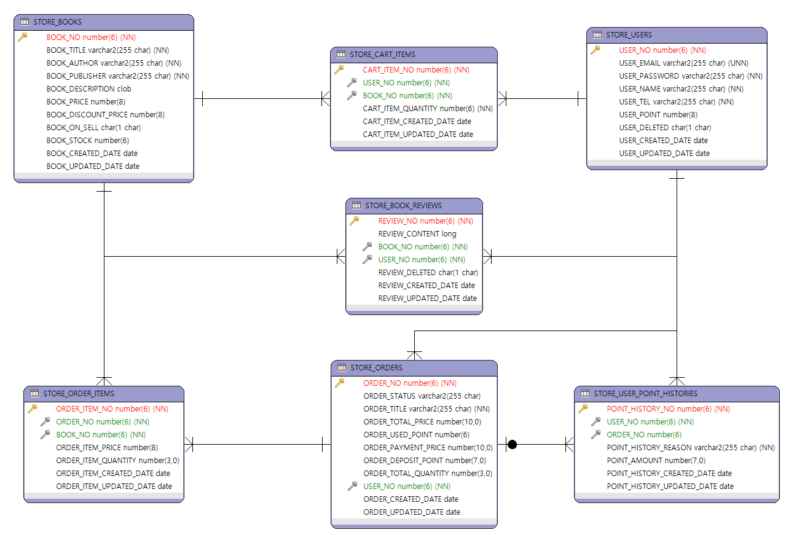

# 0427

- [0427](#0427)
- [퀴즈](#퀴즈)
- [실습 준비](#실습-준비)
- [조인](#조인)
  - [등가 조인](#등가-조인)
  - [비등가 조인](#비등가-조인)
  - [셀프 조인](#셀프-조인)
- [퀴즈 2](#퀴즈-2)
  - [중복제거 GROUP BY vs DISTINCT](#중복제거-group-by-vs-distinct)

<small><i><a href='http://ecotrust-canada.github.io/markdown-toc/'>Table of contents generated with markdown-toc</a></i></small>


# 퀴즈
```sql
---------------------------------------------------------------------------------------------------
-- 퀴즈
---------------------------------------------------------------------------------------------------
-- 시스템의 현재 날짜와 시간정보를 dual테이블을 이용해서 조회하기
SELECT SYSDATE
FROM DUAL;

-- 시스템의 현재 날짜와 시간정보 중에서 년-월-일 정보만 dual 테이블을 이용해서 조회하기
SELECT TO_CHAR(SYSDATE, 'YYYY/MM/DD')
FROM DUAL;

-- 직원들의 급여를 기준으로 급여를 13%인상했을 때 직원아이디, 이름, 급여, 13% 인상된 급여, 인상된 급여와 기존급여의 차이를 조회하기
-- * 계산결과에서 소수점 이하는 버린다.
SELECT EMPLOYEE_ID, FIRST_NAME, SALARY, TRUNC(SALARY*1.13), TRUNC(SALARY*1.13)-SALARY
FROM EMPLOYEES;

-- 2007년에 입사한 직원들의 직원아이디, 이름, 입사일을 조회하기
SELECT EMPLOYEE_ID, FIRST_NAME, HIRE_DATE
FROM EMPLOYEES
WHERE TO_CHAR(HIRE_DATE, 'YYYY') = 2007;

SELECT EMPLOYEE_ID, FIRST_NAME, HIRE_DATE
FROM EMPLOYEES
WHERE HIRE_DATE >= '2007.01.01' AND HIRE_DATE < '2008-01-01';

-- 2005년에 입사한 직원들 중에서 커미션을 받는 직원들의 직원아이디, 이름, 입사일, 급여, 연봉을 조회하기
-- * 연봉 = 급여*12 + 급여*커미션*12다.
-- * 연봉 계산결과는 일의 자리로 반올림한다.
SELECT EMPLOYEE_ID, FIRST_NAME, HIRE_DATE, SALARY, ROUND(SALARY*12 + SALARY*NVL(COMMISSION_PCT, 0)*12) YEAR_SAL
FROM EMPLOYEES;

SELECT EMPLOYEE_ID, FIRST_NAME, HIRE_DATE, SALARY, ROUND(SALARY*12 + SALARY*COMMISSION_PCT*12) YEAR_SAL
FROM EMPLOYEES
WHERE HIRE_DATE >= '2005.01.01' AND HIRE_DATE < '2006-01-01'
AND COMMISSION_PCT IS NOT NULL;

-- CASE ~ WHEN을 이용해서 직원들을 급여를 기준으로 등급을 조회하기
-- 급여가 20000이상: A, 15000이상: B, 10000이상 C, 그 외는 D등급
-- 직원아이디, 이름, 급여, 급여등급을 조회
SELECT EMPLOYEE_ID, FIRST_NAME, SALARY,
    CASE
        WHEN SALARY >= 20000 THEN 'A'
        WHEN SALARY >= 15000 THEN 'B'
        WHEN SALARY >= 10000 THEN 'C'
        ELSE 'D'
    END AS RANK
FROM EMPLOYEES;

-- 80번 부서에 근무하는 직원들의 직원아이디, 이름, 입사일, 입사일 기준 근무개월수를 조회한다.
-- 근무개월수는 입사일로부터 오늘까지의 개월수다. 소숫점이하는 버린다.
-- 근무개월수를 기준으로 내림차순 정렬한다.
SELECT EMPLOYEE_ID, FIRST_NAME, HIRE_DATE, TRUNC(MONTHS_BETWEEN(SYSDATE, HIRE_DATE)) MONTHS
FROM EMPLOYEES
WHERE DEPARTMENT_ID = 80
ORDER BY MONTHS DESC;

-- 100번 직원이 자신의 매니저로 지정된 직원들 중에서 커미션을 받는 직원들의 직원아이디, 이름, 급여, 커미션을 조회하기
SELECT EMPLOYEE_ID, FIRST_NAME, SALARY, NVL(COMMISSION_PCT,0) COM
FROM EMPLOYEES
WHERE MANAGER_ID = 100 AND COMMISSION_PCT != 0;

-- 100번 직원이 자신의 매니저로 지정된 직원의 수를 조회하기
SELECT COUNT(*)
FROM EMPLOYEES
WHERE MANAGER_ID = 100;

SELECT FIRST_NAME, MANAGER_ID
FROM EMPLOYEES
WHERE MANAGER_ID = 100;

-- 50번 부서에 근무하는 직원들의 아이디, 이름, 직종아이디, 직종최저급여, 직종최고급여, 직종중간급여, 해당 직원의 급여와 중간급여의 갭을 조회하기
-- 직종중간급여는 (직종최고급여+직종최저급여)/2 다.
-- 급여갭의 자신의 급여에서 직종중간급여를 뺀 값이다.
SELECT E.EMPLOYEE_ID, E.FIRST_NAME, E.JOB_ID, E.SALARY,
    J.MAX_SALARY, J.MIN_SALARY, (J.MAX_SALARY + J.MIN_SALARY)/2,
    E.SALARY - ((J.MAX_SALARY + J.MIN_SALARY)/2)
FROM EMPLOYEES E, JOBS J
WHERE E.DEPARTMENT_ID = 50
AND E.JOB_ID = J.JOB_ID;

```

# 실습 준비
* DB 차후 실습을 위한 서점앱 테이블 생성 및 일부 데이터 삽입
```sql
CREATE TABLE STORE_BOOKS
(
	BOOK_NO number(6) NOT NULL,
	BOOK_TITLE varchar2(255 char) NOT NULL,
	BOOK_AUTHOR varchar2(255 char) NOT NULL,
	BOOK_PUBLISHER varchar2(255 char) NOT NULL,
	BOOK_DESCRIPTION clob,
	BOOK_PRICE number(8),
	BOOK_DISCOUNT_PRICE number(8),
	BOOK_ON_SELL char(1 char) DEFAULT 'Y',
	BOOK_STOCK number(6),
	BOOK_CREATED_DATE date DEFAULT SYSDATE,
	BOOK_UPDATED_DATE date,
	CONSTRAINT STORE_BOOK_NO_PK PRIMARY KEY (BOOK_NO)
);


CREATE TABLE STORE_BOOK_REVIEWS
(
	REVIEW_NO number(6) NOT NULL,
	REVIEW_CONTENT long,
	BOOK_NO number(6) NOT NULL,
	USER_NO number(6) NOT NULL,
	REVIEW_DELETED char(1 char) DEFAULT 'N',
	REVIEW_CREATED_DATE date DEFAULT SYSDATE,
	REVIEW_UPDATED_DATE date,
	CONSTRAINT STORE_REVIEW_NO_PK PRIMARY KEY (REVIEW_NO)
);


CREATE TABLE STORE_CART_ITEMS
(
	CART_ITEM_NO number(6) NOT NULL,
	USER_NO number(6) NOT NULL,
	BOOK_NO number(6) NOT NULL,
	CART_ITEM_QUANTITY number(6) NOT NULL,
	CART_ITEM_CREATED_DATE date DEFAULT SYSDATE,
	CART_ITEM_UPDATED_DATE date,
	CONSTRAINT STORE_CART_ITEM_NO_PK PRIMARY KEY (CART_ITEM_NO)
);


CREATE TABLE STORE_ORDERS
(
	ORDER_NO number(6) NOT NULL,
	ORDER_STATUS varchar2(255 char) DEFAULT '결재완료',
	ORDER_TITLE varchar2(255 char) NOT NULL,
	ORDER_TOTAL_PRICE number(10,0),
	ORDER_USED_POINT number(6),
	ORDER_PAYMENT_PRICE number(10,0),
	ORDER_DEPOSIT_POINT number(7,0),
	ORDER_TOTAL_QUANTITY number(3,0),
	USER_NO number(6) NOT NULL,
	ORDER_CREATED_DATE date DEFAULT SYSDATE,
	ORDER_UPDATED_DATE date,
	CONSTRAINT STORE_ORDER_NO_PK PRIMARY KEY (ORDER_NO)
);


CREATE TABLE STORE_ORDER_ITEMS
(
	ORDER_ITEM_NO number(6) NOT NULL,
	ORDER_NO number(6) NOT NULL,
	BOOK_NO number(6) NOT NULL,
	ORDER_ITEM_PRICE number(8),
	ORDER_ITEM_QUANTITY number(3,0),
	ORDER_ITEM_CREATED_DATE date DEFAULT SYSDATE,
	ORDER_ITEM_UPDATED_DATE date,
	CONSTRAINT STORE_ORDER_ITEM_NO_PK PRIMARY KEY (ORDER_ITEM_NO)
);


CREATE TABLE STORE_USERS
(
	USER_NO number(6) NOT NULL,
	USER_EMAIL varchar2(255 char) NOT NULL UNIQUE,
	USER_PASSWORD varchar2(255 char) NOT NULL,
	USER_NAME varchar2(255 char) NOT NULL,
	USER_TEL varchar2(255 char) NOT NULL,
	USER_POINT number(8) DEFAULT 0,
	USER_DELETED char(1 char) DEFAULT 'N',
	USER_CREATED_DATE date DEFAULT SYSDATE,
	USER_UPDATED_DATE date,
	CONSTRAINT STORE_USER_NO_PK PRIMARY KEY (USER_NO)
);


CREATE TABLE STORE_USER_POINT_HISTORIES
(
	POINT_HISTORY_NO number(6) NOT NULL,
	USER_NO number(6) NOT NULL,
	ORDER_NO number(6),
	POINT_HISTORY_REASON varchar2(255 char) NOT NULL,
	POINT_AMOUNT number(7,0),
	POINT_HISTORY_CREATED_DATE date DEFAULT SYSDATE,
	POINT_HISTORY_UPDATED_DATE date,
	CONSTRAINT STORE_POINTHISTORY_NO_PK PRIMARY KEY (POINT_HISTORY_NO)
);


ALTER TABLE STORE_BOOK_REVIEWS
	ADD CONSTRAINT STORE_REVIEW_BOOK_NO_FK FOREIGN KEY (BOOK_NO)
	REFERENCES STORE_BOOKS (BOOK_NO)
;


ALTER TABLE STORE_CART_ITEMS
	ADD CONSTRAINT STORE_CARTITEM_BOOK_NO_FK FOREIGN KEY (BOOK_NO)
	REFERENCES STORE_BOOKS (BOOK_NO)
;


ALTER TABLE STORE_ORDER_ITEMS
	ADD CONSTRAINT STORE_ORDERITEM_BOOK_NO_FK FOREIGN KEY (BOOK_NO)
	REFERENCES STORE_BOOKS (BOOK_NO)
;


ALTER TABLE STORE_ORDER_ITEMS
	ADD CONSTRAINT STORE_ORDERITEM_ORDER_NO_FK FOREIGN KEY (ORDER_NO)
	REFERENCES STORE_ORDERS (ORDER_NO)
;


ALTER TABLE STORE_USER_POINT_HISTORIES
	ADD CONSTRAINT STORE_POINTHISTORY_ORDER_NO_FK FOREIGN KEY (ORDER_NO)
	REFERENCES STORE_ORDERS (ORDER_NO)
;


ALTER TABLE STORE_BOOK_REVIEWS
	ADD CONSTRAINT STORE_REVIEW_USER_NO_FK FOREIGN KEY (USER_NO)
	REFERENCES STORE_USERS (USER_NO)
;


ALTER TABLE STORE_CART_ITEMS
	ADD CONSTRAINT STORE_CARTITEM_USER_NO_FK FOREIGN KEY (USER_NO)
	REFERENCES STORE_USERS (USER_NO)
;


ALTER TABLE STORE_ORDERS
	ADD CONSTRAINT STORE_ORDER_USER_NO_FK FOREIGN KEY (USER_NO)
	REFERENCES STORE_USERS (USER_NO)
;


ALTER TABLE STORE_USER_POINT_HISTORIES
	ADD CONSTRAINT STORE_POINTHISTORY_USER_NO_FK FOREIGN KEY (USER_NO)
	REFERENCES STORE_USERS (USER_NO)
;

CREATE SEQUENCE STORE_BOOKS_SEQ START WITH 110000 NOCACHE;
CREATE SEQUENCE STORE_BOOKREVIEWS_SEQ START WITH 120000 NOCACHE;
CREATE SEQUENCE STORE_CARTITEMS_SEQ START WITH 130000 NOCACHE;
CREATE SEQUENCE STORE_ORDERITEMS_SEQ START WITH 140000 NOCACHE;
CREATE SEQUENCE STORE_ORDERS_SEQ START WITH 150000 NOCACHE;
CREATE SEQUENCE STORE_POINTHISTORIES_SEQ START WITH 160000 NOCACHE;
CREATE SEQUENCE STORE_USERS_SEQ START WITH 170000 NOCACHE;


insert into store_books (book_no, book_title, book_author,book_publisher, book_description, book_price, book_discount_price,  book_stock)
values (store_books_seq.nextval, '불편한 편의점', '김호연', '남우편의자', '2013년 세계문학상 우수상 수상작 『망원동 브라더스』로 데뷔한 후 일상적 현실을 위트 있게 그린 경쾌한 작품과 인간의 내밀한 욕망을 기발한 상상력으로 풀어낸 스릴러 장르를 오가며 독자적인 작품 세계를 쌓아올린 작가 김호연. 그의 다섯 번째 장편소설 『불편한 편의점』이 출간되었다. 『불편한 편의점』은 청파동 골목 모퉁이에 자리 잡은 작은 편의점을 무대로 힘겨운 시대를 살아가는 우리 이웃들의 삶의 속내와 희로애락을 따뜻하고 유머러스하게 담아낸 작품이다', 15000, 13500,  20);
insert into store_books (book_no, book_title, book_author,book_publisher, book_description, book_price, book_discount_price,  book_stock)
values (store_books_seq.nextval, '물고기는 존재하지 않는다.', '룰러 밀러', '곰출판', '‘방송계의 퓰리처상’으로 불리는 피버디상(Peabody Awards)을 수상한 과학 전문기자 룰루 밀러의 경이로운 논픽션 《물고기는 존재하지 않는다》는 여러 언론 매체에서 ‘2020년 최고의 책’으로 선정할 만큼 수많은 찬사를 받은 화제의 베스트셀러다. 집착에 가까울 만큼 자연계에 질서를 부여하려 했던 19세기 어느 과학자의 삶을 흥미롭게 좇아가는 이 책은 어느 순간 독자들을 혼돈의 한복판으로 데려가서 우리가 믿고 있던 삶의 질서에 관해 한 가지 의문을 제기한다. ', 16500, 14850,  20);
insert into store_books (book_no, book_title, book_author,book_publisher, book_description, book_price, book_discount_price,  book_stock)
values (store_books_seq.nextval, '세븐 테크', '김기명,김상균', '지식하우스', '인공지능, 블록체인, 가상현실, 로봇, 사물인터넷, 클라우드 컴퓨팅, 그리고 메타버스까지! 디지털 혁명의 필수교양을 위해 각 분야 최고 전문가 8인이 한자리에 모였다. 당신은 이것들이 어떻게 연결되는지, 세상을 어떻게 바꿀지 정말 알고 있는가?', 18000, 16200,  20);
insert into store_books (book_no, book_title, book_author,book_publisher, book_description, book_price, book_discount_price,  book_stock)
values (store_books_seq.nextval, '웰 씽킹 WEALTHINKINGS', '켈리 최', '다산북스', '지방의 가난한 농가에서 태어난 흙수저 중의 흙수저, 열여섯 나이에 낮엔 소녀공으로 밤엔 야간 고등학교로 주경야독, 난독증이 심해 제대로 읽을 수 없는 삶, 사업 실패로 남은 건 10억 원의 빚. 그런 그녀에게 어떤 희망이 있었을까? 차라리 죽는 게 더 낫다고 생각한 날들의 연속이었다. 하지만 몇 년 뒤, 그녀는 6천 개의 일자리를 창출하고 세계 12개국 30개가 넘는 비즈니스와 계열사를 거느린 글로벌 기업 회장으로 다시 태어났다', 16000, 14400,  20);
insert into store_books (book_no, book_title, book_author,book_publisher, book_description, book_price, book_discount_price,  book_stock)
values (store_books_seq.nextval, '잘 살아라 그게 최고의 복수다.', '권민창', '마인드셋', '힘들게 살아가지만, 결코 포기하지는 않는. 누군가가 좋은 조언을 하거나 해결책을 제시해주면 그 조언과 해결책을 스펀지처럼 흡수해 자신의 인생에 적용하고 발전할 준비가 될 잠재력이 충만한 사람들을 위한 권민창 작가의 냉정하고도 현실적인 인생 조언. 인생 전반의 다양한 고민들을 갖고 힘들게 살아가는 사람들을 위해, 그 고민들을 해결하기 위한 방법들을 담은 ‘인생 공략집’이다', 15000, 13500,  20);
insert into store_books (book_no, book_title, book_author,book_publisher, book_description, book_price, book_discount_price,  book_stock)
values (store_books_seq.nextval, '달러구트 꿈 백화점 합본호', '이미예', '패토리나인', '한국형 판타지의 새로운 장르를 연 이미예 작가의 판타지 소설 『달러구트 꿈 백화점』이 1, 2권 통합 100만 부 판매를 기념해 특별 합본호로 출간됐다. 지난 2020년 7월, 1권 출간 이후 ‘힐링 판타지’라는 찬사를 받은 이 책은 2021년 7월, 2권 출간 직후부터 베스트셀러 1위를 차지하며 독자들의 사랑을 입증하였으며 출간 후 1년 4개월 만에 1, 2권 통합 100만 부를 판매하는 기록을 세웠다.', 23000, 20700,  20);
insert into store_books (book_no, book_title, book_author,book_publisher, book_description, book_price, book_discount_price,  book_stock)
values (store_books_seq.nextval, '돈의 심리학', '모건 하우징', '인플루엔셜', '월스트리트저널에서 10년 넘게 금융과 투자에 대한 글을 써온 칼럼니스트이자 콜라보레이티브 펀드 파트너로 활동중인 모건 하우절의 첫 책이다. 출간 즉시 아마존 투자 분야 1위를 차지했고 개인 투자자부터 전문 컨설턴트까지 극찬 세례를 받으며 명실상부 ‘2020 아마존 최고의 금융도서’로 평가받는다.', 19500, 17550,  20);
insert into store_books (book_no, book_title, book_author,book_publisher, book_description, book_price, book_discount_price,  book_stock)
values (store_books_seq.nextval, '부자 아빠 가난한 아빠', '로버트 기요사키', '민음인', '1997년 미국에서 처음 출간된 이래 전 세계 51가지 언어로 109개국에서 출판되어 4000만 부(국내 350만 부)가 판매된 경제경영 재테크 분야 최고의 밀리언셀러 ‘부자 아빠 가난한 아빠’ 시리즈. 20년의 세월을 통해 검증된 부자들의 돈과 투자에 대한 지침들과 오늘날의 시대상에 맞춘 새로운 정보들이 추가된 『부자 아빠 가난한 아빠 20주년 특별 기념판』이 ㈜민음인에서 출간되었다. ', 16000, 14400,  20);
insert into store_books (book_no, book_title, book_author,book_publisher, book_description, book_price, book_discount_price,  book_stock)
values (store_books_seq.nextval, '진짜 쓰는 실무 엑셀', '전진권', '제이펍', '오랜 시간 엑셀은 수많은 발전을 거듭하였고, Office 365에서 Microsoft 365로 브랜드명을 변경하기까지 다양한 기능, 특히 동적 배열 함수가 추가되면서 매크로를 사용하지 않고도 많은 부분을 해결할 수 있도록 개선되었다. 이 책에서 소개하는 제대로 된 실무 활용 기능을 익힌다면 방대한 데이터에서 특정 자료를 취합하고 분석하기, 분석된 자료를 한눈에 보기 좋게 시각화하기, 반복되는 작업을 효율적으로 개선하기 등 회사에서 원하는 엑셀 사용 능력을 충분히 뛰어넘을 수 있을 것이다.', 21000, 18900,  20);
insert into store_books (book_no, book_title, book_author,book_publisher, book_description, book_price, book_discount_price,  book_stock)
values (store_books_seq.nextval, '미드나잇 라이브러리', '매트 헤이그', '인플루엔셜', '매트 헤이그의 소설 『미드나잇 라이브러리』는 2021년 4월 출간 이후 10개월 만에 30만 독자의 마음을 사로잡으며 눈물과 웃음, 가슴 뭉클한 감동을 선사하고 있다. 죽기로 결심한 주인공 ‘노라 시드’가 삶과 죽음 사이에 존재하는 미스터리한 도서관 ‘미드나잇 라이브러리’에서 눈을 뜨며 인생의 두 번째 기회를 얻는 이 소설은, 노라의 가장 완벽한 삶을 찾는 모험을 따라가며 ‘살아 있음’과 ‘살아가는 것’에 대한 깊은 통찰을 보여준다.', 15000, 13500,  20);
insert into store_books (book_no, book_title, book_author,book_publisher, book_description, book_price, book_discount_price,  book_stock)
values (store_books_seq.nextval, '이상한 과자 가게 전천당', '히로시마 레이코', '길벗스쿨', '여느 날과 다름없이 행운의 동전을 가진 손님들이 전천당을 찾아온다. 열대 과일을 너무 좋아하는 아이는 〈열대 붕어빵〉을, 잘 맞는 옷을 쉽게 고르고 싶은 남자는 〈딱 맞아 땅콩〉을, 좋은 친구를 사귀고 싶은 학생은 〈베프 측정기〉를 고르는 등 간절한 소원이 담긴 물건들을 하나씩 고른다.', 11500, 10350,  20);
insert into store_books (book_no, book_title, book_author,book_publisher, book_description, book_price, book_discount_price,  book_stock)
values (store_books_seq.nextval, '서울 수도권 아파트 지금 사야 합니다.', '함태식', '황금부엉이', '2014년 하반기부터 오르기 시작한 부동산 시장은 지금까지 8년째 상승세를 이어오고 있다. 덕분에 ‘이미 고점에 다다랐는데 지금 사면 상투를 잡는 것’이라며 폭락론을 내놓는 전문가도 상당히 많다. 그들의 말대로라면 PIR(소득 대비 주택가격 비율)이 사상 최고치여서, 금리 인상으로 대출자의 부담이 늘어서, 세금 폭탄에 못 이긴 매물들이 쏟아질 거라서 곧 부동산가격이 폭락할 것만 같다. 이 책의 저자이자 부동산 유튜버 ‘얼음공장’은 시장의 방향을 결정하는 건 금리 인상이나 정부 정책이 아닌 수요와 공급이라고 강력하게 말한다.', 19500, 17550,  20);
insert into store_books (book_no, book_title, book_author,book_publisher, book_description, book_price, book_discount_price,  book_stock)
values (store_books_seq.nextval, 'ETS 토익 정기시험 기출문제집 1000 READING', 'ETS', 'YBM', '이 책에는 정기시험 기출문제 7세트와 ETS 토익 예상문제 3세트가 수록되어 있다. 시험에 나온 토익 문제로 실전 감각을 키우고, 동일한 난이도의 예상문제로 시험에 확실하게 대비하자! ETS 예상문제도 실제 시험과 동일한 문항 유형 및 난이도 등 기출과 싱크로율 100% 스펙을 특징으로 한다.', 18000, 16200,  20);
insert into store_books (book_no, book_title, book_author,book_publisher, book_description, book_price, book_discount_price,  book_stock)
values (store_books_seq.nextval, '럭키 드로우', '드로우 앤드류', '다산북스', '20대의 드로우앤드류가 끝이 보이지 않던 무기력을 빠져나와 30대가 되어 자신만의 일을 찾기까지 무수히 당겨온 ‘레버’들을 엮은 첫 번째 책. 우연히 발견한 인턴십 포스터를 보곤 충동적으로 미국 LA에 날아가 디자인 일을 시작한 이후부터 다시 한국에 돌아와 거액의 연봉을 거절하고 상위 1% 밀레니얼 프리워커로 거듭나기까지의 모든 이야기를 담았다', 16000, 14400,  20);
insert into store_books (book_no, book_title, book_author,book_publisher, book_description, book_price, book_discount_price,  book_stock)
values (store_books_seq.nextval, 'ETS 토익 정기시험 기출문제집 1000 LISTENING', 'ETS', 'YBM', '이 책에는 정기시험 기출문제 7세트와 ETS 예상문제 3세트가 수록되어 있다. 시험에 나온 토익 문제로 실전 감각을 키우고, 동일한 난이도의 예상문제로 시험에 확실하게 대비하자! ETS 예상문제도 실제 시험과 동일한 성우, 문항 유형 및 난이도 등 기출문제와 싱크로율 100% 스펙을 특징으로 한다.', 18000, 16200,  20);
insert into store_books (book_no, book_title, book_author,book_publisher, book_description, book_price, book_discount_price,  book_stock)
values (store_books_seq.nextval, '해커스 토익 기출 보카', '데이비드 조', '해커스어학연구소', '주제별 연상암기로 쉽고 재미있게 단어 학습이 가능하며 최신 기출 단어 및 출제포인트 수록했다. 목표 점수대별 필수 단어로 맞춤 학습을 할 수 있으며 출제율 높은 핵심 단어만 골라 효율적으로 학습할 수 있다. 토익 신유형 대비 [토익 필수 이디엄 표현]을 수록했고 실전 감각을 키우는 토익 실전문제 13회분을 제공(교재 3회+온라인 10회)한다.', 12000, 10800,  20);
insert into store_books (book_no, book_title, book_author,book_publisher, book_description, book_price, book_discount_price,  book_stock)
values (store_books_seq.nextval, '오늘 밤, 세계에서 이 사랑이 사라진다 해도', '이치조 미사키', '모모', '밤에 자고 일어나면 기억이 리셋되는 ‘선행성 기억상실증’을 앓는 소녀 히노 마오리와 무미건조한 인생을 살고 있는 평범한 고등학생 가미야 도루의 풋풋하고 애틋한 사랑 이야기. 선행성 기억상실증이라는 익숙한 소재를 매우 수준 높은 청춘 소설로 탄생시켰다는 극찬을 받으며 제26회 전격소설대상 ‘미디어워크스문고상’을 수상한 이 작품은 간질간질한 청춘의 로맨스를 전혀 예측할 수 없는 국면으로 끌고 가, 깐깐하고 엄격한 심사위원 모두를 눈물 흘리게 만들었다는 흥미로운 뒷이야기를 남긴 소설이기도 하다.', 14000, 12600,  20);
insert into store_books (book_no, book_title, book_author,book_publisher, book_description, book_price, book_discount_price,  book_stock)
values (store_books_seq.nextval, '고양이 해결사 깜냥 4', '홍민정', '창비', '출간 즉시 어린이 분야 1위를 기록한 화제의 베스트셀러 『고양이 해결사 깜냥』이 네 번째 책으로 돌아왔다. 겨울을 맞은 떠돌이 고양이 깜냥이 매서운 추위를 피해 향한 곳은 시내의 자그마한 눈썰매장이다. 깜냥은 야간 근무 중인 안전 요원 덕분에 따뜻한 하룻밤을 보낸다. 그런데 다음 날, 눈썰매장에 성가신 일들이 하나씩 터진다. 깜냥은 고양이 해결사로서 능력을 톡톡히 발휘할 수 있을까?', 10000, 9000,  20);
insert into store_books (book_no, book_title, book_author,book_publisher, book_description, book_price, book_discount_price,  book_stock)
values (store_books_seq.nextval, '돈의 속성', '김승호', '스노우폭스북스', '2020년 베스트셀러 종합 1위! 경제경영 17주 연속 1위! 깨어있는 독자들이 선택한 2021년 최장기 베스트셀러! 『돈의 속성』 200쇄 돌파 기념, 추가 메시지를 담다! 최상위 부자 김승호가 말하는 돈에 대한 통찰과 철학 이 책은 초판 발행 후, 경제경영 필도서로 자리매김한 『돈의 속성』 200쇄 기념 개정증보판이다. 200쇄에 맞춰 코로나19로 바뀐 경제상황과 돈에 관한 김승호 회장의 추가 메시지를 담았다.', 18000, 16200,  20);
insert into store_books (book_no, book_title, book_author,book_publisher, book_description, book_price, book_discount_price,  book_stock)
values (store_books_seq.nextval, '오은영의 화해', '오은영', '코리아닷컴', '겉으로는 아무렇지도 않은 듯 살아가지만, 우리 모두는 마음속에 자신을 찌르는 가시를 안고 살아간다. 우리 중 누구도 아프지 않은 사람이 있을까? 부모와 자녀, 그 절대적인 관계 속에서도 때론 미움이, 고통이, 원망이, 그리고 죄책감이 자라나 내면에 해결되지 않은 상처로 남기도 한다. 그 상처 때문에 많은 사람이 이유도 모르는 채 삶이 고통스럽고 버거움에 힘겨워한다.', 16000, 14400,  20);
insert into store_books (book_no, book_title, book_author,book_publisher, book_description, book_price, book_discount_price,  book_stock)
values (store_books_seq.nextval, '나태주, 시간의 쉼표', '나태주', '서울문화사', '짧고, 쉽고, 단출한 글자만으로 우리의 마음에 큰 위로를 전하는 이 시대 가장 따뜻한 시인, 나태주의 글과 그림으로 구성된 일력이 출간되었다. 작은 탁상달력 형태인 이 책은 1월 1일부터 12월 31일까지의 숫자가 나태주 시인의 손글씨로 적혀 있어, 시인 특유의 친근한 온정을 그대로 느낄 수 있게 한다. 한국인이 사랑하는 시집 『꽃을 보듯 너를 본다』, 『혼자서도 별인 너에게』 등에 수록된 주옥같은 시들 중 그날그날에 어울리는 시구들을 정선하여 구성했다.', 17000, 15300,  20);
insert into store_books (book_no, book_title, book_author,book_publisher, book_description, book_price, book_discount_price,  book_stock)
values (store_books_seq.nextval, '잘했고 잘하고 있고 잘 될 것이다', '정영욱', '부크럼', '『참 애썼다 그것으로 되었다』 『나를 사랑하는 연습』 등 이전 도서를 통해 40만 부가량의 판매량을 기록한 에세이 작가 정영욱의 새로운 책이 출간되었다. 작가 정영욱은 이번 책을 통해 당신의 과거와 현재, 그리고 미래를 응원한다. 책을 통해 연결되어 있는 우리는 서로의 얼굴을 알지 못한다. 나이도 성별도, 심지어 이름조차 알지 못한다. 하지만 아무것도 모르기에 예측할 수 있는 것들이 있다. ', 15000, 13500,  20);
insert into store_books (book_no, book_title, book_author,book_publisher, book_description, book_price, book_discount_price,  book_stock)
values (store_books_seq.nextval, '종목 선정 나에게 물어봐', '김정수', '하음출판사', '년 동안 12번의 깡통, 누적 손절매액 11억 원, 하루 최대 손절매액 5억 4천만 원, 코로나 사태로 인한 주가 대폭락 시 손절매액 3억 6천만 원… 그러나 2020년 6월 매매 재개 후 매월 흑자 실현, 2021년 13억 이익 실현! 그 기법이 궁금하다면?9년 동안 5백만 개 이상 차트 판독, 9년 동안 5만 건 이상 실제 매매, 하루 최대 매매 건수 191건, 하루 차트 1000개 이상 판독, 1초에 차트 1개 판독!불사조 김정수의 『종목 선정 나에게 물어봐』가 답이다', 26000, 23400,  20);

insert into store_users(user_no, user_email, user_password, user_name, user_tel)
values(store_users_seq.nextval, 'hong-gd@gmail.com', 'zxcv1234', '홍길동', '010-1111-1111');
insert into store_users(user_no, user_email, user_password, user_name, user_tel)
values(store_users_seq.nextval, 'kim-ys@gmail.com', 'zxcv1234', '김유신', '010-1111-1111');
insert into store_users(user_no, user_email, user_password, user_name, user_tel)
values(store_users_seq.nextval, 'kang-gc@gmail.com', 'zxcv1234', '강감찬', '010-1111-1111');
insert into store_users(user_no, user_email, user_password, user_name, user_tel)
values(store_users_seq.nextval, 'lee-ss@gmail.com', 'zxcv1234', '이순신', '010-1111-1111');
insert into store_users(user_no, user_email, user_password, user_name, user_tel)
values(store_users_seq.nextval, 'ryu-ks@gmail.com', 'zxcv1234', '류관순', '010-1111-1111');

insert into store_cart_items(cart_item_no, user_no, book_no, cart_item_quantity)
values(store_cartitems_seq.nextval, 170000, 110000, 1);
insert into store_cart_items(cart_item_no, user_no, book_no, cart_item_quantity)
values(store_cartitems_seq.nextval, 170000, 110001, 1);
insert into store_cart_items(cart_item_no, user_no, book_no, cart_item_quantity)
values(store_cartitems_seq.nextval, 170000, 110002, 1);

insert into store_cart_items(cart_item_no, user_no, book_no, cart_item_quantity)
values(store_cartitems_seq.nextval, 170001, 110004, 1);
insert into store_cart_items(cart_item_no, user_no, book_no, cart_item_quantity)
values(store_cartitems_seq.nextval, 170001, 110005, 1);
insert into store_cart_items(cart_item_no, user_no, book_no, cart_item_quantity)
values(store_cartitems_seq.nextval, 170001, 110011, 2);

insert into store_cart_items(cart_item_no, user_no, book_no, cart_item_quantity)
values(store_cartitems_seq.nextval, 170002, 110017, 1);
insert into store_cart_items(cart_item_no, user_no, book_no, cart_item_quantity)
values(store_cartitems_seq.nextval, 170002, 110018, 1);
insert into store_cart_items(cart_item_no, user_no, book_no, cart_item_quantity)
values(store_cartitems_seq.nextval, 170002, 110005, 1);
insert into store_cart_items(cart_item_no, user_no, book_no, cart_item_quantity)
values(store_cartitems_seq.nextval, 170002, 110009, 2);

insert into store_cart_items(cart_item_no, user_no, book_no, cart_item_quantity)
values(store_cartitems_seq.nextval, 170003, 110008, 1);
insert into store_cart_items(cart_item_no, user_no, book_no, cart_item_quantity)
values(store_cartitems_seq.nextval, 170003, 110009, 1);

insert into store_cart_items(cart_item_no, user_no, book_no, cart_item_quantity)
values(store_cartitems_seq.nextval, 170004, 110007, 1);
insert into store_cart_items(cart_item_no, user_no, book_no, cart_item_quantity)
values(store_cartitems_seq.nextval, 170004, 110004, 2);


commit;


```



# 조인
## 등가 조인
```SQL
---------------------------------------------------------------------------------------------------
-- 등가 조인
---------------------------------------------------------------------------------------------------

-- 200번 직원이 부서관리자로 지정된 부서에 소속된 사원들의 아이디, 이름, 직종을 조회하기
-- 200번 직원이 부서관리조로 지정된 부서는 10번 부서다.
-- DEPARTMENTS의 DEPARTMENT_ID가 10인 행과 
-- EMPLOYEES 테이블에서 DEPARTMENT_ID가 10번으로 지정된 행을 
-- 연결해서 하나의 행으로 만들어야 한다.
SELECT E.EMPLOYEE_ID, E.FIRST_NAME, E.JOB_ID
FROM EMPLOYEES E, DEPARTMENTS D
WHERE D.MANAGER_ID = 200
AND E.DEPARTMENT_ID = D.DEPARTMENT_ID;

-- 100번 직원이 부서관리자로 지정된 부서의 아이디, 부서이름, 관리자의 이름을 조회하기
-- 100번 직원이 부서관리자로 지정된 부서는 90부서, EXECUTIVE부서다.
-- 100번 직원의 이름은 EMPLOYEES 테이블에 있다.
-- DEPARTMENTS의 MANAGER_ID가 100인 행과 EMPLOYEES의 EMPLOYEE_ID가 100인 행을 연결해서 하나의 행으로 만들고,
-- DEPARTMENTS부분에서는 부서아이디와 부서이름, EMPLOYEES부분에서 이름을 조회한다.
SELECT D.DEPARTMENT_ID, D.DEPARTMENT_NAME, E.FIRST_NAME 
FROM EMPLOYEES E, DEPARTMENTS D
WHERE D.MANAGER_ID = 100
AND E.EMPLOYEE_ID = D.MANAGER_ID;

-- 부서테이블에서 부서 관리자가 지정된 부서의 부서아이디, 부서이름, 관리자 이름을 조회하기
-- D                D                       D          D        E
SELECT D.DEPARTMENT_ID, D.DEPARTMENT_NAME, E.FIRST_NAME
FROM DEPARTMENTS D, EMPLOYEES E
WHERE D.MANAGER_ID IS NOT NULL
AND D.MANAGER_ID = E.EMPLOYEE_ID
ORDER BY D.DEPARTMENT_ID;

-- 급여를 10000이상 받는 직원의 아이디, 이름, 직종제목, 급여, 소속부서명을 조회하기
-- E                        E        E      J       E       D
SELECT E.EMPLOYEE_ID, E.FIRST_NAME, J.JOB_TITLE, E.SALARY, D.DEPARTMENT_NAME
FROM EMPLOYEES E, JOBS J, DEPARTMENTS D
WHERE E.SALARY >= 10000
AND E.JOB_ID = J.JOB_ID
AND E.DEPARTMENT_ID = D.DEPARTMENT_ID
ORDER BY E.EMPLOYEE_ID;

-- 급여를 10000이상 받는 직원의 아이디, 이름, 급여, 소속부서명, 근무지 도시명을 조회하기
-- E                        E         E    E       D          L
SELECT E.EMPLOYEE_ID, E.FIRST_NAME, E.SALARY, D.DEPARTMENT_NAME, L.CITY
FROM EMPLOYEES E, DEPARTMENTS D, LOCATIONS L
WHERE E.SALARY >= 10000
AND E.DEPARTMENT_ID = D.DEPARTMENT_ID
AND D.LOCATION_ID = L.LOCATION_ID
ORDER BY E.EMPLOYEE_ID;

-- 급여를 10000이상 받는 직원의 아이디, 이름, 직종제목, 소속부서명, 근무지 도시명을 조회하기
-- E                        E       E       J       D           L
SELECT E.EMPLOYEE_ID, E.FIRST_NAME, J.JOB_TITLE, D.DEPARTMENT_NAME, L.CITY
FROM EMPLOYEES E, JOBS J, DEPARTMENTS D, LOCATIONS L
WHERE E.SALARY >= 10000
AND E.JOB_ID = J.JOB_ID
AND E.DEPARTMENT_ID = D.DEPARTMENT_ID
AND D.LOCATION_ID = L.LOCATION_ID
ORDER BY E.EMPLOYEE_ID;

```

## 비등가 조인
```SQL
---------------------------------------------------------------------------------------------- 
-- 비등가 조인
----------------------------------------------------------------------------------------------
CREATE TABLE SALARY_GRADE (
    GRADE CHAR(1) PRIMARY KEY,
    MIN_SALARY NUMBER(8,2),
    MAX_SALARY NUMBER(8,2)
);

INSERT INTO SALARY_GRADE(GRADE, MIN_SALARY, MAX_SALARY) VALUES('A', 25000, 50000);
INSERT INTO SALARY_GRADE(GRADE, MIN_SALARY, MAX_SALARY) VALUES('B', 15000, 24999);
INSERT INTO SALARY_GRADE(GRADE, MIN_SALARY, MAX_SALARY) VALUES('C', 7000, 14999);
INSERT INTO SALARY_GRADE(GRADE, MIN_SALARY, MAX_SALARY) VALUES('D', 3000, 6999);
INSERT INTO SALARY_GRADE(GRADE, MIN_SALARY, MAX_SALARY) VALUES('E', 0, 2999);
COMMIT;

-- 급여가 10000이상인 직원들의 직원아이디, 이름, 급여, 급여등급 조회하기
-- E                            E       E    E      S
SELECT E.EMPLOYEE_ID, E.FIRST_NAME, E.SALARY, S.GRADE
FROM EMPLOYEES E, SALARY_GRADE S
WHERE E.SALARY >= 10000 
AND E.SALARY >= S.MIN_SALARY AND E.SALARY <= S.MAX_SALARY
ORDER BY E.EMPLOYEE_ID;

-- 급여 등급이 'C'나 'D'등급에 속하는 직원들의 아이디, 이름, 급여, 급여등급을 조회하기
SELECT E.EMPLOYEE_ID, E.FIRST_NAME, E.SALARY, S.GRADE
FROM EMPLOYEES E, SALARY_GRADE S
WHERE E.SALARY >= S.MIN_SALARY AND E.SALARY <= S.MAX_SALARY
AND S.GRADE IN ('C', 'D')
ORDER BY E.EMPLOYEE_ID;

-- 부서 관리자가 지정된 부서의 부서아이디, 부서명, 관리자명, 급여, 급여등급을 조회하기
--      D                       D      D        E       E       S
SELECT D.DEPARTMENT_ID, D.DEPARTMENT_NAME, E.FIRST_NAME, E.SALARY, S.GRADE, E.LAST_NAME
FROM DEPARTMENTS D, EMPLOYEES E, SALARY_GRADE S
WHERE D.MANAGER_ID IS NOT NULL
AND E.EMPLOYEE_ID = D.MANAGER_ID
AND E.SALARY >= S.MIN_SALARY AND E.SALARY <= MAX_SALARY
ORDER BY D.DEPARTMENT_ID;

-- 직종아이디, 직종최저급여, 직종최저급여의 등급, 직종최고급여, 직종최고급여의 등급
-- J               J            S1              J           S2
SELECT J.JOB_ID, J.MIN_SALARY, S1.GRADE AS MIN_GRADE , J.MAX_SALARY, S2.GRADE AS MAX_GRADE
FROM JOBS J, SALARY_GRADE S1, SALARY_GRADE S2
WHERE J.MIN_SALARY >= S1.MIN_SALARY AND J.MIN_SALARY <= S1.MAX_SALARY
AND  J.MAX_SALARY >= S2.MIN_SALARY AND J.MAX_SALARY <= S2.MAX_SALARY;

```

## 셀프 조인
```SQL
--------------------------------------------------------------------------------------------
-- 셀프 조인
-- 테이블 한 개로 조인을 하는 것
-- 같은 테이블을 2개 준비하고, 하나는 자식레코드가 있는 테이블, 하나는 부모레코드가 있는 테이블로 역할을 나눈다.
--------------------------------------------------------------------------------------------
-- 사원아이디, 사원이름, 해당 사원을 관리하는 관리자 아이디, 관리자 이름을 조회하기
--      E1      E1                          E2             E2
SELECT EMP.EMPLOYEE_ID EMP_ID,
    EMP.FIRST_NAME EMP_NAME,
    MGR.EMPLOYEE_ID MGR_ID,
    MGR.FIRST_NAME MGR_NAME
FROM EMPLOYEES EMP, EMPLOYEES MGR
WHERE EMP.MANAGER_ID = MGR.EMPLOYEE_ID
ORDER BY EMP.EMPLOYEE_ID;
```

# 퀴즈 2
```SQL
-- 부서아이디, 부서명, 해당 부서가 위치한 소재지 도시명을 조회하기
SELECT D.DEPARTMENT_ID, D.DEPARTMENT_NAME, L.CITY
FROM DEPARTMENTS D, LOCATIONS L
WHERE D.LOCATION_ID = L.LOCATION_ID
ORDER BY D.DEPARTMENT_ID;

-- 급여를 5000이하로 받는 직원의 아이디, 이름, 급여, 직종제목을 조회하기
SELECT E.EMPLOYEE_ID, E.FIRST_NAME, E.SALARY, J.JOB_TITLE
FROM EMPLOYEES E, JOBS J
WHERE E.SALARY <= 5000
AND E.JOB_ID = J.JOB_ID
ORDER BY E.EMPLOYEE_ID;

-- 급여를 5000이하로 받는 직원의 아이디, 이름, 급여, 직종제목, 소속부서명을 조회하기
SELECT E.EMPLOYEE_ID, E.FIRST_NAME, E.SALARY, J.JOB_TITLE, D.DEPARTMENT_NAME
FROM EMPLOYEES E, JOBS J, DEPARTMENTS D
WHERE E.SALARY <= 5000
AND E.JOB_ID = J.JOB_ID
AND E.DEPARTMENT_ID = D.DEPARTMENT_ID
ORDER BY E.EMPLOYEE_ID;

-- 급여를 5000이상 10000이하로 받고, 50이나 80번 부서에서 근무중인 직원의 아이디, 이름, 급여, 직종제목을 조회하기
SELECT E.EMPLOYEE_ID, E.FIRST_NAME, E.SALARY, J.JOB_TITLE
FROM EMPLOYEES E, JOBS J
WHERE E.SALARY >= 5000 AND E.SALARY <= 10000
AND E.DEPARTMENT_ID IN (50, 80)
AND E.JOB_ID = J.JOB_ID
ORDER BY E.EMPLOYEE_ID;

-- 부서아이디, 부서명, 해당 부서가 위치한 소재지 도시명, 해당 도시가 위치한 나라이름 조회하기
SELECT D.DEPARTMENT_ID, D.DEPARTMENT_NAME, L.CITY, C.COUNTRY_NAME
FROM DEPARTMENTS D, LOCATIONS L, COUNTRIES C
WHERE D.LOCATION_ID = L.LOCATION_ID
AND L.COUNTRY_ID = C.COUNTRY_ID
ORDER BY D.DEPARTMENT_ID;

-- 'Oxford'에서 근무중인 직원아이디, 직원이름을 조회하기
SELECT E.EMPLOYEE_ID, E.FIRST_NAME, L.CITY
FROM EMPLOYEES E, DEPARTMENTS D, LOCATIONS L
WHERE L.CITY = 'Oxford'
AND E.DEPARTMENT_ID = D.DEPARTMENT_ID
AND D.LOCATION_ID = L.LOCATION_ID;

-- 부서 관리자가 지정되어 있는 부서의 부서아이디, 부서명, 부서관리자 아이디, 부서관리자 이름, 부서관리자의 직종아이디를 조회하기
-- << 오답해설 >>
SELECT D.DEPARTMENT_ID, D.DEPARTMENT_NAME, D.MANAGER_ID, E.FIRST_NAME, E.JOB_ID
FROM DEPARTMENTS D, EMPLOYEES E
WHERE D.MANAGER_ID IS NOT NULL
AND D.MANAGER_ID = E.EMPLOYEE_ID
ORDER BY D.DEPARTMENT_ID;

-- 급여를 3000이하로 받는 사원들이 근무중인 부서이름을 중복없이 조회하기
SELECT D.DEPARTMENT_NAME
FROM DEPARTMENTS D, EMPLOYEES E
WHERE E.SALARY <= 3000
AND E.DEPARTMENT_ID = D.DEPARTMENT_ID
GROUP BY D.DEPARTMENT_NAME;
-- << 추가정답 >>
SELECT DISTINCT D.DEPARTMENT_NAME
FROM DEPARTMENTS D, EMPLOYEES E
WHERE E.SALARY <= 3000
AND E.DEPARTMENT_ID = D.DEPARTMENT_ID;

-- 관리자의 급여 등급이 B등급인 관리자가 관리하는 직원의 아이디, 직원이름을 조회하기
-- << 오답해설 >>
SELECT E.EMPLOYEE_ID, E.FIRST_NAME
FROM EMPLOYEES M, EMPLOYEES E, SALARY_GRADE S
WHERE M.SALARY >= S.MIN_SALARY AND E.SALARY <= S.MAX_SALARY
AND S.GRADE = 'B'
AND M.EMPLOYEE_ID = E.MANAGER_ID
ORDER BY E.EMPLOYEE_ID;

-- 커미션을 받는 모든 직원의 아이디, 이름, 급여, 연봉, 소속부서명을 조회하기
-- 연봉 = 급여*12 + 급여*커미션*12
SELECT E.EMPLOYEE_ID, E.FIRST_NAME, E.SALARY, E.SALARY*12 + E.SALARY*E.COMMISSION_PCT*12 AS YEAR_SAL, D.DEPARTMENT_NAME
FROM EMPLOYEES E, DEPARTMENTS D
WHERE E.COMMISSION_PCT IS NOT NULL
AND E.DEPARTMENT_ID = D.DEPARTMENT_ID;

-- 직원중에서 자신의 관리자보다 먼저 입사한 직원의 아이디, 직원이름, 직원의 입사일, 관리자의 이름, 관리자의 입사일 조회하기
SELECT EMP.EMPLOYEE_ID EMP_ID,
    EMP.FIRST_NAME AS EMP_NAME,
    EMP.HIRE_DATE EMP_HIRE_DATE,
    MGR.FIRST_NAME MGR_NAME,
    MGR.HIRE_DATE MGR_HIRE_DATE
FROM EMPLOYEES EMP, EMPLOYEES MGR
WHERE EMP.HIRE_DATE - MGR.HIRE_DATE < 0
AND MGR.EMPLOYEE_ID = EMP.MANAGER_ID
ORDER BY EMP.EMPLOYEE_ID;

-- 직원아이디, 직원이름, 직종제목, 급여, 급여등급, 소속부서명, 근무지도시명, 관리자이름을 조회하기
SELECT EMP.EMPLOYEE_ID EMP_ID, EMP.FIRST_NAME EMP_NAME, J.JOB_TITLE J_TITME, EMP.SALARY EMP_SAL, S.GRADE S_GRADE, D.DEPARTMENT_NAME DEPT_NAME, L.CITY CITY, MGR.FIRST_NAME MGR_NAME
FROM EMPLOYEES EMP, JOBS J, SALARY_GRADE S, DEPARTMENTS D, LOCATIONS L, EMPLOYEES MGR
WHERE EMP.JOB_ID = J.JOB_ID
AND EMP.SALARY >= S.MIN_SALARY AND EMP.SALARY <= S.MAX_SALARY
AND EMP.DEPARTMENT_ID = D.DEPARTMENT_ID
AND D.LOCATION_ID = L.LOCATION_ID
AND EMP.MANAGER_ID = EMP.EMPLOYEE_ID
ORDER BY EMP.EMPLOYEE_ID;

```
* 마지막 3문제 풀이 예정

## 중복제거 GROUP BY vs DISTINCT
* DISTINCT : 중복 제거
* GROUP BY : 중복 제거 + 정렬