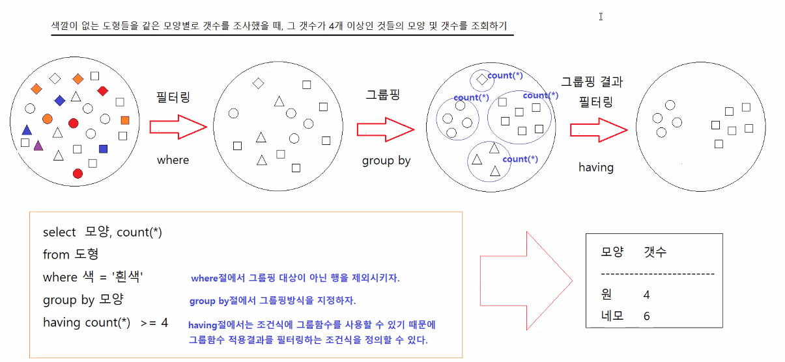

# 0428

- [0428](#0428)
- [퀴즈 2](#퀴즈-2)
- [조인](#조인)
  - [포괄조인](#포괄조인)
- [그룹함수](#그룹함수)
  - [HAVING](#having)

<small><i><a href='http://ecotrust-canada.github.io/markdown-toc/'>Table of contents generated with markdown-toc</a></i></small>


# 퀴즈 2
* 마지막 3문제 
```sql
-- 커미션을 받는 모든 직원의 아이디, 이름, 급여, 연봉, 소속부서명을 조회하기
-- 연봉 = 급여*12 + 급여*커미션*12
SELECT E.EMPLOYEE_ID,
       E.FIRST_NAME,
       E.SALARY,
       E.SALARY*12 + E.SALARY*E.COMMISSION_PCT*12 AS YEAR_SAL,
       D.DEPARTMENT_NAME
FROM EMPLOYEES E, DEPARTMENTS D
WHERE E.COMMISSION_PCT IS NOT NULL
AND E.DEPARTMENT_ID = D.DEPARTMENT_ID
ORDER BY E.EMPLOYEE_ID;

-- 직원중에서 자신의 관리자보다 먼저 입사한 직원의 아이디, 직원이름, 직원의 입사일, 관리자의 이름, 관리자의 입사일 조회하기
SELECT EMP.EMPLOYEE_ID   EMP_ID,
       EMP.FIRST_NAME    EMP_NAME,
       EMP.HIRE_DATE     EMP_HIRE_DATE,
       MGR.FIRST_NAME    MGR_NAME,
       MGR.HIRE_DATE     MGR_HIRE_DATE
FROM EMPLOYEES EMP, EMPLOYEES MGR
WHERE MGR.EMPLOYEE_ID = EMP.MANAGER_ID
AND EMP.HIRE_DATE < MGR.HIRE_DATE
ORDER BY EMP.EMPLOYEE_ID;

-- 직원아이디, 직원이름, 직종제목, 급여, 급여등급, 소속부서명, 근무지도시명, 관리자이름을 조회하기
--    E1        E1       J      E1      S        D           L          E2
SELECT EMP.EMPLOYEE_ID      EMP_ID,
       EMP.FIRST_NAME       EMP_NAME,
       J.JOB_TITLE          J_TITME,
       EMP.SALARY           EMP_SAL,
       S.GRADE              S_GRADE,
       D.DEPARTMENT_NAME    DEPT_NAME,
       L.CITY               CITY,
       MGR.FIRST_NAME       MGR_NAME
FROM EMPLOYEES EMP, JOBS J, SALARY_GRADE S, DEPARTMENTS D, LOCATIONS L, EMPLOYEES MGR
WHERE EMP.JOB_ID = J.JOB_ID
AND EMP.SALARY >= S.MIN_SALARY AND EMP.SALARY <= S.MAX_SALARY
AND EMP.DEPARTMENT_ID = D.DEPARTMENT_ID(+)
AND D.LOCATION_ID = L.LOCATION_ID(+)
AND EMP.MANAGER_ID = MGR.EMPLOYEE_ID(+)
ORDER BY EMP.EMPLOYEE_ID;
```

# 조인
## 포괄조인
```sql
---------------------------------------------------------------------------------------------------------------
---------------------------------------------------------------------------------------------------------------
-- 포괄조인(Outer 조인)
-- 테이블을 조인했을 때 연결된 행이 없는 행도 조회할 수 있게 하는 조인
-- 한쪽 테이블에는 데이터가 있고, 다른쪽 테이블에는 데이터가 없는 경우에 데이터가 있는 쪽 테이블의 내용을 전부 조회하는 조인방법이다.
---------------------------------------------------------------------------------------------------------------

-- 부서아이디, 부서명, 부서관리자 아이디, 부서관리자이름을 조회하기
SELECT D.DEPARTMENT_ID, D.DEPARTMENT_NAME, D.MANAGER_ID, E.EMPLOYEE_ID, E.FIRST_NAME, E.LAST_NAME
FROM DEPARTMENTS D, EMPLOYEES E 
WHERE D.MANAGER_ID = E.EMPLOYEE_ID(+)
ORDER BY D.DEPARTMENT_ID;

-- 직종아이디가 'SA_REP'이고 급여를 5000이상 70000이하로 받는 직원의 아이디, 이름, 급여, 소속부서명을 조회하기
SELECT E.EMPLOYEE_ID, E.FIRST_NAME, E.SALARY, E.DEPARTMENT_ID, D.DEPARTMENT_ID, D.DEPARTMENT_NAME
FROM EMPLOYEES E, DEPARTMENTS D
WHERE E.JOB_ID = 'SA_REP'
AND E.SALARY >= 5000 AND E.SALARY <= 7000
AND E.DEPARTMENT_ID = D.DEPARTMENT_ID(+)
ORDER BY E.EMPLOYEE_ID;

-- 직종아이디가 'SA_REP'이고 급여를 5000이상 70000이하로 받는 직원의 아이디, 이름, 급여, 소속부서명, 부서 소재지 주소를 조회하기
SELECT E.EMPLOYEE_ID, E.FIRST_NAME, E.SALARY, E.DEPARTMENT_ID, 
       D.DEPARTMENT_ID, D.DEPARTMENT_NAME, D.LOCATION_ID,
       L.LOCATION_ID, L.STREET_ADDRESS
FROM EMPLOYEES E, DEPARTMENTS D, LOCATIONS L
WHERE E.JOB_ID = 'SA_REP'
AND E.SALARY >= 5000 AND E.SALARY <= 7000
AND E.DEPARTMENT_ID = D.DEPARTMENT_ID (+)
AND D.LOCATION_ID = L.LOCATION_ID (+)
ORDER BY E.EMPLOYEE_ID;


```


# 그룹함수
```sql
------------------------------------------------------------------------------------------------------------------------
------------------------------------------------------------------------------------------------------------------------
-- 그룹함수
-- 행그룹(테이블 전체, 조회된 행 전체, 같은 값을 가지고 있는 행끼리 그룹핑했을 때 각각의 그룹들)에 대해서 결과를 하나 반환하는 함수 
------------------------------------------------------------------------------------------------------------------------

-- 행그룹이 테이블 전체인 경우 - 행그룹이 하나여서 조회결과가 한 행이 조회된다.
SELECT COUNT(*)
FROM EMPLOYEES;

SELECT SUM(SALARY)
FROM EMPLOYEES;

-- 행그룹이 조회된 행 전체인 경우 - 행그룹이 하나여서 조회결과가 한 행이 조회된다.
SELECT COUNT(*)
FROM EMPLOYEES
WHERE SALARY < 10000;

SELECT AVG(SALARY)
FROM EMPLOYEES
WHERE SALARY < 10000;

-- 같은 값을 가지고 있는 행끼리 그룹핑을 하는 경우 - 행그룹이 여러 개여서 조회결과가 여러 행이 조회된다.
SELECT COUNT(*)
FROM EMPLOYEES
GROUP BY DEPARTMENT_ID;

SELECT COUNT(*)
FROM DEPARTMENTS
GROUP BY LOCATION_ID;

-- 행그룹을 생성하기 위해서 GROUP BY 절에 사용했던 컬럼명 혹은 표현식만 SELECT절에서 그룹함수와 같이 사용할 수 있다.
-- 소재지별 부서갯수를 조회하기
SELECT LOCATION_ID, COUNT(*)
FROM DEPARTMENTS
GROUP BY LOCATION_ID;

-- 소속부서가 있는 직원들을 소속부서아이디별 사원수 조회하기
SELECT DEPARTMENT_ID, COUNT(*)
FROM EMPLOYEES
WHERE DEPARTMENT_ID IS NOT NULL
GROUP BY DEPARTMENT_ID
ORDER BY DEPARTMENT_ID ASC;

-- 입사년도별 사원수 조회하기
SELECT TO_CHAR(HIRE_DATE, 'YYYY') YEAR, COUNT(*)
FROM EMPLOYEES
GROUP BY TO_CHAR(HIRE_DATE, 'YYYY')
ORDER BY YEAR;

-- 급여등급별 사원수 조회하기
-- 사원테이블과 급여등급테이블을 조인하고, 급여등급테이블의 등급이 같은 행끼리 행그룹을 생성
SELECT S.GRADE, COUNT(*) GRADE_CNT
FROM EMPLOYEES E, SALARY_GRADE S
WHERE E.SALARY >= S.MIN_SALARY AND E.SALARY <= S.MAX_SALARY
GROUP BY S.GRADE
ORDER BY S.GRADE;
-- 위의 급여등급별 사원수 조회하기의 값을 가상의 테이블 X로 
SELECT Y.GRADE, NVL(X.GRADE_CNT, 0) CNT
FROM X, SALARY_GRADE Y
WHERE X.GRADE(+) = Y.GRADE
ORDER BY Y.GRADE ASC;
-- SQL문의 실행결과를 가상의 테이블 X 로 간주하고 SALARY_GRADE와 조인하기
SELECT Y.GRADE, NVL(X.GRADE_CNT, 0) CNT
FROM (SELECT S.GRADE, COUNT(*) GRADE_CNT
      FROM EMPLOYEES E, SALARY_GRADE S
      WHERE E.SALARY >= S.MIN_SALARY AND E.SALARY <= S.MAX_SALARY
      GROUP BY S.GRADE) X, SALARY_GRADE Y
WHERE X.GRADE(+) = Y.GRADE
ORDER BY Y.GRADE ASC;

-- 입사년도별 사원수를 조회했을 때 입사한 사원수가 20명이상으로 입사한 해와 그 해에 입사한 사원수를 조회하기
SELECT TO_CHAR(HIRE_DATE, 'YYYY') YEAR, COUNT(*) YEAR_HIRED_CNT
FROM EMPLOYEES
GROUP BY TO_CHAR(HIRE_DATE, 'YYYY')
HAVING COUNT(*) >= 20
ORDER BY YEAR;

-- 부서별로 먼저 그룹핑하고, 같은 부서내에서 직종별로 다시 그룹핑해서 직종별 사원수 조회
SELECT DEPARTMENT_ID, JOB_ID, COUNT(*)
FROM EMPLOYEES
WHERE DEPARTMENT_ID IN (50, 80)
GROUP BY DEPARTMENT_ID, JOB_ID
ORDER BY DEPARTMENT_ID ASC, JOB_ID ASC;

-- 부서별로 먼저 그룹핑하고, 같은 부서내에서 직종별로 다시 그룹핑해서 직종별 사원수, 부서별 사원수, 전체 사원수 조회
-- ROLLUP(컬럼명1, 컬럼명2) : 컬럼명1로 먼저 그룹핑하고 같은 그룹안에서 컬럼명2로 그룹핑한 다음 
-- 전체합계, 컬럼명1의 그룹에 대한 소계, 컬럼명2 소그룹에 대한 결과 제공한다.
SELECT DEPARTMENT_ID, JOB_ID, COUNT(*)
FROM EMPLOYEES
WHERE DEPARTMENT_ID IN (50, 80)
GROUP BY ROLLUP(DEPARTMENT_ID, JOB_ID)
ORDER BY DEPARTMENT_ID ASC, JOB_ID ASC;

-- 부서별로 직종별로 각각 그룹핑해서 부서별 사원수, 직종별 사원수 조회하기
-- GROUPING SETS(컬럼명, 컬럼명) : 제시된 컬럼명으로 각각 따로 그룹핑해서 그룹함수 적용한 결과를 제공한다.
SELECT DEPARTMENT_ID, JOB_ID, COUNT(*)
FROM EMPLOYEES
WHERE DEPARTMENT_ID IN (50, 80)
GROUP BY GROUPING SETS(DEPARTMENT_ID, JOB_ID)
ORDER BY DEPARTMENT_ID ASC, JOB_ID ASC;

-- 부서별 급여 총액, 급여 평균을 조회하기
-- 부서아이디, 부서명, 부서급여 총액, 부서급여 평균을 조회한다.
SELECT E.DEPARTMENT_ID, D.DEPARTMENT_NAME, SUM(E.SALARY) DEPT_TOTAL_SALARY, TRUNC(AVG(E.SALARY)) DETP_AVG_SALARY
FROM EMPLOYEES E, DEPARTMENTS D
WHERE E.DEPARTMENT_ID IS NOT NULL
AND E.DEPARTMENT_ID = D.DEPARTMENT_ID
GROUP BY E.DEPARTMENT_ID, D.DEPARTMENT_NAME
ORDER BY E.DEPARTMENT_ID;

```
## HAVING
* HAVING절은 GROUP BY 뒤에 쓰이며 그루핑된 결과를 필터링할 때 사용한다.


