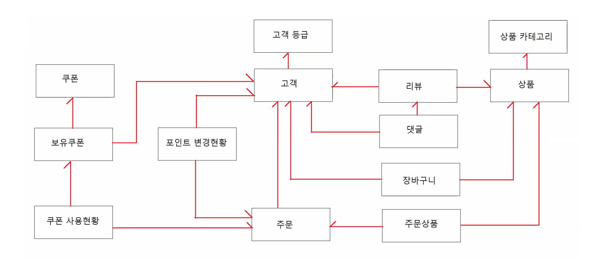

# 0502

- [0502](#0502)
- [무결성 제약조건](#무결성-제약조건)
  - [NOT NULL 제약조건](#not-null-제약조건)
  - [UNIQUE 제약조건](#unique-제약조건)
  - [PRIMARY KEY 제약조건](#primary-key-제약조건)
  - [FOREIGN KEY 제약조건](#foreign-key-제약조건)
  - [CHECK 제약조건](#check-제약조건)
- [데이터 모델링](#데이터-모델링)
  - [주요 내용](#주요-내용)
  - [ERD](#erd)
    - [실습 - store 테이블만들기](#실습---store-테이블만들기)
  - [ERMaster](#ermaster)
    - [실습 - 이클릡스에 ERMASTER 설치하기](#실습---이클릡스에-ermaster-설치하기)
    - [실습 - ERMaster](#실습---ermaster)
    - [실습 - 내보내기 가져오기](#실습---내보내기-가져오기)
    - [실습 - 테이블 생성 및 제약조건 직접설정](#실습---테이블-생성-및-제약조건-직접설정)

<small><i><a href='http://ecotrust-canada.github.io/markdown-toc/'>Table of contents generated with markdown-toc</a></i></small>


# 무결성 제약조건
* 테이블에 유효하지 않은 데이터가 입력되는 것을 방지한다.
* 해당 테이블에 데이터가 추가, 삭제, 변경될 때마다 무결성 제약조건을 검사한다.

* 컬럼 레벨 제약조건, 테이블 레벨 제약조건
  ```SQL
  -- 컬럼 레벨
  CREATE TABLE 테이블명 ( 
    컬럼명 데이터타입 [CONSTRAINT 제약조건별칭] 제약조건,
    컬럼명 데이터타입 [CONSTRAINT 제약조건별칭] 제약조건,
  ...
  );

  -- 테이블 레벨
  CREATE TABLE 테이블명 (
    컬럼명 데이터타입,
    컬럼명 데이터타입,
    ...,
    [CONSTRAINT 제약조건별칭] 제약조건 (컬럼명),
    [CONSTRAINT 제약조건별칭] 제약조건 (컬럼명, 컬럼명, ...)
  );
  
  -- 하나 이상의 컬럼을 조합하여 제약조건을 정의할 수 있다.
  -- NOT NULL 제약조건을 제외한 모든 제약조건을 정의할 수 있다.
  ```


## NOT NULL 제약조건
* 해당 컬럼에 NULL이 입력되지 못하도록 한다.
```SQL
CREATE TABLE users (
    user_name varchar2(30) NOT NULL,
    user_tel varchar2(20) CONSTRAINT user_tel_nn NOT NULL,
    ...
  );

  -- NOT NULL 제약조건이 정의되지 않은 컬럼은 기본적으로 NULL 값을 가질 수 있다.
```
* 별칭을 따로 지정하지 않아도 시스템 오류메세지에서 위치와 내용을 쉽게 확인할 수 있어서 지정하지 않는 편이다.

## UNIQUE 제약조건
* 해당 컬럼의 값은 테이블 전체에서 고유한 값을 가져야 한다.
```SQL
 CREATE TABLLE users (
    user_name varchar2(30),
    user_tel varchar2(20) CONSTRAINT user_tel_nn NOT NULL,
    user_email varchar2(200) CONSTRAINT user_email_uk UNIQUE,
    ...,
    CONSTRAINT user_tel_uk UNIQUE(user_tel)
  );
  
  -- user_tel 컬럼은 NOT NULL, UNIQUE 제약조건이 정의되어 있음
  -- user_tel의 NOT NULL제약조건은 컬럼 레벨 제약조건 방식으로 정의 UNIQUE제약조건은 테이블 레벨 제약조건 방식으로 정의했음
  -- user_email 컬럼은 UNIQUE 제약조건이 정의되어 있음, NULL값이 허용됨
```
* 

## PRIMARY KEY 제약조건
* 테이블 전체에서 고유하게 식별할 수 있는 NULL이 허용되지 않는 값을 가져야 한다.
```SQL
  CREATE TABLE users (
    user_no number(10) CONSTRAINT user_no_pk PRIMAY KEY,
    ...
  );
  
  CREATE TABLE users (
    user_no number(10),
    ...,
    CONSTRAINT user_no_pk PRIMARY KEY(user_no)
  );
  
  CREATE TABLE course_registerations (
    stud_no number(10),
    course_no number(5),
    ...,
    CONSTRAINT course_regist_pk PRIMARY KEY(stud_no, course_no)
  );
  
  -- 하나 이상의 열을 조합해서 기본키 제약조건 정의하기
```

## FOREIGN KEY 제약조건
* 해당 컬럼의 값은 다른 테이블 혹은 같은 테이블의 특정 컬럼의 값과 관련된 (참조된) 값만 가져야 한다.
```SQL
  CREATE TABLE emps(
    ...
    dept_id number(10) CONSTRAINT emp_dept_id_fk REFERENCES depts(dept_id),
    ...
  );
  -- emps 테이블의 dept_id 컬럼의 값은 depts테이블의 dept_id 값을 참조한다.

  CREATE TABLE emps(
    ...
    dept_id number(10),
    ...,
    CONSTRAINT emp_dept_id_fk FOREIGN KEY (dept_id) REFERENCES depts(dept_id),
  );
  -- REFERENCES 키워드와 참조대상테이블(컬럼명)을 지정한다.
  -- 참조대상 컬럼은 PRIMARY KEY 혹은 UNIQUE 제약조건이 정의된 컬럼만 가능하다.
```

## CHECK 제약조건
* 제시된 조건을 만족하는 값을 가져야 한다.
  * 성별은 M, F중 하나여야 한다.

```SQL
  CREATE TABLE products (
    ...
    pro_price number(10) CONSTRAINT pro_price_ck CHECK (pro_price > 0),
    pro_sell varchar2(20) CONSTRAINT pro_sell_ck CHECK (pro_sell in ('판매중', '재고부족', '절판')),
    pro_discount number(4, 3) CONSTRAINT pro_discount_ck CHECK (pro_discount >= 0.0 and pro_discount <= 0.5),
  );
```

# 데이터 모델링
* 정보화 시스템을 구축할 때 어떤 데이터가 존재하는지, 실제 업무에 필요한 정보는 무엇인지 분석하는 작업
* 분석한 정보의 내용을 파악하기 적절한 표기법으로 표현하는 것
* ER(Entity Relation) 다이어그램으로 표현한다.
## 주요 내용
* 엔티티
  * 업무에 필요한 정보를 저장하고 관리하기 위해 반드시 존재해야 하는 것
  * DB의 테이블에 해당된다.
  * 특징
    * 시스템 구축에 반드시 필요한 정보
    * 유일한 식별자에 의해 식별이 가능한 정보
    * 반드시 속성(컬럼)을 포함하고 있어야 한다.
    * 다른 엔티티와 최소 한 개 이상의 관계를 맺고 있다.
      * 1:N, N:N 관계
  * 종류 
    * 기본 엔티티
      * 업무를 위해 원래 존재해야 하는 정보
      * 다른 엔티티의 부모역할을 수행
      * 예시 : 부서정보, 카테고리정보, 고객등급정보, 직종정보 등 원래부터 있어야 하는 정보(잘 변하지 않음)
    * 중심 엔티티
      * 기본 엔티티로부터 발생되고, 업무의 중심역할을 수행
      * 데이터량이 가장 많다.
      * 다른 중심 엔티티와의 관계를 통해서 행위 엔티티를 생성한다.
      * 예시 : 고객, 상품
        * 고객이 장바구니에 담으면 장바구니 정보가 늘어난다.
        * 고객이 리뷰를 쓰면 리뷰 정보가 늘어난다.
        * 고객이 주문을 하면 주문정보가 늘어난다.
    * 행위 엔티티
      * 두개 이상의 부모 엔티티로부터 발생된다.
      * 내용이 자주 변경되고, 데이터량이 증가된다.
      * 예시 : 리뷰, 장바구니, 주문
* 속성
  * 엔티티에서 관리하고자 하는 더 이상 분리되지 않는 최소 단위의 데이터
  * 엔티티는 속성을 하나 이상 가진다.
  * 예시 : 사용자이름, 사용자아이디, 사용자비밀번호 등 (사용자 테이블의 컬럼)
* 식별자
  * 각각의 엔티티를 구분할 수 있는 값
  * 모든 엔티티는 반드시 하나 이상의 식별자가 있어야 한다.
* 관계
  * 두 엔티티 사이의 논리적인 관계
  * 데이터 모델이 가지는 관계가 업무의 흐름을 나타낸다.
  * 관계의 카디널리티(Cardinality)
    * 두 엔티티간의 관계에서 참여자의 수를 표현하는 것
    * 일반적으로 1:1, 1:N, N:N 으로 표현한다.
      * 1:1 관계
        * 구매신청 -----> 구매주문 (1:1)
          * 한 개의 구매신청에 대해서 한 개의 구매주문을 신청한다.
        * 구매신청 <----- 구매주문 (1:1)
          * 한 개의 구매주문을 위해서 한 개 구매신청을 작성한다.
      * 1:M 관계
        * 사원 -----> 부서 (1:1)
          * 한 명의 사원의 한 부서에 소속된다.
        * 사원 <----- 부서 (N:1)
          * 한 부서는 여러 명의 사원을 포함한다.
      * M:N 관계
        * 학생 -----> 개설과정 (1:N)
          * 한 학생의 여러 개설과정을 수강신청한다.
      * 학생 <----- 개설과정 (N:1)
          * 하나의 개설과정을 수강하는 학생은 여러 명이다.
    * **M에 해당되는 쪽이 자식 또는 외래키가 있는 것이다.**
      * 사원쪽에 부서의 외래키가 있다. 
      * 사원테이블의 부서아이디는 외래키이다.

## ERD
* ERD는 개체-관계 다이어그램으로 DB상에서 데이터들을 담고 있는 테이블들의 관계를 표현하는 그림라고 할 수 있다.

### 실습 - store 테이블만들기
* 고객, 상품, 리뷰, 댓글, 주문, 장바구니 등의 기능을 갖춘 store 앱과 과련된 개체의 구성을 작성한다.
```
고객은 
고객번호, 아이디, 비밀번호, 이름, 이메일, 전화번호, 포인트, 등급, 가입일, 최종수정일 정보로 구성되어 있다.

상품은 
상품번호, 카테고리, 이름, 제조사, 설명, 가격, 할인가격, 재고량, 판매여부, 판매지수, 리뷰평점, 리뷰갯수, 등록일, 최종수정일 정보로 구성되어 있다.

리뷰는 
리뷰번호, 상품번호, 작성자번호, 내용, 점수, 추천수, 댓글수, 등록일, 최종수정일 정보로 구성되어 있다.

댓글은 
댓글번호, 리뷰번호, 작성자번호, 내용, 등록일, 최종수정일 정보로 구성되어 있다.

상품카테고리는 
카테고리번호, 카테고리명, 상위카테고리번호 정보로 구성되어 있다.

고객등급은 
등급, 최저포인트점수, 최고포인트점수 정보로 구성되어 있다.

장바구니는 
장바구니번호, 상품번호, 수량, 고객번호, 등록일로 구성되어 있다.

주문은 
주문번호, 주문날짜, 주문상태, 주문제목, 총주문금액, 포인트사용액, 쿠폰할인액, 총할인금액, 총결재금액, 포인트적립액, 주문자번호, 등록일, 최종수정일 정보로 구성되어 있다.

주문상품은 
주문번호, 상품번호, 수량, 구매가격, 포인트적립액 정보로 구성되어 있다.

쿠폰은
구폰번호, 구폰명, 사용만료기한, 할인금액, 등록일, 최종수정일 정보로 구성되어 있다.

보유쿠폰은
구폰번호, 고객번호, 사용여부, 등록일, 최종수정일 정보로 구성되어 있다.

쿠폰사용현황
주문번호, 사용쿠폰번호, 고객번호,등록일, 최종수정일 정보로 구성되어 있다.
```
* 작성된 개체 구성을 참고해 관계를 그려볼 수 있다.



* 위의 내용들을 참고해 ERD를 작성할 수 있다.
* ERD 작성 프로그램
  * ERMaster
  * erwin
  * 등등

## ERMaster
* ERMaster를 이용해 이클립스에서 ERD( 개체 - 관계 다이어 그램 )을 작성할 수 있다.
* 다양한 DB를 선택해 작성할 수 있다.
  * 하나의 논리 데이터모델을 작성하면 여러개의 DB에 맞는 구체적인 데이터모델을 얻을 수 있다.

### 실습 - 이클릡스에 ERMASTER 설치하기
1. ERMaster 설치 파일을 다운 받는다.
    > http://ermaster.sourceforge.net/
    * 위 사이트에서 ERMASTER 설치 파일을 다운 받을 수 있다.
    * 이클립스에서 install new software 기능을 이용해 url을 입력해 다운 받을 수 있다.
    * 
2. 다운 받은 jar 파일을 c/eclipse/plugin으로 옳긴다.
3. 이클립스를 재시작한다.
4. project > new > other.. > ERMaster > 이름 설정 > DB 선택 
5. ERD 작성

### 실습 - ERMaster
DB 구축시 명령어로 하지 않고 ERD를 만들며 자동생성하는 기능을 활용한다.
* 테이블 생성 - TB_USER_GRADE, UB_USERS
* 테이블 컬럼 설정
  * 필요시 제약조건을 설정한다.
* 관계 설정
  * 1:N
    * 등급에 해당하는 사용자는 많다. 한명의 사용자는 하나의 등급을 가지고 있다. >> 1:N
    * 카테고리에는 여러개의 상품이 존재한다. 상품은 특정 카테고리에 속해 있다. >> 1:N
  * N:N
    * 1:N, 1:N으로 연결된 새 테이블(브릿지테이블)이 생성된다.
    * 사용자는 여러개의 상품을 구매할 수 있다. >> N:N >> 브릿지 테이블이 자동 생성됨 (1:N 관계가 양쪽으로 설정됨) >> REVIEW 테이블
* 참고사항
  * 내보내기 기능을 통해 excel과 같은 파일로 erd 내용을 확인할 수 있다.
* 


### 실습 - 내보내기 가져오기
* ERMaster에서 작성한 ERD를 DDL 질의문을 '내보내기' 해서 ORACLE SQL DEVELOPER에서 사용할 수 있다.
  * 
  * 제약조건 별칭의 경우 추가 실습에서 활용할 제약조건과 별칭의 이름이 겹칠 수 있으므로 지운다.
  * 문자의 경우 ''따옴표가 3개씩 작성되어 있다.
* ORACLE SQL DEVELOPER의 테이블들을 '가져오기' 해서 ERMaster에서 ERD를 작성할 수 있다.
  * 
  * 

### 실습 - 테이블 생성 및 제약조건 직접설정
```SQL
CREATE TABLE TB_USER_GRADE (
    GRADE VARCHAR2(100),
    MIN_POINT NUMBER(10),
    MAX_POINT NUMBER(10),
    
    CONSTRAINT TB_USER_GRADE_PK PRIMARY KEY (GRADE)         -- 기본키 제약조건 설정
);

CREATE TABLE TB_PRODUCT_CATEGORY (
    CATEGORY_NO NUMBER(7),
    CATEGORY_NAME VARCHAR2(100),
    
    CONSTRAINT TB_PROD_CATNO_PK PRIMARY KEY (CATEGORY_NO)   -- 기본키 제약조건 설정
);

CREATE TABLE TB_USERS (
    USER_NO NUMBER(7),
    USER_ID VARCHAR2(100) NOT NULL,                         -- NOT NULL 제약조건 설정
    USER_PASSWORD VARCHAR2(100) NOT NULL,                   -- NOT NULL 제약조건 설정
    USER_NAME VARCHAR2(100) NOT NULL,                       -- NOT NULL 제약조건 설정
    USER_EMAIL VARCHAR2(255),
    USER_POINT NUMBER(10),
    USER_GRADE VARCHAR2(100),
    USER_UPDATED_DATE DATE,
    USER_CREATED_DATE DATE DEFAULT SYSDATE,
    
    CONSTRAINT TB_USERNO_PK PRIMARY KEY(USER_NO),           -- 기본키 제약조건 설정
    CONSTRAINT TB_USERID_UK UNIQUE (USER_ID),               -- 고유키 제약조건 설정
    CONSTRAINT TB_EMAIL_UK UNIQUE (USER_EMAIL),             -- 고유키 제약조건 설정
    CONSTRAINT TB_USER_GRADE_FK FOREIGN KEY (USER_GRADE) REFERENCES TB_USER_GRADE (GRADE)   -- 외래키 제약조건 설정
);

CREATE TABLE TB_PRODUCTS (
    PRODUCT_NO NUMBER(7),
    CATEGORY_NO NUMBER(7) NOT NULL,
    PRODUCT_NAME VARCHAR2(255) NOT NULL,
    PRODUCT_MAKER VARCHAR2(255),
    PRODUCT_PRICE NUMBER(10),
    PRODUCT_DISCOUNT_PRICE NUMBER(10),
    PRODUCT_STOCK NUMBER(7),
    PRODUCT_ON_SELL CHAR(1) DEFAULT 'Y',            -- 판매여부 'Y'를 기본값으로 설정
    PRODUCT_SELL_SCORE NUMBER(10) DEFAULT 0,        -- 판매지수 0을 기본값으로 설정
    PRODUCT_REVIEW_SCORE NUMBER(3,1) DEFAULT 0.0,   -- 리뷰평점 0.0을 기본값으로 설정
    PRODUCT_REVIEW_CNT NUMBER(7) DEFAULT 0,         -- 리뷰갯수 0을 기본값으로 설정
    PRODUCT_UPDATED_DATE DATE,
    PRODUCT_CREATED_DATE DATE DEFAULT SYSDATE,
    
    CONSTRAINT TB_PRODUCTNO_PK PRIMARY KEY (PRODUCT_NO),    -- 기본키 제약조건
    CONSTRAINT TB_PROD_CATNO_FK FOREIGN KEY (CATEGORY_NO) REFERENCES TB_PRODUCT_CATEGORY (CATEGORY_NO), -- 외래키 제약조건
    CONSTRAINT TB_PROD_PRICE_CK CHECK (PRODUCT_PRICE >= 0),                 -- CHECK 제약조건
    CONSTRAINT TB_PROD_DISCOUNTPRICE_CK CHECK (PRODUCT_DISCOUNT_PRICE >=0), -- CHECK 제약조건
    CONSTRAINT TB_PROD_ONSELL_CK CHECK (PRODUCT_ON_SELL IN ('Y', 'N'))      -- CHECK 제약조건
);

CREATE TABLE COUPONS (
    COUPON_NO NUMBER(7),
    COUPON_NAME VARCHAR2(255),
    COUPON_TYPE CHAR(1) DEFAULT 'D',        -- 쿠폰타입 'D'을 기본값으로 설정, 'D'는 지정된 가격만큼 할인, 'P'는 지정된 비율만큼 할인
    COUPON_DISCOUNT NUMBER(6),
    COUPON_USE_PERIOD NUMBER(3),
    COUPON_DISABLED CHAR(1) DEFAULT 'N',    -- 쿠폰비활성화 여부 'N'을 기본값으로 설정
    COUPON_UPDATED_DATE DATE,
    COUPON_CREATED_DATE DATE DEFAULT SYSDATE,
    
    CONSTRAINT TB_COUPONNO_PK PRIMARY KEY (COUPON_NO),
    CONSTRAINT TB_COUPONTYPE_CK CHECK (COUPON_TYPE IN ('D', 'P')),
    CONSTRAINT TB_COUPONDISABLED_CK CHECK (COUPON_DISABLED IN ('Y', 'N'))
);

CREATE TABLE TB_HOLDING_COUPONS (
    COUPON_NO NUMBER(7) NOT NULL,
    USER_NO NUMBER(7) NOT NULL,
    COUPON_EXPIRY_DATE DATE,
    COUPON_EXPIRED CHAR(1) DEFAULT 'N',
    COUPON_UPDATED_DATE DATE,
    COUPON_CREATED_DATE DATE DEFAULT SYSDATE,
    
    CONSTRAINT TB_HOLD_COUPON_NO_FK FOREIGN KEY (COUPON_NO) REFERENCES TB_COUPONS (COUPON_NO),
    CONSTRAINT TB_HOLD_USER_NO_FK FOREIGN KEY (USER_NO) REFERENCES TB_USERS (USER_NO),
    CONSTRAINT TB_HOLD_COUPON_PK PRIMARY KEY (COUPON_NO, USER_NO),
    CONSTRAINT TB_HOLD_EXPIRED_CH CHECK (COUPON_EXPIRED IN ('Y', 'N'))
);

```
* 직접 SQL문을 작성해 테이블을 생성하고 제약조건을 설정하는 것도 프로그램 자체 기능이 부족한 점들이 시시때떄로 생길 수 있으므로 장점이 있다.
* 결론적으로 프로그램의 자동생성 기능과 직접 작성하는 방식을 혼용해서 사용하게 되므로 두 방법다 익숙해질 필요가 있다.