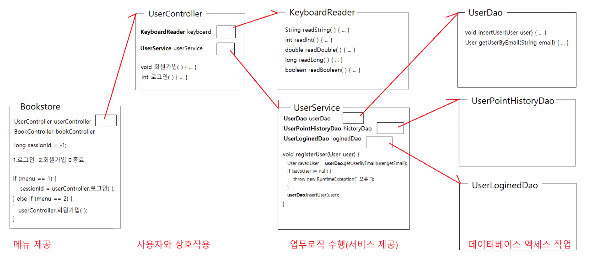
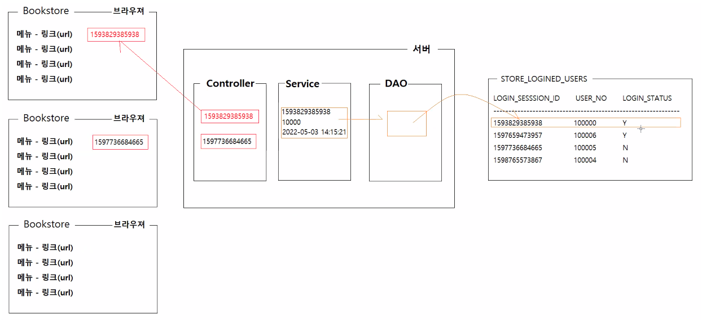
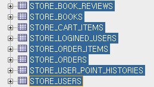
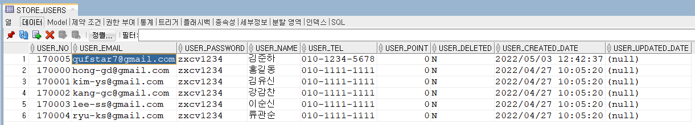
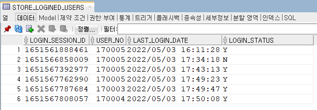

# 0503

- [0503](#0503)
- [실습 - 서점 앱 DB](#실습---서점-앱-db)
  - [제공할 서비스](#제공할-서비스)
    - [회원가입](#회원가입)
    - [로그인](#로그인)
    - [로그아웃](#로그아웃)
    - [마이메뉴 - 내 정보보기](#마이메뉴---내-정보보기)
  - [관계도, 흐름도](#관계도-흐름도)
  - [실습코드](#실습코드)
      - [코드 실행결과 DB 확인](#코드-실행결과-db-확인)

<small><i><a href='http://ecotrust-canada.github.io/markdown-toc/'>Table of contents generated with markdown-toc</a></i></small>

# 실습 - 서점 앱 DB
## 제공할 서비스
* 회원 관련 서비스
  1. 회원가입
  2. 로그인
  3. 내 정보 조회
  4. 내 주문내역 조회
  5. 주문 상세정보 조회
  6. 내 장바구니 보기 서비스
  7. 로그아웃
* 상품 관련 서비스
  1. 전체 도서 조회
  2. 도서 검색
  3. 장바구니 담기
  4. 장바구니 아이템 삭제
  5. 장바구니 상품 일괄 구매

### 회원가입
1. 대상 테이블
   * STORE_USERS
2. 대상 테이블의 속성 파악
   * USER_NO, USER_EMAIL, ...
3. 대상 테이블을 표현하는 VO클래스 정의
   * User.java
     * 멤버변수, Getter/Setter 메소드, toString() 메소드 재정의 
4. 대상 테이블에 대한 CRUD작업이 구현되는 DAO클래스 정의
   * UserDao.java
     * 사용자 저장기능
     * 사용자 정보 조회기능
5. 회원가입 서비스 업무가 구현되는 Service 클래스 정의
   * UserService.java
     * 신규 사용자 등록 서비스
       * 동일한 이메일을 가진 사용자는 등록할 수 없다.
6. 회원가입시 사용자와 상호작용하는 Controller 클래스정의
   * UserController.java
     * 이메일 비밀번호, 이름 전화번호를 입력받아 신규가입을 요청한다.
7. 도서 사용자 프로그램 클래스 정의
   * Bookstore.java
     * 프로그램 시작, 메뉴 제공

### 로그인
1. 대상 테이블
   * STORE_USERS, STORE_LOGINED_USERS
2. VO 클래스
   * User.java, LoginedUser.java
3. DAO 클래스
   * UserDao.java
   * LoginedUserDao.java
     * 로그인한 사용자정보 저장(일련번호, 사용자번호, 로그인한 시간, 상태)
     * 세션아이디로 로그인한 사용자정보를 제공하는 기능
4. Service 클래스
   * UserService.java
     * 이메일/비밀번호 검증
       * 이메일에 해당하는 사용자가 없으면 예외발생
       * 삭제된 사용자면 예외발생
       * 비밀번호가 맞지않으면 예외발생
       * 이메일/비밀번호 검증이 완료되면 STORE_LOGINED_USERS에 로그인된 사용자 정보 저장
       * 13글자 고유한 일련번호를 반환
5. Controller 클래스
   * UserController.java
     * 이메일/비밀번호를 입력받아서 로그인 요청을 보낸다.
     * 로그인에 성공하면 13글자 일련번호를 제공받아서 반환한다.
6. BookStore 클래스
   * BookStore.java
     * 로그인 메뉴 제공
     * 일련번호를 저장하는 멤버변수 생성 : 기본값은 -1이다.
     * UserController의 로그인()이 반환하는 일련번호를 멤버변수에 저장한다.
       * 일련번호가 -1이면 비로그인 상태
       * 일련번호가 -1이 아니면 로그인 상태

### 로그아웃
1. 대상 테이블
   * STORE_LOGINED_USERS
2. VO 클래스
   * LoginedUser.java
3. DAO 클래스
   * LoginedUserDao.java
     * 로그인 일련번호가 일치하는 로그인 정보의 로그인상태를 'N'으로 변경한다.
4. Service 클래스
   * UserService.java
     * 로그인 일련번호를 전달받아서 해당 로그인정보의 상태를 변경한다.
5. Controller 클래스
   * UserController.java
     * 로그인 일련번호를 전달받아서 로그아웃을 요청한다.
6. BookStore.java
   * BookStore.java
     * UserController의 로그아웃(일련번호) 메소드를 실행한다.


### 마이메뉴 - 내 정보보기
1. 대상 테이블
   * STORE_USERS, STORE_LOGINED_USERS
2. VO 클래스
   * User.java, LoginedUser.java
3. DAO 클래스
   * UserDao.java, LoginedUserDao.java
     * 추가 구현 x
4. Service 클래스
   * UserService.java
     * 일련번호에 해당하는 로그인된 사용자 정보를 제공한다.
       * 일련번호에 해당하는 로그인정보를 조회한다.
         LoginedUser loginedUser = loginedUserDao.getLoginedUserBySessionId(일련번호);
       * 로그인정보가 유효하면, 로그인정보에 포함된 사용자번호로 사용자정보를 조회
         int userNo = loginedUser.getUserNo();
         User user = userDao.getUserByNo(userNo);
       * 조회된 사용자정보를 컨트롤러에 반환
5. Controller 클래스
   * UserController.java
     * 서비스에 일련번호를 전달해서 로그인된 사용자정보를 반환받고, 그 정보를 출력한다.
6. BookStore.java
   * Bookstore.java
     * 로그인 -> 마이메뉴 -> 내정보보기
       * UserController의 내정보보기(일련번호) 메소드를 호출한다.;

## 관계도, 흐름도 



* 단방향으로 코딩한다. (DB -> 사용자 or 사용자 -> DB)

## 실습코드
1. 테이블 생성
```sql
CREATE TABLE STORE_LOGINED_USERS (
    USER_NO NUMBER(6) NOT NULL,
    LAST_LOGIN_DATE DATE DEFAULT SYSDATE,
    
    FOREIGN KEY (USER_NO) REFERENCES STORE_USERS (USER_NO)
);

DROP TABLE STORE_LOGINED_USERS;

CREATE TABLE STORE_LOGINED_USERS (
    LOGIN_SESSION_ID CHAR(13) PRIMARY KEY,
    USER_NO NUMBER(6) NOT NULL,
    LAST_LOGIN_DATE DATE DEFAULT SYSDATE,
    LOGIN_STATUS CHAR(1) DEFAULT 'Y',
    
    FOREIGN KEY (USER_NO) REFERENCES STORE_USERS (USER_NO)
);
```



2. VO
```java
package kr.co.bookstore.vo;

import java.util.Date;

public class User {

	private int no;
	private String email;
	private String password;
	private String name;
	private String tel;
	private int point;
	private String deleted;
	private Date createdDate;
	private Date updatedDate;

	public User() {
	}

	public int getNo() {
		return no;
	}

	public String getEmail() {
		return email;
	}

	public String getPassword() {
		return password;
	}

	public String getName() {
		return name;
	}

	public String getTel() {
		return tel;
	}

	public int getPoint() {
		return point;
	}

	public String getDeleted() {
		return deleted;
	}

	public Date getCreatedDate() {
		return createdDate;
	}

	public Date getUpdatedDate() {
		return updatedDate;
	}

	public void setNo(int no) {
		this.no = no;
	}

	public void setEmail(String email) {
		this.email = email;
	}

	public void setPassword(String password) {
		this.password = password;
	}

	public void setName(String name) {
		this.name = name;
	}

	public void setTel(String tel) {
		this.tel = tel;
	}

	public void setPoint(int point) {
		this.point = point;
	}

	public void setDeleted(String deleted) {
		this.deleted = deleted;
	}

	public void setCreatedDate(Date createdDate) {
		this.createdDate = createdDate;
	}

	public void setUpdatedDate(Date updatedDate) {
		this.updatedDate = updatedDate;
	}

}

```

```java
package kr.co.bookstore.vo;

import java.util.Date;

public class LoginedUser {

	private long sessionId;
	private int userNo;
	private Date lastLoginDate;
	private String status;
	
	public LoginedUser() {}
	
	public LoginedUser(long sessionId, int userNo) {
		this.sessionId = sessionId;
		this.userNo = userNo;
	}
	public long getSessionId() {
		return sessionId;
	}
	public int getUserNo() {
		return userNo;
	}
	public Date getLastLoginDate() {
		return lastLoginDate;
	}
	public String getStatus() {
		return status;
	}
	public void setSessionId(long sessionId) {
		this.sessionId = sessionId;
	}
	public void setUserNo(int userNo) {
		this.userNo = userNo;
	}
	public void setLastLoginDate(Date lastLoginDate) {
		this.lastLoginDate = lastLoginDate;
	}
	public void setStatus(String status) {
		this.status = status;
	}	
	
}

```

3. dao
```java
package kr.co.bookstore.dao;

import java.sql.Connection;
import java.sql.PreparedStatement;
import java.sql.ResultSet;
import java.sql.SQLException;

import kr.co.bookstore.util.ConnectionUtil;
import kr.co.bookstore.vo.User;

/**
 * STORE_USERS 테이블에 대한 CRUD 기능을 제공하는 클래스다.
 * 
 * @author HOME
 *
 */
public class UserDao {

	private static UserDao instance = new UserDao();

	private UserDao() {
	}

	/**
	 * UserDao객체를 반환한다.
	 * 
	 * @return UserDao
	 */
	public static UserDao getInstance() {
		return instance;
	}

	/**
	 * 사용자정보를 제공받아서 테이블에 저장한다.
	 * 
	 * @param user 사용자정보
	 * @throws SQLException 데이터베이스 엑세스 작업중 오류가 발생하면 이 예외를 던진다.
	 */
	public void insertUser(User user) throws SQLException {
		String sql = "insert into store_users(user_no, user_email, user_password, user_name, user_tel) "
				+ "values(store_users_seq.nextval, ?, ?, ?, ?)";

		Connection connection = ConnectionUtil.getConnection();
		PreparedStatement pstmt = connection.prepareStatement(sql);
		pstmt.setString(1, user.getEmail());
		pstmt.setString(2, user.getPassword());
		pstmt.setString(3, user.getName());
		pstmt.setString(4, user.getTel());

		pstmt.executeUpdate();

		pstmt.close();
		connection.close();
	}

	/**
	 * 이메일을 제공받아서 이메일이 일치하는 사용자정보를 조회해서 반환한다.
	 * 
	 * @param email 이메일
	 * @return 이메일이 일치하는 사용자정보가 없으면 null을 반환한다.
	 * @throws SQLException 데이터베이스 엑세스 작업중 오류가 발생하면 이 예외를 던진다.
	 */
	public User getUserByEmail(String email) throws SQLException {
		String sql = "select * " + "from store_users " + "where user_email = ? ";

		User user = null;

		Connection connection = ConnectionUtil.getConnection();
		PreparedStatement pstmt = connection.prepareStatement(sql);
		pstmt.setString(1, email);

		ResultSet rs = pstmt.executeQuery();
		if (rs.next()) {
			user = new User();
			user.setNo(rs.getInt("user_no"));
			user.setEmail(rs.getString("user_email"));
			user.setPassword(rs.getString("user_password"));
			user.setName(rs.getString("user_name"));
			user.setTel(rs.getString("user_tel"));
			user.setPoint(rs.getInt("user_point"));
			user.setDeleted(rs.getString("user_deleted"));
			user.setCreatedDate(rs.getDate("user_created_date"));
			user.setUpdatedDate(rs.getDate("user_updated_date"));
		}

		rs.close();
		pstmt.close();
		connection.close();

		return user;
	}

	/**
	 * 사용자번호를 제공받아서 이메일이 일치하는 사용자정보를 조회해서 반환한다.
	 * 
	 * @param userNo 사용자번호
	 * @return 사용자번호가 일치하는 사용자정보가 없으면 null을 반환한다.
	 * @throws SQLException 데이터베이스 엑세스 작업중 오류가 발생하면 이 예외를 던진다.
	 */
	public User getUserByNo(int userNo) throws SQLException {
		String sql = "select * " + "from store_users " + "where user_no = ? ";

		User user = null;

		Connection connection = ConnectionUtil.getConnection();
		PreparedStatement pstmt = connection.prepareStatement(sql);
		pstmt.setInt(1, userNo);

		ResultSet rs = pstmt.executeQuery();
		if (rs.next()) {
			user = new User();
			user.setNo(rs.getInt("user_no"));
			user.setEmail(rs.getString("user_email"));
			user.setPassword(rs.getString("user_password"));
			user.setName(rs.getString("user_name"));
			user.setTel(rs.getString("user_tel"));
			user.setPoint(rs.getInt("user_point"));
			user.setDeleted(rs.getString("user_deleted"));
			user.setCreatedDate(rs.getDate("user_created_date"));
			user.setUpdatedDate(rs.getDate("user_updated_date"));
		}

		rs.close();
		pstmt.close();
		connection.close();

		return user;
	}

}

```

```java
package kr.co.bookstore.dao;

import java.sql.Connection;
import java.sql.PreparedStatement;
import java.sql.ResultSet;
import java.sql.SQLException;

import kr.co.bookstore.util.ConnectionUtil;
import kr.co.bookstore.vo.LoginedUser;

/**
 * STORE_LOGINED_USERS에 대한 CRUD 기능을 제공한다.
 * 
 * @author HOME
 *
 */
public class LoginedUserDao {

	private static LoginedUserDao instance = new LoginedUserDao();

	private LoginedUserDao() {
	}

	/**
	 * LoginedUserDao 객체를 반환한다.
	 * 
	 * @return LoginedUserDao
	 */
	public static LoginedUserDao getInstance() {
		return instance;
	}

	/**
	 * 로그인 일련번호(세션아이디), 사용자번호가 포함된 정보를 전달받아서 저장한다.
	 * 
	 * @param loginedUser 로그인된 사용자정보
	 * @exception SQLException 데이터베이스 엑세스 작업중 오류가 발생하면 이 예외를 던진다.
	 */
	public void insertLoginedUser(LoginedUser loginedUser) throws SQLException {
		String sql = "insert into store_logined_users(login_session_id, user_no) values (?, ?)";

		Connection connection = ConnectionUtil.getConnection();
		PreparedStatement pstmt = connection.prepareStatement(sql);
		pstmt.setLong(1, loginedUser.getSessionId());
		pstmt.setInt(2, loginedUser.getUserNo());

		pstmt.executeUpdate();

		pstmt.close();
		connection.close();
	}

	/**
	 * 로그인 일련번호(세션아이디)와 일치하는 로그인된 사용자정보를 반환한다.
	 * 
	 * @param sessionId 로그인 일련번호
	 * @return 로그인된 사용자정보
	 * @throws SQLException 데이터베이스 엑세스 작업중 오류가 발생하면 이 예외를 던진다.
	 */
	public LoginedUser getLoginedUserBySessionId(long sessionId) throws SQLException {
		String sql = "select * " + "from store_logined_users " + "where login_session_id = ? ";

		LoginedUser loginedUser = null;

		Connection connection = ConnectionUtil.getConnection();
		PreparedStatement pstmt = connection.prepareStatement(sql);
		pstmt.setLong(1, sessionId);

		ResultSet rs = pstmt.executeQuery();
		if (rs.next()) {
			loginedUser = new LoginedUser();
			loginedUser.setSessionId(rs.getLong("login_session_id"));
			loginedUser.setUserNo(rs.getInt("user_no"));
			loginedUser.setLastLoginDate(rs.getDate("last_login_date"));
			loginedUser.setStatus(rs.getString("login_status"));
		}

		rs.close();
		pstmt.close();
		connection.close();

		return loginedUser;
	}
	
	/**
	 * 변경된 로그인정보를 전달받아서 테이블에 반영한다.
	 * @param loginedUser 변경된 로그인정보
	 * @throws SQLException 데이터베이스 엑세스 작업중 오류가 발생하면 이 예외를 던진다.
	 */
	public void updateLoginedUser(LoginedUser loginedUser) throws SQLException {
		String sql = "update store_logined_users "
				+ "set "
				+ "		login_status = ? "
				+ "where login_session_id = ? ";
		
		Connection connection = ConnectionUtil.getConnection();
		PreparedStatement pstmt = connection.prepareStatement(sql);
		pstmt.setString(1, loginedUser.getStatus());
		pstmt.setLong(2, loginedUser.getSessionId());
		
		pstmt.executeUpdate();
		
		pstmt.close();
		connection.close();
	}

}

```
4. Service
```java
package kr.co.bookstore.service;

import java.sql.SQLException;

import kr.co.bookstore.dao.LoginedUserDao;
import kr.co.bookstore.dao.UserDao;
import kr.co.bookstore.vo.LoginedUser;
import kr.co.bookstore.vo.User;

/**
 * 회원관련 서비스가 구현된 클래스다.
 * 
 * @author HOME
 *
 */
public class UserService {

	private static UserService instance = new UserService();

	private UserService() {
	}

	/**
	 * UserService객체를 반환한다.
	 * 
	 * @return UserService
	 */
	public static UserService getInstance() {
		return instance;
	}

	private UserDao userDao = UserDao.getInstance();
	private LoginedUserDao loginedUserDao = LoginedUserDao.getInstance();

	/**
	 * 회원가입 서비스를 제공한다.
	 * 
	 * @param user 신규 회원 정보를 포함하고 있는 User객체
	 * @throws SQLException 데이터베이스 엑세스 작업중 오류가 발생하면 이 예외를 던진다.
	 */
	public void registerUser(User user) throws SQLException {
		User savedUser = userDao.getUserByEmail(user.getEmail());
		if (savedUser != null) {
			throw new RuntimeException("이미 사용중인 아이디입니다.");
		}

		userDao.insertUser(user);
	}

	/**
	 * 이메일과 비밀번호를 전달받아서 사용자 인증서비스를 제공한다.
	 * <p>
	 * 사용자 인증이 완료되면 로그인정보를 저장하고, 로그인 일련번호를 반환한다.
	 * 
	 * @param email    이메일
	 * @param password 비밀번호
	 * @return 로그인 일련번호
	 * @throws SQLException 데이터베이스 엑세스 작업중 오류가 발생하면 이 예외를 던진다.
	 */
	public long login(String email, String password) throws SQLException {
		long sessionId = -1;

		User savedUser = userDao.getUserByEmail(email);
		if (savedUser == null) {
			throw new RuntimeException("이메일 혹은 비밀번호가 올바르지 않습니다.");
		}
		if ("Y".equals(savedUser.getDeleted())) {
			throw new RuntimeException("삭제된 사용자 계정입니다.");
		}
		if (!savedUser.getPassword().equals(password)) {
			throw new RuntimeException("이메일 혹은 비밀번호가 올바르지 않습니다.");
		}

		// 유닉스타입을 조회해서 sessionId에 대입시킨다.
		sessionId = System.currentTimeMillis();
		LoginedUser loginedUser = new LoginedUser(sessionId, savedUser.getNo());
		loginedUserDao.insertLoginedUser(loginedUser);

		return sessionId;
	}

	/**
	 * 로그인 일련번호와 일치하는 로그인정보를 로그아웃상태로 변경하는 서비스를 제공한다.
	 * 
	 * @param sessionId 로그인 일련번호
	 * @throws SQLException 데이터베이스 엑세스 작업중 오류가 발생하면 이 예외를 던진다.
	 */
	public void logout(long sessionId) throws SQLException {
		LoginedUser loginedUser = loginedUserDao.getLoginedUserBySessionId(sessionId);
		if (loginedUser != null) {
			loginedUser.setStatus("N");

			loginedUserDao.updateLoginedUser(loginedUser);
		}
	}

	/**
	 * 로그인 일련번호와 일치하는 로그인정보로 사용자정보를 조회해서 반환하는 서비스를 제공한다.
	 * 
	 * @param sessionId 로그인 일련번호
	 * @return 사용자정보
	 * @throws SQLException 데이터베이스 엑세스 작업중 오류가 발생하면 이 예외를 던진다.
	 */
	public User getUserInfo(long sessionId) throws SQLException {
		User user = null;

		// 로그인 일련번호에 대한 로그인정보 (일련번호, 로그인상태, 유저번호가 포함되어 있다.) 조회
		LoginedUser loginedUser = loginedUserDao.getLoginedUserBySessionId(sessionId);
		if (loginedUser == null) {
			throw new RuntimeException("로그인 일련번호가 유효하지 않습니다.");
		}
		if ("N".equals(loginedUser.getStatus())) {
			throw new RuntimeException("로그인 일련번호가 유효하지 않습니다.");
		}
		
		int userNo = loginedUser.getUserNo();
		user = userDao.getUserByNo(userNo);

		return user;
	}
}

```

5. Controller
```java
package kr.co.bookstore.controller;

import java.sql.SQLException;

import kr.co.bookstore.service.UserService;
import kr.co.bookstore.util.KeyboardReader;
import kr.co.bookstore.vo.User;

/**
 * 사용자와 상호작용하는 기능이 구현된 클래스다.
 * 
 * @author HOME
 *
 */
public class UserController {

	private static UserController instance = new UserController();

	private UserController() {
	}

	/**
	 * UserController객체를 반환한다.
	 * 
	 * @return UserController
	 */
	public static UserController getInstance() {
		return instance;
	}

	private KeyboardReader keyboard = KeyboardReader.getInstance();
	private UserService userService = UserService.getInstance();

	public void 회원가입() throws SQLException {
		System.out.println("<< 회원가입 >>");
		System.out.println("### 이메일, 비밀번호, 이름, 전화번호를 입력하세요.");

		System.out.print("이메일 입력: ");
		String email = keyboard.readString();
		System.out.print("비밀번호 입력: ");
		String password = keyboard.readString();
		System.out.print("이름 입력: ");
		String name = keyboard.readString();
		System.out.print("전화번호 입력: ");
		String tel = keyboard.readString();

		User user = new User();
		user.setEmail(email);
		user.setPassword(password);
		user.setName(name);
		user.setTel(tel);

		userService.registerUser(user);
		System.out.println("[처리완료] 회원가입이 완료되었습니다.");
	}

	public long 로그인() throws SQLException {
		System.out.println("<< 로그인 >>");
		System.out.println("### 이메일, 비밀번호를 입력하세요.");

		System.out.print("이메일 입력 : ");
		String email = keyboard.readString();
		System.out.print("비밀번호 입력 : ");
		String password = keyboard.readString();

		long sessionId = userService.login(email, password);
		System.out.println("[처리완료] 로그인이 완료되었습니다.");

		return sessionId;
	}

	/**
	 * 로그인 일련번호와 일치하는 로그인정보를 로그아웃상태로 변경하는 서비스를 제공한다.
	 * 
	 * @param sessionId 로그인 일련번호
	 * @throws SQLException 데이터베이스 엑세스 작업중 오류가 발생하면 이 예외를 던진다.
	 */
	public void 로그아웃(long sessionId) throws SQLException {
		System.out.println("<< 로그아웃 >>");
		System.out.println("### 시스템에서 로그아웃됩니다.");

		userService.logout(sessionId);
		System.out.println("[처리완료] 로그아웃 되었습니다.");
	}

	public void 내정보보기(long sessionId) throws SQLException {
		System.out.println("<< 내 정보 보기>>");
		System.out.println("### 내 정보를 확인해보세요.");

		User user = userService.getUserInfo(sessionId);

		System.out.println("--------------------------------------------------------------------------------------");
		System.out.println("번호: " + user.getNo());
		System.out.println("이메일: " + user.getEmail());
		System.out.println("이름: " + user.getName());
		System.out.println("전화번호: " + user.getTel());
		System.out.println("포인트: " + user.getPoint());
		System.out.println("수정일자: " + user.getUpdatedDate());		
		System.out.println("등록일자: " + user.getCreatedDate());		
		System.out.println("--------------------------------------------------------------------------------------");

		System.out.println("[처리완료] 내 정보 보기가 완료되었습니다.");
	}

}

```

6. 북스토어 프로그램
```java
package kr.co.bookstore;

import java.sql.SQLException;

import kr.co.bookstore.controller.UserController;
import kr.co.bookstore.util.KeyboardReader;

public class Bookstore {
	
	private long sessionId = -1;
	
	private KeyboardReader keyboard = KeyboardReader.getInstance();
	private UserController userController = UserController.getInstance();
	
	public Bookstore() throws SQLException {
		menu();
	}
	
	private void menu() throws SQLException {
		try {
			System.out.println("[북스토어 프로그램]");
			System.out.println("--------------------------------------------------------------------------------------");
			if (sessionId == -1) {
				System.out.println("1.로그인  2.회원가입  3.도서조회  4.도서검색  0.종료");				
			} else{
				System.out.println("3.도서조회  4.도서검색  5.마이메뉴  6.로그아웃  0.종료");								
			}
			System.out.println("--------------------------------------------------------------------------------------");
		
			System.out.print("메뉴 선택: ");
			int menuNo = keyboard.readInt();
			System.out.println();
			
			switch (menuNo) {
				case 1:
					sessionId = userController.로그인(); 
					break;
				case 2: 
					userController.회원가입(); 
					break;
				case 5:
					myMenu();
					break;
				case 6:
					userController.로그아웃(sessionId); 
					sessionId = -1;
					break;
			}
			
		} catch (Exception ex) {
			ex.printStackTrace();
		}
		
		System.out.println();
		System.out.println();
		System.out.println();
		
		menu();
	}
	
	private void myMenu() throws SQLException {
		if (sessionId == -1) {
			System.err.println("[접근거부] 로그인 후 사용가능한 메뉴입니다.");
			return;
		}
		System.out.println("[마이 메뉴]");
		System.out.println("--------------------------------------------------------------------------------------");
		System.out.println("1.내 정보  2.주문내역  3.장바구니  4.포인트  5.비밀번호변경  0.종료");								
		System.out.println("--------------------------------------------------------------------------------------");
	
		int menuNo = keyboard.readInt();
		System.out.println();
		
		switch (menuNo) {
			case 1:
				userController.내정보보기(sessionId);
				break;
			case 2: 
				
				break;
			case 3:
				
				break;
			case 4:
				
				break;
			case 5:
				
				break;
			case 0:
				return;
		}
		System.out.println();
		System.out.println();
		System.out.println();
		myMenu();
	}

	public static void main(String[] args) throws SQLException {
		new Bookstore();
	}
}

```

#### 코드 실행결과 DB 확인

* 회원가입 실행결과


* 로그인, 로그아웃 실행결과
  * 로그아웃 메소드를 직접 실행하지 않으면 LOGIN_STATUS가 Y로 남아있다.
  * 프로그램 종료 기능을 구현하고 로그아웃을 연결해서 사용해야 한다.