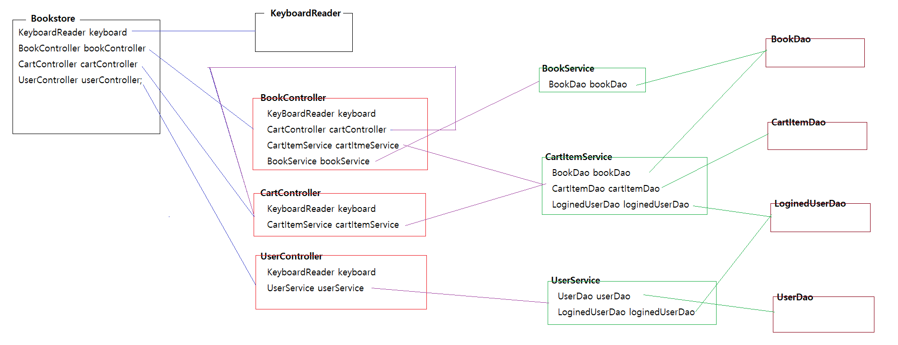

# 0504

- [0504](#0504)
- [클래스 용어 설명](#클래스-용어-설명)
- [실습 - 북스토어 앱](#실습---북스토어-앱)
	- [구현내용](#구현내용)
	- [제공할 서비스](#제공할-서비스)
	- [기능 구현](#기능-구현)
		- [도서 리스트/상세 보기](#도서-리스트상세-보기)
		- [장바구니 담기](#장바구니-담기)
		- [장바구니 보기](#장바구니-보기)
	- [실습코드](#실습코드)
		- [vo](#vo)
		- [1. 북스토어 프로그램(메인메소드)](#1-북스토어-프로그램메인메소드)
		- [2. Controller](#2-controller)
		- [3. Service](#3-service)
		- [4. dao](#4-dao)

<small><i><a href='http://ecotrust-canada.github.io/markdown-toc/'>Table of contents generated with markdown-toc</a></i></small>

# 클래스 용어 설명
1. VO 클래스
   * 엔티티라고도 부른다.
2. DTO 클래스
   * 출력화면에 최적화된 VO
   * 화면 <--- DTO(데이터) --- 테이블 + 테이블
3. Form 클래스
   * 입력화면에 최적회된 VO
   * 입력폼 ---> Form(데이터) ---> VO

# 실습 - 북스토어 앱
2일차 북스토어 앱 개발 실습
## 구현내용
* 회원관련 서비스
	1. 회원가입 서비스
		테이블 : STORE_USERS
		업무  : 중복 이메일 체크를 마친 사용자 정보를 회원가입처리한다.

	2. 로그인 서비스
		테이블 : STORE_USERS, STORE_LOGINED_USERS
		업무  : 아이디, 비밀번호를 전달받아서 사용자 인증을 하고, 사용자 인증이 완료된 사용자의 번호를 저장한다.

	3. 내정보 조회 서비스
		테이블 : STORE_LOGINED_USERS, STORE_USERS
		업무  : STORE_LOGINED_USERS에 저장된 현재 로그인된 사용자번호로 STORE_USERS에서 사용자 정보를 조회한다.

	5. 내 주문내역 조회 서비스
		테이블 : STORE_LOGINED_USERS, STORE_ORDERS
		업무  : STORE_LOGINED_USERS에 저장된 현재 로그인된 사용자번호로 STORE_ORDERS에서 주문내역을 조회한다.
	
	6. 주문 상세정보 조회 서비스
		테이블 : STORE_ORDERS, STORE_ORDER_ITEMS, STORE_BOOKS
		업무  : 주문번호에 해당하는 주문정보는 STORE_ORDERS에서 조회하고, 주문상품정보른 STORE_ORDER_ITEMS와 STORE_BOOKS를 이용해서 조회한다.

	6. 내 장바구니 보기 서비스
		테이블 : STORE_LOGINED_USERS, STORE_CART_ITEMS, STORE_BOOKS
		업무  : STORE_LOGINED_USERS에 저장된 현재 로그인된 사용자번호로 STORE_CART_ITEMS와 STORE_BOOKS에서 장바구니 아이템정보를 조회한다.

	7. 포인트 변경 이력 조회 서비스
		테이블 : STORE_LOGINED_USERS, STORE_USER_POINT_HISTORIES
		업무  : STORE_LOGINED_USERS에 저장된 현재 로그인된 사용자번호로 STORE_USER_POINT_HISTORIES에서 포인트 변경이력을 조회한다.

	8. 비밀번호 변경 서비스

	9. 로그아웃 서비스

* 상품관련 서비스
	1. 전체 도서 조회 서비스

	2. 도서 검색 서비스

	3. 바로 구매 서비스

	4. 장바구니 담기 서비스

	5. 장바구니 아이템 삭제 서비스	

	6. 장바구니 상품 일괄 구매 서비스

## 제공할 서비스
* 회원 관련 서비스
  1. 회원가입
  2. 로그인
  3. 내 정보 조회
  4. 내 주문내역 조회
  5. 주문 상세정보 조회
  6. 내 장바구니 보기 서비스
  7. 로그아웃
* 상품 관련 서비스
  1. 전체 도서 조회
  2. 도서 검색
  3. 장바구니 담기
  4. 장바구니 아이템 삭제
  5. 장바구니 상품 일괄 구매

## 기능 구현

### 도서 리스트/상세 보기
1. 대상 테이블
   * STORE_BOOKS
2. VO 클래스
   * Book.java
3. DAO 클래스
   * BookDao.java
     * 모든 책정보 제공
     * 책 상세정보 제공
     * 책 정보 변경
4. Service 클래스
   * BookService.java
     * 전체 도서 리스트를 제공하는 서비스
     * 책번호에 해당하는 책의 상세정보를 제공하는 서비스
5. Controller 클래스
   * BookController.java
     * 전체 도서리스트를 서비스에 요청해서 출력한다.
     * 책번호에 해당하는 도서 상세정보를 서비스에 요청해서 출력한다.
       * 장바구니, 바로구매, 쇼핑계속 중 하나를 선택한다.
6. 북스토어
   * Bookstore.java
     * 메뉴에서 도서조회를 선택해서 BookController의 도서리스트() 메소드를 실행시킨다.
     * 메뉴에서 도서상세를 선택해서 BookController의 도서상세(로그인 일련번호) 메소드를 실행시킨다.

### 장바구니 담기
1. 관련 테이블
   * STORE_CART_ITEMS, STORE_LOGINED_USERS
2. VO 클래스
   * CartItem.java, LoginedUser.java
3. DAO 클래스
   * LoginedUserDao.java
   * CartItemDao.java
     * 장바구니 아이템정보를 저장하는 기능
4. Service 클래스
   * CartItemService.java
     * 책번호, 로그인일련번호를 전달받아서 장바구니에 저장한다.
       * 로그인 일련번호로 사용자번호를 조회해야 한다.
5. Controller 클래스
   * BookController.java
     * 장바구니 담기를 선택했을 때 책번호와 로그인일련번호를 서비스로 전달해서 장바구니에 아이템을 추가하는 서비스를 요청한다.
6. 북스토어 프로그램
   * Bookstore.java

### 장바구니 보기
마이메뉴 > 장바구니
1. 관련 테이블
   * STORE_LOGINED_USERS : 로그인 일련번호로 지금 로그인한 사용자번호가 저장되어 있음
   * STORE_BOOKS : 책정보 저장
   * STORE_CART_ITEMS : 사용자 번호, 책번호 저장
2. DTO 클래스
   * CartItemDto.java
     * 카트아이템번호, 책번호, 책제목, 가격, 할인가격, 수량, 구매가격
3. DAO 클래스
   * CartItemDao.java
     * 사용자번호를 전달받아서 해당 사용자가 저장한 모든 장바구니 아이템을 반환하는 메소드
     * `public List<CartItemDto> getCartItemsByUserNo(int userNo)`
5. Service 클래스
   * CartItemService.java
     * 로그인일련번호를 전달받아서 로그인된 사용자의 모든 장바구니 아이템을 제공하는 서비스
7. Controller 클래스
   * CartController.java
     * `public void 내장바구니보기(long sessionId) {}의 구현내용은 아래와 같다.
     * 로그인일련번호를 전달받아서 로그인된 사용자의 장바구니 아이템을 서비스에 요청한다.
     * 조회된 장바구니 아이템정보를 화면에 출력한다.
       * 로그인 일련번호로 사용자번호를 획득한다.
       * 장바구니아이템을 출력하고, 전체주문, 선택주문, 전체삭제, 선택삭제 메뉴를 제공한다.
   * BookController.java
     * 장바구니 담기가 완료되면 CartController의 내장바구니보기(로그인일련번호)를 실행한다.
8. BookStore.java
   * BookStore.java
     * UserController의 로그아웃(일련번호) 메소드를 실행한다.

## 실습코드
### vo
* CartItem
```java
package kr.co.bookstore.vo;

import java.util.Date;

public class CartItem {

	private int itemNo;
	private int userNo;
	private int bookNo;
	private int Quantity;
	private Date createdDate;
	private Date updatedDate;

	public CartItem() {
	}

	public int getItemNo() {
		return itemNo;
	}

	public int getUserNo() {
		return userNo;
	}

	public int getBookNo() {
		return bookNo;
	}

	public int getQuantity() {
		return Quantity;
	}

	public Date getCreatedDate() {
		return createdDate;
	}

	public Date getUpdatedDate() {
		return updatedDate;
	}

	public void setItemNo(int itemNo) {
		this.itemNo = itemNo;
	}

	public void setUserNo(int userNo) {
		this.userNo = userNo;
	}

	public void setBookNo(int bookNo) {
		this.bookNo = bookNo;
	}

	public void setQuantity(int quantity) {
		Quantity = quantity;
	}

	public void setCreatedDate(Date createdDate) {
		this.createdDate = createdDate;
	}

	public void setUpdatedDate(Date updatedDate) {
		this.updatedDate = updatedDate;
	}

}

```

### 1. 북스토어 프로그램(메인메소드)
* bookstore.java
```java
package kr.co.bookstore;

import java.sql.SQLException;

import kr.co.bookstore.controller.BookController;
import kr.co.bookstore.controller.CartController;
import kr.co.bookstore.controller.UserController;
import kr.co.bookstore.util.KeyboardReader;

public class Bookstore {

	private long sessionId = -1;

	private KeyboardReader keyboard = KeyboardReader.getInstance();

	private BookController bookController = BookController.getInstance();
	private UserController userController = UserController.getInstance();
	private CartController cartController = CartController.getInstance();

	public Bookstore() {
		menu();
	}

	private void menu() {
		try {
			System.out.println("[북스토어 프로그램]");
			System.out
					.println("--------------------------------------------------------------------------------------");
			if (sessionId == -1) {
				System.out.println("1.로그인  2.회원가입  3.도서조회  0.종료");
			} else {
				System.out.println("3.도서조회  4.도서상세  5.마이메뉴  6.로그아웃  0.종료");
			}
			System.out
					.println("--------------------------------------------------------------------------------------");

			System.out.print("메뉴 선택: ");
			int menuNo = keyboard.readInt();
			System.out.println();

			switch (menuNo) {
			case 1:
				sessionId = userController.로그인();
				break;
			case 2:
				userController.회원가입();
				break;
			case 3:
				bookController.전체도서리스트();
				break;
			case 4:
				bookController.상세조회(sessionId);
				break;
			case 5:
				myMenu();
				break;
			case 6:
				userController.로그아웃(sessionId);
				sessionId = -1;
				break;
			}

		} catch (Exception ex) {
			ex.printStackTrace();
		}

		System.out.println();
		System.out.println();
		System.out.println();

		menu();
	}

	private void myMenu() throws SQLException {
		//System.out.println("로그인 일련번호: " + sessionId);
		if (sessionId == -1) {
			System.err.println("[접근거부] 로그인 후 사용가능한 메뉴입니다.");
			return;
		}

		System.out.println("[마이 메뉴]");
		System.out.println("--------------------------------------------------------------------------------------");
		System.out.println("1.내 정보  2.주문내역  3.장바구니  4.포인트  5.비밀번호변경  0.종료");
		System.out.println("--------------------------------------------------------------------------------------");

		System.out.print("메뉴 선택: ");
		int menuNo = keyboard.readInt();
		System.out.println();

		switch (menuNo) {
		case 1:
			userController.내정보보기(sessionId);
			break;
		case 2:

			break;
		case 3:
			cartController.내장바구니보기(sessionId);
			break;
		case 4:

			break;
		case 5:

			break;
		case 0:
			return;
		}
		System.out.println();
		System.out.println();
		System.out.println();
		myMenu();
	}

	public static void main(String[] args) {
		new Bookstore();
	}
}

```

### 2. Controller
```java
package kr.co.bookstore.controller;

import java.sql.SQLException;
import java.util.List;

import kr.co.bookstore.service.BookService;
import kr.co.bookstore.service.CartItemService;
import kr.co.bookstore.util.KeyboardReader;
import kr.co.bookstore.vo.Book;

public class BookController {

	private static BookController instance = new BookController();
	private BookController() {}
	public static BookController getInstance() {
		return instance;
	}

	private KeyboardReader keyboard = KeyboardReader.getInstance();
	private BookService bookService = BookService.getInstance();
	private CartItemService cartItemService = CartItemService.getInstance();
	private CartController cartController = CartController.getInstance();

	public void 전체도서리스트() throws SQLException {
		System.out.println("<<  전체 도서 리스트 >>");
		System.out.println("### 전체 도서 리스트를 확인해보세요");

		List<Book> books = bookService.getAllBooks();
		System.out.println("--------------------------------------------------------------------------------------");
		System.out.println("책번호\t\t할인가격\t\t저자\t\t제목");
		System.out.println("--------------------------------------------------------------------------------------");
		for (Book book : books) {
			System.out.print(book.getNo() + "\t\t");
			System.out.print(book.getDiscountPrice() + "\t\t");
			System.out.print(book.getAuthor() + "\t\t");
			System.out.println(book.getTitle());
		}
		System.out.println("--------------------------------------------------------------------------------------");
	}

	public void 상세조회(long sessionId) throws SQLException {
		System.out.println("<< 도서 상세 조회 >>");
		System.out.println("### 책번호를 입력해서 상세정보를 확인하세요.");

		System.out.print("책번호 입력: ");
		int bookNo = keyboard.readInt();

		Book book = bookService.getBookInfo(bookNo);
		if (book == null) {
			System.out.println("[입력오류] 책번호가 올바르지 않습니다.");
			return;
		}

		System.out.println("--------------------------------------------------------------------------------------");
		System.out.println("책 번호: " + book.getNo());
		System.out.println("책 제목: " + book.getTitle());
		System.out.println("책 저자: " + book.getAuthor());
		System.out.println("책 출판사: " + book.getPublisher());
		System.out.println("책 가격: " + book.getPrice() + " 원");
		System.out.println("책 할인가격: " + book.getDiscountPrice() + " 원");
		System.out.println("책 판매여부: " + ("Y".equals(book.getOnSell()) ? "판매중" : "재고없음"));
		System.out.println("책 재고수량: " + book.getStock());
		System.out.println();
		System.out.println(book.getDescription());
		System.out.println("--------------------------------------------------------------------------------------");
		System.out.println();

		System.out.println("### 메뉴를 선택하세요.");
		System.out.println("1.바로구매  2.장바구니  3.쇼핑계속");
		System.out.print("번호 입력: ");
		int menuNo = keyboard.readInt();

		if (menuNo == 1) {
			// 책번호와 로그인일련번호를 OrderService의 buyBook(책번호, 로그인일련번호)메소드를 실행한다.

		} else if (menuNo == 2) {
			cartItemService.addBookIntoCart(bookNo, sessionId);
			cartController.내장바구니보기(sessionId);
			// 장바구니 목록을 표현하는 CartItemController의 장바구니목록(로그인일련번호) 메소드를 실행한다.
		} else if (menuNo == 3) {
			전체도서리스트();
		}

	}

}

```
```java
package kr.co.bookstore.controller;

import java.sql.SQLException;
import java.util.List;

import kr.co.bookstore.dto.CartItemDto;
import kr.co.bookstore.service.CartItemService;
import kr.co.bookstore.util.KeyboardReader;

public class CartController {

	private static CartController instance = new CartController();
	private CartController() {}
	public static CartController getInstance() {
		return instance;
	}

	private KeyboardReader keyboard = KeyboardReader.getInstance();
	private CartItemService cartItemService = CartItemService.getInstance();

	public void 내장바구니보기(long sessionId) throws SQLException {
		System.out.println("<< 내 장바구니 보기 >>");
		System.out.println("### 장바구니에 저장된 아이템 정보를 확인해 보세요.");

		List<CartItemDto> cartItems = cartItemService.getMyCartItems(sessionId);
		if (cartItems.isEmpty()) {
			System.out.println("### 장바구니에 저장된 아이템이 없습니다.");
			return;
		}

		System.out.println("--------------------------------------------------------------------------------------");
		System.out.println("아이템번호\t\t가격\t할인가격\t수량\t구매가격\t\t제목");
		System.out.println("--------------------------------------------------------------------------------------");
		for (CartItemDto dto : cartItems) {
			System.out.print(dto.getItemNo() + "\t\t");
			System.out.print(dto.getPrice() + "\t");
			System.out.print(dto.getDiscountPrice() + "\t");
			System.out.print(dto.getQuantity() + "\t");
			System.out.print(dto.getOrderPrice() + "\t\t");
			System.out.println(dto.getTitle());
		}
		System.out.println("--------------------------------------------------------------------------------------");

		System.out.println("### 메뉴를 선택하세요.");
		System.out.println("1.전체구매 2.선택구매 3.전체삭제 4.선택삭제 5.쇼핑계속");
		
		System.out.println("번호 입력: ");
		int menuNo = keyboard.readInt();
		System.out.println();
		
		if(menuNo == 1) {
			장바구니아이템전체구매(sessionId);
		} else if (menuNo == 2) {
			장바구니아이템선택구매(sessionId);
		} else if (menuNo == 3) {
			장바구니아이템전체삭제(sessionId);
			내장바구니보기(sessionId);
		} else if (menuNo == 4) {
			장바구니아이템선택삭제(sessionId);
		} else if (menuNo == 5) {
			return;
		}
 	}

	private void 장바구니아이템선택삭제(long sessionId) throws SQLException {
		
	}

	private void 장바구니아이템전체삭제(long sessionId) throws SQLException {
		System.out.println("<< 장바구니 아이템 전체 삭제 >>");
		System.out.println("### 장바구니에 저장된 모든 아이템을 삭제합니다.");
		
		cartItemService.deleteAllMyCartItems(sessionId);
	}

	private void 장바구니아이템선택구매(long sessionId) throws SQLException {
		
	}

	private void 장바구니아이템전체구매(long sessionId) throws SQLException {
		
	}
	
}

```

### 3. Service
```java
package kr.co.bookstore.service;

import java.sql.SQLException;
import java.util.List;

import kr.co.bookstore.dao.BookDao;
import kr.co.bookstore.dao.CartItemDao;
import kr.co.bookstore.dao.LoginedUserDao;
import kr.co.bookstore.dto.CartItemDto;
import kr.co.bookstore.vo.Book;
import kr.co.bookstore.vo.CartItem;
import kr.co.bookstore.vo.LoginedUser;

public class CartItemService {

	private static CartItemService instance = new CartItemService();
	private CartItemService() {}
	public static CartItemService getInstance() {
		return instance;
	}

	private BookDao bookDao = BookDao.getInstance();
	private CartItemDao cartItemDao = CartItemDao.getInstance();
	private LoginedUserDao loginedUserDao = LoginedUserDao.getInstance();

	/**
	 * 책번호와 로그인일련번호를 전달받아서 로그인한 사용자의 장바구니 아이템으로 저장하는 서비스를 제공한다.
	 * @param bookNo    책번호
	 * @param sessionId 로그인일련번호
	 * @throws SQLException 데이터베이스 엑세스 작업 중 오류가 발생하면 이 예외를 던진다.
	 */
	public void addBookIntoCart(int bookNo, long sessionId) throws SQLException {
		Book book = bookDao.getBookByNo(bookNo);
		if (book == null) {
			throw new RuntimeException("책 정보가 존재하지 않습니다.");
		}

		LoginedUser loginedUser = loginedUserDao.getLoginedUserBySessionId(sessionId);
		if (loginedUser == null) {
			throw new RuntimeException("로그인 정보가 존재하지 않습니다.");
		}
		if ("N".equals(loginedUser.getStatus())) {
			throw new RuntimeException("이미 로그아웃되었습니다.");
		}

		CartItem cartItem = new CartItem();
		cartItem.setBookNo(bookNo);
		cartItem.setUserNo(loginedUser.getUserNo());
		cartItem.setQuantity(1);

		cartItemDao.insertCartItem(cartItem);
	}

	/**
	 * 로그인일련번호르 전달받아서 로그인된 사용자의 모든 장구니 아이템정보를 반환하는 서비스를 제공한다.
	 * @param sessionId 로그인 일련번호
	 * @return 해당 사용자의 모든 장바구니 아이템정보
	 * @throws SQLException 데이터베이스 엑세스 작업 중 오류가 발생하면 이 예외를 던진다.
	 */
	public List<CartItemDto> getMyCartItems(long sessionId) throws SQLException {
		LoginedUser loginedUser = loginedUserDao.getLoginedUserBySessionId(sessionId);
		if (loginedUser == null) {
			throw new RuntimeException("로그인 정보가 존재하지 않습니다.");
		}
		if ("N".equals(loginedUser.getStatus())) {
			throw new RuntimeException("이미 로그아웃되었습니다.");
		}
		
		//int userNo = loginedUser.getUserNo();
		//List<CartItemDto> cartItems = cartItemdDao.getCartItemsByUserNo(userNo);
		//return cartItems;
		
		return cartItemDao.getCartItemsByUserNo(loginedUser.getUserNo());
	}

	/**
	 * 로그인일련번호를 전달받아서 로그인된 사용자의 모든 장바구니 아이템정보를 삭제하는 서비스를 제공한다.
	 * @param sessionId 로그인 일련번호
	 */
	public void deleteAllMyCartItems(long sessionId) throws SQLException {
		LoginedUser loginedUser = loginedUserDao.getLoginedUserBySessionId(sessionId);
		if (loginedUser == null) {
			throw new RuntimeException("로그인 정보가 존재하지 않습니다.");
		}
		if ("N".equals(loginedUser.getStatus())) {
			throw new RuntimeException("이미 로그아웃되었습니다.");
		}
		
		cartItemDao.deleteAllCartItemsByUserNo(loginedUser.getUserNo());
	}

}

```

### 4. dao
```java
package kr.co.bookstore.dao;

import java.sql.Connection;
import java.sql.PreparedStatement;
import java.sql.ResultSet;
import java.sql.SQLException;
import java.util.ArrayList;
import java.util.List;

import kr.co.bookstore.util.ConnectionUtil;
import kr.co.bookstore.vo.Book;

/**
 * STORE_BOOKS 테이블에 대한 CRUD 기능을 제공하는 클래스다.
 * @author lee_e
 *
 */
public class BookDao {

	private static BookDao instance = new BookDao();
	private BookDao() {}
	public static BookDao getInstance() {
		return instance;
	}

	/**
	 * 모든 책 정보를 반환한다.
	 * @return 모든 책정보
	 * @throws SQLException 데이터베이스 엑세스 작업 중 오류가 발생하면 이 예외를 던진다.
	 */
	public List<Book> getBooks() throws SQLException {
		String sql = "select * " 
	               + "from store_books " 
				   + "order by book_no desc";

		List<Book> books = new ArrayList<>();

		Connection connection = ConnectionUtil.getConnection();
		PreparedStatement pstmt = connection.prepareStatement(sql);
		ResultSet rs = pstmt.executeQuery();

		while (rs.next()) {
			Book book = new Book();
			book.setNo(rs.getInt("book_no"));
			book.setTitle(rs.getString("book_title"));
			book.setAuthor(rs.getString("book_author"));
			book.setPublisher(rs.getString("book_publisher"));
			book.setDescription(rs.getString("book_description"));
			book.setPrice(rs.getInt("book_price"));
			book.setDiscountPrice(rs.getInt("book_discount_price"));
			book.setOnSell(rs.getString("book_on_sell"));
			book.setStock(rs.getInt("book_stock"));
			book.setCreatedDate(rs.getDate("book_created_date"));
			book.setUpdatedDate(rs.getDate("book_updated_date"));

			books.add(book);
		}

		rs.close();
		pstmt.close();
		connection.close();

		return books;
	}

	/**
	 * 책번호와 일치하는 책정보를 반환한다.
	 * @param bookNo 책번보
	 * @return 책정보, 책번호가 유효하지 않은 경우 null이 반환될 수 있다.
	 * @throws SQLException 데이터베이스 엑세스 작업 중 오류가 발생하면 이 예외를 던진다.
	 */
	public Book getBookByNo(int bookNo) throws SQLException {
		String sql = "select * " 
	               + "from store_books " 
				   + "where book_no = ? ";

		Book book = null;

		Connection connection = ConnectionUtil.getConnection();
		PreparedStatement pstmt = connection.prepareStatement(sql);
		pstmt.setInt(1, bookNo);
		ResultSet rs = pstmt.executeQuery();

		if (rs.next()) {
			book = new Book();
			book.setNo(rs.getInt("book_no"));
			book.setTitle(rs.getString("book_title"));
			book.setAuthor(rs.getString("book_author"));
			book.setPublisher(rs.getString("book_publisher"));
			book.setDescription(rs.getString("book_description"));
			book.setPrice(rs.getInt("book_price"));
			book.setDiscountPrice(rs.getInt("book_discount_price"));
			book.setOnSell(rs.getString("book_on_sell"));
			book.setStock(rs.getInt("book_stock"));
			book.setCreatedDate(rs.getDate("book_created_date"));
			book.setUpdatedDate(rs.getDate("book_updated_date"));
		}

		rs.close();
		pstmt.close();
		connection.close();

		return book;
	}

	/**
	 * 수정된 정보가 포함된 책정보를 전달받아서 테이블에 반영시킨다.
	 * @param book 책정보
	 * @throws SQLException 데이터베이스 엑세스 작업 중 오류가 발생하면 이 예외를 던진다.
	 */
	public void updateBook(Book book) throws SQLException {
		String sql = "update store_books " 
	               + "set " 
				   + "		book_discount_price = ?, " 
				   + "		book_on_sell = ?, "
				   + "		book_stock = ?," 
				   + "		book_updated_date = sysdate " 
				   + "where book_no = ?";

		Connection connection = ConnectionUtil.getConnection();
		PreparedStatement pstmt = connection.prepareStatement(sql);
		pstmt.setInt(1, book.getDiscountPrice());
		pstmt.setString(2, book.getOnSell());
		pstmt.setInt(3, book.getStock());
		pstmt.setInt(4, book.getNo());

		pstmt.executeUpdate();

		pstmt.close();
		connection.close();
	}
}

```
```java
package kr.co.bookstore.dao;

import java.sql.Connection;
import java.sql.PreparedStatement;
import java.sql.ResultSet;
import java.sql.SQLException;
import java.util.ArrayList;
import java.util.List;

import kr.co.bookstore.dto.CartItemDto;
import kr.co.bookstore.util.ConnectionUtil;
import kr.co.bookstore.vo.CartItem;

public class CartItemDao {

	private static CartItemDao instance = new CartItemDao();
	private CartItemDao() {}
	public static CartItemDao getInstance() {
		return instance;
	}

	/**
	 * 장바구니아이템정보를 전달받아서 테이블에 저장시킨다.
	 * @param cartItem 새 장바구니 아이템정보
	 * @throws SQLException 데이터베이스 엑세스 작업 중 오류가 발생하면 이 예외를 던진다.
	 */
	public void insertCartItem(CartItem cartItem) throws SQLException {
		String sql = "insert into store_cart_items(cart_item_no, user_no, book_no, cart_item_quantity) "
				   + "values(store_cartitems_seq.nextval, ?, ?, ?) ";

		Connection connection = ConnectionUtil.getConnection();
		PreparedStatement pstmt = connection.prepareStatement(sql);
		pstmt.setInt(1, cartItem.getUserNo());
		pstmt.setInt(2, cartItem.getBookNo());
		pstmt.setInt(3, cartItem.getQuantity());

		pstmt.executeUpdate();

		pstmt.close();
		connection.close();
	}

	/**
	 * 사용자번호를 전달받아서 일치하는 사용자번호의 모든 장바구니 아이템정보를 반환한다.
	 * @param userNo 사용자번호
	 * @return 장바구니 아이템 목록
	 * @throws SQLException 데이터베이스 엑세스 작업 중 오류가 발생하면 이 예외를 던진다.
	 */
	public List<CartItemDto> getCartItemsByUserNo(int userNo) throws SQLException {
		String sql = "select C.cart_item_no, C.book_no, B.book_title, B.book_price, B.book_discount_price, "
				   + "       C.cart_item_quantity, B.book_discount_price * C.cart_item_quantity as order_price "
				   + "from store_cart_items C, store_books B " 
				   + "where C.book_no = B.book_no " 
				   + "and C.user_no = ? "
				   + "order by C.cart_item_no desc ";

		List<CartItemDto> cartItems = new ArrayList<>();

		Connection connection = ConnectionUtil.getConnection();
		PreparedStatement pstmt = connection.prepareStatement(sql);
		pstmt.setInt(1, userNo);
		ResultSet rs = pstmt.executeQuery();
		while (rs.next()) {
			CartItemDto dto = new CartItemDto();
			dto.setItemNo(rs.getInt("cart_item_no"));
			dto.setBookNo(rs.getInt("book_no"));
			dto.setTitle(rs.getString("book_title"));
			dto.setPrice(rs.getInt("book_price"));
			dto.setDiscountPrice(rs.getInt("book_discount_price"));
			dto.setQuantity(rs.getInt("cart_item_quantity"));
			dto.setOrderPrice(rs.getInt("order_price"));

			cartItems.add(dto);
		}
		rs.close();
		pstmt.close();
		connection.close();

		return cartItems;
	}

	/**
	 * 사용자번호를 전달받아서 일치하는 사용자번호의 모든 장바구니 아이템을 삭제한다.
	 * @param userNo 사용자번호
	 * @throws SQLException 데이터베이스 엑세스 작업 중 오류가 발생하면 이 예외를 던진다.
	 */
	public void deleteAllCartItemsByUserNo(int userNo) throws SQLException {
		String sql = "delete " 
				   + "from store_cart_items " 
				   + "where user_no = ? ";

		Connection connection = ConnectionUtil.getConnection();
		PreparedStatement pstmt = connection.prepareStatement(sql);
		pstmt.setInt(1, userNo);
		pstmt.executeUpdate();

		pstmt.close();
		connection.close();
	}

	/**
	 * 장바구니 아이템번호를 전달받아서 일치하는 장바구니 번호의 장바구니 아이템을 삭제한다.
	 * @param itemNo 장바구니 아이템번호
	 * @throws SQLException 데이터베이스 엑세스 작업 중 오류가 발생하면 이 예외를 던진다.
	 */
	public void deleteCartItemByItemNo(int itemNo) throws SQLException {
		String sql = "delete from store cart_items" 
	               + "where cart_item_no = ? ";

		Connection connection = ConnectionUtil.getConnection();
		PreparedStatement pstmt = connection.prepareStatement(sql);
		pstmt.setInt(1, itemNo);
		pstmt.executeUpdate();

		pstmt.close();
		connection.close();
	}

}

```