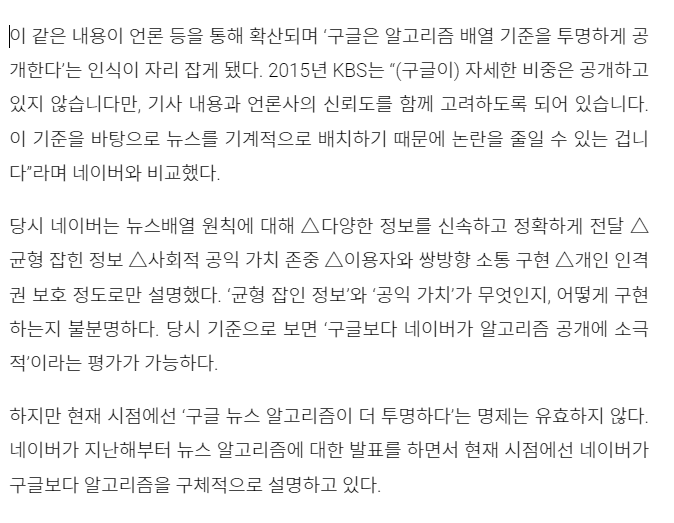

# 0511

- [0511](#0511)
- [HTML](#html)
  - [태그](#태그)
  - [앤티티](#앤티티)
  - [리스트](#리스트)
  - [중첩된 리스트](#중첩된-리스트)
  - [태그 - 컨텐츠 포함 여부](#태그---컨텐츠-포함-여부)
  - [웹 접근성](#웹-접근성)
  - [이미지 태그](#이미지-태그)
  - [링크 태그](#링크-태그)
  - [웹 화면의 구성](#웹-화면의-구성)
  - [렌더링 설정](#렌더링-설정)
  - [테이블 태그 알아보기](#테이블-태그-알아보기)

<small><i><a href='http://ecotrust-canada.github.io/markdown-toc/'>Table of contents generated with markdown-toc</a></i></small>

# HTML
## 태그
* 컨텐츠를 담는 그릇
* 컨텐츠
  * 다른 태그
  * 텍스트
  * 그림
  * 영상
  * 목록
  * 표
  * 링크
* html 문서
  * html 태그를 사용해서 작성된 문서를 뜻한다.

* heading 태그
  * `<h1> <h2> <h3> <h4> <h5> <h6>`
  * heading 태그, 제목 태그
  * 웹페이지의 내용을 파악할 때 heading태그를 이용하므로 아주 중요하다.

* paragraph 태그
  *  단락 태그
  * 본문의 내용을 담는다.
  * ex) 기사의 내용, 영화의 줄거리, 책의 소개글, 게시글의 본문, 블로그의 내용, 상품의 상세정보 등
  * `<p>` 태그와 `<p>` 태그는 단락을 구분짓는 빈 줄이 추가된다.
    > http://www.mediatoday.co.kr/news/articleView.html?idxno=303921
    
    * 기사 본문의 단락이 빈 줄로 구분되어 있다. 각각 하나의 `<p>`태그를 사용한 것이다.

* fomatting 태그
  * strong 태그
    * 컨텐츠의 "내용이 매우 중요하다"는 의미를 포함한다.
    * 컨텐츠의 내용을 진하게 표현한다.
    * `<b>`대신 사용한다.
  * em 태그 (emphasize)
    * 컨텐츠의 텍스트를 강조한다.
    * `<i>`대신 사용한다.
  * del 태그
    * 컨텐츠의 "내용을 삭제한다"라는 의미를 포함한다.
    * 컨텐츠의 중앙에 가로줄을 만들어서 텍스트를 지운것처럼 표현한다.
  * mark 태그
    * 컨텐츠의 "내용을 하이라이팅한다"라는 의미를 포함한다.
    * 컨텐츠의 내용 중 일부에 배경색을 넣어서 표현한다.            
  * small 태그
    * 컨텐츠의 "내용이 덜 중요하다, 부가적인 내용이다"라는 의미를 포함한다.
    * 컨텐츠의 내용 중 일부를 폰트사이즈를 줄여서 표현한다. (작게)

```html
<!DOCTYPE html>
<html lang="en">
  <head>
    <meta charset="UTF-8" />
    <meta http-equiv="X-UA-Compatible" content="IE=edge" />
    <meta name="viewport" content="width=device-width, initial-scale=1.0" />
    <title>태그 알아보기</title>
    <style>
      strong {
        color: red;
      }
      em {
        color: blue;
        font-style: normal;
      }
      small {
        font-weight: normal;
      }
    </style>
  </head>
  <body>
    <!--
        Heading 태그
            HTML 문서의 제목을 컨텐츠로 포함하는 태그다.
            종류 : h1, h2, h3, h4, h5, h6
            컨텐츠 : HTML 문서의 제목
            * 검색엔진이 웹페이지의 내용을 파악할 때 heading 태그의 컨텐츠를 분석해서 알아낸다.
        
        Paragraph 태그
            HTML 문서에서 본문의 내용을 컨텐츠로 포함하는 태그다.
            각각의 내용은 끊어서 구분할 수 있는 하나의 문단이다.
            종류 : p
            컨텐츠 : 구분되는 본문의 내용 (단락 혹은 문단)
        
        Formatting 태그
            HTML 문서에서 텍스트의 내용을 다양한 형식으로 표현하는 태그다.
            종류 : strong, em, del, mark, small
            컨텐츠 : 강조, 하이라이팅, 삭제된 텍스트(내용)

            strong 태그
                컨텐츠의 "내용이 매우 중요하다"는 의미를 포함한다.
                컨텐츠의 내용을 진하게 표현한다.
                <b>대신 사용한다.

            em 태그 (emphasize)
                컨텐츠의 텍스트를 강조한다.
                <i>대신 사용한다.

            del 태그
                컨텐츠의 "내용을 삭제한다"라는 의미를 포함한다.
                컨텐츠의 중앙에 가로줄을 만들어서 텍스트를 지운것처럼 표현한다.

            mark 태그
                컨텐츠의 "내용을 하이라이팅한다"라는 의미를 포함한다.
                컨텐츠의 내용 중 일부에 배경색을 넣어서 표현한다.
            
            small 태그
                컨텐츠의 "내용이 덜 중요하다, 부가적인 내용이다"라는 의미를 포함한다.
                컨텐츠의 내용 중 일부를 폰트사이즈를 줄여서 표현한다. (작게)

    -->
    <h1>HTML 태그 연습</h1>
    <p>
      HTML문서의 여러 종류의 태그로 구성된다. 종류를 살펴보고 사용방법을
      확인하자.
    </p>

    <h2>HTML의 텍스트관련 태그</h2>
    <p>
      HTML문서는 다양한 종류의 텍스트를 포함하고 있다. 텍스트의 종류에 맞는
      <strong>제목태그</strong>, <strong>단락대그</strong>,
      <strong>인용태그</strong> 들이 있다. 각 태그들의 종류와 사용법을
      확인해보자.
    </p>

    <h3>제목 태그</h3>
    <p>제목태그의 html문서의 제목을 표현하는 태그다.</p>
    <p>
      제목태그는 h1 ~ h6까지 여러 종류가 있다. 번호가 낮을 수록 더 큰 범주의
      제목을 표현하는 태그다.
    </p>
    <p>
      <em
        >제목태그에 포함된 제목은 검색엔진이 웹페이지의 내용을 분석할 때
        참고된다. HTML문서에 제목태그를 정의하면 검색결과로 더 자주 노출될 수
        있다.</em
      >
    </p>

    <h3>단락 태그</h3>
    <h3>포맷팅 태그</h3>
    <p>
      b태그는 텍스트를 진하게 표현하지만, 그 텍스트가 중요한 내용이라는 의미를
      포함하지는 않는다. 단순히 텍스트를 진하게만 표현한다. i태그는 텍스트를
      이탤릭체로 표현하지만, 그 텍스트가 강조할 내용이라는 의미를 포함하지는
      않는다. 단순히 텍스트를 이탤릭체로 표현한다. 따라서, <del>b태그</del> 대신
      <mark>strong태그</mark>를 사용하고, <del>i태그</del> 대신
      <mark>em태그</mark>를 사용하자.
      <small>작게표현하기</small>
    </p>

    <h2>html의 리스트관련 태그</h2>
    <h2>html의 테이블관련 태그</h2>
  </body>
</html>

```

## 앤티티
```html
<!DOCTYPE html>
<html lang="en">
  <head>
    <meta charset="UTF-8" />
    <meta http-equiv="X-UA-Compatible" content="IE=edge" />
    <meta name="viewport" content="width=device-width, initial-scale=1.0" />
    <title>앤티티 알아보기</title>
  </head>
  <body>
    <!--
      엔티티 (이스케이프 문자)
        html에서는 특정용도로 사용되도록 미리 예약된 문자들이 존재한다. 이를 html 예약문자라고 한다.
        대표적인 html 예약문자
          < , > , & , " , '
        이러한 예약문자는 웹 브라우저가 그대로 출력하지 않고, 미리 예약된 용도로 사용한다.
        * HTML 예약문자를 그대로 출력하기 위해서 별도로 만든 문자셋을 엔티티라고 한다.

        엔티티의 사용방법
            &엔티티이름;
            &#엔티티숫자;


        HTML의 대표적인 엔티티
        -----------------------------------------------------------------------------------------------
        엔티티문자      엔티티이름      16진수엔티티 숫자     설명
        -----------------------------------------------------------------------------------------------
                        &nbsp;          &#160;              공백문자
        <               &lt;            &#60;               
        >               &gt;            &#62;
        &               &amp;           &#38;
        "               &quot;          &#34;
        '               &apos;          &#39;
        -----------------------------------------------------------------------------------------------
    
      -->

    <h1>엔티티(Entity)</h1>
    <p>&lt;html&gt; 하루만에 끝내기</p>
    <p>
      <script>
        alert("안녕");
      </script>
    </p>
  </body>
</html>

```

## 리스트
```html
<!DOCTYPE html>
<html lang="en">
  <head>
    <meta charset="UTF-8" />
    <meta http-equiv="X-UA-Compatible" content="IE=edge" />
    <meta name="viewport" content="width=device-width, initial-scale=1.0" />
    <title>리스트 태그 알아보기</title>
  </head>
  <body>
    <!--
      HTML 리스트 태그
        HTML 문서에서 여러 요소들을 나열할 때 사용되는 태그다.
        종류
            ul - 순서없는 리스트(unordered list)
            ol - 순서있는 리스트(ordered list)
            dl - 정의 리스트(defined list)

            순서없는 리스트
              <ul>태그는 순서없는 목록을 포함하는 태그다.
              각각의 리스트 요소는 <li>를 사용한다.
              * ul태그는 li태그를 자식태그로 포함한다.
              * ul태그는 li태그 외의 다른 태그를 직접 포함할 수 없다.\
              * 목록은 들여쓰기된다.
              * 목록의 각 요소 앞에는 마커가 표시된다. 기본 마커는 원(bullet)이다.

            순서있는 리스트
                순위, 베스트셀러, 박스오피스 등이 대표적인 순서있는 리스트다.
                <ol>태그는 순서있는 목록을 포함하는 태그다.
                각각의 리스트 요소는 <li>를 사용한다.
                * ol태그는 li태그를 자식태그로 포함한다.
                * ol태그는 li태그 외의 다른 태그를 직접 포함할 수 없다.
                * 목록은 들여쓰기된다.
                * 목록의 각 요소 앞에는 숫자가 표시된다.
                * 마커는 CSS의 list-style-type 속성으로 변경할 수 있다.
                  <ul style = "list-style-type: decimal;">
                  <ul style = "list-style-type: upper-alpha;">
                  <ul style = "list-style-type: lower-alpha;">

            정의 리스트
      -->

    <h1>HTML 리스트</h1>

    ------------------------------------------------------------------------------
    <h2>순서없는 리스트</h2>
    <h3>이번달 신규 가입자 명단</h3>
    <ul>
      <li>이순신</li>
      <li>김유신</li>
      <li>홍길동</li>
      <li>강감찬</li>
      <li>류관순</li>
    </ul>
    <h3>이번달 신규 가입자 명단</h3>
    <ul style="list-style-type: square">
      <li>이순신</li>
      <li>김유신</li>
      <li>홍길동</li>
      <li>강감찬</li>
      <li>류관순</li>
    </ul>
    <h3>이번달 신규 가입자 명단</h3>
    <ul style="list-style-type: none">
      <li>이순신</li>
      <li>김유신</li>
      <li>홍길동</li>
      <li>강감찬</li>
      <li>류관순</li>
    </ul>

    ------------------------------------------------------------------------------
    <h2>순서있는리스트</h2>
    <h3>박스오피스 순위</h3>
    <ol>
      <li>닥터스트레인지</li>
      <li>범죄도시2</li>
      <li>미스미트 작전</li>
      <li>엄마</li>
      <li>어부바</li>
    </ol>
    <h3>박스오피스 순위</h3>
    <ol style="list-style-type: lower-alpha">
      <li>닥터스트레인지</li>
      <li>범죄도시2</li>
      <li>미스미트 작전</li>
      <li>엄마</li>
      <li>어부바</li>
    </ol>

    ------------------------------------------------------------------------------
    <h2>정의 리스트</h2>
    <h3>책 정보</h3>
    <dl>
      <dt>제목</dt>
      <dd>마음의 법칙</dd>

      <dt>저자</dt>
      <dd>폴커 키츠</dd>
      <dd>미누엘 루쉬</dd>

      <dt>출판사</dt>
      <dd>포레스트북스</dd>
    </ol>

  </body>
</html>

```

## 중첩된 리스트
```html
<!DOCTYPE html>
<html lang="en">
  <head>
    <meta charset="UTF-8" />
    <meta http-equiv="X-UA-Compatible" content="IE=edge" />
    <meta name="viewport" content="width=device-width, initial-scale=1.0" />
    <title>중첩된 리스트 태그 알아보기</title>
  </head>
  <body>
    <h1>HTML 리스트</h1>
    <p>중첩된 리스트를 작성해보자</p>

    <h3>카테고리</h3>
    <ul>
      <li>
        도서
        <ul>
          <li>
            국내도서
            <ul>
              <li>인문</li>
              <li>소설</li>
              <li>경제</li>
              <li>자연과학</li>
              <li>IT</li>
            </ul>
          </li>
          <li>외국도서</li>
          <li>eBook</li>
          <li>웹소설/웹툰</li>
        </ul>
      </li>
      <li>
        티켓
        <ul>
          <li>콘서트</li>
          <li>뮤지컬</li>
          <li>연극</li>
          <li>클래식</li>
        </ul>
      </li>
    </ul>

    <h3>베스트 셀러</h3>
    <ul>
      <li>
        국내도서
        <ol>
          <li>문재인 대통령의 사진 에세이</li>
          <li>삶의 가장 빛나는 순간을 찾는 시간</li>
          <li>흔한 남매 10</li>
          <li>작별인사</li>
          <li>불편한 편의점</li>
        </ol>
      </li>
      <li>eBook</li>
    </ul>
  </body>
</html>

```

## 태그 - 컨텐츠 포함 여부
* 컨텐츠를 포함하는 태그
  * 여는태그, 닫는태그가 필요하다.
  ```html
  <h1>컨텐츠</h1>
  <p>컨텐츠><p>
  <ul>
    <li>컨텐츠</li>
  </ul>
  <strong>컨텐츠</strong>
  ```
* 컨텐츠를 포함하지 않는 태그
  * 닫는 태그가 필요없다.
  ```html
  
  <input type="text" name="username" value="홍길동">
  <br>
  <hr>

  <!-- 
    열자 마자 닫을 수 있다. " /"를 붙인다.(붙이지 않아도 상관없다.)
  -->
  
  <input type="text" name="username" value="홍길동" />
  <br />
  <hr />
  ```

## 웹 접근성
> https://ko.wikipedia.org/wiki/%EC%9B%B9_%EC%A0%91%EA%B7%BC%EC%84%B1
* 웹접근성은 장애를 가지든 안가지든 모든 사람이 쉽고 편리하게 웹사이트를 이용할 수 있게 하는 방식을 말한다.
* 시각, 운동성, 청각, 발작, 인지 등의 사항을 고려한다.
* 스크린 리더 sw와 같은 보조과학기술을 사용하기도 한다.
* 대부분의 공공 사이트나 대규모 포털사이트는 웹 접근성을 고려해 디자인한다.

## 이미지 태그
* style 속성을 적지 않고 크기를 지정할 수 있지만 권장되지 않는다.
* style 속성을 통해 크기를 지정해야 다양한 방식으로 크기를 설정할 수 있다.
* alt 속성을 적는 것은 웹 접근성을 고려한 방식이다.
* 경로가 일치하지 않으면 이미지를 불러올 수 없다.

* 주소 표기법
  1. 절대주소표기법
     * 자원의 위치를 정의할 때 "/"로 시작하지 않으면 전부 상대 주소 표기법이다.
  2. 상대주소표기법

```html
<!DOCTYPE html>
<html lang="en">
  <head>
    <meta charset="UTF-8" />
    <meta http-equiv="X-UA-Compatible" content="IE=edge" />
    <meta name="viewport" content="width=device-width, initial-scale=1.0" />
    <title>이미지 태그 알아보기</title>
  </head>
  <body>
    <!--
      image 태그
        이미지를 표시하는 태그다.
        종류 : img
        컨텐츠 : 없음
        주요 속성
            src : 이미지의 전체 경로 및 이미지 파일명을 정의
            alt : 이미지에 대한 설명을 정의한다. (웹접근성 고려)
    -->

    <h1>HTML 이미지 태그</h1>
    
    
    
    
  </body>
</html>

```

## 링크 태그
```html
<!DOCTYPE html>
<html lang="ko">
  <head>
    <meta charset="UTF-8" />
    <meta http-equiv="X-UA-Compatible" content="IE=edge" />
    <meta name="viewport" content="width=device-width, initial-scale=1.0" />
    <title>링크 태그 알아보기</title>
  </head>
  <body>
    <!--
    링크 태그
        다른 HTML 문서와 연결되는 하이퍼링크(hyperlink)를 정의한다.
        종류 : a
        컨텐츠 : 하이퍼링크
        주요속성
            href : 링크주소 , URL
                문서내부           : href="#아이디"
                프로젝트 내의 문서  : href="폴더명/파일명"
                외부 문서          : href="http://www.daum.net/index.html"
                    * href속성값이 "http://"나 "https://"로 시작된다.
            target : 연결된 문서를 어디에서 열지를 지정한다.    
                target="_blank" : 링크로 연결된 문서를 새 창이나 새 탭에서 연다.
                target="_self" : 링크로 연결된 문서를 현재 창에서 연다.(기본값)
            title : 풍선도움말(툴팁)에 표시할 내용을 정의한다.
-->
    <h1>HTML 링크 태그</h1>

    <p id="first-p">
      HTML (Hypertext Markup Language,하이퍼텍스트 마크업 언어)는 프로그래밍
      언어는 아니고, 우리가 보는 웹페이지가 어떻게 구조화되어 있는지 브라우저로
      하여금 알 수 있도록 하는 마크업 언어입니다. 이는 개발자로 하여금
      복잡하게도 간단하게도 프로그래밍 할 수 있습니다. HTML은 elements로
      구성되어 있으며, 이들은 적절한 방법으로 나타내고 실행하기 위해 각 컨텐츠의
      여러 부분들을 감싸고 마크업 합니다. tags 는 웹 상의 다른 페이지로 이동하게
      하는 하이퍼링크 내용들을 생성하거나, 단어를 강조하는 등의 역할을 합니다.
      예를들어, 다음의 내용을 봅시다.HTML (Hypertext Markup
      Language,하이퍼텍스트 마크업 언어)는 프로그래밍 언어는 아니고, 우리가 보는
      웹페이지가 어떻게 구조화되어 있는지 브라우저로 하여금 알 수 있도록 하는
      마크업 언어입니다. 이는 개발자로 하여금 복잡하게도 간단하게도 프로그래밍
      할 수 있습니다. HTML은 elements로 구성되어 있으며, 이들은 적절한 방법으로
      나타내고 실행하기 위해 각 컨텐츠의 여러 부분들을 감싸고 마크업 합니다.
      tags 는 웹 상의 다른 페이지로 이동하게 하는 하이퍼링크 내용들을
      생성하거나, 단어를 강조하는 등의 역할을 합니다. 예를들어, 다음의 내용을
      봅시다.HTML (Hypertext Markup Language,하이퍼텍스트 마크업 언어)는
      프로그래밍 언어는 아니고, 우리가 보는 웹페이지가 어떻게 구조화되어 있는지
      브라우저로 하여금 알 수 있도록 하는 마크업 언어입니다. 이는 개발자로
      하여금 복잡하게도 간단하게도 프로그래밍 할 수 있습니다. HTML은 elements로
      구성되어 있으며, 이들은 적절한 방법으로 나타내고 실행하기 위해 각 컨텐츠의
      여러 부분들을 감싸고 마크업 합니다. tags 는 웹 상의 다른 페이지로 이동하게
      하는 하이퍼링크 내용들을 생성하거나, 단어를 강조하는 등의 역할을 합니다.
      예를들어, 다음의 내용을 봅시다.
    </p>

    <p id="second-p">
      HTML (Hypertext Markup Language,하이퍼텍스트 마크업 언어)는 프로그래밍
      언어는 아니고, 우리가 보는 웹페이지가 어떻게 구조화되어 있는지 브라우저로
      하여금 알 수 있도록 하는 마크업 언어입니다. 이는 개발자로 하여금
      복잡하게도 간단하게도 프로그래밍 할 수 있습니다. HTML은 elements로
      구성되어 있으며, 이들은 적절한 방법으로 나타내고 실행하기 위해 각 컨텐츠의
      여러 부분들을 감싸고 마크업 합니다. tags 는 웹 상의 다른 페이지로 이동하게
      하는 하이퍼링크 내용들을 생성하거나, 단어를 강조하는 등의 역할을 합니다.
      예를들어, 다음의 내용을 봅시다.HTML (Hypertext Markup
      Language,하이퍼텍스트 마크업 언어)는 프로그래밍 언어는 아니고, 우리가 보는
      웹페이지가 어떻게 구조화되어 있는지 브라우저로 하여금 알 수 있도록 하는
      마크업 언어입니다. 이는 개발자로 하여금 복잡하게도 간단하게도 프로그래밍
      할 수 있습니다. HTML은 elements로 구성되어 있으며, 이들은 적절한 방법으로
      나타내고 실행하기 위해 각 컨텐츠의 여러 부분들을 감싸고 마크업 합니다.
      tags 는 웹 상의 다른 페이지로 이동하게 하는 하이퍼링크 내용들을
      생성하거나, 단어를 강조하는 등의 역할을 합니다. 예를들어, 다음의 내용을
      봅시다.HTML (Hypertext Markup Language,하이퍼텍스트 마크업 언어)는
      프로그래밍 언어는 아니고, 우리가 보는 웹페이지가 어떻게 구조화되어 있는지
      브라우저로 하여금 알 수 있도록 하는 마크업 언어입니다. 이는 개발자로
      하여금 복잡하게도 간단하게도 프로그래밍 할 수 있습니다. HTML은 elements로
      구성되어 있으며, 이들은 적절한 방법으로 나타내고 실행하기 위해 각 컨텐츠의
      여러 부분들을 감싸고 마크업 합니다. tags 는 웹 상의 다른 페이지로 이동하게
      하는 하이퍼링크 내용들을 생성하거나, 단어를 강조하는 등의 역할을 합니다.
      예를들어, 다음의 내용을 봅시다.
    </p>

    <h3>프로젝트 내의 html문서와 연결되는 링크 정의하기</h3>
    <a href="#first-p">첫번째 단락</a>
    <a href="#second-p">두번째 단락</a>

    <h3>프로젝트 내의 html문서와 연결되는 링크 정의하기</h3>
    <a href="tag1-text.html">텍스트 태그1</a>
    <a href="tag1-text.html" target="_blank">텍스트 태그2</a>
    <a href="tag1-text.html">리스트 태그1</a>
    <a href="tag1-text.html" target="_blank">리스트 태그2</a>

    <h3>프로젝트 외부 페이지나 사이트와 연결되는 링크 정의하기</h3>
    <a href="http://www.daum.net">다음</a>
    <a href="http://www.google.com">구글</a>
    <a href="http://www.naver.com">네이버</a>

    <h3>이미지에 링크 걸기</h3>
    <a
      href="https://www.google.com/search?sxsrf=ALiCzsaX7DwfMbB4tC9ERVfNjSe3cfUxsw:1652249490744&q=%EA%B9%80%EC%88%98%EC%98%81+Don%E2%80%99t+Know&stick=H4sIAAAAAAAAAONgFuLVT9c3NEwqKzEtMrBIV4Jwc_Oyi9IKktK1xLOTrfRzS4szk_UTi0oyi0usEnOSSnOLHzFOZ-IWePnjnrBUL9OkNSevMbYxceFSLGTIxeaaV5JZUikkKMXPhWqjkQhUINssO8k8J9lQYO-PqYxKmxmN0nddmnaOLVFwhwsDw4_dQQ5ShoK7j050PCvy3l5LkIvNJT83MTNPUL__x_6s_0AhYS6OkMSK_Lz83ErB0EqGhJp_7-2VFDnvTjBSTBfeaC8Yy82YsD_RyUGCRYFBg8HwkSWrw_opjAe0GIK49XP1DQwNLYpMjSqDOEEco5wKo6IDjEyPGOVw-kq0dvlkx6Z9Kw6xcXAwCjAYMXEwVAExzyJWsVc7G950zHgzo1HBJT_vUcPMEgXvvPzyCWyMAKen6Q1wAQAA&sa=X"
      ></a>
  </body>
</html>

```

```html
<!DOCTYPE html>
<html lang="ko">
  <head>
    <meta charset="UTF-8" />
    <meta http-equiv="X-UA-Compatible" content="IE=edge" />
    <meta name="viewport" content="width=device-width, initial-scale=1.0" />
    <title>링크 태그 알아보기2</title>
    <style>
      ul {
        list-style-type: none; /* 리스트 아이템 앞에 마크를 표시하지 않는다. */
        margin: 0; /* 바깥쪽 여백(다른 태그와의 여백 혹은 브라우저와 해당 태그와의 여백)을 전부 없앤다. */
        padding: 0; /* 안쪽 여백(테두리와 컨텐츠 사이의 여백)을 전부 없앤다. */
        overflow: hidden; /* 콘텐츠가 클 때 블록 서식에 맞출 수 없을 때 처리 방법을 지정한다.*/
        background-color: #333; /* ul태그의 배경색을 까만색으로 지정한다.*/
      }

      li {
        display: inline; /* 인라인으로 디스플레이 된다.*/
        float: left; /* 왼쪽으로 떠있는 모습 */
      }

      a {
        display: block;
        padding: 8px;
        background-color: #dddddd;
      }
    </style>
  </head>
  <body>
    <h1>리스트와 링크를 활용해서 내비게이션 바 만들기</h1>

    <ul>
      <li>홈</li>
      <li>뉴스</li>
      <li>스포츠</li>
      <li>연예</li>
      <li>영화</li>
      <li>자동차</li>
    </ul>
  </body>
</html>

```

## 웹 화면의 구성

* html 태그에는 데이터 즉, 내용을 담는다.
* css는 보여지는 디자인을 담당한다. (웹 퍼블리셔가 담당한다.)
* javascript는 사용자와 상호작용하는 코드로 가장 중요하다.

## 렌더링 설정
```html
<!--
  <meta http-equiv="X-UA-Compatible" content="IE=edge" />
      X-UA-Compatible : 웹페이지를 렌더링할 Internet Explorer버전을 지정한다.
      IE=edge : 해당 웹브라우저에서 사용할 수 있는 가장 높은 Internet Explorer 모드로 렌더링하게 한다.
-->
<meta http-equiv="X-UA-Compatible" content="IE=edge" />
<!--
  <meta name="viewport" content="width=device-width, initial-scale=1.0" />
      웹페이지를 모바일 장치에서 열었을 때, viewport의 너비를 모바일 장치의 너비와 같은 너비로 지정한다.
      모든 모바일 장치에 대해서 적절하게 페이지가 렌더링되고, 터치를 이용한 확대/축소를 보장받을 수 있다.
-->
<meta name="viewport" content="width=device-width, initial-scale=1.0" />
```

## 테이블 태그 알아보기
```html
<!DOCTYPE html>
<html lang="ko">
  <head>
    <meta charset="UTF-8" />
    <!--
        <meta http-equiv="X-UA-Compatible" content="IE=edge">
            X-UA-Compatible은 웹페이지를 렌더링할 Internet Explorer 버전을 지정한다. 
            IE=edge는 해당 웹브라우저에서 사용할 수 있는 가장 높은 Internet Explorer 모드로 렌더링하게 한다.
    -->
    <meta http-equiv="X-UA-Compatible" content="IE=edge" />
    <!--
        <meta name="viewport" content="width=device-width, initial-scale=1.0">
            웹페이지를 모바일장치에서 열었을 때, viewport의 너비를 모바일장치의 너비와 같은 너비로 지정한다.
            모든 모바일 장치에 대해서 적절하게 페이지가 렌더링되고, 터치를 이용한 확대/축소를 보장받을 수 있다.
    -->
    <meta name="viewport" content="width=device-width, initial-scale=1.0" />
    <title>Document</title>
    <style>
      table {
        border-collapse: collapse; /* 표의 모든 테두리를 합친다. */
        width: 100%; /* 표의 너비를 브라우저의 너비만큼 설정한다 */
      }
      td,
      th {
        border: 1px solid #333; /* th(title cell)과 td(data cell)에 테두리를 추가한다. 테두리는 두께 1px, 실선, 검정색 선이다 */
        padding: 8px; /* th, td의 테두리와 컨텐츠 사이에 8px만큼 안쪽여백을 설정한다. */
        text-align: left; /* th, td의 컨텐츠를 왼쪽 설정시킨다 */
      }
      thead th {
        /* thead에 포함된 th에만 스타일이 적용되게 한다. */
        background-color: #333;
        color: white;
      }
      tbody tr:nth-child(even) {
        /* tbody안에 포함된 tr중에서 짝수번째 tr에만 스타일이 적용되게 한다.*/
        background-color: #ddd;
      }
      tfoot td {
        /* tfoot안에 포함된 td에만 스타일이 적용되게 한다.*/
        font-weight: bolder;
      }
    </style>
  </head>
  <body>
    <!--
    표 작성하기
        종류 : table, thead, tbody, tfoot, tr, th, td, caption

        table
            표를 작성하는 태그다.
            thead, tbody, tfoot태그를 포함한다.
            tr태그를 포함한다.
        thead
            표의 헤더부를 작성하는 태그다.
            tr태그를 자식태그로 포함한다.
        tbody
            표의 바디부를 작성하는 태그다.
            표의 주요 데이터를 포함한다.
            tr태그를 자식태그로 포함한다.
        tfoot
            표의 푸터부를 작성하는 태그다.
            사용빈도가 매우 적다.
            tr태그를 자식태그로 포함한다.
        tr (table row)
            표의 행을 작성하는 태그다.
            th태그나 td태그를 자식태그로 포함한다.
        th (table header cell)
            표의 컬럼 제목을 포함하는 태그다.
        td (table data cell)
            표의 데이터를 포함하는 태그다.
        caption
            표의 캡션(간단한 설명)을 포함하는 태그다.
            사용빈도가 매우 적다.

        사용예시
        <table>
            <thead>
                <tr>
                    <th>번호</th>
                    <th>이름</th>
                    <th>연락처</th>
                </tr>
            </thead>
            <tbody>
                <tr>
                    <td>10</td>
                    <td>김유신</td>
                    <td>010-1111-1111</td>
                </tr>
                <tr>
                    <td>12</td>
                    <td>강감찬</td>
                    <td>010-2222-2222</td>
                </tr>
                <tr>
                    <td>13</td>
                    <td>이순신</td>
                    <td>010-1111-3333</td>
                </tr>
            </tbody>
            <tfoot>
                <tr>
                    <td colspan="2">총인원수<td>
                    <td>3명</td>
                </tr>
            </tfoot>
        </table>

        ---------------------------------
        | 번호 | 이름   | 연락처         |
        ---------------------------------
        | 10   | 김유신 | 010-1111-1111 |
        ---------------------------------
        | 12   | 강감찬 | 010-2222-2222 |
        ---------------------------------
        | 13   | 이순신 | 010-1111-3333 |
        ---------------------------------
        | 총인원수      | 3명           |
        ---------------------------------
-->
    <h1>표 작성하기</h1>

    <h3>샘플 테이블</h3>
    <table>
      <thead>
        <tr>
          <th>순번</th>
          <th>제목</th>
          <th>가격</th>
          <th>수량</th>
          <th>구매가격</th>
        </tr>
      </thead>
      <tbody>
        <tr>
          <td>1</td>
          <td>이것이 자바다</td>
          <td>35,000 원</td>
          <td>1</td>
          <td>35,000 원</td>
        </tr>
        <tr>
          <td>2</td>
          <td>자바의 정석</td>
          <td>20,000 원</td>
          <td>2</td>
          <td>40,000 원</td>
        </tr>
        <tr>
          <td>3</td>
          <td>혼자서 공부하는 자바</td>
          <td>25,000 원</td>
          <td>1</td>
          <td>25,000 원</td>
        </tr>
        <tr>
          <td>1</td>
          <td>이것이 자바다</td>
          <td>35,000 원</td>
          <td>1</td>
          <td>35,000 원</td>
        </tr>
        <tr>
          <td>2</td>
          <td>자바의 정석</td>
          <td>20,000 원</td>
          <td>2</td>
          <td>40,000 원</td>
        </tr>
        <tr>
          <td>3</td>
          <td>혼자서 공부하는 자바</td>
          <td>25,000 원</td>
          <td>1</td>
          <td>25,000 원</td>
        </tr>
      </tbody>
      <tfoot>
        <tr>
          <td colspan="4">총구매금액</td>
          <td>100,000 원</td>
        </tr>
      </tfoot>
    </table>
  </body>
</html>

```