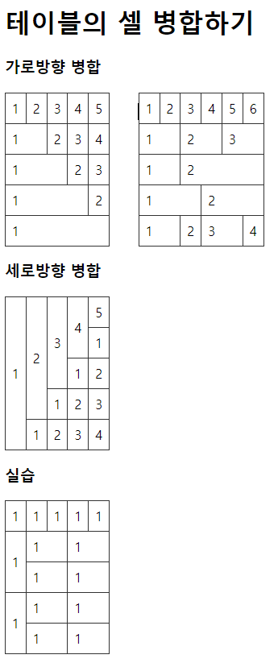

# 0512

- [0512](#0512)
- [HTML 태그](#html-태그)
  - [테이블 태그](#테이블-태그)
    - [테이블 병합하기](#테이블-병합하기)
    - [셀의 너비 지정하기](#셀의-너비-지정하기)
  - [form 태그](#form-태그)
  - [div, span 태그](#div-span-태그)
  - [id와 class 속성](#id와-class-속성)

<small><i><a href='http://ecotrust-canada.github.io/markdown-toc/'>Table of contents generated with markdown-toc</a></i></small>

# HTML 태그
## 테이블 태그
### 테이블 병합하기
* 가로방향 병합
  * colspan
    * `<th colspan="숫자"></th>`
    * `<td colspan="숫자"></td>`
* 세로방향 병합
  * rowspan
    * `<th rowspan="숫자"></th>`
    * `<td rowspan="숫자"></td>`

```html
<!DOCTYPE html>
<html lang="ko">
  <head>
    <meta charset="UTF-8" />
    <meta http-equiv="X-UA-Compatible" content="IE=edge" />
    <meta name="viewport" content="width=device-width, initial-scale=1.0" />
    <title>테이블 알아보기2</title>
    <style>
      table {
        margin-top: 7px;
        width: 40%; /* 표의 너비를 브라우저의 너비만큼 설정한다 */
        border-collapse: collapse; /* 표의 모든 테두리를 합친다. */
        margin-right: 30px;
        display: inline;
      }
      td,
      th {
        border: 1px solid #333; /* th(title cell)과 td(data cell)에 테두리를 추가한다. 테두리는 두께 1px, 실선, 검정색 선이다 */
        padding: 8px; /* th, td의 테두리와 컨텐츠 사이에 8px만큼 안쪽여백을 설정한다. */
        text-align: left; /* th, td의 컨텐츠를 왼쪽 설정시킨다 */
      }
    </style>
  </head>
  <body>
    <!--
      셀 병합하기
        가로방향 병합
          <th colspan="숫자"></th>
          <td colspan="숫자"></td>
        세로방향 병합
          <th rowspan="숫자"></th>
          <td rowspan="숫자"></td>
    -->

    <h1>테이블의 셀 병합하기</h1>

    <h3>가로방향 병합</h3>
    <table>
      <tbody>
        <tr>
          <td>1</td>
          <td>2</td>
          <td>3</td>
          <td>4</td>
          <td>5</td>
        </tr>
        <tr>
          <td colspan="2">1</td>
          <td>2</td>
          <td>3</td>
          <td>4</td>
        </tr>
        <tr>
          <td colspan="3">1</td>
          <td>2</td>
          <td>3</td>
        </tr>
        <tr>
          <td colspan="4">1</td>
          <td>2</td>
        </tr>
        <tr>
          <td colspan="5">1</td>
        </tr>
      </tbody>
    </table>

    <table>
      <tbody>
        <tr>
          <td>1</td>
          <td>2</td>
          <td>3</td>
          <td>4</td>
          <td>5</td>
          <td>6</td>
        </tr>
        <tr>
          <td colspan="2">1</td>
          <td colspan="2">2</td>
          <td colspan="2">3</td>
        </tr>
        <tr>
          <td colspan="2">1</td>
          <td colspan="4">2</td>
        </tr>
        <tr>
          <td colspan="3">1</td>
          <td colspan="3">2</td>
        </tr>
        <tr>
          <td colspan="2">1</td>
          <td>2</td>
          <td colspan="2">3</td>
          <td>4</td>
        </tr>
      </tbody>
    </table>

    <h3>세로방향 병합</h3>
    <table>
      <tbody>
        <tr>
          <td rowspan="5">1</td>
          <td rowspan="4">2</td>
          <td rowspan="3">3</td>
          <td rowspan="2">4</td>
          <td rowspan="1">5</td>
        </tr>
        <tr>
          <td>1</td>
        </tr>
        <tr>
          <td>1</td>
          <td>2</td>
        </tr>
        <tr>
          <td>1</td>
          <td>2</td>
          <td>3</td>
        </tr>
        <tr>
          <td>1</td>
          <td>2</td>
          <td>3</td>
          <td>4</td>
        </tr>
      </tbody>
    </table>

    <h3>실습</h3>
    <table>
      <tbody>
        <tr>
          <td>1</td>
          <td>1</td>
          <td>1</td>
          <td>1</td>
          <td>1</td>
        </tr>
        <tr>
          <td rowspan="2">1</td>
          <td colspan="2">1</td>
          <td colspan="2">1</td>
       </tr>
        <tr>
          <td colspan="2">1</td>
          <td colspan="2">1</td>
        </tr>
        <tr>
          <td rowspan="2">1</td>
          <td colspan="2">1</td>
          <td colspan="2">1</td>
        </tr>
          <td colspan="2">1</td>
          <td colspan="2">1</td>
        </tr>
      </tbody>
    </table>
  </body>
</html>

```


### 셀의 너비 지정하기
```html
<!DOCTYPE html>
<html lang="ko">
  <head>
    <meta charset="UTF-8" />
    <meta http-equiv="X-UA-Compatible" content="IE=edge" />
    <meta name="viewport" content="width=device-width, initial-scale=1.0" />
    <title>테이블 알아보기3</title>
    <style>
      table {
        margin-top: 10px;
        width: 100%; /* 표의 너비를 브라우저의 너비만큼 설정한다 */
        border-collapse: collapse; /* 표의 모든 테두리를 합친다. */
      }
      td,
      th {
        padding: 16px;
        text-align: left; /* th, td의 컨텐츠를 왼쪽 설정시킨다 */
        border: 1px solid black;
        text-align: center;
      }
    </style>
  </head>
  <body>
    <h1>셀의 너비 지정하기</h1>

    <table>
      <colgroup>
        <col width="8%" />
        <col width="*%" />
        <col width="20%" />
        <col width="12%" />
        <col width="12%" />
        <col width="8%" />
      </colgroup>
      <thead>
        <tr>
          <th>번호</th>
          <th>제목</th>
          <th>저자</th>
          <th>가격</th>
          <th>할인가격</th>
          <th>재고량</th>
        </tr>
      </thead>
      <tbody>
        <tr>
          <td>101</td>
          <td>이것이 자바다</td>
          <td>홍길동</td>
          <td>35,000</td>
          <td><strong>32,000</strong> 원</td>
          <td>10 권</td>
        </tr>
        <tr>
          <td>101</td>
          <td>이것이 자바다</td>
          <td>홍길동</td>
          <td>35,000</td>
          <td><strong>32,000</strong> 원</td>
          <td>10 권</td>
        </tr>
        <tr>
          <td>101</td>
          <td>이것이 자바다</td>
          <td>홍길동</td>
          <td>35,000</td>
          <td><strong>32,000</strong> 원</td>
          <td>10 권</td>
        </tr>
        <tr>
          <td>101</td>
          <td>이것이 자바다</td>
          <td>홍길동</td>
          <td>35,000</td>
          <td><strong>32,000</strong> 원</td>
          <td>10 권</td>
        </tr>
        <tr>
          <td>101</td>
          <td>이것이 자바다</td>
          <td>홍길동</td>
          <td>35,000</td>
          <td><strong>32,000</strong> 원</td>
          <td>10 권</td>
        </tr>
      </tbody>
    </table>
  </body>
</html>

```

## form 태그
```html
<!DOCTYPE html>
<html lang="ko">

<head>
  <meta charset="UTF-8">
  <meta http-equiv="X-UA-Compatible" content="IE=edge">
  <meta name="viewport" content="width=device-width, initial-scale=1.0">
  <title>Document</title>
</head>

<body>
  <!--
    폼과 폼입력요소
    * 입력폼
        <form>
            입력폼을 생성한다.
            form태그는 여러 개의 폼입력 요소(태그)를 포함한다.

    * 폼입력 요소
        <input>
            입력필드, 비밀번호필드, 체크박스, 라디오버튼, 첨부파일필드, 날짜/시간 입력필드 등을 생성한다.
            input태그의 주요 속성
                type 속성
                    type="text"             입력필드 생성
                    type="password"         비밀번호 필드 생성
                    type="checkbox"         체크박스 생성
                    type="radio"            라디오버튼 생성
                    type="file"             첨부파일 선택필드 생성
                    type="date"             날짜 입력필드 생성
                    type="time"             시간 입력필드 생성
                    type="datetime-local"   날짜와 시간 입력필드 생성
                    type="number"           숫자 입력필드 생성
                    type="reset"            폼 입력요소의 입력값을 리셋시키는 버튼 생성
                    type="submit"           폼 입력요소에 입력된 값을 웹서버로 제출하는 버튼 생성
                    type="button"           버튼 생성
                name 속성
                    폼입력요소의 이름을 지정한다.
                        <input type="text" name="userId" />
                        <input type="password" name="pwd" />
                    제출버튼을 클릭하면 폼입력요소에 입력한 입력값이 지정된 이름으로 서버에 전달된다.
                    * 폼입력요소에서 name속성은 꼭 필요한 속성이다.
                value 속성
                    폼입력요소의 값을 설정한다.
                        <input type="text" name="userId" value="hong"/>
                    * 첨부파일 입력필드에는 보안상의 이유로 value속성을 설정할 수 없다.
                checked 속성
                    체크박스와 라디오버튼만 사용할 수 있는 속성이다.
                    체크박스나 라디오버튼을 체크상태로 만든다.
                        <input type="checkbox" name="skill" value="java" checked="checked"> 자바
                        <input type="checkbox" name="skill" value="java" checked> 자바
                        <input type="radio" name="gender" value="female" checked="checked"> 여자
                        <input type="radio" name="gender" value="female" checked> 여자
                min, max, step 속성
                    숫자입력필드에서만 사용할 수 있는 속성이다.
                    각각 최소값, 최대값, 증감치를 설정한다.
                        <input type="number" name="amount" value="100" min="0" max="1000" step="10" >
                minlength, maxlength
                    텍스트 입력필드, 비밀번호 입력필드에서 사용할 수 있는 속성이다.
                    최소문자열 길이, 최대문자열 길이를 설정한다.
                    최대문자열 길이 이상 입력할 수 없다.
                        <input type="text" name="name" minlength="2" maxlength="10">
        <select>
            콤보박스를 생성한다.
            select태그는 option태그를 자식태그로 포함한다.
            option태그는 텍스트컨텐츠와 value 속성을 가진다.
            option태그의 value 속성은 해당 select박스의 선택된 값이 된다.
                <select name="city">
                    <option value="서울"> 서울특별시</option>
                    <option value="부산"> 부산광역시</option>
                    <option value="인천"> 인천광역시</option>
                </select>
                * form 입력값이 서버로 전달될 때 "city=서울" 혹은 "city=부산"이 전달된다.
            selected 속성
                option태그에서만 사용할 수 있는 속성이다.
                해당 option을 선택상태로 설정한다.
                    <option value="서울" selected="selected"> 서울특별시</option>
                    <option value="서울" selected> 서울특별시</option>
        <textarea>
            텍스트 입력 상자를 생성한다. 텍스트를 여러 줄 작성할 수 있다.
            반드시 여는 태그와 닫는 태그의 쌍으로 작성한다.
            텍스트 입력 상자의 값(텍스트)은 여는 태그와 닫는 태그 사이에 지정한다.
                <textarea>입력상자의 텍스트는 여기에 적는다.</textarea>
            rows, cols 속성
                텍스트 입력상자의 줄 수와 컬럼 수를 설정한다.
                    <textarea rows="10" cols="60">입력상자의 텍스트는 여기에 적는다.</textarea>
    
    폼입력요소의 공통 속성
            name 속성
                폼입력요소의 이름을 설정한다.
                모든 폼 입력요소는 name속성이 필요하다.
                name속성에 지정된 이름으로 입력값이 서버로 전달된다.
            value 속성
                input, option에서 사용가능한 속성이다.
                폼입력요소의 값을 설정한다.
                * input중에서 <input type="checkbox" value="값"/>와 <input type="radio" value="값">는 value속성으로 값을 미리 설정한다.
                * <option value="값"> 텍스트</option>
            checked 속성
                input중에서 <input type="checkbox"/>와 <input type="radio">에 설정하는 속성이다.
                체크박스와 라디오버튼을 체크상태로 만든다.
            selected 속성
               option태그에서만 사용할 수 있는 속성이다.
               해당 옵션을 선택상태로 만든다.
            readonly 속성
                폼 입력요소를 읽기 전용의 입력요소롤 설정한다.
                사용자가 폼 입력요소의 값을 수정할 수 없다.
                    <input type="text" name="userName" value="홍길동" readonly="readonly">
            disabled 속성
                폼 입력요소를 비활성화시킨다.
                비활성화된 폼입력요소의 입력값은 서버로 전달되지 않는다.
                    <input type="text" name="userName" disabled="disabled">
                    <select name="city" disabled="disabled">
                        <option value="값"> 텍스트</option>
                        <option value="값" disabled="disabled"> 텍스트</option>
                        <option value="값"> 텍스트</option>
                    </select>
                    <textarea name="memo" disabled="disabled"></textarea>
            placeholder 속성
                입력값에 대한 힌트를 제공한다.
                    <input type="texst" name
-->
  <h1>폼과 폼입력 요소</h1>

  <h3>입력폼과 입력요소 생성하기</h3>
  <form action="register.jsp">
    텍스트 입력필드 : <input type="text" name="userName" value="홍길동" minlength="2" maxlength="10" readonly="readonly"> <br />
    비밀번호 입력필드 : <input type="password" name="userPwd" minlength="8" maxlength="20"> <br />
    체크박스 : <input type="checkbox" name="userSkill" value="java" checked> 자바
    <input type="checkbox" name="userSkill" value="js" checked="checked"> 자바스크립트
    <input type="checkbox" name="userSkill" value="python"> 파이썬
    <input type="checkbox" name="userSkill" value="sql"> SQL <br />
    라디오버튼 : <input type="radio" name="userGender" value="male"> 남성
    <input type="radio" name="userGender" value="female" checked="checked"> 여성 <br />
    첨부파일 입력필드 : <input type="file" name="userPhoto"> <br />
    날짜 입력필드 : <input type="date" name="birthday" value="2022-05-11"> <br />
    시간 입력필드 : <input type="time" name="birthtime" value="16:20"> <br />
    날짜와 시간 입력필드 : <input type="datetime-local" name="birthdayAndTime" value="2022-05-11T16:20"> <br />
    숫자 입력필드 : <input type="number" name="age" value="10" min="5" max="150" step="5"> <br />
    숨김 입력필드 : <input type="hidden" name="today" value="2022-05-11"> <br />
    셀렉터박스 : <select name="userCity">
      <option value="" selected="selected" disabled="disabled"> --도시를 선택하세요--</option>
      <option value="서울"> 서울특별시</option>
      <option value="인천"> 인천광역시</option>
      <option value="부산"> 부산광역시</option>
      <option value="광주"> 광주광역시</option>
      <option value="대전"> 대전광역시</option>
      <option value="대구" disabled="disabled"> 대구광역시</option>
      <option value="울산" disabled="disabled"> 울산광역시</option>
    </select> <br />
    텍스트 입력상자 : <textarea name="memo" rows="5" cols="60">내용을 입력하세요.</textarea> <br />
    텍스트 입력상자 : <textarea name="memo" rows="5" cols="60">입력상자의 텍스트는 여기에 적는다.</textarea> <br />

    리셋버튼 : <input type="reset"> <br />
    제출버튼 : <input type="submit">
  </form>
</body>

</html>
```

## div, span 태그
* 컨테이너 태그
* div
  * 블록앨리먼트
  * div, 모든 블록 앨리먼트, 모든 일라인 앨리먼트를 담는 태그
* span
  * 인라인 앨리먼트
  * 텍스트의 일부분

## id와 class 속성
* 모든 태그가 가지는 속성
* id 속성
  * HTML 문서에서 특정 앨리먼트(태그)를 고유하게 식별할 수 있는 값을 가진다.
    ```html
    <div id="news">
      <div id="news-section"></div>
      <div id="sports-section"></div>
      <div id="art-section"></div>
      <div id="movie-section"></div>
    </div>
    ```
  * HTML 문서에서 같은 속성값을 갖는 id는 존재하지 않아야 한다.
* class 속성
  * HTML 문서에서 같은 스타일로 표시할 앨리먼트들은 class속성이 같은 값을 가진다.
    ```html
    <style>
      .movie-poster { 영화포스트 스타일 지정 }
    </style>
    <div id="boxoffice">
      <div class="movie-poster"><h3>영화제묵</h3> <strong>순위</strong>  <p>영화설명</p></div>
      <div class="movie-poster"><h3>영화제묵</h3> <strong>순위</strong>  <p>영화설명</p></div>
      <div class="movie-poster"><h3>영화제묵</h3> <strong>순위</strong>  <p>영화설명</p></div>
      <div class="movie-poster"><h3>영화제묵</h3> <strong>순위</strong>  <p>영화설명</p></div>
      <div class="movie-poster"><h3>영화제묵</h3> <strong>순위</strong>  <p>영화설명</p></div>
    </div>
    ```