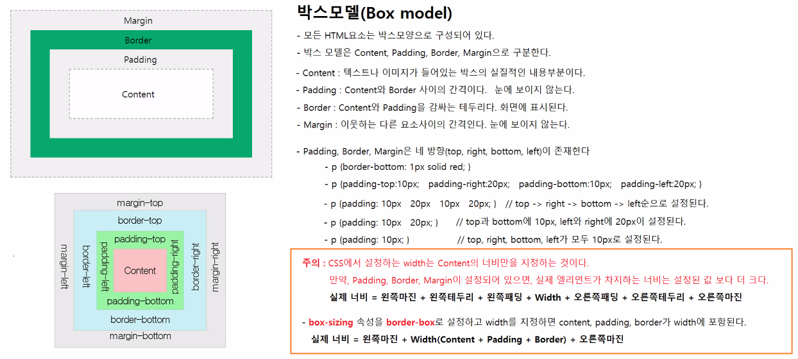

# 0513

- [0513](#0513)
- [HTML](#html)
  - [엘리먼트의 주요 속성](#엘리먼트의-주요-속성)
  - [인라인 블록](#인라인-블록)
  - [아이디/비밀번호 입력폼](#아이디비밀번호-입력폼)
- [CSS](#css)

<small><i><a href='http://ecotrust-canada.github.io/markdown-toc/'>Table of contents generated with markdown-toc</a></i></small>


# HTML
## 엘리먼트의 주요 속성
* 모든 엘리먼트의 공통속성
  * id 속성
      - HTML 문서에서 특정 엘리먼트(태그)를 고유하게 식별할 수 있는 값을 가진다.
        ```html
        <div id="news">
           <div id="news-section"></div> 
           <div id="sports-section"></div>
         <div id="ent-section"></div> 
         <div id="movie-section"></div>
        </div>
        ```
      - HTML 문서에서 같은 속성값을 갖는 id는 존재하지 않아야 한다.
      - 사용목적
         - CSS로 특정 엘리먼트에만 스타일을 적용할 수 있다.
         - 자바스크립트로 특정 엘리먼트를 조작할 수 있다.
  * class 속성
      - HTML 문서에서 같은 스타일로 표시할 엘리먼트들은 class속성이 같은 값을 가진다.
        ```html
        <style>
         .movie-poster { 영화포스트 스타일 지정 }
         .movie-highlight { 영화포스트 하이라이트 스타일 지정 }
        </style>
        <div id="boxoffice">
         <div class="movie-poster"><h3>영화제목</h3> <strong>순위</strong>  <p>영화설명</p></div>
         <div class="movie-poster movie-highlight"><h3>영화제목</h3> <strong>순위</strong>  <p>영화설명</p></div>
         <div class="movie-poster"><h3>영화제목</h3> <strong>순위</strong>  <p>영화설명</p></div>
         <div class="movie-poster"><h3>영화제목</h3> <strong>순위</strong>  <p>영화설명</p></div>
         <div class="movie-poster"><h3>영화제목</h3> <strong>순위</strong>  <p>영화설명</p></div>
        </div>
        ```
      - HTML 문서에 같은 속성값을 갖는 class는 여러 개 존재할 수 있다.
      - class 속성의 속성값은 값이 여러 개도 가능하다.
      - 사용목적
        - css로 같은 클래스 속성값을 가지는 앨리먼트에 같은 스타일을 적용할 수 있다.
        - css로 여러 개의 클래스속성값을 조합해서 다양한 스타일을 앨리먼트에 적용할 수 있다.
        - 자바스크립트로 같은 클래스속성값을 가지는 앨리먼트들을 한 번에 조작할 수 있다.
  * style 속성
    * html 앨리먼트에 스타일을 설정한다.
      ```html
      <p> style="프로퍼티명: 프로퍼티값; 프로퍼티명: 프로퍼티값; 프로퍼티명: 프로퍼티값;"> 컨텐츠</p>
      <p> style="color: white; background-color: black; font-weight: bold;"> 컨텐츠</p>
      ```
    * html 앨리먼트에서 직접 스타일을 설정하는 것은 비추천이다.
      * 유지보수가 어려워진다.
      * html태그가 복잡해지고, html문서의 크기도 늘어난다.

## 인라인 블록
```html
<!DOCTYPE html>
<html lang="ko">

<head>
    <meta charset="UTF-8">
    <meta http-equiv="X-UA-Compatible" content="IE=edge">
    <meta name="viewport" content="width=device-width, initial-scale=1.0">
    <title>Document</title>
    <style>
        .news-section {
            margin: 16px 10px;
            padding: 8px 10px;
            border: 1px solid #ddd;
            background-color: #eee;
            border-radius: 5px;
        }

        .news-on {
            display: block;
        }

        .news-off {
            display: none;
        }

        .btn-box {
            margin: 16px 10px;
            text-align: right;
        }
    </style>
    <script>
        function showNews() {
            clearNewSection()

            let section = document.querySelector("#news");
            section.classList.remove("news-off");
            section.classList.add("news-on");
        }

        function showEnt() {
            clearNewSection()

            let section = document.querySelector("#ent");
            section.classList.remove("news-off");
            section.classList.add("news-on");
        }

        function showSports() {
            clearNewSection()

            let section = document.querySelector("#sports");
            section.classList.remove("news-off");
            section.classList.add("news-on");
        }

        function clearNewSection() {
            let sectionList = document.querySelectorAll(".news-section");
            for (let i = 0; i < sectionList.length; i++) {
                let section = sectionList[i];
                section.classList.remove("news-on");
                section.classList.add("news-off");
            }
        }
    </script>
</head>

<body>
    <h1>다음 뉴스</h1>
    <div class="btn-box">
        <button onclick="showNews();">뉴스</button>
        <button onclick="showEnt();">연예</button>
        <button onclick="showSports();">스포츠</button>
    </div>
    <div>
        <div id="news" class="news-section news-on">
            <h3>뉴스</h3>
            <ul>
                <li>"현대차, 9조 규모 美 전기차 공장 건립..바이든 방한 때 발표"</li>
                <li>"현대차, 9조 규모 美 전기차 공장 건립..바이든 방한 때 발표"</li>
                <li>"현대차, 9조 규모 美 전기차 공장 건립..바이든 방한 때 발표"</li>
                <li>"현대차, 9조 규모 美 전기차 공장 건립..바이든 방한 때 발표"</li>
                <li>"현대차, 9조 규모 美 전기차 공장 건립..바이든 방한 때 발표"</li>
            </ul>
        </div>
        <div id="ent" class="news-section news-off">
            <h3>연예</h3>
            <ul>
                <li>박명수 "손담비♥이규혁, 둘다 아는데 청첩장 없어 결혼식 못 가"(라디오쇼)</li>
                <li>박명수 "손담비♥이규혁, 둘다 아는데 청첩장 없어 결혼식 못 가"(라디오쇼)</li>
                <li>박명수 "손담비♥이규혁, 둘다 아는데 청첩장 없어 결혼식 못 가"(라디오쇼)</li>
                <li>박명수 "손담비♥이규혁, 둘다 아는데 청첩장 없어 결혼식 못 가"(라디오쇼)</li>
                <li>박명수 "손담비♥이규혁, 둘다 아는데 청첩장 없어 결혼식 못 가"(라디오쇼)</li>
                <li>박명수 "손담비♥이규혁, 둘다 아는데 청첩장 없어 결혼식 못 가"(라디오쇼)</li>
                <li>박명수 "손담비♥이규혁, 둘다 아는데 청첩장 없어 결혼식 못 가"(라디오쇼)</li>
            </ul>
        </div>
        <div id="sports" class="news-section news-off">
            <h3>스포츠</h3>
            <ul>
                <li>손흥민에 비매너 반칙한 홀딩..英 매체 "레슬링 같아"</li>
                <li>손흥민에 비매너 반칙한 홀딩..英 매체 "레슬링 같아"</li>
                <li>손흥민에 비매너 반칙한 홀딩..英 매체 "레슬링 같아"</li>
                <li>손흥민에 비매너 반칙한 홀딩..英 매체 "레슬링 같아"</li>
                <li>손흥민에 비매너 반칙한 홀딩..英 매체 "레슬링 같아"</li>
                <li>손흥민에 비매너 반칙한 홀딩..英 매체 "레슬링 같아"</li>
            </ul>
        </div>
    </div>
</body>

</html>
```

## 아이디/비밀번호 입력폼
```html
<!DOCTYPE html>
<html lang="ko">

<head>
    <title>Bootstrap Example</title>
    <meta charset="utf-8">
    <meta name="viewport" content="width=device-width, initial-scale=1">
    <link href="https://cdn.jsdelivr.net/npm/bootstrap@5.1.3/dist/css/bootstrap.min.css" rel="stylesheet">
    <script src="https://cdn.jsdelivr.net/npm/bootstrap@5.1.3/dist/js/bootstrap.bundle.min.js"></script>
    <script>
        // 아이디 입력필드의 비밀번호 입력필드에 값이 입력되어 있는지 체크하고, 입력되어 있지 않으면 경고창을 표시한다.
        function checkForm() {
            // document는 브라우저 내장객체인 Document객체를 저장하고 있는 변수다.
            // Document객체는 HTML문서를 표현하는 객체다.
            // Document객체의 querySelector("선택자표현식")메소드는 선택자표현식에 해당하는 앨리먼트객체(태그를 표현하는 객체)를 반환한다.
            // document.querySelector("#uesr-id")는 HTML문서를 표현하는 객체에서 id="user-id"로 설정된 앨리먼트객체를 찾아서 반환한다.
            // 앨리먼트 객체가 입력폼요소를 표현하는 객체인 경우 value는 입력폼요소의 값을 가지고 있는 프로퍼티(멤버변수)다.
            // value프로퍼티를 이용해서 입력폼요소의 값을 조회하거나 변경할 수 있따.
            // 조회하기 : let 변수 = 앨리먼트.value;
            // 변경하기 : 앨리먼트.value = rkqt;
            let userIdValue = document.querySelector("#user-id").value;
            if (userIdValue === '') {
                alert("아이디는 필수입력값입니다.");
                return; // 빠른종료
            }

            let idRegExp = /^[A-Za-z0-9]{8,}$/;
            if (!idRegExp.test(userIdValue)) {
                alert("유효한 아이디가 아닙니다. 영어 대소문자, 숫자로 8글자 이상만 가능합니다.")
                return;
            }

            let userPasswordValue = document.querySelector("#user-pwd").value;
            if (userPasswordValue === '') {
                alert("비밀번호는 필수입력값입니다.")
                return;
            }

            let pwdRegExp = /^(?=.*[a-zA-Z])((?=.*\d)(?=.*\W)).{6,20}$/
            if (!pwdRegExp.test(userPasswordValue)) {
                alert("유효한 비밀번호가 아닙니다. 영어 대소문자, 한 개 이상의 특수문자를 포함하는 6글자 이상 20글자 이하만 가능합니다.")
                return;
            }

            // form태그를 표현하는 앨리먼트객체는 submit()메소드를 포함하고 있다.
            // submit()를 실행하면 form태그가 포함하고 있는 모든 폼 입력값이 서버로 제출된다.
            document.querySelector("#form-login").submit();
        }
    </script>
</head>

<body>
    <div class="container">
        <h1>로그인</h1>
        <form i="form-login" action="login.jsp" class="border bg-light p-3">
            <div class="mb-3 mt-3">
                <label for="user-id" class="form-label">아이디</label>
                <input type="text" class="form-control" id="user-id" placeholder="아이디를 입력하세요" name="userId">
            </div>
            <div class="mb-3">
                <label for="user-pwd" class="form-label">비밀번호</label>
                <input type="password" class="form-control" id="user-pwd" placeholder="비밀번호를 입력하세요" name="userPwd">
            </div>
            <div class="text-end">
                <button type="button" class="btn btn-secondary">회원가입</button>
                <button type="button" class="btn btn-primary" onclick="checkForm();">로그인</button>
            </div>
        </form>
    </div>
</body>

</html>
```

# CSS
* cascading style sheets
* Cascading : 위에서 아래로 쏟아지는 모습

1. 스타일 적용하기
```html
<!DOCTYPE html>
<html lang="ko">
<head>
    <meta charset="UTF-8">
    <meta http-equiv="X-UA-Compatible" content="IE=edge">
    <meta name="viewport" content="width=device-width, initial-scale=1.0">
    <title>Document</title>
    <style>
        p {
            color: red;
            font-size: 24px;
        }
    </style>
</head>
<body>
    <h1>CSS 스타일 적용하기</h1>

    <!--
        1. !important가 지정된 스타일
        2. 인라인 css
        3. Internal/External CSS
        4. 브라우저 기존 스타일
    -->

    <h3>인라인 CSS</h3>
    <p style="color: blue; border: 1px solid #ddd; padding: 8px">인라인 스타일 CSS는 태그에 직접 스타일을 정의하는 것이다.</p>

    <h3>Internal CSS</h3>
    <p>Internal 스타일 CSS는 style태그를 사용해서 정의하는 것이다.</p>

    <h3>External CSS</h3>
    <p>External 스타일 CSS는 외부 css파일 사용해서 스타일을 정의하는 것이다.</p>
</body>
</html>
```

2. 색 표시하기
```html
<!DOCTYPE html>
<html lang="ko">
<head>
    <meta charset="UTF-8">
    <meta http-equiv="X-UA-Compatible" content="IE=edge">
    <meta name="viewport" content="width=device-width, initial-scale=1.0">
    <title>Document</title>
    <style>
    </style>
</head>
<body>
    <h1>색 표시하기</h1>

    <!--
        색 표시하기
        1. 색이름으로 표시하기
            p {color: orange;}
            p {color: black;}
            p {color: red;}

        2. RGB 색상값으로 표시하기
            - 빛의 3원색에 해당하는 빨강색, 초록색, 파랑색의 색상값을 조절해서 색을 표현한다.
            - 각 색상값은 0 ~ 255 까지의 범위를 가진다.
                p {color: rgb(0, 0, 0); }           // 검정색
                p {color: rgb(255, 255,255); }      // 흰색
                p {color: rgb(255, 0, 0) }          // 빨강색
            - rgb값이 모두 같으면 무채색이 표시된다.

        3. 16진수 색상값으로 표시하기
            - 빛의 3원색에 해당하는 빨강색, 초록색, 파랑색의 색상값을 각각 16진수값으로 조절해서 색을 표현한다.
            - 각 색상값은 00 ~ ff까지의 범위를 가진다.
                p {color: #000000;}                 // rgb(0, 0, 0)
                p {color: #ffffff;}                 // rgb(255, 255, 255)
                p {color: #ff0000;}                 // rgb(255, 0, 0)
            - 각 색상값이 같은 숫자일 때는 한번만 적어도 된다.
                p {color: #000000;}                 // rgb(0, 0, 0)
                p {color: #ffffff;}                 // rgb(255, 255, 255)
                p {color: #ff0000;}                 // rgb(255, 0, 0)
                p {color: #ff0044;}                 // rgb(255, 0, 0)
    -->
    <h1>색 표시하기</h1>

    <h3>RGB 색상값으로 표시하기</h3>
    <p style="color: rgb(0, 0, 0);">내용</p>
    <p style="color: rgb(255, 255, 255);">내용</p>
    <p style="color: rgb(255, 0, 0);">내용</p>
    <p style="color: rgb(0, 255, 0);">내용</p>
    <p style="color: rgb(0, 0, 255);">내용</p>
    <p style="color: rgb(255, 255, 0);">내용</p>
    <p style="color: rgb(0, 255, 255);">내용</p>
    <p style="color: rgb(255, 0, 255);">내용</p>
    <p style="color: rgb(200, 200, 200);">내용</p>

    <h3>16진수 색상값으로 표시하기.</h3>
        <p style="color: #000000;">내용</p>
        <p style="color: #ffffff;">내용</p>
        <p style="color: #492424;">내용</p>
        <p style="color: #d11919;">내용</p>
        <p style="color: #3704ee;">내용</p>
        <p style="color: #000000;">내용</p>
        <p style="color: #ff00b3;">내용</p>
        <p style="color: #1eff00;">내용</p>

</body>
</html>
```

3. 텍스트 스타일 적용하기
```html
<!DOCTYPE html>
<html lang="ko">
<head>
    <meta charset="UTF-8">
    <meta http-equiv="X-UA-Compatible" content="IE=edge">
    <meta name="viewport" content="width=device-width, initial-scale=1.0">
    <title>Document</title>
    <style>
    </style>
</head>
<body>
    <h1>CSS 텍스트 스타일 적용하기</h1>

    <!--
        텍스트 스타일 관련 속성
            color
                텍스트의 색상을 설정한다.
                p {color: red;}    
                p {color: #ff0000;}
                p {color: #f00}

            text-align
                텍스트의 수평방향 정렬을 설정한다.
                p {text-align: left; }                   // 왼쪽 정렬
                p {text-align: center; }                 // 가운데 정렬
                p {text-align: right; }                  // 오른쪽 정렬
            text-decoration
                텍스트와 관련된 여러 효과를 설정한다.
                p {text-decoration: overline; }          // 텍스트 위에 선을 표시한다.
                p {text-decoration: line-through; }      // 텍스트를 가로지르는 선을 표시한다.
                p {text-decoration: underline; }         // 텍스트 아래에 선을 표시한다.
                p {text-decoration: none; }              // 텍스트에 선을 표시하지 않는다.
    -->

    <h1>텍스트 스타일</h1>
    <h2>텍스트 스타일</h2>

    <p style="text-align: left;">내용</p>
    <p style="text-align: center;">내용</p>
    <p style="text-align: right;">내용</p>
    
    <p style="text-align: left;"><button>내용</button></p>
    <p style="text-align: center;"><button>내용</button></p>
    <p style="text-align: right;"><button>내용</button></p>

    <p style="text-align: left;"> 
    <p style="text-align: center;">
    <p style="text-align: right;"> 

    <p style="text-decoration: overline;">내용</p>
    <p style="text-decoration: line-through;">내용</p>
    <p style="text-decoration: underline;">내용</p>
    <p style="text-decoration: none;">내용</p> 

</body>
</html>
```

4. 박스 모델
  * 박스모델 
```html
<!DOCTYPE html>
<html lang="ko">
<head>
    <meta charset="UTF-8">
    <meta http-equiv="X-UA-Compatible" content="IE=edge">
    <meta name="viewport" content="width=device-width, initial-scale=1.0">
    <title>Document</title>
    <style>
        * {box-sizing: border-box;}
        #box {margin-left: -150px; width: 200px;}
        #box:hover {margin: -1px;}
        div {border: 1px dotted gray; padding: 10px 20px 40px 80px; margin-bottom: 20px;}
    </style>
</head>
<body>
    <h1>박스모델</h1>
    <div id="box">
        <div>1</div>
        <div>2</div>
        <div>3</div>
    </div>
    
</body>
</html>
```


5. 위치지정방식(position)
```html
<!DOCTYPE html>
<html lang="ko">
<head>
    <meta charset="UTF-8">
    <meta http-equiv="X-UA-Compatible" content="IE=edge">
    <meta name="viewport" content="width=device-width, initial-scale=1.0">
    <title>Document</title>
    <style>
        div { border: 2px dotted black; padding: 10px; margin: 10px; }
    </style>
</head>
<body>

<!-- 
    위치지정 방식
    - 정적 위치지정(static position)
        - HTML 요소의 기본 위치지정 방식
        - 위에서 아래로, 왼쪽에서 오른쪽으로 HTML 요소가 위치한다.
        - left, right, top, bottom의 영향을 받지 않는다.
        div {
            position: static;
            left: 10px; // 효과가 없다.
        }

    - 절대 위치지정(absolute position)
        - 위치가 지정된 부모 요소를 기준으로 위치를 설정할 수 있다.
        - 위치가 지정된 부모 요소가 없으면 body를 기준으로 설정된다.
        - 해당 앨리먼트의 위치는 left, right, top, bottom 속성으로 설정한다.
        div {
            position : absolute;
            left : 20px;
            top : 100px;
        }
    
    - 상대 위치지정(relative position)
        - 해당 앨리먼트가 정적위치로 지정되었을 때의 위치를 기준으로 결졍된 위치만큼 이동된 곳에 위치한다.
        - 해당 앨리먼트의 위치는 left와 top속성으로 설정한다.

    - 고정 위치지정(fixed position)
        - 고정 위치지정으로 설정된 앨리먼트는 페이지가 스크롤 되어도 해당 위치에 고정된다.
-->
    <h1>HTML 요소의 위치를 지정하기</h1>

    <div style="position: absolute; left: 50px; top: 100px; width: 400px; height: 100px;">
        <div style="position: absolute; left: 50px; top:50px; width:100px; height:20px;"></div>
        <div style="position: absolute; right: 0px; top:50px; width:100px; height:20px;"></div>
    </div>

    <div style="position: absolute; left: 50px; top: 250px; width: 400px; height: 200px;">
        <div style="position: static; width:100px; height:20px;"></div>
        <div style="position: relative; left:50px; width:100px; height:20px;"></div>
        <div style="position: relative; left:150px; width:100px; height:20px;"></div>
        <div style="position: relative; left:200px; width:100px; height:20px;"></div>
    </div>

</body>
</html>
```