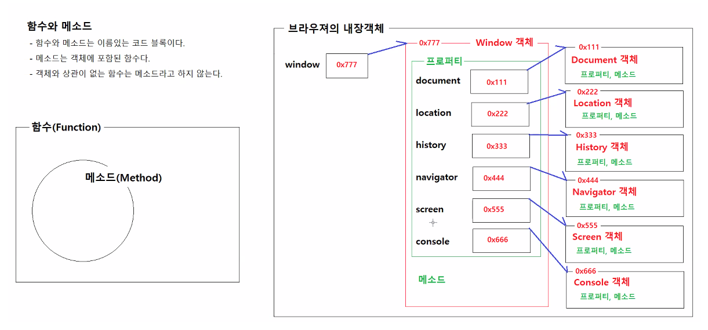

# 0517

- [0517](#0517)
- [CSS](#css)
  - [selector](#selector)
    - [상태 의사 클래스 선택자](#상태-의사-클래스-선택자)
    - [기타 선택자](#기타-선택자)
    - [선택자 작성팁](#선택자-작성팁)
    - [실습](#실습)
- [JavaScript](#javascript)
  - [목표](#목표)
  - [할 수 있는 일](#할-수-있는-일)
  - [특징](#특징)
  - [함수와 메소드](#함수와-메소드)
  - [자바의 자바스크립트의 일급시민](#자바의-자바스크립트의-일급시민)
  - [자바스크립트의 참과 거짓](#자바스크립트의-참과-거짓)
  - [비교 연산자 == 과 ===](#비교-연산자--과-)
  - [실습](#실습-1)

<small><i><a href='http://ecotrust-canada.github.io/markdown-toc/'>Table of contents generated with markdown-toc</a></i></small>

# CSS
## selector

### 상태 의사 클래스 선택자
* `:checked`
  * 체크박스, 라디오버튼 중에서 체크된 엘리먼트를 선택한다.

* `input:checked + label { font-weight: bold; color: red; }`
  * 체크박스나 라디오버튼중에서 체크된 엘리먼트를 찾는다.
    * 예) `<input type="radio" name="gender" value="F" checked="checked" /* ><label>Female: </label>  이 라벨이 선택된다.`
        * `<input type="radio" name="gender" value="M" /><label>Male: </label>`
        * `<input type="radio" name="gender" value="O" disabled="disabled" /* ><label>Other: </label>`
            		  

* `:disabled`
  * 폼입력요소(input, select, textarea, button) 중에서 비활성화된 엘리먼트를 선택한다.
		
* `input:disabled + label { text-decoration: line-through; }`
  * 입력필드중에서 비활성화된 엘리먼트를 선택한다.
  * 예)
    * `<input type="radio" name="gender" value="F" checked="checked" /><label>Female: </label>`
    * `<input type="radio" name="gender" value="M" /><label>Male: </label>`
    * `<input type="radio" name="gender" value="O" disabled="disabled" /* ><label>Other: </label>` 이 라벨이 선택된다.

### 기타 선택자
* `선택자1:not(선택자2)`
  * 선택자1에 해당하는 엘리먼트중에서 선택자2에 해당하지 않는 엘리먼트를 선택한다.
* `#list-friends li:first-child { font-weight: bold; color: red; }`
  * 아이디속성값이 list-friends인 엘리먼트의 자손 엘리먼트 중에서 li 엘리먼트면서 첫번째 자식 엘리먼트를 선택한다.
    * 예)
      ```html
      <ul id="list-friends">
        <li>이 엘리먼트가 선택된다.</li>
        <li>이 엘리먼트는 선택되지 않는다.</li>
        <li>이 엘리먼트는 선택되지 않는다.</li>
        <li>이 엘리먼트는 선택되지 않는다.</li>
      </ul>
      ```
* `#list-friends li:not(:first-child) { text-decoration: line-through; }`
  * 아이디속성값이 list-friends인 엘리먼트의 자손 엘리먼트 중에서 li 엘리먼트면서 첫번째 자식이 아닌 엘리먼트를 선택한다.
    * 예)
      ```html
      <ul id="list-friends">
        <li>이 엘리먼트는 선택되지 않는다.</li>
        <li>이 엘리먼트가 선택된다.</li>
        <li>이 엘리먼트가 선택된다.</li>
        <li>이 엘리먼트가 선택된다.</li>
      </ul>
      ```	

### 선택자 작성팁
- 특정 엘리먼트 하나를 선택해야할 때 		
  - `document.querySelector("CSS선택자")` : Element객체가 반환된다. 
  * `#`아이디 선택자를 사용하자.
	* `#아이디 { 스타일 }`
  * `:first-child, :last-child, :nth-child(n)` 선택자를 사용하자.
	* `#list-friends li:first-child { 스타일 }`
	* `#list-friends li:last-child { 스타일 }`
	* `#list-friends li:nth-child(2) { 스타일 }`
  * 속성선택자를 사용하자.(폼입력요소의 입력필드가 선택대상일 때)
	* `#register-form input[name='username'] { 스타일 }`
	* `#register-form input[name='phone'] { 스타일 }`

- 엘리먼트를 여러 개 선택해야할 때				
  - `document.querySelectorAll('CSS선택자')` : * Element객체가 여러개 저장된 배열유사객체가 반환된다.
  * 태그 선택자를 사용하자. (태그명이 같은 엘리먼트들이 선택대상일 때)
	* `.box p {스타일}`
	* `#image-slider img {스타일}`
  * `.`클래스 선택자를 사용하자. (같은 스타일일 적용된 엘리먼트들이 선택대상일 때)
	* `.box .boxitem {스타일}`
	*` #image-slider .slider-item {스타일}`
  * 속성선택자를 사용하자. (주로 폼입력요소중에 이름이 같은 엘리먼트들이 선택대상일 때)
	* `#register-form input[name=skill] {스타일}`
  * 의사클래스 선택자를 사용하자. (같은 상태를 가지는 엘리먼트들이 선택대상일 때)
	* `#register-form input:checked {스타일}`
	
### 실습
* css12-selector.html
```html
<!DOCTYPE html>
<html lang="ko">

<head>
    <meta charset="UTF-8">
    <meta http-equiv="X-UA-Compatible" content="IE=edge">
    <meta name="viewport" content="width=device-width, initial-scale=1.0">
    <title>Document</title>
    <style>
        table {
            width: 50%;
        }

        th,
        td {
            text-align: left;
            padding: 5px 10px;
            border: 1px solid white;
            background-color: #ddd;
        }

        form {
            margin-top: 10px;
            border: 1px solid blue;
            padding: 15px 10px;
            background-color: #87cefa;
        }

        label {
            display: inline-block;
            width: 150px;
        }

        /* 체크박스와 라디오 버튼중에서 체크상태인 앨리먼트와 인접해 있는 label 앨리먼트를 선택한다. */
        input:disabled+label {
            text-decoration: line-through;
        }

        /* 아이디 속성값이 list-friends인 앨리먼트의 자손 앨리먼트 중에서 li 앨리먼트면서 첫번째 자식 앨리먼트를 선택한다. */
        #list-friends li:first-child {
            font-weight: bold;
            color: red;
        }

        /* 아이디 속성값이 list-friends인 앨리먼트의 자손 앨리먼트 중에서 li 앨리먼트면서 첫번째 자식 앨리먼트를 선택한다. */
        #list-friends li:not(:first-child) {
            text-decoration: line-through;
        }
    </style>
</head>

<body>
    <h1>Welcome to My Homepage</h1>
    <div class="intro">
        <p>My name is Donald <span id="last-name">Duck.</span></p>
        <p id="my-address">I live in Duckburg</p>
        <p>I have many friends:</p>
    </div>
    <ul id="list-friends">
        <li>Goofy</li>
        <li>Mickey</li>
        <li>Daisy</li>
        <li>Pluto</li>
    </ul>

    <p class="my-quote">All my friends are great! But I really like Daisy!!</p>
    <p lang="it" title="hello beautiful">Ciao bella</p>

    <h3>We are all animals!</h3>
    <p><strong>My latest discoverise have led me to believe that we are all animals:</strong></p>
    <table>
        <tr>
            <th>Name</th>
            <th>Type of Animal</th>
        </tr>
        <tr>
            <td>Mickey</td>
            <td>Mouse</td>
        </tr>
        <tr>
            <td>Goofey</td>
            <td>Dog</td>
        </tr>
        <tr>
            <td>Daisy</td>
            <td>Duck</td>
        </tr>
        <tr>
            <td>Pluto</td>
            <td>Dog</td>
        </tr>
    </table>

    <form action="">
        <h3>Subscribe to my newsletter:</h3>
        <div>
            <label>Name: </label>
            <input type="text" name="myName" />
        </div>
        <div>
            <label>E-mail: </label>
            <input type="text" name="myEmail" />
        </div>
        <div>
            <input type="radio" name="gender" value="F" checked="checked" /> <label>Female: </label>
            <input type="radio" name="gender" value="M" /> <label>Male: </label>
            <input type="radio" name="gender" value="O" disabled="disabled" /> <label>Other: </label>
        </div>
        <h3>News Categories:</h3>
        <div>
            <input type="checkbox" name="category" value="duck" checked="checked" /><label>Ducks: </label>
            <input type="checkbox" name="category" value="dog" /><label>Dogs: </label>
            <input type="checkbox" name="category" value="human" /><label>Humans: </label>
        </div>
        </div>
</body>

</html>
```
	
# JavaScript
* 브라우저 내에서 실행되는 프로그램을 개발할 수 있는 프로그래밍 언어다.
* java와 문법적 유사성이 많아서 쉽게 배울 수 있다.
* 인터프리터 프로그래밍 언어다.(자바는 컴파일 언어다. 실행속도는 컴파일 언어가 더 빠르다.)
  * 자바스크립트, 파이썬와 같은 언어는 컴파일 과정이 없다.
## 목표
1. 프로그램
2. 변수
3. 연산자
4. 조건문, 반복문
5. 배열
6. 객체
7. 함수
8. 이벤트 처리
9. HTML DOM
10. AJAX

## 할 수 있는 일
1. HTML 컨텐츠 변경
   * 브라우저
2. HTML 태그 속성 변경
3. HTML 컨텐츠의 스타일 변경
   * css
4. 사용자와 상호작용하는 프로그램 작성
   * 이벤트모델
5. 브라우저의 도움없이 서버와 데이터통신 가능
   * AJAX

## 특징
* 스크립트 언어
* 객체지향 프로그래밍 언어
* 동적 데이터타입 지원(데이터타입이 없다.)
* 자비스크립트의 함수(메소드)는 1급시민이다.

## 함수와 메소드

* 브라우저의 내장객체를 사용하기 위한 명령어를 적으면 해당 객체를 가리키는 참조변수를 통해 해당 명령어를 사용할수 있게 된다.
* window객체는 특별한 지위를 가지고 있는 객체로 window.이라고 명령어를 적지 않아도 된다.
* 

## 자바의 자바스크립트의 일급시민

구분			| 자바				| 자바스크립트	
----------------|----------------|----------------
변수에 저장 가능| 기본자료형값, 배열, 객체| 기본자료형값, 배열, 객체, 함수
매개변수의 인자로 전달 가능	| 기본자료형값, 배열, 객체		| 기본자료형값, 배열, 객체, 함수
반환값으로 반환 가능 	| 기본자료형값, 배열, 객체		| 기본자료형값, 배열, 객체, 함수


* 함수를 변수에 저장할 수 있다.
```js
let x = function() {
	console.log("테스트");
};
```
* 함수를 매개변수의 인자로 전달받을 수 있다.
```js
function y(fn) {
	fn();
}
```
* 함수를 반환값으로 반환할 수 있다.
```js
function z() {
	return x;
}

x();
y(x);

let a = z();
a();
```


## 자바스크립트의 참과 거짓

구분|내용 
----|----
참	| true, Infinity, 아래에 나열된 값을 제외한 모든 것(10, -1, ' ', '안녕')
거짓| false, 0, -0, '', null, undefined, NaN

* NaN은 Not a Number의 약어다.
  * `var x = 100/'안녕';`
  * x의 값은 NaN이다.
* Infinity는 무한대 값이다.
  * `var x = 100/0;`
  * x의 값은 Infinity다.
* a의 값은 undefined다.
  * `var a;`	

* if문의 ()안에는 참/거짓으로 판정되는 값 혹은 표현식이 위치해야 한다. 
* a는 참/거짓으로 판정해야 되는 상황에 놓여 있으며, a는 거짓으로 판정되는 값 중에 하나를 가지고 있으므로 조건식의 최종결과는 거짓이다.
  * ```js
    if (a) {	
            
    }
    ```
* 현재 입력필드에 입력된 값이 없다.
    ```js
    ID       : <input type="text" id="user-id" name="userId" /> 
    Password : <input type="password" id="user-pwd" name="userPassword" /> 
    ID       : [eungsu          ]
    Password : [                ]	 
    ```
* 입력필드와 비밀번호 입력필드에 입력된 값을 읽어온다.
    ```js
    var id = document.querySelector('#user-id').value;		// id  <--- ''
    var pwd = document.querySelector('#user-pwd').value;		// pwd <--- ''
    ```
* 변수 id에 '' 빈문자열이 있는 경우, 빈문자열은 참/거짓으로 판정해야 되는 상황에 놓여 있으면 false로 판정된다.
    ```js
    if (!id) {
        경고창 표시
    }
    ```
* 변수 pwd에 '' 빈문자열이 있는 경우, 빈문자열은 참/거짓으로 판정해야 되는 상황에 놓여 있으면 false로 판정된다.
    ```js
    if (!pwd) {
        경고창 표시
    }


    if (id === '') {
        경고창 표시
    }
    if (pwd === '') {
        경고창 표시
    }
    ```

## 비교 연산자 == 과 ===

`let x = 5;`

연산자|			연산식|			연산결과|		설명
------|--------------|----------------|-------------
==	|		x == 8	|		false
&nbsp;|	x == 5	|		true|
&nbsp;|	x == '5'|		true|		타입이 다르더라고 변환한 후에 같은 값이면 true다.
===		|	x === 5		|	true	|	타입도 같고 값도 같으면 true다.			
&nbsp;|	x === '5'	|	false|
!=		|	x != 8		|	true|
!==		|	x !== 5		|	false|		타입도 같고 값도 같으면 false다.
&nbsp;|	x !== '5'	|	true|		타입이 다르거나 값이 다르면 true다.
&nbsp;|	x !== 8	|		true|		타입이 다르거나 값이 다르면 true다.
&nbsp;|	x !== '8'|		true|		타입이 다르거나 값이 다르면 true다.


* 논리연산자의 연산결과를 이용한 기본값 대입시키기
    ```js
    function bonus(salary, commission) {
        // commission의 변수값이 undefined이면 || 연산자의 좌항이 false로 판정된다. 
        // 좌항이 false로 판정되면 연산식의 연산결과는 우항의 값이 곧 연산 결과다.
        // 따라서 commission 매개변수로 값을 전달받지 못했을 좌항이 false로 판정되고, 우항의 값에 따라서 참/거짓이 결정됨으로 commission에 우항의 값 0.03이 대입된다.
        // 함수에서 매개변수의 기본값을 지정하는 용도로 아래의 식을 사용했다.
        // 변수명 = 변수명 || 기본값;	

        commission = commission || 0.03;
        let bonus = salary*commission;
        return bonus;
    }

    let x = bonus(3000000, 0.1);	// 300000
    let y = bonus(3000000, 0.05);	// 150000
    let z = bonus(3000000);
    ````

## 실습

```html
<!DOCTYPE html>
<html lang="ko">
<head>
    <meta charset="UTF-8">
    <meta http-equiv="X-UA-Compatible" content="IE=edge">
    <meta name="viewport" content="width=device-width, initial-scale=1.0">
    <title>Document</title>
    <!-- 
        <script>
            자바스크립트 코드
        </script>
        위와 같이 <script>와 </script>사이에 포함된 컨텐츠는 웹 브라우저 화면에 표시되지 않는다.
        웹 브라우저는 <script>와 </script>사이에 작성된 내용을 자바스크립트 코드로 인식하고, 실행시킨다.
     -->
     <script type="text/javascript">
        // console은 웹 브라우저 내장객체를 저장하고 있는 참조변수다.
        // console에는 Console객체가 연결되어 있다.
        // Console객체는 메세지를 화면에 출력하는 다양한 메소드를 제공한다.
        // Console객체의 주요 메소드
        //      .log(메세지, 메세지, ...)       - 프로그램 실행 로그 메세지를 브라우저 콘솔화면에 출력한다.
        //      .debug(메세지, 메세지, ...)     - 프로그램 실행 디버그 메세지(프로그램 실행과 관련된 모든 정보)를 브라우저 콘솔화면에 출력한다.
        //      .info(메세지, 메세지, ...)      - 프로그램 실행 정보 메세지(프로그램실행과 관련된 정보)를 브라우저 콘솔화면에 출력한다.
        //      .warning(메세지, 메세지, ...)   - 프로그램 실행 경고 메세지를 브라우저 콘솔 화면에 출력한다.
        //      .error(메세지, 메세지, ...)     - 프로그램 실행 오류 메세지를 브라우저 콘솔 화면에 출력한다.
        console.log("자바스크립트 코드 실행하기.")
        </script>
</head>
<body>
    
</body>
</html>
```

```html
<!DOCTYPE html>
<html lang="ko">

<head>
    <meta charset="UTF-8">
    <meta http-equiv="X-UA-Compatible" content="IE=edge">
    <meta name="viewport" content="width=device-width, initial-scale=1.0">
    <title>Document</title>
</head>

<body>

    <script>
        // 자바스크립트의 데이터 타입
        //      undefined 타입
        //          undefined 타입의 변수는 undefined 값만 가진다.
        //          * undefined는 초기화되지 않은 변수가 가지는 값이고, 그 변수의 타입도 undefined 타입니다.
        //      number 타입
        //          number 타입의 변수는 정수, 실수값을 저장한다.
        //          * 자바스크립트는 모든 숫자를 자바의 double형처럼 저장한다.
        //      string 타입
        //          string 타입의 변수는 텍스트를 저장한다.
        //          * 자바스크립트는 문자와 문자열을 따로 구분하지 않는다.
        //          * 자바스크립트는 텍스트를 표현할 때 ''나 "" 모두 사용가능하다.
        //      boolean 타입
        //          boolean 타입의 변수는 true 혹은 false값을 저장한다.
        //          * 자바스크립트에서 false로 판정되는 것 : false, 0, -0, '', null, undefined, NaN
        //          * 자바스크립트에서 true로 판정되는 것 : 위에서 나열한 것 빼고 전부다 

        // 변수 선언과 초기화

        // 변수의 선언
        // 변수을 생성하고 초기화하지 않으면 변수의 타입은 undefined타입이고, 변수에는 undefined값이 대입되어 있다.

        var a;
        var b, c, d;

        console.log('a:', a, "b:", b, 'c:', c, 'd:', d);

        // 변수의 선언 및 초기화
        var x = 10;
        var y = 3.14,
            z = '홍길동',
            zz = true;
        console.log('x: ', x, typeof (x));
        console.log('y: ', y, typeof (y));
        console.log('z: ', z, typeof (z));
        console.log('zz: ', zz, typeof (zz));

        // 변수의 동적 데이터타입
        // 자바스크립트의 변수는 변수에 저장되는 값에 따라서 데이터타입이 동적으로 변한다.
        var k;
        console.log('값:', k, '데이터타입:', typeof (k));
        k = 10;
        console.log('값:', k, '데이터타입:', typeof (k));
        k = 3.14;
        console.log('값:', k, '데이터타입:', typeof (k));
        k = 'A';
        console.log('값:', k, '데이터타입:', typeof (k));
        k = "안녕하세요";
        console.log('값:', k, '데이터타입:', typeof (k));
        k = true;
        console.log('값:', k, '데이터타입:', typeof (k));
        k = null;
        console.log('값:', k, '데이터타입:', typeof (k));
    </script>
</body>

</html>
```

```html
<!DOCTYPE html>
<html lang="ko">

<head>
    <meta charset="UTF-8">
    <meta http-equiv="X-UA-Compatible" content="IE=edge">
    <meta name="viewport" content="width=device-width, initial-scale=1.0">
    <title>Document</title>
</head>

<body>
    <script>
        /*
            자바스크립트에서 변수 선언하기
            var a = 10;
            let b = 10;
            const c = 10;
            d = 10;

            var로 선언한 변수
                변수이름이 중복되어도 오류가 발생하지 않는다.
                변수선언이 코드의 맨 꼭대기로 호이스팅 된다. 변수의 스코프가 블록이 아니다.

            let으로 선언한 변수
                변수이름이 중복되면 오류가 발생한다.
                변수선언이 호이스팅되지 않는다. 변수의 스코프가 그 변수를 선언한 블록이 된다.

            const로 선언한 변수
                변수에 저장된 값을 다른 값으로 변경할 수 없다.
                상수가 된다.
                * const로 선언하는 변수는 변수명을 전부 대문자로 적는다.
                const PI = 3.141592;


            var, let, const 없이 변수를 선언하는 것은 용서할 수 없다.
        */

        var a = 10;
        console.log("a값: ", a);
        var a = 20;
        console.log("a값: ", a);

        const c = 10;
        console.log("c값: ", c);
        c = 20; // 오류 발생, c에 저장된 값을 변경할 수 없다.
        console.log("c값: ", c);

        //let b = 10;
        //console.log("b값: ", b);
        //let b = 20;
        //console.log("b값: ", b);
    </script>
</body>

</html>
```

```html
<!DOCTYPE html>
<html lang="ko">

<head>
    <meta charset="UTF-8">
    <meta http-equiv="X-UA-Compatible" content="IE=edge">
    <meta name="viewport" content="width=device-width, initial-scale=1.0">
    <title>Document</title>
</head>

<body>
    <script>
        // var로 선언한 변수의 스코프
        // var로 선언한 변수는 변수 호이스팅이 발생한다.
        // * 변수 호이스팅은 변수 선언을 코드의 맨 처음으로 끌어올리는 것이다.


        // 개발자가 작성한 코드
        var a = 10;
        var b = 5;

        if (a > b) {
            var sum = a + b;
            console.log("sum값: ", sum);
        }
        console.log("sum값: ", sum);

        // 브라우저가 실제로 실행하는 코드
        /*
            var a, b, sum;      // 호이스팅된 변수 선언

            a = 10;
            b = 5;

            if (a > b) {
                sum = a + b;
                console.log("sum값: ", sum);
            }
            console.log("sum값: ", sum);
        */


        // let으로 선언한 변수의 스코프
        // let으로 선언한 변수는 변수 호이스팅이 발생하지 않는다.

        // 개발자가 작성한 코드
        let x = 10;
        let y = 5;

        if (x > y) {
            let sum2 = x + y;
            console.log('sum2의 값:', sum2);
        }
        console.log('sum2의 값:', sum2); // sum2 is not defined 오류가 발생한다.

        // 개발자가 작성한 코드
        /*
            let x = 10;
            let y = 5;

            if (x > y) {
                let sum2 = a + b;
                console.log('sum2의 값:', sum2);
            }
            console.log('sum2의 값:', sum2);     
        */
    </script>
</body>

</html>
```

```html
<!DOCTYPE html>
<html lang="ko">

<head>
    <meta charset="UTF-8">
    <meta http-equiv="X-UA-Compatible" content="IE=edge">
    <meta name="viewport" content="width=device-width, initial-scale=1.0">
    <title>Document</title>
</head>

<body>
    <script>
        /*
            자바스크립트의 연산자
                산술연산자

                대입연산자

                증감연산자
                <!DOCTYPE html>
                <html lang="ko">

                <head>
                    <meta charset="UTF-8">
                    <meta http-equiv="X-UA-Compatible" content="IE=edge">
                    <meta name="viewport" content="width=device-width, initial-scale=1.0">
                    <title>Document</title>
                </head>

                <body>
                    <script>
                        /*
            자바스크립트의 연산자
                산술연산자
                    + - * / %

                대입연산자
                    = += -= *= /= %=

                증감연산자
                    ++ --

                비교연산자
                    == === != !== > >= < <=

                논리연산자
                    ! && ||

                삼항연산자
                    조건식 ? 값1 : 값2
        */

                        // 자바스크립트에서는 정수/정수의 연산결과가 실수값이 나올 수 있다.
                        let a = 2;
                        let b = 5;
                        let c = a / b;
                        console.log("c의 값", c); // 0.4가 출력된다.

                        // 자바스크립트에서 + 연산자는 자바와 마찬가지로 + 연산자의 좌항이나 우항에 문자열이 있으면 이어붙이기로 동작한다.
                        let d = 5 + 6 + '안녕하세요' + 3 + 5;
                        console.log('d의 값', d); // "11안녕하세요35"

                        // 비교 연산자 ==과 ===
                        /*
                            == 연산자
                                값1 == 값2
                                    * 값1과 값2가 타입이 같고, 값도 같으면 true다.
                                    * 값1과 값2가 타입이 다르지만, 같은 타입으로 변환한 후 값이 같으면 true다.
                                    * 
                            === 연산자
                                값1 === 값2
                                    * 값1과 값2가 타입이 같고, 값도 같으면 true다.
                            !== 연산자
                                값1 !== 값2
                                    * 값1과 값2가 타입이 다르거나, 값이 다르면 true다.
                        */
                        let e = 5;
                        console.log('e == 8', e == 8); // false
                        console.log('e == 5', e == 5); // true
                        console.log('e == "5"', e == "5"); // true

                        console.log('e === 5', e === 5); // true
                        console.log('e === "5"', e === "5"); // flase

                        console.log('e !== 5', e !== 5); // false
                        console.log('e !== "5"', e !== "5"); // true
                        console.log('e !== 8', e !== 8); // ttue

                        // 논리연산자
                        let f = 10;
                        let g = 5;

                        // 논리연산자의 좌항과 우항이 모두 true/false값일 때, 연산결과는 true 혹은 false다.
                        let h = f > 9 && g > 4;
                        let i = f > 10 && g > 5;
                        console.log('h의 값', h);
                        console.log('i의 값', i);
                    </script>
                </body>

                </html>

                비교연산자

                논리연산자

                삼항연산자
        */

        var e = 5;
        console.log('e == 8', e == 8);      // false
        console.log('e == 5', e == 5);      // true
        console.log('e == "5"', e == "5");  // true
        
        console.log('e == 5', e === 5);     // true
        console.log('e == "5"', e == "5");  // true
        
        console.log('e !== 5', e !== 5);    // false
        console.log('e == "5"', e == "5");  // true
        console.log('e !== 8', e !== 8);    // true

        // 논리연산자
        let f = 10;
        let g = 5;

        // 논리연산자의 좌항과 우항이 모두 true/false값일 때, 연산결과는 true 혹은 false다.
        let  h = f > 9 && g > 4;
        let  i = f > 10 && g > 5;
        console.log('h의 값', h);
        console.log('i의 값', i);

    </script>
</body>

</html>
```