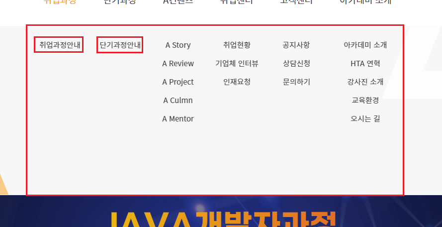

# 0520


# js
## 이벤트
* 이벤트 버블링
* 이벤트 처리의 위임
* 브라우저와 이벤트
* 마우스 이벤트
* 키보드 이벤트
js-18.html
```html
<!DOCTYPE html>
<html lang="ko">

<head>
    <meta charset="UTF-8">
    <meta http-equiv="X-UA-Compatible" content="IE=edge">
    <meta name="viewport" content="width=device-width, initial-scale=1.0">
    <title>Document</title>
    <style>
        div {
            padding: 25px;
            margin: 20px;
            border: 1px solid black;
        }
    </style>
</head>

<body>
    <h1>이벤트 버블링</h1>

    <div onclick="boxClick(event);" ondblclick="boxDBClick(event);">
        부모박스
        <div onclick="box1Click(event);" ondblclick="box1DBClick(event);">
            박스1
            <div onclick="box2Click(event);" ondblclick="box2DBClick(event);">
                박스2
            </div>
        </div>
    </div>
    <script>
        function boxClick(e) {
            //console.log('이벤트 객체', e);
            console.log("Parent - box - clicked")
        }
        function box1Click(e) {
            //console.log('이벤트 객체', e);
            e.stopPropagation();
            console.log("box1 - clicked")
        }
        function box2Click(e) {
            //console.log('이벤트 객체', e);
            e.stopPropagation();
            console.log("box2 - clicked")
        }

        function boxDBClick(e) {
            //console.log('이벤트 객체', e);
            console.log("Parent - box - double clicked")
        }
        function box1DBClick(e) {
            //console.log('이벤트 객체', e);
            console.log("box1 - double clicked")
        }
        function box2DBClick(e) {
            //console.log('이벤트 객체', e);
            console.log("box2 - double clicked")
        }
    </script>
    <!-- 
        이벤트버블링
            * 앨리먼트에서 이벤트가 발생하면, 이 앨리먼트에 바인딩 되어 있는 이벤트 핸들러 함수가 실행되고,
              이어서 부모 앨리먼트에 바인딩된 이벤트 핸들러가 실행되는 것이다.
              최상위 부모 앨리먼트(html 태그)를 만날 때까지 위의 과정을 반복한다.
            * 자식 앨리먼트에서 발생한 이벤트와 동일한 이벤트에 대한 이벤트 핸들러 함수가 부모 앨리먼트에 등록되어 있는 경우에만 부모 앨리먼트의 이벤트 핸들러 함수가 실행된다.
        버블링의 중단시키기
            * 앨리먼트에서 발생한 이벤트가 부모 앨리먼트로 전파되는 것을 중단시키는 것이다.
            Event객체의 stopPropagation()
                이벤트 버블링을 중단시킨다.
            Event객체의 stopImmediatePropagation()
                이벤트 버블링을 중단시킨다.
                * 앨리먼트에 특정 이벤트에 대해서 이벤트 핸들러 함수가 여러 개 등록되어 있는 경우
     -->
</body>

</html>
```

js19-.html
```html
<!DOCTYPE html>
<html lang="ko">

<head>
    <meta charset="UTF-8">
    <meta http-equiv="X-UA-Compatible" content="IE=edge">
    <meta name="viewport" content="width=device-width, initial-scale=1.0">
    <title>Document</title>
    <style>
        div {
            margin-bottom: 10px;
        }

        #big-img-box img {
            width: 300px;
            height: 450px;
            padding: 10px;
            border: 1px solid #ddd;
        }

        #small-img-box img {
            width: 128px;
            height: 192px;
            padding: 10px;
            border: 1px solid #ddd;
            margin: 10px;
        }
    </style>
</head>

<body>
    <h1>이벤트 버블링을 이용한 이벤트 처리(이벤트 위임)</h1>

    <div>
        <div id="big-img-box">
            
        </div>
        <div id="small-img-box" onclick="changeImage(event);">
            
            
            
            
            
        </div>
    </div>
    <script>
        function changeImage(e) {
            // console.log(e.target);
            // console.log(e.currentTarget);

            let imgE1 = e.target;

            let imagePath = imgE1.getAttribute("src");
            let imageDescription = imgE1.getAttribute("alt");
            // console.log("이미지경로: "+imagePath, "설명: " + imageDescription);

            let gallaryImgE1 = document.querySelector("#big-image-box img");
            gallaryImgE1.setAttribute("src", imagePath);
            gallaryImgE1.setAttribute("alt", imageDescription);
        }
    </script>
    <!-- 
        이벤트 처리의 위임
            * 비슷한 방식으로 여러 앨리먼트를 조작해야 하는 경우, 이벤트 위임을 사용하면 앨리먼트마다 이벤트 핸들러를 바인딩시키지 않고,
              부모앨리먼트에 이벤트 핸들러를 딱 하나만 바인딩해서 여러 자식 앨리먼트를 한 번에 핸들링 하는 것이다.

        주요 API
            Event객체의 주요 API
                .target
                    실제로 이벤트를 발생시킨 앨리먼트 객체를 제공한다.
                .currentTarget
                    현재 실행중인 이벤트 핸들러 함수가 등록된 앨리먼트 객체를 제공한다.
                    실제로 이벤트를 발생시킨 앨리먼트와 서로 다를 수 있다.
                .type
                    발생된 이벤트의 이름을 제공한다.                
     -->
</body>

</html>
```

js-20.html
```html
<!DOCTYPE html>
<html lang="ko">

<head>
    <meta charset="UTF-8">
    <meta http-equiv="X-UA-Compatible" content="IE=edge">
    <meta name="viewport" content="width=device-width, initial-scale=1.0">
    <title>Document</title>
    <style>
        div {
            margin-bottom: 10px;
        }

        #big-img-box img {
            width: 300px;
            height: 450px;
            padding: 10px;
            border: 1px solid #ddd;
        }

        #small-img-box img {
            width: 128px;
            height: 192px;
            padding: 10px;
            border: 1px solid #ddd;
            margin: 10px;
        }
    </style>
</head>

<body>
    <h1>브라우저의 이벤트 기본동작 막기</h1>

    <h3>이벤트에 대한 브라우저의 대표적인 기본동작</h3>
    <ul>
        <li>링크를 클릭하면(onclick이벤트가 발생하면) 해당 url로 페이지를 이동시킨다.</li>
        <li>폼 전송버튼(submit 버튼)을 클릭하면(onclick 이벤트가 발생하면) 웹서버로 폼입력값을 제출한다.</li>
    </ul>

    <div>
        <div id="big-img-box">
            
        </div>
        <div id="small-img-box" onclick="changeImage(event);">
            <a href="http://www.daum.net" onclick="return false"></a>
            <a href="http://www.daum.net" onclick="fn(event)"></a>
            <a href="http://www.daum.net" onclick="return false"></a>
            <a href="http://www.daum.net" onclick="return false"></a>
            <a href="http://www.daum.net" onclick="return false"></a>
        </div>
    </div>

    <h3>폼 입력값 제출 막기</h3>
    <div>
        <form id="login-form" action="login-jsp" onsubmit="">
            <input type="text" id="user-id" name="userId" placeholder="아이디를 입력하세요." /> <br>
            <input type="password" id="user-pwd" name="userPwd" placeholder="비밀번호를 입력하세요."> <br>
            <!-- 
                폼 입력값을 제출할 수 있는 버튼 정의하기
                <button>제출</button>
                <button type="submit">제출</button>
                <input type="submit" value="제출" />
                * 위와 같이 정의한 버튼을 클릭하면 그 버튼이 포함된 form 앨리먼트에서 onsubmit 이벤트가 발생한다.
             -->
            <button type="submit">로그인</button>
        </form>
    </div>

    <h3>폼 입력값 제출 막기</h3>
    <p>type이 button인 버튼은 클릭을 해도 form에서 onsubmit 이벤트가 발생하지 않는다.</p>
    <p>따라서 ,버튼을 클릭해도 폼 입력값은 서버로 제출되지 않는다.</p>
    <p>폼 입력값이 유효하면 form앨리먼트의 submit() 메소드를 실행</p>
    <div>
        <form id="search-form" action="search.jsp">
            <input type="text" id="keyword" name="keyword" placeholder="검색어를 입력하세요.">
            <button type="button">검색</button>
        </form>

    </div>
    <script>
        // 링크에 대한 기본 동작 막기
        function fn(e) {
            e.preventDefault();

            // 자바스크립트를 이용한 서버와의 데이터교환하기
            // 1. 링크의 URL 정보 획득
            // 2. 웹서버에 URL에 해당하는 데이터 요청
            // 3. 데이터를 응답으로 받아서 HTML 컨텐츠 생성
            // 4. 화면 이동이나 새로고침 없이 화면의 특정 영역에 3에서 생성한 HTML 컨텐츠 반영
            // 5. 사용자는 화면의 이동이나 새로고침없이 새 정보를 확인한다.
        }

        // 폼입렵값이 제출되는 것 막기
        // 입력값 유효성 체크를 해서 통과되면 true를 반환하고, 통과하지 못하면 false를 반환하도록 이벤트 핸들러 함수를 구현한다.
        // <form onsubmit="return formSubmit()" >
        // form태그에 이와 같이 정의해서 formSubmit() 함수가 true를 반환하면 onsubmit에 대한 브라우저 기본동작이 실행되고
        //                                                false
        function changeImage(e) {

        }

        // 폼에서 onsubmit 이벤트가 발생되지 않는 버튼을 사용하기
        // 유효성 체크를 통과하지 못하면 함수 실행을 종료시킨다.
        // 유효성 체크를 통과하면 form 앨리먼트의 submit()메소드를 호출해서 폼 입력값을 서버로 제출시킨다.
        function formSubmit2() {

        }

        // 
        function shangeImage(e) {

        }
    </script>
</body>

</html>
```

js-21.html
```html
<!DOCTYPE html>
<html lang="ko">

<head>
    <meta charset="UTF-8">
    <meta http-equiv="X-UA-Compatible" content="IE=edge">
    <meta name="viewport" content="width=device-width, initial-scale=1.0">
    <title>Document</title>
    <style>
        div {
            padding: 20px;
            margin: 20px;
            border: 1px solid black;
        }
    </style>
</head>

<body>
    <h1>마우스 이벤트</h1>

    <h3>mouseenter과 mouseleave</h3>
    <div onmouseenter="box1Enter(event)" onmouseleave="box1Leave(event)">
        박스1
        <div onmouseenter="box2Enter(event);" onmouseleave="box2Leave(event)">박스2</div>
    </div>

    <h3>mouseover와 mouseout</h3>
    <div onmouseover="box3Over(event)" onmouseout="box3Out(event)">
        박스3
        <div onmouseover="box4Over(event);" onmouseout="box4Out(event)">박스4</div>
    </div>

    <h3>mousemove</h3>
    <div onmousemove="box5Move(event)" onmousedown="box5Down(event)">
        박스5
        <p></p>
    </div>

    <script>
        function box5Down(e) {
            let content = `x좌표:${e.x} y좌표:${e.y}`;
            document.querySelector("p").textContext = content;
        }

        function box5Move(e) {
            let content = `x좌표:${e.x} y좌표:${e.y}`;
            document.querySelector("p").textContext = content;
        }

        function box1Enter(e) {
            e.stopPropagation();
            console.log("box - 1 - enter");
        }

        function box1Leave(e) {
            e.stopPropagation();
            console.log("box - 1 - leave");
        }

        function box2Enter(e) {
            e.stopPropagation();
            console.log("box - 2 - enter");
        }

        function box2Leave(e) {
            e.stopPropagation();
            console.log("box - 2 - leave");
        }

        function box3Over(e) {
            e.stopPropagation();
            console.log("box - 3 - over");
        }

        function box3Out(e) {
            e.stopPropagation();
            console.log("box - 3 - out");
        }

        function box4Over(e) {
            e.stopPropagation();
            console.log("box - 4 - over");
        }

        function box4Out(e) {
            e.stopPropagation();
            console.log("box - 4 - out");
        }
    </script>
</body>

</html>
```
* 
  * 큰 네모를 나가면 전체 메뉴가 사라진다.
  * 작은 네모를 나가도 전체 메뉴는 사라지지 않는다.
  * 커서가 작은 네모 밖으로 나갔을때 해당 창이 사라지지 않게 큰 네모에서 onmouseeneter, onmouseleave를 사용한다.
* onmousemove는 사용빈도가 낮은 편이다.

js-21.html
```html
<!DOCTYPE html>
<html lang="ko">

<head>
    <meta charset="UTF-8">
    <meta http-equiv="X-UA-Compatible" content="IE=edge">
    <meta name="viewport" content="width=device-width, initial-scale=1.0">
    <title>Document</title>
    <style>
        div {
            margin: 10px;
            padding: 10px;
        }

        input {
            display: block;
            width: 50%;
            padding: 10px;
            margin: 10px;
        }

        button {
            margin-left: 10px;
            padding: 10px;
        }

        .wrapper {
            border: 1px solid black;
        }
    </style>
</head>

<body>
    <h1>KeyboardEvent</h1>

    <h3>폼 입력값 검증하기</h3>
    <div class="wrapper">
        <form>
            <input type="text" id="user-id" name="userId" onkeydown="keydown(event);" onkeyup="keyup(event)"
                onkeypress="keypress(event)" placeholder="아이디를 입력하세요" />
            <div id="user-id-feedback"></div>
        </form>
    </div>

    <h3>로그인 정보 제출하기</h3>
    <div class="wrapper">
        <form action="login.jsp" onsubmit="return validForm()">
            <input type="text" id="email" name="email" placeholder="이메일을 입력하세요" onkeydown="moveToPasswordField(event);">
            <input type="password" id="password" name="password" placeholder="비밀번호를 입력하세요">
            <button type="submit">로그인</button>
        </form>
    </div>
    <script>
        const ID_MIN_LENGTH = 6;
        const ID_MAX_LENGTH = 20;

        // 키를 계속 누르고 있을 때 같은 문자가 계속 입력되는 것을 방지한다.
        function keydown(e) {
            //console.log('keydown', e.key, inputEl1.value);
            //console.log('down', e.repeat)
            if (e.repeat) {
                e.preventDefault();
            }
        }

        function keypress(e) {
            //console.log('keypress', e.key, inputEl1.value);
            //console.log('press', e.repeat)
        }

        function keyup(e) {
            //console.log('up', e.repeat)
            let inputEl1 = document.querySelector("#user-id");
            let feedbackEl = document.querySelector("#user-id-feedback");
            //console.log('keyup', e.key, inputEl1.value);

            let id = inputEl1.value;
            if (id.length < 6) {
                feedbackEl.textContent = "아이디는 최소 6글자 이상으로 입력해야 합니다.";
                return;
            }
            if (id.length > 20) {
                feedbackEl.textContent = "아이디는 최대 20글자 이하로 입력해야 합니다.";
                return;
            }
            feedbackEl.textContent = "아이디 길이가 적절합니다.";
        }

        // 이메일 필드에서 Enter 키를 입력하면 비밀번호 필드로 포커스를 이동시킨다.
        function moveToPasswordField(e) {
            if (e.key === 'Enter') {
                e.preventDefault();
                document.getElementById("password").focus();
            }
        }

        function validForm() {
            let email = document.getElementById("email").value;
            if (!email) {
                alert("이메일은 필수입력값입니다.");
                document.getElementById("email").focus();
                return false;
            }

            let password = document.getElementById("password").value;
            if (!password) {
                alert("비밀번호는 필수입력값입니다.");
                document.getElementById("password").focus();
                return false;
            }
            return true;
        }
    </script>

    <!--
    키보드 이벤트
        KeyboardEvent객체의 주요 API
            프로퍼티 
                key 
                    지금 입력한 문자를 제공한다.
                    문자키 : A single character (like "a", "W", "4", "+" or "$")
                    특수키 : A multicharacter (like "F1", "Enter", "ALT", "CTRL", "META", "SHIFT", "HOME" or "CAPS LOCK")
                    * 입력필드에서 Enter키를 입력했을 때 동작을 제어할 수 있다.
                      기본적으로 입력필드에서 Enter키를 입력하면 form 엘리먼트에서 onsubmit 이벤트가 발생하고, 폼 입력값이 제출된다.
                      위의 로그인의 예시처럼 email입력필드에서 Enter키를 입력하면 onsubmit 이벤트가 발생되지 않게하고, 다음 필드로 포커스를 옮기고,
                                           password입력필드에서 Enter키를 입력하면 원래처럼 form 엘리먼트에서 onsubmit 이벤트를 발생시켜서 폼입력값이 제출되게 한다.
                      사용예)
                        <form action="login.jsp" onsubmit="return validForm()">
                            <input type="text" id="email" name="email" placeholder="이메일을 입력하세요" onkeydown="moveToPasswordField(event);">
                            <input type="password" id="password" name="password" placeholder="비밀번호를 입력하세요" >
                            <button type="submit">로그인</button>
                        </form>

                        function moveToPasswordField(e) {
                            if (e.key === 'Enter') {
                                e.preventDefault();
                                document.getElementById("password").focus();
                            }
                        }

                        function validForm() {
                            let email = document.getElementById("email").value;
                            if (!email) {
                                alert("이메일은 필수입력값입니다.");
                                document.getElementById("email").focus();
                                return false;
                            }

                            let password = document.getElementById("password").value;
                            if (!password) {
                                alert("비밀번호는 필수입력값입니다.");
                                document.getElementById("password").focus();
                                return false;
                            }

                            return true;
                        }

                repeat
                    키를 계속 누르고 있는지 여부를 확인할 수 있다.
                    키를 계속 누르고 있으면 true값을 반환한다. 기본값은 false다.
                    * 입력필드에서 키를 계속 눌러서 같은 글자가 계속 입력되는 것을 방지할 때 사용할 수 있다.
                      사용예)
                        <input type="text" onkeydown="fn(e)"/>
                        function fn(e) {
                            // 키를 계속 누르면 입력한 키가 필드에 표시되지 않게 한다.
                            if (e.repeat) {
                                e.preventDefault();
                            }
                        }

        키보드 이벤트의 활용
            * onkeyup 이벤트와 바인딩된 이벤트핸들러 함수에서만 지금 입력한 문자가 포함된 내용을 입력필드에서 읽어올 수 있다.
            * onkeyup 이벤트를 활용하면 입력필드에 값이 입력될 때 마다 입력내용에 대한 작업을 수행할 수 있다.
              (아이디/비밀번호 유효성 체크, 아이디 중복체크 등)
            * KeyboardEvent객체의 key 프로퍼티를 이용하면 지금 입력한 문자를 획득할 수 있고, 특수키에 대한 처리를 수행할 수 있다.
                    
-->
</body>

</html>
```