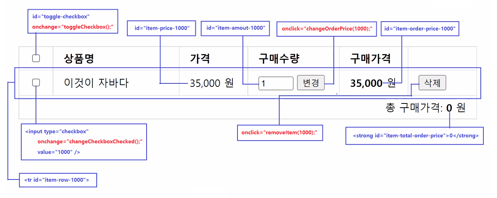

# 0523

- [0523](#0523)
- [js](#js)
  - [이벤트](#이벤트)
    - [querySelector, querySelectorAll](#queryselector-queryselectorall)
    - [이벤트별 종류](#이벤트별-종류)
    - [실습](#실습)
  - [객체](#객체)
    - [실습](#실습-1)

<small><i><a href='http://ecotrust-canada.github.io/markdown-toc/'>Table of contents generated with markdown-toc</a></i></small>

# js
## 이벤트
### querySelector, querySelectorAll
* querySelector는 element가 반환되고, querySelectorAll은 NodeList가 반환된다.
   ```JS
   let nodeList = document.querySelectorAll("input[name=skill]:checked");

      [inputElement]
      document.querySelectorAll("input[name=skill]:checked").value; // 오류
   ```
    * 이 메소드의 실행결과는 항상 NodeList객체다. 
    * 이 메소드의 실행결과가 null인 경우는 존재하지 않는다.
    * NodeList객체는 value 프로퍼티가 존재하지 않는다.
    * NodeList객체에 저장된 엘리먼트객체는 반복문을 사용해서 처리한다.

   ```JS
   let element = document.querySelector("input[name=job]:checked");

      inputElement
      document.querySelector("input[name=job]:checked").value;       // 오류가 아님
   ```
    * 이 메소드의 실행결과는 Element객체거나 null이다.
    * 이 메소드의 실행결과가 Element객체인 경우 value 프로퍼티가 존재한다.
      * 이 메소드의 실행결과가 null인 경우, 위의 수행문은 

### 이벤트별 종류
1. 마우스 이벤트
   * onclick
     * button 클릭시 바인딩된 이벤트핸들러 함수를 실행시킨다.
     * a(링크) 클릭시 바인딩된 이벤트핸들러 함수를 실행시킨다. (브라우저 기본동작 실행을 막아야 한다.)
     * img(이미지) 클릭시 바인딩된 이벤트 핸들러 함수를 실행시킨다.
     * form의 버튼을 클릭시 바인딩된 이벤트핸들러 함수를 실행시킨다.(`<button type="button">`으로 지정된 버튼에 한 함)
         ```html
         <form>
            <!-- 아래의 버튼을 클릭하면 form 엘리먼트가 onsubmit 이벤트를 발생시키지 않는다. -->
            <button type="button" onclick="이벤트핸들러함수">일반버튼</button>
         </form>
         ```
   * onmouseenter, onmouseleave, onmouseover, onmouseout
     * 위의 이벤트들은 마우스의 움직임에 따라서 스타일이 다르게 적용되는 경우, 메뉴가 표시되거나 사라지게 하는 경우 등에 활용되기 때문에
		개발자보다는 퍼블리셔의 작업영역인 경우가 대부분이다.
2. 키보드 이벤트
   * onkeydown, onkeyup
     * form의 입력필드에서 키보드 입력시 바인딩된 이벤트핸들러 함수를 실행시킨다.(입력값의 유효성 체크작업이 대부분이다.)
     * 검색창의 입력필드에서 키보드 입력시 바인딩된 이벤트핸들러 함수를 실행시킨다.(검색어 대한 자동완성 및 추천 검색어를 표시한다.)
3. 폼 이벤트
   * onchange
     * 체크박스, 라디오버튼, 셀렉터박스의 체크된 항목이나 선택된 항목이 변경될 때 바인딩된 이벤트핸들러 함수를 실행시킨다.
     * (필수 체크박스의 체크여부 확인, 체크박스/라디오버튼/셀렉터박스의 체크/선택 여부에 따라서 화면의 다른 엘리먼트를 변경할 때 사용한다.)
   * onsubmit
     * form의 포함된 제출버튼 클릭시 form과 바인딩된 이벤트핸들러 함수를 실행시킨다. 
         ```html
         <form onsubmit="이벤트핸들러함수();">
            <!-- 아래의 버튼들을 클릭하면 form 엘리먼트가 onsubmit 이벤트를 발생시킨다. -->
            <input type="submit" value="제출버튼" />
            <button type="submit">제출버튼</button>
            <button>제출버튼</button>
         </form>
         ```

### 실습
js23-event.html
```html
<!DOCTYPE html>
<html lang="ko">

<head>
    <meta charset="UTF-8">
    <meta http-equiv="X-UA-Compatible" content="IE=edge">
    <meta name="viewport" content="width=device-width, initial-scale=1.0">
    <title>Document</title>
</head>

<body>
    <h1>폼 이벤트</h1>

    <h3>경력사항 및 지원분야</h3>
    <form>
        <div>
            <label>보유기술: </label>
            <input type="checkbox" name="skill" value="java" onchange="changeSkill();"> java
            <input type="checkbox" name="skill" value="python" onchange="changeSkill();"> python
            <input type="checkbox" name="skill" value="js" onchange="changeSkill();"> javascript
            <input type="checkbox" name="skill" value="react" onchange="changeSkill();"> react
        </div>
        <div>
            <label>경력: </label>
            <select name="career" onchange="changeCareer();">
                <option value="0"> 신입</option>
                <option value="1"> 1년 이상</option>
                <option value="3"> 3년 이상</option>
                <option value="5"> 5년 이상</option>
                <option value="7"> 7년 이상</option>
                <option value="10"> 10년 이상</option>
            </select>
        </div>
        <div>
            <label>지원분야: </label>
            <input type="radio" name="job" value="si" onchange="changeJob();" checked> 시스템개발
            <input type="radio" name="job" value="sm" onchange="changeJob();"> 시스템유지보수
            <input type="radio" name="job" value="solution" onchange="changeJob();"> 솔루션개발
            <input type="radio" name="job" value="sales" onchange="changeJob();"> 기술영업
        </div>
    </form>

    <h3>경력사항 및 지원분야 선택현황</h3>
    <div>
        <h4>보유 기술</h4>
        <ul id="checked-skill-list"></ul>

        <h4>경력</h4>
        <p>경력사항 : <span id="selected-career"></span></p>

        <h4>지원분야</h4>
        <p>지원분야 : <span id="checked-job"></span></p>
    </div>
    <script>
        // 체크된 보유기술이 변경될 때마다, 현재 체크된 보유기술을 전부 조회해서 체크된 보유기술을 화면 출력한다.
        // 1. 선택된 보유 기술이 하나 이상 있는지 확인하기
        // 2. 선택된 보유 기술이 한 개 이상 있다면 그 기술을 리스트에 출력하기
        function changeSkill() {
            // 체크된 보유기술을 목록을 표시할 ul 엘리먼트를 선택한다.
            let ul = document.getElementById("checked-skill-list");

            // input 엘리먼트 중에서 name속성값이 skill이고, 체크된 엘리먼트를 선택한다.
            let checkedSkillElements = document.querySelectorAll("input[name=skill]:checked");
            // checkedSkillElements는 NodeList객체다. NodeList객체는 유사배열객체다.
            // NodeList객체의 length 프로퍼티는 NodeList객체에 저장된 엘리먼트의 갯수를 제공한다.
            if (checkedSkillElements.length === 0) {
                ul.innerHTML = "";
                alert("보유기술은 반드시 1개 이상 선택하세요.");
                return;
            }

            // checkedSkillElements NodeList객체에 저장된 엘리먼트의 갯수만큼 반복작업을 수행한다.
            let content = '';
            for (let index = 0; index < checkedSkillElements.length; index++) {
                // NodeList객체에서 지정된 index에 저장된 input 엘리먼트를 조회한다.
                let checkedCheckbox = checkedSkillElements[index];
                // input엘리먼트의 value 프로퍼티로 값을 조회한다.
                let checkedSkill = checkedCheckbox.value;

                // ul엘리먼트에 포함시킬 li 엘리먼트를 작성한다.
                content += `<li>${checkedSkill}</li>`;
            }

            ul.innerHTML = content;
        }

        // 경력사항이 변경될 때마다, 현재 선택된 경력기간을 화면에 출력한다.
        function changeCareer() {
            let selectedCareer = document.querySelector("select[name=career]").value;

            let span = document.querySelector("#selected-career");
            span.textContent = (selectedCareer === "0" ? "신입" : selectedCareer + "년 이상");
        }

        // 지원분야가 변경될 때마다, 현재 체크된 지원분야를 화면에 출력한다.
        function changeJob() {
            let checkedJob = document.querySelector("input[name=job]:checked").value;

            document.getElementById('checked-job').textContent = checkedJob;
        }
    </script>
</body>

</html>
```

js24-event.html
```html
<!DOCTYPE html>
<html lang="ko">

<head>
    <meta charset="UTF-8">
    <meta http-equiv="X-UA-Compatible" content="IE=edge">
    <meta name="viewport" content="width=device-width, initial-scale=1.0">
    <title>Document</title>
    <style>
        * {
            box-sizing: border-box;
        }

        table {
            width: 100%;
            border-collapse: collapse;
        }

        th,
        td {
            padding: 7px 16px;
            border: 1px solid #ddd;
            text-align: left;
        }

        input[type='number'] {
            width: 50%;
        }
    </style>
</head>

<body>
    <h1>장바구니</h1>

    <table>
        <colgroup>
            <col width="5%" />
            <col width="*" />
            <col width="15%;" />
            <col width="15%" />
            <col width="15%" />
            <col width="7%" />
        </colgroup>
        <thead>
            <tr>
                <th><input type="checkbox" id="all-toggle-checkbox" onchange="toggleCheckbox();" /></th>
                <th>상품명</th>
                <th>가격</th>
                <th>구매수량</th>
                <th>구매가격</th>
                <th></th>
            </tr>
        </thead>
        <tbody>
            <tr id="item-row-1000">
                <td><input type="checkbox" name="book-checkbox" value="1000" onchange="changeCheckboxChecked();" /></td>
                <td>이것이 자바다</td>
                <td><span id="item-price-1000">35,000</span> 원</td>
                <td><input type="number" value="1" id="item-amount-1000"> <button
                        onclick="changeOrderPrice(1000)">변경</button></td>
                <td><strong id="item-order-price-1000">35,000</strong> 원</td>
                <td><button onclick="removeItem(1000)">삭제</button></td>
            </tr>
            <tr id="item-row-1030">
                <td><input type="checkbox" name="book-checkbox" value="1030" onchange="changeCheckboxChecked();" /></td>
                <td>자바의 정석</td>
                <td><span id="item-price-1030">30,000</span> 원</td>
                <td><input type="number" value="1" id="item-amount-1030"> <button
                        onclick="changeOrderPrice(1030)">변경</button></td>
                <td><strong id="item-order-price-1030">30,000</strong> 원</td>
                <td><button onclick="removeItem(1030)">삭제</button></td>
            </tr>
            <tr id="item-row-1041">
                <td><input type="checkbox" name="book-checkbox" value="1041" onchange="changeCheckboxChecked();" /></td>
                <td>혼자서 공부하는 자바</td>
                <td><span id="item-price-1041">25,000</span> 원</td>
                <td><input type="number" value="1" id="item-amount-1041"> <button
                        onclick="changeOrderPrice(1041)">변경</button></td>
                <td><strong id="item-order-price-1041">25,000</strong> 원</td>
                <td><button onclick="removeItem(1041)">삭제</button></td>
            </tr>
        </tbody>
        <tfoot>
            <td colspan="6" style="text-align: right;">총 구매가격: <strong id="item-total-order-price">0</strong> 원</td>
        </tfoot>
    </table>
    <script>
        /*
        체크박스의 체크상태가 변경될 때마다 실행되는 이벤트 핸들러 함수다.
    */
        function changeCheckboxChecked() {
            // 체크박스의 갯수와 체크된 체크박스의 갯수를 조회한다.
            let checkboxCount = document.querySelectorAll('input[name="book-checkbox"]').length;
            let checkedCheckboxCount = document.querySelectorAll('input[name="book-checkbox"]:checked').length;

            // 전체 선택/해제 체크박스의 체크상태를 변경한다.
            // 체크박스의 갯수와 체크된 체크박스의 갯수가 같을 때만 true가 대입된다.
            document.getElementById("all-toggle-checkbox").checked = (checkboxCount === checkedCheckboxCount);

            // 총구매가격 갱신
            changeTotalOrderPrice();
        }

        /*
            all-toggle-checkbox의 체크상태가 변경되는 실행되는 이벤트 핸들러 함수다.
            all-toggle-checkbox의 체크상태가 변경되면 input[name=book-checkbox]의 상태를 같이 변경한다.
        */
        function toggleCheckbox() {
            let allToggleChecboxCheckedStatus = document.getElementById("all-toggle-checkbox").checked;
            let bookCheckboxNodeList = document.querySelectorAll("input[name='book-checkbox']");
            for (let index = 0; index < bookCheckboxNodeList.length; index++) {
                let bookCheckbox = bookCheckboxNodeList[index];
                bookCheckbox.checked = allToggleChecboxCheckedStatus;
            }

            // 총구매가격 갱신
            changeTotalOrderPrice();
        }

        /*
            삭제버튼을 클릭했을 때 실행되는 이벤트 핸들러 함수다.
            삭제버튼을 클릭하면 해당 삭제버튼이 포함된 tr 엘리먼트를 삭제한다.
        */
        function removeItem(itemNo) {
            document.getElementById("item-row-" + itemNo).remove();
            // 총구매가격 갱신
            changeTotalOrderPrice();
        }

        /*
            변경버튼을 클릭했을 때 실행되는 이벤트 핸들러 함수다.
            변경버튼을 클릭하면 해당 상품의 가격, 구매수량을 조회해서 구매가격을 계산하고, 구매가격칸의 값을 변경한다.
        */
        function changeOrderPrice(itemNo) {
            // 가격, 수량, 구매가격 엘리먼트 선택하기
            let span = document.getElementById("item-price-" + itemNo);
            let input = document.getElementById("item-amount-" + itemNo);
            let strong = document.getElementById("item-order-price-" + itemNo);

            // 가격텍스트, 구매수량 값 조회하기
            let priceText = span.textContent;
            let amountText = input.value;

            // 텍스트를 숫자로 변경하기
            let price = parseInt(priceText.replaceAll(',', ''));
            let amount = parseInt(amountText);

            // 구매가격을 계산하기
            let orderPrice = price * amount;

            // 구매가격을 표시하기
            strong.textContent = orderPrice.toLocaleString();

            // 총구매가격 갱신
            changeTotalOrderPrice();
        }


        /*
            input 엘리먼트중에서 name이 book-checkbox인 체크박스 중에서 체크된 엘리먼트만 선택한다.
            체크된 엘리먼트의 갯수가 0이면 총구매가격은 0이다.
            체크된 엘리먼트가 존재하면 NodeList객체에 저장된 체크박스를 반복처리해서 체크된 체크박스를 조회한다.
            체크박스의 값을 조회하면 아이템번호를 획득할 수 있다.
            아이디 속성값이 "item-price-아이템번호"이 엘리먼트를 선택하면 구매가격이 포함된 strong 엘리먼트를 획득한다.
            strong 엘리먼트의 텍스트 컨텐츠를 조회하고, 숫자로 변환한 다음 합계를 구한다.
            계산된 합계를 총구매가격을 표시하는 엘리먼트에 추가한다.
        */
        function changeTotalOrderPrice() {
            // 총구매가격을 표시하는 엘리먼트를 선택한다.<strong id="item-total-order-price">0</strong>
            let totalOrderStrongElement = document.getElementById("item-total-order-price");

            // 장바구니의 체크박스중에서 체크된 체크박스 엘리먼트를 전부 선택한다.
            let checkedCheckboxList = document.querySelectorAll('input[name="book-checkbox"]:checked');
            // 체크된 체크박스가 하나도 없으면 총구매가격을 0으로 변경한다.
            if (checkedCheckboxList.length === 0) {
                totalOrderStrongElement.textContent = 0;
                return;
            }

            // 총구매가격을 저장할 변수를 선언한다.
            let totalOrderPrice = 0;
            // 체크된 체크박스가 저장된 NodeList에서 checkBox 엘리먼트를 하나씩 순서대로 조회한다.
            for (let index = 0; index < checkedCheckboxList.length; index++) {
                // 지정된 index번째의 체크박스 엘리먼트를 가져온다.
                let checkbox = checkedCheckboxList[index];
                // 체크박스 엘리먼트가 가진 아이템번호를 조회한다.
                let itemNo = checkbox.value;

                // 구매가격 엘리먼트들 중에서 위에서 획득한 아이템번호와 연관있는 구매가격 엘리먼트를 선택한다.
                let strongElement = document.getElementById("item-order-price-" + itemNo);
                // 구매가격 텍스트를 조회한다.
                let orderPriceText = strongElement.textContent;
                // 구매가격 텍스트를 숫자로 변환한다.
                let orderPrice = parseInt(orderPriceText.replaceAll(",", ""));

                // 위에서 선언한 총구매가격 변수에 조회된 구매가격을 더한다.
                totalOrderPrice += orderPrice;
            }
            // 계산된 총구매가격을 표시한다
            totalOrderStrongElement.textContent = totalOrderPrice.toLocaleString();
        }
    </script>
</body>

</html>
```
* 


## 객체
1. 자바의 객체
   * 복잡한 구성의 값을 담는 객체
     * VO 객체 - 정보 전달용 객체, 멤버변수/Getter/Setter 메소드 제공
     * DTO 객체 - 정보전달용 객체, 멤버변수/Getter/Setter 메소드 제공
     * List 객체 - 순서가 보장되는 자료구조 객체
     * Set 객체 - 중복이 혀용되지 않는 자료구조 객체
     * Map 객체 - key, value의 쌍으로 저장하는 자료구조 객체
   * 다양한 기능을 제공하는 객체
     * Controller 객체 - 사용자와 상호작용을 담당하는 객체, 다양한 기능을 제공
     * Service 객체 - 업무로직 구현을 담당하는 객체, 다양한 기능을 제공
     * DAO 객체 - 데이터베이스 엑세스작업을 담당하는 객체, 다양한 기능을 제공

2. 자바스크립트의 객체
   * 자바스크립트에는 기본자료형과 객체가 있다.
   * 객체는 기본자료형을 제외한 거의 모든 것들이다.
   * 종류
     * 값을 담는 객체
       * 배열객체 - 가변길이 배열 객체다. 다양한 메소드를 제공하는 객체다.
       * 객체 - key, value의 쌍으로 값을 저장하는 객체
     * 다양한 기능을 제공하는 객체
       * String 객체, 배열객체 등.

### 실습
js25-object.html
```html
<!DOCTYPE html>
<html lang="ko">

<head>
    <meta charset="UTF-8">
    <meta http-equiv="X-UA-Compatible" content="IE=edge">
    <meta name="viewport" content="width=device-width, initial-scale=1.0">
    <title>Document</title>
    <style>
        label {display: inline-block; width: 100px;}
        input [type=text] {height: 20px;}
        form {padding: 10px; border: 1px solid #ddd; background-color: #eee;}
        form div {margin-bottom: 10px;}
    </style>
</head>
<body>
    <h1>자바스크립트 객체의 생성 및 사용</h1>

    <h3>사원정보</h3>
    <dl>
        <dt>아이디</dt><dd id="emp-id"></dd>
        <dt>이름</dt><dd id="emp-name"></dd>
        <dt>이메일</dt><dd id="emp-email"></dd>
        <dt>소속부서</dt><dd id="emp-dept"></dd>
        <dt>급여</dt><dd id="emp-salary"></dd>
        <dt>커미션비율</dt><dd id="emp-commission"></dd>
    </dl>

    <h3>사원정보 수정폼</h3>
    <form action="">
        <div>
            <label>아이디: <input type="text" name="empId"></label>
        </div>
        <div>
            <label>이름: <input type="text" name="empName"></label>
        </div>
        <div>
            <label>이메일: <input type="text" name="empEmail"></label>
        </div>
        <div>
            <label>소속부서: <input type="text" name="empDept"></label>
        </div>
        <div>
            <label>급여: <input type="text" name="empSalary"></label>
        </div>
        <div>
            <label>커미션비율: <input type="text" name="empCommission"></label>
        </div>
    </form>
    <script>
        // 사원 정보를 저장하는 객체를 객체리터럴을 이용해서 생성하고, employee 참조변수에 대입함.
        let employee = {
            id: 100,
            name: "홍길동",
            email: "hong@gmail.com",
            dept: '영업1팀',
            salary: 4500000,
            commissionPct: 0.3
        };

        (function () {
            // 참조변수 employee가 참조하는 객체의 id프로퍼티에 저장된 값을 id속성값이 emp-id인 앨리먼트객체의 textContent 프로퍼티에 대입한다.
            // 앨리먼트객체의 프로퍼티값이 변경되면 브라우저는 HTML DOM객체를 다시 랜더링해서 화면을 갱신한다.
            document.getElementById("emp-id").textContent = employee.id;
            document.getElementById("emp-name").textContent = employee.name;
            document.getElementById("emp-email").textContent = employee.email;
            document.getElementById("emp-dept").textContent = employee.dept;
            document.getElementById("emp-salary").textContent = employee.salary;
            document.getElementById("emp-commission").textContent = employee.commissionPct;

            // 참조변수 employee가 참조하는 객체의 id프로퍼티에 저장된 값을 name속성값이 empId인 입펼필드의 value 프로퍼티에 대입한다.
            document.querySelector('input[name=empId]').value = employee.id;
            document.querySelector('input[name=empName]').value = employee.name;
            document.querySelector('input[name=empEmail]').value = employee.email;
            document.querySelector('input[name=empDept]').value = employee.dept;
            document.querySelector('input[name=empSalary]').value = employee.salary;
            document.querySelector('input[name=empCommission]').value = employee.commissionPct;
        })();

    </script>
</body>

</html>
```

js26-object.html
```html
<!DOCTYPE html>
<html lang="ko">

<head>
    <meta charset="UTF-8">
    <meta http-equiv="X-UA-Compatible" content="IE=edge">
    <meta name="viewport" content="width=device-width, initial-scale=1.0">
    <title>Document</title>
    <style>
        table {
            width: 100%;
            border-collapse: collapse;
        }

        th,
        td {
            padding: 10px 12px;
            border: 1px solid #ddd;
            text-align: center;
        }
    </style>
</head>

<body>
    <h1>자바스크립트 객체의 생성 및 사용</h1>

    <h3>사원리스트</h3>
    <table id="employee-table">
        <thead>
            <tr>
                <th>순번</th>
                <th>아이디</th>
                <th>이름</th>
                <th>이메일</th>
                <th>소속부서</th>
                <th>급여</th>
                <th>커미션</th>
            </tr>
        </thead>
        <tbody></tbody>
    </table>

    <script>
        let employeeList = [{
                id: 100,
                name: "홍길동",
                email: "hong-gd@gmail.com",
                dept: "영업1팀",
                salary: 3400000,
                commission: 0.1
            },
            {
                id: 102,
                name: "김유신",
                email: "kim-ys@gmail.com",
                dept: "영업1팀",
                salary: 4500000,
                commission: 0.3
            },
            {
                id: 104,
                name: "강감찬",
                email: "kang-gc@gmail.com",
                dept: "영업1팀",
                salary: 5000000,
                commission: 0.25
            },
            {
                id: 134,
                name: "이순신",
                email: "lee-ss@gmail.com",
                dept: "영업2팀",
                salary: 8000000,
                commission: 0.3
            },
            {
                id: 201,
                name: "류관순",
                email: "ryou-ks@gmail.com",
                dept: "영업2팀",
                salary: 7500000,
                commission: 0.15
            },
            {
                id: 219,
                name: "안창호",
                email: "ahn-ch@gmail.com",
                dept: "영업2팀",
                salary: 5000000,
                commission: 0.15
            },

        ];

        (function () {
            let tbody = document.querySelector("#employee-table tbody");

            let rows = "";
            for (let index = 0; index < employeeList.length; index++) {
                let emp = employeeList[index];
                row = `
                    <tr>
                        <td>${index + 1}</td>
                        <td>${emp.id}</td>
                        <td>${emp.name}</td>
                        <td>${emp.email}</td>
                        <td>${emp.dept}</td>
                        <td>${emp.salary.toLocaleString()} 원</td>
                        <td>${emp.commission*100} %</td>
                    </tr>
                `;

                rows += row;
            }

            tbody.innerHTML = rows;
        })();
    </script>
</body>

</html>
```