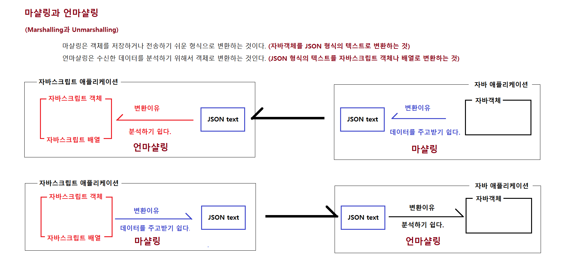
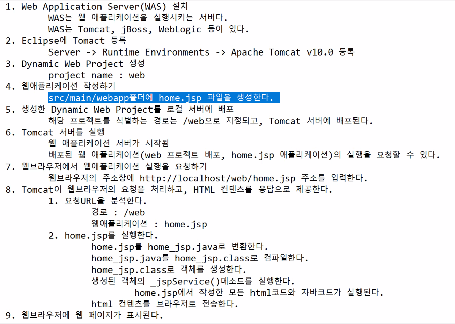

# 0524

- [0524](#0524)
- [js](#js)
  - [object](#object)
    - [date](#date)
      - [moment.js](#momentjs)
    - [String](#string)
    - [number, calculate with numbers](#number-calculate-with-numbers)
  - [JSON](#json)
    - [JSON 개요](#json-개요)
    - [마샬링](#마샬링)
    - [실습](#실습)
- [web](#web)
  - [web app 실행하기](#web-app-실행하기)

<small><i><a href='http://ecotrust-canada.github.io/markdown-toc/'>Table of contents generated with markdown-toc</a></i></small>


# js
## object
js27-object.html
```html
<!DOCTYPE html>
<html lang="ko">
<head>
    <meta charset="UTF-8">
    <meta http-equiv="X-UA-Compatible" content="IE=edge">
    <meta name="viewport" content="width=device-width, initial-scale=1.0">
    <title>Document</title>
</head>
<body>
    <script>
        // 1.
        // 객체를 생성하는 생성자 함수 정의하기
        function f1() {

        }
        f1();       // 단순 함수 실행,

        // 2.
        // 생성자 함수는 대문자로 만든다. 생성자 함수로 만들고 변수에 담아 사용하면 객체가 반환된다.
        function Calculator() {

        }
        let cal = new Calculator();

        // 3.
        // 객체를 이용해 더 쉽게 아래와 같은 데이터를 생성, 저장할 수 있다.
        let emp1 = {no:100, name:"홍길동", email: "hong@gmail.com", dept:"영업1팀", position:"과장", salary:500};
        let emp2 = {no:200, name:"김유신", email: "kim@gmail.com", dept:"영업1팀", position:"대리", salary:450};
        // 객체를 생성하는 생성자 함수 정의하기
        function Employee(no, name, email, dept, position, salary) {
            // 객체의 프로퍼티 구성하기
            console.log("생성자함수", this);
            this.no = no;
            console.log("생성자함수", this);
            this.name = name;
            console.log("생성자함수", this);
            this.email = email;
            console.log("생성자함수", this);
            this.dept = dept;
            console.log("생성자함수", this);
            this.position = position;
            console.log("생성자함수", this);
            this.salary = salary;            
            console.log("생성자함수", this);

            // 객체의 메소드 정의하기
            this.printInfo = function() {
                console.log("사원번호", this.no);
                console.log("이름", this.name);
                console.log("이메일", this.email);
                console.log("소속부서", this.dept);
                console.log("직위", this.position);
                console.log("급여", this.salary);
            };

            this.annualSalary = function() {
                return this.salary*12;
            }
        }
        /*
            1. new 빈 객체를 생성
            2. Employee() 생성자함수를 실행
            3. Employee() 생성자함수를 실행할 때, 1번에 생성한 객체를 전달한다.
            4. Employee() 생성자함수는 에서는 this 키워드로 3번에서 전달받은 객체를 사용할 수 있다.
            5. Employee() 
        */
        let emp3 = new Employee(300, "강감찬", "kang@gmail.com", "홍보부", "부장", 900);
        console.log(emp3);
        emp3.printInfo();
        let emp4 = new Employee(300, "류관순", "ryou@gmail.com", "인사부", "과장", 700);
        console.log(emp4);
        emp4.printInfo();

    </script>
</body>
</html>
```

### date
js28-date.html
```html
<!DOCTYPE html>
<html lang="ko">
<head>
    <meta charset="UTF-8">
    <meta http-equiv="X-UA-Compatible" content="IE=edge">
    <meta name="viewport" content="width=device-width, initial-scale=1.0">
    <title>Document</title>
</head>
<body>
    <h1>Date 객체</h1>

    <script>
        /*
            Date 객체
            날짜와 시간정보를 표현하는 객체다.
        */

        // 시스템의 현재 날짜와 시간정보를 표현하는 Date객체가
       let now = new Date();
       console.log(now); // Tue May 24 2022 10:20:14 GMT+0900 (한국 표준시)

       // 1970년 1월 1일 0시0분0초부터 현재 시간까지를 1/1000초 단위로 표시한 값
       let unixTime = now.getTime();
       console.log("유닉스타임: " + unixTime); // 유닉스타임: 1653355214117
       
       // 년, 월, 일, 시, 분, 초
       console.log('년', now.getFullYear());
       console.log('월', now.getMonth());
       console.log('일', now.getDate());
       console.log('시', now.getHours());
       console.log('분', now.getMinutes());
       console.log('초', now.getSeconds());

       let dateString = now.toLocaleDateString();
       console.log(dateString); // 2022. 5. 24.

       let timeString = now.toLocaleDateString();
       console.log(timeString); // 2022. 5. 24.

       let localeString = now.toLocaleString();
       console.log(localeString); // 2022. 5. 24. 오전 10:23:22
       
    </script>
</body>
</html>
```

js29-date.html
```html
<!DOCTYPE html>
<html lang="ko">
<head>
    <meta charset="UTF-8">
    <meta http-equiv="X-UA-Compatible" content="IE=edge">
    <meta name="viewport" content="width=device-width, initial-scale=1.0">
    <title>Document</title>
</head>
<body>
    <h1>Date 객체</h1>
    <script>
        // 지정된 날짜에 해당하는 Date객체 생성하기
        // Date객체를 생ㅅ어하고 년/월/일/시/분/초fmf setter메소드로 설정한다.
        let day = new Date();
        day.setFullYear(2000);
        day.setMonth(0);
        day.setDate(1);
        day.setHours(0);
        day.setMinutes(0);
        day.setSeconds(0);
        
        console.log(day.toLocaleString());

        // 년/월/일/시/분/초를 생성자함수의 매개변수 인자로 전달해서 지정된 날짜와 시간정보를 표현하는 Date객체 생성하기
        let day2 = new Date(2000, 0, 1, 0, 0, 0);
        console.log(day2.toLocaleString());

        let day3 = new Date(2000, 0, 1);
        console.log(day3.toLocaleString());

        let day4 = new Date(Date.parse('2000, 1, 1, 00:00:00'));
        console.log(day4.toLocaleString());

        let day5 = new Date(Date.parse('2000, 1, 2.'));
        console.log(day5.toLocaleString());

        let day6 = new Date(Date.parse('2022-5-24'));
        console.log(day6.toLocaleString());

    </script>
</body>
</html>
```

#### moment.js
> [moment.js docs displaying](https://momentjs.com/docs/#/displaying/)

js30-momentjs.html
```html
<!DOCTYPE html>
<html lang="ko">

<head>
    <meta charset="UTF-8">
    <meta http-equiv="X-UA-Compatible" content="IE=edge">
    <meta name="viewport" content="width=device-width, initial-scale=1.0">
    <title>Document</title>
</head>

<body>
    <h1>moment.js로 날짜와 시간 다루기</h1>

    <!-- 
        외부 자바스크립트 라이브러리를 이 페이지에 추가하기
        moment.min.js는 날짜와 시간에 관한 다양한 기능을 제공하는 자바스크립트 라이브러리다.
        ko.min.js는 국제화처리(연산결과가 한국표현에 맞게 표시되도록 한다.) 라이브러리다.
     -->

    <script src="https://cdnjs.cloudflare.com/ajax/libs/moment.js/2.29.3/moment.min.js"></script>
    <script src="https://cdnjs.cloudflare.com/ajax/libs/moment.js/2.29.3/locale/ko.min.js"></script>
    <script>

        // 현재날짜와 시간정보가 포함된 객체 획득하기
        let now = moment();

        // 현재날짜와 시간정보를 다양한 형식의 텍스트로 변환할 수 있다.
        console.log("현재 날짜: ", now.format('YYYY-MM-DD'))
        console.log("현재 날짜: ", now.format('YYYY년 M월 D일'))
        console.log("현재 날짜: ", now.format('YYYY년 M월 D일 dddd'))
        console.log("현재 시간: ", now.format('a hh:mm:ss'))

        // 현재 날짜를 기준으로 3일전 날짜 조회하기
        let threeDaysAgo = moment().add(-3, 'd');
        console.log("3일전: ", threeDaysAgo.format("YYYY-MM-DD"));

        // 현재 날짜를 기준으로 1주일전 날짜 조회하기
        let oneWeeksAgo = moment().add(-1, 'w');
        console.log("1주일전: ", oneWeeksAgo.format("YYYY-MM-DD"));

        // 현재 날짜를 기준으로 1개월전 날짜 조회하기
        let oneMonthAgo = moment().add(-1, 'M'); // M 대문자로.
        console.log("1개월전: ", oneMonthAgo.format("YYYY-MM-DD"));

        // 현재 날짜를 기준으로 3개월전 날짜 조회하기
        let threeMonthsAgo = moment().add(-3, 'M');
        console.log("3개월전: ", threeMonthsAgo.format("YYYY-MM-DD"));

        let anyDay = moment('2021-05-24')
        console.log('지정된 날짜로부터 오늘까지 며칠이나 차이가 나는가? ', now.diff(anyDay, 'days'));
        console.log('지정된 날짜로부터 오늘까지 몇달이나 차이가 나는가? ', now.diff(anyDay, 'months'));

    </script>
</body>

</html>
```

### String
js31-string.html
```html
<!DOCTYPE html>
<html lang="ko">
<head>
    <meta charset="UTF-8">
    <meta http-equiv="X-UA-Compatible" content="IE=edge">
    <meta name="viewport" content="width=device-width, initial-scale=1.0">
    <title>Document</title>
</head>
<body>
    <h1>String</h1>

    <script>
        /*
            자바스크립트의 문자열은 기본 자료형(객체가아니다)이다.
            문자열을 조작하기 위해서 메소드를 사용하는 순간 String객체가 된다.

            String 객체의 주요 API
                프로퍼티
                    .length
                        문자열의 길이를 반환한다.
                주요 메소드
                    .toUpperCase()
                        대문자도 변환된 문자열을 반환한다.
                    .toLowerCase()
                        소문자도 변환된 문자열을 반환한다.
                    .split('구분문자')
                        문자열을 기정된 구분문자를 기준으로 잘라서 배열에 저장한 다음 반환한다.
                    .replace('찾는문자열', '대체할 새문자열')
                        문자열에 해당되는 부분을 찾아서 새 문자열로 대체한 다음 반환한다.
                    .substring(begin, end)
                        문자열에 지정된 구간의 부분 문자열을 반환한다.
                        end가 생략되면 시작위치부터 문자열의 끝까지 구성된 부분 문자열을 반환한다.
                    .substr(begin, length)
                        문자열에서 시작위치부터 길이만큼의 부분 문자열을 반환한다.
                        length가 생략되면 시작위치부터 문자열의 끝까지 구성된 부분 문자열을 반환한다.
                    .startsWith('찾는 문자열')
                        문자열이 지정된 문자열로 시작하면 true를 반환한다.
                    .endWith('찾는 문자열')
                        문자열이 지정된 문자열로 끝나면 true를 반환한다.
                    .trim()
                        문자열의 좌/우에 있는 불필요한 공백이 제거된 문자열을 반환한다.
                    .includes('찾는 문자열')
                        문자열에 찾는 문자열이 존재하면 true를 반환한다.

            자바의 String과 자바스크립트의 String
                1. 문자열의 비교
                    자바
                        문자열.equals(문자열)
                    자바스크립트
                        문자열 === 문자열
                2. 문자열의 길이 조회
                    자바(메소드)
                        문자열.length();
                    자바스크립트(프로퍼티)
                        문자열.length
        */

        console.log("JavaScript string".length);
        console.log("JavaScript string".toUpperCase());
        console.log("JavaScript string".split(' '));
        console.log("JavaScript string".replace('JavaScript', '자바스크립트'));
        console.log("JavaScript string".includes('java'));
    </script>
</body>
</html>l
```

### number, calculate with numbers
js32-number.html
```html
<!DOCTYPE html>
<html lang="ko">
<head>
    <meta charset="UTF-8">
    <meta http-equiv="X-UA-Compatible" content="IE=edge">
    <meta name="viewport" content="width=device-width, initial-scale=1.0">
    <title>Document</title>
</head>
<body>
    <h1>Number객체와 숫자관련 연산</h1>

    <script>
        /*
            Number객체의 주요 API
                주요 메소드
                    .toLocaleString()
                        숫자를 3자리마다 ,가 포함된 문자열로 반환한다.
                    .toFixed(), toFixed(자릿수)
                        숫자를 지정된 자리까지 반올림한다.
                            5.5678.toFixed()   ---> 6
                            5.5678.toFixed(2)  ---> 5.57
        */

        /*
            let x = 10;                 // "number" 타입
            let y = new Number(10)      // "Object" 타입
        */
        let num1 = 1000000;
        let text1 = new Number(num1).toLocaleString();
        let text2 = num1.toLocaleString();
        console.log(text1);
        console.log(text2);

        /*
            텍스트를 숫자로 변환하기
            parseInt('텍스트')    -> 정수
            parseInt('텍스트')    -> 실수
            * parseInt()나 parseFloat()는 자바스크립트의 글로벌 메소드
            * parseInt()나 parseFloat()는 텍스트가 숫자로 시작하기만 하면 된다.
              * 첫번째 요소만 숫자면 된다. > 1가23 (o) , 가123 (x)
                parseInt("123가나다라") ---> 123
                parseFloat("3.14가나다라") ---> 3.14
                parseInt("가나다라123") ---> NaN
            isNan(값)
                * 값이 Not-a-Number면 true를 반환한다.
                    isNaN(123) ---> false
                    isNaN("123") ---> false
                    isNaN("가나다") ---> true

            텍스트의 사칙연산
                "123" + 10      ---> "12310"
                "123" + "10"    ---> "12310"
                "123" - 10;     ---> 113
                "123" - "10"    ---> 113
                "123" * 10;     ---> 1230
                "123" * "10"    ---> 1230
                "123" / 10;     ---> 12.3
                "123" / "10"    ---> 12.3

                * 숫자로 구성된 텍스트에 대해서 사칙연산 시
                  덧셈연산은 반드시 텍스트를 parseInt()나 parseFloat()를 사용해서 숫자로 변경 후 연산한다.

        */
    </script>
</body>
</html>l
```

## JSON
* JSON, XML
* 공공데이터포털에서 데이터 확인해보기 (오픈 API)
    > https://www.data.go.kr/
    > https://harrys4th.tistory.com/41

### JSON 개요
> https://www.json.org/json-ko.html

* 자바스크립트의 객체 리터럴
  * `let obj = {no:100, name: "홍길동", salary:10000000}`

* 자바스크립트의 배열 리터럴
  * `let arr = [100, 200, 300]`

* JSON Object 구조
  * key:value의 쌍들이 비순서화된 집합이다.
    ```json
    {}
    {string:value}
    {string:value, string:value, string:value}
    ```
    * 작성예
      * 자바스크립트
        * `let text = '{"no":100, "name":"홍길동", "salary":1000000}';`
      * 자바
        * `String text = ...`
    * 작성예
      * `{"no":100}`
      * `{"name":"블랙핑크", ...}`
      * `{"no":100, "name":"홍길동", ...}`
* JSON Array 구조
  * value들의 순서화된 리스트
  ```json
  []
  [value]
  [value, value, value, value]
  ```
    * 작성예
      * `["이것이 자바다", ]`
      * `[{"no":100, "name": ... `

### 마샬링
* 한 객체의 메모리에서 표현방식을 저장 또는 전송에 적합한 다른 데이터 형식으로 변환하는 과정
> https://ko.wikipedia.org/wiki/%EB%A7%88%EC%83%AC%EB%A7%81_(%EC%BB%B4%ED%93%A8%ED%84%B0_%EA%B3%BC%ED%95%99)



### 실습
* 크롬 개발자도구에서 오픈 api-json을 통해 실습해볼 수 있다.
js33-json.html
```html
<!DOCTYPE html>
<html lang="ko">

<head>
    <meta charset="UTF-8">
    <meta http-equiv="X-UA-Compatible" content="IE=edge">
    <meta name="viewport" content="width=device-width, initial-scale=1.0">
    <title>Document</title>
</head>

<body>
    <h1>JSON(JavaScript Object Notation)</h1>
    <script>
        /*
        JSON(JavaScript Object Notation)
            - 자바스크립트 객체 표기법을 활용한 경량의 데이터 교환형식이다.
            - 사람이 읽고 쓰기 쉽다.
            - 기계(프로그램)가 분석하고 생성하기 쉽다.
            - 프로그램 언어에 완전이 독립적이다.
            - 이상적인 데이터-교환 형식이다.
        
        JSON 표기법의 작성된 텍스트 데이터
            JSON Object 구조
                key:value의 쌍들의 비순서화된 집합이다.
                {}
                {string:value}
                {string:value, string:value, string:value}

                작성예
                    자바스크립트
                    let text ='{"no":100, "name":"홍길동", "salary":1000000}';
                    자바
                    String text = "{\"no\":100, \"name\":\"홍길동\", \"salary\":1000000}"

                작성예
                    {"no":100, "name":"홍길동", "salary":1000000, "expired":false}
                    {"name":"블랙핑크", "members":["지수", "제니", "로제", "리사"]}
                    {"no":100, "name":"홍길동", "car":{"name":"제네시스", "model":"GB80", "price":7000000}}
                    

            JSON Array 구조
                value들의 순서화된 리스트다.
                []
                [value]
                [value, value, value, value]

                작성예 
                    ["이것이 자바다", "자바의 정석", "혼자서 공부하는 자바", "Do it! 자바"]
                    [{"no":100, "name":"홍길동", "salary":450}, {"no":101, "name":"김유신", "salary":600}, {"no":103, "name":"강감찬", "salary":500}]

        자바스크립트에서의 JSON 데이터 활용
            JSON.parse(json 데이터 형식의 텍스트)
                - json 데이터 형식으 ㅣ텍스트를 자바스크립트 객체나 자바스크립트 배열로 변환한 수 반환한다.
            JSON.stringify(자바스크립트 객체 혹은 배열)
                - 자바스크립트 배열 혹은 배열을 json 데이터 형식의 텍스트로 변환한 수 반환한다.
            
            * 자바스크립트 애플리케이션에서 JSON 데이터 활용
                - 서버가 JSON 형식의 텍스트를 데이터로 제공한다.
                - 자바스크립트 애플리케이션에서는 JSON.parse()메소드를 사용해서 JSON형식의 텍스트 데이터를 분석하기 쉬운 자바스크립트 객체나 배열로 변환한다.
                - 데이터를 분석(조회, 반복처리)해서 HTML 컨텐츠를 생성한다.
                - 생성된 HTML 컨텐츠를 웹 페이지에 반영한다.
                - 웹페이지의 화면이 갱신된다.
    */
    </script>
</body>

</html>
```

# web
## web app 실행하기


1. install WAS
2. register Tomcat in Eclipse
3. create Dynamic Web Project
4. distrubute dynamic web project in local server
5. run Tomcat
6. request run web application in web browser
7. Tomcat process request and provide HTML contents
   1. analyze requestURL
   2. run .jsp file
8. web page is being displayed in web browser