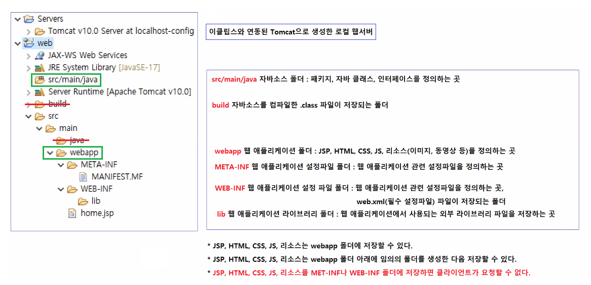

# 0525

- [0525](#0525)
- [WEB](#web)
  - [Dynamic Web Project의 구조](#dynamic-web-project의-구조)
- [네트워크](#네트워크)
  - [HTTP](#http)
- [웹 애플리케이션](#웹-애플리케이션)
- [bootstrap](#bootstrap)
  - [bootstrap 실습](#bootstrap-실습)
- [JSP](#jsp)
  - [JSP의 구성요소](#jsp의-구성요소)
    - [디렉티브(지시어)](#디렉티브지시어)
    - [스크립틀릿](#스크립틀릿)
    - [표현식](#표현식)

<small><i><a href='http://ecotrust-canada.github.io/markdown-toc/'>Table of contents generated with markdown-toc</a></i></small>


# WEB
## Dynamic Web Project의 구조

* src/main/java에서 자바소스를 작성한다.
* webapp폴더에서 jsp, html, css, js, 리소스를 관리한다.
* 빨간줄의 폴더는 건드리지 않는다.

# 네트워크
## HTTP

# 웹 애플리케이션

# bootstrap
## bootstrap 실습
1. 버튼
2. 테이블


# JSP
## JSP의 구성요소
### 디렉티브(지시어)
* JSP페이지에 대한 설정정보를 정의하는 JSP의 구성요소다.
* `<%@ page   %>`
 * 페이지 지시어 : JSP 페이지에 대한 설정정보를 정의한다.
   * `<%@ page language="java" contentType="text/html; charset=UTF-8" pageEncoding="UTF-8"%>`
     * `language="java"`
       * JSP 페이지에서 사용하는 프로그래밍 언어는 자바다.
     * `contentType="text/html; charset=UTF-8"`
       * JSP 페이지가 응답으로 제공하는 컨텐츠는 HTML 컨텐츠다. 한글을 지원하기 위해서 캐릭터셋은 utf-8이다.
     * `pageEncoding="UTF-8"%>`
       * JSP 파일을 저장할 때 utf-8방식으로 저장해라
* `<%@ include   %>`
 * include 지시어 : JSP 페이지에 포함시킬 다른 JSP 페이지를 정의한다.
* `<%@ taglib   %>`
 * 태그라이브러리 지시어 : JSP 페이지에서 사용할 태그라이브러리를 정의한다.

### 스크립틀릿
* `<% %>`
* JSP 페이지에서 java 코딩영역을 생성하는 JSP의 구성요소다.
    ```JSP
    <%
        int x = 10;
        BookService bookService = BookService.getInstance();
        List<Book> bookList = bookService.getAllBooks();   
    %>

### 표현식
* `<%= %>`
* 변수의 값을 응답컨텐츠에 포함시킬 때 사용하는 JSP의 구성요소다.
  ```jsp
  <%
        Book book = bookService.getBookDetail(10000);
  %>
  <dl>
    <dt>제목</dt><dd>이것이 자바다.</dd>
    <dt>저자</dt><dd>홍길동</dd>
    <dt>출판사</dt><dd>한빛미디어</dd>
  </dl>