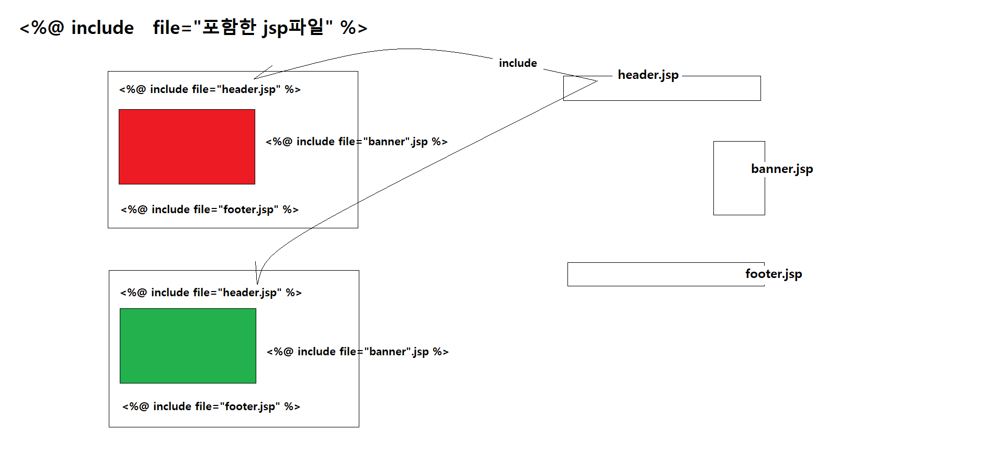
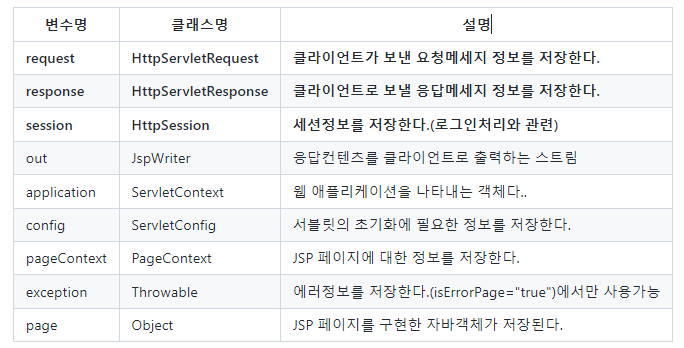
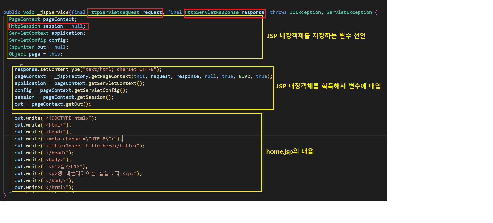
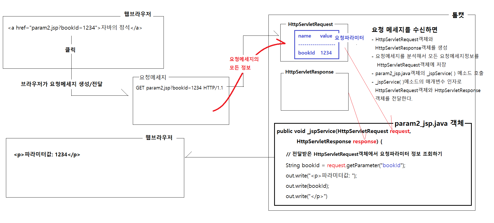
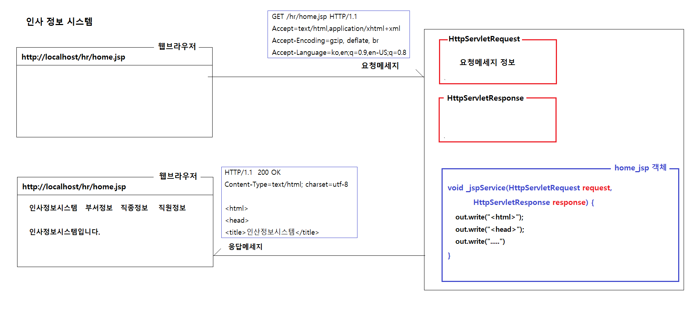
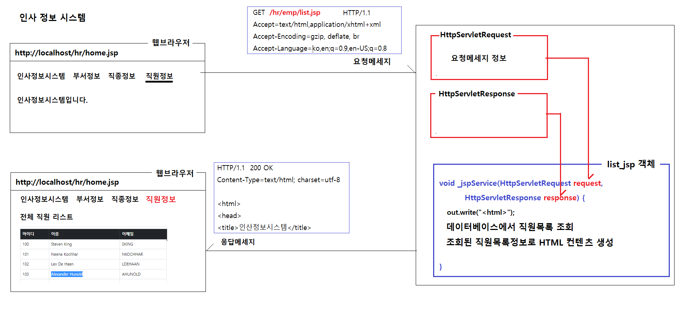
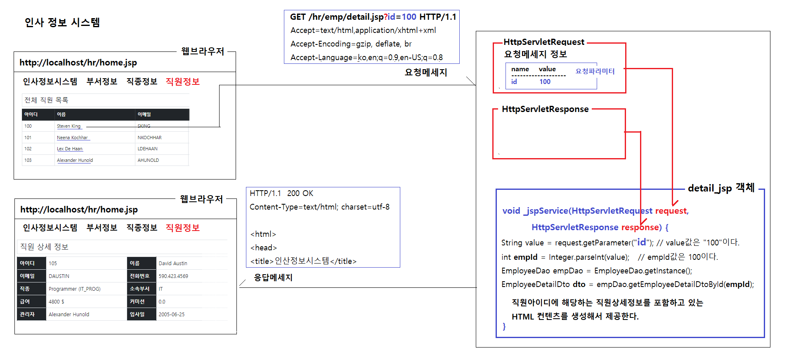

# 0526

- [0526](#0526)
- [JSP](#jsp)
	- [JSP 구성요소](#jsp-구성요소)
		- [디렉티브](#디렉티브)
			- [page 디렉티브](#page-디렉티브)
			- [include 디렉티브](#include-디렉티브)
			- [taglib 디렉티브](#taglib-디렉티브)
		- [스크립트 요소](#스크립트-요소)
			- [스크립트릿](#스크립트릿)
			- [표현식](#표현식)
			- [선언식](#선언식)
			- [주석](#주석)
	- [JSP의 내장객체](#jsp의-내장객체)
		- [HttpServletRequest](#httpservletrequest)
		- [HttpServletResponse](#httpservletresponse)
		- [HttpSession](#httpsession)
	- [클라이언트의 요청방식](#클라이언트의-요청방식)
		- [GET 방식](#get-방식)
- [인사정보시스템 앱](#인사정보시스템-앱)
	- [VO](#vo)
	- [Util](#util)
	- [DAO](#dao)
	- [DTO](#dto)
	- [webapp폴더 (jsp파일 작성)](#webapp폴더-jsp파일-작성)
		- [emp폴더](#emp폴더)

<small><i><a href='http://ecotrust-canada.github.io/markdown-toc/'>Table of contents generated with markdown-toc</a></i></small>


# JSP
## JSP 구성요소
1. 디렉티브
2. 스크립트
### 디렉티브
* jsp페이지에 대한 설정 정보를 정의한다.
#### page 디렉티브
* 주요속성
  * contentType 
    * 응답컨텐츠의 타입 및 인코딩방식을 결정
    * `<% page contentType="text/html; charset=utf-8" %>`
  * pageEncoding 
  	- jsp파일을 저장할 때 사용할 인코딩방식을 결정
  	- `<%@ page pageEncoding="utf-8" %>`
  * import 
  	- jsp파일에서 사용되는 클래스에 대한 import문 역할 수행
  	- `<%@ page import="java.util.List"%>`
  * errorPage 
  	- jsp파일 실행 중 에러 발생시 표시할 페이지를 설정
  	- `<%@ page errorPage="serverError.jsp" %>`
  * isErrorPage 
  	- 에러페이지로 사용되는 jsp 페이지인지 여부를 설정
  	- `<%@ page isErrorPage="true" %>`
  * trimDirectiveWhiteSpace 
  	- 디렉티브 정의로 발생되는 빈줄을 삭제할지 여부를 설정
  	- `<%@ page trimDirectiveWhiteSpace="true" %>`
#### include 디렉티브
* 주요속성
  * file
    * 현재 페이지에 포함시킬 jsp파일의 경로와 이름을 지정한다.
    * `<%@ include file="common/header.jsp" %>`



#### taglib 디렉티브
* 주요속성
  * prefix
    * 태그라이브러리 적용시 사용되는 별칭을 지정
  * uri
    * jsp페이지에서 사용할 태그라이브러리식별자를 정의
### 스크립트 요소
* JSP에서 로직을 수행하거나, 변수의 값을 출력에 포함시키거나, 메소드를 정의하거나 할 때 사용한다.
#### 스크립트릿
```jsp
<%
	자바코드를 작성할 수 있다.
%>
```
* JSP 페이지에서 자바코드를 실행할 수 있게 한다.
* JSP가 자바파일로 변환될 때, _jspService메소드내에 포함되는 코드를 작성할 수 있게 한다.
#### 표현식
```jsp
<태그><%=값 %></태그>
<태그><%=값을 반환하는 메소드 %></태그>
```
* 응답컨텐츠에 포함되어서 클라이언트로 전송되게 한다.
* 변수에 저장된 값이나, 메소드의 실행결과로 획득되는 반환값을 표현식에서 사용할 수 있다.
#### 선언식
```jsp
<%!
    private DecimalFormat df = new DecimalFormat("##,###");
    private String numberToCurrency(long number) {
        return df.format(number);
    }
%>
```
* JSP페이지에 새로운 필드나 새로운 메소드를 정의(선언)할 때 사용한다.
* 사용빈도는 그렇게 높지 않다.
#### 주석
```jsp
<%-- jsp 주석을 여기에 적는다. -->
```
* JSP 주석

## JSP의 내장객체
* JSP 페이지가 자바로 변환될 때 _jspService메소드에서 사용가능한 객체
* JSP는 웹 애플리케이션 개발에 필요한 객체를 미리 생성(획득)해서 적절한 변수에 저장하고, 스크립트릿에서 사용가능한 상태로 
초기화시켜놓는다.


* request, response, session을 주로 사용한다.

### HttpServletRequest
* request 변수에 저장된다.
* 클라이언트가 서버로 보낸 요청 메세지를 저장하고 있다
* 요청메세지정보를 획득할 수 있는 다양한 getXXX() 메소드를 제공한다.
* 주요메소드

|반환타입|메소드명|설명|
|---|---|---|
String|	getParameter(String name)|	지정된 이름의 요청파라미터값을 반환한다. 요청파라미터값이 없으면 null을 반환한다|
String[]|	getParameterValues(String name)|	지정된 이름의 모든 요청파라미터값을 배열의 형태로 반환한다. 요청파라미터값이 없으면 null을 반환한다|
void|	setCharacterEncoding(String encoding)|	요청파라미터값을 지정된 인코딩방식으로 복원한다.|
void|	setAttribute(String name, Object value)|	요청객체에 이름,객체 쌍의 속성(객체)을 저장한다.|
Object|	getAttribute(String name)|	요청객체에서 지정된 이름으로 저장된 속성(객체)를 반환한다. 지정된 이름의 속성이 존재하지 않으면 null을 반환한다.|
void|	removeAttribute(String name)|	요청객체에서 지정된 이름으로 저장된 속성(객체)을 삭제하다.|
### HttpServletResponse
* response 변수에 저장된다.
* 서버가 클라이언트로 보낼 응답 메세지를 책임진다.
* 응답메세지에 대한 다양한 정보를 설정할 수 있는 setXXX() 메소드를 제공한다.
* 주요 메소드

|반환타입|메소드명|설명|
|---|---|---|
void|	sendRedirect(String url)|	지정된 url을 재요청하게 하는 응답을 보낸다|

### HttpSession
* session 변수에 저장된다.
* 클라이언트별로 고유하게 사용되는 객체다.
* 고유한 아이디를 가지고 있다.
* 클라이언트가 처음 접속할 때 자동 생성되고, 생성된 HttpSession객체의 아이디가 응답으로 클라이언트에게 보내진다.
* 세션아이디를 전달받은 클라이언트는 요청할 때 마다 세션아이디를 요청헤더에 담아서 서버로 전송한다.
* 서버는 요청헤더의 세션아이디를 조회해서 그 아이디에 해당하는 세션객체를 실행되는 JSP의 sessioin변수에 저장한다.
* 용도
  * 클라이언트의 정보를 보관하기
    * 클라이언트별로 각각 다른 세션객체를 사용하기 때문에
    * 로그인한 사용자정보, 장바구니정보, 최근 본 상품정보 (클라이언트의 private한 정보)
  * 클라이언트의 상태 유지
    * 접속한 클라이언트를 식별해서(누군지 안다.)
    * 해당 클라이언트에게 적절한 응답을 제공할 수 있다.
* 주요 메소드

|반환타입|메소드명|설명|
|---|---|---|
void|	setAttribute(String name, Object value)|	세션객체에 이름,객체 쌍의 속성(객체)을 저장한다.
Object|	getAttribute(String name)|	세션객체에서 지정된 이름으로 저장된 속성(객체)를 반환한다. 지정된 이름의 속성이 존재하지 않으면 null을 반환한다.
void|	removeAttribute(String name)|	세션객체에서 지정된 이름으로 저장된 속성(객체)을 삭제하다.
void|	invalidate()|	세션객체를 무효화시킨다. 로그아웃 요청시 실행한다



## 클라이언트의 요청방식
* 클라이언트가 서버로 요청 메세지를 보내는 방식
### GET 방식 
* GET 방식의 요청
  1. 주소창에 주소를 입력해서 요청하는 경우   
  2. 링크를 클릭해서 요청하는 경우
    * `<a href="web/about.jsp">회사소개</a>`일 때 회사소개를 클릭한 경우
  3. form태그의 method 속성을 지정하지 않고, 폼 입력값을 서버로 제출하는 경우
    ```jsp
	<form action="search.jsp">
			<input type="text" name="keyword" placeholder="검색어를 입력하세요" />
			<button type="submit">검색</button>
	</form>
	```
    * 위와 같이 작성된 웹페이지에서 검색버튼을 클릭했을 때  
  4. form태그의 method 속성을 GET으로 지정하고, 폼 입력값을 서버로 제출하는 경우 
	```jsp
	<form method="GET" action="search.jsp">
			<input type="text" name="keyword" placeholder="검색어를 입력하세요" />
			<button type="submit">검색</button>
	</form>
	```
   * 위와 같이 작성된 웹페이지에서 검색버튼을 클릭했을 때
- GET방식의 요청을 사용할 때
  - 서버로부터 데이터를 조회할 때
  - 데이터의 흐름 : 클라이언트 <--- 서버
    - 주소창에 주소를 입력해서 특정 웹 페이지를 요청한다.
    - 링크를 클릭해서 링크에 지정된 주소의 웹 페이지를 요청한다.
    - 검색창에 검색어를 입력하고, 해당 검색 결과 페이지를 요청한다.
- GET방식의 특징
  - 서버로 전달되는 값이 요청 URL뒤에 붙어서 전달된다.
    ```jsp
	<form action="search.jsp">
		  <input type="text" name="keyword" placeholder="검색어를 입력하세요" />
		  <button type="submit">검색</button>
	</form>
	```
	* 검색버튼을 클릭하면 아래와 같은 URL을 서버로 보낸다.
	* `http://localhost/web/search.jsp?keyword=자바`
  - 서버로 전달되는 데이터의 크기에 제한이 있다.
  -	첨부파일을 보낼 수 없다.
- GET 방식 요청일 때 요청 메세지
	```
	GET search.jsp?keyword=자바 HTTP/1.1
	Accept=text/html,application/xhtml+xml,application/xml;q=0.9,image/avif,image/webp,image/apng,*/*;q=0.8,application/signed-exchange;v=b3;q=0.9		
	Accept-Encoding=gzip, deflate, br
	Accept-Language=ko,en;q=0.9,en-US;q=0.8

	```
	* 요청 메세지의 바디부는 비어 있다.



### POST 방식
* POST 방식의 요청 
  1. form태그의 method 속성을 POST로 지정하고, 폼 입력값을 서버로 제출하는 경우
	```jsp
	<form method="POST" action="register.jsp">
		<input type="text" name="name" placeholder="이름을 입력하세요" />
		<input type="text" name="id" placeholder="아이디을 입력하세요" />
		<input type="text" name="pwd" placeholder="비밀번호을 입력하세요" />
		<input type="text" name="tel" placeholder="전화번호을 입력하세요" />
		<input type="text" name="email" placeholder="이메일을 입력하세요" />
		<input type="text" name="zipcode" placeholder="우편번호을 입력하세요" />
		<input type="text" name="address" placeholder="주소을 입력하세요" />
		<button type="submit">회원가입</button>
	</form>
	```
    * 위와 같이 작성된 웹페이지에서 검색버튼을 클릭했을 때
- POST방식의 요청을 사용할 때
  - 클라이언트에서 서버로 데이터를 보낼 때
  - 데이터의 흐름 : 클라이언트 ---> 서버
    - 회원가입폼에서 회원정보를 입력하고 서버로 제출한다.
    - 주문정보입력폼에서 주문정보를 입력하고 서버로 제출한다.
    - 게시글 작성폼에서 게시글정보를 입력하고 서버로 제출한다.
    - 로그인폼에서 아이디와 비밀번호를 입력하고 서버로 제출한다.
    - 인스타그램에서 사진과 내용을 입력하고 게시한다.
- POST방식의 특징
  - 입력폼에 입력한 모든 정보가 요청메세지의 바디부에 담겨서 서버로 제출된다.
  - 서버로 전달되는 데이터의 크기에 제한이 없다.
  - 첨부파일 업로드가 가능하다.
- POST 방식 요청일 때 요청 메세지
	```
	POST register.jsp HTTP/1.1
	Accept=text/html,application/xhtml+xml,application/xml;q=0.9,image/avif,image/webp,image/apng,*/*;q=0.8,application/signed-exchange;v=b3;q=0.9		
	Accept-Encoding=gzip, deflate, br
	Accept-Language=ko,en;q=0.9,en-US;q=0.8
	
	name=홍길동&id=hong&pwd=zxcv1234&tel=010-1234-5678&email=hong@gmail.com
	```
	* 요청 메세지의 바디부에 폼입력값이 포함되어 있다.

# 인사정보시스템 앱
* MySQL developer에 저장되어 있는 HR데이터를 이용한 웹 프로젝트 실습
* 
* 
* 

## VO
Department.java
```java
package vo;

public class Department {

	private Integer id;
	private String name;
	private Integer managerId;
	private Integer locationId;
	
	public Department() {}

	public Integer getId() {
		return id;
	}

	public void setId(Integer id) {
		this.id = id;
	}

	public String getName() {
		return name;
	}

	public void setName(String name) {
		this.name = name;
	}

	public Integer getManagerId() {
		return managerId;
	}

	public void setManagerId(Integer managerId) {
		this.managerId = managerId;
	}

	public Integer getLocationId() {
		return locationId;
	}

	public void setLocationId(Integer locationId) {
		this.locationId = locationId;
	}
	
}

```

Employee.java
```java
package vo;

import java.util.Date;

public class Employee {

	private Integer id;
	private String firstName;
	private String lastName;
	private String email;
	private String phoneNumber;
	private Date hireDate;
	private String jobId;
	private Integer salary;
	private Double commissionPct;
	private Integer managerId;
	private Integer departmentId;
	
	public Employee() {}

	public Integer getId() {
		return id;
	}

	public void setId(Integer id) {
		this.id = id;
	}

	public String getFirstName() {
		return firstName;
	}

	public void setFirstName(String firstName) {
		this.firstName = firstName;
	}

	public String getLastName() {
		return lastName;
	}

	public void setLastName(String lastName) {
		this.lastName = lastName;
	}

	public String getEmail() {
		return email;
	}

	public void setEmail(String email) {
		this.email = email;
	}

	public String getPhoneNumber() {
		return phoneNumber;
	}

	public void setPhoneNumber(String phoneNumber) {
		this.phoneNumber = phoneNumber;
	}

	public Date getHireDate() {
		return hireDate;
	}

	public void setHireDate(Date hireDate) {
		this.hireDate = hireDate;
	}

	public String getJobId() {
		return jobId;
	}

	public void setJobId(String jobId) {
		this.jobId = jobId;
	}

	public Integer getSalary() {
		return salary;
	}

	public void setSalary(Integer salary) {
		this.salary = salary;
	}

	public Double getCommissionPct() {
		return commissionPct;
	}

	public void setCommissionPct(Double commissionPct) {
		this.commissionPct = commissionPct;
	}

	public Integer getManagerId() {
		return managerId;
	}

	public void setManagerId(Integer managerId) {
		this.managerId = managerId;
	}

	public Integer getDepartmentId() {
		return departmentId;
	}

	public void setDepartmentId(Integer departmentId) {
		this.departmentId = departmentId;
	}
	
}

```

Job.java
```java
package vo;

public class Job {

	private String id;
	private String title;
	private Integer minSalary;
	private Integer maxSalary;
	
	public Job() {}

	public String getId() {
		return id;
	}

	public void setId(String id) {
		this.id = id;
	}

	public String getTitle() {
		return title;
	}

	public void setTitle(String title) {
		this.title = title;
	}

	public Integer getMinSalary() {
		return minSalary;
	}

	public void setMinSalary(Integer minSalary) {
		this.minSalary = minSalary;
	}

	public Integer getMaxSalary() {
		return maxSalary;
	}

	public void setMaxSalary(Integer maxSalary) {
		this.maxSalary = maxSalary;
	}
	
}

```

## Util
ConnectionUtil.java
```java
package util;

import java.sql.Connection;
import java.sql.DriverManager;
import java.sql.SQLException;

public class ConnectionUtil {

	private static final String URL = "jdbc:oracle:thin:@localhost:1521:xe";
	private static final String USER_NAME = "hr";
	private static final String PASSWORD = "zxcv1234";
	
	static {
		try {
			Class.forName("oracle.jdbc.OracleDriver");
		} catch (ClassNotFoundException e) {
			throw new RuntimeException(e);
		}
	}
	
	public static Connection getConnection() throws SQLException {
		return DriverManager.getConnection(URL, USER_NAME, PASSWORD);
	}
}
```

## DAO
DepartmentDao.java
```java
package dao;

import java.sql.Connection;
import java.sql.PreparedStatement;
import java.sql.ResultSet;
import java.sql.SQLException;
import java.util.ArrayList;
import java.util.List;

import util.ConnectionUtil;
import vo.Department;

public class DepartmentDao {

	private static DepartmentDao instance = new DepartmentDao();
	private DepartmentDao() {}
	public static DepartmentDao getInstance() {
		return instance;
	}
	
	public List<Department> getAllDepartments() throws SQLException {
		String sql = "select * "
				   + "from departments "
				   + "order by department_id ";
		
		List<Department> departmentList = new ArrayList<>();
		
		Connection connection = ConnectionUtil.getConnection();
		PreparedStatement pstmt = connection.prepareStatement(sql);
		ResultSet rs = pstmt.executeQuery();
		while (rs.next()) {
			Department department = new Department();
			department.setId(rs.getInt("department_id"));
			department.setName(rs.getString("department_name"));
			department.setManagerId(rs.getInt("manager_id"));
			department.setLocationId(rs.getInt("location_id"));
			
			departmentList.add(department);
		}
		
		rs.close();
		pstmt.close();
		connection.close();
		
		return departmentList;
	}
	
	public Department getDepartmentById(int id) throws SQLException {
		String sql = "select * "
				   + "from departments "
				   + "where department_id = ? ";
		
		Department department = null;
		
		Connection connection = ConnectionUtil.getConnection();
		PreparedStatement pstmt = connection.prepareStatement(sql);
		pstmt.setInt(1, id);
		ResultSet rs = pstmt.executeQuery();
		while (rs.next()) {
			department = new Department();
			department.setId(rs.getInt("department_id"));
			department.setName(rs.getString("department_name"));
			department.setManagerId(rs.getInt("manager_id"));
			department.setLocationId(rs.getInt("location_id"));
			
		}
		
		rs.close();
		pstmt.close();
		connection.close();
		
		return department;
	}
}

```

EmployeeDao.java
```java
package dao;

import java.sql.Connection;
import java.sql.PreparedStatement;
import java.sql.ResultSet;
import java.sql.SQLException;
import java.util.ArrayList;
import java.util.List;

import dto.EmployeeDetailDto;
import util.ConnectionUtil;
import vo.Employee;

public class EmployeeDao {

	private static EmployeeDao instance = new EmployeeDao();
	private EmployeeDao() {}
	public static EmployeeDao getInstance() {
		return instance;
	}
	
	public List<Employee> getAllEmployees() throws SQLException {
		String sql = "select * "
				   + "from employees "
				   + "order by employee_id ";
		
		List<Employee> employeeList = new ArrayList<>();
		
		Connection connection = ConnectionUtil.getConnection();
		PreparedStatement pstmt = connection.prepareStatement(sql);
		ResultSet rs = pstmt.executeQuery();
		while (rs.next()) {
			Employee employee = new Employee();
			
			employee.setId(rs.getInt("employee_id"));
			employee.setFirstName(rs.getString("first_name"));
			employee.setLastName(rs.getString("last_name"));
			employee.setEmail(rs.getString("email"));
			employee.setPhoneNumber(rs.getString("phone_number"));
			employee.setHireDate(rs.getDate("hire_date"));
			employee.setJobId(rs.getString("job_id"));
			employee.setSalary(rs.getInt("salary"));
			employee.setCommissionPct(rs.getDouble("commission_pct"));
			employee.setManagerId(rs.getInt("manager_id"));
			employee.setDepartmentId(rs.getInt("department_id"));
			
			employeeList.add(employee);
		}
		
		rs.close();
		pstmt.close();
		connection.close();
		
		return employeeList;
	}

	public Employee getEmployeeById(int id) throws SQLException {
		String sql = "select * "
				+ "from employees "
				+ "where employee_id = ? ";
		
		Employee employee = null;
		
		Connection connection = ConnectionUtil.getConnection();
		PreparedStatement pstmt = connection.prepareStatement(sql);
		ResultSet rs = pstmt.executeQuery();
		while (rs.next()) {
			employee = new Employee();
			
			employee.setId(rs.getInt("employee_id"));
			employee.setFirstName(rs.getString("first_name"));
			employee.setLastName(rs.getString("last_name"));
			employee.setEmail(rs.getString("email"));
			employee.setPhoneNumber(rs.getString("phone_number"));
			employee.setHireDate(rs.getDate("hire_date"));
			employee.setJobId(rs.getString("job_id"));
			employee.setSalary(rs.getInt("salary"));
			employee.setCommissionPct(rs.getDouble("commission_pct"));
			employee.setManagerId(rs.getInt("manager_id"));
			employee.setDepartmentId(rs.getInt("department_id"));
			
		}
		
		rs.close();
		pstmt.close();
		connection.close();
		
		return employee;
	}
	
	public EmployeeDetailDto getEmployeeDetailDtoById(int id) throws SQLException {
		String sql = "select "
				+ "		A.employee_id 	emp_id, "
				+ "		A.first_name	emp_first_name, "
				+ "		A.last_name		emp_last_name, "
				+ "		A.email			emp_email, "
				+ "		A.phone_number	emp_phone_number, "
				+ "		A.hire_date		emp_hire_date, "
				+ "		A.job_id		emp_job_id, "
				+ "		B.job_title		emp_job_title, "
				+ "		A.salary		emp_salary, "
				+ "		A.commission_pct	emp_commission_pct, "
				+ "		A.manager_id	mgr_id, "
				+ "		C.first_name	mgr_first_name, "
				+ "		C.last_name		mgr_last_name, "
				+ "		A.department_id		emp_department_id, "
				+ "		D.department_name	emp_department_name "
				+ "from employees A, jobs B, employees C, departments D "
				+ "where A.job_id = B.job_id "
				+ "and A.manager_id = C.employee_id(+) "
				+ "and A.department_id = D.department_id(+) "
				+ "and A.employee_id = ? ";
		
		EmployeeDetailDto employee = null;
		
		Connection connection = ConnectionUtil.getConnection();
		PreparedStatement pstmt = connection.prepareStatement(sql);
		ResultSet rs = pstmt.executeQuery();
		while (rs.next()) {
			employee = new EmployeeDetailDto();
			
			employee.setId(rs.getInt("emp_id"));
			employee.setFirstName(rs.getString("emp_first_name"));
			employee.setLastName(rs.getString("emp_last_name"));
			employee.setEmail(rs.getString("emp_email"));
			employee.setPhoneNumber(rs.getString("emp_phone_number"));
			employee.setHireDate(rs.getDate("emp_hire_date"));
			employee.setJobId(rs.getString("emp_job_id"));
			employee.setJobTitle(rs.getString("emp_job_title"));
			employee.setSalary(rs.getInt("emp_salary"));
			employee.setCommissionPct(rs.getDouble("emp_commission_pct"));
			employee.setManagerId(rs.getInt("mgr_id"));
			employee.setManagerFirstName(rs.getString("mgr_first_name"));
			employee.setManagerLastName(rs.getString("mgr_last_name"));
			employee.setDepartmentId(rs.getInt("emp_department_id"));
			employee.setDepartmentName(rs.getString("emp_department_name"));
			
		}
		
		rs.close();
		pstmt.close();
		connection.close();
		
		return employee;
	}
}

```

JobDao.java
```java
package dao;

import java.sql.Connection;
import java.sql.PreparedStatement;
import java.sql.ResultSet;
import java.sql.SQLException;
import java.util.ArrayList;
import java.util.List;

import util.ConnectionUtil;
import vo.Job;

public class JobDao {

	private static JobDao instance = new JobDao();
	private JobDao() {}
	public static JobDao getInstance() {
		return instance;
	}
	
	public List<Job> getAllJobs() throws SQLException {
		String sql = "select * "
				   + "from jobs "
				   + "order by job_id asc ";
		
		List<Job> jobList = new ArrayList<>();
		
		Connection connection = ConnectionUtil.getConnection();
		PreparedStatement pstmt = connection.prepareStatement(sql);
		ResultSet rs = pstmt.executeQuery();
		
		while (rs.next()) {
			Job job = new Job();
			job.setId(rs.getString("job_id"));
			job.setTitle(rs.getString("job_title"));
			job.setMinSalary(rs.getInt("min_salary"));
			job.setMaxSalary(rs.getInt("max_salary"));
			
			jobList.add(job);
		}
		rs.close();
		pstmt.close();
		connection.close();
		
		return jobList;
	}
	
	public Job getJobById(String id) throws SQLException {
		String sql = "select * "
				   + "from jobs "
				   + "where job_id = ?";
		
		Job job = null;
		
		Connection connection = ConnectionUtil.getConnection();
		PreparedStatement pstmt = connection.prepareStatement(sql);
		pstmt.setString(1, id);
		ResultSet rs = pstmt.executeQuery();
		
		if (rs.next()) {
			job = new Job();
			job.setId(rs.getString("job_id"));
			job.setTitle(rs.getString("job_title"));
			job.setMinSalary(rs.getInt("min_salary"));
			job.setMaxSalary(rs.getInt("max_salary"));
		}
		rs.close();
		pstmt.close();
		connection.close();
		
		return job;
	}
}

```

## DTO
EmployeeEdtailDto.java
```java
package dto;

import java.util.Date;

public class EmployeeDetailDto {

	private Integer id;
	private String firstName;
	private String lastName;
	private String email;
	private String phoneNumber;
	private Date hireDate;
	private String jobId;
	private String jobTitle;
	private Integer salary;
	private Double commissionPct;
	private Integer managerId;
	private String managerFirstName;
	private String managerLastName;
	private Integer departmentId;
	private String departmentName;

	public EmployeeDetailDto() {
	}

	public Integer getId() {
		return id;
	}

	public void setId(Integer id) {
		this.id = id;
	}

	public String getFirstName() {
		return firstName;
	}

	public void setFirstName(String firstName) {
		this.firstName = firstName;
	}

	public String getLastName() {
		return lastName;
	}

	public void setLastName(String lastName) {
		this.lastName = lastName;
	}

	public String getEmail() {
		return email;
	}

	public void setEmail(String email) {
		this.email = email;
	}

	public String getPhoneNumber() {
		return phoneNumber;
	}

	public void setPhoneNumber(String phoneNumber) {
		this.phoneNumber = phoneNumber;
	}

	public Date getHireDate() {
		return hireDate;
	}

	public void setHireDate(Date hireDate) {
		this.hireDate = hireDate;
	}

	public String getJobId() {
		return jobId;
	}

	public void setJobId(String jobId) {
		this.jobId = jobId;
	}

	public String getJobTitle() {
		return jobTitle;
	}

	public void setJobTitle(String jobTitle) {
		this.jobTitle = jobTitle;
	}

	public Integer getSalary() {
		return salary;
	}

	public void setSalary(Integer salary) {
		this.salary = salary;
	}

	public Double getCommissionPct() {
		return commissionPct;
	}

	public void setCommissionPct(Double commissionPct) {
		this.commissionPct = commissionPct;
	}

	public Integer getManagerId() {
		return managerId;
	}

	public void setManagerId(Integer managerId) {
		this.managerId = managerId;
	}

	public String getManagerFirstName() {
		return managerFirstName;
	}

	public void setManagerFirstName(String managerFirstName) {
		this.managerFirstName = managerFirstName;
	}

	public String getManagerLastName() {
		return managerLastName;
	}

	public void setManagerLastName(String managerLastName) {
		this.managerLastName = managerLastName;
	}

	public Integer getDepartmentId() {
		return departmentId;
	}

	public void setDepartmentId(Integer departmentId) {
		this.departmentId = departmentId;
	}

	public String getDepartmentName() {
		return departmentName;
	}

	public void setDepartmentName(String departmentName) {
		this.departmentName = departmentName;
	}

}

```

## webapp폴더 (jsp파일 작성)
* dept, emp, job 폴더생성

home.jsp
```jsp
<%@ page language="java" contentType="text/html; charset=UTF-8"
	pageEncoding="UTF-8"%>
<!DOCTYPE html>
<html>
<head>
<meta charset="UTF-8">
<meta name="viewport" content="width=device-width, initial-scale=1">
<title>인사정보 시스템</title>
<link href="https://cdn.jsdelivr.net/npm/bootstrap@5.2.0-beta1/dist/css/bootstrap.min.css" rel="stylesheet">
</head>
<body>
<nav class="navbar navbar-expand-lg navbar navbar-dark bg-dark mb-3 ">
	<div class="container">
		<a class="navbar-brand" href="/hr/home.jsp">인사정보 시스템</a>
		<button class="navbar-toggler" type="button"
			data-bs-toggle="collapse" data-bs-target="#navbarNav"
			aria-controls="navbarNav" aria-expanded="false"
			aria-label="Toggle navigation">
			<span class="navbar-toggler-icon"></span>
		</button>
		<div class="collapse navbar-collapse" id="navbarNav">
			<ul class="navbar-nav">
				<li class="nav-item">
					<a class="nav-link active" aria-current="page" href="/hr/home.jsp">홈</a>
				</li>
				<li class="nav-item">
					<a class="nav-link" aria-current="page" href="/hr/dept/list.jsp">부서정보</a>
				</li>
				<li class="nav-item">
					<a class="nav-link" aria-current="page" href="/hr/job/list.jsp">직종정보</a>
				</li>
				<li class="nav-item">
					<a class="nav-link" aria-current="page" href="/hr/emp/list.jsp">직원정보</a>
				</li>
			</ul>
		</div>
	</div>
</nav>
<div class="container">
	<div class="p-5 mb-4 bg-light rounded-3">
		<div class="container-fluid py-3">
			<h1 class="display-5 fw-bold">인사정보 시스템</h1>
			<p class="col-md-8 fs-4">부서정보, 직종정보, 직원정보를 관리하는 시스템입니다.</p>
		</div>
	</div>
</div>
<script src="https://cdn.jsdelivr.net/npm/bootstrap@5.2.0-beta1/dist/js/bootstrap.bundle.min.js"></script>
</body>
</html>
```

### emp폴더
detail.jsp
```jsp
<%@page import="dto.EmployeeDetailDto"%>
<%@page import="dao.EmployeeDao"%>
<%@ page language="java" contentType="text/html; charset=UTF-8"
	pageEncoding="UTF-8"%>
<!DOCTYPE html>
<html>
<head>
<meta charset="UTF-8">
<meta name="viewport" content="width=device-width, initial-scale=1">
<title>인사정보 시스템</title>
<link href="https://cdn.jsdelivr.net/npm/bootstrap@5.2.0-beta1/dist/css/bootstrap.min.css" rel="stylesheet">
</head>
<body>
<nav class="navbar navbar-expand-lg navbar navbar-dark bg-dark mb-3 ">
	<div class="container">
		<a class="navbar-brand" href="/hr/home.jsp">인사정보 시스템</a>
		<button class="navbar-toggler" type="button"
			data-bs-toggle="collapse" data-bs-target="#navbarNav"
			aria-controls="navbarNav" aria-expanded="false"
			aria-label="Toggle navigation">
			<span class="navbar-toggler-icon"></span>
		</button>
		<div class="collapse navbar-collapse" id="navbarNav">
			<ul class="navbar-nav">
				<li class="nav-item">
					<a class="nav-link" aria-current="page" href="/hr/home.jsp">홈</a>
				</li>
				<li class="nav-item">
					<a class="nav-link" aria-current="page" href="/hr/dept/list.jsp">부서정보</a>
				</li>
				<li class="nav-item">
					<a class="nav-link" aria-current="page" href="/hr/job/list.jsp">직종정보</a>
				</li>
				<li class="nav-item">
					<a class="nav-link active" aria-current="page" href="/hr/emp/list.jsp">직원정보</a>
				</li>
			</ul>
		</div>
	</div>
</nav>
<div class="container">
	<div class="row">
		<div class="col">
			<h1 class="fs-4 border p-2">직원 상세 정보</h1>
		</div>
	</div>
	<div class="row">
		<div class="col">
		<%
			// 요청URL : http://localhost/hr/emp/detail.jsp?id=100
			// 요청파라미터 : id=100 <---- 클라이언트가 웹페이지에 상세정보를 조회하기 위해서 클릭한 직원의 아이디
			
			// HttpServletRequest(요청객체)에서 요청파라미터 값 조회하기
			String value = request.getParameter("id");
			int employeeId = Integer.parseInt(value);
			//System.out.println("조회할 직원아이디: " + employeeId);
			
			// 요청파라미터로 조회한 직원아이디로 직원 상세정보 조회하기
			EmployeeDao employeeDao = EmployeeDao.getInstance();
			EmployeeDetailDto dto = employeeDao.getEmployeeDetailDtoById(employeeId);
			
		%>
			<table class="table table-bordered">
				<colgroup>
					<col style="width: 10%;">
					<col style="width: 40%;">
					<col style="width: 10%;">
					<col style="width: 40%;">
				</colgroup>
				<tbody>
					<tr>
						<th class="table-dark">아이디</th>
						<td><%=dto.getId() %></td>
						<th class="table-dark">이름</th>
						<td><%=dto.getFirstName() %> <%=dto.getLastName() %></td>
					</tr>
					<tr>
						<th class="table-dark">이메일</th>
						<td><%=dto.getEmail() %></td>
						<th class="table-dark">전화번호</th>
						<td><%=dto.getPhoneNumber() %></td>
					</tr>
					<tr>
						<th class="table-dark">직종</th>
						<td><%=dto.getJobTitle() %> (<%=dto.getJobId() %>)</td>
						<th class="table-dark">소속부서</th>
						<td><%=dto.getDepartmentName() %></td>
					</tr>
					<tr>
						<th class="table-dark">급여</th>
						<td><%=dto.getSalary() %> $</td>
						<th class="table-dark">커미션</th>
						<td><%=dto.getCommissionPct() %></td>
					</tr>
					<tr>
						<th class="table-dark">관리자</th>
						<td><%=dto.getManagerFirstName() %> <%=dto.getManagerLastName() %></td>
						<th class="table-dark">입사일</th>
						<td><%=dto.getHireDate() %></td>
					</tr>
				</tbody>
			</table>
		</div>
	</div>
	<div class="row">
		<div class="col">
			<div class="text-end">
				<a href="list.jsp" class="btn btn-primary">목록</a>
			</div>
		</div>
	</div>
</div>
<script src="https://cdn.jsdelivr.net/npm/bootstrap@5.2.0-beta1/dist/js/bootstrap.bundle.min.js"></script>
</body>
</html>
```

list.jsp
```jsp
<%@page import="vo.Employee"%>
<%@page import="java.util.List"%>
<%@page import="dao.EmployeeDao"%>
<%@ page language="java" contentType="text/html; charset=UTF-8"
	pageEncoding="UTF-8"%>
<!DOCTYPE html>
<html>
<head>
<meta charset="UTF-8">
<meta name="viewport" content="width=device-width, initial-scale=1">
<title>인사정보 시스템</title>
<link href="https://cdn.jsdelivr.net/npm/bootstrap@5.2.0-beta1/dist/css/bootstrap.min.css" rel="stylesheet">
</head>
<body>
<nav class="navbar navbar-expand-lg navbar navbar-dark bg-dark mb-3 ">
	<div class="container">
		<a class="navbar-brand" href="/hr/home.jsp">인사정보 시스템</a>
		<button class="navbar-toggler" type="button"
			data-bs-toggle="collapse" data-bs-target="#navbarNav"
			aria-controls="navbarNav" aria-expanded="false"
			aria-label="Toggle navigation">
			<span class="navbar-toggler-icon"></span>
		</button>
		<div class="collapse navbar-collapse" id="navbarNav">
			<ul class="navbar-nav">
				<li class="nav-item">
					<a class="nav-link" aria-current="page" href="/hr/home.jsp">홈</a>
				</li>
				<li class="nav-item">
					<a class="nav-link" aria-current="page" href="/hr/dept/list.jsp">부서정보</a>
				</li>
				<li class="nav-item">
					<a class="nav-link" aria-current="page" href="/hr/job/list.jsp">직종정보</a>
				</li>
				<li class="nav-item">
					<a class="nav-link active" aria-current="page" href="/hr/emp/list.jsp">직원정보</a>
				</li>
			</ul>
		</div>
	</div>
</nav>
<div class="container">
	<div class="row">
		<div class="col">
			<h1 class="fs-4 border p-2">전체 직원 목록</h1>
		</div>
	</div>
	<div class="row">
		<div class="col">
		
			<%
				EmployeeDao employeeDao = EmployeeDao.getInstance();
				List<Employee> employeeList = employeeDao.getAllEmployees();
			%>
			<table class="table table-bordered">
				<thead>
					<tr class="table-dark">
						<th>아이디</th>
						<th>이름</th>
						<th>이메일</th>
						<th>전화번호</th>
						<th>직종</th>
						<th>입사일</th>
					</tr>
				</thead>
				
				<tbody>
				<%
					for(Employee emp : employeeList) {
				%>
					<tr>
						<td><%=emp.getId() %></td>
						<td><a href="detail.jsp?id=<%=emp.getId() %>"><%=emp.getFirstName() %> <%=emp.getLastName() %></td>
						<td><%=emp.getEmail() %></td>
						<td><%=emp.getPhoneNumber() %></td>
						<td><%=emp.getJobId() %></td>
						<td><%=emp.getHireDate() %></td>
					</tr>
				<%
					}
				%>
			</table>
		</div>
	</div>
</div>
<script src="https://cdn.jsdelivr.net/npm/bootstrap@5.2.0-beta1/dist/js/bootstrap.bundle.min.js"></script>
</body>
</html>
```