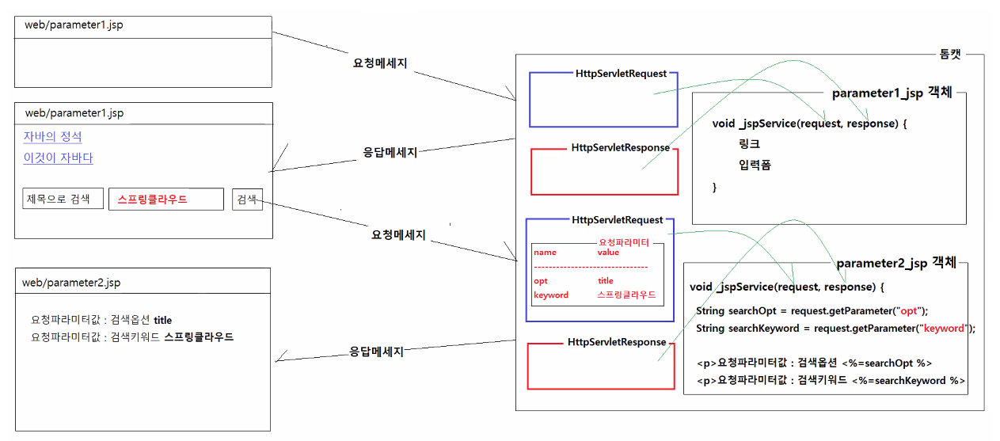
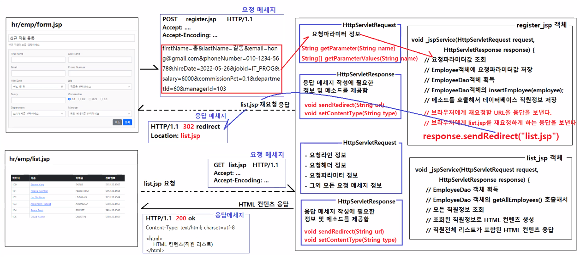

# 0527

- [0527](#0527)
- [JSP](#jsp)
	- [요청파라미터 전달하기](#요청파라미터-전달하기)
	- [클라이언트가 서버로 보내는 요청의 구분](#클라이언트가-서버로-보내는-요청의-구분)
		- [정보(페이지)를 조회하는 요청](#정보페이지를-조회하는-요청)
		- [정보를 변경하는 요청](#정보를-변경하는-요청)
	- [실습](#실습)
- [인사정보시스템 앱](#인사정보시스템-앱)
	- [직원신규등록 기능](#직원신규등록-기능)
	- [HTTP의 요청방식](#http의-요청방식)
		- [RESTful API](#restful-api)
	- [부서정보 기능](#부서정보-기능)

<small><i><a href='http://ecotrust-canada.github.io/markdown-toc/'>Table of contents generated with markdown-toc</a></i></small>


# JSP
## 요청파라미터 전달하기
* 요청파라미터
  * 클라이언트(웹브라우저)가 웹애플리케이션(JSP)에게 전달하는 값	

* GET 방식으로 요청파라미터 전달하기
  * 요청URL뒤에 요청파라미터가 쿼리스트링의 형태로 전달되는 것이다.

    * 쿼리스트링(Query string)으로 전달하기
      * 쿼리스트링 : 요청url에 ?을 붙이고 name=value&name=value&name=value의 형식으로 작성된 것

		* `<a href="emp/detail.jsp?id=100">Steven King</a>`
		* `<a href="emp/detail.jsp?id=101">Neena</a>`

        * 서버로 전송되는 요청 메세지
          ```	
    	  GET  emp/detail.jsp?id=100  HTTP/1.1
    	  Accept: ....
    	  Accept-Encoding: ....
    	  Accept-Language: ....

    	  ```

		* `<a href="board/list.jsp?category=car&page=1&rows=20&sort=date">자동차 게시판</a>`
		* `<a href="board/list.jsp?category=game&page=1&rows=20&sort=date">게임 게시판</a>`

		* 서버로 전송되는 요청 메세지
    	  ```
		  GET  board/list.jsp?category=game&page=1&rows=20&sort=date  HTTP/1.1
		  Accept: ....
	      Accept-Encoding: ....
	      Accept-Language: ....
	      
		  ```
	
    * `<form>`을 GET방식으로 제출하기
      * form의 method속성을 get으로 지정하면 폼입력값을 GET방식으로 전달할 수 있다.
      * submit 버튼을 클릭하면 폼입력값으로 쿼리스트링을 작성해서 action에 지정된 요청url에 뒤에 붙여서 서버로 보낸다.
        ```html
    	<form method="get" action="search.jsp">
    		<select name="opt">
    			<option value="title"> 제목으로 검색</option>
    			<option value="writer"> 작성자으로 검색</option>
    			<option value="content"> 내용으로 검색</option>
    		</select>
    		<input type="text" name="keyword" placeholder="검색어를 입력하세요" />
    		<button type="submit">검색</a>
    	</form>
		```

    	* 서버로 전송되는 요청 메세지
          ```
		  GET  search.jsp?opt=title&keyword=자바  HTTP/1.1
    	  Accept: ....
    	  Accept-Encoding: ....
    	  Accept-Language: ....
    	  
		  ```
    	

* POST 방식으로 요청파라미터 전달하기
  * 요청 메세지의 바디부에 쿼리스트링의 형태로 포함돼서 전달된다.
    
	* `<form>`을 POST방식으로 제출하기
      * form의 method속성을 post으로 지정하면 폼입력값을 POST방식으로 전달할 수 있다.
      * submit 버튼을 클릭하면 폼입력값으로 쿼리스트링을 작성해서 요청메세지의 바디부에 포함시켜 서버로 보낸다.
        ```html
		<form method="post" action="register.jsp">
			<input type="text" name="id" placeholder="아이디를 입력하세요"
			<input type="text" name="name" placeholder="이름을 입력하세요" />
			<input type="password" name="password" placeholder="비밀번호을 입력하세요" />
			<input type="text" name="email" placeholder="이메일을 입력하세요" />
			<input type="text" name="tel" placeholder="전화번호를 입력하세요" />
			<button type="submit">회원가입</a>
		</form>
		```
		
		* 서버로 전송되는 요청 메세지
    	  ```
		  POST  register.jsp  HTTP/1.1
		  Accept: ....
		  Accept-Encoding: ....
		  Accept-Language: ....
		  
		  id=hong&name=홍길동&password=zxcv1234
		  &email=hong@gmail.com&tel=010-1234-5678
	      ```

## 클라이언트가 서버로 보내는 요청의 구분
### 정보(페이지)를 조회하는 요청
* 리스트 페이지를 요청하는 것(직원 목록, 부서 목록, 영화 목록, 최신 영화 목록, 최신 상품 목록, 주문내역, 장바구니 목록)
* 상세 페이지를 요청하는 것(직원 상세정보, 부서 상세정보, 영화 상세정보, 상품 상세정보, 주문 상세정보)
* 입력폼 페이지를 요청하는 것
* 수정폼 페이지를 요청하는 것

* JSP 페이지의 구성
	```
	정보조회에 필요한 요청파라미터 조회 (요청파라미터가 필요없는 경우도 있음)  
	클라이언트에게 제공할 정보 조회(정보 조회에 요청파라미터가 필요한 경우도 있고, 필요없는 경우도 있음) 

	조회된 정보로 HTML 컨텐츠를 생성
	* 생성된 HTML 컨텐츠가 웹브라우저에 응답으로 제공된다.
	```
* 예시
  * `hr/home.jsp, hr/emp/list.jsp, hr/emp/detail.jsp, hr/emp/form.jsp`

* 웹 애플리케이션(JSP)이 실행결과로 HTML 컨텐츠가 웹브라우저에게 응답으로 제공된다.
* 정보를 조회하는 요청은 대부분 GET 방식의 요청이다.
 
### 정보를 변경하는 요청
* 새 정보를 저장하는 요청 (직원정보 등록, 주문정보 등록, 영화정보 등록, 상품정보 등록, 회원정보 등록)
* 기존 정보를 변경하는 요청 (직원정보 변경, 주문 취소, 영화상영일자 변경, 상품가격 변경, 비밀번호 변경)
* 기존 정보를 삭제하는 요청 (직원정보 삭제, 영화정보 삭제, 댓글 삭제, 게시글 삭제)

* JSP 페이지의 구성
	```
	정보변경에 필요한 요청파라미터 조회 (특별한 경우가 아니라면 요청파라미터정보 대부분 필요하다.)
	전달받은 요청파라미터 정보로 저장/수정/변경 작업을 수행
	* 클라이언트에게 제공할 정보를 조회하지 않았음.
	* 클라이언트에게 HTML 컨텐츠를 응답으로 제공할 수 없음.
	재요청할 URL을 응답으로 보낸다.
	* 저장/변경/삭제 작업이 완료된 후 변경된 내용을 조회할 수 있는 페이지를 재요청하는 URL을 응답으로 보낸다.
	```
* 정보를 변경하는 요청은 대부분 POST 방식의 요청이다.
* 클라이언트에서 서버로 보내는 데이터의 양이 많은 저장/수정 작업은 POST 방식의 요청이다.
* 클라이언트에서 서버로 보내는 데이터의 양이 적은 삭제 작업은 GET 방식의 요청이다.

## 실습
request.jsp
```jsp
<%@ page language="java" contentType="text/html; charset=UTF-8"
    pageEncoding="UTF-8"%>
<!DOCTYPE html>
<html>
<head>
<meta charset="UTF-8">
<meta name="viewport" content="width=device-width, initial-scale=1">
<title>Bootstrap demo</title>
<link href="https://cdn.jsdelivr.net/npm/bootstrap@5.2.0-beta1/dist/css/bootstrap.min.css" rel="stylesheet">
</head>
<body>
<div class="container">
	<h1>HttpServletRequest JSP 내장객체</h1>   
	
	<%
		// 요청메세지의 요청라인 정보 조회하기
		String method = request.getMethod();
		String uri = request.getRequestURI();
		String protocol = request.getProtocol();
	%>
	<h3>요청 메세지의 요청라인 정보</h3>
	<dl>
		<dt>요청방식: </dt><dd><%=method %></dd>
		<dt>요청URL: </dt><dd><%=uri %></dd>
		<dt>프로토콜: </dt><dd><%=protocol %></dd>
	</dl>
	
	<%
		// 요청메세지의 요청헤더 정보 조회하기
		String accept = request.getHeader("Accept");
		String acceptEncoding = request.getHeader("Accept-encoding");
		String acceptLanguage = request.getHeader("Accept-language");
		String userAgent = request.getHeader("User-Agent");
	%>
	
	<h3>요청 메세지의 요청헤더 정보 조회하기</h3>
	<dl>
		<dt>브라우저가 지원하는 컨텐츠 타입: </dt><dd><%=accept %></dd>
		<dt>브라우저가 지원하는 압축방식: </dt><dd><%=acceptEncoding %></dd>
		<dt>브라우저가 지원하는 언어: </dt><dd><%=acceptLanguage %></dd>
		<dt>브라우저 정보: </dt><dd><%=userAgent %></dd>
	</dl>
	
	<%
		String ipAddress = request.getRemoteAddr();
	%>
	<h3>클라이언트의 ip주소 조회하기</h3>
	<dl>
		<dt>ip주소: </dt><dd><%=ipAddress %></dd>
	</dl>
</div>
<script src="https://cdn.jsdelivr.net/npm/bootstrap@5.2.0-beta1/dist/js/bootstrap.bundle.min.js"></script>
</body>
</html>
```

parameter1.jsp
```jsp
<%@ page language="java" contentType="text/html; charset=UTF-8"
    pageEncoding="UTF-8"%>
<!DOCTYPE html>
<html>
<head>
<meta charset="UTF-8">
<meta name="viewport" content="width=device-width, initial-scale=1">
<title>Bootstrap demo</title>
<link href="https://cdn.jsdelivr.net/npm/bootstrap@5.2.0-beta1/dist/css/bootstrap.min.css" rel="stylesheet">
</head>
<body>
<div class="container">
	<h1>GET과 POST 방식으로 요청파라미터를 전달하기</h1>
	
	<h3>GET방식으로 요청파라미터 전달하기</h3>
	
	<h5>링크를 클릭했을 때 요청파라미터 전달하기</h5>
	<ul>
		<li><a href="parameter2.jsp?bookId=1234">자바의 정석</a></li>
		<li><a href="parameter2.jsp?bookId=5678">이것이 자바다</a></li>
		<li><a href="parameter2.jsp?bookId=9876">혼자서 공부하는 자바</a></li>
	</ul>
	
	<h5>제출버튼을 클릭했을 때 요청파라미터 전달하기</h5>
	<form method="get" action="parameter2.jsp">
		<select name="opt">
			<option value="title"> 제목으로 검색</option>
			<option value="writer"> 작성자로 검색</option>
			<option value="content"> 내용으로 검색</option>
		</select>
		<input type="text" name="keyword" placeholder="검색어를 입력하세요">
		<button type="submit">검색</button>
	</form>
	
	<h3>POST 방식으로 요청파라미터 전달하기</h3>
	<form class="border bg-light p-3 mb-5 w-50" method="post" action="parameter2.jsp">
		<div class="mb-3">
			<label class="form-label">이름</label>
			<input type="text" class="form-control" name="username" />
		</div>
		<div class="mb-3">
			<label class="form-label">아이디</label>
			<input type="text" class="form-control" name="id" />
		</div>
		<div class="mb-3">
			<label class="form-label">비밀번호</label>
			<input type="password" class="form-control" name="pwd" />
		</div>
		<div class="mb-3">
			<label class="form-label">이메일</label>
			<input type="text" class="form-control" name="email" />
		</div>
		<div class="mb-3">
         <label class="form-label">보유기술</label>
         <div>
            <div class="form-check form-check-inline">
                 <input class="form-check-input" type="checkbox" name="skill" value="java">
                 <label class="form-check-label">자바</label>
            </div>
            <div class="form-check form-check-inline">
                 <input class="form-check-input" type="checkbox" name="skill" value="python">
                 <label class="form-check-label">파이썬</label>
            </div>
            <div class="form-check form-check-inline">
                 <input class="form-check-input" type="checkbox" name="skill" value="javascript">
                 <label class="form-check-label">자바스크립트</label>
            </div>
            <div class="form-check form-check-inline">
                 <input class="form-check-input" type="checkbox" name="skill" value="c">
                 <label class="form-check-label">C언어</label>
            </div>
         </div>
      	</div>		
		<div>
			<button type="submit" class="btn btn-primary">가입</button>
		</div>
	</form>
	
</div>
<script src="https://cdn.jsdelivr.net/npm/bootstrap@5.2.0-beta1/dist/js/bootstrap.bundle.min.js"></script>
</body>
</html>
```

parameter2.jsp
```jsp
<%@page import="java.util.StringJoiner"%>
<%@ page language="java" contentType="text/html; charset=UTF-8"
    pageEncoding="UTF-8"%>
<!DOCTYPE html>
<html>
<head>
<meta charset="UTF-8">
<meta name="viewport" content="width=device-width, initial-scale=1">
<title>Bootstrap demo</title>
<link href="https://cdn.jsdelivr.net/npm/bootstrap@5.2.0-beta1/dist/css/bootstrap.min.css" rel="stylesheet">
</head>
<body>
<div class="container">
	<h1>GET과 POST 방식으로 전달받은 요청파라미터 조회하기</h1>
	
	<h3>GET방식으로 전달된 요청파라미터 조회하기</h3>
	<%
		// HttpServletRequest의 String getParameter(String name)
		//  - 요청파라미터값을 조회한다.
		//  - 반환값은 항상 String 값이다.		
		
		// 요청URL : web/parameter2.jsp?bookId=1234
		// 쿼리스트링 : bookId=1234
		// 요청파라미터
		//		이름		값
		//		bookId		1234
		String bookId = request.getParameter("bookId");
	
		// 요청URL : web/parameter2.jsp?opt=title&keyword=자바
		// 쿼리스트링 : opt=title&keyword=자바
		// 요청파라미터
		// 		이름		값
		//		opt			title
		//		keyword		자바
		String searchOption = request.getParameter("opt");
		String searchKeyword = request.getParameter("keyword");
		
	%>
	<p>클라이언트가 전달한 요청파라미터값 : 책아이디 <%=bookId %></p>
	<p>클라이언트가 전달한 요청파라미터값 : 검색옵션 <%=searchOption %></p>
	<p>클라이언트가 전달한 요청파라미터값 : 검색키워드 <%=searchKeyword %></p>
	
	<h3>POST 방식으로 전달된 파라미터 값 조회하기</h3>
	<!-- 
		POST 방식으로 파라미터가 전달될 때 요청메세지의 형태
		-----------------------------------------------------------------
		| POST  parameter2.jsp  HTTP/1.1								|
		| Accept=text/html,application/xhtml+xml,application/xml;		|
		| Accept-Encoding=gzip, deflate, br								|
		| Accept-Language=ko,en;q=0.9,en-US;q=0.8						|
		| 																|
		| name=홍길동&id=hong&pwd=zxcv1234&email=hong@gmail.com			|
		-----------------------------------------------------------------	
	 -->
	 <%
	 	// 요청 URL : parameter2.jsp
	 	// formData : name=홍길동&id=hong&pwd=zxcv1234&email=hong@gmail.com
	 	// 요청파라미터
	 	//		name		value
	 	//		username	홍길동
	 	//		id			hong
	 	// 		pwd			zxcv1234
	 	// 		email		hong@gmail.com
	 	
	 	String username = request.getParameter("username");
	 	String userId = request.getParameter("id");
	 	String userPassword = request.getParameter("pwd");
	 	String userEmail = request.getParameter("email");
	 	String[] skills = request.getParameterValues("skill");
	 	
	 	StringJoiner joiner = new StringJoiner(",");
	 	for (String skill : skills) {
	 		joiner.add(skill);
	 	}
	 %>
	 <p>회원가입 정보를 확인해보세요</p>
	 <dl>
	 	<dt>이름</dt><dd><%=username %></dd>
	 	<dt>아이디</dt><dd><%=userId %></dd>
	 	<dt>비밀번호</dt><dd><%=userPassword %></dd>
	 	<dt>이메일</dt><dd><%=userEmail %></dd>
	 	<dt>보유기술</dt><dd><%=joiner.toString() %></dd>
	 </dl>
	
</div>
<script src="https://cdn.jsdelivr.net/npm/bootstrap@5.2.0-beta1/dist/js/bootstrap.bundle.min.js"></script>
</body>
</html>
```
* 파라미터1,이 파라미터2를 요청하고 응답받는 과정
  * 


# 인사정보시스템 앱
## 직원신규등록 기능
form.jsp
```jsp
<%@page import="vo.Department"%>
<%@page import="dao.DepartmentDao"%>
<%@page import="vo.Job"%>
<%@page import="dao.JobDao"%>
<%@page import="vo.Employee"%>
<%@page import="java.util.List"%>
<%@page import="dao.EmployeeDao"%>
<%@ page language="java" contentType="text/html; charset=UTF-8"
	pageEncoding="UTF-8"%>
<!DOCTYPE html>
<html>
<head>
<meta charset="UTF-8">
<meta name="viewport" content="width=device-width, initial-scale=1">
<title>인사정보 시스템</title>
<link href="https://cdn.jsdelivr.net/npm/bootstrap@5.2.0-beta1/dist/css/bootstrap.min.css" rel="stylesheet">
</head>
<body>
<nav class="navbar navbar-expand-lg navbar navbar-dark bg-dark mb-3 ">
	<div class="container">
		<a class="navbar-brand" href="/hr/home.jsp">인사정보 시스템</a>
		<button class="navbar-toggler" type="button"
			data-bs-toggle="collapse" data-bs-target="#navbarNav"
			aria-controls="navbarNav" aria-expanded="false"
			aria-label="Toggle navigation">
			<span class="navbar-toggler-icon"></span>
		</button>
		<div class="collapse navbar-collapse" id="navbarNav">
			<ul class="navbar-nav">
				<li class="nav-item">
					<a class="nav-link" aria-current="page" href="/hr/home.jsp">홈</a>
				</li>
				<li class="nav-item">
					<a class="nav-link" aria-current="page" href="/hr/dept/list.jsp">부서정보</a>
				</li>
				<li class="nav-item">
					<a class="nav-link" aria-current="page" href="/hr/job/list.jsp">직종정보</a>
				</li>
				<li class="nav-item">
					<a class="nav-link active" aria-current="page" href="/hr/emp/list.jsp">직원정보</a>
				</li>
			</ul>
		</div>
	</div>
</nav>
<div class="container mb-5">
	<div class="row">
		<div class="col">
			<h1 class="fs-4 border p-2">신규 직원 등록</h1>
		</div>
	</div>
	<div class="row">
		<div class="col">
		<%
			// 모든 직종정보를 조회하기
			JobDao jobDao = JobDao.getInstance();
			List<Job> jobList = jobDao.getAllJobs();
			
			// 모든 부서정보 조회하기
			DepartmentDao departmentDao = DepartmentDao.getInstance();
			List<Department> departmentList = departmentDao.getAllDepartments();
			
			// 모든 매니저정보 조회하기
			EmployeeDao employeeDao = EmployeeDao.getInstance();
			List<Employee> managerList = employeeDao.getAllManagers();
		%>
			<p>신규 직원정보를 입력하세요</p>
			<form class="border bg-light p-3" method="post" action="register.jsp">
				<div class="row g-3">
					<div class="col-md-6">
						<label class="form-label">First Name</label>
						<input type="text" class="form-control" name="firstName">
					</div>
					<div class="col-md-6">
						<label class="form-label">Last Name</label>
						<input type="text" class="form-control" name="lastName">
					</div>
					<div class="col-md-6">
						<label class="form-label">Email</label>
						<input type="text" class="form-control" name="email">
					</div>
					<div class="col-md-6">
						<label class="form-label">Phone Number</label>
						<input type="text" class="form-control" name="phoneNumber">
					</div>
					<div class="col-md-6">
						<label class="form-label">Hire Date</label>
						<input type="date" class="form-control" name="hireDate">
					</div>
					<div class="col-md-6">
						<label class="form-label">Job</label>
						<select class="form-select" name="jobId" >
							<option value="" selected="selected" disabled="disabled"> 직종을 선택하세요</option>
						<%
							for (Job job : jobList) {
						%>
								<option value="<%=job.getId() %>"> <%=job.getTitle() %> (<%=job.getMinSalary() %> ~ <%=job.getMaxSalary() %>)</option>
						<%
							}
						%>
						</select>
					</div>
					<div class="col-md-6">
						<label class="form-label">Salary</label>
						<input type="number" class="form-control" name="salary">
					</div>
					<div class="col-md-6">
						<label class="form-label">Commission</label>
						<div>
							<div class="form-check form-check-inline">
			  					<input class="form-check-input" type="radio" name="commissionPct" value="0.1" checked>
			  					<label class="form-check-label">0.1</label>
							</div>
							<div class="form-check form-check-inline">
			  					<input class="form-check-input" type="radio" name="commissionPct" value="0.2" >
			  					<label class="form-check-label">0.2</label>
							</div>
							<div class="form-check form-check-inline">
			  					<input class="form-check-input" type="radio" name="commissionPct" value="0.25" >
			  					<label class="form-check-label">0.25</label>
							</div>
							<div class="form-check form-check-inline">
			  					<input class="form-check-input" type="radio" name="commissionPct" value="0.3" >
			  					<label class="form-check-label">0.3</label>
							</div>
							<div class="form-check form-check-inline">
			  					<input class="form-check-input" type="radio" name="commissionPct" value="0.35" >
			  					<label class="form-check-label">0.35</label>
							</div>
							<div class="form-check form-check-inline">
			  					<input class="form-check-input" type="radio" name="commissionPct" value="0.4" >
			  					<label class="form-check-label">0.4</label>
							</div>
						</div>
					</div>
					<div class="col-md-6">
						<label class="form-label">Department</label>
						<select class="form-select" name="departmentId" >
							<option value="" selected="selected" disabled="disabled"> 소속부서를 선택하세요</option>
						<%
							for (Department dept : departmentList) {
						%>
								<option value="<%=dept.getId() %>"> <%=dept.getName() %> (<%=dept.getId() %>)</option>
						<%
							}
						%>
						</select>
					</div>
					<div class="col-md-6">
						<label class="form-label">Manager</label>
						<select class="form-select" name="managerId" >
							<option value="" selected="selected" disabled="disabled"> 담당 매니저를 선택하세요</option>
						<%
							for (Employee mgr : managerList) {
						%>
								<option value="<%=mgr.getId() %>"> <%=mgr.getFirstName() %> <%=mgr.getLastName() %> (<%=mgr.getDepartmentId() %>)</option>
						<%
							}
						%>
						</select>
					</div>
					<div class="text-end">
						<a href="list.jsp" class="btn btn-secondary">취소</a>
						<button type="submit" class="btn btn-primary">등록</button>
					</div>
				</div>
			</form>
		</div>
	</div>
</div>
<script src="https://cdn.jsdelivr.net/npm/bootstrap@5.2.0-beta1/dist/js/bootstrap.bundle.min.js"></script>
</body>
</html>
```

list.jsp
```jsp
<%@page import="vo.Employee"%>
<%@page import="java.util.List"%>
<%@page import="dao.EmployeeDao"%>
<%@ page language="java" contentType="text/html; charset=UTF-8"
	pageEncoding="UTF-8"%>
<!DOCTYPE html>
<html>
<head>
<meta charset="UTF-8">
<meta name="viewport" content="width=device-width, initial-scale=1">
<title>인사정보 시스템</title>
<link href="https://cdn.jsdelivr.net/npm/bootstrap@5.2.0-beta1/dist/css/bootstrap.min.css" rel="stylesheet">
</head>
<body>
<nav class="navbar navbar-expand-lg navbar navbar-dark bg-dark mb-3 ">
	<div class="container">
		<a class="navbar-brand" href="/hr/home.jsp">인사정보 시스템</a>
		<button class="navbar-toggler" type="button"
			data-bs-toggle="collapse" data-bs-target="#navbarNav"
			aria-controls="navbarNav" aria-expanded="false"
			aria-label="Toggle navigation">
			<span class="navbar-toggler-icon"></span>
		</button>
		<div class="collapse navbar-collapse" id="navbarNav">
			<ul class="navbar-nav">
				<li class="nav-item">
					<a class="nav-link" aria-current="page" href="/hr/home.jsp">홈</a>
				</li>
				<li class="nav-item">
					<a class="nav-link" aria-current="page" href="/hr/dept/list.jsp">부서정보</a>
				</li>
				<li class="nav-item">
					<a class="nav-link" aria-current="page" href="/hr/job/list.jsp">직종정보</a>
				</li>
				<li class="nav-item">
					<a class="nav-link active" aria-current="page" href="/hr/emp/list.jsp">직원정보</a>
				</li>
			</ul>
		</div>
	</div>
</nav>
<div class="container">
	<div class="row">
		<div class="col">
			<h1 class="fs-4 border p-2">전체 직원 목록</h1>
		</div>
	</div>
	<div class="row">
		<div class="col">
			<div class="mb-3 text-end">
				<a href="form.jsp" class="btn btn-outline-primary">신규 직원 등록</a>
			</div>
			<%
				EmployeeDao employeeDao = EmployeeDao.getInstance();
				List<Employee> employeeList = employeeDao.getAllEmployees();
			%>
			
			<table class="table table-bordered">
				<thead>
					<tr class="table-dark">
						<th>아이디</th>
						<th>이름</th>
						<th>이메일</th>
						<th>전화번호</th>
						<th>직종</th>
						<th>입사일</th>
					</tr>
				</thead>
				<tbody>
			<%
				for (Employee emp : employeeList) {
			%>
					<tr>
						<td><%=emp.getId() %></td>
						<td><a href="detail.jsp?id=<%=emp.getId() %>"><%=emp.getFirstName() %> <%=emp.getLastName() %></a></td>
						<td><%=emp.getEmail() %></td>
						<td><%=emp.getPhoneNumber() %></td>
						<td><%=emp.getJobId() %></td>
						<td><%=emp.getHireDate() %></td>
					</tr>
			<%
				}
			%>
				</tbody>
			</table>
		</div>
	</div>
</div>
<script src="https://cdn.jsdelivr.net/npm/bootstrap@5.2.0-beta1/dist/js/bootstrap.bundle.min.js"></script>
</body>
</html>
```

register.jsp
```jsp
<%@page import="dao.EmployeeDao"%>
<%@page import="vo.Employee"%>
<%@page import="util.StringUtils"%>
<%@page import="java.util.Date"%>
<%@ page language="java" contentType="text/html; charset=UTF-8"
    pageEncoding="UTF-8"%>
<%
	/*
		POST 방식으로 파라미터가 전달될 때 요청메세지의 형태
		-----------------------------------------------------------------
		| POST  register.jsp  HTTP/1.1								    |
		| Accept=text/html,application/xhtml+xml,application/xml;		|
		| Accept-Encoding=gzip, deflate, br								|
		| Accept-Language=ko,en;q=0.9,en-US;q=0.8						|
		| 																|
		| firstName=홍&lastName길동&email=hong@gmail.com    			|
		| &phoneNumber=010-1234-5678&hireDate=2022-05-25&jobId=IT_PROG  |
		| &salary=6000&commissionPct=0.2&departmentId=60&managerId=103  |
		-----------------------------------------------------------------
	*/
	
	// 입력폼에서 POST 방식으로 전달한 요청파라미터값 조회하기
	String firstName = request.getParameter("firstName");
	String lastName = request.getParameter("lastName");
	String email = request.getParameter("email");
	String phoneNumber = request.getParameter("phoneNumber");
	Date hireDate = StringUtils.stringToDate(request.getParameter("hireDate"));
	String jobId = request.getParameter("jobId");
	int salary = Integer.parseInt(request.getParameter("salary"));
	double commissionPct = Double.parseDouble(request.getParameter("commissionPct"));
	int departmentId = Integer.parseInt(request.getParameter("departmentId"));
	int managerId = Integer.parseInt(request.getParameter("managerId"));
	
	// 조회된 요청파라미터 값을 Employee객체에 저장하기
	Employee employee = new Employee();
	employee.setFirstName(firstName);
	employee.setLastName(lastName);
	employee.setEmail(email);
	employee.setPhoneNumber(phoneNumber);
	employee.setHireDate(hireDate);
	employee.setJobId(jobId);
	employee.setSalary(salary);
	employee.setCommissionPct(commissionPct);
	employee.setDepartmentId(departmentId);
	employee.setManagerId(managerId);
	
	// EmployeeDao객체의 insertEmployee(Employee employee)를 실행해서 신규 직원정보 등록시키기
	EmployeeDao employeeDao = EmployeeDao.getInstance();
	employeeDao.insertEmployee(employee);
	
	// 브라우저에게 List.jsp를 재요청하게하는 요청을 보낸다.
	response.sendRedirect("list.jsp");
%>
```

StringUtil.java
```java
package util;

import java.text.ParseException;
import java.text.SimpleDateFormat;
import java.util.Date;

public class StringUtils {

	private static SimpleDateFormat YYYY_MM_DD = new SimpleDateFormat("yyyy-MM-dd");
	
	public static Date stringToDate(String str) {
		if (str == null) {
			return null;
		}

		try {
			return YYYY_MM_DD.parse(str);
		} catch (ParseException e) {
			return null;
		}
	}
}
```

EmployeeDao.java
```java
package dao;

import java.sql.Connection;
import java.sql.PreparedStatement;
import java.sql.ResultSet;
import java.sql.SQLException;
import java.util.ArrayList;
import java.util.List;

import dto.EmployeeDetailDto;
import util.ConnectionUtil;
import vo.Employee;

public class EmployeeDao {

	private static EmployeeDao instance = new EmployeeDao();
	private EmployeeDao() {}
	public static EmployeeDao getInstance() {
		return instance;
	}
	
	public void insertEmployee(Employee employee) throws SQLException {
		String sql = "insert into employees "
				   + "values(employees_seq.nextval, ?, ?, ?, ?, ?, ?, ?, ?, ?, ?)";
		
		Connection connection = ConnectionUtil.getConnection();
		PreparedStatement pstmt = connection.prepareStatement(sql);
		pstmt.setString(1, employee.getFirstName());
		pstmt.setString(2, employee.getLastName());
		pstmt.setString(3, employee.getEmail());
		pstmt.setString(4, employee.getPhoneNumber());
		pstmt.setDate(5, new java.sql.Date(employee.getHireDate().getTime()));	// java.sql.Date(long time)
		pstmt.setString(6, employee.getJobId());
		pstmt.setInt(7, employee.getSalary());
		pstmt.setDouble(8, employee.getCommissionPct());
		pstmt.setInt(9, employee.getManagerId());
		pstmt.setInt(10, employee.getDepartmentId());
		
		pstmt.executeUpdate();
		
		pstmt.close();
		connection.close();		
	}
	
	public List<Employee> getAllManagers() throws SQLException {
		String sql = "SELECT DISTINCT M.EMPLOYEE_ID, M.FIRST_NAME, M.LAST_NAME, M.DEPARTMENT_ID "
				   + "FROM EMPLOYEES E, EMPLOYEES M "
				   + "WHERE E.MANAGER_ID = M.EMPLOYEE_ID "
				   + "ORDER BY M.EMPLOYEE_ID ";
		
		List<Employee> managerList = new ArrayList<>();
		
		Connection connection = ConnectionUtil.getConnection();
		PreparedStatement pstmt = connection.prepareStatement(sql);
		ResultSet rs = pstmt.executeQuery();
		while (rs.next()) {
			Employee manager = new Employee();
			
			manager.setId(rs.getInt("employee_id"));
			manager.setFirstName(rs.getString("first_name"));
			manager.setLastName(rs.getString("last_name"));
			manager.setDepartmentId(rs.getInt("department_id"));
			
			managerList.add(manager);
		}
		
		rs.close();
		pstmt.close();
		connection.close();
		
		return managerList;
	}
	
	public List<Employee> getAllEmployees() throws SQLException {
		String sql = "select * "
				   + "from employees "
				   + "order by employee_id desc ";
		
		List<Employee> employeeList = new ArrayList<>();
		
		Connection connection = ConnectionUtil.getConnection();
		PreparedStatement pstmt = connection.prepareStatement(sql);
		ResultSet rs = pstmt.executeQuery();
		while (rs.next()) {
			Employee employee = new Employee();
			
			employee.setId(rs.getInt("employee_id"));
			employee.setFirstName(rs.getString("first_name"));
			employee.setLastName(rs.getString("last_name"));
			employee.setEmail(rs.getString("email"));
			employee.setPhoneNumber(rs.getString("phone_number"));
			employee.setHireDate(rs.getDate("hire_date"));
			employee.setJobId(rs.getString("job_id"));
			employee.setSalary(rs.getInt("salary"));
			employee.setCommissionPct(rs.getDouble("commission_pct"));
			employee.setManagerId(rs.getInt("manager_id"));
			employee.setDepartmentId(rs.getInt("department_id"));
			
			employeeList.add(employee);
		}
		
		rs.close();
		pstmt.close();
		connection.close();
		
		return employeeList;
	}

	public Employee getEmployeeById(int id) throws SQLException {
		String sql = "select * "
				+ "from employees "
				+ "where employee_id = ? ";
		
		Employee employee = null;
		
		Connection connection = ConnectionUtil.getConnection();
		PreparedStatement pstmt = connection.prepareStatement(sql);
		ResultSet rs = pstmt.executeQuery();
		while (rs.next()) {
			employee = new Employee();
			
			employee.setId(rs.getInt("employee_id"));
			employee.setFirstName(rs.getString("first_name"));
			employee.setLastName(rs.getString("last_name"));
			employee.setEmail(rs.getString("email"));
			employee.setPhoneNumber(rs.getString("phone_number"));
			employee.setHireDate(rs.getDate("hire_date"));
			employee.setJobId(rs.getString("job_id"));
			employee.setSalary(rs.getInt("salary"));
			employee.setCommissionPct(rs.getDouble("commission_pct"));
			employee.setManagerId(rs.getInt("manager_id"));
			employee.setDepartmentId(rs.getInt("department_id"));
			
		}
		
		rs.close();
		pstmt.close();
		connection.close();
		
		return employee;
	}
	
	public EmployeeDetailDto getEmployeeDetailDtoById(int id) throws SQLException {
		String sql = "select "
				+ "		A.employee_id 	emp_id, "
				+ "		A.first_name	emp_first_name, "
				+ "		A.last_name		emp_last_name, "
				+ "		A.email			emp_email, "
				+ "		A.phone_number	emp_phone_number, "
				+ "		A.hire_date		emp_hire_date, "
				+ "		A.job_id		emp_job_id, "
				+ "		B.job_title		emp_job_title, "
				+ "		A.salary		emp_salary, "
				+ "		A.commission_pct	emp_commission_pct, "
				+ "		A.manager_id	mgr_id, "
				+ "		C.first_name	mgr_first_name, "
				+ "		C.last_name		mgr_last_name, "
				+ "		A.department_id		emp_department_id, "
				+ "		D.department_name	emp_department_name "
				+ "from employees A, jobs B, employees C, departments D "
				+ "where A.job_id = B.job_id "
				+ "and A.manager_id = C.employee_id(+) "
				+ "and A.department_id = D.department_id(+) "
				+ "and A.employee_id = ? ";
		
		EmployeeDetailDto employee = null;
		
		Connection connection = ConnectionUtil.getConnection();
		PreparedStatement pstmt = connection.prepareStatement(sql);
		pstmt.setInt(1, id);
		ResultSet rs = pstmt.executeQuery();
		while (rs.next()) {
			employee = new EmployeeDetailDto();
			
			employee.setId(rs.getInt("emp_id"));
			employee.setFirstName(rs.getString("emp_first_name"));
			employee.setLastName(rs.getString("emp_last_name"));
			employee.setEmail(rs.getString("emp_email"));
			employee.setPhoneNumber(rs.getString("emp_phone_number"));
			employee.setHireDate(rs.getDate("emp_hire_date"));
			employee.setJobId(rs.getString("emp_job_id"));
			employee.setJobTitle(rs.getString("emp_job_title"));
			employee.setSalary(rs.getInt("emp_salary"));
			employee.setCommissionPct(rs.getDouble("emp_commission_pct"));
			employee.setManagerId(rs.getInt("mgr_id"));
			employee.setManagerFirstName(rs.getString("mgr_first_name"));
			employee.setManagerLastName(rs.getString("mgr_last_name"));
			employee.setDepartmentId(rs.getInt("emp_department_id"));
			employee.setDepartmentName(rs.getString("emp_department_name"));
			
		}
		
		rs.close();
		pstmt.close();
		connection.close();
		
		return employee;
	}
}
```

* form.jsp 에 입력 후 등록 > list.jsp 컨텐츠 작동과정
  * 


## HTTP의 요청방식
* GET - 조회
* POST - 추가
* PUT - 변경
* DELETE - 삭제

### RESTful API
* HTTP의 get, post, put, delete 요청방식을 전부 사용해서 서버로 요청을 보낸다.
* RESTful API에서는 요청방식이 어떤 작업을 수행할지 나타낸다.
* 클라이언트와 서버가 데이터(XML, JSON)만 주고 받는다.(서버로부터 HTML 컨텐츠를 제공받지 않는다.)
* 서버는 데이터만 제공하면 되기 때문에, 그 데이터가 어떻게 표현되고 활용될지 책임질 필요가 없다.
* 클라이언트 데이터를 제공받아서 다양한 장치에서 다양한 형태로 데이터를 표현할 수 있다.

|요청방식|		요청URL|			서버로 보내는 데이터(요청메세지의 바디부에 포함되어 전달되는 데이터)|
|-------|-------------------|-------------|
GET		|	hr/employees    |	없음
GET		|	hr/employees/100|	없음
POST	|	hr/employees    |	직원정보
PUT		|	hr/employees/100|	직원정보
DELETE	|	hr/employees/100|	없음


## 부서정보 기능
dept폴더

list.jsp
```jsp
<%@page import="dto.DepartmentDto"%>
<%@page import="dao.DepartmentDao"%>
<%@page import="vo.Employee"%>
<%@page import="java.util.List"%>
<%@page import="dao.EmployeeDao"%>
<%@ page language="java" contentType="text/html; charset=UTF-8"
	pageEncoding="UTF-8"%>
<!DOCTYPE html>
<html lang="ko">
<head>
<meta charset="UTF-8">
<meta name="viewport" content="width=device-width, initial-scale=1">
<title>인사정보 시스템</title>
<link href="https://cdn.jsdelivr.net/npm/bootstrap@5.2.0-beta1/dist/css/bootstrap.min.css" rel="stylesheet">
</head>
<body>
<nav class="navbar navbar-expand-lg navbar navbar-dark bg-dark mb-3 ">
	<div class="container">
		<a class="navbar-brand" href="/hr/home.jsp">인사정보 시스템</a>
		<button class="navbar-toggler" type="button"
			data-bs-toggle="collapse" data-bs-target="#navbarNav"
			aria-controls="navbarNav" aria-expanded="false"
			aria-label="Toggle navigation">
			<span class="navbar-toggler-icon"></span>
		</button>
		<div class="collapse navbar-collapse" id="navbarNav">
			<ul class="navbar-nav">
				<li class="nav-item">
					<a class="nav-link" aria-current="page" href="/hr/home.jsp">홈</a>
				</li>
				<li class="nav-item">
					<a class="nav-link active" aria-current="page" href="/hr/dept/list.jsp">부서정보</a>
				</li>
				<li class="nav-item">
					<a class="nav-link" aria-current="page" href="/hr/job/list.jsp">직종정보</a>
				</li>
				<li class="nav-item">
					<a class="nav-link" aria-current="page" href="/hr/emp/list.jsp">직원정보</a>
				</li>
			</ul>
		</div>
	</div>
</nav>
<div class="container">
	<div class="row">
		<div class="col">
			<h1 class="fs-4 border p-2">전체 부서 목록</h1>
		</div>
	</div>
	<div class="row">
		<div class="col">
		<%
			// 전체 부서 목록 조회하기
			DepartmentDao departmentDao = DepartmentDao.getInstance();
			List<DepartmentDto> departmentList = departmentDao.getAllDepartments();
		%>
			<p>전체 부서 목록을 확인해보세요</p>
			<table class="table table-bordered">
				<thead>
					<tr class="table-dark">
						<th>아이디</th>
						<th>부서명</th>
						<th>관리자명</th>
						<th>소재지 도시명</th>
						<th>총 사원수</th>
					</tr>
				</thead>
				<tbody>
				<%
					for (DepartmentDto dept : departmentList) {
				%>
					<tr>
						<td><%=dept.getId() %></td>
						<td><a href="detail.jsp?deptId=<%=dept.getId() %>"><%=dept.getName() %></a></td>
						<td><%=dept.getManagerFirstName() %> <%=dept.getManagerLastName() %></td>
						<td><%=dept.getCity() %></td>
						<td><%=dept.getEmployeeCount() %> 명</td>
					</tr>
				<%
					}
				%>
				</tbody>
			</table>
		</div>
	</div>
</div>
<script src="https://cdn.jsdelivr.net/npm/bootstrap@5.2.0-beta1/dist/js/bootstrap.bundle.min.js"></script>
</body>
</html>
```

detail.jsp
```jsp
<%@page import="dao.DepartmentDao"%>
<%@page import="dto.DepartmentDto"%>
<%@page import="vo.Employee"%>
<%@page import="java.util.List"%>
<%@page import="dao.EmployeeDao"%>
<%@ page language="java" contentType="text/html; charset=UTF-8"
	pageEncoding="UTF-8"%>
<!DOCTYPE html>
<html lang="ko">
<head>
<meta charset="UTF-8">
<meta name="viewport" content="width=device-width, initial-scale=1">
<title>인사정보 시스템</title>
<link href="https://cdn.jsdelivr.net/npm/bootstrap@5.2.0-beta1/dist/css/bootstrap.min.css" rel="stylesheet">
</head>
<body>
<nav class="navbar navbar-expand-lg navbar navbar-dark bg-dark mb-3 ">
	<div class="container">
		<a class="navbar-brand" href="/hr/home.jsp">인사정보 시스템</a>
		<button class="navbar-toggler" type="button"
			data-bs-toggle="collapse" data-bs-target="#navbarNav"
			aria-controls="navbarNav" aria-expanded="false"
			aria-label="Toggle navigation">
			<span class="navbar-toggler-icon"></span>
		</button>
		<div class="collapse navbar-collapse" id="navbarNav">
			<ul class="navbar-nav">
				<li class="nav-item">
					<a class="nav-link" aria-current="page" href="/hr/home.jsp">홈</a>
				</li>
				<li class="nav-item">
					<a class="nav-link active" aria-current="page" href="/hr/dept/list.jsp">부서정보</a>
				</li>
				<li class="nav-item">
					<a class="nav-link" aria-current="page" href="/hr/job/list.jsp">직종정보</a>
				</li>
				<li class="nav-item">
					<a class="nav-link" aria-current="page" href="/hr/emp/list.jsp">직원정보</a>
				</li>
			</ul>
		</div>
	</div>
</nav>
<div class="container">
	<div class="row">
		<div class="col">
			<h1 class="fs-4 border p-2">부서 상세 정보</h1>
		</div>
	</div>
	<div class="row">
		<div class="col">
		<%
			// 요청URL : http://localhost/hr/dept/detail.jsp?deptId=10
			// 쿼리스트링 : deptId=10 
			// 요청파라미터
			//		name		value
			//		deptId		10
			
			// HttpServletRequest(요청객체)에서 요청파라미터 값 조회하기
			int departmentId = Integer.parseInt(request.getParameter("deptId"));
		
			// 부서 상세정보 조회
			DepartmentDao departmentDao = DepartmentDao.getInstance();
			DepartmentDto dept = departmentDao.getDepartmentById(departmentId);
			
			// 해당 부서에 소속된 사원들 조회
			EmployeeDao employeeDao = EmployeeDao.getInstance();
			List<Employee> employeeList = employeeDao.getEmployeesByDepartmentId(departmentId);
			
		%>
			<p>부서 상세정보를 확인해보세요</p>
			<table class="table table-bordered">
				<thead>
					<tr class="table-dark">
						<th>아이디</th>
						<th>부서명</th>
						<th>관리자명</th>
						<th>소재지 도시명</th>
						<th>총 사원수</th>
					</tr>
				</thead>
				<tbody>
					<tr>
						<td><%=dept.getId() %></td>
						<td><%=dept.getName() %></td>
						<td><%=dept.getManagerFirstName() %> <%=dept.getManagerLastName() %></td>
						<td><%=dept.getCity() %></td>
						<td><%=dept.getEmployeeCount() %> 명</td>
					</tr>
				</tbody>
			</table>
		</div>
	</div>
	
	<div class="row">
		<div class='col'>
			<p>부서에 소속된 사원을 확인해보세요</p>
			<table class="table table-bordered">
				<thead>
					<tr class="table-dark">
						<th>아이디</th>
						<th>이름</th>
						<th>이메일</th>
						<th>전화번호</th>
						<th>직종</th>
						<th>입사일</th>
					</tr>
				</thead>
				<tbody>
				<%
					for (Employee emp : employeeList) {
				%>
					<tr>
						<td><%=emp.getId() %></td>
						<td><a href="../emp/detail.jsp?id=<%=emp.getId() %>"><%=emp.getFirstName() %> <%=emp.getLastName() %></a></td>
						<td><%=emp.getEmail() %></td>
						<td><%=emp.getPhoneNumber() %></td>
						<td><%=emp.getJobId() %></td>
						<td><%=emp.getHireDate() %></td>
					</tr>
				<%
					}
				%>
				</tbody>
			</table>
		</div>
	</div>
	<div class="row">
		<div class="col">
			<div class="text-end">
				<a href="list.jsp" class="btn btn-primary">목록</a>
			</div>
		</div>
	</div>
</div>
<script src="https://cdn.jsdelivr.net/npm/bootstrap@5.2.0-beta1/dist/js/bootstrap.bundle.min.js"></script>
</body>
</html>
```

DepartmentDao.java
```java
package dao;

import java.sql.Connection;
import java.sql.PreparedStatement;
import java.sql.ResultSet;
import java.sql.SQLException;
import java.util.ArrayList;
import java.util.List;

import dto.DepartmentDto;
import util.ConnectionUtil;

public class DepartmentDao {

	private static DepartmentDao instance = new DepartmentDao();
	private DepartmentDao() {}
	public static DepartmentDao getInstance() {
		return instance;
	}
	
	public List<DepartmentDto> getAllDepartments() throws SQLException {
		String sql = "SELECT D.DEPARTMENT_ID, D.DEPARTMENT_NAME, D.MANAGER_ID, E.FIRST_NAME, E.LAST_NAME, D.LOCATION_ID, L.CITY, "
				+ "       (SELECT COUNT(*)  "
				+ "        FROM EMPLOYEES X "
				+ "        WHERE X.DEPARTMENT_ID = D.DEPARTMENT_ID) CNT "
				+ "FROM DEPARTMENTS D, EMPLOYEES E, LOCATIONS L "
				+ "WHERE D.MANAGER_ID = E.EMPLOYEE_ID(+) "
				+ "AND D.LOCATION_ID = L.LOCATION_ID "
				+ "ORDER BY D.DEPARTMENT_ID ASC ";
		
		List<DepartmentDto> departmentList = new ArrayList<>();
		
		Connection connection = ConnectionUtil.getConnection();
		PreparedStatement pstmt = connection.prepareStatement(sql);
		ResultSet rs = pstmt.executeQuery();
		while (rs.next()) {
			DepartmentDto department = new DepartmentDto();
			department.setId(rs.getInt("department_id"));
			department.setName(rs.getString("department_name"));
			department.setManagerId(rs.getInt("manager_id"));
			department.setManagerFirstName(rs.getString("first_name"));
			department.setManagerLastName(rs.getString("last_name"));
			department.setLocationId(rs.getInt("location_id"));
			department.setCity(rs.getString("city"));
			department.setEmployeeCount(rs.getInt("cnt"));
			
			departmentList.add(department);
		}
		rs.close();
		pstmt.close();
		connection.close();
		
		return departmentList;
	}

	public DepartmentDto getDepartmentById(int deptId) throws SQLException {
		String sql = "SELECT D.DEPARTMENT_ID, D.DEPARTMENT_NAME, D.MANAGER_ID, E.FIRST_NAME, E.LAST_NAME, D.LOCATION_ID, L.CITY, "
				+ "       (SELECT COUNT(*)  "
				+ "        FROM EMPLOYEES X "
				+ "        WHERE X.DEPARTMENT_ID = D.DEPARTMENT_ID) CNT "
				+ "FROM DEPARTMENTS D, EMPLOYEES E, LOCATIONS L "
				+ "WHERE D.MANAGER_ID = E.EMPLOYEE_ID(+) "
				+ "AND D.LOCATION_ID = L.LOCATION_ID "
				+ "AND D.DEPARTMENT_ID = ? "
				+ "ORDER BY D.DEPARTMENT_ID ASC ";
		
		DepartmentDto department = null;
		
		Connection connection = ConnectionUtil.getConnection();
		PreparedStatement pstmt = connection.prepareStatement(sql);
		pstmt.setInt(1, deptId);
		ResultSet rs = pstmt.executeQuery();
		if (rs.next()) {
			department = new DepartmentDto();
			department.setId(rs.getInt("department_id"));
			department.setName(rs.getString("department_name"));
			department.setManagerId(rs.getInt("manager_id"));
			department.setManagerFirstName(rs.getString("first_name"));
			department.setManagerLastName(rs.getString("last_name"));
			department.setLocationId(rs.getInt("location_id"));
			department.setCity(rs.getString("city"));
			department.setEmployeeCount(rs.getInt("cnt"));
		}
		rs.close();
		pstmt.close();
		connection.close();
		
		return department;
	}	
	
}
```