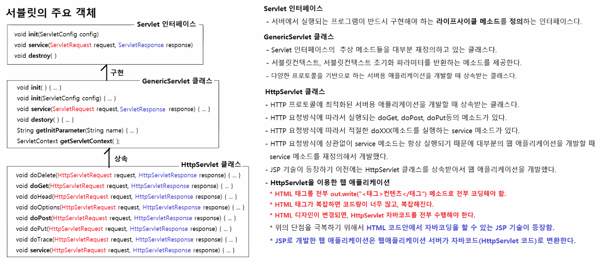
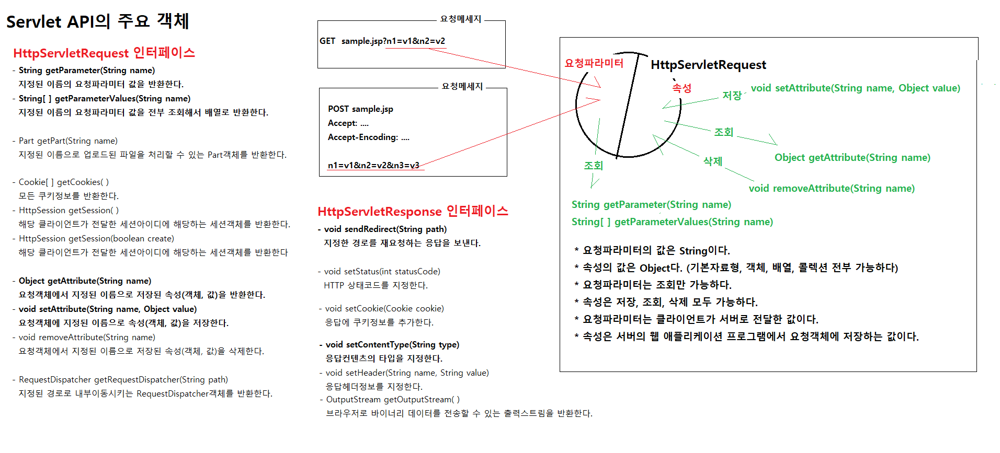
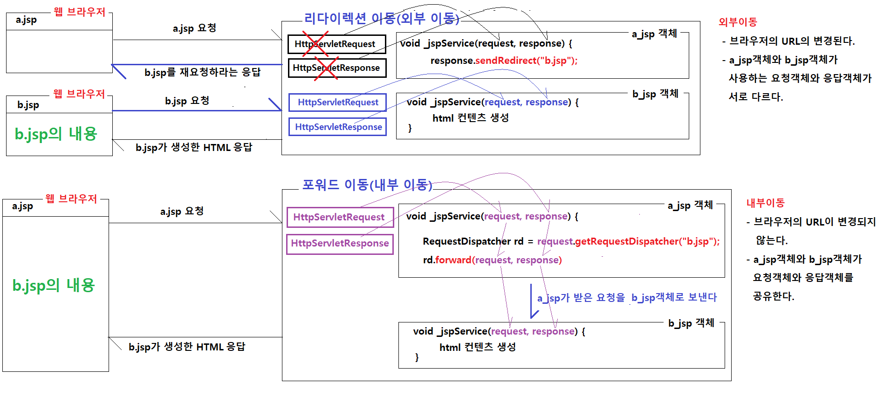
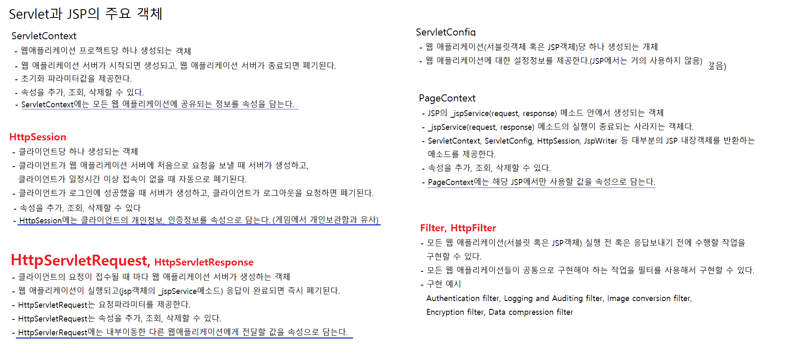
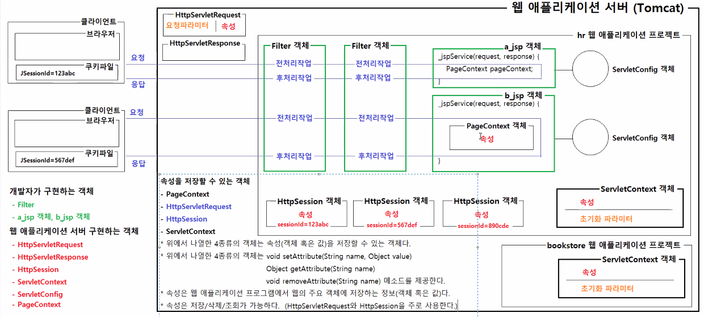
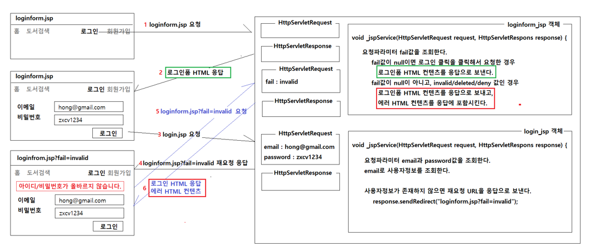

# 0530

- [0530](#0530)
- [서블릿](#서블릿)
	- [서블릿의 주요객체](#서블릿의-주요객체)
	- [요청객체와 응답객체의 API](#요청객체와-응답객체의-api)
		- [HttpServletRequest 인터페이스](#httpservletrequest-인터페이스)
		- [HttpServletResponse 인터페이스](#httpservletresponse-인터페이스)
	- [리다이렉션 이동과 포워드 이동](#리다이렉션-이동과-포워드-이동)
	- [Servlet과 JSP의 주요 객체](#servlet과-jsp의-주요-객체)
		- [ServletContext](#servletcontext)
		- [**HttpSession**](#httpsession)
		- [**HttpServletRequest, HttpServletResponse**](#httpservletrequest-httpservletresponse)
		- [ServletConfig](#servletconfig)
		- [PageContext](#pagecontext)
		- [**Filter, HttpFilter**](#filter-httpfilter)
	- [Tomcat에서 Servlet 객체의 동작](#tomcat에서-servlet-객체의-동작)
- [bookstore app 실습](#bookstore-app-실습)
	- [선택 탭 하이라이트 기능](#선택-탭-하이라이트-기능)
	- [로그인 기능](#로그인-기능)
		- [실습 코드](#실습-코드)

<small><i><a href='http://ecotrust-canada.github.io/markdown-toc/'>Table of contents generated with markdown-toc</a></i></small>


# 서블릿
서버에서 작동되는 자바

## 서블릿의 주요객체


## 요청객체와 응답객체의 API


### HttpServletRequest 인터페이스
* **`String getParameter(String name)`**
  * 지정된 이름의 요청파라미터 값을 반환한다.
* **`String[] getParameterValues(String name)`**
  * 지정된이름의 요청파라미터 값을 전부 조회해서 배열로 반환한다.
* `Part getPart(String name)`
  * 지정된 이름으로 업로드된 파일을 처리할 수 있는 Part객체를 반환한다.
* `Cookie[] getCookies()`
  * 모든 쿠키정보를 반환한다.
* `HttpSession getSession()`
  * 해당 클라이언트가 전달한 세션아이디에 해당하는 세션객체를 반환한다.
* `HttpSession getSession(boolean create)`
  * 해당 클라이언트가 전달한 세션아이디에 해당하는 세션객체를 반환한다.
* **`Object getAttribute(String name)`**
  * 요청객체에서 지정된 이름으로 저장된 속성(객체, 값)을 반환한다.
* **`void setAttribute(String name, Object value)`**
  * 요청객체에서 지정된 이름으로 속성(객체, 값)을 저장한다.
* `void removeAttribute(String name)`
  * 요청객체에서 지정된 이름으로 저장된 속성(객체, 값)을 삭제한다.
* `RequestDispatcher getRequestDispatcher(String path)`
  * 지정된 경로로 내부이동시키는 RequestDispatcher객체를 반환한다.

### HttpServletResponse 인터페이스
* **`void sendRedirect(String path)`**
  * 지정한 경로를 재요청하는 응답을 보낸다.
* `void setStatus(intstatusCode)`
  * HTTP 상태코드를 지정한다.
* **`void setContentType(String type)`**
  * 응답컨텐츠의 타입을 지정한다.
* `void setHeader(string name, String value)`
  * 응답헤더정보를 지정한다.
* `OutputStream getOutputStream()`
  * 브라우저로 바이너리 데이터를 전송할 수 있는 출력스트림을 반환한다.
* `void setCookie(Cookie cookie)`
  * 응답에 쿠키정보를 추가한다.

## 리다이렉션 이동과 포워드 이동

* 리다이렉션은 url이 바뀐다. 포워드는 url이 바뀌지 않는다. 따라서 정확히 어느 url로 이동했는지 알 수 없다.
* 리다이렉션
  * 재요청응답이 가고 나면 httpservletrequest와 httpservletresponse는 즉시 사라진다.
  * a_jsp와 b_jsp가 서로 다른 객체를 사용
* 포워드
  * a_jsp와 b_jsp가 같은 객체를 사용

## Servlet과 JSP의 주요 객체

### ServletContext
* 웹애플리케이션 프로젝트당 하나 생성되는 객체
* 웹애플리케이션 서버가 시작되면 생성되고,
* 웹애플리케이션 서버가 종료되면 폐기된다.
* 초기화파라미터값을 제공한다.
* 속성을 추가, 조회, 삭제할 수 있다.
* ServletContext에는 모든 웹 애플리케이션에 공유되는 정보를 속성으로 담는다.
  
### **HttpSession**
* 클라이언트당 하나 생성되는 객체
* 클라이언트가 웹 애플리케이션 서버에 처음으로 요청을 보낼  때 서버가 생성하고,
* 클라이언트가 일정시간 이상 접속이 없을 때 자동으로 폐기된다.
* 클라이언트가 로그인에 성공했을 때 서버가 생성하고,
* 클라이언트가 로그아웃을 요청하면 폐기된다.
* 속성을 추가, 조회, 삭제 할 수 있다.
* **HttpSession에는 클라이언트의 개인정보, 인증정보를 속성으로 담는다.(게임에서 개인보관함과 유사하다.)**
  
### **HttpServletRequest, HttpServletResponse**
* 클라이언트의 요청이 접수될 때 마다 웹 애플리케이션 서버가 생성하는 객체
* 웹 애플리케이션이 실행되고(jsp객체의 _jspService 메소드)응답이 완료되면 즉시 폐기된다.
* HttpServletRequest는 요청파라미터를 제공한다.
* HttpServletRequest는 속성을 추가, 조회, 삭제할 수 있다.
* **HttpServletRequest에는 내부이동한 다른 웹애플리케이션에게 전달할 값을 속성으로 담는다.**

### ServletConfig
* 웹애플리케이션(서블릿객체 혹은 JSP객체)당 하나 생성되는 객체
* 웹애플리케이션에 대한 설정정보를 제공한다.(JSP에서는 거의 사용x)
  
### PageContext
* JSP의 _jspService(request, response)메소드 안에서 생성되는 객체
* _jspService(request, response)메소드의 실행이 종료되면 사라지는 객체다.
* ServletContext, ServletConfig, HttpSession, JspWriter 등 대부분의 JSP 내장객체를 반환하는 메소드를 제공한다.
* 속성을 추가, 조회, 삭제할 수 있다.
* PageContext에는 해당 JSP에서만 사용할 값을 속성으로 담는다.

### **Filter, HttpFilter**
* 모든 웹 애플리케이션(서블릿 혹은 JSP객체) 실행 전 혹은 응답보내기 전에 수행할 작업을 구현할 수 있다.
* 모든 웹 애플리케이션들이 공통으로 구현해야 하는 작업을 필터를 사용해서 구현할 수 있다.
* 구현 예시
  * Authentication filter, Logging and Auditing filter, Image conversion filter, Encryption filter, Data Compression filter

## Tomcat에서 Servlet 객체의 동작


# bookstore app 실습
* src/main/java
  1. new project "book-store
  2. vo - User.java
     * 사용자(고객) 정보 클래스
  3. dao - UserDao.java
     * 유저 - DB 관련 기능 정의.
     * `public User getUserByEmail(String email) throws SQLException {}`
       * 유저의 이메일을 전달받아 사용자정보를 DB에서 조회한다.
  4. util - ConnectionUtil.java
     * DB - eclipse 연결 유틸
* webapp
  1. common/nav.jsp
     * 네비게이션바(메뉴)에 대한 디자인 및 기능 정의
     * 각 jsp페이지 마다 공통으로 사용하는 부분으로 jsp:include를 통해 호출한다.
  2. home.jsp
     * 홈페이지 화면
  3. loginform.jsp
     * 로그인 화면
  4. login.jsp
     * 로그인 기능
  5. registerform.jsp
     * 회원가입 화면

## 선택 탭 하이라이트 기능
```jsp
<jsp:include page="common/nav.jsp">
	<jsp:param name="menu" value="home"/>
</jsp:include>
```


## 로그인 기능
1. 로그인 링크를 클릭한다.
   * 서버로 loginform.jsp의 실행을 요청하는 메세지를 보낸다.(GET 방식 요청)
2. 서버가 요청을 처리한다.
   * 요청이 접수되면 요청객체와 응답객체를 생성한다.
   * 요청메세지를 분석해서 요청헤더정보와 요청파라미터정보를 요청객체에 저장한다.
   * loginform_jsp객체를 생성하고, loginform_jsp객체의 _jspService(request, response)메소드를 실행한다.
     * _jspService 메소드의 처리 내용
       * 요청객체와 응답객체를 request와 response 매개변수로 전달받는다.
       * JSP 내장객체를 저장할 변수를 생성한다.
       * PageContext객체를 생성해서 pageContext 변수에 저장한다.
       * `pageContext.getSession()`을 실행해서 HttpSession객체를 생성/검색해서 session 변수에 저장한다.
       * `pageContext.getServletContext()` 실행해서 ServletContext객체를 찾아서 application 변수에 저장한다.
       * `pageContext.getServletConfig()`을 실행해서 ServletConfig객체를 찾아서 config 변수에 저장한다.
       * `pageContext.getWriter()`을 실행해서 JspWriter객체를 찾아서 out변수에 저장한다.
       * Object타입의 page 변수에 logingform_jsp객체 자기자신을 저장한다.
   * **개발자의 코딩 내용**
     * 로그인폼 HTML을 응답으로 보낸다.
   * 응답이 완료되면 요청객체와 응답객체를 폐기한다.
3. 웹브라우저에 로그인폼이 표시된다.
4. 로그인폼에 email과 password를 입력하고, 로그인 버튼을 클릭한다.
   * 서버로 login.jsp의 실행을 요청하는 메세지를 보낸다.(POST 방식 요청)
   * 요청메세지의 body에 폼입력값 email=hong@gmail.com&password=zxcv1234가 포함되어 있다.
5. 서버가 요청을 처리한다.
   * 요청이 접수되면 요청객체와 응답객체를 생성한다.
   * 요청메세지를 분석해서 요청헤더정보와 요청파라미터정보를 요청객체에 저장한다.
   * login_jsp객체를 생성하고, login_jsp객체의 _jspService(request, response)메소드를 실행한다.
     * _jspService 메소드의 처리 내용
       * 요청객체와 응답객체를 request와 response 매개변수로 전달받는다.
       * JSP 내장객체를 저장할 변수를 생성한다.
       * PageContext객체를 생성해서 pageContext 변수에 저장한다.
       * `pageContext.getSession()`을 실행해서 HttpSession객체를 생성/검색해서 session 변수에 저장한다.
       * `pageContext.getServletContext()` 실행해서 ServletContext객체를 찾아서 application 변수에 저장한다.
       * `pageContext.getServletConfig()`을 실행해서 ServletConfig객체를 찾아서 config 변수에 저장한다.
       * `pageContext.getWriter()`을 실행해서 JspWriter객체를 찾아서 out변수에 저장한다.
       * Object타입의 page 변수에 loging_jsp 객체 자기자신을 저장한다.

   * **개발자의 코딩 내용**
     * 로그인폼에서 제출한 요청파라미터정보 조회하기(email과 password값이 조회됨)
     * UserDao객체를 획득하고, UserDao객체의 getUserByEmail(email) 메소드를 실행해서 가입된 사용자정보를 조회한다.
     * 사용자정보가 null이면, 로그인폼을 재요청하는 URL을 응답으로 보낸다. 
     `response.sendRedirect("loginform.jsp?fail=invalid");`
     * 사용자정보의 deleted값이 "Y"면, 로그인폼을 재요청하는 URL을 응답으로 보낸다.
     `response.sendRedirect("loginform.jsp?fail=deleted");`
     * 비밀번호가 일치하지 않으면, 로그인폼을 재요청하는 URL을 응답으로 보낸다.
     `response.sendRedirect("loginform.jsp?fail=invalid");`
     * 사용자정보가 존재함, 탈퇴한 사용자가 아님, 비밀번호가 일치함
     로그인시킨다.
     인증된 사용자의 정보를 서버가 유지시킨다.
     (사용자가 자신의 정보를 다시 전달할 필요가 없게 하기 위해서)

* 

### 실습 코드
User.java
```java
package vo;

import java.util.Date;

public class User {

	private int no;
	private String email;
	private String password;
	private String name;
	private String tel;
	private int point;
	private String deleted;
	private Date createdDate;
	private Date updatedDate;

	public User() {
		super();
	}

	public User(int no, String email, String password, String name, String tel, int point, String deleted,
			Date createdDate, Date updatedDate) {
		super();
		this.no = no;
		this.email = email;
		this.password = password;
		this.name = name;
		this.tel = tel;
		this.point = point;
		this.deleted = deleted;
		this.createdDate = createdDate;
		this.updatedDate = updatedDate;
	}

	public int getNo() {
		return no;
	}

	public void setNo(int no) {
		this.no = no;
	}

	public String getEmail() {
		return email;
	}

	public void setEmail(String email) {
		this.email = email;
	}

	public String getPassword() {
		return password;
	}

	public void setPassword(String password) {
		this.password = password;
	}

	public String getName() {
		return name;
	}

	public void setName(String name) {
		this.name = name;
	}

	public String getTel() {
		return tel;
	}

	public void setTel(String tel) {
		this.tel = tel;
	}

	public int getPoint() {
		return point;
	}

	public void setPoint(int point) {
		this.point = point;
	}

	public String getDeleted() {
		return deleted;
	}

	public void setDeleted(String deleted) {
		this.deleted = deleted;
	}

	public Date getCreatedDate() {
		return createdDate;
	}

	public void setCreatedDate(Date createdDate) {
		this.createdDate = createdDate;
	}

	public Date getUpdatedDate() {
		return updatedDate;
	}

	public void setUpdatedDate(Date updatedDate) {
		this.updatedDate = updatedDate;
	}

}

```

UserDao.java
```java
package dao;

import java.sql.Connection;
import java.sql.PreparedStatement;
import java.sql.ResultSet;
import java.sql.SQLException;

import util.ConnectionUtil;
import vo.User;

public class UserDao {

	private static UserDao instance = new UserDao();
	private UserDao() {}
	public static UserDao getInstance() {
		return instance;
	}
	
	/**
	 * 지정된 이메일과 일치하는 사용자정보를 반환한다.
	 * @param email 이메일
	 * @return 사용자 정보, 일치하는 정보가 없으면 null이 반환된다.
	 * @throws SQLException
	 */
	public User getUserByEmail(String email) throws SQLException {
		String sql = "select * "
				   + "from store_users "
				   + "where user_email = ? ";
		
		User user = null;
		
		Connection connection = ConnectionUtil.getConnection();
		PreparedStatement pstmt = connection.prepareStatement(sql);
		pstmt.setString(1, email);
		ResultSet rs = pstmt.executeQuery();
		if (rs.next()) {
			user = new User();
			user.setNo(rs.getInt("user_no"));
			user.setEmail(rs.getString("user_email"));
			user.setPassword(rs.getString("user_password"));
			user.setName(rs.getString("user_name"));
			user.setTel(rs.getString("user_tel"));
			user.setPoint(rs.getInt("user_point"));
			user.setDeleted(rs.getString("user_deleted"));
			user.setCreatedDate(rs.getDate("user_created_date"));
			user.setUpdatedDate(rs.getDate("user_updated_date"));
		}
		rs.close();
		pstmt.close();
		connection.close();
		
		return user;
	}
}

```

home.jsp
```jsp
<%@ page language="java" contentType="text/html; charset=UTF-8"
	pageEncoding="UTF-8"%>
<!DOCTYPE html>
<html>
<head>
<meta charset="UTF-8">
<meta name="viewport" content="width=device-width, initial-scale=1">
<title>북 스토어</title>
<link href="https://cdn.jsdelivr.net/npm/bootstrap@5.2.0-beta1/dist/css/bootstrap.min.css" rel="stylesheet">
</head>
<body>
<%--
	JSP에 다른 JSP를 포함시키기
	
		include 지시어
			<%@ include file="포함시킬 jsp파일" %>
			
			* include 지시어는 이 jsp에 포함시킬 다른 jsp 파일을 지정한다.
			* include 지시어는 이 jsp에 다른 jsp파일의 코드를 통채로 포함시킨다.
			* 코드가 통채로 포함되기 때문에 변수명 충돌이 발생할 수 있다.
			
		jsp 액션태그
			<jsp:include page="포함시킬 jsp 페이지">
				<jsp:param name="요청파라미터명" value="요청파라미터값" />
				<jsp:param name="요청파라미터명" value="요청파라미터값" />
			</jsp:include>
			
			* include 액션태그는 이 jsp에 포함시킬 다른 jsp 페이지를 지정한다.
			* include 액션태그는 포함시킨 jsp페이지를 실행하고, 이 jsp로 되돌아온다. 
			* include 액션태그는 변수명 충돌을 걱정할 필요가 없다.
			* include 액션태그는 <jsp:param />태그를 포함할 수 있다.
			* <jsp:param />태그를 사용하면 포함시킨 jsp 페이지에 요청파라미터값을 전달할 수 있다.
			
		* 모든 jsp 페이지에 공통으로 포함되는 navbar, footer, banner 등을 각각 다른 jsp 파일로 정의하고, 
		  include 지시어나 jsp 액션태그로 필요한 jsp 페이지에 포함시킬 수 있다.
		* include 지시어나 jsp 액션태그를 사용하면 jsp에서 중복되는 html 코드를 작성할 필요가 없어진다. 
 --%>
<jsp:include page="common/nav.jsp">
	<jsp:param name="menu" value="home"/>
</jsp:include>
<div class="container">
	<div class="p-5 mb-4 bg-light rounded-3">
		<div class="container-fluid py-3">
			<h1 class="display-5 fw-bold">북 스토어</h1>
			<p class="col-md-10 fs-4">회원가입, 로그인, 도서검색, 주문, 장바구니, 내정보 조회 등의 서비스를 제공하는 <br/>웹 애플리케이션 입니다.</p>
			<a href="loginform.jsp" class="btn btn-primary btn-lg">로그인</a>
			<a href="registerform.jsp" class="btn btn-outline-primary btn-lg">회원가입</a>
		</div>
	</div>
</div>
<script src="https://cdn.jsdelivr.net/npm/bootstrap@5.2.0-beta1/dist/js/bootstrap.bundle.min.js"></script>
</body>
</html>
```

nav.jsp
```jsp
<%@ page language="java" contentType="text/html; charset=UTF-8"
    pageEncoding="UTF-8"%>
<%--
	nav.jsp 파일을 include한 jsp에서 <jsp:param /> 액션태그를 사용해서 nav.jsp에 요청파라미터값을 전달하고 있음
	nav.jsp에 전달하는 요청파라미터는 하이라이트시킬 메뉴이름이다.
	
	<jsp:include page="common/nav.jsp">
		<jsp:param name="menu" value="home"/>
	</jsp:include>
 --%>
<%	
	String menu = request.getParameter("menu");
%>
<nav class="navbar navbar-expand-lg navbar navbar-dark bg-dark mb-3 ">
	<div class="container">
		<a class="navbar-brand" href="/book-store/home.jsp">북스토어</a>
		<button class="navbar-toggler" type="button"
			data-bs-toggle="collapse" data-bs-target="#navbarNav"
			aria-controls="navbarNav" aria-expanded="false"
			aria-label="Toggle navigation">
			<span class="navbar-toggler-icon"></span>
		</button>
		<div class="collapse navbar-collapse" id="navbarNav">
			<ul class="navbar-nav me-auto mb-2 mb-lg-0">
				<!-- 
					메뉴를 하이라이트 시키기 위해선 a태그의 class 속성에 active를 추가하면 됩니다.
				 -->
				<li class="nav-item">
					<a class="nav-link <%="home".equals(menu) ? "active" : "" %>" aria-current="page" href="/book-store/home.jsp">홈</a>
				</li>
				<li class="nav-item">
					<a class="nav-link <%="book".equals(menu) ? "active" : "" %>" aria-current="page" href="/book-store/book/list.jsp">도서 검색</a>
				</li>
			</ul>
			<ul class="navbar-nav">
				<li class="nav-item">
					<a class="nav-link <%="login".equals(menu) ? "active" : "" %>" aria-current="page" href="/book-store/loginform.jsp">로그인</a>
				</li>
				<li class="nav-item">
					<a class="nav-link <%="register".equals(menu) ? "active" : "" %>" aria-current="page" href="/book-store/registerform.jsp">회원가입</a>
				</li>
			</ul>
		</div>
	</div>
</nav>
```

login.jsp
```jsp
<%@page import="vo.User"%>
<%@page import="dao.UserDao"%>
<%@ page language="java" contentType="text/html; charset=UTF-8"
    pageEncoding="UTF-8"%>
<%
	/*
		POST 방식으로 파라미터가 전달될 때 요청메세지의 형태
		-----------------------------------------------------------------
		| POST  login.jsp  HTTP/1.1							     	    |
		| Accept=text/html,application/xhtml+xml,application/xml;		|
		| Accept-Encoding=gzip, deflate, br								|
		| Accept-Language=ko,en;q=0.9,en-US;q=0.8						|
		| 																|
		| email=hong@gmail.com&password=zxcv1234               			|
		-----------------------------------------------------------------
	*/

	// 로그인폼에서 login.jsp로 제출한 요청파라미터값 조회하기
	String email = request.getParameter("email");
	String password = request.getParameter("password");
	
	// 사용자정보 조회
	UserDao userDao = UserDao.getInstance();
	User user = userDao.getUserByEmail(email);
	
	// 회원정보가 존재하지 않음
	if (user == null) {
		response.sendRedirect("loginform.jsp?fail=invalid");
		return;
	}
	// 탈퇴한 회원임
	if ("Y".equals(user.getDeleted())) {
		response.sendRedirect("loginform.jsp?fail=deleted");
		return;
	}
	// 비밀번호가 일치하지 않음
	if (!user.getPassword().equals(password)) {
		response.sendRedirect("loginform.jsp?fail=invalid");
		return;
	}
	
	// 회원정보가 존재함, 탈퇴한 회원이 아님, 비밀번호가 일치함
	// 로그인시킨다.
	// 로그인시킨다.
		
%>
```

loginform.jsp
```jsp
<%@ page language="java" contentType="text/html; charset=UTF-8"
	pageEncoding="UTF-8"%>
<!DOCTYPE html>
<html lang="ko">
<head>
<meta charset="UTF-8">
<meta name="viewport" content="width=device-width, initial-scale=1">
<title>북 스토어</title>
<link href="https://cdn.jsdelivr.net/npm/bootstrap@5.2.0-beta1/dist/css/bootstrap.min.css" rel="stylesheet">
</head>
<body>
<jsp:include page="common/nav.jsp">
	<jsp:param name="menu" value="login"/>
</jsp:include>
<div class="container mb-5">
	<div class="row">
		<div class="col">
			<h1 class="fs-4 border p-2">로그인 폼</h1>
		</div>
	</div>
	<div class="row">
		<div class="col-6">
			<%
				// loginform.jsp를 요청하는 경우의 수
				// 		1. 로그인 링크 클릭한 경우
				//			- loginform.jsp를 요청한다.	
				//		2. 로그인 실패해서 로그인폼을 재요청한 경우
				//			- loginform.jsp?fail=invalid를 요청한다.
				//			- loginform.jsp?fail=deleted를 요청한다.
				
				// 요청파라미터 fail을 조회한다.
				// 	1번 요청의 경우 fail변수에 저장된 값은 null이다.
				//	2번 요청의 경우 fail변수에 저장된 값은 "invalid", "deleted", "deny" 중 하나다.
				String fail = request.getParameter("fail");
			%>
			
			<%
				if ("invalid".equals(fail)) {
			%>
					<div class="alert alert-danger">
						<strong>로그인 실패</strong> 아이디 혹은 비밀번호가 올바르지 않습니다.
					</div>
			<%
				}
			%>			
			<%
				if ("deleted".equals(fail)) {
			%>
					<div class="alert alert-danger">
						<strong>로그인 실패</strong> 탈퇴처리된 계정입니다.
					</div>
			<%
				}
			%>			
			<%
				if ("deny".equals(fail)) {
			%>
					<div class="alert alert-danger">
						<strong>접근 거부</strong> 해당 서비스는 로그인 후 이용가능합니다.
					</div>
			<%
				}
			%>
			
			<p>이메일, 비밀번호를 입력하세요</p>
			<form class="border bg-light p-3" method="post" action="login.jsp">
				<div class="mb-3">
					<label class="form-label">이메일</label>
					<input type="text" class="form-control" name="email">
				</div>
				<div class="mb-3">
					<label class="form-label">비밀번호</label>
					<input type="password" class="form-control" name="password">
				</div>
				<div class="text-end">
					<a href="home.jsp" class="btn btn-secondary">취소</a>
					<button type="submit" class="btn btn-primary">로그인</button>
				</div>
			</form>
		</div>
	</div>
</div>
<script src="https://cdn.jsdelivr.net/npm/bootstrap@5.2.0-beta1/dist/js/bootstrap.bundle.min.js"></script>
</body>
</html>
```
* 주의사항
  * `if ("invalid".equals(fail)) {`
  * 반드시 상수를 앞에 놓고 .equals()로 비교한다.
  * null값이 먼저 들어가서 에러가 발생하기 때문

registerform.jsp
```jsp
<%@ page language="java" contentType="text/html; charset=UTF-8"
	pageEncoding="UTF-8"%>
<!DOCTYPE html>
<html lang="ko">
<head>
<meta charset="UTF-8">
<meta name="viewport" content="width=device-width, initial-scale=1">
<title>북 스토어</title>
<link href="https://cdn.jsdelivr.net/npm/bootstrap@5.2.0-beta1/dist/css/bootstrap.min.css" rel="stylesheet">
</head>
<body>
<jsp:include page="common/nav.jsp">
	<jsp:param name="menu" value="register"/>
</jsp:include>
<div class="container mb-5">
	<div class="row">
		<div class="col">
			<h1 class="fs-4 border p-2">회원가입 폼</h1>
		</div>
	</div>
	<div class="row">
		<div class="col-6">
			<p>이메일, 비밀번호, 이름, 전화번호를 입력하세요</p>
			<form class="border bg-light p-3" method="post" action="register.jsp">
				<div class="mb-3">
					<label class="form-label">이메일</label>
					<input type="text" class="form-control" name="email">
				</div>
				<div class="mb-3">
					<label class="form-label">비밀번호</label>
					<input type="password" class="form-control" name="password">
				</div>
				<div class="mb-3">
					<label class="form-label">이름</label>
					<input type="text" class="form-control" name="name">
				</div>
				<div class="mb-3">
					<label class="form-label">전화번호</label>
					<input type="text" class="form-control" name="tel">
				</div>
				<div class="text-end">
					<a href="../home.jsp" class="btn btn-secondary">취소</a>
					<button type="submit" class="btn btn-primary">등록</button>
				</div>
			</form>
		</div>
	</div>
</div>
<script src="https://cdn.jsdelivr.net/npm/bootstrap@5.2.0-beta1/dist/js/bootstrap.bundle.min.js"></script>
</body>
</html>
```