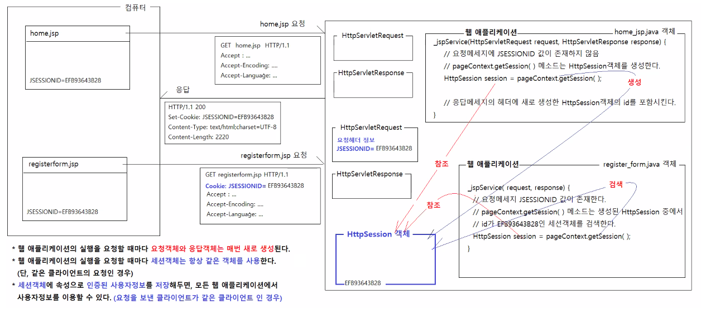
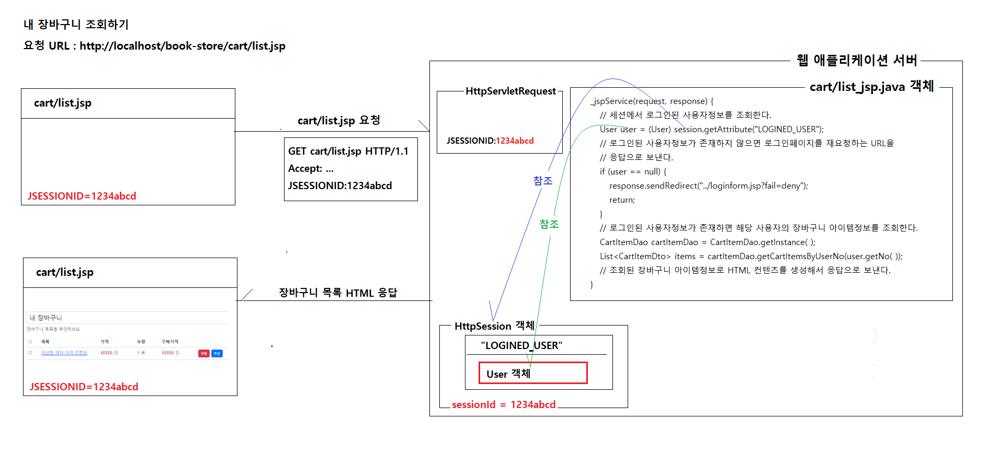
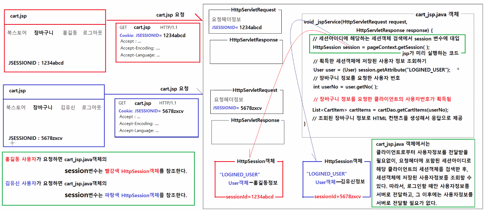
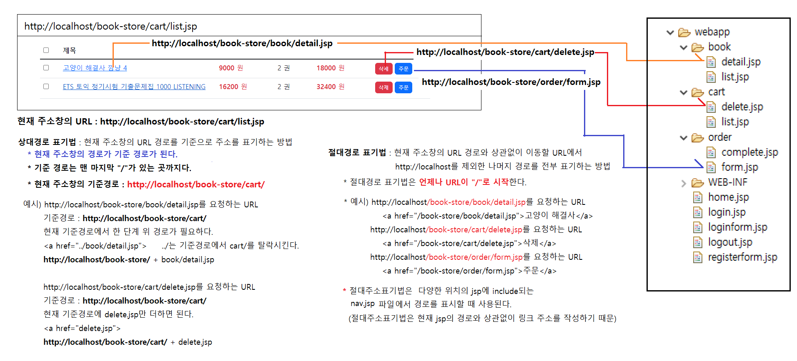

# 0531

- [0531](#0531)
- [book-store 앱](#book-store-앱)
  - [로그인하기](#로그인하기)
    - [세션아이디가 없을 때 요청과 응답](#세션아이디가-없을-때-요청과-응답)
    - [세션아이디가 있을 때 요청과 응답](#세션아이디가-있을-때-요청과-응답)
    - [HttpSession객체](#httpsession객체)
  - [장바구니 기능 구현](#장바구니-기능-구현)
    - [주소 표기법](#주소-표기법)
  - [실습코드](#실습코드)

<small><i><a href='http://ecotrust-canada.github.io/markdown-toc/'>Table of contents generated with markdown-toc</a></i></small>


# book-store 앱
## 로그인하기
1. 로그인 링크를 클릭한다.
   * 서버로 loginform.jsp의 실행을 요청하는 메세지를 보낸다.(GET 방식 요청)
2. 서버가 요청을 처리한다.
   * 요청이 접수되면 요청객체와 응답객체를 생성한다.
   * 요청메세지를 분석해서 요청헤더정보와 요청파라미터정보를 요청객체에 저장한다.
   * loginform_jsp객체를 생성하고, loginform_jsp객체의 _jspService(request, response)메소드를 실행한다.
     * _jspService 메소드의 처리 내용
       * 요청객체와 응답객체를 request와 response 매개변수로 전달받는다.
       * JSP 내장객체를 저장할 변수를 생성한다.
       * PageContext객체를 생성해서 pageContext 변수에 저장한다.
       * `pageContext.getSession()`을 실행해서 HttpSession객체를 생성/검색해서 session 변수에 저장한다.
       * `pageContext.getServletContext()` 실행해서 ServletContext객체를 찾아서 application 변수에 저장한다.
       * `pageContext.getServletConfig()`을 실행해서 ServletConfig객체를 찾아서 config 변수에 저장한다.
       * `pageContext.getWriter()`을 실행해서 JspWriter객체를 찾아서 out변수에 저장한다.
       * Object타입의 page 변수에 logingform_jsp객체 자기자신을 저장한다.
   * **개발자의 코딩 내용**
     * 로그인폼 HTML을 응답으로 보낸다.
   * 응답이 완료되면 요청객체와 응답객체를 폐기한다.
3. 웹브라우저에 로그인폼이 표시된다.
4. 로그인폼에 email과 password를 입력하고, 로그인 버튼을 클릭한다.
   * 서버로 login.jsp의 실행을 요청하는 메세지를 보낸다.(POST 방식 요청)
   * 요청메세지의 body에 폼입력값 email=hong@gmail.com&password=zxcv1234가 포함되어 있다.
5. 서버가 요청을 처리한다.
   * 요청이 접수되면 요청객체와 응답객체를 생성한다.
   * 요청메세지를 분석해서 요청헤더정보와 요청파라미터정보를 요청객체에 저장한다.
   * login_jsp객체를 생성하고, login_jsp객체의 _jspService(request, response)메소드를 실행한다.
     * _jspService 메소드의 처리 내용
       * 요청객체와 응답객체를 request와 response 매개변수로 전달받는다.
       * JSP 내장객체를 저장할 변수를 생성한다.
       * PageContext객체를 생성해서 pageContext 변수에 저장한다.
       * `pageContext.getSession()`을 실행해서 HttpSession객체를 생성/검색해서 session 변수에 저장한다.
       * `pageContext.getServletContext()` 실행해서 ServletContext객체를 찾아서 application 변수에 저장한다.
       * `pageContext.getServletConfig()`을 실행해서 ServletConfig객체를 찾아서 config 변수에 저장한다.
       * `pageContext.getWriter()`을 실행해서 JspWriter객체를 찾아서 out변수에 저장한다.
       * Object타입의 page 변수에 loging_jsp 객체 자기자신을 저장한다.

   * **개발자의 코딩 내용**
     * 로그인폼에서 제출한 요청파라미터정보 조회하기(email과 password값이 조회됨)
     * UserDao객체를 획득하고, UserDao객체의 getUserByEmail(email) 메소드를 실행해서 가입된 사용자정보를 조회한다.
     * 사용자정보가 null이면, 로그인폼을 재요청하는 URL을 응답으로 보낸다. 
     response.sendRedirect("loginform.jsp?fail=invalid");
     * 사용자정보의 deleted값이 "Y"면, 로그인폼을 재요청하는 URL을 응답으로 보낸다.
     response.sendRedirect("loginform.jsp?fail=deleted");
     * 비밀번호가 일치하지 않으면, 로그인폼을 재요청하는 URL을 응답으로 보낸다.
     response.sendRedirect("loginform.jsp?fail=invalid");
     * 사용자정보가 존재함, 탈퇴한 사용자가 아님, 비밀번호가 일치함
     로그인시킨다.
     * HttpSession객체에 인증된 사용자 정보를 저장한다.
     HttpSession객체에 인증된 사용자 정보를 저장함으로써 획득되는 장점
     * 같은 클라이언트의 요청에 대해서는 웹 애플리케이션이 항상 같은 HttpSession객체를 사용한다.
     * 항상 같은 HttpSession객체를 사용하기 때문에 HttpSession객체에 저장된 값은 서로 다른 웹 애플리케이션에서도 그 값을 공유할 수 있다.
     * HttpSession객체는 지정된 시간동안 웹애플리케이션에 대한 요청이 없거나, 로그아웃을 요청하기 전까지는 유지되기 때문에,
       요청과 응답이 완료된 후에도 HttpSession객체에 저장된 값을 계속 유지된다.
     * HttpSession객체에 인증된 사용자정보를 저장해둠으로써, 웹 애플리케이션이 실행될 때 사용자정보가 필요한 경우, 
       요청메세지에 사용자정보를 담아서 전달하지 않아도 된다. 
      * 웹 애플리케이션의 session변수로 HttpSession객체를 참조할 수 있고, HttpSession객체에는 로그인처리과정에 저장한 사용자정보를 이미 존재하기 때문이다.
					
			
### 세션아이디가 없을 때 요청과 응답
* `http://localhost/book-store/home.jsp` 의 요청,응답 메세지를 확인한다.
* 요청메세지
    ```
    GET /book-store/home.jsp HTTP/1.1
    Accept: text/html,application/xhtml+xml,application/xml;q=0.9,image/avif,image/webp,image/apng,*/*;q=0.8,application/signed-exchange;v=b3;q=0.9
    Accept-Encoding: gzip, deflate, br
    Accept-Language: ko,en;q=0.9,en-US;q=0.8
    Connection: keep-alive
    Host: localhost
    Sec-Fetch-Dest: document
    Sec-Fetch-Mode: navigate
    Sec-Fetch-Site: none
    Sec-Fetch-User: ?1
    Upgrade-Insecure-Requests: 1
    User-Agent: Mozilla/5.0 (Windows NT 10.0; Win64; x64) AppleWebKit/537.36 (KHTML, like Gecko) Chrome/101.0.4951.67 Safari/537.36
    sec-ch-ua: " Not A;Brand";v="99", "Chromium";v="101", "Google Chrome";v="101"
    sec-ch-ua-mobile: ?0
    sec-ch-ua-platform: "Windows"
    ```
* 응답메세지
    ``` 
    HTTP/1.1 200
    Set-Cookie: JSESSIONID=EFB93643B2892649A1E49811C1A05614; Path=/book-store; HttpOnly
    Content-Type: text/html;charset=UTF-8
    Content-Length: 2220
    Date: Tue, 31 May 2022 00:10:59 GMT
    Keep-Alive: timeout=20
    Connection: keep-alive
    ```

### 세션아이디가 있을 때 요청과 응답
* `http://localhost/book-store/home.jsp` 의 요청,응답 메세지를 확인한다.
* 요청메세지
    ```
    GET /book-store/home.jsp HTTP/1.1
    Accept: text/html,application/xhtml+xml,application/xml;q=0.9,image/avif,image/webp,image/apng,*/*;q=0.8,application/signed-exchange;v=b3;q=0.9
    Accept-Encoding: gzip, deflate, br
    Accept-Language: ko,en;q=0.9,en-US;q=0.8
    Connection: keep-alive
    Cookie: JSESSIONID=EFB93643B2892649A1E49811C1A05614
    Host: localhost
    Referer: http://localhost/book-store/home.jsp
    Sec-Fetch-Dest: document
    Sec-Fetch-Mode: navigate
    Sec-Fetch-Site: same-origin
    Sec-Fetch-User: ?1
    Upgrade-Insecure-Requests: 1
    User-Agent: Mozilla/5.0 (Windows NT 10.0; Win64; x64) AppleWebKit/537.36 (KHTML, like Gecko) Chrome/101.0.4951.67 Safari/537.36
    sec-ch-ua: " Not A;Brand";v="99", "Chromium";v="101", "Google Chrome";v="101"
    sec-ch-ua-mobile: ?0
    sec-ch-ua-platform: "Windows"
    ```
* 응답메세지
    ```
    HTTP/1.1 200
    Content-Type: text/html;charset=UTF-8
    Content-Length: 2220
    Date: Tue, 31 May 2022 00:13:44 GMT
    Keep-Alive: timeout=20
    Connection: keep-alive
    ```

### HttpSession객체
* 로그인하면 사용자 정보를 이용해 데이터를 조회하는 등의 기능을 사용하게 된다.
* 이때 사용자정보를 기억해두는 저장소가 session객체.


* 웹 애플리케이션 실행 요청마다 요청객체와 응답객체는 매번 새로 생성되고, 세션객체는 항상 같은 객체를 사용한다.(같은 사용자일 경우)
* 같은 클라이언트의 요청에 대해 모든 웹 애플리케이션에서 동일한 세션객체(인증된 사용자정보)를 사용할 수 있다.
  * 
* 브라우저와 세션
  * 크롬과 엣지에서 서로 다른 세션객체를 참조한다. 같은 브라우저에선 동일한 세션이 15분간 유지된다.

## 장바구니 기능 구현


### 주소 표기법

절대경로 표기법
* 상대경로 표기법으로 링크 주소 작성하기
    ```
    주소창 http://localhost/book-store/cart/list.jsp
        
    이동할 경로 : http://localhost/book-store/book/detail.jsp
    주소창 경로 : http://localhost/book-store/cart/
        <a href="book/detail.jsp">				http://localhost/book-store/cart/ + book/detail.jsp
        <a href="detail.jsp">					http://localhost/book-store/cart/ + detail.jsp
        <a href="../detail.jsp">				http://localhost/book-store/ + detail.jsp
        정확한 링크
        <a href="../book/detail.jsp">				http://localhost/book-store/ + book/detail.jsp


    이동할 경로 : http://localhost/book-store/cart/delete.jsp
    주소창 경로 : http://localhost/book-store/cart/
        정확한 링크
        <a href="delete.jsp">					http://localhost/book-store/cart/ + delete.jsp


    이동할 경로 : http://localhost/book-store/order/form.jsp
    주소창 경로 : http://localhost/book-store/cart/
        정확한 링크
        <a href="../order/form.jsp">				http://localhost/book-store/ + order/form.jsp


    이동할 경로 : http://localhost/book-store/home.jsp
    주소창 경로 : http://localhost/book-store/cart/
        정확한 링크
        <a href="../home.jsp">					http://localhost/book-store/ + home.jsp	
    ```


## 실습코드
* order, cart, book 폴더를 /webapp 에 만든다.
* nav.jsp에 장바구니 관련 jsp를 연결한다.
* cart/list.jsp : 장바구니 리스트를 불러와 화면에 보여준다.
* cart/delete.jsp : 요청한 값에 일치하는 장바구니 아이템 번호에 해당하는 정보를 삭제하고 list.jsp로 돌아간다.
* 일치하는 사용자의 정보만 수정, 삭제할 수 있도록 보안 처리를 한다. (모든 보안 처리를 하기는 힘들지만, 반드시 해야하는 보안처리는 꼭 해야하고 이를 효율적으로 하기 위해 범위와 조건을 설정해 실시한다.)

* 보안처리
  * 로그인된 사용자가 아닌 다른 계정의 장바구니를 삭제하지 못하게한다. (cart/list.jsp 수정)

CartItem.java
```java
package vo;

import java.util.Date;

public class CartItem {

	private int itemNo;
	private int userNo;
	private int bookNo;
	private int itemQuantity;
	private Date createdDate;
	private Date updatedDate;
	
	public CartItem() {}

	public int getItemNo() {
		return itemNo;
	}

	public void setItemNo(int itemNo) {
		this.itemNo = itemNo;
	}

	public int getUserNo() {
		return userNo;
	}

	public void setUserNo(int userNo) {
		this.userNo = userNo;
	}

	public int getBookNo() {
		return bookNo;
	}

	public void setBookNo(int bookNo) {
		this.bookNo = bookNo;
	}

	public int getItemQuantity() {
		return itemQuantity;
	}

	public void setItemQuantity(int itemQuantity) {
		this.itemQuantity = itemQuantity;
	}

	public Date getCreatedDate() {
		return createdDate;
	}

	public void setCreatedDate(Date createdDate) {
		this.createdDate = createdDate;
	}

	public Date getUpdatedDate() {
		return updatedDate;
	}

	public void setUpdatedDate(Date updatedDate) {
		this.updatedDate = updatedDate;
	}
	
}

```

CartItemDto.java
```java
package dto;

public class CartItemDto {

	private int itemNo;
	private int userNo;
	private int bookNo;
	private String bookTitle;
	private int bookPrice;
	private int bookDiscountPrice;
	private int itemQuantity;
	
	public CartItemDto() {}

	public int getItemNo() {
		return itemNo;
	}

	public void setItemNo(int itemNo) {
		this.itemNo = itemNo;
	}

	public int getUserNo() {
		return userNo;
	}

	public void setUserNo(int userNo) {
		this.userNo = userNo;
	}

	public int getBookNo() {
		return bookNo;
	}

	public void setBookNo(int bookNo) {
		this.bookNo = bookNo;
	}

	public String getBookTitle() {
		return bookTitle;
	}

	public void setBookTitle(String bookTitle) {
		this.bookTitle = bookTitle;
	}

	public int getBookPrice() {
		return bookPrice;
	}

	public void setBookPrice(int bookPrice) {
		this.bookPrice = bookPrice;
	}

	public int getBookDiscountPrice() {
		return bookDiscountPrice;
	}

	public void setBookDiscountPrice(int bookDiscountPrice) {
		this.bookDiscountPrice = bookDiscountPrice;
	}

	public int getItemQuantity() {
		return itemQuantity;
	}

	public void setItemQuantity(int itemQuantity) {
		this.itemQuantity = itemQuantity;
	}
	
}

```

CartItemDao.java
```java
package dao;

import java.sql.Connection;
import java.sql.PreparedStatement;
import java.sql.ResultSet;
import java.sql.SQLException;
import java.util.ArrayList;
import java.util.List;

import dto.CartItemDto;
import util.ConnectionUtil;
import vo.CartItem;

public class CartItemDao {

	private static CartItemDao instance = new CartItemDao();
	private CartItemDao() {}
	public static CartItemDao getInstance() {
		return instance;
	}
	
	/**
	 * 지정된 장바구니 아이템번호와 일치하는 장바구니 아이템정보를 반환한다.
	 * @param itemNo 아이템번호
	 * @return 장바구니 아이템 정보
	 * @throws SQLException
	 */
	public CartItem getCartItemByItemNo(int itemNo) throws SQLException {
		String sql = "select * "
				   + "from store_cart_items "
				   + "where cart_item_no = ? ";
		
		CartItem item = null;
		
		Connection connection = ConnectionUtil.getConnection();
		PreparedStatement pstmt = connection.prepareStatement(sql);
		pstmt.setInt(1, itemNo);
		ResultSet rs = pstmt.executeQuery();
		if (rs.next()) {
			item = new CartItem();
			
			item.setItemNo(rs.getInt("cart_item_no"));
			item.setUserNo(rs.getInt("user_no"));
			item.setBookNo(rs.getInt("book_no"));
			item.setItemQuantity(rs.getInt("cart_item_quantity"));
			item.setCreatedDate(rs.getDate("cart_item_created_date"));
			item.setUpdatedDate(rs.getDate("cart_item_updated_date"));
		}
		rs.close();
		pstmt.close();
		connection.close();
		
		return item;
	}

	/**
	 * 지정된 장바구니 아이템번호와 일치하는 장바구니 아이템정보를 삭제한다.
	 * @param itemNo 장바구니 아이템번호
	 * @throws SQLException
	 */
	public void deleteCartItem(int itemNo) throws SQLException {
		String sql = "delete from store_cart_items "
				   + "where cart_item_no = ? ";
		
		Connection connection = ConnectionUtil.getConnection();
		PreparedStatement pstmt = connection.prepareStatement(sql);
		pstmt.setInt(1, itemNo);
		pstmt.executeUpdate();
		
		pstmt.close();
		connection.close();
	}
	
	/**
	 * 지정된 사용자번호로 저장된 장바구니 아이템정보를 반환한다.
	 * @param userNo 사용자번호
	 * @return 장바구니 아이템 목록
	 * @throws SQLException
	 */
	public List<CartItemDto> getCartItemsByUserNo(int userNo) throws SQLException {
		String sql = "select C.cart_item_no, C.user_no, C.book_no, B.book_title, B.book_price, B.book_discount_price, C.cart_item_quantity "
				   + "from store_cart_items C, store_books B "
				   + "where C.user_no = ? "
				   + "and C.book_no = B.book_no "
				   + "order by C.cart_item_no desc ";
		
		List<CartItemDto> cartItems = new ArrayList<>();
		
		Connection connection = ConnectionUtil.getConnection();
		PreparedStatement pstmt = connection.prepareStatement(sql);
		pstmt.setInt(1, userNo);
		ResultSet rs = pstmt.executeQuery();
		while (rs.next()) {
			CartItemDto item = new CartItemDto();
			item.setItemNo(rs.getInt("cart_item_no"));
			item.setUserNo(rs.getInt("user_no"));
			item.setBookNo(rs.getInt("book_no"));
			item.setBookTitle(rs.getString("book_title"));
			item.setBookPrice(rs.getInt("book_price"));
			item.setBookDiscountPrice(rs.getInt("book_discount_price"));
			item.setItemQuantity(rs.getInt("cart_item_quantity"));
			
			cartItems.add(item);
		}
		rs.close();
		pstmt.close();
		connection.close();
		
		return cartItems;
	}
}

```

logout.jsp
```jsp
<%@ page language="java" contentType="text/html; charset=UTF-8"
    pageEncoding="UTF-8"%>
<%
	// 로그아웃은 session객체를 무효화(폐기)시키는 것이다.
	session.invalidate();

	// HttpSession객체도 저장소다.
	// 저장소를 변경(저장/변경/삭제)하는 작업을 한 다음에는 항상 재요청URL을 응답으로 보낸다.
	response.sendRedirect("home.jsp");
	
%>
```

login.jsp
```jsp
<%@page import="vo.User"%>
<%@page import="dao.UserDao"%>
<%@ page language="java" contentType="text/html; charset=UTF-8"
    pageEncoding="UTF-8"%>
<%
	/*
		POST 방식으로 파라미터가 전달될 때 요청메세지의 형태
		-----------------------------------------------------------------
		| POST  login.jsp  HTTP/1.1							     	    |
		| Accept=text/html,application/xhtml+xml,application/xml;		|
		| Accept-Encoding=gzip, deflate, br								|
		| Accept-Language=ko,en;q=0.9,en-US;q=0.8						|
		| 																|
		| email=hong@gmail.com&password=zxcv1234               			|
		-----------------------------------------------------------------
	*/

	// 로그인폼에서 login.jsp로 제출한 요청파라미터값 조회하기
	String email = request.getParameter("email");
	String password = request.getParameter("password");
	
	// 사용자정보 조회
	UserDao userDao = UserDao.getInstance();
	User user = userDao.getUserByEmail(email);
	
	// 회원정보가 존재하지 않음
	if (user == null) {
		response.sendRedirect("loginform.jsp?fail=invalid");
		return;
	}
	// 탈퇴한 회원임
	if ("Y".equals(user.getDeleted())) {
		response.sendRedirect("loginform.jsp?fail=deleted");
		return;
	}
	// 비밀번호가 일치하지 않음
	if (!user.getPassword().equals(password)) {
		response.sendRedirect("loginform.jsp?fail=invalid");
		return;
	}
	
	// 회원정보가 존재함, 탈퇴한 회원이 아님, 비밀번호가 일치함.
	// HttpSession객체에 인증된 사용자정보를 저장하는 것이 로그인이다.
	// 즉, HttpSession객체에 웹 애플리케이션 서버에 존재하는 객체고, 그 객체에 요청을 보낸 클라이언트의 사용자정보를
	// 저장했기 때문에 웹 애플리케이션 서버는 이제부터 클라이언트의 정보를 갖게 된다.
	session.setAttribute("LOGINED_USER", user);
	
	// HttpSession객체도 저장소의 한 종류이기 때문에
	// 저장소를 변경(추가/삭제/변경)했을 때는 재요청 URL을 응답으로 보낸다.
	response.sendRedirect("home.jsp");
	
%>
```

loginform.jsp
```jsp
<%@ page language="java" contentType="text/html; charset=UTF-8"
	pageEncoding="UTF-8"%>
<!DOCTYPE html>
<html lang="ko">
<head>
<meta charset="UTF-8">
<meta name="viewport" content="width=device-width, initial-scale=1">
<title>북 스토어</title>
<link href="https://cdn.jsdelivr.net/npm/bootstrap@5.2.0-beta1/dist/css/bootstrap.min.css" rel="stylesheet">
</head>
<body>
<jsp:include page="common/nav.jsp">
	<jsp:param name="menu" value="login"/>
</jsp:include>
<div class="container mb-5">
	<div class="row">
		<div class="col">
			<h1 class="fs-4 border p-2">로그인 폼</h1>
		</div>
	</div>
	<div class="row">
		<div class="col-6">
			<%
				// loginform.jsp를 요청하는 경우의 수
				// 		1. 로그인 링크 클릭한 경우
				//			- loginform.jsp를 요청한다.	
				//		2. 로그인 실패해서 로그인폼을 재요청한 경우
				//			- loginform.jsp?fail=invalid를 요청한다.
				//			- loginform.jsp?fail=deleted를 요청한다.
				
				// 요청파라미터 fail을 조회한다.
				// 	1번 요청의 경우 fail변수에 저장된 값은 null이다.
				//	2번 요청의 경우 fail변수에 저장된 값은 "invalid", "deleted", "deny" 중 하나다.
				String fail = request.getParameter("fail");
			%>
			
			<%
				if ("invalid".equals(fail)) {
			%>
					<div class="alert alert-danger">
						<strong>로그인 실패</strong> 아이디 혹은 비밀번호가 올바르지 않습니다.
					</div>
			<%
				}
			%>			
			<%
				if ("deleted".equals(fail)) {
			%>
					<div class="alert alert-danger">
						<strong>로그인 실패</strong> 탈퇴처리된 계정입니다.
					</div>
			<%
				}
			%>			
			<%
				if ("deny".equals(fail)) {
			%>
					<div class="alert alert-danger">
						<strong>접근 거부</strong> 해당 서비스는 로그인 후 이용가능합니다.
					</div>
			<%
				}
			%>
			
			<p>이메일, 비밀번호를 입력하세요</p>
			<form class="border bg-light p-3" method="post" action="login.jsp">
				<div class="mb-3">
					<label class="form-label">이메일</label>
					<input type="text" class="form-control" name="email">
				</div>
				<div class="mb-3">
					<label class="form-label">비밀번호</label>
					<input type="password" class="form-control" name="password">
				</div>
				<div class="text-end">
					<a href="home.jsp" class="btn btn-secondary">취소</a>
					<button type="submit" class="btn btn-primary">로그인</button>
				</div>
			</form>
		</div>
	</div>
</div>
<script src="https://cdn.jsdelivr.net/npm/bootstrap@5.2.0-beta1/dist/js/bootstrap.bundle.min.js"></script>
</body>
</html>
```

nav.jsp
```jsp
<%@page import="vo.User"%>
<%@ page language="java" contentType="text/html; charset=UTF-8"
    pageEncoding="UTF-8"%>
<%--
	nav.jsp 파일을 include한 jsp에서 <jsp:param /> 액션태그를 사용해서 nav.jsp에 요청파라미터값을 전달하고 있음
	nav.jsp에 전달하는 요청파라미터는 하이라이트시킬 메뉴이름이다.
	
	<jsp:include page="common/nav.jsp">
		<jsp:param name="menu" value="home"/>
	</jsp:include>
 --%>
<%	
	String menu = request.getParameter("menu");

	// session객체에 "LOGINED_USER"속성명으로 저장된 값을 조회한다.
	// 로그인 이전 : null이 반환된다.
	// 로그인 이후 : User객체가 반환된다.(login.jsp에서 HttpSession객체에 "LOGINED_USER" 속성명으로 User객체를 저장하였음)
	User user = (User) session.getAttribute("LOGINED_USER");
	//System.out.println("세션아이디: " + session.getId());
	//System.out.println("세션에 저장된 사용자정보: " + user);
%>
<nav class="navbar navbar-expand-lg navbar navbar-dark bg-dark mb-3 ">
	<div class="container">
		<a class="navbar-brand" href="/book-store/home.jsp">북스토어</a>
		<button class="navbar-toggler" type="button"
			data-bs-toggle="collapse" data-bs-target="#navbarNav"
			aria-controls="navbarNav" aria-expanded="false"
			aria-label="Toggle navigation">
			<span class="navbar-toggler-icon"></span>
		</button>
		<div class="collapse navbar-collapse" id="navbarNav">
			<ul class="navbar-nav me-auto mb-2 mb-lg-0">
				<!-- 
					메뉴를 하이라이트 시키기 위해선 a태그의 class 속성에 active를 추가하면 됩니다.
				 -->
				<li class="nav-item">
					<a class="nav-link <%="home".equals(menu) ? "active" : "" %>" aria-current="page" href="/book-store/home.jsp">홈</a>
				</li>
				<li class="nav-item">
					<a class="nav-link <%="book".equals(menu) ? "active" : "" %>" aria-current="page" href="/book-store/book/list.jsp">도서 검색</a>
				</li>
			</ul>
			
			<%
				if (user != null) {
			%>
					<span class="navbar-text"><strong class="text-white"><%=user.getName() %></strong>님 환영합니다.</span>
			<%	
				}
			%>
			
			<ul class="navbar-nav">
			<%
				if (user != null) {
			%>
					<!-- 로그인 이후 -->
					<li class="nav-item">
						<a class="nav-link <%="cart".equals(menu) ? "active" : "" %>" aria-current="page" href="/book-store/cart/list.jsp">장바구니</a>
					</li>				
					<li class="nav-item">
						<a class="nav-link" aria-current="page" href="/book-store/logout.jsp">로그아웃</a>
					</li>				
			<%
				} else {
			%>
					<!-- 로그인 이전 -->
					<li class="nav-item">
						<a class="nav-link <%="login".equals(menu) ? "active" : "" %>" aria-current="page" href="/book-store/loginform.jsp">로그인</a>
					</li>
					<li class="nav-item">
						<a class="nav-link <%="register".equals(menu) ? "active" : "" %>" aria-current="page" href="/book-store/registerform.jsp">회원가입</a>
					</li>
			<%	
				}
			%>
			</ul>
		</div>
	</div>
</nav>
```

cart/delete.jsp
```jsp
<%@page import="vo.User"%>
<%@page import="vo.CartItem"%>
<%@page import="dao.CartItemDao"%>
<%@ page language="java" contentType="text/html; charset=UTF-8"
    pageEncoding="UTF-8"%>
<%
	// 요청 URL : http://localhost/book-store/cart/delete.jsp?itemNo=130021
	// 요청 파라미터
	//		name	value
	//		itemNo	130021
	
	// 세션객체에서 로그인한 사용자 정보 조회
	User user = (User) session.getAttribute("LOGINED_USER");
	// 로그인한 사용자정보가 존재하지 않으면 loginform.jsp를 재요청하는 응답을 보내고, jsp의 실행을 즉시 중단한다.
	if (user == null) {
		response.sendRedirect("../loginform.jsp?fail=deny");
		return;
	}	
	
	// 요청파라미터값 조회하기
	String value = request.getParameter("itemNo");
	int itemNo = Integer.parseInt(value);
	
	CartItemDao cartItemDao = CartItemDao.getInstance();
	// 장바구니 아이템번호에 해당하는 장바구니 아이템 정보 조회
	CartItem item = cartItemDao.getCartItemByItemNo(itemNo);
	// 장바구니 아이템정보가 존재하지 않으면 장바구니 목록을 재요청하는 URL을 응답으로 보내고, 요청파라미터에 오류정보를 추가한다.
	if (item == null) {
		response.sendRedirect("list.jsp?fail=invalid");
		return;
	}
	// 로그인한 사용자번호와 장바구니아이템의 사용자번호가 일치하지 않으면, 다른 사람의 장바구니 아이템을 삭제하는 것이므로
	// 장바구니 목록을 재요청하는 URL을 응답으로 보내고, 요청파라미터에 오류정보를 추가한다.
	if (user.getNo() != item.getUserNo()) {
		response.sendRedirect("list.jsp?fail=deny");
		return;
	}	
	
	// 장바구니 아이템번호와 일치하는 장바구니 아이템 삭제하기
	cartItemDao.deleteCartItem(itemNo);
	
	// 저장소에 대한 변경(추가/변경/삭제)작업 후에는 재요청 URL을 응답으로 보낸다.
	// 현재 URL :     localhost/book-store/cart/delete.jsp?itemNo=130021
	// 기준 URL :     localhost/book-store/cart/
	// 재요청할 URL : localhost/book-store/cart/list.jsp
	
	response.sendRedirect("list.jsp");
	
%>
```

cart/list.jsp
```jsp
<%@page import="dto.CartItemDto"%>
<%@page import="java.util.List"%>
<%@page import="dao.CartItemDao"%>
<%@page import="vo.User"%>
<%@ page language="java" contentType="text/html; charset=UTF-8"
    pageEncoding="UTF-8"%>
<!DOCTYPE html>
<html>
<head>
<meta charset="UTF-8">
<meta name="viewport" content="width=device-width, initial-scale=1">
<title>북 스토어</title>
<link href="https://cdn.jsdelivr.net/npm/bootstrap@5.2.0-beta1/dist/css/bootstrap.min.css" rel="stylesheet">
<style type="text/css">
	.btn.btn-sx {
		--bs-btn-padding-y: .25rem; 
		--bs-btn-padding-x: .5rem; 
		--bs-btn-font-size: .75rem;
	}
</style>
</head>
<body>
<jsp:include page="../common/nav.jsp">
	<jsp:param name="menu" value="cart"/>
</jsp:include>
<div class="container">
	<div class="row">
		<div class="col">
			<h1 class="fs-4 border p-2">내 장바구니</h1>
		</div>
	</div>
	<div class="row">
		<div class="col">
		<%
			String fail = request.getParameter("fail");
		%>
		<%
			if ("invalid".equals(fail)) {
		%>
				<div class="alert alert-danger">
					<strong>오류</strong> 유효한 요청이 아닙니다.
				</div>
		<%
			} else if ("deny".equals(fail)) {
		%>
				<div class="alert alert-danger">
					<strong>거부</strong> 다른 사용자의 장바구니 아이템을 변경할 수 없습니다.
				</div>
		<%	
			}
		%>
		
		<%
			// HttpSession객체에 저장된 사용자정보 조회하기
			User user = (User) session.getAttribute("LOGINED_USER");
			if (user == null) {
				response.sendRedirect("../loginform.jsp?fail=deny");
				return;
			}
			
			// 로그인한 사용자의 장바구니 아이템 목록 조회
			CartItemDao cartItemDao = CartItemDao.getInstance();
			List<CartItemDto> cartItems = cartItemDao.getCartItemsByUserNo(user.getNo());			
		%>
			<p>장바구니 목록을 확인하세요</p>
			<table class="table">
				<colgroup>
					<col width="5%">
					<col width="*">
					<col width="15%">
					<col width="10%">
					<col width="15%">
					<col width="15%">
				</colgroup>
				<thead>
					<tr>
						<th><input type="checkbox" /></th>
						<th>제목</th>
						<th>가격</th>
						<th>수량</th>
						<th>구매가격</th>
						<th></th>
					</tr>
				</thead>
				<tbody class="table-group-divider">
				<%
					if (cartItems.isEmpty()) {
				%>	
					<tr>
						<td colspan="6" class="text-center"><strong>장바구니가 비어있습니다.</strong></td>
					</tr>
				<%
					} else {
						for (CartItemDto item : cartItems) {
				%>
							<tr>
								<td><input type="checkbox" /></td>
								<td><a href="../book/detail.jsp"><%=item.getBookTitle() %></a></td>
								<td><span class="text-danger"><strong><%=item.getBookDiscountPrice() %></strong> 원</span></td>
								<td><%=item.getItemQuantity() %> 권</td>
								<td><span class="text-danger"><strong><%=item.getBookDiscountPrice() * item.getItemQuantity() %></strong> 원</span></td>
								<td>
									<a href="delete.jsp?itemNo=<%=item.getItemNo() %>" class="btn btn-danger btn-sx">삭제</a>
									<a href="../order/form.jsp?itemNo=<%=item.getItemNo() %>" class="btn btn-primary btn-sx">주문</a>
								</td>
							</tr>
				<%	
						}
					}
				%>
				</tbody>
			</table>
		</div>
	</div>
</div>
<script src="https://cdn.jsdelivr.net/npm/bootstrap@5.2.0-beta1/dist/js/bootstrap.bundle.min.js"></script>
</body>
</html>
```