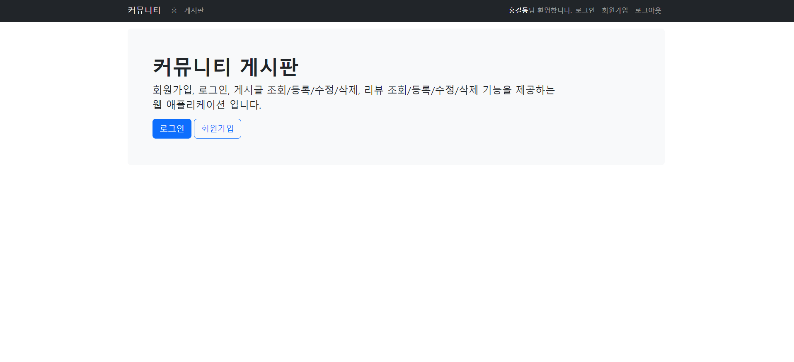

# 0603

- [0603](#0603)
- [board app](#board-app)
	- [기능 추가](#기능-추가)
		- [1. DB 테이블 추가](#1-db-테이블-추가)
		- [2. 회원가입](#2-회원가입)
		- [3. 로그인](#3-로그인)
		- [4. 로그아웃](#4-로그아웃)
		- [5. 게시글 등록](#5-게시글-등록)
		- [6. 게시글 목록조회](#6-게시글-목록조회)
		- [7. 게시글 상세정보 조회](#7-게시글-상세정보-조회)
		- [8. 게시글 삭제하기](#8-게시글-삭제하기)
		- [9. 게시글 수정하기](#9-게시글-수정하기)
		- [DaoHelper API](#daohelper-api)
		- [pagination](#pagination)
		- [StringUtil](#stringutil)
	- [실습코드](#실습코드)

<small><i><a href='http://ecotrust-canada.github.io/markdown-toc/'>Table of contents generated with markdown-toc</a></i></small>

# board app

## 기능 추가
### 1. DB 테이블 추가
```sql
CREATE TABLE SAMPLE_BOARD_USERS (
    USER_NO NUMBER(6) CONSTRAINT SAMPLE_BOARD_USERNO_PK PRIMARY KEY,
    USER_ID VARCHAR2(20) CONSTRAINT SAMPLE_BOARD_USERID_UK UNIQUE,
    USER_PASSWORD VARCHAR2(20) NOT NULL,
    USER_NAME VARCHAR2(100) NOT NULL,
    USER_EMAIL VARCHAR2(255) CONSTRAINT SAMPLE_BOARD_USEREMAIL_UK UNIQUE,
    USER_CREATED_DATE DATE DEFAULT SYSDATE
);

CREATE TABLE SAMPLE_BOARDS (
    BOARD_NO NUMBER(6) CONSTRAINT SAMPLE_BOARD_NO_PK PRIMARY KEY,
    BOARD_TITLE VARCHAR2(255) NOT NULL,
    WRITER_NO NUMBER(6) CONSTRAINT SAMPLE_BOARD_WRITERNO_FK REFERENCES SAMPLE_BOARD_USERS (USER_NO) NOT NULL,
    BOARD_CONTENT LONG NOT NULL,
    BOARD_VIEW_COUNT NUMBER(6) DEFAULT 0,
    BOARD_LIKE_COUNT NUMBER(6) DEFAULT 0,
    BOARD_DELETED CHAR(1) DEFAULT 'N',
    BOARD_CREATED_DATE DATE DEFAULT SYSDATE,
    BOARD_UPDATED_DATE DATE
);

CREATE TABLE SAMPLE_BOARD_LIKE_USERS (
    BOARD_NO NUMBER(6) CONSTRAINT SAMPLE_BOARD_NO_FK REFERENCES SAMPLE_BOARDS (BOARD_NO),
    USER_NO NUMBER(6) CONSTRAINT SAMPLE_USER_NO_FK REFERENCES SAMPLE_BOARD_USERS (USER_NO),
    CONSTRAINT SAMPLE_BOARD_LIKE_USERS_PK PRIMARY KEY (BOARD_NO, USER_NO)
);

CREATE SEQUENCE SAMPLE_BOARDUSERS_SEQ;
CREATE SEQUENCE SAMPLE_BOARDS_SEQ;
```

### 2. 회원가입
* vo 
    * User.java
    	* 멤버변수
      			* no, id, password, name, email, createdDate
* dao	
    * UserDao.java
      		```java
    	// 아이디와 일치하는 사용자정보를 반환하는 메소드
    	public User getUserById(String id) throws SQLException { ... }
    	// 이메일이 일치하는 사용자정보를 반환하는 메소드
    	public User getUserByEmail(String email) throws SQLException { ... }
    	// 사용자정보를 저장하는 메소드
    	public void insertUser(User user) throws SQLException { ... }
    	```
* jsp
    * registerform.jsp
    	1. 요청파라미터로 전달된 오류 정보를 조회한다.
    		* 요청파라미터로 fail을 조회한다.
    		* fail이 null이 아니면, fail값은 id 혹은 email이다.
    		* fail이 id면 아이디 중복 오류가 발생한 경우며, 중복아이디는 id라는 요청파라미터로 조회해서 경고 메세지 부분에 출력한다.
    		* fail이 email이면 이메일 중복 오류가 발생한 경우며, 중복이메일은 email 요청파라미터로 조회해서 경고 메세지 부분에 출력한다.
    * register.jsp
    	1. 요청파라미터로 전달된 폼 입력값을 조회한다.
    		* 아이디, 비밀번호, 이름, 이메일을 조회한다.
    	2. 아이디로 사용자정보를 조회한다. 사용자정보가 존재하면 registerform.jsp를 재요청하는 URL을 응답으로 보낸다.
    		* 재요청URL: registerform.jsp?fail=id&id=hong
    	3. 이메일로 사용자정보를 조회한다. 사용자정보가 존재하면 registerform.jsp를 재요청하는 URL을 응답으로 보낸다.
    		* 재요청URL: registerform.jsp?fail=email&email=hong@gmail.com
    	4. User 객체를 생성해서 사용자정보를 담는다.
    	5. 사용자정보를 데이터베이스에 저장시킨다.
    	6. complete.jsp를 재요청하는 URL을 응답으로 보낸다.
    * complete.jsp

### 3. 로그인
* vo
    * User.java
    	* 추가구현내용 없음
* dao
    * UserDao.java
    	* 추가구현내용 없음
    	* `public User getUserById(String id) throws SQLException { ... }` 메소드 활용		
* jsp
    * loginform.jsp
    	1. 요청파라미터로 전달된 오류 정보를 조회한다.
    		* 요청파라미터에서 fail을 조회한다.
    		* fail로 조회한 값이 invalid면 경고메세지 부분을 출력한다.
    * login.jsp
    	1. 요청파라미터로 전달된 폼 입력값을 조회한다.
    		* 아이디, 비밀번호를 조회한다.
    	2. 아이디로 사용자정보를 조회한다, 사용자 정보가 존재하지 않으면 재요청 URL을 보낸다.
    		* 재요청 URL : loginform.jsp?fail=invalid
    	3. 조회된 사용자정보의 비밀번호와 로그인폼에서 입력한 비밀번호를 비교해서 일치하지 않으면 재요청 URL을 응답으로 보낸다.
    		* 재요청 URL : loginform.jsp?fail=inavlid
    	4. 사용자정보 인증이 완료되면 세션객체에 사용자 정보를 저장한다
    	5. 사용자로그인이 완료되면 재 요청URL을 응답으로 보낸다.
    		* 재요청 URL : home.jsp

### 4. 로그아웃
* vo	
	* User.java
		* 추가구현내용 없음
* dao	
	* UserDao.java
		* 추가구현내용 없음
* jsp
	* logout.jsp
		* 1. 세션객체를 무효화시킨다.
		* 2. 재요청 URL을 응답으로 보낸다.
			* 재요청 URL : home.jsp

### 5. 게시글 등록
* vo
	* Board.java
		* 멤버변수와 getter/setter를 정의한다.
		* no, title, writerNo, content, viewCount, likeCount, deleted, createdDate, updatedDate 
* dao
	* BoardDao.java
    	```java
  		// 게시글 정보를 전달받아서 테이블에 저장한다.
        public void insertBoard(Board board) throws SQLException { ... }
		```

* jsp
	* list.jsp
		1. 로그인된 사용자 정보를 조회한다.
			* 로그인된 사용자정보가 존재하지 않으면 "새 글쓰기"버튼을 비활성화한다.
	* form.jsp
		* 게시글 입력폼 화면을 제공한다.
	* add.jsp
		1. 로그인된 사용자 정보를 조회한다.
			* 로그인된 사용자정보가 존재하지 않으면 재요청 URL을 응답으로 보낸다.
			* 재요청 URL : loginform.jsp?fail=deny
		2. 요청파라미터로 전달된 제목, 내용을 조회한다.
		3. Board객체를 생성해서 제목, 내용, 로그인된 사용자번호를 객체에 저장한다.
		4. Board객체에 저장된 값을 데이터베이스에 저장시킨다.
		5. 재요청 URL을 응답으로 보낸다.
			* 재요청 URL : list.jsp?page=1

### 6. 게시글 목록조회
* dto
	* BoardListDto.java
		* no, title, writer, viewCount, likeCount, createdDate
		* writer는 작성자 이름이다.
* dao
	* BoardDao.java
    	```java
		// 조회구간에 해당하는 게시글을 반환한다.
		public List<BoardListDto> getBoardList(int beginIndex, int endIndex) throws SQLException { ... }
		// 총 게시글 수를 반환한다.
		public int getTotalRowCount() throws SQLException { ... }
		
		// 모든 게시글을 반환한다.
		public List<BoardListDto> getAllBoardList() throws SQLException { ... }
		```
* jsp
	* list.jsp
		* // 페이징 처리가 포함된 경우
    		1. 요청파라미터에서 페이지번호를 조회한다.
    		2. 표시할 행의 갯수, 표시할 페이지번호 갯수를 정한다.
    		3. 총 게시글 갯수를 조회한다.
    		4. 총 페이지 갯수와 총 페이지블록 갯수를 계산한다.
    		5. 페이지번호로 현재 페이지 블록 번호를 계산한다.
    		6. 페이지블록번호를 이용해서 시작페이지번호와 끝페이지번호를 계산한다.
    		7. 페이지번호로 조회범위를 계산한다.
    		8. 조회범위에 해당하는 게시글 정보를 조회한다.
    		9. 조회된 게시글 정보로 tbody의 tr행을 생성한다.
    		10. 6번에서 계산한 시작페이지번호와 끝페이지번호로 페이지 번호를 출력한다.

		* // 페이징 처리가 포함되지 않는 경우
    		1. 모든 게시글 정보를 조회한다.
    		2. 조회된 게시글 정보로 tbody의 tr 행을 생성한다.
		

### 7. 게시글 상세정보 조회
* dto
	* BoarDetailDto.java
		* no, title, writerNo, writer, viewCount, likeCount, content, createdDate, updatedDate
		* writer은 작성자 이름이다.
	* BoardLikeUser.java
		* boardNo, userNo
* Dao	
	* BoardDao.java
    	```java
		// 게시글 번호를 전달받아서 게시글 상세정보를 반환한다.
		public BoardDetailDto getBoardDetailByNo(int boardNo) throws SQLException { ... }		
		// * 작성자 이름을 조회하기 위해서 sample_boards와 sample_board_users 테이블 조인해야 함.
		// 게시글을 추천한 사용자이름을 조회해서 반환한다.
		public List<String> getLikeUserNames(int boardNo) throws SQLException { ... }
		// 게시글 번호와 사용자 번호를 전달해서 받아서 게시글 추천인 정보를 반환한다.
		public BoardLikeUser getBoardLikeUser(int boardNo, int userNo) throws SQLException { ... }
		* sample_board_like_users 테이블에서 조회한다.
		// 변경된 게시글 정보를 전달받아서 테이블에 반영함
		public void updateBoard(Board board) throws SQLException { ... }
		```
* jsp
	* detail.jsp
		1. 요청파라미터에서 게시글 번호를 조회한다.
		2. 게시글번호로 게시글 상세정보와 게시글을 추천한 사용자이름을 조회한다.
		3. 게시글의 조회수를 1증가시킨다.
		4. Board 객체를 생성해서 2번에서 조회한 게시글 상세정보를 복사한다.
		5. 조회수가 증가된 게시글 정보를 테이블에 반영시킨다.
		6. 조회된 게시글 상세정보로 출력한다.
		7. 조회된 사용자이름을 detail.jsp의 98번째 라인의 `<span class="badge text-bg-secondary p-2">홍길동</span>` 태그를 생성한다.
		8. 로그인된 사용자 정보를 조회한다.
			* 로그인된 사용자 정보가 존재하고, 로그인된 사용자 번호와 게시글의 작성자번호가 동일하면 수정/삭제 버튼을 활성화한다. 
			* 로그인된 사용자 정보가 존재하고, 이 게시글을 추천한 적이 없으면 추천 버튼을 활성화한다.
		

### 8. 게시글 삭제하기		
* vo 
	* Board.java
* dao
	* BoardDao.java
		```java
		// 게시글 번호를 전달받아서 게시글 정보를 반환한다.
		public Board getBoardByNo(int boardNo) throws SQLException { ... }
		// * sample_board_users와 조인할 필요없음, 수정폼에서 사용자정보를 노출하지 않음
		// 변경된 게시글 정보를 전달받아서 테이블에 반영함
		public void updateBoard(Board board) throws SQLException { ... }
		```
* jsp
	* delete.jsp
		1. 로그인된 사용자 정보를 조회한다
			* 로그인된 사용자 정보가 존재하지 않으면 재요청 URL을 응답으로 보낸다.
		2. 요청파라미터에서 게시글 번호를 조회한다.
		3. 게시글 번호에 해당하는 게시글 정보를 조회한다.
		4. 게시글 작성자 번호와 로그인한 사용자번호가 일치하지 않으면 재요청 URL을 응답으로 보낸다.
			* 재요청 URL : list.jsp?page=1
		5. 게시글 정보의 deleted값을 Y로 변경한다.
		6. 변경된 게시글 정보를 데이터베이스에 반영시킨다.
		7. 재요청 URL을 응답으로 보낸다.
			* 재요청 URL : list.jsp?page=1


### 9. 게시글 수정하기
* vo 
	* Board.java
* dao
	* BoardDao.java
    	```java
		// 게시글 번호를 전달받아서 게시글 정보를 반환한다.
		public Board getBoardByNo(int boardNo) throws SQLException { ... }
		// * sample_board_users와 조인할 필요없음, 수정폼에서 사용자정보를 노출하지 않음
		// 변경된 게시글 정보를 전달받아서 테이블에 반영함
		public void updateBoard(Board board) throws SQLException { ... }
		```
* jsp
	* modifyform.jsp
		1. 로그인된 사용자정보를 조회한다.
			* 로그인된 사용자정보가 존재하지 않으면 재요청 URL을 응답으로 보낸다.
			* 재요청 URL : loginform.jsp?fail=deny
		2. 요청파라미터에서 게시글 번호를 조회한다.
		3. 게시글번호에 해당하는 게시글 정보를 조회한다.
		4. 조회된 게시글 정보를 hidden 필드와 입력필드에 출력한다.
	* modify.jsp
		1. 로그인된 사용자정보를 조회한다.
			* 로그인된 사용자정보가 존재하지 않으면 재요청 URL을 응답으로 보낸다.
			* 재요청 URL : loginform.jsp?fail=deny
		2. 요청파라미터로 전달된 게시글번호, 제목, 내용을 조회한다.
		3. 게시글 번호에 해당하는 게시글 정보를 조회한다.
			* 게시글 작성자 번호와 로그인 사용자번호가 일치하지 않으면 재요청 URL을 응답으로 보낸다.
			* 재요청 URL : list.jsp?page=1
		4. 조회된 게시글정보에 변경된 제목과 내용을 저장한다.
		5. 변경된 게시글정보를 데이터베이스에 반영시킨다.
		6. 재요청 URL을 응답으로 제공한다.
			* 재요청URL : list.jsp?page=1

### DaoHelper API
DaoHelper API
```java
	void insert(String sql, Object ...parameters)
		// sql은 실행할 쿼리
		// parameters는 SQL의 ?에 바인딩된 값을 나열한다.
	void update(String sql, Object ...parameters)
		// sql은 실행할 쿼리
		// parameters는 SQL의 ?에 바인딩된 값을 나열한다.
	void delete(String sql, Object ...parameters)
		// sql은 실행할 쿼리
		// parameters는 SQL의 ?에 바인딩된 값을 나열한다.


	public void insertUser(User user) throws SQLException {
		String sql = "insert into users(user_no, user_id, user_pwd, user_name, user_email) "
			   + "values (user_seq.nextval, ?,?,?,?)";
		daoHelper.insert(sql, user.getId(), user.getPwd(), user.getName(), user.getEmail());
	}	

	public void deleteUserByNo(int userNo) throws SQLException {
		String sql = "delete from users where user_no = ?";
		daoHelper.delete(sql, userNo);
	}

	public void updateBoard(Board board) throws SQLException {
		String sql = "update boards "
			   + "set "
			   + "  board_title = ?, "
			   + "  board_cotent = ?, "
			   + "  board_updated_date = sysdate "
			   + "where board_no = ? ";
		daoHelper.update(sql, board.getTitle(), board.getContent(), board.getNo())
	}


	T selectOne(String sql, RowMapper<T> rowMapper)
		// sql은 실행할 쿼리
		// rowMapper는 ResultSet의 값을 지정된 타입으로 변환한다.
		// * selectOne는 값 하나 혹은 객체 하나를 반환한다.
	T selectOne(String sql, RowMapper<T> rowMapper, Object ...parameters)
		// sql은 실행할 쿼리
		// rowMapper는 ResultSet의 값을 지정된 타입으로 변환한다.
		// parameters는 SQL의 ?에 바인딩된 값을 나열한다.
		// * selectOne는 값 하나 혹은 객체 하나를 반환한다.
	List<T> selectList(String sql, RowMapper<T> rowMapper)
		// sql은 실행할 쿼리
		// rowMapper는 ResultSet의 값을 지정된 타입으로 변환한다.
		// * selectList는 List객체에 값 혹은 객체를 여러 개 담아서 반환한다.
	List<T> selectList(String sql, RowMapper<T> rowMapper, Object ...parameters)
		// sql은 실행할 쿼리
		// rowMapper는 ResultSet의 값을 지정된 타입으로 변환한다.
		// parameters는 SQL의 ?에 바인딩된 값을 나열한다.
		// * selectList는 List객체에 값 혹은 객체를 여러 개 담아서 반환한다.

	// * select문의 실행 형태는
		// helper.selectOne(sql, rs -> {})
		// helper.selectOne(sql, rs -> {}, ?에 바인딩될 값, ?에 바인딩될 값)
		// helper.selectList(sql, rs -> {})
		// helper.selectList(sql, rs -> {}, ?에 바인딩될 값, ?에 바인딩될 값)

		public int getTotalRows() {
			String sql = "select count(*) cnt from employees ";
			return helper.selectOne(sql, rs -> {
				return rs.getInt("cnt");
			});
		}
		public List<String> getAllJobId() {
			String sql = "select job_id from jobs";
			return helper.selectList(sql, rs -> {
				return rs.getString("job_id");
			});
		}
		public Employee getEmployeeById(int id) {
			String sql = "select * from employees where employee_id = ?";
			return helper.selectOne(sql, rs -> {
				Employee employee = new Employee();
				employee.setId(rs.getInt("employee_id"));
				employee.setFirstName(rs.getString("first_name"));

				return employee;
			});
		}
		public List<Employee> getEmployeeById(int minSalary, int maxSalary) {
			String sql = "select * from employees where salary >= ? and salary <= ?";
			return helper.selectList(sql, rs -> {
				Employee employee = new Employee();
				employee.setId(rs.getInt("employee_id"));
				employee.setFirstName(rs.getString("first_name"));

				return employee;
			}, minSalary, maxSalary);
		}

```
```java
package helper;

import java.sql.Connection;
import java.sql.DriverManager;
import java.sql.PreparedStatement;
import java.sql.ResultSet;
import java.sql.SQLException;
import java.sql.Types;
import java.util.ArrayList;
import java.util.Date;
import java.util.List;

/**
 * 데이터베이스 엑세스 헬프 클래스다.
 * @author lee_e
 *
 */
public class DaoHelper {

	private static DaoHelper instance = new DaoHelper();
	private DaoHelper() {}
	public static DaoHelper getInstance() {
		return instance;
	}
	
	/**
	 * SELECT문을 실행한다.
	 * * @param <T> 조회결과를 저장하는 객체
	 * @param sql SELECT SQL 문
	 * @param rowMapper ResultSet을 지정된 객체로 매핑하는 객체
	 * @return 조회결과가 저장된 객체, 조회결과가 없으면 null을 반환한다.
	 * @throws SQLException
	 */
	public <T> T selectOne(String sql, RowMapper<T> rowMapper) throws SQLException {
		return queryForObject(sql, rowMapper, new Object[] {});
	}
	
	/**
	 * SELECT문을 실행한다.
	 * @param <T> 조회결과를 저장하는 객체
	 * @param sql SELECT SQL 문
	 * @param rowMapper ResultSet을 지정된 객체로 매핑하는 객체
	 * @param parameters SELECT 문의 ?에 바인딩되는 값
	 * @return 조회결과가 저장된 객체, 조회결과가 없으면 null을 반환한다.
	 * @throws SQLException
	 */
	public <T> T selectOne(String sql, RowMapper<T> rowMapper, Object ...parameters) throws SQLException {
		return queryForObject(sql, rowMapper, parameters);
	}

	/**
	 * SELECT문을 실행한다.
	 * @param <T> 조회결과를 저장하는 객체
	 * @param sql SELECT SQL 문
	 * @param rowMapper ResultSet을 지정된 객체로 매핑하는 객체
	 * @return 조회결과가 포함된 List객체
	 * @throws SQLException
	 */
	public <T> List<T> selectList(String sql, RowMapper<T> rowMapper) throws SQLException {
		return queryForList(sql, rowMapper, new Object[] {});
	}
	
	/**
	 * SELECT문을 실행한다.
	 * @param <T> 조회결과를 저장하는 객체
	 * @param sql SELECT SQL 문
	 * @param rowMapper ResultSet을 지정된 객체로 매핑하는 객체
	 * @return 조회결과가 포함된 List객체
	 * @param parameters SELECT 문의 ?에 바인딩되는 값
	 * @return 조회결과가 포함된 List객체
	 * @throws SQLException
	 */
	public <T> List<T> selectList(String sql, RowMapper<T> rowMapper, Object ...parameters) throws SQLException {
		return queryForList(sql, rowMapper, parameters);
	}
	
	/**
	 * INSERT문을 실행한다.
	 * @param sql INSERT SQL 문
	 * @throws SQLException
	 */
	public void insert(String sql) throws SQLException {
		executeUpdate(sql, new Object[] {});
	}
	
	/**
	 * INSERT문을 실행한다.
	 * @param sql INSERT SQL 문
	 * @param parameters INSERT 문의 ?에 바인딩되는 값
	 * @throws SQLException
	 */
	public void insert(String sql, Object ...parameters) throws SQLException {
		executeUpdate(sql, parameters);
	}
	
	/**
	 * UPDATE문을 실행한다.
	 * @param sql UPDATE SQL 문
	 * @throws SQLException
	 */
	public void update(String sql) throws SQLException {
		executeUpdate(sql, new Object[] {});
	}
	
	/**
	 * UPDATE문을 실행한다.
	 * @param sql UPDATE SQL 문
	 * @param parameters UPDATE 문의 ?에 바인딩되는 값
	 * @throws SQLException
	 */
	public void update(String sql, Object ...parameters) throws SQLException  {
		executeUpdate(sql, parameters);
	}
	
	/**
	 * DELETE문을 실행한다.
	 * @param sql DELETE SQL 문
	 * @throws SQLException
	 */
	public void delete(String sql) throws SQLException {
		executeUpdate(sql, new Object[] {});
	}
	
	/**
	 * DELETE문을 실행한다.
	 * @param sql DELETE SQL 문
	 * @param parameters DELETE 문의 ?에 바인딩되는 값
	 * @throws SQLException
	 */
	public void delete(String sql, Object ...parameters) throws SQLException {
		executeUpdate(sql, parameters);
	}
	
	private <T> T queryForObject(String sql, RowMapper<T> rowMapper, Object... parameters) throws SQLException {
		T t = null;
		Connection connection = this.getConnection();
		PreparedStatement pstmt = createPreparedStatement(connection, sql, parameters);
		ResultSet rs = pstmt.executeQuery();
		if (rs.next()) {
			t = rowMapper.mapRow(rs);
		}
		rs.close();
		pstmt.close();
		connection.close();
		
		return t;
	}
	
	private <T> List<T> queryForList(String sql, RowMapper<T> rowMapper, Object... parameters) throws SQLException {
		List<T> list = new ArrayList<>();
		Connection connection = this.getConnection();
		PreparedStatement pstmt = createPreparedStatement(connection, sql, parameters);
		ResultSet rs = pstmt.executeQuery();
		while (rs.next()) {
			list.add(rowMapper.mapRow(rs));			
		}
		rs.close();
		pstmt.close();
		connection.close();
		
		return list;
	}

	private void executeUpdate(String sql, Object ...parameters) throws SQLException {
		Connection connection = this.getConnection();
		PreparedStatement pstmt = createPreparedStatement(connection, sql, parameters);
		pstmt.executeUpdate();
		pstmt.close();
		connection.close();
	}
	
	private PreparedStatement createPreparedStatement(Connection connection, String sql, Object ...parameters) throws SQLException {
		PreparedStatement pstmt = connection.prepareStatement(sql);
		
		int position = 1;
		for (Object obj : parameters) {
			if (obj == null) {
				pstmt.setNull(position++, Types.NULL);
				continue;
			}
			if (obj instanceof Integer) {
				pstmt.setInt(position++, ((Integer) obj).intValue());
			} else if (obj instanceof Long) {
				pstmt.setLong(position++, ((Long) obj).longValue());
			} else if (obj instanceof Double) {
				pstmt.setDouble(position++, ((Double) obj).doubleValue());
			} else if (obj instanceof String) {
				pstmt.setString(position++, obj.toString());
			} else if (obj instanceof Date) {
				pstmt.setDate(position++, new java.sql.Date(((Date) obj).getTime()));
			}
		}
		return pstmt;
	}
	
	private static final String URL = "jdbc:oracle:thin:@localhost:1521:xe";
	private static final String USER_NAME = "hr";
	private static final String PASSWORD = "zxcv1234";
	
	static {
		try {
			Class.forName("oracle.jdbc.OracleDriver");
		} catch (ClassNotFoundException e) {
			throw new RuntimeException(e);
		}
	}
	
	private Connection getConnection() throws SQLException {
		return DriverManager.getConnection(URL, USER_NAME, PASSWORD);
	}
	
	/**
	 * ResultSet객체가 포함하고 있는 행의 정보를 지정된 객체에 담아서 반환한다.
	 * @author lee_e
	 *
	 * @param <T>
	 */
	public interface RowMapper<T> {

		/**
		 * ResultSet객체에서 현재 커서와 위치한 행의 정보를 조회해서 지정된 객체로 반환한다.
		 * @param rs
		 * @return
		 * @throws SQLException
		 */
		T mapRow(ResultSet rs) throws SQLException;
	}
}

```

### pagination
Paingation.java
```java
package vo;

public class Pagination {

	private int rows;				// 한 화면에 표시할 데이터 갯수
	private int pages;				// 한 화면에 출력한 페이지번호 갯수
	private int totalRows;			// 전체 데이터 갯수
	private int currentPage;		// 요청한 페이지 번호
	private int totalPages;			// 전체 페이지 갯수
	private int totalBlocks;		// 전체 페이지번호 블록 갯수
	private int currentBlock;		// 요청한 페이지 번호에 대한 현재 페이지의 블록번호
	private int beginPage;			// 시작 페이지번호
	private int endPage;			// 끝 페이지번호
	private int beginIndex;			// 데이터 조회 시작위치
	private int endIndex;			// 데이터 조회 끝위치
	
	public Pagination(int totalRows, int currentPage) {
		this(5, totalRows, currentPage);
	}
	
	public Pagination(int rows, int totalRows, int currentPage) {
		this.rows = rows;
		this.pages = 5;
		this.totalRows = totalRows;
		this.currentPage = currentPage;
		init();
	}
	
	public void init() {
		if (totalRows == 0) {
			return;
		}
		
		this.totalPages = (int) Math.ceil((double) totalRows/rows);
		this.totalBlocks = (int )Math.ceil((double) totalPages/pages);
		if (currentPage <= 0) {
			this.currentPage = 1;
		}
		if (currentPage > totalPages) {
			this.currentPage = totalPages;
		}
		this.currentBlock = (int) (int) Math.ceil((double) currentPage/pages);
		this.beginPage = (currentBlock - 1)*pages + 1;
		this.endPage = currentBlock*pages;
		if (currentBlock == totalBlocks) {
			this.endPage = totalPages;
		}
		this.beginIndex = (currentPage - 1)*rows + 1;
		this.endIndex = currentPage*rows;
	}

	public int getRows() {
		return rows;
	}

	public int getPages() {
		return pages;
	}

	public int getTotalRows() {
		return totalRows;
	}

	public int getCurrentPage() {
		return currentPage;
	}

	public int getTotalPages() {
		return totalPages;
	}

	public int getTotalBlocks() {
		return totalBlocks;
	}

	public int getCurrentBlock() {
		return currentBlock;
	}

	public int getBeginPage() {
		return beginPage;
	}

	public int getEndPage() {
		return endPage;
	}

	public int getBeginIndex() {
		return beginIndex;
	}

	public int getEndIndex() {
		return endIndex;
	}

}

```

### StringUtil
```java
package util;

public class StringUtil {

	/**
	 * value가 null이면 빈 문자열을 반환한다
	 * @param value 텍스트
	 * @return 빈 문자열 혹은 원래 문자열
	 */
	public static String nullToBlank(String value) {
		return value == null ? "" : value;
	}
	
	/**
	 * 문자열을 정수로 변환한다. 
	 * @param value 문자열
	 * @return 정수, 숫자로 변환되지 않는 경우, 0을 반환한다.
	 */
	public static int stringToInt(String value) {
		return stringToInt(value, 0);
	}
	
	/**
	 * 문자열을 정수로 변환한다.
	 * @param value 문자열
	 * @param defaultValue 기본값
	 * @return 정수, 숫자로 변환되지 않는 경우 defaultValue로 지정한 값이 반환된다.
	 */
	public static int stringToInt(String value, int defaultValue) {
		try {
			return Integer.parseInt(value);
		} catch (NumberFormatException e) {
			return defaultValue;
		}
	}
	
	/**
	 * 문자열을 정수로 변환한다.
	 * @param value 문자열
	 * @return 정수, 숫자로 변환되지 않는 경우 0L이 반환된다.
	 */
	public static long stringToLong(String value) {
		return stringToLong(value, 0L);
	}
	
	/**
	 * 문자열을 정수로 변환한다.
	 * @param value 문자열
	 * @param defaultValue 기본값
	 * @return 정수, 숫자로 변환되지 않는 경우 defaultValue로 지정한 값이 반환된다.
	 */
	public static long stringToLong(String value, long defaultValue) {
		try {
			return Long.parseLong(value);
		} catch (NumberFormatException e) {
			return defaultValue;
		}
	}
	
	/**
	 * 문자열을 실수로 변환한다.
	 * @param value 문자열
	 * @return 실수, 숫자로 변환되지 않는 경우 0.0을 반환한다.
	 */
	public static double stringToDouble(String value) {
		return stringToDouble(value, 0.0);
	}
	
	/**
	 * 문자열을 정수로 변환한다.
	 * @param value 문자열
	 * @param defaultValue 기본값
	 * @return 정수, 숫자로 변환되지 않는 경우 defaultValue로 지정한 값이 반환된다.
	 */
	public static double stringToDouble(String value, double defaultValue) {
		try {
			return Double.parseDouble(value);
		} catch (NumberFormatException e) {
			return defaultValue;
		}
	}
}

```

## 실습코드
UserDao.java
```java
package dao;

import java.sql.SQLException;

import helper.DaoHelper;
import vo.User;

public class UserDao {
	private static UserDao instance = new UserDao();
	private UserDao() {}
	public static UserDao getInstance() {
		return instance;
	}

	private DaoHelper helper = DaoHelper.getInstance();
	
	public void insertUser(User user) throws SQLException {
		String sql = "insert into sample_board_users "
				   + "(user_no, user_id, user_password, user_name, user_email) "
				   + "values "
				   + "(sample_boardusers_seq.nextval, ?, ?, ?, ?)";
		helper.insert(sql, user.getId(), user.getPassword(), user.getName(), user.getEmail());
	}
	
	public User getUserById(String id) throws SQLException {
		String sql = "select * "
				   + "from sample_board_users "
				   + "where user_id = ? ";
		
		return helper.selectOne(sql, rs -> {
			User user = new User();
			user.setNo(rs.getInt("user_no"));
			user.setId(rs.getString("user_id"));
			user.setPassword(rs.getString("user_password"));
			user.setName(rs.getString("user_name"));
			user.setEmail(rs.getString("user_email"));
			user.setCreatedDate(rs.getDate("user_created_date"));
			
			return user;
		}, id);
	}
	
	public User getUserByEmail(String id) throws SQLException {
		String sql = "select * "
				   + "from sample_board_users "
				   + "where user_id = ? ";
		
		return helper.selectOne(sql, rs -> {
			User user = new User();
			user.setNo(rs.getInt("user_no"));
			user.setId(rs.getString("user_id"));
			user.setPassword(rs.getString("user_password"));
			user.setName(rs.getString("user_name"));
			user.setEmail(rs.getString("user_email"));
			user.setCreatedDate(rs.getDate("user_created_date"));
			
			return user;
		}, id);
	}
		
}

```

BoardDao.java
```java
package dao;

import java.sql.SQLException;
import java.util.List;

import helper.DaoHelper;
import vo.Board;
import vo.BoardLikeUser;
import vo.User;

public class BoardDao {

	private static BoardDao instance = new BoardDao();
	private BoardDao() {}
	public static BoardDao getInstance() {
		return instance;
	}
	
	private DaoHelper helper = DaoHelper.getInstance();
	
	public void insertBoard(Board board) throws SQLException {
		String sql = "insert into sample_boards "
				   + "(board_no, board_title, writer_no, board_content)"
				   + "values "
				   + "(sample_boards_seq.nextval, ?, ?, ?)";
		
		helper.insert(sql, board.getTitle(), board.getWriter().getNo(), board.getContent());
	}
	
	public int getTotalRows() throws SQLException {
		String sql = "select count(*) cnt "
				   + "from sample_boards "
				   + "where board_deleted = 'N' ";
		
		return helper.selectOne(sql, rs -> {
			return rs.getInt("cnt");
		});
	}
	
	public List<Board> getBoards(int beginIndex, int endIndex) throws SQLException {
		String sql = "select B.board_no, B.board_title, B.writer_no, U.user_name, B.board_view_count, B.board_like_count, B.board_created_date "
				   + "from (select board_no, board_title, writer_no, board_view_count, board_like_count, board_created_date, "
				   + "             row_number() over (order by board_no desc) row_number "
				   + "      from sample_boards "
				   + "      where board_deleted = 'N') B, sample_board_users U "
				   + "where B.row_number >= ? and B.row_number <= ? "
				   + "and B.writer_no = U.user_no "
				   + "order by B.board_no desc ";
		
		return helper.selectList(sql, rs -> {
			Board board = new Board();
			board.setNo(rs.getInt("board_no"));
			board.setTitle(rs.getString("board_title"));
			
			User user = new User();
			user.setNo(rs.getInt("writer_no"));
			user.setName(rs.getString("user_name"));
			board.setWriter(user);
			
			board.setViewCount(rs.getInt("board_view_count"));
			board.setLikeCount(rs.getInt("board_like_count"));
			board.setCreatedDate(rs.getDate("board_created_date"));
			
			return board;
		}, beginIndex, endIndex);
	}
	
	public Board getBoardByNo(int boardNo) throws SQLException {
		String sql = "select B.board_no, B.board_title, B.writer_no, U.user_name, B.board_content, B.board_view_count, B.board_like_count, B.board_created_date "
				   + "from sample_boards B, sample_board_users U "
				   + "where B.board_no = ? "
				   + "and B.writer_no = U.user_no ";
		
		return helper.selectOne(sql, rs -> {
			Board board = new Board();
			board.setNo(rs.getInt("board_no"));
			board.setTitle(rs.getString("board_title"));
			
			User user = new User();
			user.setNo(rs.getInt("writer_no"));
			user.setName(rs.getString("user_name"));
			board.setWriter(user);
			
			board.setContent(rs.getString("board_content"));
			board.setViewCount(rs.getInt("board_view_count"));
			board.setLikeCount(rs.getInt("board_like_count"));
			board.setCreatedDate(rs.getDate("board_created_date"));
			
			return board;
		}, boardNo);
	}
	
	public List<String> getLikeUserNames(int boardNo) throws SQLException {
		String sql = "select U.user_name "
				   + "from sample_board_like_users L, sample_board_users U "
				   + "where L.board_no = ? "
				   + "and L.user_no = U.user_no "
				   + "order by U.user_name asc";
		
		return helper.selectList(sql, rs -> {
			return rs.getString("user_name");
		}, boardNo);
	}
	
	public void updateBoard(Board board) throws SQLException {
		String sql = "update sample_boards "
				   + "set "
				   + "		board_title = ?, "
				   + "		board_content = ?, "
				   + "		board_view_count = ?, "
				   + "		board_like_count = ?, "
				   + "		board_updated_date = sysdate "
				   + "where board_no = ? ";
		
		helper.update(sql, board.getTitle(), board.getContent(), board.getViewCount(), board.getLikeCount(), board.getNo());
	}
	
	public BoardLikeUser getBoardLikeUser(int boardNo, int userNo) throws SQLException {
		String sql = "select board_no, user_no "
				   + "from sample_board_like_users "
				   + "where board_no = ? and user_no = ? ";
		
		return helper.selectOne(sql, rs -> {
			return new BoardLikeUser(boardNo, userNo);
		}, boardNo, userNo);
	}
	
}

```

registerForm.jsp
```jsp
<%@ page language="java" contentType="text/html; charset=UTF-8"
    pageEncoding="UTF-8"%>
<!DOCTYPE html>
<html lang="ko">
<head>
<meta charset="UTF-8">
<meta name="viewport" content="width=device-width, initial-scale=1">
<title>커뮤니티 게시판</title>
<link href="favicon.ico" rel="icon" type="image/x-icon" />
<link href="https://cdn.jsdelivr.net/npm/bootstrap@5.2.0-beta1/dist/css/bootstrap.min.css" rel="stylesheet">
</head>
<body>
<jsp:include page="common/nav.jsp">
	<jsp:param name="name" value="register"/>
</jsp:include>
<div class="container mb-5">
	<div class="row">
		<div class="col">
			<h1 class="fs-4 border p-2">회원가입 폼</h1>
		</div>
	</div>
	<div class="row">
		<div class="col">
		<%
			String fail = request.getParameter("fail");
		%>
			<!--
				동일한 아이디로 가입된 사용자가 있는 경우 아래 내용을 출력한다.
			-->
		<%
			if ("id".equals(fail)) {
				String duplicatedId =  request.getParameter(fail);
		%>
			<div class="alert alert-danger">
				<strong>회원가입 실패</strong> [<%=duplicatedId %>]은 이미 사용중인 아이디 입니다.
			</div>
		<%
			}
		%>
			<!--
				동일한 이메일로 가입된 사용자가 있는 경우 아래 내용을 출력한다.
			-->
		<%
			if ("email".equals(fail)) {
				String duplictedEmail = request.getParameter(fail);
		%>
			<div class="alert alert-danger">
				<strong>회원가입 실패</strong> [<%=duplictedEmail %>]은 이미 사용중인 이메일입니다.
			</div>
		<%
			}
		%>
			<p>아이디, 비밀번호, 이름, 이메일, 성별를 입력하세요</p>
			<form class="border bg-light p-3" method="post" action="register.jsp" onsubmit="return submitRegisterForm()">
				<div class="row g-3">
					<div class="col-6">
						<label class="form-label">아이디</label>
						<input type="text" class="form-control" name="id">
					</div>
					<div class="col-6">
						<label class="form-label">비밀번호</label>
						<input type="password" class="form-control" name="password">
					</div>
					<div class="col-6">
						<label class="form-label">이름</label>
						<input type="text" class="form-control" name="name">
					</div>
					<div class="col-6">
						<label class="form-label">이메일</label>
						<input type="text" class="form-control" name="email">
					</div>
					<div class="col-12 text-end">
						<a href="home.jsp" class="btn btn-secondary">취소</a>
						<button type="submit" class="btn btn-primary">회원가입</button>
					</div>
				</div>
			</form>
		</div>
	</div>
</div>
<script src="https://cdn.jsdelivr.net/npm/bootstrap@5.2.0-beta1/dist/js/bootstrap.bundle.min.js"></script>
<script type="text/javascript">
	function submitRegisterForm() {
		let idField = document.querySelector("input[name=id]");
		if (idField.value === '') {
			alert("아이디는 필수입력값입니다.");
			idField.focus();
			return false;
		}
		let passwordField = document.querySelector("input[name=password]");
		if (passwordField.value === '') {
			alert("비밀번호는 필수입력값입니다.");
			passwordField.focus();
			return false;
		}
		let nameField = document.querySelector("input[name=name]");
		if (nameField.value === '') {
			alert("이름은 필수입력값입니다.");
			nameField.focus();
			return false;
		}
		let emailField = document.querySelector("input[name=email]");
		if (emailField.value === '') {
			alert("이메일은 필수입력값입니다.");
			emailField.focus();
			return false;
		}
		
		return true;
	}
</script>
</body>
</html>
```

register.jsp
```jsp
<%@page import="vo.User"%>
<%@page import="dao.UserDao"%>
<%@ page language="java" contentType="text/html; charset=UTF-8"
    pageEncoding="UTF-8"%>
<%
	// 요청파라미터로 전달된 폼입력값을 조회한다.
	String id = request.getParameter("id");
	String password = request.getParameter("password");
	String name = request.getParameter("name");
	String email = request.getParameter("email");
	
	UserDao userDao = UserDao.getInstance();

	// 아이디로 사용자정보를 조회해서 동일한 아이디로 저장된 사용자 정보가 있는지 확인한다.
	User savedUser = userDao.getUserById(id);
	if (savedUser != null) {
		response.sendRedirect("registerform.jsp?fail=id&id=" + id);
		return;
	}
	// 이메일로 사용자정보를 조회해서 동일한 이메일로 저장된 사용자 정보가 있는지 확인한다.
	savedUser = userDao.getUserByEmail(email);
	if (savedUser != null) {
		response.sendRedirect("registerform.jsp?fail=email&email=" + email);
	}
	
	// User객체를 생성해서 사용자정보를 저장한다.
	User user = new User();
	user.setId(id);
	user.setPassword(password);
	user.setName(name);
	user.setEmail(email);
	
	// 사용자정보를 데이터베이스에 저장시킨다.
	userDao.insertUser(user);
	
	// 재요청URL을 응답으로 보낸다.
	response.sendRedirect("complete.jsp");
%>
```

complete.jsp
```jsp
<%@ page language="java" contentType="text/html; charset=UTF-8"
    pageEncoding="UTF-8"%>
<!DOCTYPE html>
<html lang="ko">
<head>
<meta charset="UTF-8">
<meta name="viewport" content="width=device-width, initial-scale=1">
<title>커뮤니티 게시판</title>
<link href="favicon.ico" rel="icon" type="image/x-icon" />
<link href="https://cdn.jsdelivr.net/npm/bootstrap@5.2.0-beta1/dist/css/bootstrap.min.css" rel="stylesheet">
</head>
<body>
<jsp:include page="common/nav.jsp">
	<jsp:param name="name" value="login"/>
</jsp:include>
<div class="container">
	<div class="p-5 mb-4 bg-light rounded-3">
		<div class="container-fluid py-3">
			<h1 class="display-5 fw-bold">회원가입 완료</h1>
			<p class="fs-4">회원가입이 완료되었습니다.</p>
			<a href="loginform.jsp" class="btn btn-primary btn-lg">로그인</a>
		</div>
	</div>
</div>
<script src="https://cdn.jsdelivr.net/npm/bootstrap@5.2.0-beta1/dist/js/bootstrap.bundle.min.js"></script>
</body>
</html>
```

login.jsp
```jsp
<%@page import="vo.User"%>
<%@page import="dao.UserDao"%>
<%@ page language="java" contentType="text/html; charset=UTF-8"
    pageEncoding="UTF-8"%>
<%
	// 요청파라미터값을 조회한다.
	String id = request.getParameter("id");
	String password = request.getParameter("password");
	
	UserDao userDao = UserDao.getInstance();
	
	// 아이디로 사용자정보를 조회한다.
	User savedUser = userDao.getUserById(id);
	if (savedUser == null) {
		response.sendRedirect("loginform.jsp?fail=invalid");
		return;
	}
	
	// 비밀번호가 일치하는지 확인한다.
	if (!savedUser.getPassword().equals(password)) {
		response.sendRedirect("loginform.jsp?fail=invalid");
		return;
	}
	
	// 세션객체에 사용자정보를 저장한다.
	session.setAttribute("LOGINED_USER", savedUser);
	
	// 재요청URL을 응답으로 보낸다.
	response.sendRedirect("home.jsp");
%>
```

loginform.jsp
```jsp
<%@ page language="java" contentType="text/html; charset=UTF-8"
    pageEncoding="UTF-8"%>
<!DOCTYPE html>
<html lang="ko">
<head>
<meta charset="UTF-8">
<meta name="viewport" content="width=device-width, initial-scale=1">
<title>커뮤니티 게시판</title>
<link href="favicon.ico" rel="icon" type="image/x-icon" />
<link href="https://cdn.jsdelivr.net/npm/bootstrap@5.2.0-beta1/dist/css/bootstrap.min.css" rel="stylesheet">
</head>
<body>
<jsp:include page="common/nav.jsp">
	<jsp:param name="name" value="login"/>
</jsp:include>
<div class="container mb-5">
	<div class="row">
		<div class="col">
			<h1 class="fs-4 border p-2">로그인 폼</h1>
		</div>
	</div>
	<div class="row">
		<div class="col-6">
		<%
			String fail = request.getParameter("fail");
		%>
			<!--
				아이디 혹은 비밀번호가 일치하지 않는 경우 아래 내용이 출력된다.
			-->
		<%
			if ("invalid".equals(fail)) {
		%>
			<div class="alert alert-danger">
				<strong>로그인 실패</strong> 아이디 혹은 비밀번호가 올바르지 않습니다.
			</div>
		<%
			}
		%>
		<%
			if ("deny".equals(fail)) {
		%>
			<div class="alert alert-danger">
				<strong>서비스 거부</strong> 로그인이 필요한 서비스 입니다.
			</div>
		<%
			}
		%>
			<p>아이디, 비밀번호를 입력하세요</p>
			<form class="border bg-light p-3" method="post" action="login.jsp" onsubmit="return submitLoginForm()">
				<div class="mb-3">
					<label class="form-label">아이디</label>
					<input type="text" class="form-control" name="id">
				</div>
				<div class="mb-3">
					<label class="form-label">비밀번호</label>
					<input type="password" class="form-control" name="password">
				</div>
				<div class="text-end">
					<a href="home.jsp" class="btn btn-secondary">취소</a>
					<button type="submit" class="btn btn-primary">로그인</button>
				</div>
			</form>
		</div>
	</div>
</div>
<script src="https://cdn.jsdelivr.net/npm/bootstrap@5.2.0-beta1/dist/js/bootstrap.bundle.min.js"></script>
<script type="text/javascript">
	function submitLoginForm() {
		let idField = document.querySelector("input[name=id]");
		if (idField.value === '') {
			alert("아이디는 필수입력값입니다.");
			idField.focus();
			return false;
		}
		let passwordField = document.querySelector("input[name=password]");
		if (passwordField.value === '') {
			alert("비밀번호는 필수입력값입니다.");
			passwordField.focus();
			return false;
		}
		return true;
	}
</script>

</html>
```

logout.jsp
```jsp
<%@ page language="java" contentType="text/html; charset=UTF-8"
    pageEncoding="UTF-8"%>
<%
	// 세션객체를 무효화 시킨다.
	session.invalidate();

	// 재요청URL을 응답으로 보낸다.
	response.sendRedirect("home.jsp");
%>
```

home.jsp
```jsp
<%@ page language="java" contentType="text/html; charset=UTF-8"
    pageEncoding="UTF-8"%>
<!DOCTYPE html>
<html lang="ko">
<head>
<meta charset="UTF-8">
<meta name="viewport" content="width=device-width, initial-scale=1">
<title>커뮤니티 게시판</title>
<link href="favicon.ico" rel="icon" type="image/x-icon" />
<link href="https://cdn.jsdelivr.net/npm/bootstrap@5.2.0-beta1/dist/css/bootstrap.min.css" rel="stylesheet">
</head>
<body>
<jsp:include page="common/nav.jsp">
	<jsp:param name="name" value="home"/>
</jsp:include>
<div class="container">
	<div class="p-5 mb-4 bg-light rounded-3">
		<div class="container-fluid py-3">
			<h1 class="display-5 fw-bold">커뮤니티 게시판</h1>
			<p class="fs-4">회원가입, 로그인, 게시글 조회/등록/수정/삭제, 리뷰 조회/등록/수정/삭제 기능을 제공하는 <br/>웹 애플리케이션 입니다.</p>
			<!-- 
				로그인이 완료되면 아래 링크는 출력하지 않는다. 
			-->			
			<a href="loginform.jsp" class="btn btn-primary btn-lg">로그인</a>
			<a href="registerform.jsp" class="btn btn-outline-primary btn-lg">회원가입</a>
		</div>
	</div>
</div>
<script src="https://cdn.jsdelivr.net/npm/bootstrap@5.2.0-beta1/dist/js/bootstrap.bundle.min.js"></script>
</body>
</html>
```

form.jsp
```jsp
<%@ page language="java" contentType="text/html; charset=UTF-8"
    pageEncoding="UTF-8"%>
<!DOCTYPE html>
<html lang="ko">
<head>
<meta charset="UTF-8">
<meta name="viewport" content="width=device-width, initial-scale=1">
<title>커뮤니티 게시판</title>
<link href="favicon.ico" rel="icon" type="image/x-icon" />
<link href="https://cdn.jsdelivr.net/npm/bootstrap@5.2.0-beta1/dist/css/bootstrap.min.css" rel="stylesheet">
</head>
<body>
<jsp:include page="common/nav.jsp">
	<jsp:param name="name" value="board"/>
</jsp:include>
<div class="container">
	<div class="row">
		<div class="col">
			<h1 class="fs-4 border p-2">게시글 등록 폼</h1>
		</div>
	</div>
	<div class="row">
		<div class="col">
			<p>제목과 내용을 입력하세요. <p>
			<form class="border bg-light p-3" method="post" action="add.jsp" onsubmit="return submitBoardForm()">
				<div class="mb-3">
					<label class="form-label">제목</label>
					<input type="text" class="form-control" name="title" />
				</div>
				<div class="mb-3">
					<label class="form-label">내용</label>
					<textarea rows="10" class="form-control" name="content"></textarea>
				</div>
				<div class="text-end">
					<a href="list.jsp?page=1" class="btn btn-secondary">취소</a>
					<button type="submit" class="btn btn-primary">등록</button>
				</div>
			</form>
		</div>
	</div>
</div>
<script src="https://cdn.jsdelivr.net/npm/bootstrap@5.2.0-beta1/dist/js/bootstrap.bundle.min.js"></script>
<script type="text/javascript">
	function submitBoardForm() {
		let titleField = document.querySelector("input[name=title]");
		if (titleField.value === '') {
			alert("제목은 필수입력값입니다.");
			titleField.focus();
			return false;
		}
		let contentField = document.querySelector("textarea[name=content]");
		if (contentField.value === '') {
			alert("내용은 필수입력값입니다.");
			contentField.focus();
			return false;
		}
		return true;
	}
</script>
</body>
</html>
```

detail.jsp
```jsp
<%@page import="vo.BoardLikeUser"%>
<%@page import="vo.User"%>
<%@page import="java.util.List"%>
<%@page import="vo.Board"%>
<%@page import="dao.BoardDao"%>
<%@page import="util.StringUtil"%>
<%@ page language="java" contentType="text/html; charset=UTF-8"
    pageEncoding="UTF-8"%>
<!DOCTYPE html>
<html lang="ko">
<head>
<meta charset="UTF-8">
<meta name="viewport" content="width=device-width, initial-scale=1">
<title>커뮤니티 게시판</title>
<link href="favicon.ico" rel="icon" type="image/x-icon" />
<link href="https://cdn.jsdelivr.net/npm/bootstrap@5.2.0-beta1/dist/css/bootstrap.min.css" rel="stylesheet">
<style>
	.btn.btn-sx {--bs-btn-padding-y: .175rem; --bs-btn-padding-x: .5rem; --bs-btn-font-size: .75rem;}
</style>
</head>
<body>
<jsp:include page="common/nav.jsp">
	<jsp:param name="name" value="board"/>
</jsp:include>
<div class="container">
	<div class="row">
		<div class="col">
			<h1 class="fs-4 border p-2">게시글 보기</h1>
		</div>
	</div>
	<div class="row">
		<div class="col">
		<!--
			요청파라미터에서 게시글 번호를 조회하고, 게시글 번호에 맞는 글 정보를 조회해서 출력한다.
		-->
		<%
			// 요청파라미터에서 게시글 번호를 조회한다.
			int boardNo = StringUtil.stringToInt(request.getParameter("no"));
			
			BoardDao boardDao = BoardDao.getInstance();
			// 게시글 번호에 해당하는 게시글 정보를 조회한다.
			Board board = boardDao.getBoardByNo(boardNo);
			if (board == null) {
				response.sendRedirect("list.jsp");
				return;
			}
			
			// 조회숫자 증가시키기
			board.setViewCount(board.getViewCount() + 1);
			boardDao.updateBoard(board);
			
			// 이 게시글를 추천한 사용자명 조회하기
			List<String> userNames = boardDao.getLikeUserNames(boardNo);
			
		%>
			<p>게시글 정보을 확인하세요.<p>
			
			<table class="table table-bordered">
				<colgroup>
					<col width="10%">
					<col width="40%">
					<col width="10%">
					<col width="40%">
				</colgroup>
				<tbody>
					<tr>
						<th class="table-light text-center">제목</th>
						<td colspan="3"><%=board.getTitle() %></td>
					</tr>
					<tr>
						<th class="table-light text-center">조회수</th>
						<td><%=board.getViewCount() %></td>
						<td class="table-light text-center">추천수</td>
						<td><%=board.getLikeCount() %> 
							<!--  
								이 버튼을 클릭하면 이 글을 추천한 사용자 리스트를 표시하는 모달창이 표시됩니다.
							-->
						<%
							if (!userNames.isEmpty()) {
						%>
							<button type="button" class="btn btn-outline-primary btn-sx" data-bs-toggle="modal" data-bs-target="#modal-like-users">
								상세보기
							</button>
						<%
							}
						%>
						</td>
					</tr>
					<tr>
						<th class="table-light text-center">작성자</th>
						<td><%=board.getWriter().getName() %></td>
						<td class="table-light text-center">등록일</td>
						<td><%=board.getCreatedDate() %></td>
					</tr>
					<tr>
						<th class="table-light text-center">내용</th>
						<td colspan="3"><%=board.getContent() %></td>
					</tr>
				</tbody>
			</table>
		</div>
	</div>
	<div class="row">
		<div class="col">
			<!--  
				비로그인 상태일 때 아래 버튼은 전부 비활성화한다.
				수정/삭제 버튼은 작성자의 사용자번호와 로그인한 사용자의 사용자 번호가 동일할 때만 활성화한다.
				추천 버튼은 작성자의 사용자번호와 로그인한 사용자의 사용자 번호가 다를 때만 활성화한다.
				로그인한 사용자가 이 게시글에 대해서 좋아요를 등록한 경우 추천 버튼을 비활성화한다. 
			-->
		<%
			User user = (User) session.getAttribute("LOGINED_USER");
			// 수정/삭제버튼 비활성화 여부
			boolean isDisabled = true;
			if (user != null && user.getNo() == board.getWriter().getNo()) {
				isDisabled = false;
			}
			
		%>
			<a href="modifyform.jsp?no=100" class="btn btn-warning <%=isDisabled ? "disabled" : "" %>">수정</a>
			<a href="delete.jsp?no=100" class="btn btn-danger <%=isDisabled ? "disabled" : "" %>">삭제</a>
		<%
			// 추천버튼 비활성화 여부
			isDisabled = true;
			// 이 게시글을 로그인한 사용자가 이미 추천한 글인지 조회하기
			BoardLikeUser boardLikeUser = boardDao.getBoardLikeUser(board.getNo(), user.getNo());
			
			if (user != null && user.getNo() != board.getWriter().getNo() && boardLikeUser == null) {
				isDisabled = false;
			}
		%>
			<a href="like.jsp?no=100" class="btn btn-success float-end <%=isDisabled ? "disabled" : "" %>">추천</a>
		</div>
	</div>
	<!--  
		이 게시글에 추천한 사용자를 표시하는 모달창
	-->
	<div class="modal fade" id="modal-like-users" tabindex="-1" aria-labelledby="exampleModalLabel" aria-hidden="true">
		<div class="modal-dialog">
			<div class="modal-content">
				<div class="modal-header">
					<h5 class="modal-title" id="exampleModalLabel">이 글을 추천한 사용자</h5>
					<button type="button" class="btn-close" data-bs-dismiss="modal" aria-label="Close"></button>
				</div>
				<div class="modal-body">
				<!--  
					이 게시글에 좋아요를 클릭한 사용자명을 아래에 표시합니다.
				-->
				<%
					for (String userName : userNames) {
				%>
					<span class="badge text-bg-secondary p-2"><%=userName %></span>
				<%
					}
				%>
				</div>
				<div class="modal-footer">
					<button type="button" class="btn btn-primary" data-bs-dismiss="modal">확인</button>
				</div>
			</div>
		</div>
	</div>
</div>
<script src="https://cdn.jsdelivr.net/npm/bootstrap@5.2.0-beta1/dist/js/bootstrap.bundle.min.js"></script>
</body>
</html>
```

delete.jsp
```jsp
<%@ page language="java" contentType="text/html; charset=UTF-8"
    pageEncoding="UTF-8"%>
<%
	/*
		로그인 사용자정보를 조회해서 비로그인 상태면 게시글 상세정보를 재요청하는 url(detail.jsp?no=100)응답을 보낸다.
		
		요청파라미터에서 글번호를 조회해서 이 게시글을 상태를 삭제상태로 변경한다.
		로그인 사용자의 사용자번호와 게시글을 작성한 작성자의 사용자번호가 일치하는 경우에만 삭제상태로 변경한다. 
		
		삭제가 완료되면 게시글 목록을 재요청하는 url을 응답으로 보낸다.
	*/
%>
```

list.jsp
```jsp
<%@page import="vo.Board"%>
<%@page import="java.util.List"%>
<%@page import="vo.Pagination"%>
<%@page import="dao.BoardDao"%>
<%@page import="util.StringUtil"%>
<%@page import="vo.User"%>
<%@ page language="java" contentType="text/html; charset=UTF-8"
    pageEncoding="UTF-8"%>
<!DOCTYPE html>
<html lang="ko">
<head>
<meta charset="UTF-8">
<meta name="viewport" content="width=device-width, initial-scale=1">
<title>커뮤니티 게시판</title>
<link href="favicon.ico" rel="icon" type="image/x-icon" />
<link href="https://cdn.jsdelivr.net/npm/bootstrap@5.2.0-beta1/dist/css/bootstrap.min.css" rel="stylesheet">
</head>
<body>
<jsp:include page="common/nav.jsp">
	<jsp:param name="name" value="board"/>
</jsp:include>
<div class="container">
	<div class="row">
		<div class="col">
			<h1 class="fs-4 border p-2">게시글 목록</h1>
		</div>
	</div>
	<div class="row">
		<div class="col">
		<!--
			요청파라미터에서 요청한 페이지 번호를 조회하고, 페이지번호에 맞는 목록을 출력한다.
			페이징처리에 필요한 작업을 수행한다.
		-->
		<%
			int currentPage = StringUtil.stringToInt(request.getParameter("page"), 1);
			
			BoardDao boardDao = BoardDao.getInstance();
			// 전체 데이터 갯수 조회
			int totalRows = boardDao.getTotalRows();
			// 페이징처리에 필요한 정보를 제공하는 객체 생성
			Pagination pagination = new Pagination(totalRows, currentPage);
			
			// 요청한 페이지번호에 맞는 데이터 조회하기
			List<Board> boardList = boardDao.getBoards(pagination.getBeginIndex(), pagination.getEndIndex());
		%>
			<p>
				게시글 목록을 확인하세요
				<!-- 
					비로그인 상태에서는 아래 새 글쓰기 버튼을 비활성화한다.
					class 속성에 disabled를 추가하면 비활성화된다.
				--> 
		<%
			User user = (User) session.getAttribute("LOGINED_USER");
		%>
				<a href="form.jsp" class="btn btn-primary btn-sm float-end <%=user == null ? "disabled" : "" %>" >새 글쓰기</a>
			<p>
			
			<table class="table">
				<colgroup>
					<col width="5%">
					<col width="%">
					<col width="10%">
					<col width="10%">
					<col width="10%">
					<col width="10%">
				</colgroup>
				<thead>
					<tr>
						<th>번호</th>
						<th>제목</th>
						<th>작성자</th>
						<th>조회수</th>
						<th>추천수</th>
						<th>등록일</th>
					</tr>
				</thead>
				<tbody class="table-group-divider">
			<%
				for (Board board : boardList) {
			%>
					<tr>
						<td><%=board.getNo() %></td>
						<td><a href="detail.jsp?no=<%=board.getNo() %>&page=<%=pagination.getCurrentPage() %>"><%=board.getTitle() %></a></td>
						<td><%=board.getWriter().getName() %></td>
						<td><%=board.getViewCount() %></td>
						<td><%=board.getLikeCount() %></td>
						<td><%=board.getCreatedDate() %></td>
					</tr>
			<%
				}
			%>
				</tbody>
			</table>
		</div>
	</div>
	<div class="row">
		<div class="col">
			<!--  
				요청한 페이지번호에 맞는 페이지번호를 출력한다.
				요청한 페이지번호와 일치하는 페이지번호는 하이라이트 시킨다.
				요청한 페이지가 1페이지인 경우 이전 버튼을 비활성화 시킨다.
				요청한 페이지가 맨 마지막 페이지인 경우 다음 버튼을 비활성화 시킨다. 
			-->
			<nav>
				<ul class="pagination justify-content-center">
					<li class="page-item">
						<a class="page-link <%=pagination.getCurrentPage() == 1 ? "disabled" : "" %>" href="list.jsp?page=<%=pagination.getCurrentPage() - 1 %>">이전</a>
					</li>
			<%
				for (int num = pagination.getBeginPage(); num <= pagination.getEndPage(); num++) {
			%>
					<li class="page-item">
						<a class="page-link <%=pagination.getCurrentPage() == num ? "active" : "" %>" href="list.jsp?page=<%=num %>"><%=num %></a>
					</li>
			<%
				}
			%>
					<li class="page-item">
						<a class="page-link <%=pagination.getCurrentPage() == pagination.getTotalPages() ? "disabled" : "" %>" href="list.jsp?page=<%=pagination.getCurrentPage() + 1 %>">다음</a>
					</li>
				</ul>
			</nav>
		</div>
	</div>
</div>
<script src="https://cdn.jsdelivr.net/npm/bootstrap@5.2.0-beta1/dist/js/bootstrap.bundle.min.js"></script>
</body>
</html>
```

add.jsp
```jsp
<%@page import="dao.BoardDao"%>
<%@page import="vo.Board"%>
<%@page import="vo.User"%>
<%@ page language="java" contentType="text/html; charset=UTF-8"
    pageEncoding="UTF-8"%>
<%
	// 세션에 저장된 사용자정보를 조회한다.
	User user = (User) session.getAttribute("LOGINED_USER");
	if (user == null) {
		response.sendRedirect("loginform.jsp?fail=deny");
		return;
	}
	
	// 요청파라미터값을 조회한다.
	String title = request.getParameter("title");
	String content = request.getParameter("content");
	
	// Board객체를 생성해서 게시글 정보를 저장한다.
	Board board = new Board();
	board.setTitle(title);
	board.setWriter(user);
	board.setContent(content);
	
	// 게시글 정보를 데이터베이스에 저장시킨다.
	BoardDao boardDao = BoardDao.getInstance();
	boardDao.insertBoard(board);
	
	// 재요청 URL을 응답으로 보낸다.
	response.sendRedirect("list.jsp");
%>
```

modify.jsp
```jsp
<%@ page language="java" contentType="text/html; charset=UTF-8"
    pageEncoding="UTF-8"%>
<%
	/*
	로그인 사용자정보를 조회해서 비로그인 상태면 게시글 상세정보를 재요청하는 url(detail.jsp?no=100)응답을 보낸다.
	
	요청파라미터에서 글번호, 제목, 내용을 조회한다.
	글번호에 해당하는 게시글의 정보를 조회한다.
	요청파라미터에서 조회된 제목과 내용을 게시글 정보를 변경한 다음 테이블에 반영한다.
	로그인 사용자의 사용자번호와 게시글을 작성한 작성자의 사용자번호가 일치하는 경우에만 수정작업을 수행한다.
	
	삭제가 완료되면 게시글 상세화면을 재요청하는 url을 응답으로 보낸다.
	*/
%>
```

modifyform.jsp
```jsp
<%@ page language="java" contentType="text/html; charset=UTF-8"
    pageEncoding="UTF-8"%>
<!DOCTYPE html>
<html lang="ko">
<head>
<meta charset="UTF-8">
<meta name="viewport" content="width=device-width, initial-scale=1">
<title>커뮤니티 게시판</title>
<link href="favicon.ico" rel="icon" type="image/x-icon" />
<link href="https://cdn.jsdelivr.net/npm/bootstrap@5.2.0-beta1/dist/css/bootstrap.min.css" rel="stylesheet">
</head>
<body>
<jsp:include page="common/nav.jsp">
	<jsp:param name="name" value="board"/>
</jsp:include>
<div class="container">
	<div class="row">
		<div class="col">
			<h1 class="fs-4 border p-2">게시글 등록 폼</h1>
		</div>
	</div>
	<div class="row">
		<div class="col">
			<p>제목과 내용을 입력하세요. <p>
			<form class="border bg-light p-3" method="post" action="modify.jsp">
				<input type="hidden" name="no" value="100" />
				<div class="mb-3">
					<label class="form-label">제목</label>
					<input type="text" class="form-control" name="title" value="커뮤니티 게시글 연습입니다."/>
				</div>
				<div class="mb-3">
					<label class="form-label">내용</label>
					<textarea rows="10" class="form-control" name="content">지난달 17일(현지 시간) 미국 의회에서는 ‘미확인 비행물체(UFO)’의 존재 여부를 두고 청문회가 열렸다. 1969년 미 공군이 실시한 ‘UFO의 국가 안보 영향 조사’ 결과 발표 이후 53년 만에 열린 이날 청문회에서는 미 정부가 확인한 400건에 이르는 미확인 비행 현상(UAP)이 보고됐다. UAP는 현재 알려진 기술로는 설명하기 어려운 비행 현상을 규정하는 말로 최근 미군이 UFO 대신 쓰는 말이다. 미 국방부는 이날 UAP가 안보에 위협이 될 수 있다고 인정하면서도 그 기원이 외계인일 것이란 일부 주장을 뒷받침할 어떤 증거도 나오지 않았다고 일축했다. 이런 가운데 최근 일부 과학자가 UAP의 기원이 외계인일 가능성이 낮다는 연구 결과를 공개해 주목받고 있다.</textarea>
				</div>
				<div class="text-end">
					<a href="detail.jsp?no=100" class="btn btn-secondary">취소</a>
					<button type="submit" class="btn btn-primary">수정</button>
				</div>
			</form>
		</div>
	</div>
</div>
<script src="https://cdn.jsdelivr.net/npm/bootstrap@5.2.0-beta1/dist/js/bootstrap.bundle.min.js"></script>
</body>
</html>
```