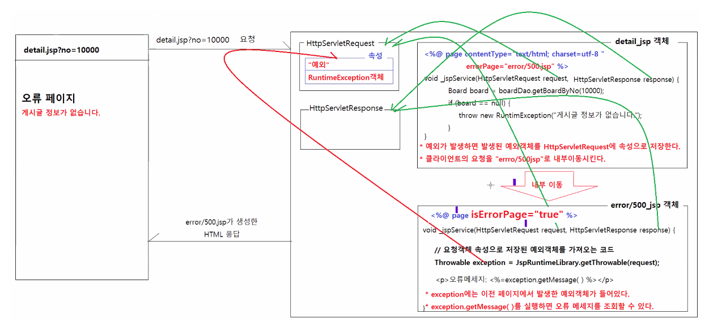
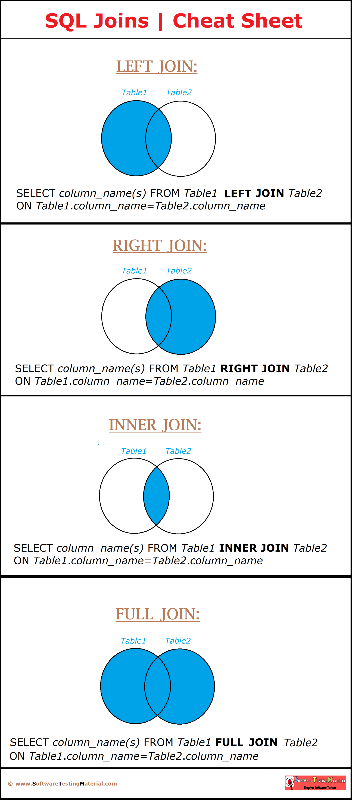

# 0607

- [0607](#0607)
- [board-app](#board-app)
	- [로그인 후](#로그인-후)
	- [오류페이지 설정](#오류페이지-설정)
	- [게시판 설정](#게시판-설정)
		- [내비바](#내비바)
	- [파일 업로드, 다운로드](#파일-업로드-다운로드)
		- [SQL Joins Cheat Sheet](#sql-joins-cheat-sheet)

<small><i><a href='http://ecotrust-canada.github.io/markdown-toc/'>Table of contents generated with markdown-toc</a></i></small>

# board-app 
## 로그인 후
* 로그인 후 로그인, 회원가입 링크버튼이 표시되지 않게 한다.

home.jsp
```jsp
			<!-- 
				로그인이 완료되면 아래 링크는 출력하지 않는다. 
			-->			
		<%
			User user = (User) session.getAttribute("LOGINED_USER");
			if (user == null) {
		%>
			<a href="loginform.jsp" class="btn btn-primary btn-lg">로그인</a>
			<a href="registerform.jsp" class="btn btn-outline-primary btn-lg">회원가입</a>
		<%
			}
		%>
```
## 오류페이지 설정
* 예외가 발생하면 발생된 예외객체를 HttpServletRequest에 속성으로 저장한다.
* 클라이언트의 요청을 error/500.jsp로 내부이동시킨다.
* 500.jsp에서 오류 메세지를 조회해 원하는 디자인으로 화면에 표시할 수 있다.(오류발생 안내페이지)



## 게시판 설정
* 조회, 입력, 수정, 저장, 삭제작업
* 조회수, 추천수 기능

### 내비바
- common/nav.jsp
  - 웹 애플리케이션의 내비바
  - 모든 JSP에서 include한다.
    ```jsp
    <jsp:include page="common/nav.jsp">
  	<jsp:param name="menu" value="home" />
    </jsp>
	```
  - include하는 jsp에서는 nav.jsp에 요청파라미터를 전달한다.
    요청파라미터명: menu, 요청파라미터값:웹페이지의 이름("home", "board", "login", "register" 등 이다.)
    요청파라미터값을 분석해서 해당 웹페이지의 이름에 맞는 메뉴를 하이라이트시킨다.
    ```jsp
    <%
  	String menu = request.getParameter("menu");
    %>
    <a class="nav-link <%="home".equals(menu) ? "active" : "" %>" href="/board-app/home.jsp">홈</a>
    <a class="nav-link <%="board".equals(menu) ? "active" : "" %>" href="/board-app/home.jsp">게시글</a>
    <a class="nav-link <%="login".equals(menu) ? "active" : "" %>" href="/board-app/home.jsp">로그인</a>
	```
  - 세션에 저장된 로그인정보를 조회해서 로그인/비로그인 상태에 맞게 메뉴를 출력한다.
    ```jsp
    <%
  	User user = (User) session.getAttribute("LOGINED_USER");
    %>
    <%
  	if (user != null) {
    %>
  		<a href="/board-app/logout.jsp">로그아웃</a>
    <%
  	} else {
    %>
  		<a href="/board-app/logout.jsp">로그인</a>
  		<a href="/board-app/logout.jsp">회원가입</a>
    <%
  	}
    %>
	```
### 에러페이지
- error/500.jsp
	- 서버 에러페이지다.
		* 500.jsp에는 아래의 페이지 지시어 설정이 반드시 포함되어야 한다.
		* `<%@ page contentType="text/html; charset=utf-8" isErrorPage="true" %>`
		* isErrorPage="true"는 이 JSP 페이지가 에러 페이지로 사용되는 JSP임을 지정한다.

	- 여러 JSP에서 클라이언트요청 처리 중 오류가 발생하면 이 에러페이지로 클라이언트의 요청을 내부이동시킨다.
		* `<%@ page contentType="text/html; charset=utf-8" errorPage="common/500.jsp" %>`
		* errorPage="common/500.jsp"는 이 설정이 정의된 JSP에서 예외가 발생하면 클라이언트에게 제공될 에러페이지를 지정한다.
		* JSP에서 예외가 발생하면 발생된 예외는 HttpServletRequest객체에 속성으로 저장되고, error/500.jsp로 내부이동 된다.
### 홈
- home.jsp	
	- 요청메세지
	```
	-----------------------------------------------------------------------------
	| GET home.jsp HTTP/1.1
	| Accept: ...
	| Accept-encoding: ...
	| Content-Type: application/x-www-form-urlencoded
	|
	------------------------------------------------------------------------------	
	```
	- 웹 애플리케이션 홈페이지
	- 로그인/회원가입 링크 제공
	- 로그인이 완료되면 로그인/회원가입 링크는 표시되지 않음		  
### 회원가입
- registerform.jsp
	- 요청메세지
	```
	-----------------------------------------------------------------------------
	| GET registerform.jsp HTTP/1.1
	| Accept: ...
	| Accept-encoding: ...
	| Content-Type: application/x-www-form-urlencoded
	|
	------------------------------------------------------------------------------	
	```
	- 회원가입 폼 화면을 제공한다.
- register.jsp
	- 요청메세지
	```
	-----------------------------------------------------------------------------
	| POST registerform.jsp HTTP/1.1
	| Accept: ...
	| Accept-encoding: ...
	| Content-Type: application/x-www-form-urlencoded
	|
	| id=hong&password=zxcv1234&name=홍길동&email=hong@gmail.com
	------------------------------------------------------------------------------	
	```
	- 폼 입력값을 요청파라미터로 조회하고, 조회된 회원정보를 데이터베이스에 저장한다.
	- 아이디나 이메일 중복이 발생하면 재요청URL에 오류원인과 오류내용을 쿼리스트링으로 추가한다.
		* 아이디 중복인 경우
		* `response.sendRedirect("registerform.jsp?fail=id&id=" + id);`
		* 이메일 중복인 경우
		* `response.sendRedirect("registerform.jsp?fail=email&email=" + email);`
- complete.jsp
	- 요청메세지
	```
	-----------------------------------------------------------------------------
	| GET complete.jsp HTTP/1.1
	| Accept: ...
	| Accept-encoding: ...
	| Content-Type: application/x-www-form-urlencoded
	|
	------------------------------------------------------------------------------	
	```
	- 가입완료 화면을 제공한다.
### 로그인/로그아웃
- loginform.jsp
	- 요청메세지
	```
	-----------------------------------------------------------------------------
	| GET loginform.jsp HTTP/1.1
	| Accept: ...
	| Accept-encoding: ...
	| Content-Type: application/x-www-form-urlencoded
	|
	------------------------------------------------------------------------------	
	```
	- 로그인 입력폼 화면을 제공한다.
- login.jsp
	- 요청메세지
	```
	-----------------------------------------------------------------------------
	| POST login.jsp HTTP/1.1
	| Accept: ...
	| Accept-encoding: ...
	| Content-Type: application/x-www-form-urlencoded
	|
	| id=hong&password=zxcv1234
	------------------------------------------------------------------------------	
	```
	- 아이디, 비밀번호를 요청파라미터로 조회하고, 가입된 정보와 비교해서 사용자 인증 작업을 수행한다.
		* 사용자가 존재하지 않거나, 비밀번호가 일치하지 않으면 재요청URL을 응답으로 보낸다.
			* `response.sendRedirect("loginform.jsp?fail=invalid");`
	- 사용자인증이 완료되면, 인증된 사용자정보를 서버에서 계속 유지하기 위해서 HttpSession객체에 속성으로 저장한다.
		* `session.setAttribute("LOGINED_USER", user);`
		* HttpSession객체는 클라이언트당 하나 생성되는 객체다.
		HttpSession객체는 클라이언트의 개인정보를 저장한다.
		* HttpSession객체는 요청/응답이 완료되더라고 서버에서 계속 유지되는 객체다.
		HttpSession객체는 요청/응답이 완료되더라도 계속 유지할 필요가 있는 정보를 저장한다.
		* 웹브라우저는 요청할 때마다 JSESSIONID값을 요청메세지의 헤더정보에 담아서 서버로 보내고, JSP에서는 JSESSIONID에 해당하는 HttpSession객체를 찾아서 JSP의 내장객체로 제공한다.
			* HttpSession객체는 모든 JSP에서 같은 클라이언트는 같은 객체를 사용한다.
	- 인증이 완료된 사용자정보가 HttpSession 객체에 "LOGINED_USER"라는 속성명으로 저장되어 있기 때문에, 모든 JSP에서 인증이 완료된 사용자정보는 HttpSession객체에서 "LOGINED_USER"로 저장된 객체를 조회하면 획득할 수 있다.
	    * `User user = (User) session.getAttribute("LOGINED_USER");`
		* 단, 인증이 완료되지 않은 경우(비 로그인상태)에는 null값이 조회된다.
- logout.jsp
	- 요청메세지
	```
	-----------------------------------------------------------------------------
	| GET logout.jsp HTTP/1.1
	| Accept: ...
	| Accept-encoding: ...
	| Content-Type: application/x-www-form-urlencoded
	|
	------------------------------------------------------------------------------	
	```
	- 클라이언트의 개인정보가 저장된 HttpSession객체를 폐기시킨다.
		* `session.invalidate();`
		* 로그아웃 후 home.jsp로 다시 접속할 때 클라이언트가 JSESSIONID를 서버로 전달하지만, 해당 JSESSIONID와 일치하는 HttpSession객체는 폐기된 상태다.
		* home.jsp에서는 JSESSIONID에 해당하는 HttpSession객체가 존재하지 않으므로, 
		새 HttpSession객체를 생성하고, 새 HttpSession객체의 JSESSIONID를 응답메세지에 포함시켜서 클라이언트로 보낸다.
	- HttpSession객체가 폐기되면, HttpSession객체에 저장한 사용자정보도 사라진다.
		* 인증된 사용자 정보가 필요한 JSP에서 아래코드를 실행하면, user에 null이 저장된다. 
		* `User user = (User) session.getAttribute("LOGINED_USER");`
### 게시글 목록
- list.jsp
	- 요청메세지
	```
	-----------------------------------------------------------------------------
	| GET list.jsp?page=3 HTTP/1.1
	| Accept: ...
	| Accept-encoding: ...
	| Content-Type: application/x-www-form-urlencoded
	|
	------------------------------------------------------------------------------	
	```
	- 요청파라미터에서 페이지번호를 조회한다.
	- 전체 데이터 건수를 조회한다.
	- 페이징처리를 지원하는 Pagination객체를 생성한다.
		* `Pagination pagination = new Pagination(전체 데이터건수, 요청한 페이지번호);`
	- 데이터 조회범위를 알아낸다.
		* `int beginIndex = pagination.getBeginIndex();`
		* `int endIndex = pagination.getEndIndex();`
		- 데이터 조회범위에 해당하는 게시글을 조회한다.
		* `List<Board> boardList = boardDao.getBoards(beginIndex, endIndex);`
	- 조회된 게시글 정보로 HTML 컨텐츠를 생성한다.
	- 페이지 번호를 제공한다. 페이지번호 출력범위를 알아낸다.
		* `int beginPage = pagination.getBeginPage();`
		* `ine endPage = pagination.getEndPage();`
		* 위에서 조회된 페이지범위에 속하는 페이지번호를 화면의 하단에 출력한다.
### 게시글 등록
- form.jsp
	- 요청메세지
	```
	-----------------------------------------------------------------------------
	| GET form.jsp HTTP/1.1
	| Accept: ...
	| Accept-encoding: ...
	| Content-Type: application/x-www-form-urlencoded
	|
	------------------------------------------------------------------------------	
	```
	- 로그인여부를 조회해서 비 로그인 상태면 예외를 발생시킨다.
	- 제목, 내용을 입력하는 입력폼 화면을 제공한다.
	- 등록버튼을 클릭하면 add.jsp로 폼 입력값을 제출한다.
- add.jsp
	- 요청메세지
	```
	-----------------------------------------------------------------------------
	| POST registerform.jsp HTTP/1.1
	| Accept: ...
	| Accept-encoding: ...
	| Content-Type: application/x-www-form-urlencoded
	|
	| title=글쓰기 연습&content=글쓰기 연습입니다.
	------------------------------------------------------------------------------	
	```
	- 로그인여부를 조회해서 비 로그인 상태면 예외를 발생시킨다.
	- 요청파라미터로 전달받은 제목과 내용을 조회한다.
	- Board객체를 생성해서 제목, 내용, 작성자 정보를 저장한다.
	- 게시글 정보를 데이터베이스에 저장시킨다.
		* `boardDao.insertBoard(board);`
	- list.jsp를 재요청하는 URL을 응답으로 보낸다.
### 게시글 상세
- detail.jsp
	- 요청메세지
	```
	-----------------------------------------------------------------------------
	| GET detail.jsp?no=67&page=2 HTTP/1.1
	| Accept: ...
	| Accept-encoding: ...
	| Content-Type: application/x-www-form-urlencoded
	|
	------------------------------------------------------------------------------	
	```
	- 요청파라미터에서 글번호, 페이지번호를 조회한다.
	- 글번호에 해당하는 게시글 정보를 조회한다.
	- 게시글 정보가 존재하지 않으면 예외를 발생시킨다.
	- 글번호에 해당하는 게시글의 조회수를 1증가시킨 다음 데이터베이스에 반영시킨다.
	- 조회된 게시글 정보를 출력한다.
	- 수정/삭제/추천버튼에 대한 활성화 비활성화 여부를 처리한다.
		* 로그인 정보를 조회한다.
		* 수정/삭제 버튼
		비로그인 상태 : 비활성화
		로그인상태 && 내가 작성한 글 : 활성화
		* 추천버튼
		비로그인 상태 : 비활성화
		로그인상태 && 다른 사람 글 && 내가 추천하지 않은 글 : 활성화
### 게시글 삭제
- delete.jsp
	- 요청메세지
	```
	-----------------------------------------------------------------------------
	| GET delete.jsp?no=67&page=2 HTTP/1.1
	| Accept: ...
	| Accept-encoding: ...
	| Content-Type: application/x-www-form-urlencoded
	|
	------------------------------------------------------------------------------	
	```
	- 로그인여부를 조회해서 비 로그인 상태면 예외를 발생시킨다.
	- 요청파라미터에서 게시글번호, 페이지번호를 조회한다.
	- 글번호에 해당하는 게시글 정보를 조회한다.
	- 게시글 정보가 존재하지 않으면 예외를 발생시킨다.
	- 게시글 정보의 작성자와 로그인한 사용자가 일치하지 않으면 예외를 발생시킨다. 
		- 다른 사용자가 작성한 글은 추천할 수 없음
	- 게시글 정보의 deleted값을 Y를 지정한다.
		* `board.setDeleted("Y")`
	- 변경된 게시글 정보를 데이터베이스에 반영시킨다.
		* `boardDao.updateBoard(board);`
	- list.jsp를 재요청하는 URL을 응답으로 보낸다.
### 게시글 수정
- modifyform.jsp
	- 요청메세지
	```
	-----------------------------------------------------------------------------
	| GET modifyform.jsp?no=67&page=2 HTTP/1.1
	| Accept: ...
	| Accept-encoding: ...
	| Content-Type: application/x-www-form-urlencoded
	|
	------------------------------------------------------------------------------	
	```
	- 로그인여부를 조회해서 비 로그인 상태면 예외를 발생시킨다.
	- 요청파라미터에서 게시글번호, 페이지번호를 조회한다.
	- 글번호에 해당하는 게시글 정보를 조회한다.
	- 게시글 정보가 존재하지 않으면 예외를 발생시킨다.
	- 게시글번호와 페이지번호을 hidden 필드에 값으로 설정해서 form 입력값이 제출될 때 같이 제출되게 한다.
	- 조회된 게시글 정보를 폼입력필드에 출력한다.
	- 수정버튼을 클릭하면 modify.jsp로 폼 입력값을 제출한다.
- modify.jsp
	- 요청메세지
	```
	-----------------------------------------------------------------------------
	| POST registerform.jsp?no=67&page=2 HTTP/1.1
	| Accept: ...
	| Accept-encoding: ...
	| Content-Type: application/x-www-form-urlencoded
	|
	| no=67&page=2&title=게시글 수정연습&content=게시글 수정연습입니다.
	------------------------------------------------------------------------------
	```
	- 로그인여부를 조회해서 비 로그인 상태면 예외를 발생시킨다.
	- 요청파라미터에서 게시글번호, 페이지번호, 제목, 내용를 조회한다.
	- 글번호에 해당하는 게시글 정보를 조회한다.
	- 게시글 정보가 존재하지 않으면 예외를 발생시킨다.
	- 게시글 정보의 작성자와 로그인한 사용자가 일치하지 않으면 예외를 발생시킨다. 
		- 다른 사용자가 작성한 글은 추천할 수 없음
	- 조회된 게시글에 제목과 내용을 요청파라미터에서 조회된 값으로 변경한다.
	- 변경된 정보가 반영된 게시글 정보를 데이터베이스에 반영시킨다.
	- detail.jsp를 재요청하는 URL을 응답으로 보낸다.
### 게시글 추천
- like.jsp
	- 요청메세지
	```
	-----------------------------------------------------------------------------
	| GET like.jsp?no=67&page=2 HTTP/1.1
	| Accept: ...
	| Accept-encoding: ...
	| Content-Type: application/x-www-form-urlencoded
	|
	------------------------------------------------------------------------------	
	```
	- 로그인여부를 조회해서 비 로그인 상태면 예외를 발생시킨다.
	- 요청파라미터에서 게시글번호, 페이지번호를 조회한다.
	- 글번호에 해당하는 게시글 정보를 조회한다.
	- 게시글 정보가 존재하지 않으면 예외를 발생시킨다.
	- 게시글 정보의 작성자와 로그인한 사용자가 일치하면 예외를 발생시킨다. 
		- 내가 작성한 글은 추천할 수 없음
	- 이 게시글에 대해서 사용자가 추천한 정보가 있는지 조회한다.
	- 추천한 정보가 있으면 예외를 발생시킨다.
	- BoardLikeUser객체를 생성해서 게시글번호, 사용자번호를 저장한다.
	- BoardLikeUser정보를 데이터베이스에 저장시킨다.
	- 조회된 게시글의 추천수를 1증가시키고 데이터베이스에 반영시킨다.
	- detail.jsp를 재요청하는 URL을 응답으로 보낸다.

## 줄바꿈 유지
* vo/board.java
	```java
	// 줄바꿈을 유지하기 위해 사용한다.
	public String getHtmlContent() {
		if (content == null) {
			return "";
		}
		return content.replace(System.lineSeparator(), "<br />");
	}
	```

## 파일 업로드, 다운로드
* 파일 업로드/다운로드
	* 웹페이지에 표시되는 파일
		* 종류
			* 이미지, 동영상
		* 저장경로
			* src/main/webapp 폴더 아래에 별도의 별도를 생성해서 저장한다.
			* src/main/resources/images/icon
			* src/main/resources/images/movie-poster
			* src/main/resources/videos/youtube
			* src/main/resources/videos/tiktok
		* 구현내용
			* 업로드만 구현/다운로드는 구현할 필요가 없다.
			* 태그를 사용해서 웹 페이지에 출력하기 때문에 다운로드는 구현할 필요없다.
			  * ``
			  * `<video src="resources/video/youtube/sample.mp4" />`

	* 웹페이지에 표시되지 않는 파일
		* 종류
			* 서식파일, 첨부파일
		* 저장경로
			* 어떤 경로에 저장하던 상관없다.
			* 웹 애플리케이션 프로젝트 내에 저장폴더가 존재할 필요도 없다.
		* 구현내용
			* 업로드/다운로드 모두 구현

* 파일 업로드 구현하기
	* 입력폼 작성하기
		```jsp
		<form method="POST" action="add.jsp" enctype="multipart/form-data">
			* 제목: <input type="text" name="title" />
			* 내용: <textarea name="content"></textarea>
			* 첨부파일: <input type="file" name="upfile" />
		</form>
		```
		* 첨부파일 필드를 form태그 안에 추가한다.
          * `<input type="file" name="upfile" />`
		* form태그의 method 속성은 반드시 POST로 지정한다.
		* form태그의 enctype 속성을 반드시 multipart/form-data로 지정한다.

			* `enctype="application/x-www-form-urlencoded"`
				* enctype를 지정하지 않으면 `enctype="application/x-www-form-urlencoded"`이 기본값이다.
				* enctype이 `"application/x-www-form-urlencoded"`면 
                   * 폼입력값은 GET방식의 쿼리스트링과 같은 형태로 변환되어 요청메세지의 바디부에 포함되어 서버로 전달된다.
				* 첨부파일을 업로드 할 수 없다.

				* 요청메세지
				```
				-----------------------------------------------------------------------------
				| POST add.jsp HTTP/1.1
				| Accept: ...
				| Accept-encoding: ...
				| Content-Type: application/x-www-form-urlencoded
				|
				| title=첨부파일업로드 연습&content=첨부파일 업로드 연습입니다.&upfile=sample.gif
				------------------------------------------------------------------------------
				```
			* enctype="multipart/form-data"
				* 첨부파일 필드가 form태그 안에 포함되어 있는 경우에만 사용한다.
				* 각 필드입력값을 지정된 boundary 텍스트로 구분해서 서버로 전달한다.
				* HttpServletRequest객체의 getParameter(String name)으로 요청파라미터값을 조회할 수 없다.

				* 요청메세지
				```
				-----------------------------------------------------------------------------------------
				| POST add.jsp HTTP/1.1
				| Accept: ...
				| Accept-encoding: ...
				| Content-Type: multipart/form-data; boundary=----WebKitFormBoundaryCivtYSFX4A6vKt46
				|
				| ----WebKitFormBoundaryCivtYSFX4A6vKt46
				| Content-Disposition: form-data; name="title"
				|
				| 첨부파일업로드 연습
				| ----WebKitFormBoundaryCivtYSFX4A6vKt46
				| Content-Disposition: form-data; name="content"
				|
				| 첨부파일 업로드 연습입니다.
				| ----WebKitFormBoundaryCivtYSFX4A6vKt46
				| Content-Disposition: form-data; name="upfile"; filename="sample.gif"
				| Content-Type: image/gif
				| GIF871...............................D..; // sample.gif의 실제 데이터
				| ----WebKitFormBoundaryCivtYSFX4A6vKt46
				| 
				------------------------------------------------------------------------------------------
				```
	* 업로드된 첨부파일 처리하기
		* HttpServlet과 Part객체를 이용해서 업로드된 첨부파일 처리하기	
		```java
		@WebServlet("/upload")
		@MultipartConfig

		class FileUploadServlet extends HttpServlet {
			public void service(HttpServletRequest request, HttpServletResponse response) throws IOException, ServletResponse {
				Board board = new Board();

				String title = request.getParameter("title");
				String content = request.getParameter("content");
				board.setTitle(title);
				board.setContent(content);				
					
				Part part = request.getPart("upfile");
				if (part.getSize() > 0) {
					String filename = part.getSubmittedFilename();
					InputStream in = part.getInputStream();
					FileOutputStream out = new FileOutputStream("c:/attached-files/" + filename);
					IOUtils.copy(in, out);

					board.setFilename(filename);
				}
				
				BoardDao boardDao = BoardDao.getInstance();
				boardDao.insertBoard(board);

				response.sendRedirect("list.jsp?page=1");
			} 
		}
		```
		* Part 객체의 주요 API
			* Part객체는 multipart/form-data 요청처리를 지원하는 객체다.
			* Part객체는 업로드된 첨부파일 처리를 지원하는 메소드를 제공한다.
			* Part객체의 획득
				Part part = request.getPart("첨부파일 입력필드명");
			* Part객체의 주요 메소드
				`long getSize()`
					업로드된 파일의 사이즈를 반환한다.
				`String getContentType()`
					업로드된 파일의 컨텐츠 타입을 반환한다.
				String getSubmittedFilename()
					업로드된 파일의 이름을 반환한다.
				InputStream getInputStream()
					업로드된 파일을 읽어오는 스트림을 반환한다.

### SQL Joins Cheat Sheet
