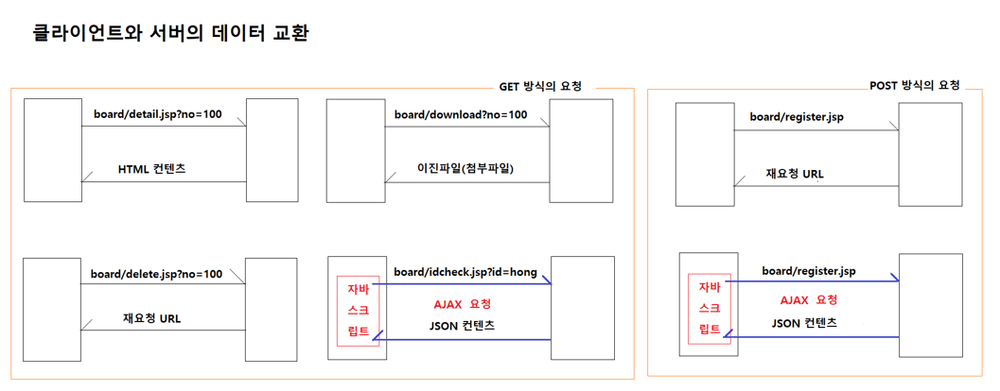

# 0608

- [0608](#0608)
- [board-app](#board-app)
  - [파일 업로드](#파일-업로드)
    - [MultipartRequest의 API](#multipartrequest의-api)
  - [파일 다운로드](#파일-다운로드)
    - [MIME 타입](#mime-타입)
  - [id 체크하기](#id-체크하기)
  - [박스오피스적용하기](#박스오피스적용하기)
- [HTTP 통신 (데이터를 주고받는 방법)](#http-통신-데이터를-주고받는-방법)
  - [AJAX](#ajax)
    - [json](#json)
    - [gson](#gson)

<small><i><a href='http://ecotrust-canada.github.io/markdown-toc/'>Table of contents generated with markdown-toc</a></i></small>


# board-app
## 파일 업로드
* MultipartRequest라는 Util을 하나 추가한다.
* MultipartRequest와 연결하여 multipart/form-data의 형태로 데이터를 전송한다.
### MultipartRequest의 API
* 생성자
   *  MultipartRequest(HttpServletRequest request, String saveDirectory)
        * 요청객체와 업로드된 파일을 저장할 폴더명을 인자로 전달한다.
        * 요청객체를 분석해서 업로드된 첨부파일을 지정된 폴더에 저장을 완료한다.
* 메소드
    * `String 		getParameter(String name)`
        * 지정된 이름의 요청파라미터값을 반환한다.
    * `String[] 	getParameterValues(String name)`
        * 지정된 이름의 요청파라미터값을 배열로 반환한다.
        * 같은 이름의 요청파라미터가 여러 개일 때 사용한다.
    * `String		getFilename(String name)`
        * 지정된 이름의 첨부파일 입력필드로 업로드된 파일명을 반환한다.
    * `String[]	getFilenames(String name)`
        * 지정된 이름의 첨부파일 입력필드로 업로드된 파일명을 배열로 반환한다.
        * 같은 이름의 첨부파일 입력필드가 여러 개일 때 사용한다.
* 활용 예시
    ```jsp
	<form method="post" action="add.jsp" enctype="multipart/form-data">
		제목	<input type="text" name="title" />
		내용	<textarea name="content"></textarea>
		첨부파일	<input type="file" name="poster1" />
		첨부파일	<input type="file" name="poster2" />
	</form>

	<%
		// MultipartRequest 객체가 생성되면 생성자 메소드에서 요청객체의 값을 분석해서
		// 요청파라미터를 추출하고, 업로드된 첨부파일정보를 분석해서 첨부파일을 지정된 폴더에 저장하고, 저장된 파일의 파일명을 추출한다
		MultipartRequest mr = new MultipartRequest(request, "c:\\images");

		String title = mr.getParameter("title");
		String content = mr.getParameter("content");
		String mainPosterFilename = mr.getFilename("poster1");
		String subPosterFilename = mr.getFilename("poster2");

		Movie movie = new Movie();
		
	%>
    ```

```java
package util;

import java.io.File;
import java.io.FileOutputStream;
import java.io.IOException;
import java.util.ArrayList;
import java.util.HashMap;
import java.util.List;
import java.util.Map;
import java.util.Map.Entry;
import java.util.Set;

import org.apache.tomcat.jakartaee.commons.io.IOUtils;
import org.apache.tomcat.util.http.fileupload.FileItem;
import org.apache.tomcat.util.http.fileupload.disk.DiskFileItemFactory;
import org.apache.tomcat.util.http.fileupload.servlet.ServletFileUpload;

import jakarta.servlet.http.HttpServletRequest;

/**
 * multipart/form-data 요청을 처리하는 유틸리티 클래스다.
 * @author lee_e
 *
 */
public class MultipartRequest {
	/*
	 -----------------------------------------------------------------------------------------
	| POST add.jsp HTTP/1.1
	| Accept: ...
	| Accept-encoding: ...
	| Content-Type: multipart/form-data; boundary=----WebKitFormBoundaryCivtYSFX4A6vKt46
	|
	| ----WebKitFormBoundaryCivtYSFX4A6vKt46
	| Content-Disposition: form-data; name="title"
	|
	| 첨부파일업로드 연습
	| ----WebKitFormBoundaryCivtYSFX4A6vKt46
	| Content-Disposition: form-data; name="content"
	|
	| 첨부파일 업로드 연습입니다.
	| ----WebKitFormBoundaryCivtYSFX4A6vKt46
	| Content-Disposition: form-data; name="upfile"; filename="sample.gif"
	| Content-Type: image/gif
	| GIF871...............................D..; // sample.gif의 실제 데이터
	| ----WebKitFormBoundaryCivtYSFX4A6vKt46
	| 
	------------------------------------------------------------------------------------------
	
	분석이 완료된 정보
	parameters -> {
		KEY				VALUES
		---------------------------------------------------------------
		"title"			["업로드 연습"],
		"content"		["업로드 연습입니다."]
		"upfile"		["sample.gif"]
	}
	 */
	
	/**
	 *  분석된 요청메세지 정보를 저장하는 Map객체
	 */
	private Map<String, List<String>> parameters = new HashMap<>();
	
	/**
	 * multipart/form-data 요청을 처리하는 MultipartRequest객체를 초기화하는 생성자다.
	 * @param request 요청객체
	 * @param saveDirectory 업로드된 첨부파일을 저장할 폴더 경로
	 * @throws IOException 첨부파일 업로드 처리시 오류가 발생하면 이 예외를 던진다.
	 */
	public MultipartRequest(HttpServletRequest request, String saveDirectory) throws IOException {
		DiskFileItemFactory factory = new DiskFileItemFactory();
		factory.setDefaultCharset("utf-8");
		factory.setSizeThreshold(DiskFileItemFactory.DEFAULT_SIZE_THRESHOLD);
		ServletFileUpload upload = new ServletFileUpload(factory);
		Map<String, List<FileItem>> map = upload.parseParameterMap(request);
		
		Set<Entry<String, List<FileItem>>> entrySet =  map.entrySet();
		for (Entry<String, List<FileItem>> entry : entrySet) {
			String key = entry.getKey();				// 요청 파라미터명 추출
			List<String> values = new ArrayList<>();	// 요청 파라미터값 혹은 파일명을 저장하는 List객체 생성
			parameters.put(key, values);			
			
			List<FileItem> fileItems = entry.getValue();
			for (FileItem fileItem : fileItems) {
				if (fileItem.isFormField()) {					// FileItem객체가 입력필드정보를 포함하고 있는 경우
					values.add(fileItem.getString());			// 요청파라미터값을 주출해서 저장
				} else {										// FileItem객체가 업로드된 파일정보를 포함하고 있는 경우
					if (fileItem.getSize() > 0) {
						String filename = fileItem.getName();	// 업로드된 파일명을 추출함
						values.add(filename);					// 업로드된 파일명을 저장
																// 업로드된 파일을 지정된 폴더에 저장함
						IOUtils.copy(fileItem.getInputStream(), new FileOutputStream(new File(saveDirectory, filename)));		
					}
				}
			}
		}
	}
	
	/**
	 * 지정된 이름의 요청파라미터값을 반환한다.
	 * @param name 요청파라미터 이름
	 * @return 요청파라미터 값, 지정된 이름의 요청파라미터값이 없으면 null을 반환한다.
	 */
	public String getParameter(String name) {
		List<String> values = parameters.get(name);
		if (values.isEmpty()) {
			return null;
		}
		return values.get(0);
	}
	
	/**
	 * 지정된 이름의 요청파라미터값을 배열로 반환한다.
	 * @param name 요청파라미터 이름
	 * @return 요청파라미터 값이 저장된 배열객체, 지정된 이름의 요청파라미터값이 없으면 null을 반환한다.
	 */
	public String[] getParameterValues(String name) {
		List<String> values = parameters.get(name);
		if (values.isEmpty()) {
			return null;
		}
		String[] array = new String[values.size()];
		values.toArray(array);
		return array;
	}
	
	/**
	 * 지정된 필드명으로 업로드된 첨부파일의 이름을 반환한다.
	 * @param name 입력필드명
	 * @return 파일이름, 지정된 필드명으로 업로된 파일이 존재하지 않으면 null을 반환한다.
	 */
	public String getFilename(String name) {
		return getParameter(name);
	}
	
	/**
	 * 지정된 필드명으로 업로드된 첨부파일의 이름을 배열로 반환한다.
	 * @param name 입력필드명
	 * @return 파일이름이 저장된 배열객체, 지정된 필드명으로 업로된 파일이 존재하지 않으면 null을 반환한다.
	 */
	public String[] getFilenames(String name) {
		return getParameterValues(name);
	}
}

```

## 파일 다운로드
* 저장할 폴더를 지정해준다.
* 오류 던지기(방어코딩)
  * 게시글 정보가 존재하지 않을 경우
  * 첨부파일 정보가 존재하지 않을 경우
* `response.setContentType("application/octext-stream");`
  * 모든 타입의 데이터에 대해(데이터 타입을 모를 경우) 적용한다.
* `response.setHeader("Content-Disposition", "attachment; filename=" + filename);`
* `FileInputStream in = new FileInputStream(new File(saveDirectory, filename));`
* `OutputStream out = response.getOutputStream();`
* `IOUtils.copy(in, out);`

### MIME 타입
* MIME 타입
    - 클라이언트에게 전송되는 컨텐츠의 타입을 지정할 때 사용되는 규약이다.
    - 구조
    	* type/subtype
    	* 타입과 서브타입으로 구성된다.
    	* text/plain, text/html, text/xml, application/json, application/octect-stream, image/png, image/gif 
- 종류	
	* text
    	* 텍스트 컨텐츠
    	* text/plain, text/html, text/xml, text/css, text/javascript
	* application
    	* 모든 종류의 바이너리 데이터
    	* application/octet-stream, application/pdf, application/vnd.mspowerpoint
	* image
    	* 모든 종류의 이미지
    	* image/gif, image/png, image/jpeg, image/bmp
	* audio
    	* 모든 종류의 오디오 파일
    	* audio/wav, audio/midi
	* video
    	* 모든 종류의 비디오 파일
    	* video/webm, video/ogg

  	* text/plain: 특정 서브타입이 없는 모든 텍스트 문서에 대해서 지정한다.
  	* application/octet-stream: 특정 서브타입이 없거나 알려진 서브타입이 없는 모든 바이너리 데이터(파일)에 대해서 지정한다.

- 주요 MIME 타입
    * application/octet-stream
    	* 바이너리 파일을 위한 기본값이다. 타입이 알려지지 않은 바이너리 파일을 의미한다.
    	* Content-Disposition 헤더 값의 attachment와 같이 설정된다.
            * response.setContentType("application/octet-stream");
            * response.setHeader("Content-disposition", "attachment; filename=sample.zip");
                * Content-Disposition 헤더값은 응답으로 보내는 컨텐츠가 웹페이지의 자체 혹은 웹페이지의 일부인지, 아니면 다운로드 되어야 하는 것인지를 알려주는 헤더다.
    * text/plain
    	* 텍스트 파일에 대한 기본값이다.
    * text/html
    	* 모든 HTML 컨텐츠 타입
    * text/css
    	* 웹 페이지내에서 사용되는 CSS 스타일 파일
    * text/javascript
    	* 웹 페이지내에서 실행되는 자바스크립트 파일
    * application/json
    	* JSON 형식으로 작성된 데이터 교환용 텍스트 데이터
        	```
            ["홍길동", "김유신", "강감찬"]
            {"no":100, "name":"맥북프로", "company":"애플", "price":2500000, "discountPrice":null, "onSell":true}
            ```
    * multipart/form-data 
    	* 브라우저에서 서버로 폼의 내용을 전송할 때 사용되는 타입이다.
    	* multipart/form-data로 지정하면 서버로 전송되는 폼입력값이 다음과 같은 경계선(----WebKitFormBoundaryCivtYSFX4A6vKt46)으로 구분된다.
    	```
        -----------------------------------------------------------------------------------------
        | POST add.jsp HTTP/1.1
        | Accept: ...
        | Accept-encoding: ...
        | Content-Type: multipart/form-data; boundary=----WebKitFormBoundaryCivtYSFX4A6vKt46
        |
        | ----WebKitFormBoundaryCivtYSFX4A6vKt46
        | Content-Disposition: form-data; name="title"
        |
        | 첨부파일업로드 연습
        | ----WebKitFormBoundaryCivtYSFX4A6vKt46
        | Content-Disposition: form-data; name="content"
        |
        | 첨부파일 업로드 연습입니다.
        | ----WebKitFormBoundaryCivtYSFX4A6vKt46
        | Content-Disposition: form-data; name="upfile"; filename="sample.gif"
        | Content-Type: image/gif
        | GIF871...............................D..; // sample.gif의 실제 데이터
        | ----WebKitFormBoundaryCivtYSFX4A6vKt46
        | 
        ------------------------------------------------------------------------------------------
        ```
    * application/x-www-form-urlencoded
    	* 브라우저에서 서버로 폼의 내용을 전송할 때 사용되는 타입이다.
    	* application/x-www-form-urlencoded로 지정하면 서버로 전송되는 폼 입력값이 &로 구분된다.
    	```
        -----------------------------------------------------------------------------
        | POST add.jsp HTTP/1.1
        | Accept: ...
        | Accept-encoding: ...
        | Content-Type: application/x-www-form-urlencoded
        |
        | id=hong&password=zxcv1234&name=홍길동&email=hong-gd@gmail.com
        ------------------------------------------------------------------------------
        ```

## id 체크하기
```jsp
<%@page import="java.util.HashMap"%>
<%@page import="java.util.Map"%>
<%@page import="com.google.gson.Gson"%>
<%@page import="vo.User"%>
<%@page import="dao.UserDao"%>
<%@ page language="java" contentType="application/json; charset=UTF-8"
    pageEncoding="UTF-8" trimDirectiveWhitespaces="true"%>
<%
	String userId = request.getParameter("id");
	
	UserDao userDao = UserDao.getInstance();
	User user = userDao.getUserById(userId);
	
	Map<String, Boolean> result = new HashMap<>();
	if (user != null) {
		result.put("exist", true);
	} else {
		result.put("exist", false);
	}
	
	Gson gson = new Gson();
	String jsonText = gson.toJson(result);
	out.write(jsonText);
%> 
```

## 박스오피스적용하기
* ajax를 사용해 박스오피스 api를 적용해 영화 순위 게시판을 보여줄 수 있다.
* 페이지를 바꾸지 않고 내용을 바꿀 수 있다.
```jsp
<%@ page language="java" contentType="text/html; charset=UTF-8"
    pageEncoding="UTF-8"%>
<!DOCTYPE html>
<html>
<head>
<meta charset="UTF-8">
<meta name="viewport" content="width=device-width, initial-scale=1">
<title>커뮤니티 게시판</title>
<link href="https://cdn.jsdelivr.net/npm/bootstrap@5.2.0-beta1/dist/css/bootstrap.min.css" rel="stylesheet">
</head>
<body>
<jsp:include page="common/nav.jsp">
	<jsp:param name="menu" value="boxoffice" />
</jsp:include>
<div class="container">
	<div class="row">
		<div class="col">
			<h1 class="fs-5 border p-2">일자별 박스오피스 순위</h1>
		</div>
	</div>
	<div class="row">
		<div class="col">
			<form class="row row-cols-lg-auto g-3 align-items-center">
 				<div class="col-12">
   					<input type="date" class="form-control" id="date">
 				</div>
 				<div class="col-12">
   					<button type="button" class="btn btn-primary btn-sm" onclick="searchBoxoffice();">조회</button>
 				</div>
			</form>
		</div>
	</div>
	<div class="row">
		<div class="col">
			<table class="table" id="boxoffice-table">
				<colgroup>
					<col width="10%">
					<col width="*">
					<col width="10%">
					<col width="10%">
				</colgroup>
				<thead>
					<tr>
						<th>순위</th>
						<th>제목</th>
						<th>개봉일</th>
						<th>관객수</th>
					</tr>
				</thead>
				<tbody></tbody>
			</table>
		</div>
	</div>
</div>
<script src="https://cdn.jsdelivr.net/npm/bootstrap@5.2.0-beta1/dist/js/bootstrap.bundle.min.js"></script>
<script type="text/javascript">
	let url = "https://kobis.or.kr/kobisopenapi/webservice/rest/boxoffice/searchDailyBoxOfficeList.json?key=f5eef3421c602c6cb7ea224104795888&targetDt=";
	
	function searchBoxoffice() {
		let date = document.getElementById("date").value;	// '2022-06-07'
		date = date.replaceAll("-", "");					// '20220607'
		
		let tbody = document.querySelector("#boxoffice-table tbody");		
		let xhr = new XMLHttpRequest();
		xhr.onreadystatechange = function() {
			if (xhr.readyState === 4 && xhr.status === 200) {
				let jsonText = xhr.responseText;
				let result = JSON.parse(jsonText);
				let movies = result.boxOfficeResult.dailyBoxOfficeList;
				
				let rows = "";
				for (let index = 0; index < movies.length; index++) {
					let movie = movies[index];
					let ranking = movie.rank;		// 순위
					let name = movie.movieNm;		// 제목
					let openDate = movie.openDt;	// 개봉일
					let audiAcc = movie.audiAcc;	// 누적관객수
					
					rows += "<tr>";
					rows += "<td>"+ ranking +"</td>";
					rows += "<td>"+ name +"</td>";
					rows += "<td>"+ openDate +"</td>";
					rows += "<td>"+ new Number(audiAcc).toLocaleString() +" 명</td>";
					rows += "</tr>";
				}
				tbody.innerHTML = rows;
			}
		};
		xhr.open("GET", url + date);
		xhr.send();		
	}
</script>
</body>
</html>
```	

# HTTP 통신 (데이터를 주고받는 방법)
## AJAX
* AJAX(Asyncronous JavaScript And XML)
	* XMLHttpRequest 객체를 활용한 서버와의 비동기식 HTTP 통신
	
* XMLHttpRequest
    - 서버와의 HTTP 통신을 지원하는 객체다.
    - 브라우저 내장객체며, 자바스크립트로 생성/제어가 가능한 객체다.

* AJAX의 수행절차
    1. 사용자와 웹페이지의 상호작용으로 이벤트 발생
    2. 자바스크립로 작성한 이벤트핸들러함수 실행
    3. 이벤트핸들러함수에서 XMLHttpRequest 객체 생성
    4. XMLHttpRequest객체 초기화 및 서버로 요청 전송
    5. XMLHttpRequest객체가 응답을 받으면, 응답데이터 조회
    6. 조회된 응답데이터로 HTML 컨텐츠 생성
    7. 생성된 HTML 컨텐츠를 웹페이지에 반영

* AJAX의 특징
    - 서버와 비동기 통신이 가능하다.
    * 요청을 보내고, 응답을 기다리지 않고 새 요청을 바로 보낼 수 있다.
    - 서버와 데이터 교환이 가능하다.
    - 서버로부터 받아온 데이터로 화면의 일부분을 갱신할 수 있다.(화면 리로딩없이)

* XMLHttpRequest의 주요 API
    - 프로퍼피
        readyState
            XMLHttpRequest의 상태코드값을 반환한다.
        status
            XMLHttpRequest의 요청에 대한 HTTP 응답코드를 반환한다.
        responseText
            서버로부터 응답으로 받은 텍스트 데이터를 반환한다.
        responseXML
            서버로부터 응답으로 받은 XML DOM 객체를 반환한다.
    - 메소드	
        open(요청방식, 요청URL)
            XMLHttpRequest 객체를 초기화한다.
            요청방식은 "GET", "POST", "PUT", "DELETE" 중 하나다.
        send();
            요청방식이 GET일 때 서버로 요청을 보낸다.
        setRequestHeader(요청헤더명, 요청헤더값)
            요청방식이 POST일 때 요청메세지의 바디부에 포함되는 데이터의 컨텐츠 타입을 지정한다.
            예시) 
            xhr.setRequestHeader("Content-Type", "application/x-www-form-urlencoded");
            * 서버로 보내는 값을 name=value&name=value&name=value 의 형식으로 보낼때 사용한다.
        send(data)
            요청방식이 POST일 때 서버로 요청을 보낸다.
            data는 서버로 보내는 데이터다.
            위의 setRequestHeader(요청헤더명, 요청헤더값)메소드로 지정한 형식에 맞게 데이터를 작성해서 인자로 전달한다.
    - 이벤트
        onreadystatechange
            XMLHttpRequest의 readyState 값이 변할 때 마다 발생하는 이벤트다.

  




### json
- JSON(JavaScript Object Notation)
- 경량의 데이터 교환용 표기법이다.
- 사람이 읽고 쓰기 쉽고, 기계(프로그램)로 분석하고 생성하기 쉽다.
- 구조
	Array 구조
		[값, 값, 값]
	Object 구조
		{"이름":값, "이름":값}

	* 이름은 언제나 ""로 둘러싸인 문자열
	* 값은 "문자열", 1, 3.14, null, true, false, Array, Object

	예시
	["김유신", "홍길동", "강감찬"]
		JavaScript 
			["김유신", "홍길동", "강감찬"] 	<-> 자바스크립트 배열객체
		Java
			["김유신", "홍길동", "강감찬"] 	<-> List<String> 객체

	{"id":100, "name":"홍길동", "dept":"영업1팀", "salary":500}	
		JavaScript
			{"id":100, "name":"홍길동", "dept":"영업1팀", "salary":500}		<-> 자바스크립트의 객체
		Java
			{"id":100, "name":"홍길동", "dept":"영업1팀", "salary":500}		<-> Employee 객체

* JSON 형식의 데이터와 자바스크립트의 객체/배열간의 변환을 지원하는 함수
	let jsonText = JSON.stringify(자바스크립배열객체);
	let jsonText = JSON.stringify(자바스크립트객체);
	let 자바스크립트배열 = JSON.parse("Array구조 JSON 텍스트");
	let 자바스크립트객체 = JSOn.parse("Object구조 JSON 텍스트");

* JSON 형식의 데이터와 자바객체간의 변환을 지원하는 객체
	String jsonText = gson.toJson(객체 혹은 콜렉션 혹은 배열)
	Employee employee = gson.fromJson("Object구조 JSON 텍스트", Employee.class);
			

### gson
> https://mvnrepository.com/artifact/com.google.code.gson/gson/2.9.0
* jar 파일을 저장해 WEB-INF/lib에 복사, 붙여넣기한다.